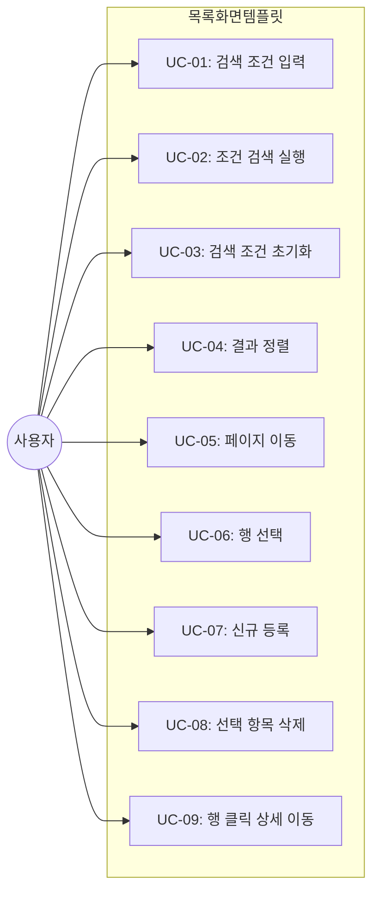
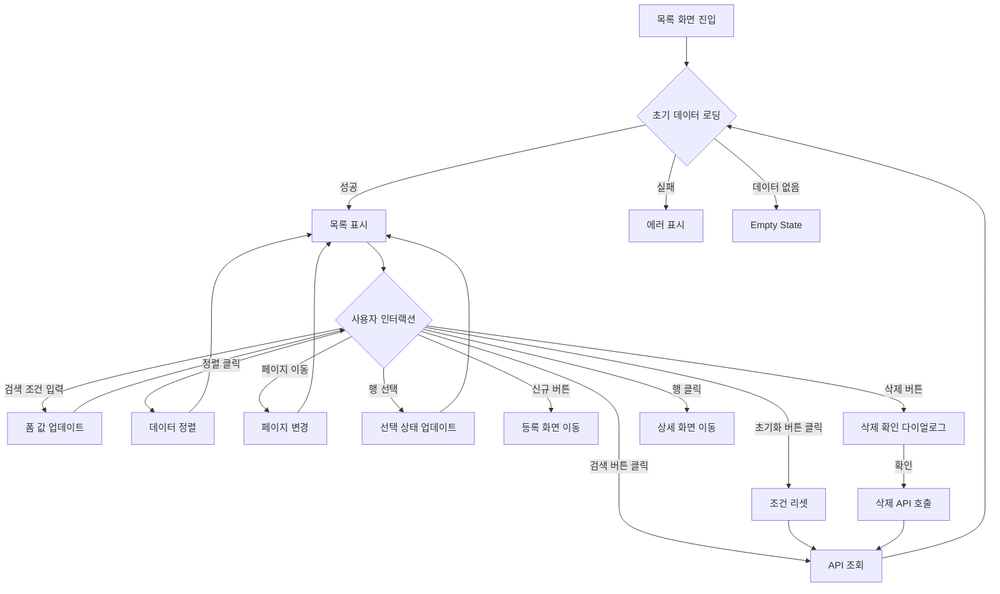

# TSK-06-01 - 목록(조회) 화면 템플릿 설계 문서

## 문서 정보

| 항목 | 내용 |
|------|------|
| Task ID | TSK-06-01 |
| 문서 버전 | 2.1 |
| 작성일 | 2026-01-21 |
| 상태 | 리뷰 반영 완료 |
| 카테고리 | development |

---

## 1. 개요

### 1.1 배경 및 문제 정의

**현재 상황:**
- MES Portal에서 데이터 목록을 조회하는 화면이 여러 곳에서 필요함 (작업 지시, 생산 실적, 품질 검사, 설비 관리 등)
- 각 화면마다 검색 조건, 그리드, 버튼 영역을 개별 구현하면 일관성 없는 UX와 코드 중복 발생
- 검색 조건 영역은 텍스트, 셀렉트, 날짜 등 다양한 필드 타입을 포함해야 하지만 표준화된 레이아웃이 없음
- 검색 조건에서 API 파라미터로 변환하는 로직이 화면마다 다르게 구현됨

**해결하려는 문제:**
- 목록(조회) 화면의 표준 템플릿 부재로 인한 개발 생산성 저하
- 화면별 일관성 부족 (검색 버튼 위치, 그리드 레이아웃 등)
- 검색 조건 -> API 파라미터 변환 로직의 표준화 필요

### 1.2 목적 및 기대 효과

**목적:**
- 재사용 가능한 목록(조회) 화면 템플릿 컴포넌트 제공 (ListTemplate)
- 검색 조건, 그리드, 액션 버튼 영역의 표준 레이아웃 정의
- 다양한 검색 필드 타입 지원 (텍스트, 셀렉트, 날짜, 날짜 범위 등)
- TSK-05-04 DataTable 컴포넌트와의 통합

**기대 효과:**
- 사용자 관점: 모든 목록 화면에서 일관된 조작 경험 (검색 위치, 버튼 배치 등)
- 개발자 관점: 새 목록 화면 개발 시간 50% 이상 단축, 코드 중복 제거
- 유지보수 관점: 템플릿 수정 시 모든 목록 화면에 일괄 적용

### 1.3 범위

**포함:**
- ListTemplate 컴포넌트 구현
- 검색 조건 영역 (Card 기반, 다양한 필드 타입 지원)
- 그리드 영역 (TSK-05-04 DataTable 연동)
- 액션 버튼 영역 (검색/초기화, 신규/삭제 등)
- 검색 조건 -> API 파라미터 변환 유틸리티
- 검색 조건 상태 관리 훅

**제외:**
- 개별 화면의 비즈니스 로직 (사용처에서 구현)
- 실제 API 연동 (props로 핸들러 전달)
- 컬럼별 필터링 (향후 DataTable 확장)

### 1.4 참조 문서

| 문서 | 경로 | 관련 섹션 |
|------|------|----------|
| PRD | `.orchay/projects/mes-portal/prd.md` | 4.1.1 화면 템플릿 - 목록(조회) 화면 |
| TRD | `.orchay/projects/mes-portal/trd.md` | 7. PRD 요구사항 - 기본 템플릿 |
| TSK-05-04 | `.orchay/projects/mes-portal/tasks/TSK-05-04/010-design.md` | DataTable 공통 기능 |
| TSK-05-05 | `.orchay/projects/mes-portal/tasks/TSK-05-05/010-design.md` | 날짜 선택기 |

---

## 2. 사용자 분석

### 2.1 대상 사용자

| 사용자 유형 | 특성 | 주요 니즈 |
|------------|------|----------|
| 공장장/관리자 | 데이터 조회 빈번, 다양한 조건으로 필터링 | 빠른 검색, 복합 조건 조합, 결과 내보내기 |
| 생산 담당자 | 특정 조건(라인, 날짜)으로 조회 | 조건별 필터링, 오늘 날짜 기본 선택, 페이지네이션 |
| 품질 담당자 | 기간별 품질 데이터 조회 | 날짜 범위 선택, 상태별 필터, 정렬 |
| 설비 담당자 | 설비별 이력 조회 | 설비 선택, 기간 조회, 빠른 검색 |
| 개발자 | 템플릿 사용자 | 간편한 Props API, 커스터마이징 용이, 타입 안전성 |

### 2.2 사용자 페르소나

**페르소나 1: 김철수 (생산 관리자)**
- 역할: 생산 실적 조회 및 분석
- 목표: 다양한 조건(라인, 제품, 기간)으로 빠르게 데이터 필터링
- 불만: 검색 조건이 복잡하면 사용하기 어려움, 조건 초기화가 번거로움
- 시나리오: 날짜 범위 + 라인 + 상태 조건으로 생산 실적 조회 후 정렬

**페르소나 2: 박영희 (품질 담당자)**
- 역할: 품질 검사 이력 조회
- 목표: 최근 7일간 불량 발생 건 필터링
- 불만: 매번 날짜를 수동 입력해야 함
- 시나리오: 날짜 프리셋(최근 7일) 선택 후 불량 상태 필터링

**페르소나 3: 이개발 (프론트엔드 개발자)**
- 역할: 새로운 목록 화면 개발
- 목표: 템플릿을 사용하여 빠르게 목록 화면 구현
- 불만: 매번 검색 폼, 테이블, 페이징 로직을 반복 구현
- 시나리오: ListTemplate에 columns, dataSource, searchFields만 전달하여 화면 완성

---

## 3. 유즈케이스

### 3.1 유즈케이스 다이어그램



### 3.2 유즈케이스 상세

#### UC-01: 검색 조건 입력

| 항목 | 내용 |
|------|------|
| 액터 | 일반 사용자 |
| 목적 | 데이터 필터링을 위한 조건 값 입력 |
| 사전 조건 | 목록 화면 진입, 검색 조건 영역 표시 |
| 사후 조건 | 검색 조건 값이 폼 상태에 저장됨 |
| 트리거 | 검색 조건 필드에 값 입력 |

**기본 흐름:**
1. 사용자가 검색 조건 영역의 입력 필드를 확인한다
2. 텍스트 필드에 검색어를 입력한다
3. 셀렉트 필드에서 옵션을 선택한다
4. 날짜 필드에서 날짜를 선택한다
5. 입력한 값들이 폼 상태에 저장된다

**대안 흐름:**
- 2a. 날짜 범위 선택 시:
  - 시작일과 종료일을 각각 선택한다
  - 또는 프리셋(오늘, 최근 7일 등)을 클릭한다
- 2b. 셀렉트 필드에서 검색 기능 사용 시:
  - 옵션 목록에서 키워드로 검색하여 선택한다

**지원하는 검색 필드 타입:**

| 필드 타입 | Ant Design 컴포넌트 | 용도 |
|----------|-------------------|------|
| text | Input | 키워드 검색 (이름, 코드 등) |
| select | Select | 단일 옵션 선택 (상태, 유형 등) |
| multiSelect | Select (mode="multiple") | 다중 옵션 선택 |
| date | DatePicker | 단일 날짜 선택 |
| dateRange | RangePicker | 날짜 범위 선택 |
| number | InputNumber | 숫자 범위 검색 |
| checkbox | Checkbox | 불리언 조건 |

#### UC-02: 조건 검색 실행

| 항목 | 내용 |
|------|------|
| 액터 | 일반 사용자 |
| 목적 | 입력한 조건으로 데이터 필터링 |
| 사전 조건 | 검색 조건 입력 완료 (선택적) |
| 사후 조건 | 필터링된 데이터가 그리드에 표시됨 |
| 트리거 | 검색 버튼 클릭 또는 Enter 키 |

**기본 흐름:**
1. 사용자가 검색 버튼을 클릭한다 (또는 Enter 키)
2. 시스템이 검색 버튼을 로딩 상태로 표시한다
3. 시스템이 폼 값을 API 파라미터로 변환한다
4. onSearch 콜백이 호출된다 (부모 컴포넌트에서 API 호출)
5. 데이터 로딩이 완료되면 그리드가 갱신된다
6. 페이지가 첫 페이지로 이동한다

**검색 조건 -> API 파라미터 변환 규칙:**

| 필드 타입 | 폼 값 | API 파라미터 |
|----------|------|-------------|
| text | "검색어" | `{ keyword: "검색어" }` |
| select | "value1" | `{ status: "value1" }` |
| multiSelect | ["v1", "v2"] | `{ types: "v1,v2" }` |
| date | Dayjs | `{ date: "2026-01-20" }` |
| dateRange | [Dayjs, Dayjs] | `{ startDate: "2026-01-14", endDate: "2026-01-20" }` |
| number | 100 | `{ quantity: 100 }` |

#### UC-03: 검색 조건 초기화

| 항목 | 내용 |
|------|------|
| 액터 | 일반 사용자 |
| 목적 | 모든 검색 조건을 기본값으로 리셋 |
| 사전 조건 | 검색 조건이 입력된 상태 |
| 사후 조건 | 모든 조건이 기본값으로 복원됨 |
| 트리거 | 초기화 버튼 클릭 |

**기본 흐름:**
1. 사용자가 초기화 버튼을 클릭한다
2. 시스템이 모든 검색 조건을 기본값으로 리셋한다
3. 시스템이 자동으로 검색을 실행한다 (선택적: autoSearchOnReset prop)
4. 그리드에 전체 데이터 (또는 기본 조건 데이터)가 표시된다

**대안 흐름:**
- 2a. autoSearchOnReset이 false인 경우:
  - 조건만 리셋하고 검색은 실행하지 않는다
  - 사용자가 직접 검색 버튼을 클릭해야 함

#### UC-04: 결과 정렬

| 항목 | 내용 |
|------|------|
| 액터 | 일반 사용자 |
| 목적 | 조회 결과를 특정 컬럼 기준으로 정렬 |
| 사전 조건 | 그리드에 데이터가 표시됨 |
| 사후 조건 | 정렬된 데이터가 표시됨 |
| 트리거 | 컬럼 헤더 클릭 |

**기본 흐름:**
1. 사용자가 정렬하려는 컬럼 헤더를 클릭한다
2. 시스템이 해당 컬럼 기준 오름차순으로 정렬한다
3. 컬럼 헤더에 정렬 방향 아이콘이 표시된다
4. 동일 컬럼 재클릭 시 내림차순 -> 정렬 해제 순으로 토글

**정렬 모드:**

| 모드 | 설명 | 설정 |
|------|------|------|
| 클라이언트 정렬 | 현재 페이지 데이터만 정렬 | sortMode="client" (기본) |
| 서버 정렬 | onSort 콜백 호출하여 서버에서 정렬 | sortMode="server" |

#### UC-05: 페이지 이동

| 항목 | 내용 |
|------|------|
| 액터 | 일반 사용자 |
| 목적 | 대량 데이터를 페이지 단위로 탐색 |
| 사전 조건 | 데이터가 한 페이지 크기를 초과함 |
| 사후 조건 | 선택한 페이지의 데이터가 표시됨 |
| 트리거 | 페이지네이션 컨트롤 조작 |

**기본 흐름:**
1. 사용자가 페이지 번호를 클릭한다
2. 시스템이 해당 페이지의 데이터를 로드한다 (또는 클라이언트에서 슬라이싱)
3. 그리드에 해당 페이지 데이터가 표시된다
4. 현재 페이지 번호가 강조 표시된다

#### UC-06: 행 선택

| 항목 | 내용 |
|------|------|
| 액터 | 일반 사용자 |
| 목적 | 삭제, 일괄 처리 등을 위한 행 선택 |
| 사전 조건 | rowSelection이 활성화됨 |
| 사후 조건 | 선택된 행이 하이라이트되고 개수 표시 |
| 트리거 | 체크박스 클릭 |

**기본 흐름:**
1. 사용자가 행의 체크박스를 클릭한다
2. 시스템이 해당 행을 선택 목록에 추가한다
3. 선택된 행이 하이라이트 표시된다
4. 그리드 상단에 "N건 선택됨" 표시
5. 삭제 버튼이 활성화된다

**대안 흐름:**
- 1a. 헤더 체크박스 클릭 시:
  - 현재 페이지 전체 선택/해제

#### UC-07: 신규 등록

| 항목 | 내용 |
|------|------|
| 액터 | 일반 사용자 |
| 목적 | 새로운 데이터 등록 화면으로 이동 |
| 사전 조건 | onAdd prop이 설정됨 |
| 사후 조건 | 등록 화면으로 이동 또는 모달 표시 |
| 트리거 | 신규 버튼 클릭 |

**기본 흐름:**
1. 사용자가 [+ 신규] 버튼을 클릭한다
2. onAdd 콜백이 호출된다
3. 부모 컴포넌트에서 등록 화면 이동 또는 모달 표시

#### UC-08: 선택 항목 삭제

| 항목 | 내용 |
|------|------|
| 액터 | 일반 사용자 |
| 목적 | 선택한 항목들을 삭제 |
| 사전 조건 | 1개 이상의 행이 선택됨, onDelete prop 설정, **삭제 권한 보유** |
| 사후 조건 | 선택된 항목이 삭제됨 |
| 트리거 | 삭제 버튼 클릭 |

**기본 흐름:**
1. 사용자가 삭제할 행들을 체크박스로 선택한다
2. **시스템이 사용자의 삭제 권한을 확인한다 (permissions.canDelete)**
3. 사용자가 [삭제] 버튼을 클릭한다
4. 시스템이 확인 다이얼로그를 표시한다: "N건의 항목을 삭제하시겠습니까?"
5. 사용자가 [확인]을 클릭한다
6. onDelete 콜백이 선택된 행 목록과 함께 호출된다
7. 삭제 성공 시 그리드가 갱신된다

**예외 흐름:**
- 2a. 삭제 권한이 없는 경우 (permissions.canDelete === false):
  - 삭제 버튼이 비활성화 상태 (disabled)
  - 또는 삭제 버튼이 화면에 표시되지 않음
- 3a. 선택된 행이 없는 경우:
  - 삭제 버튼이 비활성화 상태 (disabled)
- 5a. 사용자가 [취소]를 클릭하면:
  - 삭제가 취소되고 다이얼로그가 닫힘

#### UC-09: 행 클릭 상세 이동

| 항목 | 내용 |
|------|------|
| 액터 | 일반 사용자 |
| 목적 | 특정 행의 상세 정보 확인 |
| 사전 조건 | onRowClick prop이 설정됨 |
| 사후 조건 | 상세 화면으로 이동 또는 상세 패널 표시 |
| 트리거 | 테이블 행 클릭 (체크박스 영역 제외) |

**기본 흐름:**
1. 사용자가 테이블 행을 클릭한다 (체크박스 영역 제외)
2. onRowClick 콜백이 해당 행 데이터와 함께 호출된다
3. 부모 컴포넌트에서 상세 화면 이동 또는 사이드 패널 표시

---

## 4. 사용자 시나리오

### 4.1 시나리오 1: 생산 실적 조회 (복합 조건 검색)

**상황 설명:**
김철수 생산 관리자가 이번 주 A라인의 완료된 생산 실적을 조회하려 한다.

**단계별 진행:**

| 단계 | 사용자 행동 | 시스템 반응 | 사용자 기대 |
|------|-----------|------------|------------|
| 1 | 생산 실적 목록 화면 진입 | 기본 조건(오늘)으로 데이터 표시 | 목록 화면 정상 로드 |
| 2 | 날짜 범위에서 "이번 주" 프리셋 클릭 | 시작일~종료일 자동 설정 | 날짜 입력 간소화 |
| 3 | 라인 셀렉트에서 "A라인" 선택 | 선택값 표시 | 옵션 목록에서 쉽게 선택 |
| 4 | 상태 셀렉트에서 "완료" 선택 | 선택값 표시 | 상태 필터링 |
| 5 | [검색] 버튼 클릭 | 로딩 후 필터링된 데이터 표시 | 3초 이내 결과 확인 |
| 6 | "생산량" 컬럼 헤더 클릭 | 내림차순 정렬 | 높은 생산량 순으로 확인 |
| 7 | 특정 행 클릭 | 상세 화면으로 이동 | 상세 정보 확인 |

**성공 조건:**
- 검색 조건이 정확히 적용됨 (날짜 + 라인 + 상태)
- 3초 이내 결과 표시
- 정렬이 즉시 반영됨

### 4.2 시나리오 2: 검색 조건 초기화

**상황 설명:**
박영희 품질 담당자가 여러 조건으로 검색하다가 전체 데이터를 다시 보고 싶다.

**단계별 진행:**

| 단계 | 사용자 행동 | 시스템 반응 | 사용자 기대 |
|------|-----------|------------|------------|
| 1 | 여러 조건 입력 후 검색 | 필터링된 결과 10건 표시 | 조건 적용 확인 |
| 2 | [초기화] 버튼 클릭 | 모든 조건 기본값으로 리셋 | 조건 즉시 초기화 |
| 3 | (자동 검색 설정 시) | 전체 데이터 재조회 | 전체 목록 확인 |

**성공 조건:**
- 모든 검색 필드가 기본값으로 복원
- 초기화 후 즉시 또는 검색 클릭 시 전체 데이터 표시

### 4.3 시나리오 3: 다중 항목 삭제

**상황 설명:**
관리자가 테스트 데이터 3건을 선택하여 일괄 삭제하려 한다.

**단계별 진행:**

| 단계 | 사용자 행동 | 시스템 반응 | 사용자 기대 |
|------|-----------|------------|------------|
| 1 | 삭제할 3개 행의 체크박스 클릭 | 체크 표시 + "3건 선택됨" 표시 | 선택 상태 확인 |
| 2 | [삭제] 버튼 클릭 | 확인 다이얼로그: "3건의 항목을 삭제하시겠습니까?" | 실수 방지 확인 |
| 3 | [확인] 클릭 | 로딩 후 삭제 완료, 그리드 갱신 | 삭제 결과 확인 |
| 4 | - | "삭제되었습니다" 토스트 메시지 | 작업 완료 인지 |

**성공 조건:**
- 선택 개수가 정확히 표시됨
- 확인 다이얼로그로 실수 방지
- 삭제 후 목록 자동 갱신

### 4.4 시나리오 4: 검색 결과 없음

**상황 설명:**
사용자가 존재하지 않는 조건으로 검색하여 결과가 0건인 경우

**단계별 진행:**

| 단계 | 사용자 행동 | 시스템 반응 | 복구 방법 |
|------|-----------|------------|----------|
| 1 | 특정 조건 입력 후 검색 | 로딩 후 Empty State 표시 | - |
| 2 | Empty State 메시지 확인 | "검색 결과가 없습니다" + [조건 초기화] 버튼 | 조건 변경 안내 |
| 3 | [조건 초기화] 클릭 | 조건 리셋 + 전체 데이터 표시 | 다시 검색 |

---

## 5. 화면 설계

### 5.1 화면 흐름도



### 5.2 화면별 상세

#### 화면 1: 목록(조회) 화면 템플릿 (ListTemplate)

**화면 목적:**
데이터 목록 조회를 위한 표준 레이아웃 제공. 검색 조건, 그리드, 액션 버튼을 일관된 구조로 배치.

**진입 경로:**
- 사이드바 메뉴에서 목록 화면 클릭
- MDI 탭으로 열림
- URL 직접 접근

**와이어프레임:**
```
┌─────────────────────────────────────────────────────────────────────────────────┐
│                                                                                 │
│  ┌───────────────────────────────────────────────────────────────────────────┐  │
│  │  검색 조건 영역 (Card)                                                    │  │
│  │  ┌─────────────────────────────────────────────────────────────────────┐  │  │
│  │  │  검색 폼 (Form) - 반응형 그리드 레이아웃                              │  │  │
│  │  │                                                                     │  │  │
│  │  │  ┌──────────────┐ ┌──────────────┐ ┌──────────────┐ ┌─────────────┐ │  │  │
│  │  │  │ 키워드       │ │ 상태 ▼      │ │ 유형 ▼      │ │ 담당자 ▼    │ │  │  │
│  │  │  │ [텍스트입력] │ │ [전체]      │ │ [전체]      │ │ [전체]      │ │  │  │
│  │  │  └──────────────┘ └──────────────┘ └──────────────┘ └─────────────┘ │  │  │
│  │  │                                                                     │  │  │
│  │  │  ┌──────────────────────────────────────┐ ┌──────────────────────┐ │  │  │
│  │  │  │ 기간 📅                               │ │ 라인 ▼               │ │  │  │
│  │  │  │ [2026-01-14 ~ 2026-01-20]            │ │ [전체]               │ │  │  │
│  │  │  │ [오늘][최근7일][이번주][이번달]        │ │                      │ │  │  │
│  │  │  └──────────────────────────────────────┘ └──────────────────────┘ │  │  │
│  │  │                                                                     │  │  │
│  │  └─────────────────────────────────────────────────────────────────────┘  │  │
│  │                                                                            │  │
│  │                                              [초기화]  [🔍 검색]          │  │
│  └───────────────────────────────────────────────────────────────────────────┘  │
│                                                                                 │
│  ┌───────────────────────────────────────────────────────────────────────────┐  │
│  │  그리드 영역 (Card)                                                       │  │
│  │  ┌─────────────────────────────────────────────────────────────────────┐  │  │
│  │  │  툴바 영역                                                          │  │  │
│  │  │  [+ 신규]  [🗑️ 삭제]                   3건 선택됨 │ 총 125건       │  │  │
│  │  └─────────────────────────────────────────────────────────────────────┘  │  │
│  │                                                                            │  │
│  │  ┌─────────────────────────────────────────────────────────────────────┐  │  │
│  │  │  DataTable (TSK-05-04)                                              │  │  │
│  │  │  ┌────┬────────────┬──────────┬──────────┬──────────┬─────────────┐ │  │  │
│  │  │  │ ☐  │ 작업번호 ▲ │ 제품명   │ 상태     │ 라인     │ 생산일      │ │  │  │
│  │  │  │    │ ‖          │ ‖        │ ‖        │ ‖        │ ‖           │ │  │  │
│  │  │  ├────┼────────────┼──────────┼──────────┼──────────┼─────────────┤ │  │  │
│  │  │  │ ☑  │ WO-001     │ 제품A    │ 완료     │ A라인    │ 2026-01-20  │ │  │  │
│  │  │  ├────┼────────────┼──────────┼──────────┼──────────┼─────────────┤ │  │  │
│  │  │  │ ☑  │ WO-002     │ 제품B    │ 진행중   │ B라인    │ 2026-01-20  │ │  │  │
│  │  │  ├────┼────────────┼──────────┼──────────┼──────────┼─────────────┤ │  │  │
│  │  │  │ ☐  │ WO-003     │ 제품C    │ 대기     │ A라인    │ 2026-01-19  │ │  │  │
│  │  │  ├────┼────────────┼──────────┼──────────┼──────────┼─────────────┤ │  │  │
│  │  │  │ ☑  │ WO-004     │ 제품A    │ 완료     │ C라인    │ 2026-01-19  │ │  │  │
│  │  │  ├────┼────────────┼──────────┼──────────┼──────────┼─────────────┤ │  │  │
│  │  │  │ ☐  │ WO-005     │ 제품D    │ 진행중   │ B라인    │ 2026-01-18  │ │  │  │
│  │  │  └────┴────────────┴──────────┴──────────┴──────────┴─────────────┘ │  │  │
│  │  └─────────────────────────────────────────────────────────────────────┘  │  │
│  │                                                                            │  │
│  │  ┌─────────────────────────────────────────────────────────────────────┐  │  │
│  │  │  페이지네이션                                                        │  │  │
│  │  │  총 125건              │ [10 ▼] 건/페이지    [<] 1 2 3 4 5 ... [>]  │  │  │
│  │  └─────────────────────────────────────────────────────────────────────┘  │  │
│  └───────────────────────────────────────────────────────────────────────────┘  │
│                                                                                 │
└─────────────────────────────────────────────────────────────────────────────────┘

범례:
▼ : 드롭다운 (셀렉트)
📅 : 날짜 선택기 아이콘
▲ : 오름차순 정렬 표시
‖ : 컬럼 리사이즈 핸들
☐ : 미선택 체크박스
☑ : 선택된 체크박스
```

**화면 요소 설명:**

| 영역 | 설명 | 사용자 인터랙션 |
|------|------|----------------|
| 검색 조건 Card | 검색 조건 입력 폼 | 조건 입력 후 검색/초기화 |
| 검색 폼 | 반응형 그리드 레이아웃 (24 column) | 다양한 필드 타입 입력 |
| 초기화 버튼 | 모든 조건 기본값 복원 | 클릭 시 리셋 |
| 검색 버튼 | Primary 버튼, 검색 아이콘 | 클릭 또는 Enter 시 검색 |
| 툴바 영역 | 액션 버튼 + 선택/총건수 표시 | 신규/삭제 액션 |
| 신규 버튼 | + 아이콘, Primary 스타일 | 클릭 시 등록 화면 |
| 삭제 버튼 | 휴지통 아이콘, Danger 스타일 | 선택 후 클릭 시 삭제 |
| 선택 건수 | "N건 선택됨" 텍스트 | 선택 상태 정보 표시 |
| 총 건수 | "총 N건" 텍스트 | 전체 데이터 건수 표시 |
| DataTable | TSK-05-04 공통 테이블 컴포넌트 | 정렬, 선택, 클릭 등 |
| 페이지네이션 | 페이지 이동 + 페이지 크기 선택 | 페이지 탐색 |

### 5.3 검색 조건 영역 상세

#### 필드 레이아웃 규칙

| 화면 크기 | 컬럼 수 | span 값 | 설명 |
|----------|--------|---------|------|
| XL (1600px+) | 4열 | span={6} | 넓은 화면에서 최대 4개 필드 |
| LG (1200-1599px) | 4열 | span={6} | 일반 데스크톱 |
| MD (992-1199px) | 3열 | span={8} | 작은 데스크톱/큰 태블릿 |
| SM (768-991px) | 2열 | span={12} | 태블릿 |
| XS (767px-) | 1열 | span={24} | 모바일 |

#### 필드 타입별 와이어프레임

**텍스트 입력 (Input):**
```
┌─────────────────────────┐
│ 라벨                    │
│ ┌─────────────────────┐ │
│ │ 플레이스홀더...      │ │
│ └─────────────────────┘ │
└─────────────────────────┘
```

**셀렉트 (Select):**
```
┌─────────────────────────┐
│ 라벨                    │
│ ┌─────────────────────┐ │
│ │ 선택값         ▼    │ │
│ └─────────────────────┘ │
│  ┌───────────────────┐  │ (열린 상태)
│  │ 옵션 1            │  │
│  │ 옵션 2 (선택됨)   │  │
│  │ 옵션 3            │  │
│  └───────────────────┘  │
└─────────────────────────┘
```

**날짜 범위 (RangePicker):**
```
┌─────────────────────────────────────────────────┐
│ 라벨                                            │
│ ┌─────────────────────────────────────────────┐ │
│ │ 2026-01-14 ~ 2026-01-20              📅     │ │
│ └─────────────────────────────────────────────┘ │
│ [오늘] [최근 7일] [이번 주] [이번 달]           │
└─────────────────────────────────────────────────┘
```

### 5.4 반응형 동작

| 화면 크기 | 레이아웃 변화 | 사용자 경험 |
|----------|--------------|------------|
| 데스크톱 (1024px+) | 검색 조건 4열, 버튼 우측 정렬 | 한 눈에 모든 조건 확인 |
| 태블릿 (768-1023px) | 검색 조건 2열, 버튼 우측 정렬 | 스크롤 최소화 |
| 모바일 (767px-) | 검색 조건 1열, 버튼 전체 너비, 그리드 가로 스크롤 | 터치 친화적 |

### 5.5 Empty State 디자인

```
┌─────────────────────────────────────────────────────────────────────────────────┐
│                                                                                 │
│                                    📋                                           │
│                                                                                 │
│                          검색 결과가 없습니다                                    │
│                  검색 조건을 변경하거나 필터를 초기화해보세요                     │
│                                                                                 │
│                            [조건 초기화]                                        │
│                                                                                 │
└─────────────────────────────────────────────────────────────────────────────────┘
```

---

## 6. 인터랙션 설계

### 6.1 사용자 액션과 피드백

| 사용자 액션 | 즉각 피드백 | 결과 피드백 | 에러 피드백 |
|------------|-----------|------------|------------|
| 검색 버튼 클릭 | 버튼 로딩 상태 (스피너) | 그리드 데이터 갱신 | 조회 실패 토스트 |
| 초기화 버튼 클릭 | 모든 필드 값 초기화 | (autoSearch 시) 데이터 갱신 | - |
| 정렬 헤더 클릭 | 정렬 아이콘 변경 | 정렬된 데이터 표시 | - |
| 페이지 이동 클릭 | 페이지 번호 강조 | 해당 페이지 데이터 표시 | 로딩 실패 시 에러 |
| 체크박스 클릭 | 체크 상태 토글 | 선택 건수 업데이트 | - |
| 신규 버튼 클릭 | 버튼 눌림 효과 | 등록 화면 이동 | - |
| 삭제 버튼 클릭 | 확인 다이얼로그 표시 | 삭제 후 "삭제되었습니다" 토스트 | 삭제 실패 에러 |
| 행 클릭 | 행 하이라이트 | 상세 화면 이동 | - |
| Enter 키 (폼 내) | - | 검색 실행 | - |

### 6.2 상태별 화면 변화

| 상태 | 화면 표시 | 사용자 안내 |
|------|----------|------------|
| 초기 로딩 | 검색 영역 + 테이블 Skeleton | "데이터를 불러오는 중..." |
| 데이터 로드 성공 | 검색 영역 + 데이터 테이블 | - |
| 데이터 없음 | 검색 영역 + Empty State | "검색 결과가 없습니다" |
| 검색 중 | 검색 버튼 로딩 + 테이블 로딩 오버레이 | "검색 중..." |
| 에러 발생 | 검색 영역 + Result(error) | "조회에 실패했습니다. 다시 시도해주세요." |
| N건 선택됨 | 툴바에 선택 건수 표시 | "N건 선택됨" |
| 삭제 확인 | Modal.confirm 다이얼로그 | "N건의 항목을 삭제하시겠습니까?" |

### 6.3 키보드/접근성

| 기능 | 키보드 단축키 | 스크린 리더 안내 |
|------|-------------|-----------------|
| 검색 실행 | Enter (폼 내에서) | "검색 버튼" |
| 포커스 이동 | Tab | 각 필드 라벨 안내 |
| 셀렉트 열기 | Space, Enter | "옵션 목록 열림" |
| 셀렉트 선택 | 화살표 키 + Enter | "옵션명 선택됨" |
| 체크박스 토글 | Space | "행 선택됨/해제됨" |
| 다이얼로그 닫기 | Escape | "다이얼로그 닫힘" |

---

## 7. 데이터 요구사항

### 7.1 필요한 데이터

| 데이터 | 설명 | 출처 | 용도 |
|--------|------|------|------|
| searchFields | 검색 필드 정의 배열 | 부모 컴포넌트 | 검색 폼 렌더링 |
| columns | 테이블 컬럼 정의 | 부모 컴포넌트 | DataTable 렌더링 |
| dataSource | 목록 데이터 | API 응답 / Props | 테이블 표시 |
| total | 전체 데이터 건수 | API 응답 | 페이지네이션 |
| loading | 로딩 상태 | 부모 컴포넌트 | 로딩 UI 표시 |

### 7.2 Props 인터페이스

```typescript
// 검색 필드 타입 정의
type SearchFieldType = 'text' | 'select' | 'multiSelect' | 'date' | 'dateRange' | 'number' | 'checkbox';

interface SearchFieldOption {
  label: string;
  value: string | number;
}

interface SearchFieldDefinition {
  // 기본 속성
  name: string;                              // 필드명 (API 파라미터 키)
  label: string;                             // 라벨
  type: SearchFieldType;                     // 필드 타입

  // 레이아웃
  span?: number;                             // 그리드 span (기본: 6)

  // 필드별 옵션
  placeholder?: string;                      // 플레이스홀더
  options?: SearchFieldOption[];             // select, multiSelect용 옵션
  defaultValue?: unknown;                    // 기본값

  // 날짜 관련
  showPresets?: boolean;                     // 날짜 프리셋 표시 (기본: true)
  disabledDate?: (date: Dayjs) => boolean;   // 비활성 날짜 함수

  // 검색 조건 변환
  paramName?: string;                        // API 파라미터명 (name과 다른 경우)
  transformValue?: (value: unknown) => unknown; // 값 변환 함수

  // 날짜 범위 -> API 파라미터 변환
  startParamName?: string;                   // 시작일 파라미터명 (dateRange용)
  endParamName?: string;                     // 종료일 파라미터명 (dateRange용)
}

// 권한 인터페이스 (SEC-001)
interface ListTemplatePermissions {
  canAdd?: boolean;                          // 신규 등록 권한 (기본: true)
  canDelete?: boolean;                       // 삭제 권한 (기본: true)
  canView?: boolean;                         // 조회 권한 (기본: true)
}

// ListTemplate Props
interface ListTemplateProps<T extends Record<string, unknown>> {
  // === 권한 관리 ===
  permissions?: ListTemplatePermissions;     // 권한 설정 (SEC-001)

  // === 검색 조건 영역 ===
  searchFields?: SearchFieldDefinition[];    // 검색 필드 정의
  initialValues?: Record<string, unknown>;   // 초기 검색 조건 값
  onSearch?: (params: Record<string, unknown>) => void; // 검색 콜백
  onReset?: () => void;                      // 초기화 콜백
  autoSearchOnReset?: boolean;               // 초기화 시 자동 검색 (기본: true)
  autoSearchOnMount?: boolean;               // 마운트 시 자동 검색 (기본: true)

  // 검색 영역 커스터마이징
  searchCardTitle?: string;                  // 검색 카드 제목 (기본: 없음)
  searchExtra?: ReactNode;                   // 검색 영역 추가 버튼
  hideSearchCard?: boolean;                  // 검색 카드 숨기기

  // === 테이블 영역 ===
  columns: ColumnType<T>[];                  // 테이블 컬럼 정의
  dataSource: T[];                           // 테이블 데이터
  loading?: boolean;                         // 로딩 상태
  rowKey: keyof T | ((record: T) => string); // 행 고유 키

  // 페이지네이션
  pagination?: TablePaginationConfig | false; // 페이지네이션 설정
  total?: number;                            // 전체 건수

  // 정렬
  sortMode?: 'client' | 'server';            // 정렬 모드 (기본: 'client')
  onSort?: (field: string, order: 'ascend' | 'descend' | null) => void;

  // 행 선택
  rowSelection?: TableRowSelection<T>;       // 행 선택 설정

  // === 액션 버튼 ===
  onAdd?: () => void;                        // 신규 버튼 클릭
  addButtonText?: string;                    // 신규 버튼 텍스트 (기본: '신규')
  onDelete?: (selectedRows: T[]) => Promise<void> | void; // 삭제 콜백
  deleteButtonText?: string;                 // 삭제 버튼 텍스트 (기본: '삭제')
  deleteConfirmMessage?: string | ((count: number) => string); // 삭제 확인 메시지

  // 추가 액션 버튼
  toolbarExtra?: ReactNode;                  // 툴바 추가 버튼

  // === 행 클릭 ===
  onRowClick?: (record: T) => void;          // 행 클릭 콜백

  // === 스타일 ===
  className?: string;
  style?: React.CSSProperties;
}
```

### 7.3 검색 조건 -> API 파라미터 변환 로직

```typescript
// 검색 입력값 Sanitization (SEC-002)
const MAX_SEARCH_LENGTH = 100;

function sanitizeSearchValue(value: unknown, fieldType: SearchFieldType): unknown {
  if (typeof value === 'string') {
    let sanitized = value.trim();
    // 최대 길이 제한
    sanitized = sanitized.substring(0, MAX_SEARCH_LENGTH);
    // 특수 제어 문자 제거
    sanitized = sanitized.replace(/[\x00-\x1F\x7F]/g, '');
    return sanitized;
  }
  // 숫자 타입 검증
  if (fieldType === 'number' && typeof value === 'number') {
    if (!Number.isFinite(value)) {
      return undefined;
    }
  }
  return value;
}

// 검색 조건 변환 유틸리티
function transformSearchParams(
  values: Record<string, unknown>,
  fields: SearchFieldDefinition[]
): Record<string, unknown> {
  const params: Record<string, unknown> = {};

  for (const field of fields) {
    let value = values[field.name];

    // 빈 값은 건너뜀
    if (value === undefined || value === null || value === '') {
      continue;
    }

    // 입력값 Sanitization 적용 (SEC-002)
    value = sanitizeSearchValue(value, field.type);
    if (value === undefined) {
      continue;
    }

    // 커스텀 변환 함수가 있으면 사용
    if (field.transformValue) {
      const transformed = field.transformValue(value);
      if (transformed !== undefined) {
        params[field.paramName || field.name] = transformed;
      }
      continue;
    }

    // 타입별 기본 변환
    switch (field.type) {
      case 'dateRange':
        // 날짜 범위 -> 시작일/종료일 분리
        if (Array.isArray(value) && value.length === 2) {
          const [startDate, endDate] = value as [Dayjs, Dayjs];
          params[field.startParamName || 'startDate'] = startDate.format('YYYY-MM-DD');
          params[field.endParamName || 'endDate'] = endDate.format('YYYY-MM-DD');
        }
        break;

      case 'date':
        // 단일 날짜 -> 문자열 변환
        params[field.paramName || field.name] = (value as Dayjs).format('YYYY-MM-DD');
        break;

      case 'multiSelect':
        // 다중 선택 -> 콤마 구분 문자열
        if (Array.isArray(value) && value.length > 0) {
          params[field.paramName || field.name] = value.join(',');
        }
        break;

      default:
        // 기본: 그대로 전달
        params[field.paramName || field.name] = value;
    }
  }

  return params;
}
```

### 7.4 필드 타입별 기본 검증 규칙 (SEC-004)

| 필드 타입 | 최대 길이 | 허용 패턴 | 검증 규칙 |
|----------|----------|----------|----------|
| text | 100자 | `[^\\x00-\\x1F\\x7F]*` | 제어 문자 제외, 공백 trim |
| select | - | 옵션 값 매칭 | 정의된 options 내 값만 허용 |
| multiSelect | - | 옵션 값 배열 | 정의된 options 내 값들만 허용 |
| date | - | YYYY-MM-DD | 유효한 날짜 형식 |
| dateRange | - | [YYYY-MM-DD, YYYY-MM-DD] | 시작일 <= 종료일 |
| number | - | 유한 숫자 | `Number.isFinite()`, 범위 검증 |
| checkbox | - | boolean | true/false만 허용 |

### 7.5 데이터 유효성 규칙

| 데이터 필드 | 규칙 | 위반 시 메시지 |
|------------|------|---------------|
| columns | 필수, 1개 이상 | "컬럼 정의가 필요합니다" |
| dataSource | 배열 타입 | "데이터는 배열이어야 합니다" |
| rowKey | 필수 | "rowKey가 필요합니다" |
| searchFields | 배열 타입 | 검색 영역 미표시 |

---

## 8. 비즈니스 규칙

### 8.1 핵심 규칙

| 규칙 ID | 규칙 설명 | 적용 상황 | 예외 |
|---------|----------|----------|------|
| BR-01 | 삭제 시 확인 다이얼로그 필수 | 삭제 버튼 클릭 | 없음 |
| BR-02 | 검색 조건은 페이지 이동 시 유지 | 페이지 변경, 정렬 | 초기화 클릭 시 리셋 |
| BR-03 | 선택 없이 삭제 버튼 비활성화 | 삭제 버튼 표시 | 선택된 행 있을 때 활성화 |
| BR-04 | 검색 조건 Enter 키로 검색 실행 | 폼 내 Enter 입력 | 없음 |
| BR-05 | 검색 시 첫 페이지로 이동 | 검색 버튼 클릭 | 없음 |
| BR-06 | 초기화 시 기본값으로 복원 | 초기화 버튼 클릭 | 없음 |
| BR-07 | 행 클릭 시 체크박스 영역 제외 | 행 클릭 이벤트 | 체크박스 클릭은 선택만 |
| BR-08 | 삭제 작업 전 권한 검증 필수 | 삭제 버튼 표시/클릭 | permissions.canDelete 확인 |

### 8.2 규칙 상세 설명

**BR-01: 삭제 시 확인 필수**

설명: 데이터 삭제는 되돌릴 수 없으므로 반드시 확인 다이얼로그를 표시한다.

예시:
- 단일 삭제: "해당 항목을 삭제하시겠습니까?"
- 다중 삭제: "3건의 항목을 삭제하시겠습니까?"

**BR-02: 검색 조건 유지**

설명: 사용자가 입력한 검색 조건은 페이지 이동이나 정렬 시에도 유지된다. 이는 사용자가 같은 조건 내에서 다른 페이지를 탐색할 때 편의성을 제공한다.

예시:
- 페이지 1에서 "완료" 상태로 검색 후 페이지 2로 이동 -> "완료" 조건 유지
- 정렬 변경 시에도 검색 조건 유지

**BR-05: 검색 시 첫 페이지 이동**

설명: 새로운 검색 조건으로 조회 시 결과 건수가 달라질 수 있으므로 항상 첫 페이지로 이동한다.

**BR-08: 삭제 작업 전 권한 검증 필수**

설명: 삭제 버튼 표시 및 클릭 시 사용자의 삭제 권한을 확인한다. 권한이 없는 경우 버튼을 비활성화하거나 숨긴다.

예시:
- permissions.canDelete === false: 삭제 버튼 비활성화 또는 미표시
- permissions.canDelete === true (기본): 삭제 버튼 정상 표시

---

## 8.3 보안 요구사항 (SEC-003)

> **주의**: 클라이언트 측 권한 검사는 UX 편의를 위한 것이며, 반드시 서버 측에서도 동일한 검증을 수행해야 합니다.

| 요구사항 ID | 설명 | 검증 위치 |
|------------|------|----------|
| SR-01 | 삭제 API는 서버 측에서 세션 기반 사용자 인증 필수 | 서버 (API 미들웨어) |
| SR-02 | 삭제 API는 서버 측에서 역할 기반 권한 검증 필수 | 서버 (API 미들웨어) |
| SR-03 | 삭제 대상 리소스에 대한 소유권/접근권 검증 필수 | 서버 (비즈니스 로직) |
| SR-04 | API 호출 시 CSRF 토큰 검증 (서버 설정에 따름) | 서버 (프레임워크) |

### 8.3.1 XSS 방어 가이드라인 (SEC-005)

**컬럼 render 함수 사용 시 주의사항:**

```typescript
// ❌ 위험: dangerouslySetInnerHTML 사용 금지
columns = [{
  render: (text) => <div dangerouslySetInnerHTML={{ __html: text }} />
}];

// ✅ 안전: React의 기본 텍스트 렌더링 사용
columns = [{
  render: (text) => <span>{text}</span>
}];

// ✅ 안전: 필요시 sanitization 라이브러리 사용
import DOMPurify from 'dompurify';
columns = [{
  render: (text) => <div dangerouslySetInnerHTML={{ __html: DOMPurify.sanitize(text) }} />
}];
```

**권장 사항:**
- dataSource 데이터는 신뢰할 수 없는 외부 입력으로 간주
- columns render 함수에서 HTML 직접 삽입 최소화
- 사용자 입력 데이터 표시 시 React의 기본 이스케이핑 활용

---

## 9. 에러 처리

### 9.1 예상 에러 상황

| 상황 | 원인 | 사용자 메시지 | 복구 방법 |
|------|------|--------------|----------|
| 조회 실패 | 네트워크 오류, 서버 오류 | "데이터를 불러오지 못했습니다" | 재시도 버튼 |
| 삭제 실패 | 서버 오류, 권한 없음 | "삭제에 실패했습니다" | 재시도 안내 |
| 페이지 오류 | 유효하지 않은 페이지 | 첫 페이지로 자동 이동 | 자동 복구 |
| 검색 조건 오류 | 잘못된 형식 입력 | 필드별 에러 메시지 | 값 수정 |

### 9.2 에러 표시 방식

| 에러 유형 | 표시 위치 | 표시 방법 |
|----------|----------|----------|
| 조회 실패 | 그리드 영역 | Result 컴포넌트 (status="error") + 재시도 버튼 |
| 삭제 실패 | 화면 상단 | message.error() 토스트 |
| 검색 조건 오류 | 해당 필드 하단 | Form.Item 에러 메시지 (빨간색) |
| 네트워크 오류 | 그리드 영역 | Alert 컴포넌트 + 재시도 버튼 |

---

## 10. 연관 문서

| 문서 | 경로 | 용도 |
|------|------|------|
| 요구사항 추적 매트릭스 | `025-traceability-matrix.md` | PRD -> 설계 -> 테스트 추적 |
| 테스트 명세서 | `026-test-specification.md` | 테스트 케이스 정의 |

---

## 11. 구현 범위

### 11.1 파일 구조

```
components/
├── templates/
│   ├── ListTemplate/
│   │   ├── index.tsx           # 메인 컴포넌트
│   │   ├── SearchForm.tsx      # 검색 폼 컴포넌트
│   │   ├── Toolbar.tsx         # 툴바 (액션 버튼) 컴포넌트
│   │   └── types.ts            # 타입 정의
lib/
├── hooks/
│   └── useListTemplate.ts      # 검색 상태 관리 훅
├── utils/
│   └── searchParams.ts         # 검색 조건 변환 유틸리티
```

### 11.2 영향받는 영역

| 영역 | 변경 내용 | 영향도 |
|------|----------|--------|
| components/templates/ListTemplate/ | 신규 생성 | 높음 |
| lib/hooks/useListTemplate.ts | 신규 생성 | 높음 |
| lib/utils/searchParams.ts | 신규 생성 | 중간 |
| 샘플 화면 (사용자 목록 등) | 템플릿 사용 | 중간 |

### 11.3 의존성

| 의존 항목 | 이유 | 상태 |
|----------|------|------|
| TSK-05-04 (DataTable 공통 기능) | 테이블 컴포넌트 사용 | 완료 |
| TSK-05-05 (날짜 선택기) | DatePicker, RangePicker 사용 | 완료 |
| Ant Design Form | 검색 폼 구현 | TRD 확인됨 |
| Ant Design Card | 레이아웃 컨테이너 | TRD 확인됨 |
| Ant Design Row/Col | 반응형 그리드 | TRD 확인됨 |
| Ant Design Modal | 삭제 확인 다이얼로그 | TRD 확인됨 |

### 11.4 사용할 Ant Design 컴포넌트

| 컴포넌트 | 용도 |
|----------|------|
| Card | 검색 영역, 그리드 영역 컨테이너 |
| Form, Form.Item | 검색 폼 |
| Row, Col | 반응형 그리드 레이아웃 |
| Input | 텍스트 검색 |
| Select | 셀렉트 검색 |
| DatePicker, RangePicker | 날짜 검색 |
| InputNumber | 숫자 검색 |
| Button | 검색, 초기화, 신규, 삭제 버튼 |
| Space | 버튼 그룹 간격 |
| Modal.confirm | 삭제 확인 다이얼로그 |
| message | 토스트 알림 |
| Empty | 검색 결과 없음 표시 |

### 11.5 제약 사항

| 제약 | 설명 | 대응 방안 |
|------|------|----------|
| 검색 폼 커스텀 | 복잡한 검색 조건은 searchFields로 표현 한계 | searchForm prop으로 커스텀 폼 전달 가능 |
| 서버 정렬/페이징 | 클라이언트 기본, 서버 정렬 시 콜백 필요 | sortMode, onSort prop 제공 |
| DataTable 의존 | TSK-05-04 완료 필요 | 의존성 관리 |

### 11.6 Server/Client Component 구분 (ARC-002)

> TRD에서 React 19 / Next.js 16 환경에서 `'use client'` 지침을 명시하고 있습니다.

| 컴포넌트 | 타입 | 사유 |
|----------|------|------|
| ListTemplate | Client Component | Ant Design 컴포넌트 사용, 상태 관리 |
| SearchForm | Client Component | Form 상태, 이벤트 핸들러 |
| Toolbar | Client Component | 버튼 클릭 이벤트 |
| 부모 페이지 컴포넌트 | Server Component (권장) | 데이터 페칭, 초기 렌더링 최적화 |

**권장 패턴:**
```typescript
// app/users/page.tsx (Server Component)
export default async function UsersPage() {
  const initialData = await fetchUsers(); // 서버에서 초기 데이터 페칭
  return <UserListClient initialData={initialData} />;
}

// components/UserListClient.tsx (Client Component)
'use client';
export function UserListClient({ initialData }: Props) {
  return <ListTemplate dataSource={initialData} ... />;
}
```

### 11.7 주요 data-testid 정의 (QA-004)

> 테스트 명세서(026-test-specification.md)에 전체 목록이 정의되어 있습니다. 구현 시 아래 주요 셀렉터를 적용하세요.

| data-testid | 요소 | 용도 |
|-------------|------|------|
| `list-template-container` | 템플릿 최상위 컨테이너 | 페이지 로드 확인 |
| `search-condition-card` | 검색 조건 Card 영역 | 검색 영역 표시 확인 |
| `search-btn` | 검색 버튼 | 검색 실행 |
| `reset-btn` | 초기화 버튼 | 조건 초기화 |
| `data-grid` | 데이터 그리드 영역 | 그리드 표시 확인 |
| `add-btn` | 신규 버튼 | 등록 화면 열기 |
| `delete-btn` | 삭제 버튼 | 선택 행 삭제 |
| `confirm-dialog` | 확인 다이얼로그 | 삭제 확인 등 |

---

## 12. 체크리스트

### 12.1 설계 완료 확인

- [x] 문제 정의 및 목적 명확화
- [x] 사용자 분석 완료
- [x] 유즈케이스 정의 완료
- [x] 사용자 시나리오 작성 완료
- [x] 화면 설계 완료 (와이어프레임)
- [x] 인터랙션 설계 완료
- [x] 데이터 요구사항 정의 완료
- [x] 비즈니스 규칙 정의 완료
- [x] 에러 처리 정의 완료

### 12.2 연관 문서 작성

- [x] 요구사항 추적 매트릭스 작성 (-> `025-traceability-matrix.md`)
- [x] 테스트 명세서 작성 (-> `026-test-specification.md`)

### 12.3 구현 준비

- [x] 구현 우선순위 결정
- [x] 의존성 확인 완료
- [x] 제약 사항 검토 완료

---

## 변경 이력

| 버전 | 일자 | 작성자 | 변경 내용 |
|------|------|--------|----------|
| 1.0 | 2026-01-20 | Claude | 최초 작성 |
| 2.0 | 2026-01-21 | Claude | 상세 설계 보강 - 검색 필드 타입, API 파라미터 변환 로직, Props 인터페이스 상세화, 와이어프레임 개선 |
| 2.1 | 2026-01-21 | Claude | 설계 리뷰 반영 - 권한 인터페이스 추가(SEC-001), 입력값 Sanitization(SEC-002), 보안 요구사항 섹션(SEC-003), 필드별 검증 규칙(SEC-004), XSS 방어 가이드라인(SEC-005), Server/Client 구분(ARC-002), data-testid 명시(QA-004) |
