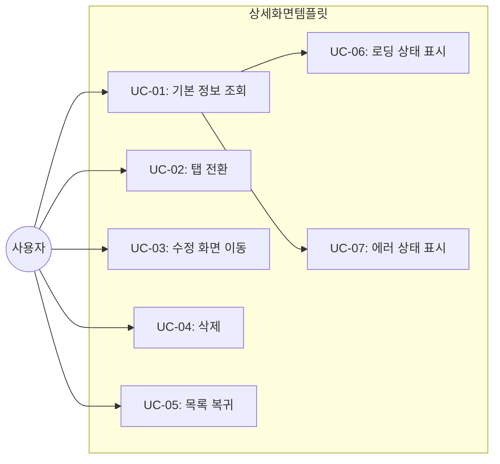
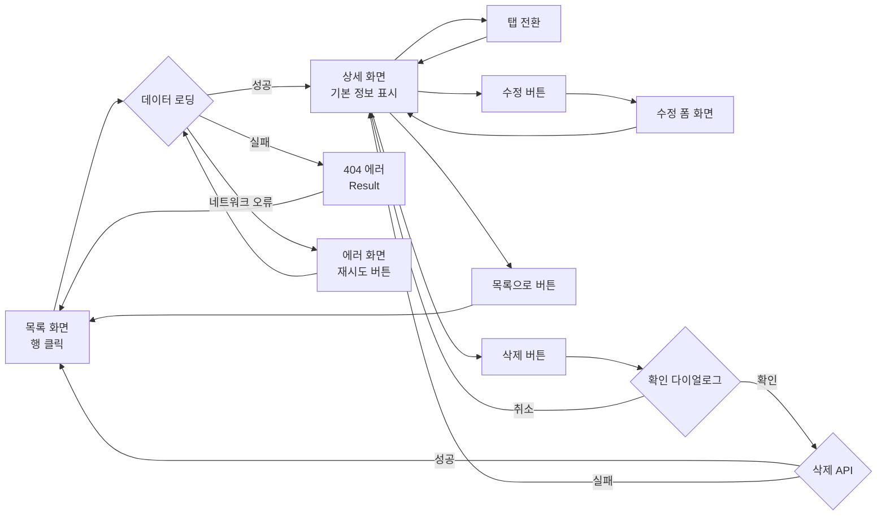
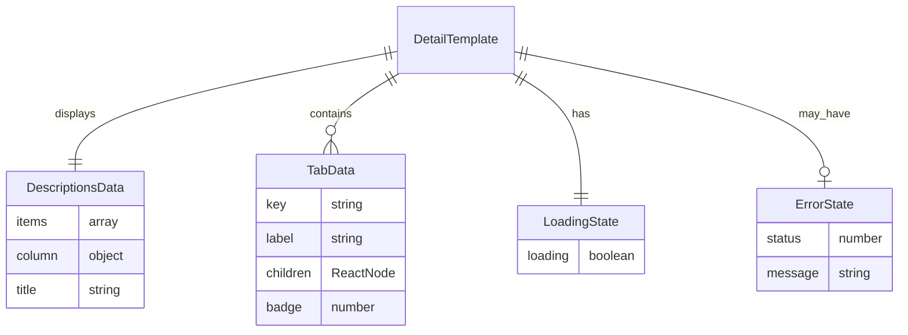

# TSK-06-02 - 상세 화면 템플릿 설계 문서

## 문서 정보

| 항목 | 내용 |
|------|------|
| Task ID | TSK-06-02 |
| 문서 버전 | 2.0 |
| 작성일 | 2026-01-21 |
| 상태 | 승인됨 |
| 카테고리 | development |

---

## 1. 개요

### 1.1 배경 및 문제 정의

**현재 상황:**
- MES Portal에서 단일 레코드의 상세 정보를 표시하는 화면이 여러 곳에서 필요함 (사용자 상세, 작업 지시 상세, 설비 상세 등)
- 각 상세 화면마다 기본 정보 표시, 관련 정보 탭, 수정/삭제 버튼 등의 UI 패턴이 반복됨
- 읽기 전용 정보 표시와 폼 모드 전환 로직이 화면별로 중복 구현됨

**해결하려는 문제:**
- 상세 화면의 표준 템플릿 부재로 인한 개발 생산성 저하
- 화면별 레이아웃 및 인터랙션 불일치
- 데이터 로딩, 에러 처리, 탭 전환 등의 공통 로직 중복

### 1.2 목적 및 기대 효과

**목적:**
- 재사용 가능한 상세 화면 템플릿 컴포넌트(DetailTemplate) 제공
- Ant Design Descriptions, Tabs 컴포넌트를 활용한 표준 레이아웃 정의
- 데이터 로딩, 탭 전환, 폼 모드 전환의 일관된 패턴 제공

**기대 효과:**
- 새로운 상세 화면 개발 시간 50% 이상 단축
- 모든 상세 화면에서 일관된 정보 표시 UX 제공
- 유지보수 용이성 및 코드 재사용성 향상

### 1.3 범위

**포함:**
- DetailTemplate 컴포넌트 구현 (components/templates/DetailTemplate.tsx)
- 기본 정보 영역 (Ant Design Descriptions 기반)
- 탭 기반 관련 정보 영역 (Ant Design Tabs 기반)
- 헤더 영역 (제목, 수정/삭제/목록 버튼)
- 로딩 상태 및 에러 상태 처리
- 삭제 확인 다이얼로그 통합
- 재사용 가능한 Props 인터페이스 정의

**제외:**
- 구체적인 도메인별 상세 화면 (예: 사용자 상세, 작업 지시 상세)
- 개별 화면의 데이터 로딩 로직 (템플릿 사용처에서 구현)
- 폼 화면 자체 (TSK-06-03에서 담당)

### 1.4 참조 문서

| 문서 | 경로 | 관련 섹션 |
|------|------|----------|
| PRD | `.orchay/projects/mes-portal/prd.md` | 4.1.1 화면 템플릿 - 상세 화면, 화면 템플릿 샘플 |
| TRD | `.orchay/projects/mes-portal/trd.md` | 7. PRD 요구사항 ↔ 기술 스택 매핑 |
| 목록 화면 템플릿 | `TSK-06-01/010-design.md` | 템플릿 구조 참조 |
| 폼 화면 템플릿 | `TSK-06-03/010-design.md` | 폼 모드 전환 연계 |

---

## 2. 사용자 분석

### 2.1 대상 사용자

| 사용자 유형 | 특성 | 주요 니즈 |
|------------|------|----------|
| 공장장/관리자 | 전체 현황 파악 필요, 의사결정권자 | 핵심 정보 빠른 파악, 관련 정보 탐색, 데이터 수정 접근 |
| 생산 담당자 | 특정 작업 지시 상세 확인 빈번 | 관련 생산 이력 확인, 수정 필요 시 빠른 전환 |
| 품질 담당자 | 품질 검사 데이터 상세 확인 | 이력 탭 확인, 관련 불량 정보 조회 |
| 개발자 | 템플릿 사용자 | 간편한 API, 커스터마이징 용이, 명확한 타입 정의 |

### 2.2 사용자 페르소나

**페르소나 1: 생산 관리자 박영희**
- 역할: 생산팀 팀장, 작업 지시 관리 담당
- 목표: 특정 작업 지시의 진행 상황 및 생산 이력 확인
- 불만: 정보가 여러 곳에 흩어져 있어 탐색에 시간 소요
- 시나리오: 목록에서 작업 지시 클릭 → 기본 정보 확인 → 생산 이력 탭 전환 → 필요 시 수정

**페르소나 2: 시스템 관리자 이철수**
- 역할: 사용자 및 권한 관리 담당
- 목표: 특정 사용자의 상세 정보 및 권한 확인
- 불만: 권한 변경을 위해 여러 단계를 거쳐야 함
- 시나리오: 사용자 목록에서 선택 → 기본 정보 확인 → 권한 탭 확인 → 수정 클릭

---

## 3. 유즈케이스

### 3.1 유즈케이스 다이어그램



### 3.2 유즈케이스 상세

#### UC-01: 기본 정보 조회

| 항목 | 내용 |
|------|------|
| 액터 | 일반 사용자 |
| 목적 | 단일 레코드의 상세 정보 확인 |
| 사전 조건 | 목록에서 행 선택 또는 URL 직접 접근 (예: /users/123) |
| 사후 조건 | 상세 정보가 Descriptions 형태로 표시됨 |
| 트리거 | 화면 진입 (URL 라우팅) |

**기본 흐름:**
1. 사용자가 목록 화면에서 행을 클릭하거나 URL로 직접 접근한다
2. 시스템이 해당 ID의 데이터를 API에서 조회한다
3. 로딩 중에는 Skeleton이 표시된다
4. 데이터 조회가 완료되면 기본 정보가 Descriptions 컴포넌트로 표시된다
5. 헤더에 제목과 액션 버튼(수정/삭제)이 표시된다

**대안 흐름:**
- 3a. 조회 중 사용자가 다른 탭으로 이동:
  - 현재 탭의 상태는 유지된다 (MDI)
  - 다시 돌아오면 기존 데이터가 표시된다

**예외 흐름:**
- 2a. 해당 ID의 데이터가 존재하지 않는 경우:
  - 404 Result 화면이 표시된다
  - "항목을 찾을 수 없습니다" 메시지와 목록 이동 버튼 제공

#### UC-02: 탭 전환

| 항목 | 내용 |
|------|------|
| 액터 | 일반 사용자 |
| 목적 | 관련 정보 그룹 간 전환 |
| 사전 조건 | 기본 정보 조회 완료 |
| 사후 조건 | 선택한 탭의 컨텐츠가 표시됨 |
| 트리거 | 탭 클릭 |

**기본 흐름:**
1. 사용자가 상세 화면에서 탭 라벨을 클릭한다
2. 클릭한 탭이 활성 상태로 변경된다
3. 해당 탭의 컨텐츠가 표시된다
4. 이전 탭의 컨텐츠는 숨겨진다 (상태 유지)

**대안 흐름:**
- 1a. 탭 컨텐츠에 데이터 로딩이 필요한 경우:
  - 탭 전환 시 해당 탭의 로딩 상태가 표시된다
  - 이미 로드된 데이터는 캐시되어 재로딩하지 않는다

#### UC-03: 수정 화면 이동

| 항목 | 내용 |
|------|------|
| 액터 | 권한 있는 사용자 |
| 목적 | 데이터 수정을 위한 폼 화면 접근 |
| 사전 조건 | 상세 화면 조회 중, 수정 권한 보유 |
| 사후 조건 | 수정 폼 화면으로 이동 또는 인라인 수정 모드 전환 |
| 트리거 | 수정 버튼 클릭 |

**기본 흐름:**
1. 사용자가 헤더의 "수정" 버튼을 클릭한다
2. 시스템이 수정 폼 화면으로 라우팅한다 (예: /users/123/edit)
3. 또는 인라인 모드인 경우 현재 화면에서 폼 모드로 전환한다

#### UC-04: 삭제

| 항목 | 내용 |
|------|------|
| 액터 | 권한 있는 사용자 |
| 목적 | 현재 레코드 삭제 |
| 사전 조건 | 상세 화면 조회 중, 삭제 권한 보유 |
| 사후 조건 | 레코드 삭제 후 목록 화면으로 이동 |
| 트리거 | 삭제 버튼 클릭 |

**기본 흐름:**
1. 사용자가 헤더의 "삭제" 버튼을 클릭한다
2. 시스템이 확인 다이얼로그를 표시한다 ("정말 삭제하시겠습니까?")
3. 사용자가 "확인"을 클릭한다
4. 시스템이 삭제 API를 호출한다
5. 삭제 성공 시 "삭제되었습니다" 토스트 메시지 표시
6. 목록 화면으로 자동 이동

**예외 흐름:**
- 3a. 사용자가 "취소"를 클릭:
  - 다이얼로그가 닫히고 상세 화면 유지
- 4a. 삭제 API 실패:
  - "삭제에 실패했습니다" 에러 메시지 표시
  - 상세 화면 유지

#### UC-05: 목록 복귀

| 항목 | 내용 |
|------|------|
| 액터 | 일반 사용자 |
| 목적 | 상세 화면에서 목록 화면으로 돌아가기 |
| 사전 조건 | 상세 화면 조회 중 |
| 사후 조건 | 목록 화면으로 이동 |
| 트리거 | "목록으로" 버튼 클릭 또는 브레드크럼 클릭 |

**기본 흐름:**
1. 사용자가 하단의 "목록으로" 버튼 또는 브레드크럼의 상위 메뉴를 클릭한다
2. 시스템이 목록 화면으로 라우팅한다
3. 목록 화면의 이전 검색 조건 및 페이지가 유지된다

---

## 4. 사용자 시나리오

### 4.1 시나리오 1: 작업 지시 상세 조회

**상황 설명:**
생산 담당자 박영희가 오늘 진행 중인 특정 작업 지시의 상세 정보와 생산 이력을 확인하려 한다.

**단계별 진행:**

| 단계 | 사용자 행동 | 시스템 반응 | 사용자 기대 |
|------|-----------|------------|------------|
| 1 | 작업 지시 목록에서 "WO-2026-0001" 행 클릭 | 상세 화면 로딩, Skeleton 표시 | 빠른 전환 (1초 이내) |
| 2 | 로딩 완료 대기 | 기본 정보 Descriptions 표시 | 핵심 정보 한눈에 확인 |
| 3 | "기본 정보" 영역 확인 | 작업번호, 제품, 수량, 상태 등 표시 | 정보 가독성 |
| 4 | "생산 이력" 탭 클릭 | 탭 전환, 이력 테이블 표시 | 부드러운 전환 |
| 5 | 이력 데이터 확인 | 시간순 생산 실적 목록 | 상세 이력 파악 |
| 6 | "수정" 버튼 클릭 | 수정 폼 화면으로 이동 | 수정 모드 진입 |

**성공 조건:**
- 상세 화면 진입부터 기본 정보 표시까지 2초 이내
- 탭 전환 시 즉시 반응 (300ms 이내)
- 수정 버튼 클릭 시 폼 화면으로 즉시 이동

### 4.2 시나리오 2: 사용자 상세 및 권한 확인

**상황 설명:**
시스템 관리자가 특정 사용자의 상세 정보와 현재 부여된 권한을 확인하려 한다.

**단계별 진행:**

| 단계 | 사용자 행동 | 시스템 반응 | 사용자 기대 |
|------|-----------|------------|------------|
| 1 | 사용자 목록에서 "김철수" 선택 | 상세 화면 로딩 | - |
| 2 | 기본 정보 확인 | 이름, 이메일, 부서, 상태 표시 | 읽기 쉬운 레이아웃 |
| 3 | "권한" 탭 클릭 | 권한 목록 테이블 표시 | 현재 권한 파악 |
| 4 | "활동 이력" 탭 클릭 | 로그인/활동 이력 표시 | 최근 활동 확인 |
| 5 | "목록으로" 버튼 클릭 | 사용자 목록으로 복귀 | 이전 검색 조건 유지 |

### 4.3 시나리오 3: 존재하지 않는 항목 접근

**상황 설명:**
사용자가 삭제된 항목의 URL로 직접 접근하거나, 잘못된 ID로 접근하는 경우

**단계별 진행:**

| 단계 | 사용자 행동 | 시스템 반응 | 복구 방법 |
|------|-----------|------------|----------|
| 1 | 잘못된 URL 입력 (/users/99999) | 로딩 후 404 Result 표시 | - |
| 2 | 에러 메시지 확인 | "항목을 찾을 수 없습니다" | "목록으로 이동" 버튼 |
| 3 | "목록으로 이동" 클릭 | 목록 화면으로 이동 | 정상 복귀 |

### 4.4 시나리오 4: 삭제 실패 상황

**상황 설명:**
삭제 권한은 있으나 비즈니스 규칙상 삭제가 불가능한 경우 (예: 연관 데이터 존재)

**단계별 진행:**

| 단계 | 사용자 행동 | 시스템 반응 | 복구 방법 |
|------|-----------|------------|----------|
| 1 | "삭제" 버튼 클릭 | 확인 다이얼로그 표시 | - |
| 2 | "확인" 클릭 | 삭제 API 호출, 로딩 표시 | - |
| 3 | - | 에러 응답 수신 | - |
| 4 | - | "삭제할 수 없습니다. 연관된 데이터가 있습니다." | 연관 데이터 먼저 삭제 |

---

## 5. 화면 설계

### 5.1 화면 흐름도



### 5.2 화면별 상세

#### 화면 1: 상세 화면 템플릿 (정상 상태)

**화면 목적:**
단일 레코드의 상세 정보를 읽기 전용으로 표시하고, 관련 정보를 탭으로 그룹화하여 제공

**진입 경로:**
- 목록 화면에서 행 클릭
- URL 직접 접근 (예: /users/123, /work-orders/WO-2026-0001)
- 다른 화면에서의 링크 클릭

**와이어프레임:**
```
+---------------------------------------------------------------------+
|  +---------------------------------------------------------------+  |
|  |  [<] 목록     사용자 관리 > 사용자 상세                        |  |
|  +---------------------------------------------------------------+  |
|                                                                      |
|  +---------------------------------------------------------------+  |
|  | +-----------------------------------------------------------+ |  |
|  | |  사용자 상세 - 김철수                    [수정]  [삭제]   | |  |
|  | +-----------------------------------------------------------+ |  |
|  |                                                               |  |
|  | +-----------------------------------------------------------+ |  |
|  | |  기본 정보                                                | |  |
|  | |  +-------------------------------------------------------+ | |  |
|  | |  | 사용자 ID     | USR-001                               | | |  |
|  | |  +---------------+---------------------------------------+ | |  |
|  | |  | 이름          | 김철수                                | | |  |
|  | |  +---------------+---------------------------------------+ | |  |
|  | |  | 이메일        | kim@example.com                       | | |  |
|  | |  +---------------+---------------------------------------+ | |  |
|  | |  | 부서          | 생산팀                                | | |  |
|  | |  +---------------+---------------------------------------+ | |  |
|  | |  | 역할          | 생산 담당자                           | | |  |
|  | |  +---------------+---------------------------------------+ | |  |
|  | |  | 상태          | [Active] 활성                         | | |  |
|  | |  +---------------+---------------------------------------+ | |  |
|  | |  | 가입일        | 2026-01-15                            | | |  |
|  | |  +---------------+---------------------------------------+ | |  |
|  | |  | 최종 로그인   | 2026-01-21 09:30:15                   | | |  |
|  | |  +-------------------------------------------------------+ | |  |
|  | +-----------------------------------------------------------+ |  |
|  |                                                               |  |
|  | +-----------------------------------------------------------+ |  |
|  | |  +----------+  +----------+  +----------+                 | |  |
|  | |  | 활동이력 |  |   권한   |  |   설정   |                 | |  |
|  | |  +----------+  +----------+  +----------+                 | |  |
|  | |  +-------------------------------------------------------+ | |  |
|  | |  |                                                       | | |  |
|  | |  |  +----+------------+------------+------------------+  | | |  |
|  | |  |  | No | 일시       | 활동 유형  | 상세             |  | | |  |
|  | |  |  +----+------------+------------+------------------+  | | |  |
|  | |  |  | 1  | 01-21 09:30| 로그인     | IP: 192.168.1.10 |  | | |  |
|  | |  |  +----+------------+------------+------------------+  | | |  |
|  | |  |  | 2  | 01-20 18:00| 로그아웃   | 정상 종료        |  | | |  |
|  | |  |  +----+------------+------------+------------------+  | | |  |
|  | |  |  | 3  | 01-20 09:15| 로그인     | IP: 192.168.1.10 |  | | |  |
|  | |  |  +----+------------+------------+------------------+  | | |  |
|  | |  |                                                       | | |  |
|  | |  +-------------------------------------------------------+ | |  |
|  | +-----------------------------------------------------------+ |  |
|  |                                                               |  |
|  | +-----------------------------------------------------------+ |  |
|  | |                                        [<- 목록으로]      | |  |
|  | +-----------------------------------------------------------+ |  |
|  +---------------------------------------------------------------+  |
+---------------------------------------------------------------------+
```

**화면 요소 설명:**

| 영역 | 컴포넌트 | 설명 | 사용자 인터랙션 |
|------|----------|------|----------------|
| 브레드크럼 | Breadcrumb | 현재 위치 경로 표시 | 상위 경로 클릭 시 이동 |
| 헤더 | Card.title + Space | 제목 및 액션 버튼 영역 | - |
| 제목 | Typography.Title | 화면 제목 + 레코드명 | - |
| 수정 버튼 | Button (default) | 수정 화면 이동 | 클릭 시 폼 화면 이동 |
| 삭제 버튼 | Button (danger) | 레코드 삭제 | 클릭 시 확인 다이얼로그 |
| 기본 정보 | Descriptions | 라벨-값 쌍으로 정보 표시 | 읽기 전용 |
| 탭 영역 | Tabs | 관련 정보 그룹 전환 | 탭 클릭으로 전환 |
| 탭 컨텐츠 | Table/List/Custom | 탭별 상세 정보 | 탭에 따라 다름 |
| 하단 버튼 | Button | 목록 복귀 | 클릭 시 목록 이동 |

#### 화면 2: 로딩 상태

**와이어프레임:**
```
+---------------------------------------------------------------------+
|  +---------------------------------------------------------------+  |
|  |  [<] 목록     사용자 관리 > 사용자 상세                        |  |
|  +---------------------------------------------------------------+  |
|                                                                      |
|  +---------------------------------------------------------------+  |
|  | +-----------------------------------------------------------+ |  |
|  | |  ████████████████                        [████]  [████]   | |  |
|  | +-----------------------------------------------------------+ |  |
|  |                                                               |  |
|  | +-----------------------------------------------------------+ |  |
|  | |  ████████████                                             | |  |
|  | |  +-------------------------------------------------------+ | |  |
|  | |  | ████████      | ████████████████████████              | | |  |
|  | |  +---------------+---------------------------------------+ | |  |
|  | |  | ████████      | ████████████████                      | | |  |
|  | |  +---------------+---------------------------------------+ | |  |
|  | |  | ████████      | ████████████████████████████████      | | |  |
|  | |  +---------------+---------------------------------------+ | |  |
|  | |  | ████████      | ████████████                          | | |  |
|  | |  +-------------------------------------------------------+ | |  |
|  | +-----------------------------------------------------------+ |  |
|  +---------------------------------------------------------------+  |
+---------------------------------------------------------------------+
```

**표시 조건:**
- 데이터 로딩 중 (API 호출 진행 중)
- Skeleton 컴포넌트로 레이아웃 유지하며 로딩 표시

#### 화면 3: 에러 상태 (404)

**와이어프레임:**
```
+---------------------------------------------------------------------+
|  +---------------------------------------------------------------+  |
|  |  [<] 목록     사용자 관리 > 사용자 상세                        |  |
|  +---------------------------------------------------------------+  |
|                                                                      |
|  +---------------------------------------------------------------+  |
|  |                                                               |  |
|  |                         [X]                                   |  |
|  |                                                               |  |
|  |                  항목을 찾을 수 없습니다                       |  |
|  |                                                               |  |
|  |         요청하신 항목이 존재하지 않거나 삭제되었습니다.          |  |
|  |                                                               |  |
|  |                    [목록으로 이동]                             |  |
|  |                                                               |  |
|  +---------------------------------------------------------------+  |
+---------------------------------------------------------------------+
```

**표시 조건:**
- API 응답이 404인 경우
- 존재하지 않는 ID로 접근한 경우

### 5.3 반응형 동작

| 화면 크기 | 레이아웃 변화 | 사용자 경험 |
|----------|--------------|------------|
| 데스크톱 (1024px+) | Descriptions 3열 배치, 탭 컨텐츠 충분한 너비 | 한눈에 많은 정보 확인 |
| 태블릿 (768-1023px) | Descriptions 2열 배치, 탭 컨텐츠 스크롤 | 주요 정보 확인 가능 |
| 모바일 (767px-) | Descriptions 1열 배치, 탭 수직 스크롤, 버튼 풀와이드 | 터치 친화적 인터랙션 |

### 5.4 Descriptions 컬럼 설정

| 화면 크기 | column 속성 | 설명 |
|----------|-------------|------|
| xs (< 576px) | 1 | 1열 레이아웃 |
| sm (>= 576px) | 2 | 2열 레이아웃 |
| md (>= 768px) | 2 | 2열 레이아웃 |
| lg (>= 992px) | 3 | 3열 레이아웃 |
| xl (>= 1200px) | 3 | 3열 레이아웃 |

---

## 6. 인터랙션 설계

### 6.1 사용자 액션과 피드백

| 사용자 액션 | 즉각 피드백 | 결과 피드백 | 에러 피드백 |
|------------|-----------|------------|------------|
| 화면 진입 | Skeleton 로딩 표시 | 데이터 표시 | 404 Result 또는 에러 메시지 |
| 탭 클릭 | 활성 탭 스타일 변경 | 탭 컨텐츠 전환 | - |
| 수정 클릭 | 버튼 hover 효과 | 폼 화면으로 라우팅 | - |
| 삭제 클릭 | 확인 다이얼로그 표시 | 성공 토스트 + 목록 이동 | 에러 토스트 |
| 다이얼로그 확인 | 다이얼로그 닫힘 + 버튼 로딩 | 삭제 처리 완료 | 에러 메시지 |
| 다이얼로그 취소 | 다이얼로그 닫힘 | 상세 화면 유지 | - |
| 목록으로 클릭 | 버튼 hover 효과 | 목록 화면으로 라우팅 | - |

### 6.2 상태별 화면 변화

| 상태 | 화면 표시 | 사용자 안내 |
|------|----------|------------|
| 초기 로딩 | Skeleton (Descriptions + Tabs 구조) | - |
| 정상 표시 | 데이터가 채워진 상세 화면 | - |
| 데이터 없음 (404) | Result status="404" | "항목을 찾을 수 없습니다" + 목록 이동 버튼 |
| 네트워크 에러 | Result status="error" | "데이터를 불러올 수 없습니다" + 재시도 버튼 |
| 삭제 중 | 삭제 버튼 로딩 상태 | - |
| 삭제 성공 | 토스트 메시지 | "삭제되었습니다" |
| 삭제 실패 | 토스트 메시지 | "삭제에 실패했습니다. 다시 시도해주세요." |

### 6.3 탭 전환 애니메이션

| 전환 유형 | 애니메이션 | 지속 시간 |
|----------|-----------|----------|
| 탭 활성화 | 하단 인디케이터 슬라이드 | 200ms |
| 컨텐츠 전환 | fade-in | 200ms |
| 탭 컨텐츠 로딩 | Spin overlay | 로딩 완료까지 |

### 6.4 키보드/접근성

| 기능 | 키보드 단축키 | 스크린 리더 안내 |
|------|-------------|-----------------|
| 다음 탭 | Tab 키 (탭 영역 내) | "탭: {탭명}, {n}개 중 {m}번째" |
| 탭 선택 | Enter/Space | "선택됨" |
| 수정 버튼 | Tab으로 포커스 후 Enter | "수정 버튼" |
| 삭제 버튼 | Tab으로 포커스 후 Enter | "삭제 버튼, 위험" |
| 다이얼로그 닫기 | Escape | "다이얼로그 닫힘" |

---

## 7. 데이터 요구사항

### 7.1 필요한 데이터

| 데이터 | 설명 | 출처 | 용도 |
|--------|------|------|------|
| id | 레코드 식별자 | URL params | API 조회 |
| record | 상세 데이터 객체 | API 응답 | Descriptions 표시 |
| relatedData | 탭별 관련 데이터 | API 응답 (지연 로딩 가능) | 탭 컨텐츠 표시 |
| loading | 로딩 상태 | 컴포넌트 상태 | Skeleton 표시 |
| error | 에러 상태 | API 에러 | Result 표시 |

### 7.2 Props 인터페이스

```typescript
import type { ReactNode } from 'react'
import type { DescriptionsProps, TabsProps } from 'antd'

/**
 * 상세 화면 템플릿 Props
 * @template T - 상세 데이터 타입
 */
interface DetailTemplateProps<T = Record<string, unknown>> {
  // === 헤더 영역 ===
  /** 화면 제목 */
  title: string
  /** 부제목 (선택) - 레코드 식별 정보 등 */
  subtitle?: string
  /** 수정 버튼 클릭 핸들러 (미제공 시 버튼 숨김) */
  onEdit?: () => void
  /** 삭제 버튼 클릭 핸들러 (미제공 시 버튼 숨김) */
  onDelete?: () => Promise<void>
  /** 목록으로 버튼 클릭 핸들러 */
  onBack?: () => void
  /** 헤더 우측 추가 액션 버튼 */
  extra?: ReactNode

  // === 기본 정보 영역 ===
  /** Descriptions 컴포넌트 props */
  descriptions: DescriptionsProps & {
    items: DescriptionsProps['items']
  }
  /** Descriptions 제목 (기본값: "기본 정보") */
  descriptionsTitle?: string

  // === 탭 영역 ===
  /** 탭 구성 (미제공 시 탭 영역 숨김) */
  tabs?: {
    /** 탭 키 */
    key: string
    /** 탭 라벨 */
    label: ReactNode
    /** 탭 아이콘 (선택) */
    icon?: ReactNode
    /** 탭 컨텐츠 */
    children: ReactNode
    /** 비활성화 여부 */
    disabled?: boolean
    /** 탭 뱃지 (개수 등) */
    badge?: number
  }[]
  /** 기본 활성 탭 키 */
  defaultActiveTab?: string
  /** 탭 변경 핸들러 */
  onTabChange?: (activeKey: string) => void
  /** 탭 위치 (기본값: 'top') */
  tabPosition?: TabsProps['tabPosition']
  /** 비활성 탭 컨텐츠 제거 여부 - 메모리 최적화 (기본값: false) */
  destroyInactiveTabPane?: boolean
  /** 탭 컨텐츠 지연 로딩 활성화 (기본값: false) */
  lazyLoadTabs?: boolean

  // === 상태 ===
  /** 로딩 상태 */
  loading?: boolean
  /** 에러 상태 */
  error?: {
    /** 에러 코드 (403, 404, 500 등) */
    status?: 403 | 404 | 500 | 'error'
    /** 에러 제목 */
    title?: string
    /** 에러 메시지 */
    message?: string
  }

  // === 레이아웃 ===
  /** 컨테이너 스타일 */
  className?: string
  /** 기본 정보와 탭 사이 여백 (기본값: 24) */
  gutter?: number
  /** 브레드크럼 표시 여부 (기본값: false, 포털 레이아웃에서 제공) */
  showBreadcrumb?: boolean
  /** 브레드크럼 아이템 */
  breadcrumbItems?: { title: string; href?: string }[]

  // === 삭제 다이얼로그 ===
  /** 삭제 확인 메시지 (기본값: "정말 삭제하시겠습니까?") */
  deleteConfirmMessage?: string
  /** 삭제 확인 제목 (기본값: "삭제 확인") */
  deleteConfirmTitle?: string

  // === 권한 ===
  /**
   * 사용자 권한 정보 (API 응답에서 전달)
   * - onEdit/onDelete props와 함께 사용하여 버튼 표시 제어
   * - 미제공 시 onEdit/onDelete 존재 여부로만 판단
   * - ⚠️ 주의: 클라이언트 버튼 숨김은 UX 편의 기능일 뿐,
   *   실제 권한 검증은 반드시 API 레이어에서 수행해야 함
   */
  permissions?: {
    /** 수정 권한 (false 시 수정 버튼 숨김) */
    canEdit?: boolean
    /** 삭제 권한 (false 시 삭제 버튼 숨김) */
    canDelete?: boolean
  }
}
```

### 7.3 사용 예시

```tsx
import { DetailTemplate } from '@/components/templates'
import { useRouter } from 'next/navigation'
import { Badge, Table, Tag } from 'antd'
import { UserOutlined, HistoryOutlined, SettingOutlined } from '@ant-design/icons'

function UserDetailPage({ params }: { params: { id: string } }) {
  const router = useRouter()
  const { data: user, loading, error } = useUser(params.id)

  if (error) {
    return (
      <DetailTemplate
        title="사용자 상세"
        onBack={() => router.push('/users')}
        error={{ status: 404, message: '사용자를 찾을 수 없습니다.' }}
        descriptions={{ items: [] }}
      />
    )
  }

  return (
    <DetailTemplate
      title="사용자 상세"
      subtitle={user?.name}
      loading={loading}
      onEdit={() => router.push(`/users/${params.id}/edit`)}
      onDelete={async () => {
        await deleteUser(params.id)
        router.push('/users')
      }}
      onBack={() => router.push('/users')}
      descriptions={{
        column: { xs: 1, sm: 2, lg: 3 },
        items: [
          { key: 'id', label: '사용자 ID', children: user?.id },
          { key: 'name', label: '이름', children: user?.name },
          { key: 'email', label: '이메일', children: user?.email },
          { key: 'department', label: '부서', children: user?.department },
          { key: 'role', label: '역할', children: user?.role },
          {
            key: 'status',
            label: '상태',
            children: <Tag color={user?.isActive ? 'green' : 'red'}>
              {user?.isActive ? '활성' : '비활성'}
            </Tag>
          },
          { key: 'createdAt', label: '가입일', children: user?.createdAt },
          { key: 'lastLogin', label: '최종 로그인', children: user?.lastLogin },
        ],
      }}
      tabs={[
        {
          key: 'history',
          label: '활동 이력',
          icon: <HistoryOutlined />,
          badge: user?.activityCount,
          children: <ActivityHistoryTable userId={params.id} />,
        },
        {
          key: 'permissions',
          label: '권한',
          icon: <SettingOutlined />,
          children: <PermissionsTable userId={params.id} />,
        },
      ]}
      deleteConfirmMessage={`'${user?.name}' 사용자를 삭제하시겠습니까?`}
    />
  )
}
```

### 7.4 데이터 관계



---

## 8. 비즈니스 규칙

### 8.1 핵심 규칙

| 규칙 ID | 규칙 설명 | 적용 상황 | 예외 |
|---------|----------|----------|------|
| BR-01 | 삭제 시 확인 다이얼로그 필수 표시 | 삭제 버튼 클릭 시 | 없음 |
| BR-02 | 권한 없는 사용자에게 수정/삭제 버튼 숨김 | 화면 렌더링 시 | 없음 |
| BR-03 | 탭 컨텐츠는 지연 로딩 가능 | 탭 전환 시 | 기본 정보는 항상 즉시 로딩 |
| BR-04 | 삭제 성공 후 목록 화면으로 자동 이동 | 삭제 완료 시 | 없음 |
| BR-05 | 404 에러 시 목록 이동 버튼 제공 | 에러 화면 표시 시 | 없음 |
| BR-06 | 삭제 중 중복 클릭 방지 | 삭제 API 호출 중 | 없음 |
| BR-07 | 권한 검증은 API 레이어에서 필수 수행 | 수정/삭제 API 호출 시 | 클라이언트 버튼 숨김은 UX 편의만 |
| BR-08 | 삭제는 소프트 삭제 방식 적용 | 삭제 API 호출 시 | deletedAt 타임스탬프 설정 |

### 8.2 규칙 상세 설명

**BR-01: 삭제 시 확인 다이얼로그 필수**

설명: 데이터 삭제는 되돌릴 수 없는 작업이므로 반드시 사용자에게 확인을 받아야 한다.

구현:
```typescript
const handleDelete = () => {
  Modal.confirm({
    title: deleteConfirmTitle || '삭제 확인',
    content: deleteConfirmMessage || '정말 삭제하시겠습니까?',
    okText: '삭제',
    okType: 'danger',
    cancelText: '취소',
    onOk: async () => {
      await onDelete?.()
    },
  })
}
```

**BR-02: 권한 기반 버튼 표시**

설명: 수정/삭제 버튼은 해당 권한이 있는 사용자에게만 표시되어야 한다. 권한은 상위 컴포넌트에서 onEdit/onDelete props 전달 여부로 제어한다.

예시:
- onEdit이 undefined이면 수정 버튼 미표시
- onDelete가 undefined이면 삭제 버튼 미표시

**BR-07: 권한 검증은 API 레이어에서 필수 수행**

설명: 클라이언트 측 버튼 숨김은 UX 편의 기능일 뿐, 악의적 사용자가 브라우저 개발자 도구나 직접 API 호출로 우회할 수 있다. 따라서 모든 수정/삭제 API는 서버 측에서 반드시 권한을 재검증해야 한다.

구현:
- API 응답에 사용자 권한 정보(canEdit, canDelete) 포함 권장
- 클라이언트는 API 응답의 권한 정보를 permissions props로 전달
- 서버 API 미들웨어에서 권한 검증 필수 구현

**BR-08: 삭제는 소프트 삭제 방식 적용**

설명: 데이터 무결성 및 감사 추적을 위해 물리적 삭제(하드 삭제) 대신 논리적 삭제(소프트 삭제)를 적용한다.

구현:
- 삭제 시 `deletedAt` 필드에 타임스탬프 설정
- 목록 조회 시 `deletedAt IS NULL` 조건으로 필터링
- 삭제된 데이터 복구 가능 (관리자 기능)

**BR-03: 탭 지연 로딩**

설명: 성능 최적화를 위해 탭 컨텐츠는 해당 탭이 활성화될 때 로딩할 수 있다.

구현 가이드:
```typescript
// 탭 컨텐츠 내부에서 자체 로딩 상태 관리
function ActivityHistoryTab({ userId }: { userId: string }) {
  const { data, loading } = useActivityHistory(userId)

  if (loading) return <Skeleton active />
  return <Table dataSource={data} ... />
}
```

---

## 9. 에러 처리

### 9.1 예상 에러 상황

| 상황 | 원인 | 사용자 메시지 | 복구 방법 |
|------|------|--------------|----------|
| 조회 실패 (403) | 접근 권한 없음 | "접근 권한이 없습니다" | 목록 이동 버튼, 관리자 문의 안내 |
| 조회 실패 (404) | 없는 ID, 삭제된 항목 | "항목을 찾을 수 없습니다" | 목록 이동 버튼 |
| 조회 실패 (500) | 서버 오류 | "데이터를 불러올 수 없습니다" | 재시도 버튼 |
| 조회 실패 (네트워크) | 네트워크 오류 | "연결 상태를 확인해주세요" | 재시도 버튼 |
| 삭제 실패 (400) | 연관 데이터 존재 | "삭제할 수 없습니다. 연관된 데이터가 있습니다." | 연관 데이터 안내 |
| 삭제 실패 (403) | 권한 없음 | "삭제 권한이 없습니다" | 관리자 문의 안내 |
| 삭제 실패 (500) | 서버 오류 | "삭제에 실패했습니다" | 재시도 안내 |
| 권한 없음 (403) | 조회 권한 없음 | "접근 권한이 없습니다" | 관리자 문의 안내 |

### 9.2 에러 표시 방식

| 에러 유형 | 표시 위치 | 표시 방법 | Ant Design 컴포넌트 |
|----------|----------|----------|-------------------|
| 조회 에러 (404/500) | 컨텐츠 영역 전체 | Result 컴포넌트 | `<Result status="404" />` |
| 삭제 에러 | 화면 상단 | message.error() | `message.error()` |
| 네트워크 에러 | 컨텐츠 영역 전체 | Result + 재시도 버튼 | `<Result status="error" />` |

### 9.3 에러 상태 컴포넌트

```typescript
// 403 에러 표시
<Result
  status="403"
  title="접근 권한이 없습니다"
  subTitle="이 항목을 조회할 권한이 없습니다. 관리자에게 문의해주세요."
  extra={
    <Button type="primary" onClick={onBack}>
      목록으로 이동
    </Button>
  }
/>

// 404 에러 표시
<Result
  status="404"
  title="항목을 찾을 수 없습니다"
  subTitle="요청하신 항목이 존재하지 않거나 삭제되었습니다."
  extra={
    <Button type="primary" onClick={onBack}>
      목록으로 이동
    </Button>
  }
/>

// 500 에러 표시
<Result
  status="500"
  title="데이터를 불러올 수 없습니다"
  subTitle="서버에 문제가 발생했습니다. 잠시 후 다시 시도해주세요."
  extra={
    <Button type="primary" onClick={onRetry}>
      다시 시도
    </Button>
  }
/>

// 네트워크 에러 표시
<Result
  status="error"
  title="연결 상태를 확인해주세요"
  subTitle="네트워크 연결에 문제가 있습니다."
  extra={
    <Button type="primary" onClick={onRetry}>
      다시 시도
    </Button>
  }
/>
```

---

## 10. 보안 가이드라인

### 10.1 XSS 방지

DetailTemplate에서 사용자 입력 데이터를 렌더링할 때 XSS 공격에 주의해야 한다.

**안전한 렌더링:**
- React는 기본적으로 JSX 내 문자열을 자동 이스케이핑
- `descriptions.items[].children`에 사용자 입력 데이터는 텍스트로 전달
- 태그가 필요한 경우 안전한 컴포넌트(Badge, Tag 등)로 래핑

**위험한 패턴 (금지):**
```typescript
// 금지: dangerouslySetInnerHTML 직접 사용
<div dangerouslySetInnerHTML={{ __html: userInput }} />

// 금지: 신뢰할 수 없는 URL 직접 사용
<a href={userProvidedUrl}>링크</a>
```

**안전한 패턴:**
```typescript
// 권장: React 자동 이스케이핑 활용
<span>{userData.name}</span>

// 권장: HTML 필요 시 DOMPurify 사용
import DOMPurify from 'dompurify'
<div dangerouslySetInnerHTML={{ __html: DOMPurify.sanitize(htmlContent) }} />

// 권장: URL 검증 후 사용
const safeUrl = isValidUrl(userUrl) ? userUrl : '#'
```

### 10.2 권한 보안

- **클라이언트 보안**: permissions props로 버튼 숨김 (UX 편의)
- **서버 보안**: 모든 API에서 JWT/세션 기반 권한 재검증 필수
- **직접 접근 방지**: URL 직접 접근 시에도 API 레벨 권한 검증

### 10.3 민감 정보 처리

- 콘솔 로그에 민감 정보(토큰, 비밀번호 등) 출력 금지
- 에러 메시지에 내부 구현 정보 노출 금지
- 개발 환경과 운영 환경의 로그 레벨 분리

---

## 11. 연관 문서

> 상세 테스트 명세 및 요구사항 추적은 별도 문서에서 관리합니다.

| 문서 | 경로 | 용도 |
|------|------|------|
| 요구사항 추적 매트릭스 | `025-traceability-matrix.md` | PRD -> 설계 -> 테스트 양방향 추적 |
| 테스트 명세서 | `026-test-specification.md` | 단위/E2E/매뉴얼 테스트 상세 정의 |
| 목록 화면 템플릿 | `../TSK-06-01/010-design.md` | 목록에서 상세로의 이동 연계 |
| 폼 화면 템플릿 | `../TSK-06-03/010-design.md` | 상세에서 수정으로의 전환 연계 |

---

## 12. 구현 범위

### 12.1 영향받는 영역

| 영역 | 변경 내용 | 영향도 |
|------|----------|--------|
| components/templates/DetailTemplate.tsx | 신규 컴포넌트 생성 | 높음 |
| components/templates/index.ts | export 추가 | 낮음 |
| 샘플 화면 (사용자 상세) | 템플릿 사용 | 중간 |

### 12.2 파일 구조

```
components/
└── templates/
    ├── index.ts                    # export { DetailTemplate } from './DetailTemplate'
    ├── DetailTemplate.tsx          # 메인 컴포넌트
    └── DetailTemplate/             # (선택) 분리 시
        ├── index.tsx
        ├── DetailHeader.tsx        # 헤더 서브 컴포넌트
        ├── DetailDescriptions.tsx  # Descriptions 래퍼
        ├── DetailTabs.tsx          # Tabs 래퍼
        └── types.ts                # Props 인터페이스
```

### 12.3 의존성

| 의존 항목 | 이유 | 상태 |
|----------|------|------|
| Ant Design Descriptions | 기본 정보 표시 | 라이브러리 제공 |
| Ant Design Tabs | 탭 영역 | 라이브러리 제공 |
| Ant Design Card | 컨테이너 | 라이브러리 제공 |
| Ant Design Result | 에러 상태 | 라이브러리 제공 |
| Ant Design Skeleton | 로딩 상태 | 라이브러리 제공 |
| Ant Design Modal | 삭제 확인 | 라이브러리 제공 |
| Ant Design Button | 액션 버튼 | 라이브러리 제공 |
| Ant Design Space | 버튼 그룹 | 라이브러리 제공 |
| Ant Design message | 토스트 메시지 | 라이브러리 제공 |
| TSK-05-02 확인 다이얼로그 | 삭제 확인 패턴 | 설계 완료 |

### 12.4 제약 사항

| 제약 | 설명 | 대응 방안 |
|------|------|----------|
| 탭 컨텐츠 다양성 | 탭 내용은 화면마다 다름 | ReactNode로 children 전달 |
| Descriptions 컬럼 동적 설정 | 반응형 대응 필요 | column prop으로 객체 전달 |
| 삭제 권한 판단 | 템플릿에서 권한 판단 불가 | onDelete props 전달 여부로 제어 |

---

## 13. 체크리스트

### 13.1 설계 완료 확인

- [x] 문제 정의 및 목적 명확화
- [x] 사용자 분석 완료
- [x] 유즈케이스 정의 완료
- [x] 사용자 시나리오 작성 완료
- [x] 화면 설계 완료 (와이어프레임)
- [x] 인터랙션 설계 완료
- [x] 데이터 요구사항 정의 완료
- [x] 비즈니스 규칙 정의 완료
- [x] 에러 처리 정의 완료
- [x] 보안 가이드라인 정의 완료

### 13.2 연관 문서 작성

- [ ] 요구사항 추적 매트릭스 작성 (-> `025-traceability-matrix.md`)
- [ ] 테스트 명세서 작성 (-> `026-test-specification.md`)

### 13.3 구현 준비

- [x] 구현 우선순위 결정
- [x] 의존성 확인 완료
- [x] 제약 사항 검토 완료

---

## 변경 이력

| 버전 | 일자 | 작성자 | 변경 내용 |
|------|------|--------|----------|
| 1.0 | 2026-01-20 | Claude | 최초 작성 |
| 2.0 | 2026-01-21 | Claude | 통합 설계 문서로 전면 개정 - 상세 Props 인터페이스, 사용 예시, 에러 처리, 화면 상세 추가 |
| 2.1 | 2026-01-21 | Claude | 리뷰 반영 - permissions 속성 추가, 탭 지연 로딩 옵션, 보안 가이드라인, 403 에러 처리, BR-07/BR-08 추가 |
