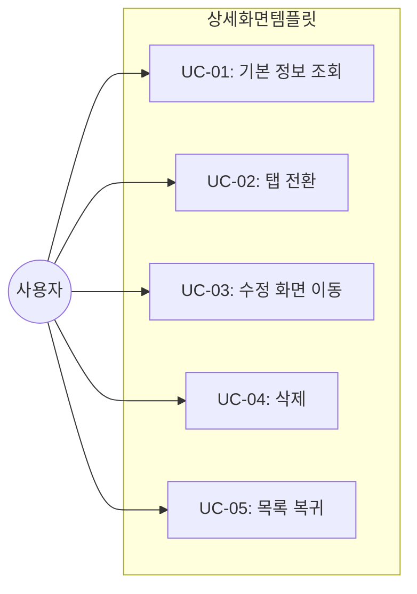

# TSK-06-02 - 상세 화면 템플릿 설계 문서

## 문서 정보

| 항목 | 내용 |
|------|------|
| Task ID | TSK-06-02 |
| 문서 버전 | 1.0 |
| 작성일 | 2026-01-20 |
| 상태 | 작성중 |
| 카테고리 | development |

---

## 1. 개요

### 1.1 배경 및 문제 정의

**현재 상황:**
- 단일 레코드의 상세 정보를 표시하는 화면이 여러 곳에서 필요함
- 읽기 전용 정보 표시, 탭 기반 관련 정보 그룹핑이 반복됨

**해결하려는 문제:**
- 상세 화면의 표준 템플릿 부재
- 화면별 레이아웃 불일치

### 1.2 목적 및 기대 효과

**목적:**
- 재사용 가능한 상세 화면 템플릿 컴포넌트 제공
- Ant Design Descriptions, Tabs를 활용한 표준 레이아웃

**기대 효과:**
- 상세 화면 개발 시간 단축
- 일관된 정보 표시 UX

### 1.3 범위

**포함:**
- DetailTemplate 컴포넌트 구현
- 기본 정보 영역 (Descriptions)
- 탭 기반 관련 정보 영역
- 수정/삭제/목록 버튼

**제외:**
- 개별 화면 데이터 로직

### 1.4 참조 문서

| 문서 | 경로 | 관련 섹션 |
|------|------|----------|
| PRD | `.orchay/projects/mes-portal/prd.md` | 4.1.1 화면 템플릿 - 상세 화면 |
| TRD | `.orchay/projects/mes-portal/trd.md` | 7. PRD 요구사항 ↔ 기술 스택 매핑 |

---

## 2. 사용자 분석

### 2.1 대상 사용자

| 사용자 유형 | 특성 | 주요 니즈 |
|------------|------|----------|
| 공장장/관리자 | 세부 정보 확인 필요 | 빠른 정보 파악, 수정 접근 |
| 생산 담당자 | 작업 지시 상세 확인 | 관련 정보 탭 전환 |

---

## 3. 유즈케이스

### 3.1 유즈케이스 다이어그램



### 3.2 유즈케이스 상세

#### UC-01: 기본 정보 조회

| 항목 | 내용 |
|------|------|
| 액터 | 일반 사용자 |
| 목적 | 레코드 상세 정보 확인 |
| 사전 조건 | 목록에서 행 선택 또는 URL 직접 접근 |
| 사후 조건 | 상세 정보 화면 표시 |
| 트리거 | 화면 진입 |

---

## 4. 사용자 시나리오

### 4.1 시나리오 1: 작업 지시 상세 조회

**상황 설명:**
생산 담당자가 특정 작업 지시의 상세 정보와 관련 생산 이력을 확인한다.

**단계별 진행:**

| 단계 | 사용자 행동 | 시스템 반응 | 사용자 기대 |
|------|-----------|------------|------------|
| 1 | 목록에서 행 클릭 | 상세 화면 로딩 | 빠른 전환 |
| 2 | 기본 정보 확인 | Descriptions 표시 | 정보 가독성 |
| 3 | 이력 탭 클릭 | 탭 컨텐츠 전환 | 부드러운 전환 |
| 4 | 수정 버튼 클릭 | 폼 화면 이동 | 수정 모드 진입 |

---

## 5. 화면 설계

### 5.1 화면별 상세

#### 화면 1: 상세 화면 템플릿

**화면 목적:**
단일 레코드의 상세 정보 표시

**와이어프레임:**
```
┌─────────────────────────────────────────────────────────────────┐
│  ┌───────────────────────────────────────────────────────────┐  │
│  │  📋 상세 정보 - {제목}                    [수정] [삭제]   │  │
│  └───────────────────────────────────────────────────────────┘  │
│                                                                  │
│  ┌───────────────────────────────────────────────────────────┐  │
│  │  📝 기본 정보 (Descriptions)                               │  │
│  │  ┌─────────────────────────────────────────────────────┐  │  │
│  │  │ 필드명1    │ 값1                                     │  │  │
│  │  ├────────────┼────────────────────────────────────────┤  │  │
│  │  │ 필드명2    │ 값2                                     │  │  │
│  │  ├────────────┼────────────────────────────────────────┤  │  │
│  │  │ 필드명3    │ 값3                                     │  │  │
│  │  ├────────────┼────────────────────────────────────────┤  │  │
│  │  │ 필드명4    │ 값4                                     │  │  │
│  │  └─────────────────────────────────────────────────────┘  │  │
│  └───────────────────────────────────────────────────────────┘  │
│                                                                  │
│  ┌───────────────────────────────────────────────────────────┐  │
│  │  ┌────────┬────────┬────────┬────────────────────────┐   │  │
│  │  │ 탭 1   │ 탭 2   │ 탭 3   │                        │   │  │
│  │  └────────┴────────┴────────┴────────────────────────┘   │  │
│  │  ┌─────────────────────────────────────────────────────┐  │  │
│  │  │                                                     │  │  │
│  │  │               탭 컨텐츠 영역                        │  │  │
│  │  │       (Table, List, Timeline 등)                   │  │  │
│  │  │                                                     │  │  │
│  │  └─────────────────────────────────────────────────────┘  │  │
│  └───────────────────────────────────────────────────────────┘  │
│                                                                  │
│  ┌───────────────────────────────────────────────────────────┐  │
│  │                                          [← 목록으로]     │  │
│  └───────────────────────────────────────────────────────────┘  │
└─────────────────────────────────────────────────────────────────┘
```

**화면 요소 설명:**

| 영역 | 설명 | 사용자 인터랙션 |
|------|------|----------------|
| 헤더 | 제목 및 액션 버튼 | 수정/삭제 클릭 |
| 기본 정보 | Descriptions 컴포넌트 | 읽기 전용 |
| 탭 영역 | 관련 정보 그룹 | 탭 클릭으로 전환 |
| 하단 버튼 | 목록 복귀 | 클릭 시 목록 이동 |

---

## 6. 인터랙션 설계

### 6.1 사용자 액션과 피드백

| 사용자 액션 | 즉각 피드백 | 결과 피드백 | 에러 피드백 |
|------------|-----------|------------|------------|
| 탭 클릭 | 활성 탭 표시 | 컨텐츠 전환 | - |
| 수정 클릭 | - | 폼 화면 이동 | - |
| 삭제 클릭 | 확인 다이얼로그 | 목록 이동 + 토스트 | 삭제 실패 |

### 6.2 상태별 화면 변화

| 상태 | 화면 표시 | 사용자 안내 |
|------|----------|------------|
| 로딩 중 | Skeleton | "정보를 불러오는 중..." |
| 데이터 없음 | Result(404) | "항목을 찾을 수 없습니다" |
| 정상 표시 | 상세 정보 | - |

---

## 7. 데이터 요구사항

### 7.1 Props 인터페이스

```typescript
interface DetailTemplateProps {
  // 헤더
  title: string
  onEdit?: () => void
  onDelete?: () => void
  onBack?: () => void

  // 기본 정보
  descriptions: DescriptionsProps

  // 탭 영역 (선택)
  tabs?: {
    key: string
    label: string
    children: ReactNode
  }[]

  // 상태
  loading?: boolean

  // 추가 액션
  extra?: ReactNode
}
```

---

## 8. 비즈니스 규칙

### 8.1 핵심 규칙

| 규칙 ID | 규칙 설명 | 적용 상황 |
|---------|----------|----------|
| BR-01 | 삭제 시 확인 다이얼로그 필수 | 삭제 버튼 클릭 |
| BR-02 | 권한 없으면 수정/삭제 버튼 숨김 | 화면 진입 시 |

---

## 9. 에러 처리

### 9.1 예상 에러 상황

| 상황 | 원인 | 사용자 메시지 | 복구 방법 |
|------|------|--------------|----------|
| 조회 실패 | 없는 ID | "항목을 찾을 수 없습니다" | 목록 이동 버튼 |
| 삭제 실패 | 서버 오류 | "삭제에 실패했습니다" | 재시도 안내 |

---

## 10. 연관 문서

| 문서 | 경로 | 용도 |
|------|------|------|
| 요구사항 추적 매트릭스 | `025-traceability-matrix.md` | PRD → 설계 → 테스트 추적 |
| 테스트 명세서 | `026-test-specification.md` | 테스트 케이스 정의 |

---

## 11. 구현 범위

### 11.1 영향받는 영역

| 영역 | 변경 내용 | 영향도 |
|------|----------|--------|
| components/templates/ | DetailTemplate.tsx 신규 | 높음 |

### 11.2 의존성

| 의존 항목 | 이유 | 상태 |
|----------|------|------|
| Ant Design Descriptions | 기본 정보 표시 | 완료 |
| Ant Design Tabs | 탭 영역 | 완료 |
| Ant Design Card | 컨테이너 | 완료 |

---

## 12. 체크리스트

### 12.1 설계 완료 확인

- [x] 문제 정의 및 목적 명확화
- [x] 사용자 분석 완료
- [x] 유즈케이스 정의 완료
- [x] 사용자 시나리오 작성 완료
- [x] 화면 설계 완료 (와이어프레임)
- [x] 인터랙션 설계 완료
- [x] 데이터 요구사항 정의 완료
- [x] 비즈니스 규칙 정의 완료
- [x] 에러 처리 정의 완료

---

## 변경 이력

| 버전 | 일자 | 작성자 | 변경 내용 |
|------|------|--------|----------|
| 1.0 | 2026-01-20 | Claude | 최초 작성 |
