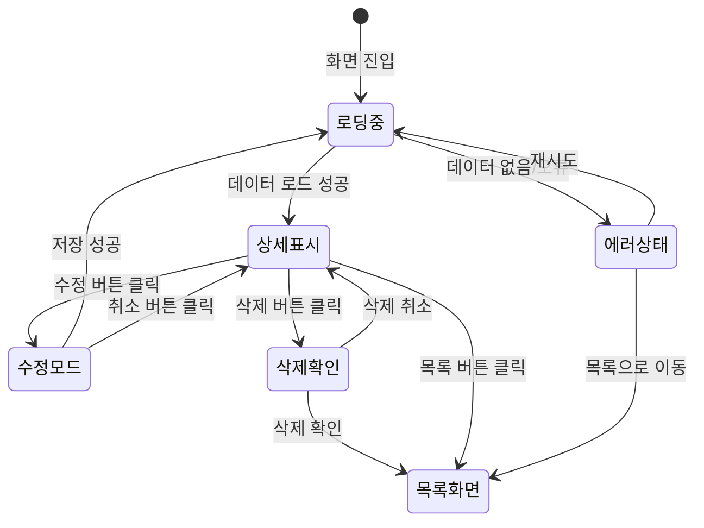

# TSK-06-02 - 상세 화면 템플릿 UI 설계

**Version:** 1.0 - **Last Updated:** 2026-01-21

> **목적**: 단일 레코드의 상세 정보를 표시하는 화면의 표준 템플릿 UI 설계

---

## 1. 화면 목록

| 화면 ID | 화면명 | 목적 | SVG 참조 |
|---------|--------|------|----------|
| SCR-01 | 상세 정보 표시 | 데이터 읽기 전용 표시 | `screen-01-detail-view.svg` |
| SCR-02 | 로딩 상태 | 데이터 로딩 중 스켈레톤 표시 | `screen-02-detail-loading.svg` |
| SCR-03 | 수정 모드 | 폼 모드로 전환된 상태 | `screen-03-detail-edit-mode.svg` |

---

## 2. 화면 전환 흐름

### 2.1 상태 다이어그램



### 2.2 액션-화면 매트릭스

| 액션 | 현재 상태 | 결과 상태 | 트리거 |
|------|----------|----------|--------|
| 화면 진입 | - | 로딩중 | URL/목록 클릭 |
| 로드 완료 | 로딩중 | 상세표시 | 시스템 |
| 로드 실패 | 로딩중 | 에러상태 | 시스템 |
| 수정 클릭 | 상세표시 | 수정모드 | 사용자 |
| 저장 클릭 | 수정모드 | 로딩중 | 사용자 |
| 취소 클릭 | 수정모드 | 상세표시 | 사용자 |
| 삭제 클릭 | 상세표시 | 삭제확인 | 사용자 |
| 삭제 확인 | 삭제확인 | 목록화면 | 사용자 |
| 목록 클릭 | 상세표시 | 목록화면 | 사용자 |
| 탭 클릭 | 상세표시 | 상세표시 | 사용자 |

---

## 3. 화면별 상세

### 3.1 SCR-01: 상세 정보 표시

**화면 목적**: 단일 레코드의 상세 정보를 읽기 전용으로 표시

**레이아웃 구조**:
```
+---------------------------------------------------------------------+
|  +---------------------------------------------------------------+  |
|  |  [Icon] 사용자 상세 정보                    [수정] [삭제]      |  |
|  +---------------------------------------------------------------+  |
|                                                                      |
|  +---------------------------------------------------------------+  |
|  |  기본 정보                                           [Card]    |  |
|  |  +-----------------------------------------------------------+  |
|  |  | 사용자명     | 홍길동                                      |  |
|  |  +-----------------------------------------------------------+  |
|  |  | 이메일       | hong@example.com                           |  |
|  |  +-----------------------------------------------------------+  |
|  |  | 부서         | 개발팀                                      |  |
|  |  +-----------------------------------------------------------+  |
|  |  | 직책         | 선임                                        |  |
|  |  +-----------------------------------------------------------+  |
|  |  | 상태         | [Active] 활성                               |  |
|  |  +-----------------------------------------------------------+  |
|  |  | 등록일       | 2026-01-15 09:00:00                         |  |
|  |  +-----------------------------------------------------------+  |
|  +---------------------------------------------------------------+  |
|                                                                      |
|  +---------------------------------------------------------------+  |
|  |  [활동 이력]  [권한 정보]  [설정]                    [Tabs]    |  |
|  +---------------------------------------------------------------+  |
|  |  +-----------------------------------------------------------+  |
|  |  |                                                           |  |
|  |  |  +-------+  2026-01-20 14:30  시스템 설정 변경            |  |
|  |  |  |  O    |                                                |  |
|  |  |  +---|---+  2026-01-18 10:15  비밀번호 변경               |  |
|  |  |      |                                                    |  |
|  |  |  +---|---+  2026-01-15 09:00  계정 생성                   |  |
|  |  |  |  O    |                                                |  |
|  |  |  +-------+                                                |  |
|  |  |                                                           |  |
|  |  +-----------------------------------------------------------+  |
|  +---------------------------------------------------------------+  |
|                                                                      |
|  +---------------------------------------------------------------+  |
|  |                                         [<- 목록으로]          |  |
|  +---------------------------------------------------------------+  |
+---------------------------------------------------------------------+
```

**컴포넌트 구성**:

| 영역 | 컴포넌트 | Props | 비고 |
|------|----------|-------|------|
| 헤더 | `PageHeader` / Custom | `title`, `extra` | 페이지 제목 + 액션 버튼 |
| 기본 정보 | `Card` + `Descriptions` | `column={2}`, `bordered` | Ant Design |
| 탭 영역 | `Tabs` | `items`, `defaultActiveKey` | Ant Design |
| 탭 컨텐츠 | `Timeline` / `Table` / Custom | 탭별 상이 | 관련 정보 |
| 하단 버튼 | `Button` | `icon={<ArrowLeftOutlined />}` | 목록 복귀 |

**상태 관리**:

```typescript
interface DetailViewState {
  loading: boolean;
  data: DetailData | null;
  error: Error | null;
  activeTab: string;
  isEditMode: boolean;
}
```

**사용자 액션**:

| 액션 | 요소 | 결과 |
|------|------|------|
| 수정 클릭 | 수정 버튼 | 수정 모드로 전환 |
| 삭제 클릭 | 삭제 버튼 | 삭제 확인 모달 표시 |
| 탭 클릭 | 탭 버튼 | 탭 컨텐츠 전환 |
| 목록 클릭 | 목록으로 버튼 | 목록 화면 이동 |

**스타일 토큰**:

```css
.detail-page {
  padding: 24px;
  background: var(--color-bg-layout);
}

.detail-header {
  display: flex;
  justify-content: space-between;
  align-items: center;
  margin-bottom: 24px;
}

.detail-header-title {
  display: flex;
  align-items: center;
  gap: 12px;
  font-size: 20px;
  font-weight: 600;
  color: var(--color-text-primary);
}

.detail-card {
  margin-bottom: 24px;
}

.detail-card .ant-descriptions-item-label {
  width: 120px;
  background: var(--color-bg-container-disabled);
}

.detail-tabs {
  margin-bottom: 24px;
}

.detail-footer {
  display: flex;
  justify-content: flex-end;
  padding-top: 16px;
  border-top: 1px solid var(--color-border);
}
```

---

### 3.2 SCR-02: 로딩 상태

**화면 목적**: 데이터 로딩 중 스켈레톤 UI 표시

**레이아웃 구조**:
```
+---------------------------------------------------------------------+
|  +---------------------------------------------------------------+  |
|  |  [====]  [================]                   [======] [======]|  |
|  +---------------------------------------------------------------+  |
|                                                                      |
|  +---------------------------------------------------------------+  |
|  |  [================]                                            |  |
|  |  +-----------------------------------------------------------+  |
|  |  | [====]       | [===================]                       |  |
|  |  +-----------------------------------------------------------+  |
|  |  | [====]       | [===================]                       |  |
|  |  +-----------------------------------------------------------+  |
|  |  | [====]       | [===================]                       |  |
|  |  +-----------------------------------------------------------+  |
|  |  | [====]       | [===================]                       |  |
|  |  +-----------------------------------------------------------+  |
|  |  | [====]       | [===================]                       |  |
|  |  +-----------------------------------------------------------+  |
|  |  | [====]       | [===================]                       |  |
|  |  +-----------------------------------------------------------+  |
|  +---------------------------------------------------------------+  |
|                                                                      |
|  +---------------------------------------------------------------+  |
|  |  [======]  [======]  [======]                                  |  |
|  +---------------------------------------------------------------+  |
|  |  +-----------------------------------------------------------+  |
|  |  |  [====] [==================]                               |  |
|  |  |  [====] [==================]                               |  |
|  |  |  [====] [==================]                               |  |
|  |  +-----------------------------------------------------------+  |
|  +---------------------------------------------------------------+  |
|                                                                      |
|  +---------------------------------------------------------------+  |
|  |                                              [============]    |  |
|  +---------------------------------------------------------------+  |
+---------------------------------------------------------------------+
```

**컴포넌트 구성**:

| 영역 | 컴포넌트 | Props | 비고 |
|------|----------|-------|------|
| 헤더 | `Skeleton.Input` | `active`, `size="small"` | 제목 + 버튼 |
| 기본 정보 | `Skeleton` | `active`, `paragraph={{ rows: 6 }}` | Descriptions 영역 |
| 탭 영역 | `Skeleton.Button` x 3 | `active`, `size="small"` | 탭 버튼 |
| 탭 컨텐츠 | `Skeleton` | `active`, `paragraph={{ rows: 4 }}` | 컨텐츠 영역 |
| 하단 | `Skeleton.Button` | `active` | 목록 버튼 |

**스켈레톤 Props**:

```typescript
interface DetailSkeletonProps {
  descriptionRows?: number;  // 기본: 6
  showTabs?: boolean;        // 기본: true
  tabCount?: number;         // 기본: 3
}
```

**애니메이션**:
- Skeleton `active` prop으로 펄스 애니메이션
- 로딩 딜레이: 200ms (깜빡임 방지)

---

### 3.3 SCR-03: 수정 모드

**화면 목적**: 상세 정보를 수정할 수 있는 폼 모드

**레이아웃 구조**:
```
+---------------------------------------------------------------------+
|  +---------------------------------------------------------------+  |
|  |  [Icon] 사용자 정보 수정                    [저장] [취소]      |  |
|  +---------------------------------------------------------------+  |
|                                                                      |
|  +---------------------------------------------------------------+  |
|  |  기본 정보                                           [Card]    |  |
|  |  +-----------------------------------------------------------+  |
|  |  | 사용자명 *   | [홍길동                          ]          |  |
|  |  +-----------------------------------------------------------+  |
|  |  | 이메일 *     | [hong@example.com                ]          |  |
|  |  +-----------------------------------------------------------+  |
|  |  | 부서         | [개발팀                      v   ]          |  |
|  |  +-----------------------------------------------------------+  |
|  |  | 직책         | [선임                        v   ]          |  |
|  |  +-----------------------------------------------------------+  |
|  |  | 상태         | ( ) 활성  (o) 비활성                        |  |
|  |  +-----------------------------------------------------------+  |
|  |  | 비고         | [                                ]          |  |
|  |  |              | [                                ]          |  |
|  |  +-----------------------------------------------------------+  |
|  +---------------------------------------------------------------+  |
|                                                                      |
|  +---------------------------------------------------------------+  |
|  |                                         [저장]  [취소]         |  |
|  +---------------------------------------------------------------+  |
+---------------------------------------------------------------------+
```

**컴포넌트 구성**:

| 영역 | 컴포넌트 | Props | 비고 |
|------|----------|-------|------|
| 헤더 | Custom Header | - | 제목 변경 (수정) |
| 폼 영역 | `Form` + `Card` | `layout="horizontal"`, `labelCol`, `wrapperCol` | Ant Design |
| 텍스트 입력 | `Input` | `placeholder`, `maxLength` | 일반 텍스트 |
| 선택 입력 | `Select` | `options`, `placeholder` | 드롭다운 |
| 라디오 | `Radio.Group` | `options` | 상태 선택 |
| 텍스트영역 | `Input.TextArea` | `rows={3}`, `maxLength` | 비고 |
| 하단 버튼 | `Space` + `Button` | - | 저장/취소 |

**상태 관리**:

```typescript
interface EditModeState {
  form: FormInstance;
  isSubmitting: boolean;
  isDirty: boolean;
  originalData: DetailData;
}
```

**사용자 액션**:

| 액션 | 요소 | 결과 |
|------|------|------|
| 필드 입력 | 폼 필드 | isDirty 상태 변경 |
| 저장 클릭 | 저장 버튼 | 유효성 검사 후 API 호출 |
| 취소 클릭 | 취소 버튼 | 변경사항 확인 후 읽기 모드 |

**유효성 검사 규칙**:

```typescript
const validationRules = {
  username: [
    { required: true, message: '사용자명을 입력해 주세요' },
    { max: 50, message: '50자 이내로 입력해 주세요' }
  ],
  email: [
    { required: true, message: '이메일을 입력해 주세요' },
    { type: 'email', message: '올바른 이메일 형식이 아닙니다' }
  ],
  department: [
    { required: false }
  ],
  status: [
    { required: true, message: '상태를 선택해 주세요' }
  ]
};
```

**스타일 토큰**:

```css
.edit-mode .detail-header-title {
  color: var(--color-primary);
}

.edit-mode .ant-form-item-required::before {
  color: var(--color-error);
}

.edit-mode .detail-footer {
  gap: 8px;
}

.edit-mode .btn-save {
  min-width: 80px;
}

.edit-mode .btn-cancel {
  min-width: 80px;
}
```

---

## 4. 공통 컴포넌트

### 4.1 DetailTemplate

```typescript
interface DetailTemplateProps<T = any> {
  // 헤더
  title: string;
  titleIcon?: ReactNode;

  // 액션 버튼
  onEdit?: () => void;
  onDelete?: () => void;
  onBack?: () => void;
  showEdit?: boolean;       // 기본: true
  showDelete?: boolean;     // 기본: true
  showBack?: boolean;       // 기본: true

  // 기본 정보 (Descriptions)
  descriptions: {
    items: DescriptionItemType[];
    column?: number;        // 기본: 2
    bordered?: boolean;     // 기본: true
    size?: 'default' | 'middle' | 'small';
  };

  // 탭 영역 (선택)
  tabs?: {
    items: TabItemType[];
    defaultActiveKey?: string;
    onChange?: (key: string) => void;
  };

  // 상태
  loading?: boolean;
  error?: Error | null;

  // 추가 컨텐츠
  extra?: ReactNode;
  footer?: ReactNode;

  // 권한
  permissions?: {
    canEdit?: boolean;
    canDelete?: boolean;
  };
}

interface DescriptionItemType {
  key: string;
  label: string;
  children: ReactNode;
  span?: number;
}

interface TabItemType {
  key: string;
  label: string;
  children: ReactNode;
  icon?: ReactNode;
  disabled?: boolean;
}
```

### 4.2 삭제 확인 모달

```typescript
interface DeleteConfirmProps {
  open: boolean;
  title?: string;           // 기본: "삭제 확인"
  content?: string;         // 기본: "정말 삭제하시겠습니까?"
  itemName?: string;        // 삭제 대상 이름
  onConfirm: () => void;
  onCancel: () => void;
  loading?: boolean;
}
```

**모달 레이아웃**:
```
+------------------------------------------+
|  [!] 삭제 확인                      [X]  |
+------------------------------------------+
|                                          |
|  '홍길동' 항목을 삭제하시겠습니까?        |
|                                          |
|  삭제된 데이터는 복구할 수 없습니다.      |
|                                          |
+------------------------------------------+
|                       [취소]  [삭제]     |
+------------------------------------------+
```

### 4.3 변경사항 확인 모달

```typescript
interface UnsavedChangesProps {
  open: boolean;
  onSave: () => void;
  onDiscard: () => void;
  onCancel: () => void;
}
```

**모달 레이아웃**:
```
+------------------------------------------+
|  [!] 저장되지 않은 변경사항          [X]  |
+------------------------------------------+
|                                          |
|  저장하지 않은 변경사항이 있습니다.       |
|  저장하시겠습니까?                        |
|                                          |
+------------------------------------------+
|           [저장 안함]  [취소]  [저장]    |
+------------------------------------------+
```

---

## 5. 반응형 설계

### 5.1 Breakpoint별 레이아웃

| Breakpoint | 너비 범위 | Descriptions | Tabs | 버튼 배치 |
|------------|----------|--------------|------|----------|
| Desktop | 1024px+ | 2열 레이아웃 | 가로 탭 | 헤더 우측 |
| Tablet | 768-1023px | 2열 레이아웃 | 가로 탭 | 헤더 우측 |
| Mobile | 0-767px | 1열 레이아웃 | 가로 스크롤 또는 드롭다운 | 헤더 하단 또는 풀너비 |

### 5.2 반응형 CSS

```css
/* Desktop (1024px+) */
.detail-page {
  padding: 24px;
}

.detail-descriptions {
  --descriptions-column: 2;
}

.detail-header-actions {
  display: flex;
  gap: 8px;
}

/* Tablet (768-1023px) */
@media (max-width: 1023px) {
  .detail-page {
    padding: 16px;
  }
}

/* Mobile (767px-) */
@media (max-width: 767px) {
  .detail-page {
    padding: 12px;
  }

  .detail-descriptions {
    --descriptions-column: 1;
  }

  .detail-header {
    flex-direction: column;
    align-items: flex-start;
    gap: 12px;
  }

  .detail-header-actions {
    width: 100%;
    justify-content: flex-end;
  }

  .detail-tabs .ant-tabs-nav {
    overflow-x: auto;
  }

  .detail-footer {
    flex-direction: column;
    gap: 8px;
  }

  .detail-footer .ant-btn {
    width: 100%;
  }
}
```

### 5.3 터치 디바이스 최적화

```css
/* 터치 타겟 최소 크기 */
@media (pointer: coarse) {
  .detail-header-actions .ant-btn {
    min-height: 44px;
    min-width: 44px;
  }

  .detail-tabs .ant-tabs-tab {
    padding: 12px 16px;
  }
}
```

---

## 6. 접근성

### 6.1 키보드 네비게이션

| 키 | 동작 | 컨텍스트 |
|----|------|---------|
| Tab | 다음 포커스 가능 요소로 이동 | 전체 |
| Shift + Tab | 이전 포커스 가능 요소로 이동 | 전체 |
| Enter | 버튼 활성화 / 링크 이동 | 버튼, 링크 |
| Space | 버튼 활성화 | 버튼 |
| Arrow Left/Right | 탭 전환 | 탭 영역 |
| Escape | 모달 닫기 | 모달 |

### 6.2 ARIA 속성

| 요소 | ARIA 속성 | 값 |
|------|----------|-----|
| 헤더 영역 | `role` | `banner` |
| 메인 컨텐츠 | `role` | `main` |
| 기본 정보 | `role` | `region` |
| 기본 정보 | `aria-label` | "기본 정보" |
| 탭 컨테이너 | `role` | `tablist` |
| 탭 버튼 | `role` | `tab` |
| 탭 버튼 | `aria-selected` | `true/false` |
| 탭 패널 | `role` | `tabpanel` |
| 탭 패널 | `aria-labelledby` | 해당 탭 ID |
| 수정 버튼 | `aria-label` | "정보 수정" |
| 삭제 버튼 | `aria-label` | "항목 삭제" |
| 로딩 상태 | `aria-busy` | `true` |
| 로딩 상태 | `aria-live` | `polite` |

### 6.3 스크린 리더 안내

```typescript
// 화면 진입 시
<h1 tabIndex={-1} ref={titleRef}>
  {title} 상세 정보
  <span className="sr-only">
    {loading ? '데이터를 불러오는 중입니다' : ''}
  </span>
</h1>

// 탭 전환 시
<div role="status" aria-live="polite" className="sr-only">
  {activeTab} 탭이 선택되었습니다
</div>

// 삭제 확인
<Modal role="alertdialog" aria-describedby="delete-confirm-desc">
  <p id="delete-confirm-desc">
    {itemName} 항목을 삭제하시겠습니까? 이 작업은 되돌릴 수 없습니다.
  </p>
</Modal>
```

### 6.4 색상 대비

- 모든 텍스트: WCAG 2.1 AA 기준 충족 (4.5:1 이상)
- 상태 배지: 배경과 텍스트 대비 4.5:1 이상
- 포커스 아웃라인: 2px solid, 대비 3:1 이상
- 비활성 요소: 최소 3:1 대비

### 6.5 포커스 관리

```typescript
// 화면 진입 시 제목으로 포커스
useEffect(() => {
  if (!loading && data) {
    titleRef.current?.focus();
  }
}, [loading, data]);

// 모달 열릴 때 첫 번째 포커스 가능 요소로
useEffect(() => {
  if (modalOpen) {
    firstFocusableRef.current?.focus();
  }
}, [modalOpen]);

// 모달 닫힐 때 트리거 요소로 포커스 복귀
const handleModalClose = () => {
  setModalOpen(false);
  triggerRef.current?.focus();
};
```

---

## 7. SVG 파일 목록

| 파일명 | 설명 | 뷰박스 |
|--------|------|--------|
| `screen-01-detail-view.svg` | 상세 정보 표시 (읽기 모드) | 800x600 |
| `screen-02-detail-loading.svg` | 로딩 상태 (스켈레톤) | 800x600 |
| `screen-03-detail-edit-mode.svg` | 수정 모드 (폼) | 800x600 |

---

## 8. 컴포넌트 사용 예시

### 8.1 기본 사용

```tsx
import { DetailTemplate } from '@/components/templates/DetailTemplate';

const UserDetail: React.FC = () => {
  const { id } = useParams();
  const navigate = useNavigate();
  const { data, loading, error } = useUserDetail(id);

  const descriptionItems = [
    { key: 'name', label: '사용자명', children: data?.name },
    { key: 'email', label: '이메일', children: data?.email },
    { key: 'department', label: '부서', children: data?.department },
    { key: 'position', label: '직책', children: data?.position },
    { key: 'status', label: '상태', children: <Tag color={data?.status === 'active' ? 'green' : 'default'}>{data?.statusLabel}</Tag> },
    { key: 'createdAt', label: '등록일', children: data?.createdAt },
  ];

  const tabItems = [
    { key: 'history', label: '활동 이력', children: <ActivityHistory userId={id} /> },
    { key: 'permissions', label: '권한 정보', children: <PermissionList userId={id} /> },
    { key: 'settings', label: '설정', children: <UserSettings userId={id} /> },
  ];

  return (
    <DetailTemplate
      title="사용자 상세 정보"
      titleIcon={<UserOutlined />}
      loading={loading}
      error={error}
      descriptions={{ items: descriptionItems, column: 2, bordered: true }}
      tabs={{ items: tabItems, defaultActiveKey: 'history' }}
      onEdit={() => navigate(`/users/${id}/edit`)}
      onDelete={() => handleDelete(id)}
      onBack={() => navigate('/users')}
    />
  );
};
```

### 8.2 인라인 수정 모드

```tsx
const UserDetailWithEdit: React.FC = () => {
  const [isEditMode, setIsEditMode] = useState(false);
  const [form] = Form.useForm();

  if (isEditMode) {
    return (
      <DetailEditMode
        title="사용자 정보 수정"
        form={form}
        initialValues={data}
        onSave={handleSave}
        onCancel={() => setIsEditMode(false)}
      />
    );
  }

  return (
    <DetailTemplate
      // ... 기존 props
      onEdit={() => setIsEditMode(true)}
    />
  );
};
```

---

## 관련 문서

- PRD: `../../../prd.md` - 4.1.1 화면 템플릿 - 상세 화면
- TRD: `../../../trd.md` - 7. PRD 요구사항 매핑
- 설계 문서: `./010-design.md`
- 로딩/에러 상태: `../TSK-05-01/011-ui-design.md`
