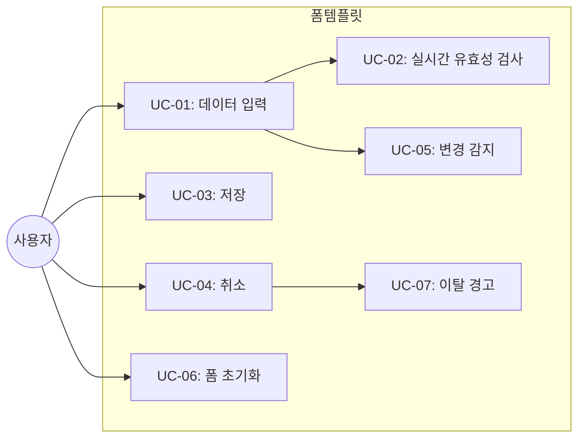
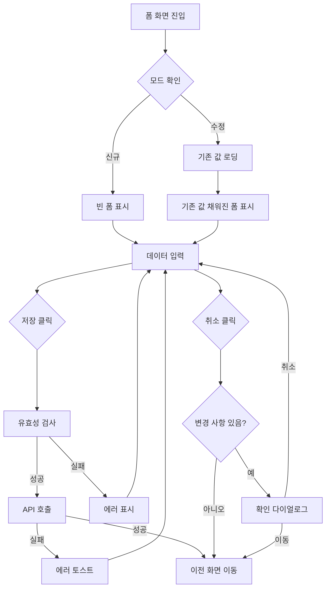

# TSK-06-03 - 입력/수정 폼 템플릿 설계 문서

## 문서 정보

| 항목 | 내용 |
|------|------|
| Task ID | TSK-06-03 |
| 문서 버전 | 2.0 |
| 작성일 | 2026-01-21 |
| 상태 | 작성중 |
| 카테고리 | development |

---

## 1. 개요

### 1.1 배경 및 문제 정의

**현재 상황:**
- MES Portal에서 데이터 입력/수정 폼이 여러 화면에서 반복적으로 필요함
- 각 화면마다 유효성 검사, 저장/취소 처리, 변경 감지 등을 개별 구현해야 함
- 폼 레이아웃(수직/수평/인라인)이 화면별로 다르게 적용되어 일관성 부족

**해결하려는 문제:**
- 입력/수정 폼 화면의 표준 템플릿 부재로 인한 개발 생산성 저하
- 유효성 검사 UX의 일관성 부족
- 폼 상태 관리(변경 감지, 저장되지 않은 변경사항 경고) 중복 구현

### 1.2 목적 및 기대 효과

**목적:**
- 재사용 가능한 입력/수정 폼 템플릿 컴포넌트 제공
- Ant Design Form을 기반으로 한 표준 레이아웃 및 유효성 검사 통합
- 폼 상태 관리 기능 내장 (변경 감지, 이탈 경고)

**기대 효과:**
- 새 폼 화면 개발 시간 50% 단축
- 일관된 유효성 검사 UX 제공
- 사용자 실수로 인한 데이터 손실 방지

### 1.3 범위

**포함:**
- FormTemplate 컴포넌트 구현
- 폼 레이아웃 (수직/수평/인라인)
- 유효성 검사 통합 (필수, 이메일, 전화번호, 숫자 범위, 정규식 등)
- 저장/취소 버튼
- 수정된 필드 표시 (변경 감지)
- 저장되지 않은 변경사항 경고 (페이지 이탈 시)
- 폼 초기화/리셋 기능

**제외:**
- 개별 폼 필드 정의 (사용처에서 구현)
- 자동 저장 (Draft) - Phase 2에서 구현 예정
- 파일 업로드 (별도 컴포넌트)

### 1.4 참조 문서

| 문서 | 경로 | 관련 섹션 |
|------|------|----------|
| PRD | `.orchay/projects/mes-portal/prd.md` | 4.1.1 화면 템플릿 - 입력/수정 폼 화면, 폼 검증 |
| TRD | `.orchay/projects/mes-portal/trd.md` | 7. 폼/입력, 1.2 UI/스타일링 스택 |

---

## 2. 사용자 분석

### 2.1 대상 사용자

| 사용자 유형 | 특성 | 주요 니즈 |
|------------|------|----------|
| 생산 담당자 | 작업 지시 등록, 다량 데이터 입력 | 빠른 입력, 명확한 에러 안내, 탭 키 이동 |
| 품질 담당자 | 검사 결과 입력, 정확성 중요 | 실시간 유효성 검사, 실수 방지 |
| 관리자 | 기준 정보 수정, 데이터 정확성 책임 | 변경 전/후 확인, 저장 안전성 |
| 개발자 | 템플릿 사용자 | 간편한 API, 커스터마이징 용이 |

### 2.2 사용자 페르소나

**페르소나 1: 생산 담당자 김철수**
- 역할: 작업 지시 등록
- 목표: 하루에 수십 건의 작업 지시를 빠르게 등록
- 불만: 필수 필드를 놓쳐서 저장 실패 시 처음부터 다시 입력해야 함
- 시나리오: 제품코드, 수량, 시작일 등을 입력하고 저장

**페르소나 2: 품질 담당자 박영희**
- 역할: 검사 결과 입력
- 목표: 정확한 검사 데이터 기록
- 불만: 숫자 범위를 벗어나는 값 입력 시 즉시 알려주지 않음
- 시나리오: 측정값, 합격/불합격 판정 입력

---

## 3. 유즈케이스

### 3.1 유즈케이스 다이어그램



### 3.2 유즈케이스 상세

#### UC-01: 데이터 입력

| 항목 | 내용 |
|------|------|
| 액터 | 일반 사용자 |
| 목적 | 폼 필드에 데이터 입력 |
| 사전 조건 | 폼 화면 진입 |
| 사후 조건 | 필드에 값이 입력됨 |
| 트리거 | 필드 포커스 및 입력 |

**기본 흐름:**
1. 사용자가 필드를 클릭하여 포커스한다
2. 키보드로 값을 입력한다
3. 입력한 값이 필드에 표시된다
4. Tab 키로 다음 필드로 이동한다

**대안 흐름:**
- 2a. Select 필드인 경우:
  - 드롭다운에서 옵션을 선택한다
- 2b. DatePicker 필드인 경우:
  - 캘린더에서 날짜를 선택한다

#### UC-02: 실시간 유효성 검사

| 항목 | 내용 |
|------|------|
| 액터 | 시스템 |
| 목적 | 잘못된 데이터 입력 방지 |
| 사전 조건 | 사용자가 필드 입력 |
| 사후 조건 | 에러 메시지 표시 또는 통과 |
| 트리거 | 필드 blur 또는 입력 중 (설정에 따라) |

**기본 흐름:**
1. 사용자가 필드에 값을 입력한다
2. 필드에서 포커스가 벗어난다 (blur)
3. 시스템이 해당 필드의 유효성을 검사한다
4. 유효하면 통과 표시, 무효하면 에러 메시지 표시

**예외 흐름:**
- 3a. 필수 필드가 비어있는 경우:
  - "필수 항목입니다" 에러 표시
- 3b. 형식이 맞지 않는 경우:
  - 해당 형식 에러 메시지 표시 (예: "올바른 이메일 형식이 아닙니다")

#### UC-03: 저장

| 항목 | 내용 |
|------|------|
| 액터 | 일반 사용자 |
| 목적 | 입력한 데이터 저장 |
| 사전 조건 | 폼에 데이터 입력됨 |
| 사후 조건 | 데이터 저장 완료 또는 에러 표시 |
| 트리거 | 저장 버튼 클릭 또는 Ctrl+S |

**기본 흐름:**
1. 사용자가 저장 버튼을 클릭한다
2. 시스템이 전체 폼 유효성을 검사한다
3. 모든 필드가 유효하면 API를 호출한다
4. 저장 버튼에 로딩 상태를 표시한다
5. 저장 성공 시 성공 메시지를 표시하고 이전 화면으로 이동한다

**예외 흐름:**
- 2a. 유효성 검사 실패 시:
  - 에러가 있는 필드에 에러 메시지 표시
  - 첫 번째 에러 필드로 스크롤 및 포커스
- 5a. 저장 실패 시:
  - 에러 메시지 토스트 표시
  - 폼 상태 유지

#### UC-04: 취소

| 항목 | 내용 |
|------|------|
| 액터 | 일반 사용자 |
| 목적 | 입력 취소 및 이전 화면 복귀 |
| 사전 조건 | 폼 화면에 있음 |
| 사후 조건 | 이전 화면으로 이동 |
| 트리거 | 취소 버튼 클릭 또는 Escape 키 |

**기본 흐름:**
1. 사용자가 취소 버튼을 클릭한다
2. 변경 사항이 없으면 바로 이전 화면으로 이동한다

**대안 흐름:**
- 2a. 변경 사항이 있는 경우:
  - UC-07 이탈 경고 실행

#### UC-05: 변경 감지

| 항목 | 내용 |
|------|------|
| 액터 | 시스템 |
| 목적 | 폼 데이터 변경 여부 추적 |
| 사전 조건 | 초기값 설정됨 (수정 모드) |
| 사후 조건 | 변경된 필드 표시 |
| 트리거 | 필드 값 변경 |

**기본 흐름:**
1. 사용자가 필드 값을 변경한다
2. 시스템이 초기값과 현재값을 비교한다
3. 변경된 필드에 시각적 표시를 한다 (예: 필드 옆 점, 배경색 변경)

#### UC-06: 폼 초기화

| 항목 | 내용 |
|------|------|
| 액터 | 일반 사용자 |
| 목적 | 폼을 초기 상태로 리셋 |
| 사전 조건 | 폼에 변경 사항 있음 |
| 사후 조건 | 폼이 초기값으로 복원 |
| 트리거 | 초기화 버튼 클릭 |

**기본 흐름:**
1. 사용자가 초기화 버튼을 클릭한다
2. 확인 다이얼로그를 표시한다 ("입력한 내용을 초기화하시겠습니까?")
3. 사용자가 확인을 클릭한다
4. 폼이 초기값으로 복원된다
5. 에러 메시지가 모두 제거된다

#### UC-07: 이탈 경고

| 항목 | 내용 |
|------|------|
| 액터 | 시스템 |
| 목적 | 저장되지 않은 데이터 손실 방지 |
| 사전 조건 | 폼에 저장되지 않은 변경 사항 있음 |
| 사후 조건 | 사용자 선택에 따라 이탈 또는 유지 |
| 트리거 | 페이지 이탈 시도 (취소, 탭 닫기, 브라우저 뒤로가기 등) |

**기본 흐름:**
1. 사용자가 페이지를 이탈하려 한다
2. 시스템이 변경 사항 존재 여부를 확인한다
3. 변경 사항이 있으면 확인 다이얼로그 표시 ("저장하지 않은 내용이 있습니다. 이동하시겠습니까?")
4. 사용자가 "이동"을 선택하면 변경 사항 버리고 이동
5. 사용자가 "취소"를 선택하면 현재 화면 유지

---

## 4. 사용자 시나리오

### 4.1 시나리오 1: 신규 작업 지시 등록

**상황 설명:**
생산 담당자 김철수가 새로운 작업 지시를 등록한다.

**단계별 진행:**

| 단계 | 사용자 행동 | 시스템 반응 | 사용자 기대 |
|------|-----------|------------|------------|
| 1 | 신규 버튼 클릭 | 빈 폼 화면 표시, 첫 번째 필드 포커스 | 즉시 입력 시작 가능 |
| 2 | 제품코드 입력 | - | 빠른 입력 |
| 3 | 수량 필드 이동 (Tab) | 다음 필드 포커스 | 키보드만으로 이동 |
| 4 | 수량 입력 (abc) | 실시간 에러 "숫자만 입력 가능합니다" | 즉시 피드백 |
| 5 | 수량 재입력 (100) | 에러 메시지 사라짐 | 정상 입력 확인 |
| 6 | 시작일 선택 | DatePicker 팝업 | 직관적인 날짜 선택 |
| 7 | 저장 클릭 | 전체 유효성 검사 후 저장 | 성공 알림 |
| 8 | - | 목록 화면으로 이동 | 저장 완료 확인 |

**성공 조건:**
- 모든 필수 필드 입력 완료
- 유효성 검사 통과
- 3초 이내 저장 완료

### 4.2 시나리오 2: 기존 데이터 수정

**상황 설명:**
관리자가 기존 작업 지시의 수량을 수정한다.

**단계별 진행:**

| 단계 | 사용자 행동 | 시스템 반응 | 사용자 기대 |
|------|-----------|------------|------------|
| 1 | 목록에서 수정 클릭 | 기존 값이 채워진 폼 표시 | 현재 값 확인 |
| 2 | 수량 필드 수정 (100 -> 150) | 수량 필드에 변경 표시 | 변경 사항 인지 |
| 3 | 저장 클릭 | 저장 진행 | 수정 완료 |
| 4 | - | "저장되었습니다" 토스트 | 성공 확인 |

### 4.3 시나리오 3: 변경 후 취소 시도

**상황 설명:**
사용자가 폼을 수정한 후 저장하지 않고 취소하려 한다.

**단계별 진행:**

| 단계 | 사용자 행동 | 시스템 반응 | 복구 방법 |
|------|-----------|------------|----------|
| 1 | 필드 수정 | 변경 감지 표시 | - |
| 2 | 취소 클릭 | 확인 다이얼로그 "저장하지 않은 내용이 있습니다" | "취소" 선택 시 폼 유지 |
| 3 | "이동" 클릭 | 변경 사항 버리고 이전 화면 이동 | - |

### 4.4 시나리오 4: 유효성 검사 실패

**상황 설명:**
사용자가 필수 필드를 비워두고 저장을 시도한다.

**단계별 진행:**

| 단계 | 사용자 행동 | 시스템 반응 | 복구 방법 |
|------|-----------|------------|----------|
| 1 | 필수 필드 비워둠 | - | - |
| 2 | 저장 클릭 | 필수 필드에 에러 표시, 첫 에러 필드로 스크롤 | 필드 입력 후 재저장 |
| 3 | 필수 필드 입력 | 에러 메시지 사라짐 | - |
| 4 | 저장 클릭 | 저장 성공 | - |

---

## 5. 화면 설계

### 5.1 화면 흐름도



### 5.2 화면별 상세

#### 화면 1: 입력/수정 폼 템플릿 (수직 레이아웃)

**화면 목적:**
데이터 입력 및 수정을 위한 표준 폼 레이아웃 제공

**진입 경로:**
- 목록 화면에서 "신규" 버튼 클릭
- 목록 화면에서 행 더블클릭 또는 "수정" 버튼 클릭
- 상세 화면에서 "수정" 버튼 클릭

**와이어프레임 (수직 레이아웃 - vertical):**
```
┌─────────────────────────────────────────────────────────────────┐
│  ┌───────────────────────────────────────────────────────────┐  │
│  │  작업 지시 등록                           [초기화]        │  │
│  └───────────────────────────────────────────────────────────┘  │
│                                                                  │
│  ┌───────────────────────────────────────────────────────────┐  │
│  │                                                           │  │
│  │  제품코드 *                                               │  │
│  │  ┌─────────────────────────────────────────────────────┐  │  │
│  │  │ PROD-001                                            │  │  │
│  │  └─────────────────────────────────────────────────────┘  │  │
│  │                                                           │  │
│  │  제품명 *                                                 │  │
│  │  ┌─────────────────────────────────────────────────────┐  │  │
│  │  │ 선택하세요                                     ▼    │  │  │
│  │  └─────────────────────────────────────────────────────┘  │  │
│  │                                                           │  │
│  │  ┌─────────────────────────┐  ┌─────────────────────────┐ │  │
│  │  │ 계획수량 *              │  │ 단위                    │ │  │
│  │  │ ┌─────────────────────┐ │  │ ┌─────────────────────┐ │ │  │
│  │  │ │ 100             ● △ │ │  │ │ EA                  │ │ │  │
│  │  │ └─────────────────────┘ │  │ └─────────────────────┘ │ │  │
│  │  │ 수정됨                  │  │                         │ │  │
│  │  └─────────────────────────┘  └─────────────────────────┘ │  │
│  │                                                           │  │
│  │  ┌─────────────────────────┐  ┌─────────────────────────┐ │  │
│  │  │ 계획시작일 *            │  │ 계획종료일 *            │ │  │
│  │  │ ┌─────────────────────┐ │  │ ┌─────────────────────┐ │ │  │
│  │  │ │ 2026-01-21    📅    │ │  │ │ 2026-01-25    📅    │ │ │  │
│  │  │ └─────────────────────┘ │  │ └─────────────────────┘ │ │  │
│  │  └─────────────────────────┘  └─────────────────────────┘ │  │
│  │                                                           │  │
│  │  담당자                                                   │  │
│  │  ┌─────────────────────────────────────────────────────┐  │  │
│  │  │ 김철수                                         ▼    │  │  │
│  │  └─────────────────────────────────────────────────────┘  │  │
│  │                                                           │  │
│  │  비고                                                     │  │
│  │  ┌─────────────────────────────────────────────────────┐  │  │
│  │  │                                                     │  │  │
│  │  │                                                     │  │  │
│  │  └─────────────────────────────────────────────────────┘  │  │
│  │  0/500                                                    │  │
│  │                                                           │  │
│  └───────────────────────────────────────────────────────────┘  │
│                                                                  │
│  ┌───────────────────────────────────────────────────────────┐  │
│  │                              [취소]  [저장] 또는 [💾 저장] │  │
│  └───────────────────────────────────────────────────────────┘  │
└─────────────────────────────────────────────────────────────────┘

범례:
* : 필수 필드
● : 수정된 필드 표시
△ : 값 증가/감소 표시 (숫자 필드)
📅 : 날짜 선택 아이콘
```

**와이어프레임 (수평 레이아웃 - horizontal):**
```
┌─────────────────────────────────────────────────────────────────┐
│  ┌───────────────────────────────────────────────────────────┐  │
│  │  사용자 정보 수정                                         │  │
│  └───────────────────────────────────────────────────────────┘  │
│                                                                  │
│  ┌───────────────────────────────────────────────────────────┐  │
│  │                                                           │  │
│  │  ┌────────────┬─────────────────────────────────────────┐ │  │
│  │  │ 이름 *     │ ┌─────────────────────────────────────┐ │ │  │
│  │  │            │ │ 홍길동                              │ │ │  │
│  │  │            │ └─────────────────────────────────────┘ │ │  │
│  │  ├────────────┼─────────────────────────────────────────┤ │  │
│  │  │ 이메일 *   │ ┌─────────────────────────────────────┐ │ │  │
│  │  │            │ │ hong@example.com                    │ │ │  │
│  │  │            │ └─────────────────────────────────────┘ │ │  │
│  │  │            │ ⚠️ 올바른 이메일 형식이 아닙니다        │ │  │
│  │  ├────────────┼─────────────────────────────────────────┤ │  │
│  │  │ 전화번호   │ ┌─────────────────────────────────────┐ │ │  │
│  │  │            │ │ 010-1234-5678                       │ │ │  │
│  │  │            │ └─────────────────────────────────────┘ │ │  │
│  │  ├────────────┼─────────────────────────────────────────┤ │  │
│  │  │ 부서       │ ┌─────────────────────────────────────┐ │ │  │
│  │  │            │ │ 생산팀                          ▼   │ │ │  │
│  │  │            │ └─────────────────────────────────────┘ │ │  │
│  │  └────────────┴─────────────────────────────────────────┘ │  │
│  │                                                           │  │
│  └───────────────────────────────────────────────────────────┘  │
│                                                                  │
│  ┌───────────────────────────────────────────────────────────┐  │
│  │                                         [취소]  [💾 저장] │  │
│  └───────────────────────────────────────────────────────────┘  │
└─────────────────────────────────────────────────────────────────┘
```

**와이어프레임 (에러 상태):**
```
┌─────────────────────────────────────────────────────────────────┐
│  ┌───────────────────────────────────────────────────────────┐  │
│  │  ⚠️ 입력 오류가 있습니다. 확인 후 다시 시도해주세요.      │  │
│  └───────────────────────────────────────────────────────────┘  │
│                                                                  │
│  ┌───────────────────────────────────────────────────────────┐  │
│  │                                                           │  │
│  │  제품코드 *                                               │  │
│  │  ┌─────────────────────────────────────────────────────┐  │  │
│  │  │                                                     │  │  │
│  │  └─────────────────────────────────────────────────────┘  │  │
│  │  ⚠️ 필수 항목입니다                                       │  │
│  │                                                           │  │
│  │  계획수량 *                                               │  │
│  │  ┌─────────────────────────────────────────────────────┐  │  │
│  │  │ -50                                                 │  │  │
│  │  └─────────────────────────────────────────────────────┘  │  │
│  │  ⚠️ 1 이상의 값을 입력해주세요                            │  │
│  │                                                           │  │
│  │  이메일                                                   │  │
│  │  ┌─────────────────────────────────────────────────────┐  │  │
│  │  │ invalid-email                                       │  │  │
│  │  └─────────────────────────────────────────────────────┘  │  │
│  │  ⚠️ 올바른 이메일 형식이 아닙니다                         │  │
│  │                                                           │  │
│  └───────────────────────────────────────────────────────────┘  │
└─────────────────────────────────────────────────────────────────┘
```

**화면 요소 설명:**

| 영역 | 설명 | Ant Design 컴포넌트 | 사용자 인터랙션 |
|------|------|-------------------|----------------|
| 헤더 | 등록/수정 제목 | Card title | - |
| 초기화 버튼 | 폼 리셋 | Button | 클릭 시 확인 후 초기화 |
| 전체 에러 | 폼 레벨 에러 | Alert | - |
| 필수 표시 (*) | 필수 필드 라벨 | Form.Item required | - |
| 입력 필드 | 텍스트 입력 | Input | 입력 |
| 선택 필드 | 드롭다운 | Select | 선택 |
| 날짜 필드 | 날짜 선택 | DatePicker | 캘린더 선택 |
| 숫자 필드 | 숫자 입력 | InputNumber | 입력 또는 증감 |
| 텍스트 영역 | 다중 행 입력 | Input.TextArea | 입력 |
| 문자 수 표시 | 입력 길이 | Input.TextArea showCount | - |
| 변경 표시 | 수정된 필드 | 커스텀 (Badge/Dot) | - |
| 에러 메시지 | 필드별 에러 | Form.Item validateStatus | - |
| 취소 버튼 | 입력 취소 | Button | 클릭 시 확인 후 이동 |
| 저장 버튼 | 데이터 저장 | Button type="primary" | 클릭 시 저장 |

**사용자 행동 시나리오:**
1. 사용자가 화면에 진입하면 첫 번째 입력 필드에 포커스된다
2. 필수 필드에는 * 표시가 있어 어떤 필드가 필수인지 알 수 있다
3. 값을 입력하고 Tab으로 다음 필드로 이동할 수 있다
4. 잘못된 값 입력 시 필드 하단에 에러 메시지가 표시된다
5. 저장 버튼 클릭 시 전체 유효성 검사 후 저장된다

### 5.3 반응형 동작

| 화면 크기 | 레이아웃 변화 | 사용자 경험 |
|----------|--------------|------------|
| 데스크톱 (1024px+) | 2열 배치 가능, 수평 레이아웃 지원 | 한 눈에 여러 필드 확인 |
| 태블릿 (768-1023px) | 1열 또는 2열, 레이블 상단 배치 | 터치 친화적 |
| 모바일 (767px-) | 1열 수직 배치, 버튼 풀 너비 | 모바일 최적화 |

---

## 6. 인터랙션 설계

### 6.1 사용자 액션과 피드백

| 사용자 액션 | 즉각 피드백 | 결과 피드백 | 에러 피드백 |
|------------|-----------|------------|------------|
| 필드 입력 | 입력 값 표시 | - | 실시간 유효성 (설정 시) |
| 필드 blur | - | 유효성 검사 결과 | 에러 메시지 표시 |
| 필드 값 변경 (수정모드) | 변경 표시 (●) | - | - |
| 저장 클릭 | 버튼 로딩 상태 | 성공 토스트 + 화면 이동 | 필드별 에러 표시 |
| 취소 클릭 | 확인 다이얼로그 (변경 시) | 이전 화면 이동 | - |
| 초기화 클릭 | 확인 다이얼로그 | 폼 초기값 복원 | - |
| Ctrl+S | 저장 실행 | 저장 결과 | 저장 실패 메시지 |
| Escape | 취소 실행 | 이전 화면 (변경 없을 때) | - |

### 6.2 상태별 화면 변화

| 상태 | 화면 표시 | 사용자 안내 |
|------|----------|------------|
| 초기 로딩 (수정) | Skeleton 또는 Spin | "정보를 불러오는 중..." |
| 신규 등록 | 빈 폼, 첫 필드 포커스 | - |
| 수정 모드 | 기존 값 채워진 폼 | 변경된 필드에 표시 |
| 저장 중 | 저장 버튼 로딩 | "저장 중..." |
| 유효성 실패 | 에러 필드 빨간 테두리 + 메시지 | 첫 에러 필드로 스크롤 |
| 저장 성공 | 성공 토스트 | "저장되었습니다" |
| 저장 실패 | 에러 토스트 | "저장에 실패했습니다. 다시 시도해주세요." |

### 6.3 유효성 검사 타이밍

| 트리거 시점 | 적용 상황 | Ant Design 설정 |
|------------|----------|----------------|
| blur (기본) | 필드에서 포커스 이탈 시 | validateTrigger: 'onBlur' |
| change | 입력 중 실시간 검사 | validateTrigger: 'onChange' |
| submit | 저장 버튼 클릭 시 전체 검사 | form.validateFields() |

### 6.4 키보드/접근성

| 기능 | 키보드 단축키 | 스크린 리더 안내 |
|------|-------------|-----------------|
| 저장 | Ctrl+S (Windows), Cmd+S (Mac) | "저장 버튼" |
| 취소 | Escape | "취소하고 이전으로" |
| 다음 필드 | Tab | "{필드명}으로 이동" |
| 이전 필드 | Shift+Tab | "{필드명}으로 이동" |
| Select 열기 | Enter 또는 Space | "선택 목록 열림" |
| DatePicker 열기 | Enter | "달력 열림" |

---

## 7. 데이터 요구사항

### 7.1 필요한 데이터

| 데이터 | 설명 | 출처 | 용도 |
|--------|------|------|------|
| initialValues | 초기값 (수정 시) | API/Props | 폼 초기화 |
| validationRules | 유효성 검사 규칙 | Props | 필드별 검증 |
| formLayout | 폼 레이아웃 설정 | Props | UI 렌더링 |
| submitStatus | 저장 상태 | 내부 상태 | 로딩 표시 |
| dirtyFields | 변경된 필드 목록 | 내부 상태 | 변경 표시 |

### 7.2 Props 인터페이스

**Form 인스턴스 관리 정책:**
- **외부 주입 우선**: `form` prop이 제공되면 해당 인스턴스 사용
- **미제공 시 내부 생성**: `form` prop이 없으면 `Form.useForm()`으로 내부 생성
- **loading 상태**: API 호출 중 상태를 나타내며, 저장 버튼 비활성화에 사용

```typescript
import { FormInstance, FormProps } from 'antd';
import { ReactNode } from 'react';

/**
 * 폼 템플릿 Props
 */
interface FormTemplateProps<T extends Record<string, unknown>> {
  // ===== 폼 설정 =====
  /** Ant Design Form 인스턴스 (외부에서 제어 시, 미제공 시 내부 생성) */
  form?: FormInstance<T>;
  /** 폼 초기값 */
  initialValues?: Partial<T>;
  /** 폼 레이아웃 */
  layout?: 'horizontal' | 'vertical' | 'inline';
  /** 레이블 Col 설정 (horizontal 레이아웃 시) */
  labelCol?: FormProps['labelCol'];
  /** 래퍼 Col 설정 (horizontal 레이아웃 시) */
  wrapperCol?: FormProps['wrapperCol'];

  // ===== 폼 필드 =====
  /** 폼 필드 (Form.Item 포함) */
  children: ReactNode;

  // ===== 액션 =====
  /** 폼 제출 핸들러 */
  onSubmit: (values: T) => Promise<void>;
  /** 취소 핸들러 */
  onCancel?: () => void;
  /** 초기화 핸들러 */
  onReset?: () => void;

  // ===== 상태 =====
  /** 저장 로딩 상태 */
  loading?: boolean;
  /** 저장 버튼 텍스트 */
  submitText?: string;
  /** 취소 버튼 텍스트 */
  cancelText?: string;
  /** 저장 버튼 표시 여부 */
  showSubmit?: boolean;
  /** 취소 버튼 표시 여부 */
  showCancel?: boolean;
  /** 초기화 버튼 표시 여부 */
  showReset?: boolean;

  // ===== 변경 감지 =====
  /** 변경 감지 활성화 */
  enableDirtyCheck?: boolean;
  /** 변경 시 이탈 경고 활성화 */
  enableLeaveConfirm?: boolean;
  /** 변경된 필드 표시 활성화 */
  showDirtyIndicator?: boolean;

  // ===== 헤더 =====
  /** 폼 제목 */
  title?: string;
  /** 모드 (등록/수정) */
  mode?: 'create' | 'edit';
  /** 추가 헤더 요소 */
  extra?: ReactNode;

  // ===== 기타 =====
  /** 전체 에러 메시지 표시 */
  showFormError?: boolean;
  /** 저장 후 이동할 경로 (Router 사용 시) */
  redirectAfterSubmit?: string;
  /** 폼 컨테이너 스타일 */
  className?: string;
  /** 스크롤 옵션 (에러 시 스크롤) */
  scrollToError?: boolean;
}
```

### 7.3 유효성 검사 규칙

| 규칙 타입 | 설명 | Ant Design Rule | 에러 메시지 예시 |
|----------|------|----------------|-----------------|
| required | 필수 입력 | `{ required: true }` | "필수 항목입니다" |
| email | 이메일 형식 | `{ type: 'email' }` | "올바른 이메일 형식이 아닙니다" |
| min | 최소 길이/값 | `{ min: n }` | "최소 {n}자 이상 입력해주세요" |
| max | 최대 길이/값 | `{ max: n }` | "최대 {n}자까지 입력 가능합니다" |
| pattern | 정규식 | `{ pattern: /regex/ }` | "형식이 올바르지 않습니다" |
| validator | 커스텀 검증 | `{ validator: fn }` | (커스텀 메시지) |

```typescript
// 유효성 검사 규칙 예시
const validationRules = {
  productCode: [
    { required: true, message: '제품코드는 필수입니다' },
    { pattern: /^[A-Z]{2,4}-\d{3,6}$/, message: '제품코드 형식이 올바르지 않습니다 (예: PROD-001)' }
  ],
  email: [
    { required: true, message: '이메일은 필수입니다' },
    { type: 'email', message: '올바른 이메일 형식이 아닙니다' }
  ],
  phone: [
    { pattern: /^01[0-9]-\d{3,4}-\d{4}$/, message: '전화번호 형식이 올바르지 않습니다 (예: 010-1234-5678)' }
  ],
  quantity: [
    { required: true, message: '수량은 필수입니다' },
    { type: 'number', min: 1, message: '1 이상의 값을 입력해주세요' },
    { type: 'number', max: 99999, message: '99,999 이하의 값을 입력해주세요' }
  ],
  startDate: [
    { required: true, message: '시작일은 필수입니다' },
    {
      validator: (_, value) => {
        if (value && value.isBefore(dayjs(), 'day')) {
          return Promise.reject('과거 날짜는 선택할 수 없습니다');
        }
        return Promise.resolve();
      }
    }
  ]
};
```

### 7.4 데이터 유효성 규칙

| 데이터 필드 | 규칙 | 위반 시 메시지 |
|------------|------|---------------|
| 필수 필드 | 빈 값 불가 | "필수 항목입니다" |
| 이메일 | 이메일 형식 | "올바른 이메일 형식이 아닙니다" |
| 전화번호 | 010-XXXX-XXXX 형식 | "전화번호 형식이 올바르지 않습니다" |
| 숫자 | 숫자만 입력 | "숫자만 입력 가능합니다" |
| 숫자 범위 | min/max 제한 | "{min} 이상 {max} 이하의 값을 입력해주세요" |
| 문자열 길이 | minLength/maxLength | "{min}자 이상 {max}자 이하로 입력해주세요" |
| 날짜 | 유효한 날짜 | "유효한 날짜를 선택해주세요" |

---

## 8. 비즈니스 규칙

### 8.1 핵심 규칙

| 규칙 ID | 규칙 설명 | 적용 상황 | 예외 |
|---------|----------|----------|------|
| BR-01 | 저장 전 유효성 검사 필수 | 저장 버튼 클릭 | 없음 |
| BR-02 | 변경 시 이탈 확인 | 취소, 탭 닫기, 뒤로가기 | 변경 없을 때 |
| BR-03 | 필수 필드 표시 | 폼 렌더링 | 없음 |
| BR-04 | 저장 중 중복 클릭 방지 | 저장 버튼 | 없음 |
| BR-05 | 첫 에러 필드로 포커스 | 유효성 검사 실패 | 없음 |
| BR-06 | 수정된 필드 시각적 표시 | 수정 모드에서 값 변경 | 신규 등록 모드 |

### 8.2 규칙 상세 설명

**BR-01: 저장 전 유효성 검사 필수**

설명: 데이터 무결성을 위해 저장 전 모든 필드의 유효성을 검사한다.

예시:
- 저장 버튼 클릭 시 전체 필드 검사
- 유효하지 않은 필드가 있으면 저장 불가
- 첫 번째 에러 필드로 스크롤 및 포커스

**BR-02: 변경 시 이탈 확인**

설명: 사용자가 입력한 데이터 손실을 방지하기 위해 변경 사항이 있을 때 이탈을 확인한다.

예시:
- 취소 버튼 클릭 시: "저장하지 않은 내용이 있습니다. 이동하시겠습니까?"
- 브라우저 뒤로가기 시: 같은 확인
- MDI 탭 닫기 시: 같은 확인

**BR-04: 저장 중 중복 클릭 방지**

설명: API 호출 중 중복 저장을 방지한다.

예시:
- 저장 버튼 클릭 시 버튼 비활성화 + 로딩 표시
- API 응답 후 버튼 원복
- 키보드 단축키(Ctrl+S)도 동일하게 방지

---

## 9. 에러 처리

### 9.1 예상 에러 상황

| 상황 | 원인 | 사용자 메시지 | 복구 방법 |
|------|------|--------------|----------|
| 필수 값 누락 | 필수 필드 비어있음 | "필수 항목입니다" | 해당 필드 입력 |
| 형식 오류 | 이메일/전화번호 형식 불일치 | "형식이 올바르지 않습니다" | 올바른 형식으로 재입력 |
| 범위 오류 | 숫자가 min/max 벗어남 | "{min} 이상 {max} 이하의 값을 입력해주세요" | 범위 내 값 입력 |
| 중복 데이터 | 유니크 제약 위반 | "이미 존재하는 항목입니다" | 다른 값으로 수정 |
| 데이터 로딩 실패 | 네트워크/서버 오류 | "데이터를 불러오지 못했습니다" | 새로고침 또는 재시도 |
| 저장 실패 | 서버 오류 | "저장에 실패했습니다" | 재시도 |
| 권한 없음 | 접근 권한 부족 | "이 작업에 대한 권한이 없습니다" | 관리자 문의 |
| 세션 만료 | 인증 토큰 만료 | "세션이 만료되었습니다" | 재로그인 |

### 9.2 에러 표시 방식

| 에러 유형 | 표시 위치 | 표시 방법 | Ant Design 컴포넌트 |
|----------|----------|----------|-------------------|
| 필드 오류 | 해당 필드 하단 | 빨간색 텍스트 + 테두리 | Form.Item validateStatus |
| 폼 전체 오류 | 폼 상단 | Alert 박스 | Alert type="error" |
| 시스템 오류 | 화면 상단 | 토스트 알림 | message.error() |
| 심각한 오류 | 모달 | 에러 다이얼로그 | Modal.error() |

### 9.3 에러 복구 UX

```
유효성 검사 실패 시:
1. 첫 번째 에러 필드로 스크롤
2. 해당 필드에 포커스
3. 에러 메시지 표시
4. 사용자가 수정하면 에러 메시지 즉시 갱신

저장 실패 시:
1. 에러 토스트 표시 (5초 후 자동 닫힘)
2. 폼 상태 유지 (입력값 보존)
3. 저장 버튼 다시 활성화
4. 재시도 가능
```

---

## 10. 연관 문서

| 문서 | 경로 | 용도 |
|------|------|------|
| 요구사항 추적 매트릭스 | `025-traceability-matrix.md` | PRD -> 설계 -> 테스트 양방향 추적 |
| 테스트 명세서 | `026-test-specification.md` | 단위/E2E/매뉴얼 테스트 상세 정의 |

---

## 10. 보안 원칙

### 10.1 유효성 검사 보안

| 원칙 | 설명 | 적용 |
|------|------|------|
| **서버 사이드 검사 필수** | 클라이언트 검사는 UX 개선용이며, 서버에서 동일한 규칙으로 재검증 필수 | API 레이어에서 동일 규칙 적용 |
| **클라이언트 검사 한계** | 브라우저 개발자 도구/Proxy로 우회 가능함을 인지 | 서버 검증 의존 |

> ⚠️ **중요**: 클라이언트 사이드 유효성 검사만으로 데이터 무결성을 보장할 수 없습니다. 모든 입력 데이터는 서버에서 반드시 재검증해야 합니다.

### 10.2 XSS 방어 전략

| 방어 계층 | 방법 | 비고 |
|----------|------|------|
| React 기본 방어 | JSX 내 자동 이스케이프 | 기본 활성화 |
| **금지 사항** | `dangerouslySetInnerHTML` 사용 금지 | 코드 리뷰 체크 |
| CSP 헤더 | Content Security Policy 적용 권장 | 인프라 레벨 |

```typescript
// ❌ 금지: XSS 취약
<div dangerouslySetInnerHTML={{ __html: userInput }} />

// ✅ 권장: React 자동 이스케이프
<div>{userInput}</div>
```

### 10.3 CSRF 방어 원칙

| 원칙 | 설명 |
|------|------|
| **CSRF 토큰** | 폼 제출 시 CSRF 토큰 포함 (API 레이어에서 처리) |
| **SameSite 쿠키** | `SameSite=Lax` 또는 `Strict` 설정 권장 |
| **HTTPS 필수** | 모든 폼 데이터는 HTTPS로 전송 |

### 10.4 에러 메시지 보안

| 환경 | 에러 표시 수준 | 예시 |
|------|---------------|------|
| 개발 환경 | 상세 에러 (디버깅용) | 스택 트레이스 포함 |
| 운영 환경 | 일반화된 메시지 | "처리 중 오류가 발생했습니다" |

> **원칙**: 사용자에게 표시되는 에러 메시지는 시스템 내부 구조를 노출하지 않도록 합니다.

### 10.5 민감 데이터 처리

| 데이터 유형 | 처리 방법 | Ant Design 컴포넌트 |
|------------|----------|-------------------|
| 비밀번호 | 마스킹 표시, 자동완성 비활성화 | `Input.Password`, `autoComplete="new-password"` |
| 개인정보 | 최소 수집 원칙, HTTPS 전송 | - |

```typescript
// 민감 데이터 필드 예시
<Form.Item name="password" label="비밀번호">
  <Input.Password autoComplete="new-password" />
</Form.Item>
```

---

## 11. 구현 범위

### 11.1 영향받는 영역

| 영역 | 변경 내용 | 영향도 |
|------|----------|--------|
| components/templates/ | FormTemplate.tsx 신규 생성 | 높음 |
| components/templates/ | FormTemplate.types.ts 신규 생성 | 중간 |
| hooks/ | useFormDirty.ts 신규 생성 (변경 감지) | 중간 |
| hooks/ | useLeaveConfirm.ts 신규 생성 (이탈 경고) | 중간 |
| 샘플 화면 | 사용자 등록/수정 템플릿 사용 | 중간 |

### 11.2 의존성

| 의존 항목 | 이유 | 상태 |
|----------|------|------|
| Ant Design Form | 기반 컴포넌트 | 완료 |
| Ant Design Card | 컨테이너 | 완료 |
| Ant Design Button | 저장/취소 버튼 | 완료 |
| Ant Design Alert | 에러 표시 | 완료 |
| TSK-05-02 확인 다이얼로그 | 취소/이탈 확인 | 진행중 |
| react-hotkeys-hook | 키보드 단축키 | 완료 |

### 11.3 제약 사항

| 제약 | 설명 | 대응 방안 |
|------|------|----------|
| 폼 필드 커스텀 | 각 화면마다 다른 필드 | children으로 전달 |
| 복잡한 유효성 검사 | 필드 간 연관 검사 | validator prop으로 커스텀 로직 지원 |
| 브라우저 이탈 경고 | beforeunload 이벤트 제한 | 기본 브라우저 메시지 사용 |

---

## 12. 체크리스트

### 12.1 설계 완료 확인

- [x] 문제 정의 및 목적 명확화
- [x] 사용자 분석 완료
- [x] 유즈케이스 정의 완료
- [x] 사용자 시나리오 작성 완료
- [x] 화면 설계 완료 (와이어프레임)
- [x] 인터랙션 설계 완료
- [x] 데이터 요구사항 정의 완료
- [x] 비즈니스 규칙 정의 완료
- [x] 에러 처리 정의 완료

### 12.2 연관 문서 작성

- [ ] 요구사항 추적 매트릭스 작성 (-> `025-traceability-matrix.md`)
- [ ] 테스트 명세서 작성 (-> `026-test-specification.md`)

### 12.3 구현 준비

- [x] 구현 우선순위 결정
- [x] 의존성 확인 완료
- [x] 제약 사항 검토 완료

---

## 13. 컴포넌트 구조 설계

### 13.1 컴포넌트 계층 구조

```
FormTemplate/
├── FormTemplate.tsx           # 메인 컴포넌트
├── FormTemplate.types.ts      # 타입 정의
├── FormHeader.tsx             # 헤더 (제목, 초기화 버튼)
├── FormBody.tsx               # 폼 바디 (children 래퍼)
├── FormFooter.tsx             # 푸터 (저장/취소 버튼)
└── index.ts                   # 익스포트
```

### 13.2 주요 Hook

```typescript
// useFormDirty - 변경 감지 훅
interface UseFormDirtyOptions<T extends Record<string, unknown>> {
  form: FormInstance<T>;
  initialValues: Partial<T>;
  deepCompare?: boolean; // 객체/배열 깊은 비교 여부 (기본: false)
}

interface UseFormDirtyReturn<T extends Record<string, unknown>> {
  isDirty: boolean;
  dirtyFields: Set<keyof T>;
  getDirtyValue: <K extends keyof T>(field: K) => { original: T[K]; current: T[K] } | null;
  resetDirty: () => void;
}

// useLeaveConfirm - 이탈 경고 훅
interface UseLeaveConfirmOptions {
  enabled: boolean;
  message?: string;
  onConfirm?: () => void;
  onCancel?: () => void;
}
```

### 13.3 사용 예시

```tsx
import { FormTemplate } from '@/components/templates';
import { Form, Input, Select, DatePicker, InputNumber } from 'antd';

function WorkOrderForm() {
  const [form] = Form.useForm();

  const handleSubmit = async (values) => {
    await api.createWorkOrder(values);
  };

  return (
    <FormTemplate
      form={form}
      title="작업 지시"
      mode="create"
      layout="vertical"
      onSubmit={handleSubmit}
      onCancel={() => router.back()}
      enableDirtyCheck
      enableLeaveConfirm
      showDirtyIndicator
    >
      <Form.Item
        name="productCode"
        label="제품코드"
        rules={[{ required: true, message: '필수 항목입니다' }]}
      >
        <Input placeholder="PROD-001" />
      </Form.Item>

      <Form.Item
        name="quantity"
        label="계획수량"
        rules={[
          { required: true, message: '필수 항목입니다' },
          { type: 'number', min: 1, message: '1 이상 입력해주세요' }
        ]}
      >
        <InputNumber style={{ width: '100%' }} />
      </Form.Item>

      <Form.Item
        name="startDate"
        label="시작일"
        rules={[{ required: true, message: '필수 항목입니다' }]}
      >
        <DatePicker style={{ width: '100%' }} />
      </Form.Item>
    </FormTemplate>
  );
}
```

---

## 변경 이력

| 버전 | 일자 | 작성자 | 변경 내용 |
|------|------|--------|----------|
| 1.0 | 2026-01-20 | Claude | 최초 작성 |
| 2.0 | 2026-01-21 | Claude | PRD 요구사항 기반 상세화 - 유효성 검사 규칙, 변경 감지, 이탈 경고, 컴포넌트 구조 추가 |
