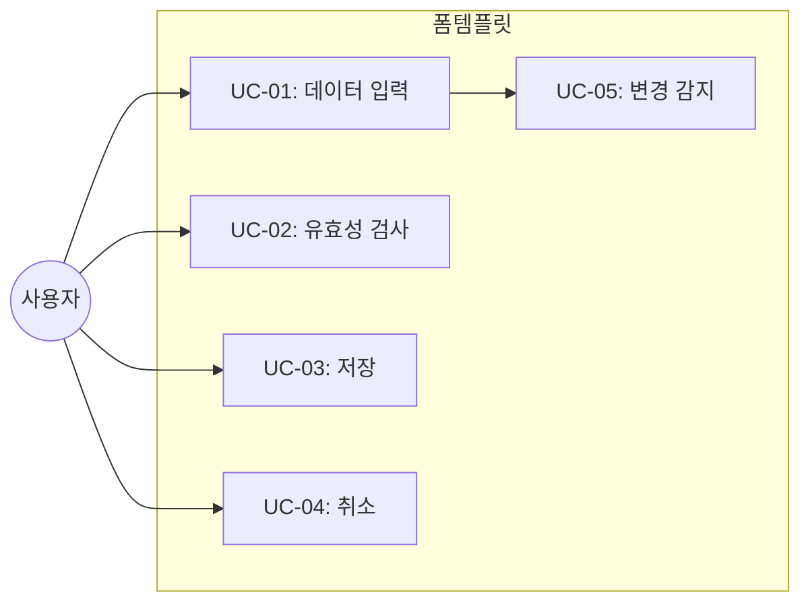

# TSK-06-03 - 입력/수정 폼 템플릿 설계 문서

## 문서 정보

| 항목 | 내용 |
|------|------|
| Task ID | TSK-06-03 |
| 문서 버전 | 1.0 |
| 작성일 | 2026-01-20 |
| 상태 | 작성중 |
| 카테고리 | development |

---

## 1. 개요

### 1.1 배경 및 문제 정의

**현재 상황:**
- 데이터 입력/수정 폼이 여러 화면에서 필요함
- 유효성 검사, 저장/취소, 변경 감지 등의 기능이 반복 구현됨

**해결하려는 문제:**
- 폼 화면의 표준 템플릿 부재
- 유효성 검사 및 상태 관리 중복

### 1.2 목적 및 기대 효과

**목적:**
- 재사용 가능한 입력/수정 폼 템플릿 제공
- Ant Design Form을 활용한 표준 레이아웃 및 유효성 검사

**기대 효과:**
- 폼 화면 개발 시간 단축
- 일관된 유효성 검사 UX

### 1.3 범위

**포함:**
- FormTemplate 컴포넌트 구현
- 폼 레이아웃 (수직/수평/인라인)
- 유효성 검사 통합
- 저장/취소 버튼
- 변경 감지 및 경고

**제외:**
- 개별 폼 필드 정의 (사용처에서 구현)

### 1.4 참조 문서

| 문서 | 경로 | 관련 섹션 |
|------|------|----------|
| PRD | `.orchay/projects/mes-portal/prd.md` | 4.1.1 화면 템플릿 - 입력/수정 폼 화면, 폼 검증 |
| TRD | `.orchay/projects/mes-portal/trd.md` | 7. 폼/입력 |

---

## 2. 사용자 분석

### 2.1 대상 사용자

| 사용자 유형 | 특성 | 주요 니즈 |
|------------|------|----------|
| 데이터 입력자 | 다량 데이터 입력 | 빠른 입력, 명확한 에러 안내 |
| 관리자 | 데이터 수정 | 변경 전 확인, 실수 방지 |

---

## 3. 유즈케이스

### 3.1 유즈케이스 다이어그램



### 3.2 유즈케이스 상세

#### UC-02: 유효성 검사

| 항목 | 내용 |
|------|------|
| 액터 | 시스템 |
| 목적 | 잘못된 데이터 입력 방지 |
| 사전 조건 | 사용자가 필드 입력 |
| 사후 조건 | 에러 메시지 표시 또는 통과 |
| 트리거 | 필드 blur 또는 저장 클릭 |

**기본 흐름:**
1. 사용자가 필드를 입력한다
2. 필드에서 포커스가 벗어난다
3. 시스템이 해당 필드의 유효성을 검사한다
4. 유효하면 통과, 무효하면 에러 메시지 표시

---

## 4. 사용자 시나리오

### 4.1 시나리오 1: 신규 등록

**상황 설명:**
사용자가 새로운 작업 지시를 등록한다.

**단계별 진행:**

| 단계 | 사용자 행동 | 시스템 반응 | 사용자 기대 |
|------|-----------|------------|------------|
| 1 | 신규 버튼 클릭 | 빈 폼 표시 | 입력 필드 포커스 |
| 2 | 필수 필드 입력 | 실시간 유효성 | 즉시 피드백 |
| 3 | 저장 클릭 | 전체 유효성 검사 | 성공/실패 안내 |
| 4 | - | 성공 시 목록 이동 | 저장 확인 |

### 4.2 시나리오 2: 변경 후 취소 시도

**상황 설명:**
사용자가 폼을 수정한 후 저장하지 않고 취소하려 한다.

**단계별 진행:**

| 단계 | 사용자 행동 | 시스템 반응 | 복구 방법 |
|------|-----------|------------|----------|
| 1 | 필드 수정 | 변경 감지 | - |
| 2 | 취소 클릭 | 확인 다이얼로그 | "저장하지 않은 내용이 있습니다" |
| 3 | 확인 클릭 | 이전 화면 이동 | - |

---

## 5. 화면 설계

### 5.1 화면별 상세

#### 화면 1: 입력/수정 폼 템플릿

**화면 목적:**
데이터 입력 및 수정을 위한 표준 폼 레이아웃

**와이어프레임:**
```
┌─────────────────────────────────────────────────────────────────┐
│  ┌───────────────────────────────────────────────────────────┐  │
│  │  📝 {제목} 등록/수정                                       │  │
│  └───────────────────────────────────────────────────────────┘  │
│                                                                  │
│  ┌───────────────────────────────────────────────────────────┐  │
│  │  ┌─────────────────────────────────────────────────────┐  │  │
│  │  │  필드명1 *                                          │  │  │
│  │  │  ┌───────────────────────────────────────────────┐  │  │  │
│  │  │  │ 입력값                                        │  │  │  │
│  │  │  └───────────────────────────────────────────────┘  │  │  │
│  │  │  ⚠️ 필수 항목입니다                                 │  │  │
│  │  └─────────────────────────────────────────────────────┘  │  │
│  │                                                            │  │
│  │  ┌─────────────────────────────────────────────────────┐  │  │
│  │  │  필드명2                                            │  │  │
│  │  │  ┌───────────────────────────────────────────────┐  │  │  │
│  │  │  │ 선택 ▼                                        │  │  │  │
│  │  │  └───────────────────────────────────────────────┘  │  │  │
│  │  └─────────────────────────────────────────────────────┘  │  │
│  │                                                            │  │
│  │  ┌─────────────────────┐ ┌─────────────────────┐          │  │
│  │  │  필드명3            │ │  필드명4            │          │  │
│  │  │  ┌───────────────┐  │ │  ┌───────────────┐  │          │  │
│  │  │  │ 2026-01-20    │  │ │  │ 12:00         │  │          │  │
│  │  │  └───────────────┘  │ │  └───────────────┘  │          │  │
│  │  └─────────────────────┘ └─────────────────────┘          │  │
│  │                                                            │  │
│  │  ┌─────────────────────────────────────────────────────┐  │  │
│  │  │  비고                                               │  │  │
│  │  │  ┌───────────────────────────────────────────────┐  │  │  │
│  │  │  │                                               │  │  │  │
│  │  │  │                                               │  │  │  │
│  │  │  └───────────────────────────────────────────────┘  │  │  │
│  │  └─────────────────────────────────────────────────────┘  │  │
│  └───────────────────────────────────────────────────────────┘  │
│                                                                  │
│  ┌───────────────────────────────────────────────────────────┐  │
│  │                                    [취소]  [💾 저장]       │  │
│  └───────────────────────────────────────────────────────────┘  │
└─────────────────────────────────────────────────────────────────┘
```

**화면 요소 설명:**

| 영역 | 설명 | 사용자 인터랙션 |
|------|------|----------------|
| 제목 | 등록/수정 구분 | - |
| 폼 필드 | 입력 영역 | 입력, 선택 |
| 필수 표시 (*) | 필수 필드 | - |
| 에러 메시지 | 유효성 실패 | - |
| 취소 버튼 | 변경 취소 | 확인 후 이동 |
| 저장 버튼 | 데이터 저장 | 유효성 검사 후 저장 |

---

## 6. 인터랙션 설계

### 6.1 사용자 액션과 피드백

| 사용자 액션 | 즉각 피드백 | 결과 피드백 | 에러 피드백 |
|------------|-----------|------------|------------|
| 필드 입력 | 입력 표시 | - | 실시간 유효성 |
| 저장 클릭 | 버튼 로딩 | 성공 토스트 + 이동 | 필드별 에러 표시 |
| 취소 클릭 | 확인 다이얼로그 | 이전 화면 이동 | - |

### 6.2 상태별 화면 변화

| 상태 | 화면 표시 | 사용자 안내 |
|------|----------|------------|
| 신규 등록 | 빈 폼 | 첫 필드 포커스 |
| 수정 모드 | 기존 값 채워진 폼 | 변경된 필드 표시 |
| 저장 중 | 저장 버튼 로딩 | - |
| 유효성 실패 | 에러 필드 하이라이트 | 첫 에러 필드 스크롤 |

---

## 7. 데이터 요구사항

### 7.1 Props 인터페이스

```typescript
interface FormTemplateProps<T> {
  // 폼 설정
  form?: FormInstance<T>
  initialValues?: Partial<T>
  layout?: 'horizontal' | 'vertical' | 'inline'

  // 폼 필드 (children)
  children: ReactNode

  // 액션
  onSubmit: (values: T) => Promise<void>
  onCancel?: () => void

  // 상태
  loading?: boolean
  submitText?: string
  cancelText?: string

  // 변경 감지
  enableDirtyCheck?: boolean

  // 헤더
  title?: string
}
```

---

## 8. 비즈니스 규칙

### 8.1 핵심 규칙

| 규칙 ID | 규칙 설명 | 적용 상황 |
|---------|----------|----------|
| BR-01 | 저장 전 유효성 검사 필수 | 저장 버튼 클릭 |
| BR-02 | 변경 시 취소 확인 | 취소 버튼 클릭, 페이지 이탈 |
| BR-03 | 필수 필드 표시 | 폼 렌더링 |
| BR-04 | 저장 중 중복 클릭 방지 | 저장 버튼 |

---

## 9. 에러 처리

### 9.1 예상 에러 상황

| 상황 | 원인 | 사용자 메시지 | 복구 방법 |
|------|------|--------------|----------|
| 유효성 실패 | 잘못된 입력 | 필드별 에러 표시 | 수정 후 재시도 |
| 저장 실패 | 서버 오류 | "저장에 실패했습니다" | 재시도 안내 |
| 중복 데이터 | 유니크 제약 | "이미 존재하는 항목입니다" | 값 수정 |

---

## 10. 연관 문서

| 문서 | 경로 | 용도 |
|------|------|------|
| 요구사항 추적 매트릭스 | `025-traceability-matrix.md` | PRD → 설계 → 테스트 추적 |
| 테스트 명세서 | `026-test-specification.md` | 테스트 케이스 정의 |

---

## 11. 구현 범위

### 11.1 영향받는 영역

| 영역 | 변경 내용 | 영향도 |
|------|----------|--------|
| components/templates/ | FormTemplate.tsx 신규 | 높음 |

### 11.2 의존성

| 의존 항목 | 이유 | 상태 |
|----------|------|------|
| Ant Design Form | 기반 컴포넌트 | 완료 |
| Ant Design Card | 컨테이너 | 완료 |
| TSK-05-02 확인 다이얼로그 | 취소 확인 | [dd] |

---

## 12. 체크리스트

### 12.1 설계 완료 확인

- [x] 문제 정의 및 목적 명확화
- [x] 사용자 분석 완료
- [x] 유즈케이스 정의 완료
- [x] 사용자 시나리오 작성 완료
- [x] 화면 설계 완료 (와이어프레임)
- [x] 인터랙션 설계 완료
- [x] 데이터 요구사항 정의 완료
- [x] 비즈니스 규칙 정의 완료
- [x] 에러 처리 정의 완료

---

## 변경 이력

| 버전 | 일자 | 작성자 | 변경 내용 |
|------|------|--------|----------|
| 1.0 | 2026-01-20 | Claude | 최초 작성 |
