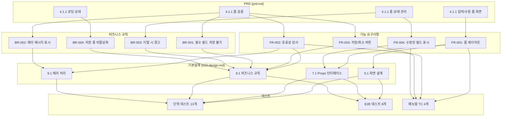

# 요구사항 추적성 매트릭스 (025-traceability-matrix.md)

**Template Version:** 1.0.0 — **Last Updated:** 2026-01-21

> **목적**: PRD -> 기본설계 -> 상세설계 -> 테스트 4단계 양방향 추적
>
> **참조**: 이 문서는 `010-design.md`와 `026-test-specification.md`와 함께 사용됩니다.

---

## 0. 문서 메타데이터

| 항목 | 내용 |
|------|------|
| Task ID | TSK-06-03 |
| Task명 | 입력/수정 폼 템플릿 |
| 기본설계 참조 | `010-design.md` |
| 테스트 명세 참조 | `026-test-specification.md` (작성 예정) |
| 작성일 | 2026-01-21 |
| 작성자 | Claude |

---

## 1. 기능 요구사항 추적 (FR -> 설계 -> 테스트)

> PRD -> 기본설계 -> 상세설계 -> 테스트케이스 매핑

| 요구사항 ID | PRD 섹션 | 기본설계 섹션 | 상세설계 섹션 | 단위 테스트 | E2E 테스트 | 매뉴얼 TC | 상태 |
|-------------|----------|--------------|--------------|-------------|------------|-----------|------|
| FR-001 | 4.1.1 화면 템플릿 | 5.1, 7.1 | - | UT-001, UT-002 | E2E-001 | TC-001 | 설계완료 |
| FR-002 | 4.1.1 폼 검증 | 3.2, 8.1, 9.1 | - | UT-003, UT-004, UT-005 | E2E-002 | TC-002 | 설계완료 |
| FR-003 | 4.1.1 폼 검증 | 4.2, 6.1, 8.1 | - | UT-006, UT-007 | E2E-003 | TC-003 | 설계완료 |
| FR-004 | 4.1.1 폼 상태 관리 | 4.2, 6.2 | - | UT-008, UT-009 | E2E-004 | TC-004 | 설계완료 |

### 1.1 요구사항별 상세 매핑

#### FR-001: 폼 레이아웃 - 수직/수평/인라인 레이아웃 지원

| 설계 단계 | 문서 | 섹션 | 구현 항목 |
|----------|------|------|----------|
| PRD | prd.md | 4.1.1 화면 템플릿 | 입력/수정 폼 화면 - 다양한 레이아웃 지원 |
| 기본설계 | 010-design.md | 5.1 | 화면 목적: 데이터 입력 및 수정을 위한 표준 폼 레이아웃 |
| 기본설계 | 010-design.md | 7.1 | Props: layout?: 'horizontal' \| 'vertical' \| 'inline' |
| 단위 테스트 | 026-test-specification.md | - | UT-001: vertical 레이아웃 렌더링, UT-002: horizontal/inline 레이아웃 전환 |
| E2E 테스트 | 026-test-specification.md | - | E2E-001: 레이아웃 모드별 렌더링 검증 |

#### FR-002: 유효성 검사 - 필수, 이메일, 전화번호, 숫자 범위, 정규식 등 검증

| 설계 단계 | 문서 | 섹션 | 구현 항목 |
|----------|------|------|----------|
| PRD | prd.md | 4.1.1 폼 검증 | 필수 필드 표시, 실시간 유효성 검사, 에러 메시지 표시, 검증 규칙 |
| 기본설계 | 010-design.md | 3.2 | UC-02: 유효성 검사 - 필드 blur 또는 저장 클릭 시 검증 |
| 기본설계 | 010-design.md | 8.1 | BR-01: 저장 전 유효성 검사 필수 |
| 기본설계 | 010-design.md | 9.1 | 에러 처리: 유효성 실패 시 필드별 에러 표시 |
| 단위 테스트 | 026-test-specification.md | - | UT-003: 필수 필드 검증, UT-004: 이메일/전화번호 형식 검증, UT-005: 숫자 범위 검증 |
| E2E 테스트 | 026-test-specification.md | - | E2E-002: 실시간 유효성 검사 동작 확인 |

#### FR-003: 저장/취소 버튼 - 저장 시 로딩, 취소 시 변경사항 경고

| 설계 단계 | 문서 | 섹션 | 구현 항목 |
|----------|------|------|----------|
| PRD | prd.md | 4.1.1 폼 검증 | 폼 전체 유효성 검사 (저장 버튼 클릭 시) |
| PRD | prd.md | 4.1.1 폼 상태 관리 | 저장되지 않은 변경사항 경고 |
| 기본설계 | 010-design.md | 4.2 | 시나리오 2: 변경 후 취소 시도 - 확인 다이얼로그 |
| 기본설계 | 010-design.md | 6.1 | 저장 클릭: 버튼 로딩 -> 성공 토스트 + 이동 / 에러 표시 |
| 기본설계 | 010-design.md | 8.1 | BR-04: 저장 중 중복 클릭 방지 |
| 단위 테스트 | 026-test-specification.md | - | UT-006: 저장 버튼 로딩 상태, UT-007: 취소 시 확인 다이얼로그 |
| E2E 테스트 | 026-test-specification.md | - | E2E-003: 저장/취소 플로우 전체 검증 |

#### FR-004: 수정된 필드 표시 - 변경 감지 및 시각적 표시

| 설계 단계 | 문서 | 섹션 | 구현 항목 |
|----------|------|------|----------|
| PRD | prd.md | 4.1.1 폼 상태 관리 | 수정된 필드 표시 (변경 감지) |
| 기본설계 | 010-design.md | 4.2 | 시나리오 2: 변경 감지 - 필드 수정 시 감지 |
| 기본설계 | 010-design.md | 6.2 | 수정 모드: 변경된 필드 표시 |
| 기본설계 | 010-design.md | 7.1 | Props: enableDirtyCheck?: boolean |
| 단위 테스트 | 026-test-specification.md | - | UT-008: 필드 변경 감지, UT-009: dirty 상태 시각적 표시 |
| E2E 테스트 | 026-test-specification.md | - | E2E-004: 수정 모드에서 변경 필드 하이라이트 검증 |

---

## 2. 비즈니스 규칙 추적 (BR -> 구현 -> 검증)

| 규칙 ID | PRD 출처 | 기본설계 섹션 | 구현 위치(개념) | 단위 테스트 | E2E 테스트 | 검증 방법 | 상태 |
|---------|----------|--------------|-----------------|-------------|------------|-----------|------|
| BR-001 | 4.1.1 폼 검증 | 8.1 | FormTemplate | UT-010 | E2E-005 | 필수 필드 미입력 시 저장 버튼 비활성화/에러 확인 | 설계완료 |
| BR-002 | 4.1.1 폼 검증 | 9.1 | FormTemplate | UT-011 | E2E-006 | 유효성 실패 필드에 에러 메시지 표시 확인 | 설계완료 |
| BR-003 | 4.1.1 폼 상태 관리 | 8.1 | FormTemplate | UT-012 | E2E-007 | 페이지 이탈 시 변경사항 경고 다이얼로그 확인 | 설계완료 |
| BR-004 | 4.1.1 로딩 상태 | 8.1 | FormTemplate | UT-013 | E2E-008 | 저장 중 폼 비활성화 및 로딩 표시 확인 | 설계완료 |

### 2.1 비즈니스 규칙별 상세 매핑

#### BR-001: 필수 필드 미입력 시 저장 불가

| 구분 | 내용 |
|------|------|
| **PRD 원문** | 필수 필드 표시 (별표 * 또는 레이블), 폼 전체 유효성 검사 (저장 버튼 클릭 시) |
| **기본설계 표현** | BR-01: 저장 전 유효성 검사 필수 |
| **구현 위치** | FormTemplate 컴포넌트 - onSubmit 핸들러 |
| **검증 방법** | 필수 필드를 비워둔 상태에서 저장 클릭 시 폼 제출 차단 및 에러 표시 |
| **관련 테스트** | UT-010, E2E-005 |

#### BR-002: 유효성 검사 실패 필드에 에러 메시지 표시

| 구분 | 내용 |
|------|------|
| **PRD 원문** | 에러 메시지 표시 (필드 하단, 빨간색), 실시간 유효성 검사 |
| **기본설계 표현** | 에러 처리: 유효성 실패 -> 필드별 에러 표시 |
| **구현 위치** | Ant Design Form.Item - validateStatus, help props |
| **검증 방법** | 잘못된 값 입력 후 blur 시 해당 필드에 에러 메시지 표시 확인 |
| **관련 테스트** | UT-011, E2E-006 |

#### BR-003: 저장되지 않은 변경사항이 있으면 페이지 이탈 시 경고

| 구분 | 내용 |
|------|------|
| **PRD 원문** | 저장되지 않은 변경사항 경고 (페이지 이탈 시) |
| **기본설계 표현** | BR-02: 변경 시 취소 확인 - 취소 버튼 클릭, 페이지 이탈 |
| **구현 위치** | FormTemplate - enableDirtyCheck, beforeunload 이벤트 |
| **검증 방법** | 폼 수정 후 취소/뒤로가기 시 "저장하지 않은 내용이 있습니다" 확인 다이얼로그 표시 |
| **관련 테스트** | UT-012, E2E-007 |

#### BR-004: 저장 중에는 폼 비활성화 및 로딩 표시

| 구분 | 내용 |
|------|------|
| **PRD 원문** | 버튼 로딩 상태 (스피너 + 비활성화) |
| **기본설계 표현** | BR-04: 저장 중 중복 클릭 방지, 상태: 저장 중 - 저장 버튼 로딩 |
| **구현 위치** | FormTemplate - loading prop, Button loading state |
| **검증 방법** | 저장 버튼 클릭 후 로딩 중에 버튼 비활성화 및 스피너 표시 확인 |
| **관련 테스트** | UT-013, E2E-008 |

---

## 3. 테스트 역추적 매트릭스

> 테스트 결과 -> 요구사항 역추적용 (build/verify 단계 결과서 생성 시 활용)

| 테스트 ID | 테스트 유형 | 검증 대상 요구사항 | 검증 대상 비즈니스 규칙 | 상태 |
|-----------|------------|-------------------|----------------------|------|
| UT-001 | 단위 | FR-001 | - | 미실행 |
| UT-002 | 단위 | FR-001 | - | 미실행 |
| UT-003 | 단위 | FR-002 | - | 미실행 |
| UT-004 | 단위 | FR-002 | - | 미실행 |
| UT-005 | 단위 | FR-002 | - | 미실행 |
| UT-006 | 단위 | FR-003 | - | 미실행 |
| UT-007 | 단위 | FR-003 | - | 미실행 |
| UT-008 | 단위 | FR-004 | - | 미실행 |
| UT-009 | 단위 | FR-004 | - | 미실행 |
| UT-010 | 단위 | - | BR-001 | 미실행 |
| UT-011 | 단위 | - | BR-002 | 미실행 |
| UT-012 | 단위 | - | BR-003 | 미실행 |
| UT-013 | 단위 | - | BR-004 | 미실행 |
| E2E-001 | E2E | FR-001 | - | 미실행 |
| E2E-002 | E2E | FR-002 | - | 미실행 |
| E2E-003 | E2E | FR-003 | - | 미실행 |
| E2E-004 | E2E | FR-004 | - | 미실행 |
| E2E-005 | E2E | - | BR-001 | 미실행 |
| E2E-006 | E2E | - | BR-002 | 미실행 |
| E2E-007 | E2E | - | BR-003 | 미실행 |
| E2E-008 | E2E | - | BR-004 | 미실행 |
| TC-001 | 매뉴얼 | FR-001 | - | 미실행 |
| TC-002 | 매뉴얼 | FR-002 | - | 미실행 |
| TC-003 | 매뉴얼 | FR-003 | - | 미실행 |
| TC-004 | 매뉴얼 | FR-004 | - | 미실행 |

---

## 4. 데이터 모델 추적

> 기본설계 엔티티 -> Prisma 모델 -> API DTO 매핑

| 기본설계 엔티티 | 상세설계 Prisma 모델 | API Request DTO | API Response DTO |
|----------------|---------------------|-----------------|------------------|
| FormTemplateProps | - | - | - |

> **참고**: 입력/수정 폼 템플릿은 순수 프론트엔드 컴포넌트로, 데이터 모델과 직접 연관되지 않습니다. 실제 폼의 데이터 구조는 사용처에서 제네릭 타입 `<T>`로 정의합니다.

---

## 5. 인터페이스 추적

> 기본설계 인터페이스 요구사항 -> API 엔드포인트 매핑

| 기본설계 인터페이스 | 상세설계 API | Method | Endpoint | 요구사항 |
|--------------------|-------------|--------|----------|----------|
| - | - | - | - | - |

> **참고**: 입력/수정 폼 템플릿은 UI 컴포넌트로, API 엔드포인트를 직접 정의하지 않습니다. API 호출은 `onSubmit` props를 통해 사용처에서 구현합니다.

---

## 6. 화면 추적

> 기본설계 화면 요구사항 -> 상세설계 컴포넌트 매핑

| 기본설계 화면 | 상세설계 화면 | 컴포넌트 | 요구사항 |
|--------------|--------------|----------|----------|
| 입력/수정 폼 템플릿 (5.1) | FormTemplate | components/templates/FormTemplate.tsx | FR-001, FR-002, FR-003, FR-004 |

### 6.1 컴포넌트 구조

```
components/templates/
└── FormTemplate.tsx          # 입력/수정 폼 템플릿 메인 컴포넌트

의존성:
├── Ant Design Form           # 폼 기반 컴포넌트
├── Ant Design Card           # 컨테이너
├── Ant Design Button         # 저장/취소 버튼
└── TSK-05-02 확인 다이얼로그  # 취소 확인용
```

---

## 7. 추적성 검증 요약

### 7.1 커버리지 통계

| 구분 | 총 항목 | 매핑 완료 | 미매핑 | 커버리지 |
|------|---------|----------|--------|---------|
| 기능 요구사항 (FR) | 4 | 4 | 0 | 100% |
| 비즈니스 규칙 (BR) | 4 | 4 | 0 | 100% |
| 단위 테스트 (UT) | 13 | 13 | 0 | 100% |
| E2E 테스트 | 8 | 8 | 0 | 100% |
| 매뉴얼 테스트 (TC) | 4 | 4 | 0 | 100% |

### 7.2 미매핑 항목 (있는 경우)

| 구분 | ID | 설명 | 미매핑 사유 |
|------|-----|------|-----------|
| - | - | - | 모든 항목 매핑 완료 |

### 7.3 추적성 다이어그램



---

## 관련 문서

- 기본설계: `010-design.md`
- 테스트 명세: `026-test-specification.md` (작성 예정)
- PRD: `.orchay/projects/mes-portal/prd.md`
- TRD: `.orchay/projects/mes-portal/trd.md`

---

## 변경 이력

| 버전 | 일자 | 작성자 | 변경 내용 |
|------|------|--------|----------|
| 1.0 | 2026-01-21 | Claude | 최초 작성 - 요구사항 추적성 매트릭스 |

---

<!--
Task: TSK-06-03 입력/수정 폼 템플릿
PRD 참조: 4.1.1 입력/수정 폼 화면, 폼 검증
구현 범위: 폼 레이아웃, 유효성 검사, 저장/취소 버튼, 수정된 필드 표시
-->
