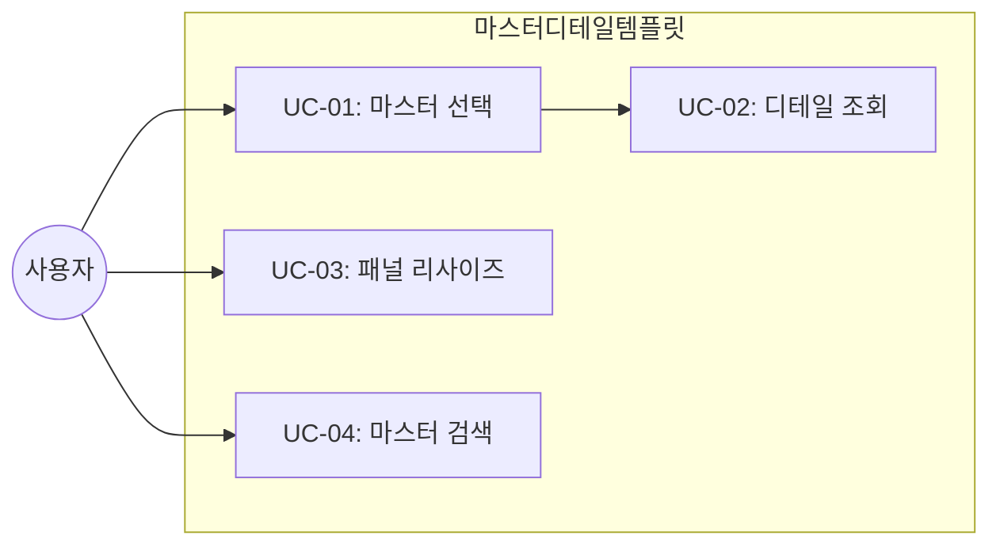

# TSK-06-04 - 마스터-디테일 화면 템플릿 설계 문서

## 문서 정보

| 항목 | 내용 |
|------|------|
| Task ID | TSK-06-04 |
| 문서 버전 | 1.0 |
| 작성일 | 2026-01-20 |
| 상태 | 작성중 |
| 카테고리 | development |

---

## 1. 개요

### 1.1 배경 및 문제 정의

**현재 상황:**
- 부모-자식 관계 데이터를 표시하는 화면이 필요함 (예: 카테고리-제품, 부서-사원)
- 좌측 마스터 선택 시 우측에 디테일을 표시하는 패턴이 반복됨

**해결하려는 문제:**
- 마스터-디테일 레이아웃의 표준 템플릿 부재
- 분할 패널 리사이즈 기능 반복 구현

### 1.2 목적 및 기대 효과

**목적:**
- 재사용 가능한 마스터-디테일 화면 템플릿 제공
- 분할 패널, 마스터 선택 연동, 디테일 로딩 표준화

**기대 효과:**
- 복잡한 데이터 관계 화면 개발 간소화
- 일관된 마스터-디테일 UX

### 1.3 범위

**포함:**
- MasterDetailTemplate 컴포넌트 구현
- 좌우 분할 레이아웃 (리사이즈 가능)
- 마스터 영역 (List 또는 Tree)
- 디테일 영역 (사용처에서 정의)

**제외:**
- 개별 데이터 로딩 로직

### 1.4 참조 문서

| 문서 | 경로 | 관련 섹션 |
|------|------|----------|
| PRD | `.orchay/projects/mes-portal/prd.md` | 4.1.1 화면 템플릿 - 마스터-디테일 화면 |
| TRD | `.orchay/projects/mes-portal/trd.md` | react-split-pane |

---

## 2. 사용자 분석

### 2.1 대상 사용자

| 사용자 유형 | 특성 | 주요 니즈 |
|------------|------|----------|
| 관리자 | 계층 데이터 관리 | 마스터 선택 → 디테일 빠른 확인 |
| 일반 사용자 | 데이터 조회 | 직관적인 네비게이션 |

---

## 3. 유즈케이스

### 3.1 유즈케이스 다이어그램



### 3.2 유즈케이스 상세

#### UC-01: 마스터 선택

| 항목 | 내용 |
|------|------|
| 액터 | 일반 사용자 |
| 목적 | 상위 데이터 선택 |
| 사전 조건 | 마스터 목록 로딩 완료 |
| 사후 조건 | 선택 항목 강조, 디테일 로딩 |
| 트리거 | 마스터 항목 클릭 |

---

## 4. 사용자 시나리오

### 4.1 시나리오 1: 카테고리별 제품 조회

**상황 설명:**
사용자가 카테고리를 선택하여 해당 카테고리의 제품 목록을 조회한다.

**단계별 진행:**

| 단계 | 사용자 행동 | 시스템 반응 | 사용자 기대 |
|------|-----------|------------|------------|
| 1 | 화면 진입 | 카테고리 목록 로딩 | 트리 구조 표시 |
| 2 | 카테고리 클릭 | 선택 강조, 제품 목록 로딩 | 즉시 반응 |
| 3 | 패널 경계 드래그 | 패널 크기 조절 | 부드러운 리사이즈 |
| 4 | 다른 카테고리 클릭 | 디테일 갱신 | 빠른 전환 |

---

## 5. 화면 설계

### 5.1 화면별 상세

#### 화면 1: 마스터-디테일 템플릿

**화면 목적:**
부모-자식 관계 데이터의 연동 조회

**와이어프레임:**
```
┌─────────────────────────────────────────────────────────────────┐
│                                                                  │
│  ┌─────────────────┬─┬─────────────────────────────────────────┐│
│  │  📁 마스터 영역  │↔│  📊 디테일 영역                          ││
│  │                 │ │                                          ││
│  │  🔍 검색        │ │  선택된 항목: {마스터명}                  ││
│  │  ┌───────────┐  │ │                                          ││
│  │  │           │  │ │  ┌────────────────────────────────────┐  ││
│  │  └───────────┘  │ │  │                                    │  ││
│  │                 │ │  │          디테일 컨텐츠              │  ││
│  │  📂 항목 1      │ │  │     (Table, Card, Form 등)         │  ││
│  │    ├─ 하위 1    │ │  │                                    │  ││
│  │    └─ 하위 2    │ │  │                                    │  ││
│  │  📂 항목 2      │ │  │                                    │  ││
│  │    └─ 하위 3    │ │  │                                    │  ││
│  │  📂 항목 3      │ │  │                                    │  ││
│  │                 │ │  │                                    │  ││
│  │                 │ │  └────────────────────────────────────┘  ││
│  │                 │ │                                          ││
│  └─────────────────┴─┴─────────────────────────────────────────┘│
│                                                                  │
└─────────────────────────────────────────────────────────────────┘

↔ = 드래그 가능한 분할 경계
```

**화면 요소 설명:**

| 영역 | 설명 | 사용자 인터랙션 |
|------|------|----------------|
| 마스터 영역 | 상위 데이터 목록/트리 | 항목 클릭, 검색 |
| 분할 경계 | 리사이즈 핸들 | 드래그로 크기 조절 |
| 디테일 영역 | 선택된 마스터의 하위 데이터 | 조회, CRUD |
| 검색 | 마스터 필터링 | 텍스트 입력 |

---

## 6. 인터랙션 설계

### 6.1 사용자 액션과 피드백

| 사용자 액션 | 즉각 피드백 | 결과 피드백 | 에러 피드백 |
|------------|-----------|------------|------------|
| 마스터 클릭 | 선택 하이라이트 | 디테일 로딩 | - |
| 패널 드래그 | 실시간 크기 변경 | 크기 고정 | 최소 크기 제한 |
| 검색 입력 | 필터링 결과 | - | 결과 없음 표시 |

### 6.2 상태별 화면 변화

| 상태 | 화면 표시 | 사용자 안내 |
|------|----------|------------|
| 초기 (미선택) | 마스터만 표시, 디테일 안내 | "항목을 선택하세요" |
| 마스터 선택됨 | 디테일 로딩/표시 | - |
| 디테일 로딩 중 | 디테일 영역 Skeleton | - |

---

## 7. 데이터 요구사항

### 7.1 Props 인터페이스

```typescript
interface MasterDetailTemplateProps<M, D> {
  // 마스터 영역
  masterTitle?: string
  masterContent: ReactNode
  onMasterSelect?: (item: M) => void
  selectedMaster?: M

  // 디테일 영역
  detailTitle?: string
  detailContent: ReactNode
  detailLoading?: boolean

  // 레이아웃
  defaultSplit?: number // 기본 분할 비율 (0-100)
  minMasterWidth?: number
  minDetailWidth?: number

  // 검색
  masterSearchable?: boolean
  onMasterSearch?: (keyword: string) => void
}
```

---

## 8. 비즈니스 규칙

### 8.1 핵심 규칙

| 규칙 ID | 규칙 설명 | 적용 상황 |
|---------|----------|----------|
| BR-01 | 마스터 미선택 시 디테일 안내 표시 | 초기 상태 |
| BR-02 | 패널 최소 너비 유지 | 리사이즈 시 |
| BR-03 | 마스터 선택 유지 | 디테일 조작 중 |

---

## 9. 에러 처리

### 9.1 예상 에러 상황

| 상황 | 원인 | 사용자 메시지 | 복구 방법 |
|------|------|--------------|----------|
| 마스터 로딩 실패 | 네트워크 오류 | "목록을 불러오지 못했습니다" | 재시도 버튼 |
| 디테일 로딩 실패 | 서버 오류 | "상세 정보를 불러오지 못했습니다" | 재시도 버튼 |

---

## 10. 연관 문서

| 문서 | 경로 | 용도 |
|------|------|------|
| 요구사항 추적 매트릭스 | `025-traceability-matrix.md` | PRD → 설계 → 테스트 추적 |
| 테스트 명세서 | `026-test-specification.md` | 테스트 케이스 정의 |

---

## 11. 구현 범위

### 11.1 영향받는 영역

| 영역 | 변경 내용 | 영향도 |
|------|----------|--------|
| components/templates/ | MasterDetailTemplate.tsx 신규 | 높음 |

### 11.2 의존성

| 의존 항목 | 이유 | 상태 |
|----------|------|------|
| react-split-pane 또는 Ant Design Splitter | 분할 패널 | 라이브러리 |
| TSK-06-01 목록 템플릿 | 디테일 영역 | [dd] |

---

## 12. 체크리스트

### 12.1 설계 완료 확인

- [x] 문제 정의 및 목적 명확화
- [x] 사용자 분석 완료
- [x] 유즈케이스 정의 완료
- [x] 사용자 시나리오 작성 완료
- [x] 화면 설계 완료 (와이어프레임)
- [x] 인터랙션 설계 완료
- [x] 데이터 요구사항 정의 완료
- [x] 비즈니스 규칙 정의 완료
- [x] 에러 처리 정의 완료

---

## 변경 이력

| 버전 | 일자 | 작성자 | 변경 내용 |
|------|------|--------|----------|
| 1.0 | 2026-01-20 | Claude | 최초 작성 |
