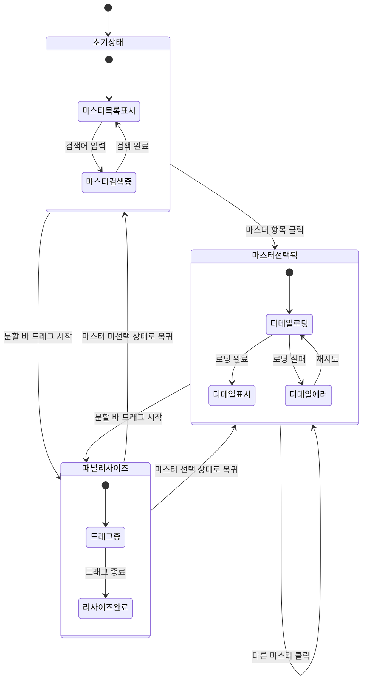

# TSK-06-04 - 마스터-디테일 화면 템플릿 UI 설계

**Version:** 1.0 --- **Last Updated:** 2026-01-21

> **목적**: 마스터-디테일 화면 템플릿의 화면 설계 및 인터랙션 정의

---

## 1. 화면 목록

| 화면 ID | 화면명 | 목적 | SVG 참조 |
|---------|--------|------|----------|
| SCR-01 | 초기 상태 (마스터 미선택) | 마스터 목록 표시, 디테일 영역 안내 | `screen-01-initial-state.svg` |
| SCR-02 | 마스터 선택 후 디테일 로딩 | 선택 피드백, 로딩 상태 표시 | `screen-02-detail-loading.svg` |
| SCR-03 | 마스터 선택 완료 (디테일 표시) | 마스터-디테일 연동 표시 | `screen-03-detail-loaded.svg` |
| SCR-04 | 패널 리사이즈 중 | 분할 바 드래그 인터랙션 | `screen-04-panel-resize.svg` |

---

## 2. 화면 전환 흐름

### 2.1 상태 다이어그램



### 2.2 액션-화면 매트릭스

| 액션 | 현재 상태 | 결과 상태 | 트리거 |
|------|----------|----------|--------|
| 마스터 항목 클릭 | 초기 상태 | 디테일 로딩 | 사용자 |
| 마스터 항목 클릭 | 디테일 표시 중 | 새 디테일 로딩 | 사용자 |
| 디테일 로딩 완료 | 디테일 로딩 | 디테일 표시 | 시스템 |
| 분할 바 드래그 시작 | 모든 상태 | 패널 리사이즈 | 사용자 |
| 분할 바 드래그 종료 | 패널 리사이즈 | 이전 상태 | 사용자 |
| 검색어 입력 | 마스터 목록 표시 | 필터링된 목록 | 사용자 |
| 검색어 삭제 | 필터링된 목록 | 전체 목록 | 사용자 |

---

## 3. 화면별 상세

### 3.1 SCR-01: 초기 상태 (마스터 미선택)

**화면 목적**: 마스터 목록을 표시하고 사용자에게 선택을 안내

**레이아웃 구조**:
```
┌─────────────────────────────────────────────────────────────────────────┐
│                                                                          │
│  ┌────────────────────────┬───┬────────────────────────────────────────┐│
│  │  마스터 영역 (300px)    │ ↔ │  디테일 영역 (나머지)                    ││
│  │                        │   │                                          ││
│  │  🔍 검색               │   │  ┌────────────────────────────────────┐  ││
│  │  ┌──────────────────┐  │   │  │                                    │  ││
│  │  │ 검색어 입력...     │  │   │  │                                    │  ││
│  │  └──────────────────┘  │   │  │                                    │  ││
│  │                        │   │  │     📋 항목을 선택하세요            │  ││
│  │  ┌──────────────────┐  │   │  │                                    │  ││
│  │  │ 📁 카테고리 A      │  │   │  │     좌측 목록에서 항목을           │  ││
│  │  │   ├─ 항목 A-1     │  │   │  │     선택하면 상세 정보가           │  ││
│  │  │   ├─ 항목 A-2     │  │   │  │     이 영역에 표시됩니다.          │  ││
│  │  │   └─ 항목 A-3     │  │   │  │                                    │  ││
│  │  │ 📁 카테고리 B      │  │   │  │                                    │  ││
│  │  │   ├─ 항목 B-1     │  │   │  └────────────────────────────────────┘  ││
│  │  │   └─ 항목 B-2     │  │   │                                          ││
│  │  │ 📁 카테고리 C      │  │   │                                          ││
│  │  │   └─ 항목 C-1     │  │   │                                          ││
│  │  └──────────────────┘  │   │                                          ││
│  │                        │   │                                          ││
│  └────────────────────────┴───┴────────────────────────────────────────┘│
│                                                                          │
└─────────────────────────────────────────────────────────────────────────┘

↔ = 드래그 가능한 분할 바 (4px, 호버 시 강조)
```

**컴포넌트 구성**:

| 영역 | 컴포넌트 | Props | 비고 |
|------|----------|-------|------|
| 컨테이너 | `MasterDetailTemplate` | `defaultSplit={30}` | 템플릿 루트 |
| 마스터 패널 | `Splitter.Panel` | `min={200}, collapsible` | 좌측 패널 |
| 분할 바 | `Splitter` | `lazy` | Ant Design Splitter |
| 디테일 패널 | `Splitter.Panel` | `min={300}` | 우측 패널 |
| 검색창 | `Input.Search` | `placeholder="검색..."` | 마스터 필터 |
| 마스터 목록 | `Tree` / `List` | `selectedKeys, onSelect` | 트리 또는 리스트 |
| 빈 상태 안내 | `Empty` | `description="항목을 선택하세요"` | 디테일 초기 |

**상태 관리**:
- `selectedMaster: null`
- `masterData: TreeNode[] | ListItem[]`
- `searchKeyword: ''`
- `splitSize: [30, 70]` (퍼센트)

**스타일 토큰**:

| 요소 | CSS Variable | 값 |
|------|-------------|-----|
| 마스터 패널 기본 너비 | `--master-panel-default` | 300px (30%) |
| 마스터 패널 최소 너비 | `--master-panel-min` | 200px |
| 디테일 패널 최소 너비 | `--detail-panel-min` | 300px |
| 분할 바 너비 | `--splitter-size` | 4px |
| 분할 바 호버 색상 | `--splitter-hover-color` | token.colorPrimary |

---

### 3.2 SCR-02: 마스터 선택 후 디테일 로딩

**화면 목적**: 마스터 선택 시 디테일 데이터 로딩 상태 표시

**레이아웃 구조**:
```
┌─────────────────────────────────────────────────────────────────────────┐
│                                                                          │
│  ┌────────────────────────┬───┬────────────────────────────────────────┐│
│  │  마스터 영역            │ ↔ │  디테일 영역                            ││
│  │                        │   │                                          ││
│  │  🔍 검색               │   │  선택된 항목: 카테고리 A > 항목 A-1     ││
│  │  ┌──────────────────┐  │   │                                          ││
│  │  │                   │  │   │  ┌────────────────────────────────────┐  ││
│  │  └──────────────────┘  │   │  │  ░░░░░░░░░░░░░░░░░░░░░░░░░░░░░░    │  ││
│  │                        │   │  │  ░░░░░░░░░░░░░░░░░░░░░░░░░░░░░░    │  ││
│  │  ┌──────────────────┐  │   │  │  ░░░░░░░░░░░░░░░░░░░░░░░░░░░░░░    │  ││
│  │  │ 📁 카테고리 A      │  │   │  │                                    │  ││
│  │  │   ├─ 항목 A-1 ◀━━│━━│━━━│━━│━━ Skeleton Loading                 │  ││
│  │  │   ├─ 항목 A-2     │  │   │  │  ░░░░░░░░░░░░░░░░░░░░░░░░░░░░░░    │  ││
│  │  │   └─ 항목 A-3     │  │   │  │  ░░░░░░░░░░░░░░░░░░░░░░░░░░░░░░    │  ││
│  │  │ 📁 카테고리 B      │  │   │  │  ░░░░░░░░░░░░░░░░░░░░░░░░░░░░░░    │  ││
│  │  │ 📁 카테고리 C      │  │   │  │                                    │  ││
│  │  └──────────────────┘  │   │  └────────────────────────────────────┘  ││
│  │                        │   │                                          ││
│  └────────────────────────┴───┴────────────────────────────────────────┘│
│                                                                          │
└─────────────────────────────────────────────────────────────────────────┘

◀━━ = 선택된 항목 (Primary 배경색)
░░░ = Skeleton 로딩 애니메이션
```

**컴포넌트 구성**:

| 영역 | 컴포넌트 | Props | 비고 |
|------|----------|-------|------|
| 선택된 마스터 | `Tree.TreeNode` | `selected={true}` | 배경 강조 |
| 디테일 헤더 | `Breadcrumb` | - | 선택 경로 표시 |
| 로딩 상태 | `Skeleton` | `active, paragraph={{rows: 8}}` | 애니메이션 |
| 로딩 상태 | `Spin` | `spinning={true}` | 대안적 표시 |

**상태 관리**:
- `selectedMaster: { id: 'A-1', name: '항목 A-1' }`
- `detailLoading: true`
- `detailData: null`

**사용자 피드백**:

| 피드백 유형 | 표시 방식 | 지속 시간 |
|------------|----------|----------|
| 선택 하이라이트 | 배경색 변경 | 즉시 |
| 로딩 시작 | Skeleton 표시 | 로딩 완료까지 |

---

### 3.3 SCR-03: 마스터 선택 완료 (디테일 표시)

**화면 목적**: 선택된 마스터의 디테일 데이터 표시

**레이아웃 구조**:
```
┌─────────────────────────────────────────────────────────────────────────┐
│                                                                          │
│  ┌────────────────────────┬───┬────────────────────────────────────────┐│
│  │  마스터 영역            │ ↔ │  디테일 영역                            ││
│  │                        │   │                                          ││
│  │  🔍 검색               │   │  선택된 항목: 카테고리 A > 항목 A-1     ││
│  │  ┌──────────────────┐  │   │                                          ││
│  │  │                   │  │   │  ┌────────────────────────────────────┐  ││
│  │  └──────────────────┘  │   │  │  🔧 [추가] [편집] [삭제] [새로고침]  │  ││
│  │                        │   │  ├────────────────────────────────────┤  ││
│  │  ┌──────────────────┐  │   │  │                                    │  ││
│  │  │ 📁 카테고리 A      │  │   │  │  ┌──────┬──────┬──────┬────────┐ │  ││
│  │  │   ├─ 항목 A-1 ◀   │  │   │  │  │ ID   │ 이름  │ 상태  │ 수정일  │ │  ││
│  │  │   ├─ 항목 A-2     │  │   │  │  ├──────┼──────┼──────┼────────┤ │  ││
│  │  │   └─ 항목 A-3     │  │   │  │  │ 001  │ 데이터1│ 활성  │ 01-20  │ │  ││
│  │  │ 📁 카테고리 B      │  │   │  │  │ 002  │ 데이터2│ 비활성│ 01-19  │ │  ││
│  │  │ 📁 카테고리 C      │  │   │  │  │ 003  │ 데이터3│ 활성  │ 01-18  │ │  ││
│  │  └──────────────────┘  │   │  │  └──────┴──────┴──────┴────────┘ │  ││
│  │                        │   │  │                                    │  ││
│  │                        │   │  │  [< 이전] 페이지 1/3 [다음 >]      │  ││
│  │                        │   │  └────────────────────────────────────┘  ││
│  │                        │   │                                          ││
│  └────────────────────────┴───┴────────────────────────────────────────┘│
│                                                                          │
└─────────────────────────────────────────────────────────────────────────┘
```

**컴포넌트 구성**:

| 영역 | 컴포넌트 | Props | 비고 |
|------|----------|-------|------|
| 디테일 헤더 | `Breadcrumb` | - | 선택 경로 |
| 툴바 | `Space` | - | 액션 버튼 그룹 |
| 디테일 컨텐츠 | `Table` / `Card` / `Form` | - | 사용처 정의 |
| 페이지네이션 | `Pagination` | `size="small"` | 옵션 |

**상태 관리**:
- `selectedMaster: { id: 'A-1', name: '항목 A-1', path: ['카테고리 A', '항목 A-1'] }`
- `detailLoading: false`
- `detailData: DetailItem[]`

**사용자 인터랙션**:

| 액션 | 요소 | 결과 |
|------|------|------|
| 다른 마스터 클릭 | Tree/List 항목 | 디테일 갱신 |
| 디테일 행 클릭 | Table Row | 상세 조회/편집 |
| 툴바 버튼 클릭 | Button | CRUD 동작 |

---

### 3.4 SCR-04: 패널 리사이즈 중

**화면 목적**: 분할 바 드래그를 통한 패널 크기 조절

**레이아웃 구조**:
```
┌─────────────────────────────────────────────────────────────────────────┐
│                                                                          │
│  ┌──────────────┬─────────┬────────────────────────────────────────────┐│
│  │  마스터 영역  │ ↔ 드래그│  디테일 영역                                ││
│  │              │         │                                              ││
│  │  (리사이즈   │         │  (리사이즈 중 - 반투명 오버레이)              ││
│  │   미리보기)  │         │                                              ││
│  │              │  ┃      │                                              ││
│  │  200px       │  ┃      │  나머지                                      ││
│  │  (최소)      │  ┃      │                                              ││
│  │              │  ┃      │                                              ││
│  │              │  ┃      │                                              ││
│  │              │  ┃      │                                              ││
│  │              │         │                                              ││
│  │              │         │                                              ││
│  └──────────────┴─────────┴────────────────────────────────────────────┘│
│                                                                          │
│  ┌─────────────────────────────────────────────────────────────────────┐│
│  │  💡 드래그하여 패널 크기를 조절하세요. 최소: 마스터 200px / 디테일 300px ││
│  └─────────────────────────────────────────────────────────────────────┘│
│                                                                          │
└─────────────────────────────────────────────────────────────────────────┘

┃ = 활성화된 분할 바 (Primary 색상, 커서 col-resize)
```

**상태별 분할 바 스타일**:

| 상태 | 배경색 | 너비 | 커서 |
|------|--------|------|------|
| 기본 | transparent | 4px | default |
| 호버 | token.colorPrimaryBg | 4px | col-resize |
| 드래그 | token.colorPrimary | 4px | col-resize |

**리사이즈 제약 조건**:

| 제약 | 값 | 설명 |
|------|-----|------|
| 마스터 최소 너비 | 200px | 검색창, 트리 최소 표시 |
| 디테일 최소 너비 | 300px | 테이블 최소 가독성 |
| 마스터 최대 너비 | 50% | 전체 너비의 절반 |

**애니메이션**:
- 분할 바 색상 변화: 100ms, ease
- 패널 크기 변화: 실시간 (lazy 모드 시 드래그 종료 후)

---

## 4. 공통 컴포넌트

### 4.1 MasterDetailTemplate

```typescript
interface MasterDetailTemplateProps<M = unknown> {
  // 마스터 영역
  masterTitle?: string
  masterContent: ReactNode
  masterSearchable?: boolean
  onMasterSearch?: (keyword: string) => void
  selectedMaster?: M | null
  onMasterSelect?: (item: M) => void

  // 디테일 영역
  detailTitle?: ReactNode
  detailContent: ReactNode
  detailLoading?: boolean
  detailEmpty?: ReactNode

  // 레이아웃
  defaultSplit?: [number, number]  // [마스터%, 디테일%]
  minMasterWidth?: number
  minDetailWidth?: number
  maxMasterWidth?: number | string

  // 이벤트
  onSplitChange?: (sizes: [number, number]) => void
}
```

### 4.2 MasterPanel

```typescript
interface MasterPanelProps {
  title?: string
  searchable?: boolean
  searchPlaceholder?: string
  onSearch?: (keyword: string) => void
  children: ReactNode
}
```

**렌더링**:
```
┌─────────────────────┐
│ 제목 (옵션)          │
├─────────────────────┤
│ 🔍 검색창 (옵션)     │
├─────────────────────┤
│                     │
│ children            │
│ (Tree / List)       │
│                     │
└─────────────────────┘
```

### 4.3 DetailPanel

```typescript
interface DetailPanelProps {
  title?: ReactNode           // Breadcrumb 등
  loading?: boolean
  empty?: ReactNode           // 미선택 시 표시
  children: ReactNode
}
```

**상태별 렌더링**:

| 조건 | 렌더링 |
|------|--------|
| `loading === true` | `<Skeleton active />` |
| `children === null` | `empty` 컴포넌트 |
| 그 외 | `children` |

### 4.4 상태별 스타일

| 상태 | 마스터 항목 스타일 |
|------|-------------------|
| 기본 | `background: transparent` |
| 호버 | `background: token.colorBgTextHover` |
| 선택됨 | `background: token.colorPrimaryBg`, `color: token.colorPrimary` |
| 비활성 | `color: token.colorTextDisabled` |

---

## 5. 반응형 설계

### 5.1 Breakpoint 정의

| Breakpoint | 너비 범위 | 레이아웃 |
|------------|----------|----------|
| Desktop | 1024px+ | 좌우 분할 (Splitter) |
| Tablet | 768-1023px | 좌우 분할 (고정 비율) |
| Mobile | 0-767px | 상하 스택 또는 탭 전환 |

### 5.2 반응형 동작

**Desktop (1024px+)**:
```
┌─────────────┬───┬─────────────────────────┐
│   마스터     │ ↔ │        디테일            │
│   (30%)     │   │        (70%)            │
└─────────────┴───┴─────────────────────────┘
- 분할 바 드래그 가능
- 최소/최대 너비 제한 적용
```

**Tablet (768-1023px)**:
```
┌─────────────┬─────────────────────────────┐
│   마스터     │          디테일              │
│   (250px)   │       (나머지)              │
└─────────────┴─────────────────────────────┘
- 마스터 고정 너비 (250px)
- 분할 바 드래그 비활성화
```

**Mobile (0-767px)**:
```
┌─────────────────────────────────────────────┐
│  [마스터] [디테일]  ← 탭 전환                 │
├─────────────────────────────────────────────┤
│                                              │
│         선택된 탭 컨텐츠                      │
│                                              │
└─────────────────────────────────────────────┘
- 탭으로 마스터/디테일 전환
- 마스터 선택 시 자동으로 디테일 탭 전환
```

### 5.3 반응형 구현

```typescript
const getLayoutMode = (width: number): 'split' | 'fixed' | 'tabs' => {
  if (width >= 1024) return 'split'    // Desktop: 분할 가능
  if (width >= 768) return 'fixed'     // Tablet: 고정 분할
  return 'tabs'                         // Mobile: 탭 전환
}
```

---

## 6. 접근성

### 6.1 키보드 네비게이션

| 키 | 컨텍스트 | 동작 |
|-----|---------|------|
| `Tab` | 전체 | 마스터 -> 분할바 -> 디테일 포커스 이동 |
| `ArrowUp` / `ArrowDown` | 마스터 목록 | 항목 간 이동 |
| `ArrowLeft` / `ArrowRight` | 마스터 트리 | 노드 펼침/접힘 |
| `Enter` | 마스터 항목 | 항목 선택 |
| `ArrowLeft` / `ArrowRight` | 분할 바 포커스 | 패널 크기 조절 (10px 단위) |
| `Home` / `End` | 분할 바 포커스 | 최소/최대 크기로 이동 |

### 6.2 ARIA 속성

| 요소 | ARIA 속성 | 값 |
|------|----------|-----|
| 컨테이너 | `role` | `group` |
| 컨테이너 | `aria-label` | "마스터-디테일 레이아웃" |
| 마스터 패널 | `role` | `region` |
| 마스터 패널 | `aria-label` | "마스터 목록" |
| 디테일 패널 | `role` | `region` |
| 디테일 패널 | `aria-label` | "상세 정보" |
| 디테일 패널 | `aria-live` | `polite` |
| 분할 바 | `role` | `separator` |
| 분할 바 | `aria-orientation` | `vertical` |
| 분할 바 | `aria-valuenow` | 현재 분할 위치 (%) |
| 분할 바 | `aria-valuemin` | 최소값 (%) |
| 분할 바 | `aria-valuemax` | 최대값 (%) |
| 마스터 항목 (선택됨) | `aria-selected` | `true` |
| 검색 입력 | `aria-label` | "마스터 목록 검색" |

### 6.3 스크린 리더 안내

| 상황 | 안내 문구 |
|------|----------|
| 마스터 선택 | "{항목명} 선택됨, 상세 정보 로딩 중" |
| 디테일 로딩 완료 | "상세 정보 로딩 완료, {N}개 항목" |
| 디테일 에러 | "상세 정보를 불러오지 못했습니다" |
| 패널 리사이즈 | "마스터 패널 {N}%, 디테일 패널 {100-N}%" |
| 검색 결과 | "검색 결과 {N}개 항목" |

### 6.4 색상 대비

- 텍스트 vs 배경: 최소 4.5:1 (WCAG AA)
- 선택 상태 표시: 배경색 + 텍스트색 모두 변경
- 분할 바 호버: 명확한 시각적 피드백

### 6.5 포커스 표시

| 요소 | 포커스 스타일 |
|------|-------------|
| 마스터 항목 | `outline: 2px solid token.colorPrimary` |
| 분할 바 | `outline: 2px solid token.colorPrimary`, `background: token.colorPrimaryBg` |
| 디테일 내 요소 | 각 컴포넌트 기본 포커스 |

---

## 7. SVG 파일 목록

| 파일명 | 설명 | 뷰포트 |
|--------|------|--------|
| `screen-01-initial-state.svg` | 마스터-디테일 초기 상태 (미선택) | 800x500 |
| `screen-02-detail-loading.svg` | 마스터 선택 후 디테일 로딩 | 800x500 |
| `screen-03-detail-loaded.svg` | 마스터 선택 완료 (디테일 표시) | 800x500 |
| `screen-04-panel-resize.svg` | 패널 리사이즈 중 상태 | 800x500 |

---

## 관련 문서

- 설계: `010-design.md`
- 테스트 명세: `026-test-specification.md`
- 추적성 매트릭스: `025-traceability-matrix.md`

---

<!--
TSK-06-04 마스터-디테일 화면 템플릿
Version: 1.0
Created: 2026-01-21
-->
