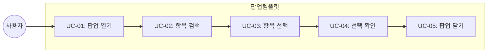

# TSK-06-05 - 팝업(모달) 화면 템플릿 설계 문서

## 문서 정보

| 항목 | 내용 |
|------|------|
| Task ID | TSK-06-05 |
| 문서 버전 | 1.0 |
| 작성일 | 2026-01-20 |
| 상태 | 작성중 |
| 카테고리 | development |

---

## 1. 개요

### 1.1 배경 및 문제 정의

**현재 상황:**
- 모달 팝업에서 항목을 검색하고 선택하는 패턴이 반복됨
- 부모 화면에 선택 값을 전달하는 로직이 매번 구현됨

**해결하려는 문제:**
- 선택형 팝업 화면의 표준 템플릿 부재
- 검색/선택/전달 로직 중복

### 1.2 목적 및 기대 효과

**목적:**
- 재사용 가능한 선택형 팝업 템플릿 제공
- 검색, 목록, 단일/다중 선택, 값 전달 표준화

**기대 효과:**
- 팝업 화면 개발 간소화
- 일관된 팝업 UX

### 1.3 범위

**포함:**
- SelectPopupTemplate 컴포넌트 구현
- 모달 기반 레이아웃
- 검색 및 목록
- 단일/다중 선택
- 선택 완료 시 콜백

**제외:**
- 모달 외 팝업 (Drawer 등)

### 1.4 참조 문서

| 문서 | 경로 | 관련 섹션 |
|------|------|----------|
| PRD | `.orchay/projects/mes-portal/prd.md` | 4.1.1 화면 템플릿 - 팝업 화면 |
| TRD | `.orchay/projects/mes-portal/trd.md` | Ant Design Modal |

---

## 2. 사용자 분석

### 2.1 대상 사용자

| 사용자 유형 | 특성 | 주요 니즈 |
|------------|------|----------|
| 데이터 입력자 | 참조 데이터 선택 필요 | 빠른 검색, 쉬운 선택 |
| 관리자 | 다중 항목 선택 | 일괄 선택 기능 |

---

## 3. 유즈케이스

### 3.1 유즈케이스 다이어그램



### 3.2 유즈케이스 상세

#### UC-03: 항목 선택

| 항목 | 내용 |
|------|------|
| 액터 | 일반 사용자 |
| 목적 | 원하는 항목 선택 |
| 사전 조건 | 팝업 열림, 목록 표시 |
| 사후 조건 | 선택 상태 표시 |
| 트리거 | 행 클릭 또는 체크박스 |

---

## 4. 사용자 시나리오

### 4.1 시나리오 1: 단일 항목 선택

**상황 설명:**
폼에서 참조 데이터(예: 담당자)를 선택하기 위해 팝업을 연다.

**단계별 진행:**

| 단계 | 사용자 행동 | 시스템 반응 | 사용자 기대 |
|------|-----------|------------|------------|
| 1 | 돋보기 버튼 클릭 | 팝업 열림 | 즉시 반응 |
| 2 | 검색어 입력 | 목록 필터링 | 실시간 필터 |
| 3 | 항목 클릭 | 행 선택 강조 | 선택 확인 |
| 4 | 확인 클릭 | 팝업 닫힘, 값 전달 | 부모 폼에 값 반영 |

### 4.2 시나리오 2: 다중 항목 선택

**상황 설명:**
여러 항목을 한 번에 선택해야 한다.

**단계별 진행:**

| 단계 | 사용자 행동 | 시스템 반응 | 사용자 기대 |
|------|-----------|------------|------------|
| 1 | 체크박스로 여러 항목 선택 | 선택 개수 표시 | 선택 현황 확인 |
| 2 | 전체 선택 클릭 | 모든 항목 선택 | 일괄 선택 |
| 3 | 확인 클릭 | 선택 배열 전달 | 모든 값 반영 |

---

## 5. 화면 설계

### 5.1 화면별 상세

#### 화면 1: 선택형 팝업 템플릿

**화면 목적:**
항목 검색 및 선택 후 부모 화면에 값 전달

**와이어프레임:**
```
┌─────────────────────────────────────────────────────────────────┐
│  ┌───────────────────────────────────────────────────────────┐  │
│  │  🔍 {제목} 선택                                      [✕]  │  │
│  └───────────────────────────────────────────────────────────┘  │
│                                                                  │
│  ┌───────────────────────────────────────────────────────────┐  │
│  │  ┌─────────────────────────────────────┐  [🔍 검색]       │  │
│  │  │ 검색어 입력...                      │                  │  │
│  │  └─────────────────────────────────────┘                  │  │
│  └───────────────────────────────────────────────────────────┘  │
│                                                                  │
│  ┌───────────────────────────────────────────────────────────┐  │
│  │  ☐ 전체 선택                           선택: 2건 / 10건   │  │
│  │  ┌─────────────────────────────────────────────────────┐  │  │
│  │  │ ☑ │ 항목명1       │ 설명1                           │  │  │
│  │  │ ☐ │ 항목명2       │ 설명2                           │  │  │
│  │  │ ☑ │ 항목명3       │ 설명3                           │  │  │
│  │  │ ☐ │ 항목명4       │ 설명4                           │  │  │
│  │  │ ☐ │ 항목명5       │ 설명5                           │  │  │
│  │  └─────────────────────────────────────────────────────┘  │  │
│  │                                                            │  │
│  │  ┌─────────────────────────────────────────────────────┐  │  │
│  │  │              < 1 2 3 >                               │  │  │
│  │  └─────────────────────────────────────────────────────┘  │  │
│  └───────────────────────────────────────────────────────────┘  │
│                                                                  │
│  ┌───────────────────────────────────────────────────────────┐  │
│  │                                     [취소]  [✓ 선택완료]  │  │
│  └───────────────────────────────────────────────────────────┘  │
└─────────────────────────────────────────────────────────────────┘
```

**화면 요소 설명:**

| 영역 | 설명 | 사용자 인터랙션 |
|------|------|----------------|
| 모달 헤더 | 제목 및 닫기 | X 클릭 시 닫기 |
| 검색 영역 | 필터링 입력 | 검색어 입력 |
| 목록 영역 | 선택 가능한 항목 | 체크박스/행 클릭 |
| 선택 현황 | 선택 개수 표시 | - |
| 하단 버튼 | 취소/선택완료 | 확인/취소 액션 |

---

## 6. 인터랙션 설계

### 6.1 사용자 액션과 피드백

| 사용자 액션 | 즉각 피드백 | 결과 피드백 | 에러 피드백 |
|------------|-----------|------------|------------|
| 검색 입력 | 목록 필터링 | - | 결과 없음 |
| 행 클릭 (단일) | 선택 강조 | - | - |
| 체크박스 (다중) | 체크 표시, 개수 갱신 | - | - |
| 선택완료 클릭 | 모달 닫힘 | 부모에 값 전달 | 선택 없으면 경고 |

### 6.2 상태별 화면 변화

| 상태 | 화면 표시 | 사용자 안내 |
|------|----------|------------|
| 로딩 중 | 목록 Skeleton | - |
| 데이터 없음 | Empty 표시 | "검색 결과가 없습니다" |
| 선택 없음 | 선택완료 버튼 비활성화 | - |

---

## 7. 데이터 요구사항

### 7.1 Props 인터페이스

```typescript
interface SelectPopupTemplateProps<T> {
  // 모달 설정
  open: boolean
  onClose: () => void
  title: string
  width?: number | string

  // 데이터
  columns: ColumnType<T>[]
  dataSource: T[]
  loading?: boolean
  rowKey: keyof T | ((record: T) => string)

  // 선택
  multiple?: boolean
  selectedKeys?: (string | number)[]
  onSelect: (selectedRows: T[]) => void

  // 검색
  searchPlaceholder?: string
  onSearch?: (keyword: string) => void

  // 페이지네이션
  pagination?: TablePaginationConfig
}
```

---

## 8. 비즈니스 규칙

### 8.1 핵심 규칙

| 규칙 ID | 규칙 설명 | 적용 상황 |
|---------|----------|----------|
| BR-01 | 단일 선택 시 행 클릭으로 선택 | multiple=false |
| BR-02 | 다중 선택 시 체크박스 사용 | multiple=true |
| BR-03 | 선택 없이 확인 불가 | 선택완료 클릭 시 |

---

## 9. 에러 처리

### 9.1 예상 에러 상황

| 상황 | 원인 | 사용자 메시지 | 복구 방법 |
|------|------|--------------|----------|
| 조회 실패 | 네트워크 오류 | "데이터를 불러오지 못했습니다" | 재시도 버튼 |
| 선택 없음 | 사용자 실수 | "항목을 선택해주세요" | 토스트 안내 |

---

## 10. 연관 문서

| 문서 | 경로 | 용도 |
|------|------|------|
| 요구사항 추적 매트릭스 | `025-traceability-matrix.md` | PRD → 설계 → 테스트 추적 |
| 테스트 명세서 | `026-test-specification.md` | 테스트 케이스 정의 |

---

## 11. 구현 범위

### 11.1 영향받는 영역

| 영역 | 변경 내용 | 영향도 |
|------|----------|--------|
| components/templates/ | SelectPopupTemplate.tsx 신규 | 높음 |

### 11.2 의존성

| 의존 항목 | 이유 | 상태 |
|----------|------|------|
| Ant Design Modal | 기반 컴포넌트 | 완료 |
| Ant Design Table | 목록 표시 | 완료 |

---

## 12. 체크리스트

### 12.1 설계 완료 확인

- [x] 문제 정의 및 목적 명확화
- [x] 사용자 분석 완료
- [x] 유즈케이스 정의 완료
- [x] 사용자 시나리오 작성 완료
- [x] 화면 설계 완료 (와이어프레임)
- [x] 인터랙션 설계 완료
- [x] 데이터 요구사항 정의 완료
- [x] 비즈니스 규칙 정의 완료
- [x] 에러 처리 정의 완료

---

## 변경 이력

| 버전 | 일자 | 작성자 | 변경 내용 |
|------|------|--------|----------|
| 1.0 | 2026-01-20 | Claude | 최초 작성 |
