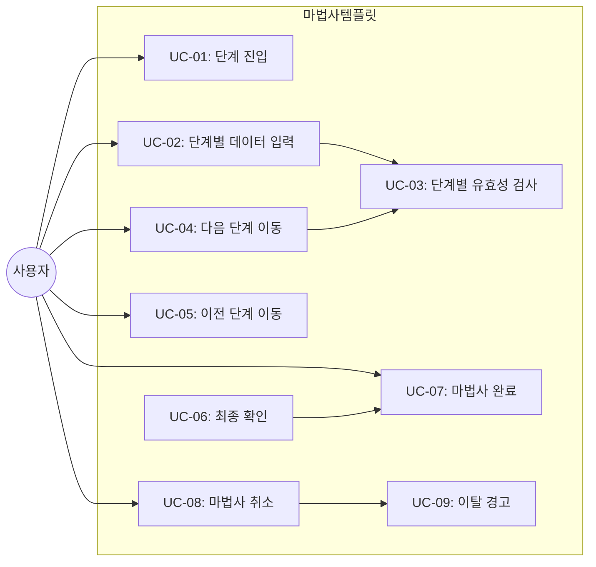
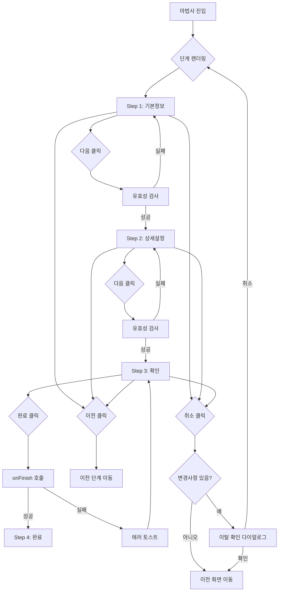

# TSK-06-06 - 마법사(Wizard) 화면 템플릿 설계 문서

## 문서 정보

| 항목 | 내용 |
|------|------|
| Task ID | TSK-06-06 |
| 문서 버전 | 2.0 |
| 작성일 | 2026-01-21 |
| 상태 | 작성중 |
| 카테고리 | development |

---

## 1. 개요

### 1.1 배경 및 문제 정의

**현재 상황:**
- MES Portal에서 복잡한 설정이나 등록 절차가 필요한 화면이 존재함
- 단일 폼 화면으로 구현 시 사용자가 한 번에 모든 정보를 입력해야 하는 부담 발생
- 입력 항목이 많은 경우 사용자 혼란 및 입력 오류 증가
- 단계별로 데이터를 수집하고 검증하는 표준화된 패턴이 필요함

**해결하려는 문제:**
- 복잡한 입력 과정을 단계별로 분리하여 사용자 부담 경감
- 마법사(Wizard) 화면의 표준 템플릿 부재로 인한 개발 생산성 저하
- 단계별 유효성 검사 및 네비게이션 로직의 중복 구현
- 진행 상황 표시 및 단계 간 데이터 공유 방식의 비일관성

### 1.2 목적 및 기대 효과

**목적:**
- 재사용 가능한 마법사(Wizard) 화면 템플릿 컴포넌트 제공 (WizardTemplate)
- Ant Design Steps 컴포넌트를 기반으로 한 단계별 진행 UI 표준화
- TSK-06-03 입력/수정 폼 템플릿과의 연동을 통한 단계별 폼 검증 통합
- 단계 간 데이터 공유 및 상태 관리 표준화

**기대 효과:**
- 사용자 관점: 복잡한 입력 과정을 단계별로 진행하여 부담 감소, 진행 상황 명확히 인지
- 개발자 관점: 새 마법사 화면 개발 시간 50% 단축, 코드 중복 제거
- 유지보수 관점: 템플릿 수정 시 모든 마법사 화면에 일괄 적용

### 1.3 범위

**포함:**
- WizardTemplate 컴포넌트 구현
- 단계 표시 (Steps 컴포넌트)
- 이전/다음/완료 네비게이션
- 단계별 유효성 검사
- 단계 간 데이터 공유 (Context 또는 상태 관리)
- 최종 확인 및 완료 처리
- 단계별 건너뛰기 불가 정책 (순차 진행 필수)
- 진행 중 이탈 경고

**제외:**
- 개별 단계의 폼 필드 정의 (사용처에서 구현)
- 비선형 마법사 (조건부 분기) - Phase 2에서 검토
- 드래프트 자동 저장 - Phase 2에서 검토

### 1.4 참조 문서

| 문서 | 경로 | 관련 섹션 |
|------|------|----------|
| PRD | `.orchay/projects/mes-portal/prd.md` | 4.1.1 화면 템플릿 - 마법사(Wizard) 화면, 고급 템플릿 |
| TRD | `.orchay/projects/mes-portal/trd.md` | 7. PRD 요구사항 - 기타 기능 (Ant Design Steps) |
| TSK-06-03 | `.orchay/projects/mes-portal/tasks/TSK-06-03/010-design.md` | 입력/수정 폼 템플릿 (Form 연동, 유효성 검사) |

---

## 2. 사용자 분석

### 2.1 대상 사용자

| 사용자 유형 | 특성 | 주요 니즈 |
|------------|------|----------|
| 시스템 관리자 | 초기 설정 담당, IT 역량 보유 | 복잡한 설정을 단계별로 명확하게 진행, 실수 방지 |
| 생산 담당자 | 신규 작업 지시 등록, 다량 입력 | 입력 과정 단계화, 이전 단계 수정 용이 |
| 품질 담당자 | 검사 기준 설정, 정확성 중요 | 단계별 확인 후 다음 진행, 최종 검토 기능 |
| 개발자 | 템플릿 사용자 | 간편한 Props API, 단계별 폼 커스터마이징 용이 |

### 2.2 사용자 페르소나

**페르소나 1: 시스템 관리자 박관리**
- 역할: MES 시스템 초기 설정 담당
- 목표: 시스템 초기 설정을 실수 없이 완료
- 불만: 한 화면에 모든 설정이 나열되면 무엇부터 해야 할지 혼란
- 시나리오: 기본정보 -> 연결설정 -> 사용자설정 -> 확인 순으로 시스템 설정 완료

**페르소나 2: 생산 담당자 이생산**
- 역할: 복잡한 작업 지시 등록
- 목표: 여러 공정을 포함하는 작업 지시를 단계별로 등록
- 불만: 한 번에 모든 정보를 입력하면 실수가 많음
- 시나리오: 기본정보 -> 공정설정 -> 자재할당 -> 확인 후 등록

**페르소나 3: 품질 담당자 김품질**
- 역할: 검사 기준 신규 등록
- 목표: 검사 항목별 기준을 순서대로 설정
- 불만: 중간에 이전 단계를 수정하기 어려움
- 시나리오: 검사유형 선택 -> 검사항목 설정 -> 기준값 입력 -> 최종 확인

---

## 3. 유즈케이스

### 3.1 유즈케이스 다이어그램



### 3.2 유즈케이스 상세

#### UC-01: 단계 진입

| 항목 | 내용 |
|------|------|
| 액터 | 일반 사용자 |
| 목적 | 마법사 화면 진입 및 첫 단계 시작 |
| 사전 조건 | 마법사 화면 접근 권한 보유 |
| 사후 조건 | 첫 번째 단계 화면 표시, Steps 컴포넌트에 현재 단계 표시 |
| 트리거 | 마법사 화면 URL 접근 또는 메뉴 클릭 |

**기본 흐름:**
1. 사용자가 마법사 화면에 진입한다
2. 시스템이 Steps 컴포넌트에 전체 단계를 표시한다
3. 첫 번째 단계가 활성화되고 해당 콘텐츠가 표시된다
4. 첫 번째 입력 필드에 포커스가 설정된다

#### UC-02: 단계별 데이터 입력

| 항목 | 내용 |
|------|------|
| 액터 | 일반 사용자 |
| 목적 | 현재 단계에 필요한 데이터 입력 |
| 사전 조건 | 해당 단계 화면 표시 중 |
| 사후 조건 | 입력 데이터가 마법사 상태에 저장됨 |
| 트리거 | 필드 입력 |

**기본 흐름:**
1. 사용자가 현재 단계의 폼 필드에 값을 입력한다
2. 시스템이 입력값을 마법사 상태에 실시간 저장한다
3. 필드별 실시간 유효성 검사가 수행된다 (설정에 따라)

**대안 흐름:**
- 2a. 선택 필드 (Select, DatePicker 등)인 경우:
  - 드롭다운 또는 캘린더에서 값을 선택한다

#### UC-03: 단계별 유효성 검사

| 항목 | 내용 |
|------|------|
| 액터 | 시스템 |
| 목적 | 현재 단계의 입력 데이터 유효성 확인 |
| 사전 조건 | 사용자가 다음 단계 버튼 클릭 |
| 사후 조건 | 유효성 검사 결과에 따라 다음 단계 이동 또는 에러 표시 |
| 트리거 | 다음 버튼 클릭 |

**기본 흐름:**
1. 사용자가 [다음] 버튼을 클릭한다
2. 시스템이 현재 단계의 모든 필드를 검증한다
3. 모든 필드가 유효하면 다음 단계로 이동한다
4. Steps 컴포넌트의 현재 단계 표시가 갱신된다

**예외 흐름:**
- 3a. 유효성 검사 실패 시:
  - 에러가 있는 필드에 에러 메시지 표시
  - 첫 번째 에러 필드로 스크롤 및 포커스
  - 다음 단계로 이동하지 않음

#### UC-04: 다음 단계 이동

| 항목 | 내용 |
|------|------|
| 액터 | 일반 사용자 |
| 목적 | 현재 단계를 완료하고 다음 단계로 진행 |
| 사전 조건 | 현재 단계 유효성 검사 통과 |
| 사후 조건 | 다음 단계 화면 표시, 이전 단계 데이터 유지 |
| 트리거 | 다음 버튼 클릭 (유효성 통과 시) |

**기본 흐름:**
1. UC-03 유효성 검사 통과 후
2. 시스템이 현재 단계를 '완료' 상태로 표시한다 (Steps 체크마크)
3. 다음 단계 콘텐츠가 표시된다
4. Steps 컴포넌트의 current가 증가한다

**대안 흐름:**
- 2a. 마지막 단계인 경우:
  - [다음] 버튼 대신 [완료] 버튼 표시
  - UC-07 마법사 완료로 진행

#### UC-05: 이전 단계 이동

| 항목 | 내용 |
|------|------|
| 액터 | 일반 사용자 |
| 목적 | 이전 단계로 돌아가서 데이터 수정 |
| 사전 조건 | 첫 번째 단계가 아님 |
| 사후 조건 | 이전 단계 화면 표시, 기존 입력 데이터 유지 |
| 트리거 | 이전 버튼 클릭 또는 Steps 클릭 (완료된 단계) |

**기본 흐름:**
1. 사용자가 [이전] 버튼을 클릭한다
2. 시스템이 현재 단계의 데이터를 저장한다 (유효성 검사 없이)
3. 이전 단계 콘텐츠가 표시된다
4. 이전에 입력한 데이터가 폼에 채워진다

**대안 흐름:**
- 1a. Steps 컴포넌트에서 완료된 단계 클릭 시:
  - 해당 단계로 바로 이동 (중간 단계 건너뛰기 가능)
- 1b. 첫 번째 단계에서는:
  - [이전] 버튼 비활성화 또는 미표시

#### UC-06: 최종 확인

| 항목 | 내용 |
|------|------|
| 액터 | 일반 사용자 |
| 목적 | 모든 입력 데이터를 최종 확인 |
| 사전 조건 | 마지막 단계 도달 (확인 단계) |
| 사후 조건 | 사용자가 전체 입력 내용을 검토함 |
| 트리거 | 확인 단계 진입 |

**기본 흐름:**
1. 사용자가 확인 단계에 진입한다
2. 시스템이 모든 단계에서 입력한 데이터를 요약하여 표시한다
3. 사용자가 각 항목을 검토한다
4. 수정이 필요하면 해당 단계로 이동한다 ([수정] 링크 또는 Steps 클릭)
5. 모든 내용이 확인되면 [완료] 버튼을 클릭한다

#### UC-07: 마법사 완료

| 항목 | 내용 |
|------|------|
| 액터 | 일반 사용자 |
| 목적 | 마법사 프로세스 완료 및 데이터 저장 |
| 사전 조건 | 모든 단계 완료, 최종 확인 완료 |
| 사후 조건 | 데이터 저장 완료, 완료 화면 표시 또는 목록 이동 |
| 트리거 | 완료 버튼 클릭 |

**기본 흐름:**
1. 사용자가 [완료] 버튼을 클릭한다
2. 시스템이 버튼을 로딩 상태로 표시한다
3. onFinish 콜백이 전체 데이터와 함께 호출된다
4. API 호출 성공 시:
   - 성공 메시지 표시
   - 완료 단계 표시 (Result 컴포넌트) 또는 목록 화면 이동

**예외 흐름:**
- 4a. API 호출 실패 시:
  - 에러 메시지 토스트 표시
  - 완료 버튼 다시 활성화
  - 재시도 가능

#### UC-08: 마법사 취소

| 항목 | 내용 |
|------|------|
| 액터 | 일반 사용자 |
| 목적 | 마법사 진행 중 취소 |
| 사전 조건 | 마법사 진행 중 |
| 사후 조건 | 이전 화면으로 이동 |
| 트리거 | 취소 버튼 클릭 |

**기본 흐름:**
1. 사용자가 [취소] 버튼을 클릭한다
2. UC-09 이탈 경고 실행
3. 사용자가 확인하면 이전 화면으로 이동한다

#### UC-09: 이탈 경고

| 항목 | 내용 |
|------|------|
| 액터 | 시스템 |
| 목적 | 입력 데이터 손실 방지 |
| 사전 조건 | 마법사에 입력 데이터 존재 |
| 사후 조건 | 사용자 선택에 따라 이탈 또는 유지 |
| 트리거 | 취소 버튼, 브라우저 뒤로가기, 탭 닫기 등 |

**기본 흐름:**
1. 사용자가 마법사를 이탈하려 한다
2. 시스템이 입력 데이터 존재 여부를 확인한다
3. 데이터가 있으면 확인 다이얼로그 표시: "진행 중인 내용이 저장되지 않습니다. 취소하시겠습니까?"
4. 사용자가 [확인]을 선택하면 데이터 버리고 이탈
5. 사용자가 [취소]를 선택하면 마법사 유지

---

## 4. 사용자 시나리오

### 4.1 시나리오 1: 설정 마법사 완료 (정상 흐름)

**상황 설명:**
시스템 관리자 박관리가 MES 시스템 초기 설정 마법사를 진행한다. 4단계(기본정보 -> 상세설정 -> 확인 -> 완료)로 구성.

**단계별 진행:**

| 단계 | 사용자 행동 | 시스템 반응 | 사용자 기대 |
|------|-----------|------------|------------|
| 1 | 설정 마법사 화면 진입 | Steps에 4단계 표시, 1단계 활성 | 전체 과정 파악 |
| 2 | 기본정보 입력 (회사명, 공장명) | 입력값 실시간 저장 | 즉각적인 피드백 |
| 3 | [다음] 클릭 | 유효성 검사 후 2단계 이동, 1단계 체크 표시 | 1단계 완료 인지 |
| 4 | 상세설정 입력 (연결정보, 옵션) | 입력값 저장 | 복잡한 설정 단계별 분리 |
| 5 | [다음] 클릭 | 유효성 검사 후 3단계(확인) 이동 | 2단계 완료 |
| 6 | 확인 단계에서 전체 입력 내용 검토 | 모든 입력값 요약 표시 | 최종 확인 |
| 7 | [완료] 클릭 | 로딩 표시 후 성공 메시지 | 설정 완료 |
| 8 | - | 완료 화면(Result) 또는 대시보드 이동 | 다음 작업 안내 |

**성공 조건:**
- 모든 단계의 유효성 검사 통과
- 설정 데이터 저장 완료
- 3초 이내 완료 응답

### 4.2 시나리오 2: 이전 단계 수정

**상황 설명:**
사용자가 3단계(확인)에서 1단계 입력 내용에 오류를 발견하고 수정하려 한다.

**단계별 진행:**

| 단계 | 사용자 행동 | 시스템 반응 | 사용자 기대 |
|------|-----------|------------|------------|
| 1 | 3단계(확인) 화면에서 오류 발견 | 요약 화면에 [수정] 링크 표시 | 쉬운 수정 접근 |
| 2 | 1단계 영역의 [수정] 클릭 | 1단계 화면으로 이동, 기존 데이터 유지 | 이전 입력값 보존 |
| 3 | 오류 항목 수정 | 입력값 갱신 | 빠른 수정 |
| 4 | [다음] 클릭 (2회) | 유효성 검사 후 단계 이동 | 검증 후 진행 |
| 5 | 3단계(확인)에서 수정 내용 확인 | 갱신된 내용 표시 | 수정 반영 확인 |

### 4.3 시나리오 3: 유효성 검사 실패

**상황 설명:**
사용자가 필수 필드를 비워두고 다음 단계로 이동하려 한다.

**단계별 진행:**

| 단계 | 사용자 행동 | 시스템 반응 | 복구 방법 |
|------|-----------|------------|----------|
| 1 | 필수 필드 비워둠 | - | - |
| 2 | [다음] 클릭 | 필수 필드에 에러 표시, 첫 에러 필드 포커스 | 필드 입력 |
| 3 | 필수 필드 입력 | 에러 메시지 사라짐 | - |
| 4 | [다음] 클릭 | 유효성 통과, 다음 단계 이동 | - |

### 4.4 시나리오 4: 마법사 취소 (이탈 경고)

**상황 설명:**
사용자가 2단계 진행 중 마법사를 취소하려 한다.

**단계별 진행:**

| 단계 | 사용자 행동 | 시스템 반응 | 복구 방법 |
|------|-----------|------------|----------|
| 1 | 1~2단계 데이터 입력 | 데이터 저장 상태 | - |
| 2 | [취소] 클릭 | 확인 다이얼로그: "진행 중인 내용이 저장되지 않습니다" | [취소]로 마법사 유지 |
| 3 | [확인] 클릭 | 이전 화면으로 이동, 입력 데이터 삭제 | - |

---

## 5. 화면 설계

### 5.1 화면 흐름도



### 5.2 화면별 상세

#### 화면 1: 마법사(Wizard) 화면 템플릿 (WizardTemplate)

**화면 목적:**
복잡한 입력 과정을 단계별로 분리하여 사용자가 순차적으로 진행하도록 안내하는 표준 레이아웃 제공.

**진입 경로:**
- 메뉴에서 마법사 화면 클릭
- 설정 화면에서 마법사 시작 버튼 클릭

**와이어프레임 (수평 Steps 레이아웃):**
```
+-------------------------------------------------------------------------+
|  +-----------------------------------------------------------------+    |
|  |  설정 마법사                                            [취소]  |    |
|  +-----------------------------------------------------------------+    |
|                                                                          |
|  +-----------------------------------------------------------------+    |
|  |                         Steps 영역                               |    |
|  |  +----------+    +----------+    +----------+    +----------+   |    |
|  |  |    1     |    |    2     |    |    3     |    |    4     |   |    |
|  |  |  기본    |--->|  상세    |--->|  확인    |--->|  완료    |   |    |
|  |  |  정보    |    |  설정    |    |          |    |          |   |    |
|  |  +----------+    +----------+    +----------+    +----------+   |    |
|  |      [v]                            [ ]             [ ]         |    |
|  |   완료됨           현재             대기           대기         |    |
|  +-----------------------------------------------------------------+    |
|                                                                          |
|  +-----------------------------------------------------------------+    |
|  |                     단계별 콘텐츠 영역                           |    |
|  |  +-----------------------------------------------------------+  |    |
|  |  |                                                           |  |    |
|  |  |  연결 정보                                                 |  |    |
|  |  |  +---------------------------------------------------+    |  |    |
|  |  |  | 서버 주소 *                                       |    |  |    |
|  |  |  | +-----------------------------------------------+ |    |  |    |
|  |  |  | | 192.168.1.100                                 | |    |  |    |
|  |  |  | +-----------------------------------------------+ |    |  |    |
|  |  |  +---------------------------------------------------+    |  |    |
|  |  |                                                           |  |    |
|  |  |  +-------------------------+  +-------------------------+ |  |    |
|  |  |  | 포트 번호 *             |  | 타임아웃(초)            | |  |    |
|  |  |  | +---------------------+ |  | +---------------------+ | |  |    |
|  |  |  | | 8080                | |  | | 30                  | | |  |    |
|  |  |  | +---------------------+ |  | +---------------------+ | |  |    |
|  |  |  +-------------------------+  +-------------------------+ |  |    |
|  |  |                                                           |  |    |
|  |  |  옵션 설정                                                 |  |    |
|  |  |  +---------------------------------------------------+    |  |    |
|  |  |  | [v] 자동 재연결 활성화                            |    |  |    |
|  |  |  | [ ] 디버그 모드 활성화                            |    |  |    |
|  |  |  +---------------------------------------------------+    |  |    |
|  |  |                                                           |  |    |
|  |  +-----------------------------------------------------------+  |    |
|  +-----------------------------------------------------------------+    |
|                                                                          |
|  +-----------------------------------------------------------------+    |
|  |  네비게이션 버튼 영역                                            |    |
|  |                               [이전]  [다음] 또는 [완료]         |    |
|  +-----------------------------------------------------------------+    |
+-------------------------------------------------------------------------+

범례:
[v] : 완료된 단계 체크 표시
--> : 단계 연결선
* : 필수 필드
```

**와이어프레임 (수직 Steps 레이아웃):**
```
+-------------------------------------------------------------------------+
|  +-----------------------------------------------------------------+    |
|  |  설정 마법사                                            [취소]  |    |
|  +-----------------------------------------------------------------+    |
|                                                                          |
|  +---------------+  +-----------------------------------------------+   |
|  | Steps 영역   |  |           단계별 콘텐츠 영역                   |   |
|  |              |  |  +-------------------------------------------+ |   |
|  | +----------+ |  |  |                                           | |   |
|  | |  1       | |  |  |  상세 설정                                | |   |
|  | | 기본정보 | |  |  |                                           | |   |
|  | |   [v]    | |  |  |  서버 주소 *                              | |   |
|  | +----------+ |  |  |  +-------------------------------------+  | |   |
|  |      |       |  |  |  | 192.168.1.100                       |  | |   |
|  | +----------+ |  |  |  +-------------------------------------+  | |   |
|  | |  2       | |  |  |                                           | |   |
|  | | 상세설정 | |  |  |  포트 번호 *                              | |   |
|  | |   -->    | |  |  |  +-------------------------------------+  | |   |
|  | +----------+ |  |  |  | 8080                                 |  | |   |
|  |      |       |  |  |  +-------------------------------------+  | |   |
|  | +----------+ |  |  |                                           | |   |
|  | |  3       | |  |  |  [v] 자동 재연결 활성화                   | |   |
|  | |   확인   | |  |  |                                           | |   |
|  | |   [ ]    | |  |  +-------------------------------------------+ |   |
|  | +----------+ |  |                                                 |   |
|  |      |       |  |  +-------------------------------------------+ |   |
|  | +----------+ |  |  |                   [이전]  [다음]           | |   |
|  | |  4       | |  |  +-------------------------------------------+ |   |
|  | |   완료   | |  +-----------------------------------------------+   |
|  | |   [ ]    | |                                                       |
|  | +----------+ |                                                       |
|  +---------------+                                                      |
+-------------------------------------------------------------------------+

범례:
[v] : 완료된 단계
--> : 현재 단계 (진행 중)
[ ] : 대기 중인 단계
```

**와이어프레임 (확인 단계):**
```
+-------------------------------------------------------------------------+
|  +-----------------------------------------------------------------+    |
|  |  설정 마법사                                            [취소]  |    |
|  +-----------------------------------------------------------------+    |
|                                                                          |
|  +-----------------------------------------------------------------+    |
|  |  +-------+    +-------+    +-------+    +-------+               |    |
|  |  | 1 [v] |--->| 2 [v] |--->| 3 --> |--->| 4 [ ] |               |    |
|  |  +-------+    +-------+    +-------+    +-------+               |    |
|  +-----------------------------------------------------------------+    |
|                                                                          |
|  +-----------------------------------------------------------------+    |
|  |                       최종 확인                                   |    |
|  |  +-----------------------------------------------------------+  |    |
|  |  | 기본 정보                                        [수정]   |  |    |
|  |  | +---------------------------------------------------------+  |    |
|  |  | | 회사명         : ABC 제조                               |  |    |
|  |  | | 공장명         : 1공장                                  |  |    |
|  |  | | 관리자 이메일  : admin@example.com                      |  |    |
|  |  | +---------------------------------------------------------+  |    |
|  |  +-----------------------------------------------------------+  |    |
|  |                                                                 |    |
|  |  +-----------------------------------------------------------+  |    |
|  |  | 상세 설정                                        [수정]   |  |    |
|  |  | +---------------------------------------------------------+  |    |
|  |  | | 서버 주소      : 192.168.1.100                          |  |    |
|  |  | | 포트 번호      : 8080                                   |  |    |
|  |  | | 타임아웃       : 30초                                   |  |    |
|  |  | | 자동 재연결    : 활성화                                 |  |    |
|  |  | | 디버그 모드    : 비활성화                               |  |    |
|  |  | +---------------------------------------------------------+  |    |
|  |  +-----------------------------------------------------------+  |    |
|  +-----------------------------------------------------------------+    |
|                                                                          |
|  +-----------------------------------------------------------------+    |
|  |                                          [이전]  [완료]         |    |
|  +-----------------------------------------------------------------+    |
+-------------------------------------------------------------------------+
```

**와이어프레임 (완료 단계):**
```
+-------------------------------------------------------------------------+
|  +-----------------------------------------------------------------+    |
|  |  설정 마법사                                                     |    |
|  +-----------------------------------------------------------------+    |
|                                                                          |
|  +-----------------------------------------------------------------+    |
|  |  +-------+    +-------+    +-------+    +-------+               |    |
|  |  | 1 [v] |--->| 2 [v] |--->| 3 [v] |--->| 4 [v] |               |    |
|  |  +-------+    +-------+    +-------+    +-------+               |    |
|  +-----------------------------------------------------------------+    |
|                                                                          |
|  +-----------------------------------------------------------------+    |
|  |                                                                 |    |
|  |                         +--------+                              |    |
|  |                         |   [v]  |                              |    |
|  |                         +--------+                              |    |
|  |                                                                 |    |
|  |                   설정이 완료되었습니다!                         |    |
|  |                                                                 |    |
|  |         시스템 설정이 성공적으로 저장되었습니다.                  |    |
|  |           이제 대시보드로 이동하여 사용할 수 있습니다.            |    |
|  |                                                                 |    |
|  |                     [대시보드로 이동]                            |    |
|  |                                                                 |    |
|  +-----------------------------------------------------------------+    |
+-------------------------------------------------------------------------+
```

**화면 요소 설명:**

| 영역 | 설명 | Ant Design 컴포넌트 | 사용자 인터랙션 |
|------|------|-------------------|----------------|
| 헤더 | 마법사 제목 | Card title | - |
| 취소 버튼 | 마법사 취소 | Button | 클릭 시 이탈 확인 |
| Steps 영역 | 단계 표시 | Steps | 완료된 단계 클릭 시 해당 단계 이동 |
| 단계 콘텐츠 | 현재 단계 폼/내용 | Card + Form | 데이터 입력 |
| 이전 버튼 | 이전 단계 이동 | Button | 클릭 시 이전 단계 |
| 다음 버튼 | 다음 단계 이동 | Button type="primary" | 클릭 시 유효성 검사 후 이동 |
| 완료 버튼 | 마법사 완료 | Button type="primary" | 클릭 시 onFinish 호출 |
| 확인 요약 | 입력 데이터 요약 | Descriptions | 읽기 전용 |
| 수정 링크 | 해당 단계로 이동 | Button type="link" | 클릭 시 해당 단계 이동 |
| 완료 결과 | 완료 메시지 | Result | - |

### 5.3 반응형 동작

| 화면 크기 | 레이아웃 변화 | 사용자 경험 |
|----------|--------------|------------|
| 데스크톱 (1024px+) | 수평 Steps, 콘텐츠 중앙 정렬 | 전체 단계 한눈에 파악 |
| 태블릿 (768-1023px) | 수평 Steps, 좁은 콘텐츠 | 스크롤 최소화 |
| 모바일 (767px-) | 수직 Steps 또는 미니 Steps, 버튼 풀 너비 | 터치 친화적, 단계 축약 표시 |

---

## 6. 인터랙션 설계

### 6.1 사용자 액션과 피드백

| 사용자 액션 | 즉각 피드백 | 결과 피드백 | 에러 피드백 |
|------------|-----------|------------|------------|
| 필드 입력 | 입력값 표시 | - | 실시간 유효성 (설정 시) |
| 다음 버튼 클릭 | 버튼 로딩 (유효성 검사 중) | 다음 단계 이동, Steps 갱신 | 필드별 에러 메시지 |
| 이전 버튼 클릭 | - | 이전 단계 이동, 기존 데이터 유지 | - |
| 완료 버튼 클릭 | 버튼 로딩 상태 | 성공 메시지 + 완료 화면 | 에러 토스트 |
| 취소 버튼 클릭 | 확인 다이얼로그 (데이터 있을 때) | 이전 화면 이동 | - |
| Steps 클릭 (완료된 단계) | - | 해당 단계 이동 | - |
| Steps 클릭 (미완료 단계) | - | - | 토스트: "이전 단계를 먼저 완료해주세요" |

### 6.2 상태별 화면 변화

| 상태 | 화면 표시 | 사용자 안내 |
|------|----------|------------|
| 초기 로딩 | 전체 Skeleton | "로딩 중..." |
| 단계 진행 중 | Steps current 표시, 콘텐츠 영역 활성화 | - |
| 단계 완료 | Steps status="finish", 체크 아이콘 | 완료된 단계 표시 |
| 유효성 검사 중 | 다음 버튼 로딩 | - |
| 유효성 실패 | 에러 필드 강조, 에러 메시지 | 첫 에러 필드 포커스 |
| 완료 처리 중 | 완료 버튼 로딩 | "저장 중..." |
| 완료 성공 | Result status="success" | "완료되었습니다" |
| 완료 실패 | 에러 토스트 | "저장에 실패했습니다" |

### 6.3 Steps 상호작용

| 상호작용 | 동작 | 제약 |
|---------|------|------|
| 완료된 단계 클릭 | 해당 단계로 이동 | 데이터 유지 |
| 현재 단계 클릭 | 무시 | - |
| 미완료 단계 클릭 | 무시 또는 에러 토스트 | 순차 진행 필수 (건너뛰기 불가) |
| 완료 단계 클릭 | 무시 (읽기 전용) | 이미 완료됨 |

### 6.4 키보드/접근성

| 기능 | 키보드 단축키 | 스크린 리더 안내 |
|------|-------------|-----------------|
| 다음 단계 | Enter (폼 내), Alt+N | "다음 단계로 이동" |
| 이전 단계 | Alt+P | "이전 단계로 이동" |
| 취소 | Escape | "마법사 취소" |
| 필드 이동 | Tab | "{필드명}으로 이동" |
| Steps 탐색 | 화살표 키 (포커스 시) | "단계 {n}: {단계명}, {상태}" |

---

## 7. 데이터 요구사항

### 7.1 필요한 데이터

| 데이터 | 설명 | 출처 | 용도 |
|--------|------|------|------|
| steps | 단계 정의 배열 | Props | Steps 렌더링 |
| currentStep | 현재 단계 인덱스 | 내부 상태 | 현재 단계 표시 |
| stepData | 단계별 입력 데이터 | 내부 상태/Context | 단계 간 데이터 공유 |
| loading | 저장 로딩 상태 | Props/내부 상태 | 버튼 비활성화 |

### 7.2 Props 인터페이스

**Form 인스턴스 관리 정책:**
- **단계별 Form 분리**: 각 단계마다 별도의 Ant Design Form 인스턴스 사용
- **데이터 통합 관리**: WizardContext를 통해 모든 단계 데이터 중앙 관리
- **외부 주입 가능**: `form` prop으로 외부 Form 인스턴스 사용 가능

```typescript
import { FormInstance, FormProps } from 'antd';
import { ReactNode } from 'react';

/**
 * 마법사 단계 정의
 */
interface WizardStep {
  /** 단계 키 (고유 식별자) */
  key: string;
  /** 단계 제목 */
  title: string;
  /** 단계 부제목 (선택) */
  subTitle?: string;
  /** 단계 설명 */
  description?: string;
  /** 단계 아이콘 */
  icon?: ReactNode;
  /** 단계 콘텐츠 렌더링 */
  content: ReactNode | ((context: WizardContextValue) => ReactNode);
  /** 단계별 유효성 검사 함수 (다음 이동 전 실행) */
  validate?: () => Promise<boolean> | boolean;
  /** 이 단계 건너뛰기 가능 여부 (기본: false) */
  skippable?: boolean;
  /** 단계 비활성화 여부 */
  disabled?: boolean;
}

/**
 * 마법사 Context 값 (단계 간 데이터 공유용)
 */
interface WizardContextValue<T extends Record<string, unknown> = Record<string, unknown>> {
  /** 전체 단계 데이터 */
  data: T;
  /** 데이터 업데이트 */
  setData: (data: Partial<T>) => void;
  /** 특정 단계 데이터 가져오기 */
  getStepData: (stepKey: string) => unknown;
  /** 특정 단계 데이터 설정 */
  setStepData: (stepKey: string, data: unknown) => void;
  /** 현재 단계 인덱스 */
  currentStep: number;
  /** 전체 단계 수 */
  totalSteps: number;
  /** 다음 단계 이동 */
  goNext: () => Promise<void>;
  /** 이전 단계 이동 */
  goPrev: () => void;
  /** 특정 단계로 이동 (완료된 단계만 가능) */
  goTo: (step: number) => void;
  /** 마법사 취소 */
  cancel: () => void;
}

/**
 * 마법사 템플릿 Props
 */
interface WizardTemplateProps<T extends Record<string, unknown> = Record<string, unknown>> {
  // ===== 단계 정의 =====
  /** 마법사 단계 배열 */
  steps: WizardStep[];
  /** 초기 단계 (기본: 0) */
  initialStep?: number;
  /** 초기 데이터 */
  initialData?: Partial<T>;

  // ===== Steps 컴포넌트 설정 =====
  /** Steps 방향 (기본: 'horizontal') */
  direction?: 'horizontal' | 'vertical';
  /** Steps 크기 */
  size?: 'default' | 'small';
  /** Steps 타입 */
  type?: 'default' | 'navigation' | 'inline';
  /** 진행률 표시 (dot 스타일) */
  progressDot?: boolean;
  /** 완료된 단계 클릭 허용 여부 (기본: true) */
  allowStepClick?: boolean;

  // ===== 액션 =====
  /** 마법사 완료 핸들러 */
  onFinish: (data: T) => Promise<void>;
  /** 마법사 취소 핸들러 */
  onCancel?: () => void;
  /** 단계 변경 핸들러 */
  onStepChange?: (current: number, prev: number) => void;
  /** 데이터 변경 핸들러 */
  onDataChange?: (data: T) => void;

  // ===== 상태 =====
  /** 저장 로딩 상태 */
  loading?: boolean;

  // ===== 네비게이션 버튼 =====
  /** 이전 버튼 텍스트 (기본: '이전') */
  prevButtonText?: string;
  /** 다음 버튼 텍스트 (기본: '다음') */
  nextButtonText?: string;
  /** 완료 버튼 텍스트 (기본: '완료') */
  finishButtonText?: string;
  /** 취소 버튼 텍스트 (기본: '취소') */
  cancelButtonText?: string;
  /** 취소 버튼 표시 여부 (기본: true) */
  showCancel?: boolean;
  /** 이전 버튼 표시 여부 (기본: true) */
  showPrev?: boolean;
  /** 추가 버튼 (다음/완료 버튼 앞에 표시) */
  extraButtons?: ReactNode;

  // ===== 이탈 경고 =====
  /** 이탈 경고 활성화 (기본: true) */
  enableLeaveConfirm?: boolean;
  /** 이탈 경고 메시지 */
  leaveConfirmMessage?: string;

  // ===== 헤더 =====
  /** 마법사 제목 */
  title?: string;
  /** 추가 헤더 요소 */
  extra?: ReactNode;

  // ===== 확인 단계 (마지막 전 단계) =====
  /** 확인 단계 자동 생성 여부 (기본: false) */
  autoConfirmStep?: boolean;
  /** 확인 단계 제목 (기본: '확인') */
  confirmStepTitle?: string;
  /** 확인 단계 데이터 렌더링 */
  renderConfirmation?: (data: T) => ReactNode;

  // ===== 완료 단계 =====
  /** 완료 단계 자동 생성 여부 (기본: false) */
  autoFinishStep?: boolean;
  /** 완료 단계 제목 (기본: '완료') */
  finishStepTitle?: string;
  /** 완료 메시지 */
  finishMessage?: string;
  /** 완료 후 버튼 */
  finishActions?: ReactNode;

  // ===== 스타일 =====
  /** 컨테이너 클래스명 */
  className?: string;
  /** Steps 영역 클래스명 */
  stepsClassName?: string;
  /** 콘텐츠 영역 클래스명 */
  contentClassName?: string;
}
```

### 7.3 단계별 폼 연동

```typescript
// 단계별 폼 컴포넌트 예시
import { Form, Input, Select } from 'antd';
import { useWizardContext } from './WizardContext';

function BasicInfoStep() {
  const [form] = Form.useForm();
  const { setStepData, getStepData } = useWizardContext();

  // 초기 데이터 로드
  useEffect(() => {
    const savedData = getStepData('basicInfo');
    if (savedData) {
      form.setFieldsValue(savedData);
    }
  }, []);

  // 폼 값 변경 시 Context에 저장
  const handleValuesChange = (_, allValues) => {
    setStepData('basicInfo', allValues);
  };

  return (
    <Form
      form={form}
      layout="vertical"
      onValuesChange={handleValuesChange}
    >
      <Form.Item
        name="companyName"
        label="회사명"
        rules={[{ required: true, message: '회사명을 입력해주세요' }]}
      >
        <Input placeholder="회사명 입력" />
      </Form.Item>

      <Form.Item
        name="factoryName"
        label="공장명"
        rules={[{ required: true, message: '공장명을 입력해주세요' }]}
      >
        <Input placeholder="공장명 입력" />
      </Form.Item>
    </Form>
  );
}

// 단계 정의에서 validate 함수로 폼 검증
const steps: WizardStep[] = [
  {
    key: 'basicInfo',
    title: '기본 정보',
    content: <BasicInfoStep />,
    validate: async () => {
      // 해당 단계의 Form 인스턴스에서 validateFields 호출
      try {
        await basicInfoForm.validateFields();
        return true;
      } catch {
        return false;
      }
    },
  },
  // ... 다른 단계들
];
```

### 7.4 데이터 유효성 규칙

| 데이터 필드 | 규칙 | 위반 시 메시지 |
|------------|------|---------------|
| steps | 필수, 1개 이상 | "최소 1개 이상의 단계가 필요합니다" |
| step.key | 필수, 고유 | "단계 키는 고유해야 합니다" |
| step.title | 필수 | "단계 제목이 필요합니다" |
| step.content | 필수 | "단계 콘텐츠가 필요합니다" |
| onFinish | 필수 | "완료 핸들러가 필요합니다" |

---

## 8. 비즈니스 규칙

### 8.1 핵심 규칙

| 규칙 ID | 규칙 설명 | 적용 상황 | 예외 |
|---------|----------|----------|------|
| BR-01 | 단계별 순차 진행 필수 | 다음 단계 이동 | skippable: true인 단계 |
| BR-02 | 다음 이동 전 유효성 검사 필수 | 다음 버튼 클릭 | 없음 |
| BR-03 | 이전 단계 이동은 항상 허용 | 이전 버튼 클릭 | 첫 번째 단계 (버튼 미표시) |
| BR-04 | 완료된 단계만 Steps 클릭 가능 | Steps 클릭 | allowStepClick: false |
| BR-05 | 데이터 있을 때 이탈 확인 필수 | 취소, 탭 닫기, 뒤로가기 | enableLeaveConfirm: false |
| BR-06 | 완료 버튼은 마지막 단계에서만 표시 | 버튼 렌더링 | 없음 |
| BR-07 | 완료 처리 중 중복 클릭 방지 | 완료 버튼 클릭 | 없음 |
| BR-08 | 단계 간 데이터는 유지 | 이전/다음 이동 | 마법사 취소 시 삭제 |

### 8.2 규칙 상세 설명

**BR-01: 단계별 순차 진행 필수**

설명: 사용자는 반드시 이전 단계를 완료해야 다음 단계로 진행할 수 있다. 이는 데이터 무결성을 보장하고 사용자 실수를 방지한다.

예시:
- 1단계 미완료 시 2단계 직접 접근 불가
- Steps에서 미완료 단계 클릭 시 무시 또는 안내 메시지

**BR-02: 다음 이동 전 유효성 검사 필수**

설명: 다음 단계로 이동하기 전 현재 단계의 모든 필수 필드와 유효성 규칙을 검사한다.

예시:
- 다음 버튼 클릭 시 validate() 함수 실행
- 유효성 실패 시 에러 표시 및 이동 차단

**BR-04: 완료된 단계만 Steps 클릭 가능**

설명: 사용자가 수정을 위해 이전 단계로 돌아갈 때는 완료된 단계만 클릭하여 이동할 수 있다.

예시:
- 3단계에서 1단계로 직접 이동 가능 (1단계가 완료 상태)
- 2단계에서 3단계 클릭 시 무시 (3단계 미완료)

**BR-05: 데이터 있을 때 이탈 확인 필수**

설명: 마법사 진행 중 데이터 손실을 방지하기 위해 이탈 시 확인 다이얼로그를 표시한다.

예시:
- 취소 버튼: "진행 중인 내용이 저장되지 않습니다. 취소하시겠습니까?"
- 브라우저 뒤로가기: 동일한 확인
- MDI 탭 닫기: 동일한 확인

---

## 9. 에러 처리

### 9.1 예상 에러 상황

| 상황 | 원인 | 사용자 메시지 | 복구 방법 |
|------|------|--------------|----------|
| 유효성 검사 실패 | 필수 값 누락, 형식 오류 | 필드별 에러 메시지 | 해당 필드 수정 |
| 완료 API 실패 | 네트워크 오류, 서버 오류 | "저장에 실패했습니다. 다시 시도해주세요." | 재시도 버튼 |
| 세션 만료 | 인증 토큰 만료 | "세션이 만료되었습니다. 다시 로그인해주세요." | 로그인 페이지 이동 |
| 권한 없음 | 접근 권한 부족 | "이 작업에 대한 권한이 없습니다." | 관리자 문의 안내 |
| 데이터 충돌 | 동시 수정 | "다른 사용자가 이미 수정했습니다." | 새로고침 후 재시도 |

### 9.2 에러 표시 방식

| 에러 유형 | 표시 위치 | 표시 방법 | Ant Design 컴포넌트 |
|----------|----------|----------|-------------------|
| 필드 유효성 | 해당 필드 하단 | 빨간색 텍스트 + 테두리 | Form.Item validateStatus |
| 단계 유효성 | 콘텐츠 영역 상단 | Alert 박스 | Alert type="error" |
| API 에러 | 화면 상단 | 토스트 알림 | message.error() |
| 네트워크 에러 | 화면 상단 | 토스트 알림 + 재시도 | message.error() + 버튼 |

### 9.3 에러 복구 UX

```
유효성 검사 실패 시:
1. 에러가 있는 필드에 에러 메시지 표시
2. 첫 번째 에러 필드로 스크롤
3. 해당 필드에 포커스
4. 사용자가 수정하면 에러 메시지 즉시 갱신
5. 모든 에러 해결 후 다음 버튼 활성화

완료 API 실패 시:
1. 에러 토스트 표시 (5초 후 자동 닫힘)
2. 완료 버튼 다시 활성화
3. 입력 데이터 유지
4. 재시도 가능
```

---

## 10. 연관 문서

| 문서 | 경로 | 용도 |
|------|------|------|
| 요구사항 추적 매트릭스 | `025-traceability-matrix.md` | PRD -> 설계 -> 테스트 양방향 추적 |
| 테스트 명세서 | `026-test-specification.md` | 단위/E2E/매뉴얼 테스트 상세 정의 |

---

## 10.1 보안 원칙

### 10.1.1 유효성 검사 보안

| 원칙 | 설명 | 적용 |
|------|------|------|
| **서버 사이드 검사 필수** | 클라이언트 검사는 UX 개선용이며, 서버에서 동일한 규칙으로 재검증 필수 | onFinish에서 서버로 전송 전 최종 검증 |
| **클라이언트 검사 한계** | 브라우저 개발자 도구/Proxy로 우회 가능함을 인지 | 서버 검증 의존 |

> 주의: 클라이언트 사이드 유효성 검사만으로 데이터 무결성을 보장할 수 없습니다. 모든 입력 데이터는 서버에서 반드시 재검증해야 합니다.

### 10.1.2 XSS 방어 전략

| 방어 계층 | 방법 | 비고 |
|----------|------|------|
| React 기본 방어 | JSX 내 자동 이스케이프 | 기본 활성화 |
| **금지 사항** | `dangerouslySetInnerHTML` 사용 금지 | 코드 리뷰 체크 |
| CSP 헤더 | Content Security Policy 적용 권장 | 인프라 레벨 |

### 10.1.3 민감 데이터 처리

| 데이터 유형 | 처리 방법 | 비고 |
|------------|----------|------|
| 비밀번호 | 마스킹 표시, 자동완성 비활성화 | Input.Password 사용 |
| API 키/토큰 | 마스킹 표시, 저장 시 암호화 | 서버 사이드 암호화 |
| 개인정보 | 최소 수집 원칙, HTTPS 전송 | - |

---

## 11. 구현 범위

### 11.1 파일 구조

```
components/
├── templates/
│   ├── WizardTemplate/
│   │   ├── index.tsx              # 메인 컴포넌트
│   │   ├── WizardTemplate.tsx     # WizardTemplate 구현
│   │   ├── WizardContext.tsx      # 마법사 Context Provider
│   │   ├── WizardSteps.tsx        # Steps 컴포넌트 래퍼
│   │   ├── WizardContent.tsx      # 콘텐츠 영역
│   │   ├── WizardNavigation.tsx   # 네비게이션 버튼
│   │   ├── WizardConfirmation.tsx # 확인 단계 컴포넌트
│   │   ├── WizardResult.tsx       # 완료 단계 컴포넌트
│   │   └── types.ts               # 타입 정의
lib/
├── hooks/
│   └── useWizard.ts               # 마법사 상태 관리 훅
```

### 11.2 영향받는 영역

| 영역 | 변경 내용 | 영향도 |
|------|----------|--------|
| components/templates/WizardTemplate/ | 신규 생성 | 높음 |
| lib/hooks/useWizard.ts | 신규 생성 | 높음 |
| 샘플 화면 (설정 마법사) | 템플릿 사용 | 중간 |

### 11.3 의존성

| 의존 항목 | 이유 | 상태 |
|----------|------|------|
| TSK-06-03 (입력/수정 폼 템플릿) | 단계별 폼 구성, 유효성 검사 패턴 | 완료 |
| Ant Design Steps | 단계 표시 컴포넌트 | TRD 확인됨 |
| Ant Design Form | 단계별 폼 연동 | TRD 확인됨 |
| Ant Design Card | 레이아웃 컨테이너 | TRD 확인됨 |
| Ant Design Button | 네비게이션 버튼 | TRD 확인됨 |
| Ant Design Result | 완료 화면 | TRD 확인됨 |
| Ant Design Descriptions | 확인 단계 데이터 표시 | TRD 확인됨 |
| Ant Design Modal | 이탈 확인 다이얼로그 | TRD 확인됨 |

### 11.4 사용할 Ant Design 컴포넌트

| 컴포넌트 | 용도 |
|----------|------|
| Steps | 단계 표시 (horizontal/vertical) |
| Steps.Step | 개별 단계 아이템 |
| Card | 콘텐츠 영역 컨테이너 |
| Form | 단계별 폼 |
| Button | 이전/다음/완료/취소 버튼 |
| Space | 버튼 그룹 간격 |
| Result | 완료 화면 |
| Descriptions | 확인 단계 데이터 요약 |
| Modal.confirm | 이탈 확인 다이얼로그 |
| message | 토스트 알림 |

### 11.5 제약 사항

| 제약 | 설명 | 대응 방안 |
|------|------|----------|
| 단계별 폼 커스텀 | 각 단계마다 다른 폼 구조 | content에서 자유롭게 구현, WizardContext로 데이터 공유 |
| 조건부 단계 분기 | 입력에 따른 단계 분기 | Phase 2에서 검토 (현재는 선형 진행만 지원) |
| 드래프트 저장 | 중간 저장 기능 | Phase 2에서 검토 |
| TSK-06-03 의존 | 폼 템플릿 패턴 활용 | 의존성 관리 |

### 11.6 Server/Client Component 구분 (ARC-002)

| 컴포넌트 | 타입 | 사유 |
|----------|------|------|
| WizardTemplate | Client Component | Ant Design 컴포넌트 사용, 상태 관리 |
| WizardContext | Client Component | React Context, 상태 관리 |
| WizardSteps | Client Component | Steps 상호작용 |
| WizardNavigation | Client Component | 버튼 이벤트 |
| 부모 페이지 | Server Component (권장) | 초기 데이터 페칭 |

### 11.7 주요 data-testid 정의 (QA-004)

| data-testid | 요소 | 용도 |
|-------------|------|------|
| `wizard-template-container` | 템플릿 최상위 컨테이너 | 페이지 로드 확인 |
| `wizard-steps` | Steps 컴포넌트 | 단계 표시 확인 |
| `wizard-step-{n}` | 개별 Step 아이템 | 특정 단계 확인 |
| `wizard-content` | 콘텐츠 영역 | 콘텐츠 표시 확인 |
| `wizard-prev-btn` | 이전 버튼 | 이전 단계 이동 |
| `wizard-next-btn` | 다음 버튼 | 다음 단계 이동 |
| `wizard-finish-btn` | 완료 버튼 | 마법사 완료 |
| `wizard-cancel-btn` | 취소 버튼 | 마법사 취소 |
| `wizard-confirmation` | 확인 단계 영역 | 확인 데이터 표시 |
| `wizard-result` | 완료 단계 영역 | 완료 메시지 표시 |
| `leave-confirm-dialog` | 이탈 확인 다이얼로그 | 이탈 경고 확인 |

---

## 12. 체크리스트

### 12.1 설계 완료 확인

- [x] 문제 정의 및 목적 명확화
- [x] 사용자 분석 완료
- [x] 유즈케이스 정의 완료
- [x] 사용자 시나리오 작성 완료
- [x] 화면 설계 완료 (와이어프레임)
- [x] 인터랙션 설계 완료
- [x] 데이터 요구사항 정의 완료
- [x] 비즈니스 규칙 정의 완료
- [x] 에러 처리 정의 완료

### 12.2 연관 문서 작성

- [ ] 요구사항 추적 매트릭스 작성 (-> `025-traceability-matrix.md`)
- [ ] 테스트 명세서 작성 (-> `026-test-specification.md`)

### 12.3 구현 준비

- [x] 구현 우선순위 결정
- [x] 의존성 확인 완료 (TSK-06-03)
- [x] 제약 사항 검토 완료

---

## 13. 컴포넌트 구조 설계

### 13.1 컴포넌트 계층 구조

```
WizardTemplate/
├── WizardTemplate.tsx           # 메인 컴포넌트 (Context Provider 포함)
├── WizardContext.tsx            # Context 정의 및 Provider
├── WizardSteps.tsx              # Steps 컴포넌트 래퍼
├── WizardContent.tsx            # 단계별 콘텐츠 렌더링
├── WizardNavigation.tsx         # 이전/다음/완료/취소 버튼
├── WizardConfirmation.tsx       # 자동 생성 확인 단계
├── WizardResult.tsx             # 자동 생성 완료 단계
├── types.ts                     # 타입 정의
└── index.ts                     # 익스포트
```

### 13.2 Context 구조

```typescript
// WizardContext.tsx
import { createContext, useContext, useState, ReactNode } from 'react';

const WizardContext = createContext<WizardContextValue | null>(null);

export function WizardProvider<T extends Record<string, unknown>>({
  children,
  steps,
  initialData,
  onFinish,
  onCancel,
  ...props
}: WizardProviderProps<T>) {
  const [currentStep, setCurrentStep] = useState(props.initialStep || 0);
  const [data, setData] = useState<T>(initialData as T || {} as T);
  const [completedSteps, setCompletedSteps] = useState<Set<number>>(new Set());

  const goNext = async () => {
    const step = steps[currentStep];
    if (step.validate) {
      const isValid = await step.validate();
      if (!isValid) return;
    }
    setCompletedSteps(prev => new Set([...prev, currentStep]));
    setCurrentStep(prev => Math.min(prev + 1, steps.length - 1));
  };

  const goPrev = () => {
    setCurrentStep(prev => Math.max(prev - 1, 0));
  };

  const goTo = (step: number) => {
    if (completedSteps.has(step) || step < currentStep) {
      setCurrentStep(step);
    }
  };

  const value: WizardContextValue<T> = {
    data,
    setData: (newData) => setData(prev => ({ ...prev, ...newData })),
    getStepData: (key) => data[key],
    setStepData: (key, value) => setData(prev => ({ ...prev, [key]: value })),
    currentStep,
    totalSteps: steps.length,
    goNext,
    goPrev,
    goTo,
    cancel: onCancel || (() => {}),
  };

  return (
    <WizardContext.Provider value={value}>
      {children}
    </WizardContext.Provider>
  );
}

export function useWizardContext<T extends Record<string, unknown>>() {
  const context = useContext(WizardContext);
  if (!context) {
    throw new Error('useWizardContext must be used within WizardProvider');
  }
  return context as WizardContextValue<T>;
}
```

### 13.3 사용 예시

```tsx
import { WizardTemplate, WizardStep } from '@/components/templates';
import { Form, Input, Select, Checkbox, Descriptions } from 'antd';

function SettingsWizard() {
  const [basicForm] = Form.useForm();
  const [detailForm] = Form.useForm();

  const steps: WizardStep[] = [
    {
      key: 'basicInfo',
      title: '기본 정보',
      description: '회사 및 공장 정보를 입력합니다',
      content: (
        <Form form={basicForm} layout="vertical">
          <Form.Item
            name="companyName"
            label="회사명"
            rules={[{ required: true, message: '회사명을 입력해주세요' }]}
          >
            <Input placeholder="회사명 입력" />
          </Form.Item>
          <Form.Item
            name="factoryName"
            label="공장명"
            rules={[{ required: true, message: '공장명을 입력해주세요' }]}
          >
            <Input placeholder="공장명 입력" />
          </Form.Item>
        </Form>
      ),
      validate: async () => {
        try {
          await basicForm.validateFields();
          return true;
        } catch {
          return false;
        }
      },
    },
    {
      key: 'detailSettings',
      title: '상세 설정',
      description: '연결 및 옵션을 설정합니다',
      content: (
        <Form form={detailForm} layout="vertical">
          <Form.Item
            name="serverAddress"
            label="서버 주소"
            rules={[{ required: true, message: '서버 주소를 입력해주세요' }]}
          >
            <Input placeholder="192.168.1.100" />
          </Form.Item>
          <Form.Item
            name="port"
            label="포트 번호"
            rules={[{ required: true, message: '포트 번호를 입력해주세요' }]}
          >
            <Input type="number" placeholder="8080" />
          </Form.Item>
          <Form.Item name="autoReconnect" valuePropName="checked">
            <Checkbox>자동 재연결 활성화</Checkbox>
          </Form.Item>
        </Form>
      ),
      validate: async () => {
        try {
          await detailForm.validateFields();
          return true;
        } catch {
          return false;
        }
      },
    },
  ];

  const handleFinish = async (data) => {
    // API 호출
    await api.saveSettings(data);
  };

  const renderConfirmation = (data) => (
    <>
      <Descriptions title="기본 정보" column={1} bordered>
        <Descriptions.Item label="회사명">{data.basicInfo?.companyName}</Descriptions.Item>
        <Descriptions.Item label="공장명">{data.basicInfo?.factoryName}</Descriptions.Item>
      </Descriptions>
      <Descriptions title="상세 설정" column={1} bordered style={{ marginTop: 16 }}>
        <Descriptions.Item label="서버 주소">{data.detailSettings?.serverAddress}</Descriptions.Item>
        <Descriptions.Item label="포트 번호">{data.detailSettings?.port}</Descriptions.Item>
        <Descriptions.Item label="자동 재연결">
          {data.detailSettings?.autoReconnect ? '활성화' : '비활성화'}
        </Descriptions.Item>
      </Descriptions>
    </>
  );

  return (
    <WizardTemplate
      title="설정 마법사"
      steps={steps}
      onFinish={handleFinish}
      onCancel={() => router.back()}
      autoConfirmStep
      renderConfirmation={renderConfirmation}
      autoFinishStep
      finishMessage="설정이 완료되었습니다!"
      finishActions={
        <Button type="primary" onClick={() => router.push('/dashboard')}>
          대시보드로 이동
        </Button>
      }
      enableLeaveConfirm
    />
  );
}
```

---

## 변경 이력

| 버전 | 일자 | 작성자 | 변경 내용 |
|------|------|--------|----------|
| 1.0 | 2026-01-20 | Claude | 최초 작성 |
| 2.0 | 2026-01-21 | Claude | PRD/TRD/TSK-06-03 기반 상세화 - 유즈케이스 9개 정의, 4종 와이어프레임, Props 인터페이스 상세화, Context 구조, 보안 원칙, data-testid 정의 |
