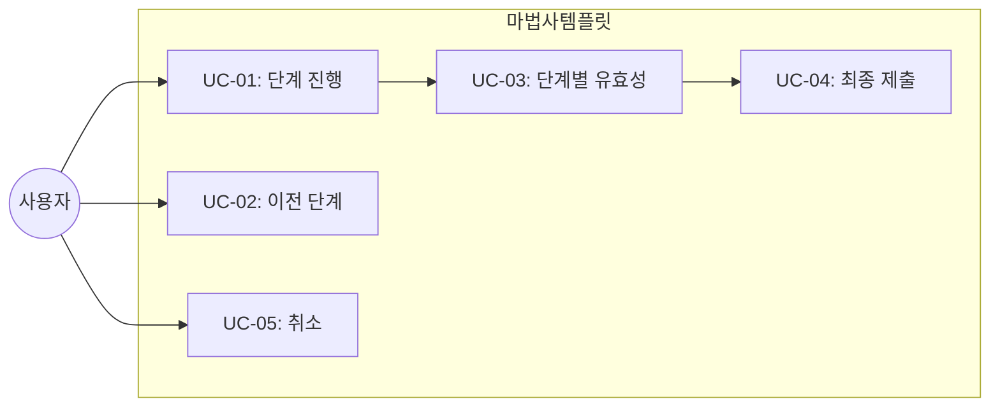

# TSK-06-06 - 마법사(Wizard) 화면 템플릿 설계 문서

## 문서 정보

| 항목 | 내용 |
|------|------|
| Task ID | TSK-06-06 |
| 문서 버전 | 1.0 |
| 작성일 | 2026-01-20 |
| 상태 | 작성중 |
| 카테고리 | development |

---

## 1. 개요

### 1.1 배경 및 문제 정의

**현재 상황:**
- 복잡한 데이터 입력이 여러 단계로 나뉘어야 하는 경우가 있음
- 단계별 진행, 유효성 검사, 이전/다음 네비게이션이 반복 구현됨

**해결하려는 문제:**
- 마법사 화면의 표준 템플릿 부재
- 단계 관리 로직 중복

### 1.2 목적 및 기대 효과

**목적:**
- 재사용 가능한 마법사 화면 템플릿 제공
- Ant Design Steps를 활용한 단계 표시 및 네비게이션

**기대 효과:**
- 복잡한 입력 프로세스 간소화
- 일관된 단계별 진행 UX

### 1.3 범위

**포함:**
- WizardTemplate 컴포넌트 구현
- 단계 표시 (Steps)
- 이전/다음 네비게이션
- 단계별 유효성 검사
- 최종 확인 및 완료

**제외:**
- 개별 단계 컨텐츠 정의

### 1.4 참조 문서

| 문서 | 경로 | 관련 섹션 |
|------|------|----------|
| PRD | `.orchay/projects/mes-portal/prd.md` | 4.1.1 화면 템플릿 - 마법사(Wizard) 화면 |
| TRD | `.orchay/projects/mes-portal/trd.md` | Ant Design Steps |

---

## 2. 사용자 분석

### 2.1 대상 사용자

| 사용자 유형 | 특성 | 주요 니즈 |
|------------|------|----------|
| 신규 사용자 | 복잡한 설정 필요 | 단계별 안내, 명확한 진행 |
| 관리자 | 복잡한 데이터 등록 | 중간 저장, 검증 |

---

## 3. 유즈케이스

### 3.1 유즈케이스 다이어그램



### 3.2 유즈케이스 상세

#### UC-01: 단계 진행

| 항목 | 내용 |
|------|------|
| 액터 | 일반 사용자 |
| 목적 | 다음 단계로 이동 |
| 사전 조건 | 현재 단계 유효성 통과 |
| 사후 조건 | 다음 단계 표시 |
| 트리거 | 다음 버튼 클릭 |

---

## 4. 사용자 시나리오

### 4.1 시나리오 1: 4단계 설정 마법사

**상황 설명:**
사용자가 시스템 설정을 4단계(기본정보 → 상세설정 → 확인 → 완료)로 진행한다.

**단계별 진행:**

| 단계 | 사용자 행동 | 시스템 반응 | 사용자 기대 |
|------|-----------|------------|------------|
| 1 | 기본정보 입력 | 필드 표시 | 진행 상황 표시 |
| 2 | 다음 클릭 | 유효성 검사 | 실패 시 에러 표시 |
| 3 | 상세설정 입력 | 다음 단계 표시 | 이전 단계로 돌아갈 수 있음 |
| 4 | 확인 단계 | 입력 내용 요약 | 수정 가능 |
| 5 | 완료 클릭 | 데이터 저장 | 성공 메시지 |

### 4.2 시나리오 2: 유효성 검사 실패

**상황 설명:**
필수 필드를 입력하지 않고 다음을 클릭한다.

**단계별 진행:**

| 단계 | 사용자 행동 | 시스템 반응 | 복구 방법 |
|------|-----------|------------|----------|
| 1 | 빈 필드로 다음 클릭 | 에러 메시지 표시 | 필수 필드 입력 |

---

## 5. 화면 설계

### 5.1 화면별 상세

#### 화면 1: 마법사 템플릿

**화면 목적:**
복잡한 입력을 단계별로 안내

**와이어프레임:**
```
┌─────────────────────────────────────────────────────────────────┐
│  ┌───────────────────────────────────────────────────────────┐  │
│  │  🧙 설정 마법사                                            │  │
│  └───────────────────────────────────────────────────────────┘  │
│                                                                  │
│  ┌───────────────────────────────────────────────────────────┐  │
│  │                                                            │  │
│  │    ●─────────────○─────────────○─────────────○             │  │
│  │    1. 기본정보   2. 상세설정   3. 확인       4. 완료       │  │
│  │    (현재)                                                  │  │
│  │                                                            │  │
│  └───────────────────────────────────────────────────────────┘  │
│                                                                  │
│  ┌───────────────────────────────────────────────────────────┐  │
│  │                                                            │  │
│  │  ┌─────────────────────────────────────────────────────┐  │  │
│  │  │                                                     │  │  │
│  │  │                                                     │  │  │
│  │  │              단계별 컨텐츠 영역                      │  │  │
│  │  │                                                     │  │  │
│  │  │         (Form, 요약, 결과 등)                       │  │  │
│  │  │                                                     │  │  │
│  │  │                                                     │  │  │
│  │  └─────────────────────────────────────────────────────┘  │  │
│  │                                                            │  │
│  └───────────────────────────────────────────────────────────┘  │
│                                                                  │
│  ┌───────────────────────────────────────────────────────────┐  │
│  │  [취소]                              [← 이전]  [다음 →]   │  │
│  └───────────────────────────────────────────────────────────┘  │
└─────────────────────────────────────────────────────────────────┘

* 마지막 단계에서는 [다음 →] 대신 [✓ 완료] 표시
* 첫 단계에서는 [← 이전] 숨김 또는 비활성화
```

**화면 요소 설명:**

| 영역 | 설명 | 사용자 인터랙션 |
|------|------|----------------|
| 단계 표시 (Steps) | 진행 상황 시각화 | 클릭으로 이동 (선택적) |
| 컨텐츠 영역 | 현재 단계 내용 | 입력, 확인 |
| 이전 버튼 | 이전 단계 이동 | 클릭 |
| 다음/완료 버튼 | 다음 단계 또는 제출 | 클릭 (유효성 검사) |
| 취소 버튼 | 마법사 종료 | 확인 후 닫기 |

---

## 6. 인터랙션 설계

### 6.1 사용자 액션과 피드백

| 사용자 액션 | 즉각 피드백 | 결과 피드백 | 에러 피드백 |
|------------|-----------|------------|------------|
| 다음 클릭 | 버튼 로딩 | 다음 단계 표시 | 유효성 에러 표시 |
| 이전 클릭 | - | 이전 단계 표시 | - |
| 완료 클릭 | 버튼 로딩 | 완료 화면/메시지 | 제출 실패 |
| 취소 클릭 | 확인 다이얼로그 | 마법사 닫힘 | - |

### 6.2 상태별 화면 변화

| 상태 | 화면 표시 | 사용자 안내 |
|------|----------|------------|
| 첫 단계 | 이전 버튼 숨김/비활성 | - |
| 중간 단계 | 이전/다음 버튼 모두 표시 | - |
| 마지막 단계 | 다음 대신 완료 버튼 | "입력 내용을 확인하세요" |
| 완료 후 | 성공 메시지 또는 리다이렉트 | "설정이 완료되었습니다" |

---

## 7. 데이터 요구사항

### 7.1 Props 인터페이스

```typescript
interface WizardStep {
  key: string
  title: string
  description?: string
  content: ReactNode
  validation?: () => Promise<boolean> | boolean
}

interface WizardTemplateProps {
  // 단계 정의
  steps: WizardStep[]

  // 상태
  currentStep?: number
  onStepChange?: (step: number) => void

  // 액션
  onComplete: () => Promise<void>
  onCancel?: () => void

  // 설정
  title?: string
  allowStepClick?: boolean // 단계 직접 클릭 허용
  showStepDescription?: boolean

  // 버튼 텍스트
  prevText?: string
  nextText?: string
  completeText?: string
  cancelText?: string

  // 상태
  loading?: boolean
}
```

---

## 8. 비즈니스 규칙

### 8.1 핵심 규칙

| 규칙 ID | 규칙 설명 | 적용 상황 |
|---------|----------|----------|
| BR-01 | 단계별 유효성 검사 후 다음 진행 | 다음 버튼 클릭 |
| BR-02 | 이전 단계 데이터 유지 | 이전/다음 이동 시 |
| BR-03 | 취소 시 확인 필요 | 취소 버튼 클릭 |
| BR-04 | 완료 단계에서만 제출 가능 | 완료 버튼 |

---

## 9. 에러 처리

### 9.1 예상 에러 상황

| 상황 | 원인 | 사용자 메시지 | 복구 방법 |
|------|------|--------------|----------|
| 유효성 실패 | 필수 필드 누락 | 필드별 에러 표시 | 필드 수정 |
| 제출 실패 | 서버 오류 | "저장에 실패했습니다" | 재시도 버튼 |

---

## 10. 연관 문서

| 문서 | 경로 | 용도 |
|------|------|------|
| 요구사항 추적 매트릭스 | `025-traceability-matrix.md` | PRD → 설계 → 테스트 추적 |
| 테스트 명세서 | `026-test-specification.md` | 테스트 케이스 정의 |

---

## 11. 구현 범위

### 11.1 영향받는 영역

| 영역 | 변경 내용 | 영향도 |
|------|----------|--------|
| components/templates/ | WizardTemplate.tsx 신규 | 높음 |

### 11.2 의존성

| 의존 항목 | 이유 | 상태 |
|----------|------|------|
| Ant Design Steps | 단계 표시 | 완료 |
| TSK-06-03 폼 템플릿 | 단계별 폼 | [dd] |
| TSK-05-02 확인 다이얼로그 | 취소 확인 | [dd] |

---

## 12. 체크리스트

### 12.1 설계 완료 확인

- [x] 문제 정의 및 목적 명확화
- [x] 사용자 분석 완료
- [x] 유즈케이스 정의 완료
- [x] 사용자 시나리오 작성 완료
- [x] 화면 설계 완료 (와이어프레임)
- [x] 인터랙션 설계 완료
- [x] 데이터 요구사항 정의 완료
- [x] 비즈니스 규칙 정의 완료
- [x] 에러 처리 정의 완료

---

## 변경 이력

| 버전 | 일자 | 작성자 | 변경 내용 |
|------|------|--------|----------|
| 1.0 | 2026-01-20 | Claude | 최초 작성 |
