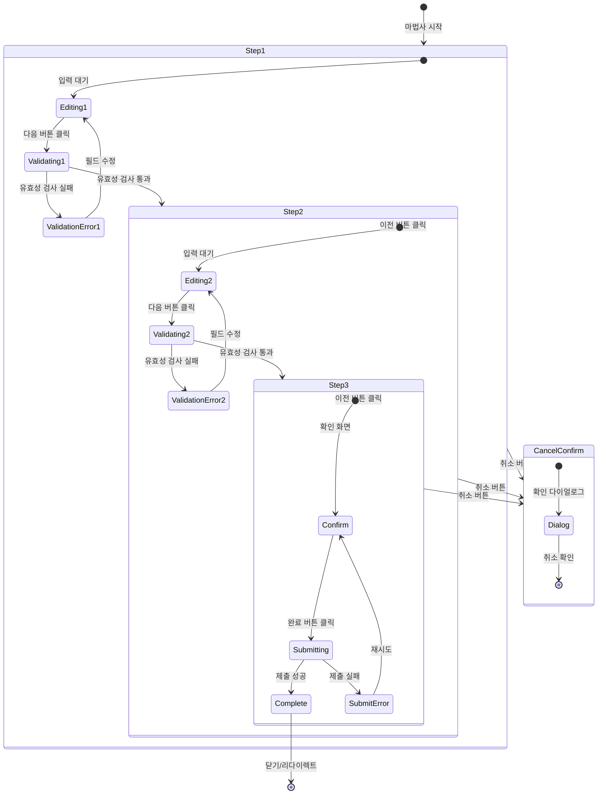

# TSK-06-06 - 마법사(Wizard) 화면 템플릿 UI 설계

## 문서 정보

| 항목 | 내용 |
|------|------|
| Task ID | TSK-06-06 |
| 문서 버전 | 1.0 |
| 작성일 | 2026-01-21 |
| 상태 | 작성완료 |
| 참조 설계 문서 | `010-design.md` |

---

## 1. 화면 목록

| 화면 ID | 화면명 | 목적 | SVG 참조 |
|---------|--------|------|----------|
| SCR-01 | 마법사 기본 화면 (수평 Steps) | 수평 단계 표시와 기본 레이아웃 | `screen-01-wizard-horizontal.svg` |
| SCR-02 | 마법사 단계별 폼 화면 | 폼 입력이 있는 중간 단계 | `screen-02-wizard-step-form.svg` |
| SCR-03 | 마법사 확인 화면 | 입력 내용 요약 및 최종 확인 단계 | `screen-03-wizard-confirm.svg` |
| SCR-04 | 마법사 완료 화면 | 마법사 완료 후 성공 상태 표시 | `screen-04-wizard-complete.svg` |
| SCR-05 | 마법사 에러 상태 | 유효성 검사 실패 또는 제출 에러 | `screen-05-wizard-error.svg` |

---

## 2. 화면 전환 흐름



### 액션-화면 매트릭스

| 현재 상태 | 액션 | 다음 상태 | 비고 |
|----------|------|----------|------|
| Step N (편집중) | 다음 버튼 클릭 | Validating | 유효성 검사 실행 |
| Validating | 유효성 통과 | Step N+1 | 다음 단계로 이동 |
| Validating | 유효성 실패 | ValidationError | 에러 메시지 표시 |
| ValidationError | 필드 수정 | 편집중 | 에러 클리어 |
| Step N (N>1) | 이전 버튼 클릭 | Step N-1 | 데이터 유지 |
| 확인 단계 | 완료 버튼 클릭 | Submitting | 로딩 표시 |
| Submitting | 성공 | Complete | 완료 화면 표시 |
| Submitting | 실패 | SubmitError | 에러 메시지 표시 |
| 모든 단계 | 취소 버튼 클릭 | CancelConfirm | 확인 다이얼로그 |
| Complete | 확인 버튼 클릭 | - | 마법사 종료 |

---

## 3. 화면별 상세

### 3.1 SCR-01: 마법사 기본 화면 (수평 Steps)

**화면 목적:**
마법사 화면의 기본 레이아웃. 상단에 수평 Steps로 진행 상황을 표시하고, 중앙에 단계별 컨텐츠, 하단에 네비게이션 버튼을 배치한다.

**레이아웃:**

```
┌─────────────────────────────────────────────────────────────────────────────────┐
│  ┌───────────────────────────────────────────────────────────────────────────┐  │
│  │  설정 마법사                                                               │  │
│  └───────────────────────────────────────────────────────────────────────────┘  │
│                                                                                  │
│  ┌───────────────────────────────────────────────────────────────────────────┐  │
│  │                                                                            │  │
│  │     ●─────────────────○─────────────────○─────────────────○               │  │
│  │     1. 기본정보        2. 상세설정       3. 확인          4. 완료         │  │
│  │     (현재 단계)                                                           │  │
│  │                                                                            │  │
│  └───────────────────────────────────────────────────────────────────────────┘  │
│                                                                                  │
│  ┌───────────────────────────────────────────────────────────────────────────┐  │
│  │ [컨텐츠 영역 - Card]                                                       │  │
│  │                                                                            │  │
│  │  ┌─────────────────────────────────────────────────────────────────────┐  │  │
│  │  │                                                                     │  │  │
│  │  │                      단계 1: 기본정보 입력                          │  │  │
│  │  │                                                                     │  │  │
│  │  │   이름 *                                                            │  │  │
│  │  │   ┌─────────────────────────────────────────────────────────────┐  │  │  │
│  │  │   │                                                             │  │  │  │
│  │  │   └─────────────────────────────────────────────────────────────┘  │  │  │
│  │  │                                                                     │  │  │
│  │  │   설명                                                              │  │  │
│  │  │   ┌─────────────────────────────────────────────────────────────┐  │  │  │
│  │  │   │                                                             │  │  │  │
│  │  │   │                                                             │  │  │  │
│  │  │   └─────────────────────────────────────────────────────────────┘  │  │  │
│  │  │                                                                     │  │  │
│  │  └─────────────────────────────────────────────────────────────────────┘  │  │
│  │                                                                            │  │
│  └───────────────────────────────────────────────────────────────────────────┘  │
│                                                                                  │
│  ┌───────────────────────────────────────────────────────────────────────────┐  │
│  │  [취소]                                                      [다음 ->]   │  │
│  └───────────────────────────────────────────────────────────────────────────┘  │
└─────────────────────────────────────────────────────────────────────────────────┘

* 첫 단계에서는 [<- 이전] 버튼 숨김
* 마지막 단계에서는 [다음 ->] 대신 [완료] 표시
```

**컴포넌트 구성:**

| 영역 | Ant Design 컴포넌트 | Props/설정 |
|------|---------------------|------------|
| 제목 | `Typography.Title` | level={4} |
| 단계 표시 | `Steps` | current, items, direction="horizontal" |
| 단계 아이템 | `Steps.Item` | title, description, status |
| 컨텐츠 컨테이너 | `Card` | bordered, style={{ minHeight: 300 }} |
| 버튼 영역 | `Flex` | justify="space-between" |
| 취소 버튼 | `Button` | type="default" |
| 이전 버튼 | `Button` | type="default", icon={<LeftOutlined/>} |
| 다음 버튼 | `Button` | type="primary", icon={<RightOutlined/>} |
| 완료 버튼 | `Button` | type="primary", icon={<CheckOutlined/>} |

**상태 정의:**

| 상태 | 설명 | 시각적 표현 |
|------|------|------------|
| 기본 | 첫 단계 진입 상태 | 첫 Step 활성화, 이전 버튼 숨김 |
| 진행중 | 중간 단계 | 해당 Step 활성화, 이전/다음 버튼 표시 |
| 마지막 | 확인/완료 단계 | 다음 대신 완료 버튼 표시 |
| 로딩 | 다음/완료 클릭 후 | 버튼 로딩 스피너, 폼 비활성화 |

**액션 정의:**

| 액션 | 트리거 | 결과 |
|------|--------|------|
| 다음 | 다음 버튼 클릭 | 유효성 검사 후 다음 단계 이동 |
| 이전 | 이전 버튼 클릭 | 이전 단계 이동 (데이터 유지) |
| 취소 | 취소 버튼 클릭 | 확인 다이얼로그 표시 |
| 단계 클릭 | Steps 아이템 클릭 | allowStepClick 시 해당 단계로 이동 |

---

### 3.2 SCR-02: 마법사 단계별 폼 화면

**화면 목적:**
복잡한 폼 입력이 있는 중간 단계. 여러 필드를 포함하며 단계별 유효성 검사를 수행한다.

**레이아웃:**

```
┌─────────────────────────────────────────────────────────────────────────────────┐
│  ┌───────────────────────────────────────────────────────────────────────────┐  │
│  │  설정 마법사                                                               │  │
│  └───────────────────────────────────────────────────────────────────────────┘  │
│                                                                                  │
│  ┌───────────────────────────────────────────────────────────────────────────┐  │
│  │                                                                            │  │
│  │     ✓─────────────────●─────────────────○─────────────────○               │  │
│  │     1. 기본정보        2. 상세설정       3. 확인          4. 완료         │  │
│  │     (완료)             (현재 단계)                                        │  │
│  │                                                                            │  │
│  └───────────────────────────────────────────────────────────────────────────┘  │
│                                                                                  │
│  ┌───────────────────────────────────────────────────────────────────────────┐  │
│  │ [컨텐츠 영역 - Card]                                                       │  │
│  │                                                                            │  │
│  │  ┌─────────────────────────────────────────────────────────────────────┐  │  │
│  │  │                      단계 2: 상세설정                               │  │  │
│  │  │                                                                     │  │  │
│  │  │   유형 *                                                            │  │  │
│  │  │   ┌─────────────────────────────────────────────────────────────┐  │  │  │
│  │  │   │ 유형을 선택하세요                                        ▼ │  │  │  │
│  │  │   └─────────────────────────────────────────────────────────────┘  │  │  │
│  │  │                                                                     │  │  │
│  │  │   사용 여부                                                         │  │  │
│  │  │   ┌────────┐                                                       │  │  │
│  │  │   │   ●    │ 사용                                                  │  │  │
│  │  │   └────────┘                                                       │  │  │
│  │  │                                                                     │  │  │
│  │  │   옵션 설정                                                         │  │  │
│  │  │   ┌─────────────────────────────────────────────────────────────┐  │  │  │
│  │  │   │ □ 옵션 A   □ 옵션 B   ☑ 옵션 C                              │  │  │  │
│  │  │   └─────────────────────────────────────────────────────────────┘  │  │  │
│  │  │                                                                     │  │  │
│  │  │   시작일 *                      종료일                              │  │  │
│  │  │   ┌──────────────────────┐     ┌──────────────────────┐           │  │  │
│  │  │   │ YYYY-MM-DD       📅 │     │ YYYY-MM-DD       📅 │           │  │  │
│  │  │   └──────────────────────┘     └──────────────────────┘           │  │  │
│  │  │                                                                     │  │  │
│  │  └─────────────────────────────────────────────────────────────────────┘  │  │
│  │                                                                            │  │
│  └───────────────────────────────────────────────────────────────────────────┘  │
│                                                                                  │
│  ┌───────────────────────────────────────────────────────────────────────────┐  │
│  │  [취소]                                           [<- 이전]  [다음 ->]   │  │
│  └───────────────────────────────────────────────────────────────────────────┘  │
└─────────────────────────────────────────────────────────────────────────────────┘
```

**Steps 상태 표시:**

| 상태 | 아이콘/색상 | 설명 |
|------|------------|------|
| finish | 체크 아이콘 (녹색) | 완료된 단계 |
| process | 숫자 (파란색 배경) | 현재 진행 중인 단계 |
| wait | 숫자 (회색) | 대기 중인 단계 |
| error | X 아이콘 (빨간색) | 에러 발생 단계 |

**상태별 변화:**

| 요소 | 첫 단계 | 중간 단계 | 마지막 단계 |
|------|--------|----------|------------|
| 이전 버튼 | 숨김/비활성 | 표시 | 표시 |
| 다음 버튼 | 표시 | 표시 | 숨김 |
| 완료 버튼 | 숨김 | 숨김 | 표시 |
| 진행률 | 0% | 단계/전체*100 | 100% |

---

### 3.3 SCR-03: 마법사 확인 화면

**화면 목적:**
입력한 모든 내용을 요약하여 보여주고 최종 확인을 받는 단계.

**레이아웃:**

```
┌─────────────────────────────────────────────────────────────────────────────────┐
│  ┌───────────────────────────────────────────────────────────────────────────┐  │
│  │  설정 마법사                                                               │  │
│  └───────────────────────────────────────────────────────────────────────────┘  │
│                                                                                  │
│  ┌───────────────────────────────────────────────────────────────────────────┐  │
│  │                                                                            │  │
│  │     ✓─────────────────✓─────────────────●─────────────────○               │  │
│  │     1. 기본정보        2. 상세설정       3. 확인          4. 완료         │  │
│  │     (완료)             (완료)            (현재 단계)                       │  │
│  │                                                                            │  │
│  └───────────────────────────────────────────────────────────────────────────┘  │
│                                                                                  │
│  ┌───────────────────────────────────────────────────────────────────────────┐  │
│  │ [컨텐츠 영역 - Card]                                                       │  │
│  │                                                                            │  │
│  │  ┌─────────────────────────────────────────────────────────────────────┐  │  │
│  │  │                      입력 내용 확인                                 │  │  │
│  │  │                                                                     │  │  │
│  │  │  ┌──────────────────────────────────────────────────────────────┐  │  │  │
│  │  │  │ 기본정보                                            [수정]  │  │  │  │
│  │  │  ├──────────────────────────────────────────────────────────────┤  │  │  │
│  │  │  │  이름           │  테스트 설정                               │  │  │  │
│  │  │  │  설명           │  테스트를 위한 설정입니다.                  │  │  │  │
│  │  │  └──────────────────────────────────────────────────────────────┘  │  │  │
│  │  │                                                                     │  │  │
│  │  │  ┌──────────────────────────────────────────────────────────────┐  │  │  │
│  │  │  │ 상세설정                                            [수정]  │  │  │  │
│  │  │  ├──────────────────────────────────────────────────────────────┤  │  │  │
│  │  │  │  유형           │  타입 A                                    │  │  │  │
│  │  │  │  사용 여부      │  사용                                      │  │  │  │
│  │  │  │  옵션           │  옵션 C                                    │  │  │  │
│  │  │  │  시작일         │  2026-01-21                                │  │  │  │
│  │  │  │  종료일         │  2026-12-31                                │  │  │  │
│  │  │  └──────────────────────────────────────────────────────────────┘  │  │  │
│  │  │                                                                     │  │  │
│  │  │  ⓘ 입력 내용을 확인 후 [완료] 버튼을 클릭해 주세요.                │  │  │
│  │  │                                                                     │  │  │
│  │  └─────────────────────────────────────────────────────────────────────┘  │  │
│  │                                                                            │  │
│  └───────────────────────────────────────────────────────────────────────────┘  │
│                                                                                  │
│  ┌───────────────────────────────────────────────────────────────────────────┐  │
│  │  [취소]                                          [<- 이전]  [✓ 완료]     │  │
│  └───────────────────────────────────────────────────────────────────────────┘  │
└─────────────────────────────────────────────────────────────────────────────────┘
```

**컴포넌트:**

| 요소 | Ant Design 컴포넌트 | Props |
|------|---------------------|-------|
| 요약 섹션 | `Card` | title, extra={<Button>수정</Button>} |
| 요약 테이블 | `Descriptions` | bordered, column={1} |
| 안내 메시지 | `Alert` | type="info", showIcon |
| 완료 버튼 | `Button` | type="primary", icon={<CheckOutlined/>} |

**인터랙션:**

| 액션 | 결과 |
|------|------|
| [수정] 버튼 클릭 | 해당 단계로 이동 |
| [완료] 버튼 클릭 | 로딩 -> 제출 -> 완료 화면 |
| [이전] 버튼 클릭 | 이전 단계로 이동 |

---

### 3.4 SCR-04: 마법사 완료 화면

**화면 목적:**
마법사 완료 후 성공 메시지와 후속 액션을 안내.

**레이아웃:**

```
┌─────────────────────────────────────────────────────────────────────────────────┐
│  ┌───────────────────────────────────────────────────────────────────────────┐  │
│  │  설정 마법사                                                               │  │
│  └───────────────────────────────────────────────────────────────────────────┘  │
│                                                                                  │
│  ┌───────────────────────────────────────────────────────────────────────────┐  │
│  │                                                                            │  │
│  │     ✓─────────────────✓─────────────────✓─────────────────●               │  │
│  │     1. 기본정보        2. 상세설정       3. 확인          4. 완료         │  │
│  │     (완료)             (완료)            (완료)           (현재)          │  │
│  │                                                                            │  │
│  └───────────────────────────────────────────────────────────────────────────┘  │
│                                                                                  │
│  ┌───────────────────────────────────────────────────────────────────────────┐  │
│  │ [컨텐츠 영역 - Card]                                                       │  │
│  │                                                                            │  │
│  │  ┌─────────────────────────────────────────────────────────────────────┐  │  │
│  │  │                                                                     │  │  │
│  │  │                                                                     │  │  │
│  │  │                        ┌─────────────┐                              │  │  │
│  │  │                        │     ✓       │                              │  │  │
│  │  │                        │   (녹색)    │                              │  │  │
│  │  │                        └─────────────┘                              │  │  │
│  │  │                                                                     │  │  │
│  │  │                      설정이 완료되었습니다!                         │  │  │
│  │  │                                                                     │  │  │
│  │  │              설정이 정상적으로 저장되었습니다.                       │  │  │
│  │  │              새로운 설정은 즉시 적용됩니다.                          │  │  │
│  │  │                                                                     │  │  │
│  │  │                                                                     │  │  │
│  │  │                    [목록으로]     [상세 보기]                        │  │  │
│  │  │                                                                     │  │  │
│  │  │                                                                     │  │  │
│  │  └─────────────────────────────────────────────────────────────────────┘  │  │
│  │                                                                            │  │
│  └───────────────────────────────────────────────────────────────────────────┘  │
│                                                                                  │
│  ┌───────────────────────────────────────────────────────────────────────────┐  │
│  │                                                            [닫기]         │  │
│  └───────────────────────────────────────────────────────────────────────────┘  │
└─────────────────────────────────────────────────────────────────────────────────┘
```

**컴포넌트:**

| 요소 | Ant Design 컴포넌트 | Props |
|------|---------------------|-------|
| 성공 아이콘 | `Result` | status="success" |
| 제목 | `Result.title` | "설정이 완료되었습니다!" |
| 설명 | `Result.subTitle` | 완료 안내 메시지 |
| 액션 버튼 | `Result.extra` | 목록, 상세보기 버튼 |

**상태별 변화:**

| 상태 | 표시 |
|------|------|
| 완료 대기 | 로딩 스피너 |
| 성공 | Result success |
| 실패 | Result error + 재시도 버튼 |

---

### 3.5 SCR-05: 마법사 에러 상태

**화면 목적:**
유효성 검사 실패 또는 제출 실패 시 에러 상태 표시.

**레이아웃:**

```
┌─────────────────────────────────────────────────────────────────────────────────┐
│  ┌───────────────────────────────────────────────────────────────────────────┐  │
│  │  설정 마법사                                                               │  │
│  └───────────────────────────────────────────────────────────────────────────┘  │
│                                                                                  │
│  ┌───────────────────────────────────────────────────────────────────────────┐  │
│  │                                                                            │  │
│  │     ✗─────────────────○─────────────────○─────────────────○               │  │
│  │     1. 기본정보        2. 상세설정       3. 확인          4. 완료         │  │
│  │     (에러)                                                                │  │
│  │                                                                            │  │
│  └───────────────────────────────────────────────────────────────────────────┘  │
│                                                                                  │
│  ┌───────────────────────────────────────────────────────────────────────────┐  │
│  │ [에러 알림]                                                                │  │
│  │ ⚠ 입력 내용을 확인해 주세요. 필수 항목이 누락되었습니다.                   │  │
│  └───────────────────────────────────────────────────────────────────────────┘  │
│                                                                                  │
│  ┌───────────────────────────────────────────────────────────────────────────┐  │
│  │ [컨텐츠 영역 - Card]                                                       │  │
│  │                                                                            │  │
│  │  ┌─────────────────────────────────────────────────────────────────────┐  │  │
│  │  │                      단계 1: 기본정보 입력                          │  │  │
│  │  │                                                                     │  │  │
│  │  │   이름 *                                                            │  │  │
│  │  │   ┌─────────────────────────────────────────────────────────────┐  │  │  │
│  │  │   │                                              [빨간 테두리]  │  │  │  │
│  │  │   └─────────────────────────────────────────────────────────────┘  │  │  │
│  │  │   ⚠ 이름을 입력해 주세요.                                          │  │  │
│  │  │                                                                     │  │  │
│  │  │   이메일 *                                                          │  │  │
│  │  │   ┌─────────────────────────────────────────────────────────────┐  │  │  │
│  │  │   │ invalid-email                                [빨간 테두리]  │  │  │  │
│  │  │   └─────────────────────────────────────────────────────────────┘  │  │  │
│  │  │   ⚠ 올바른 이메일 형식이 아닙니다.                                  │  │  │
│  │  │                                                                     │  │  │
│  │  │   설명                                                              │  │  │
│  │  │   ┌─────────────────────────────────────────────────────────────┐  │  │  │
│  │  │   │                                                             │  │  │  │
│  │  │   └─────────────────────────────────────────────────────────────┘  │  │  │
│  │  │                                                                     │  │  │
│  │  └─────────────────────────────────────────────────────────────────────┘  │  │
│  │                                                                            │  │
│  └───────────────────────────────────────────────────────────────────────────┘  │
│                                                                                  │
│  ┌───────────────────────────────────────────────────────────────────────────┐  │
│  │  [취소]                                                      [다음 ->]   │  │
│  └───────────────────────────────────────────────────────────────────────────┘  │
└─────────────────────────────────────────────────────────────────────────────────┘
```

**에러 표시 요소:**

| 요소 | Ant Design 컴포넌트 | Props |
|------|---------------------|-------|
| 상단 에러 알림 | `Alert` | type="error", showIcon, closable |
| Steps 에러 상태 | `Steps.Item` | status="error" |
| 필드 에러 | `Form.Item` | validateStatus="error", help="에러메시지" |
| 에러 아이콘 | Input suffix | 빨간색 X 아이콘 |

**에러 유형:**

| 유형 | 위치 | 메시지 |
|------|------|--------|
| 필수 입력 누락 | 필드 아래 | "OOO을(를) 입력해 주세요." |
| 형식 오류 | 필드 아래 | "올바른 OOO 형식이 아닙니다." |
| 서버 오류 | 상단 Alert | "저장에 실패했습니다. 다시 시도해 주세요." |
| 네트워크 오류 | 상단 Alert | "네트워크 오류가 발생했습니다." |

---

## 4. 공통 컴포넌트

### 4.1 Steps 컴포넌트 스타일

| 요소 | 설명 | 스타일/Props |
|------|------|-------------|
| Steps 컨테이너 | 수평 단계 표시 | direction="horizontal", marginBottom: 24px |
| Step 아이콘 (wait) | 대기 상태 | 회색 원, 회색 숫자 |
| Step 아이콘 (process) | 현재 진행 | 파란색 원 (#1677ff), 흰색 숫자 |
| Step 아이콘 (finish) | 완료 | 파란색 원, 흰색 체크 아이콘 |
| Step 아이콘 (error) | 에러 | 빨간색 원 (#ff4d4f), 흰색 X 아이콘 |
| Step 연결선 | 단계 사이 | 완료: 파란색, 대기: 회색 |
| Step 제목 | 단계명 | font-size: 16px |
| Step 설명 | 부가 설명 (선택) | font-size: 14px, color: #8c8c8c |

### 4.2 네비게이션 버튼 영역

| 요소 | 설명 | 스타일/Props |
|------|------|-------------|
| 컨테이너 | Flex 레이아웃 | justify-content: space-between, padding: 16px 0 |
| 취소 버튼 | 왼쪽 배치 | type="default" |
| 이전 버튼 | 오른쪽 그룹 | type="default", icon={<LeftOutlined/>} |
| 다음 버튼 | 오른쪽 그룹 | type="primary", icon={<RightOutlined/>}, iconPosition="end" |
| 완료 버튼 | 오른쪽 그룹 (마지막) | type="primary", icon={<CheckOutlined/>} |
| 버튼 간격 | 오른쪽 그룹 | gap: 8px (Space) |

### 4.3 컨텐츠 Card

| 요소 | 설명 | 스타일/Props |
|------|------|-------------|
| Card | 컨텐츠 래퍼 | bordered, padding: 24px |
| 최소 높이 | 컨텐츠 영역 | minHeight: 300px |
| 제목 | 단계 제목 (선택) | Typography.Title level={5} |

### 4.4 취소 확인 다이얼로그

| 요소 | 설명 | 스타일/Props |
|------|------|-------------|
| 다이얼로그 | Modal.confirm | icon={<ExclamationCircleOutlined/>} |
| 제목 | "마법사 취소" | - |
| 내용 | "진행 중인 내용이 저장되지 않습니다. 취소하시겠습니까?" | - |
| 확인 버튼 | "네, 취소합니다" | danger |
| 취소 버튼 | "계속 진행" | - |

---

## 5. 반응형 설계

### 5.1 Breakpoint 정의

| Breakpoint | 크기 | 설명 |
|------------|------|------|
| Desktop (lg) | 992px+ | 수평 Steps, 전체 레이아웃 |
| Tablet (md) | 768-991px | 수평 Steps, 컨텐츠 너비 조정 |
| Mobile (sm) | 576-767px | 수직 Steps (좌측), 컨텐츠 축소 |
| Mobile (xs) | 575px- | 축소형 Steps 또는 숨김, 단계 표시만 |

### 5.2 반응형 동작

**Desktop (992px+)**
```
┌──────────────────────────────────────────────────┐
│    ●───────○───────○───────○                     │
│    1       2       3       4                     │
│    기본정보  상세설정  확인    완료                │
├──────────────────────────────────────────────────┤
│              [컨텐츠 영역]                        │
├──────────────────────────────────────────────────┤
│  [취소]                    [이전] [다음]          │
└──────────────────────────────────────────────────┘
- Steps: 수평 배치, 제목+설명 모두 표시
- 버튼: 좌우 분리 배치
```

**Tablet (768-991px)**
```
┌──────────────────────────────────────────────────┐
│      ●─────○─────○─────○                         │
│      1     2     3     4                         │
├──────────────────────────────────────────────────┤
│              [컨텐츠 영역]                        │
├──────────────────────────────────────────────────┤
│  [취소]                    [이전] [다음]          │
└──────────────────────────────────────────────────┘
- Steps: 수평 배치, 제목만 표시 (설명 숨김)
- 버튼: 좌우 분리 유지
```

**Mobile (576-767px)**
```
┌──────────────────────────────┐
│  ┌───┐                       │
│  │ ● │ 1. 기본정보 (1/4)     │
│  ├───┤                       │
│  │ ○ │ 2. 상세설정           │
│  ├───┤                       │
│  │ ○ │ 3. 확인               │
│  ├───┤                       │
│  │ ○ │ 4. 완료               │
│  └───┘                       │
├──────────────────────────────┤
│      [컨텐츠 영역]            │
├──────────────────────────────┤
│  [취소]   [이전]   [다음]     │
└──────────────────────────────┘
- Steps: 수직 배치 (좌측 또는 상단)
- 버튼: 가로 균등 배치
```

**Mobile (575px-)**
```
┌─────────────────────────────┐
│  단계 1/4: 기본정보          │
│  ●○○○                       │
├─────────────────────────────┤
│      [컨텐츠 영역]           │
├─────────────────────────────┤
│ [취소]  [이전]  [다음]       │
└─────────────────────────────┘
- Steps: 축소형 (진행률 표시만)
- 버튼: 세로 스택 또는 가로 축소
```

### 5.3 반응형 구현

```typescript
// Steps direction 반응형
const useStepsDirection = () => {
  const screens = Grid.useBreakpoint()
  if (screens.md) return 'horizontal'
  return 'vertical'
}

// Steps size 반응형
const useStepsSize = () => {
  const screens = Grid.useBreakpoint()
  if (screens.lg) return 'default'
  return 'small'
}

// 모바일에서 Steps 축소 표시
const MobileStepIndicator = ({ current, total }: { current: number; total: number }) => (
  <div>
    <Typography.Text>단계 {current + 1}/{total}</Typography.Text>
    <Progress percent={(current / (total - 1)) * 100} showInfo={false} size="small" />
  </div>
)
```

---

## 6. 접근성

### 6.1 키보드 네비게이션

| 키 | 동작 | 영역 |
|-----|------|------|
| Tab | 포커스 순차 이동 | 전체 (Steps -> 컨텐츠 -> 버튼) |
| Shift + Tab | 포커스 역순 이동 | 전체 |
| Enter | 버튼 클릭 / 다음 단계 | 버튼 포커스 시 |
| Arrow Left/Right | Steps 간 이동 | Steps 포커스 시 (allowStepClick 활성 시) |
| Escape | 취소 다이얼로그 | 마법사 전체 |

### 6.2 ARIA 속성

| 요소 | ARIA 속성 | 값/설명 |
|------|----------|---------|
| Steps 컨테이너 | role | "tablist" 또는 "navigation" |
| Steps 컨테이너 | aria-label | "마법사 진행 단계" |
| Step 아이템 | role | "tab" |
| Step 아이템 | aria-selected | 현재 단계 "true" |
| Step 아이템 | aria-current | 현재 단계 "step" |
| 컨텐츠 영역 | role | "tabpanel" |
| 컨텐츠 영역 | aria-labelledby | 현재 Step ID |
| 이전 버튼 | aria-label | "이전 단계로 이동" |
| 다음 버튼 | aria-label | "다음 단계로 이동" |
| 완료 버튼 | aria-label | "마법사 완료" |
| 진행률 | aria-valuenow | 현재 단계 번호 |
| 진행률 | aria-valuemin | 1 |
| 진행률 | aria-valuemax | 전체 단계 수 |
| 에러 알림 | role | "alert" |
| 에러 알림 | aria-live | "assertive" |

### 6.3 색상 대비

| 요소 | 전경색 | 배경색 | 대비율 |
|------|--------|--------|--------|
| Step 제목 (활성) | #000000d9 | #FFFFFF | 15.1:1 |
| Step 제목 (대기) | #8c8c8c | #FFFFFF | 4.9:1 |
| Step 아이콘 (process) | #FFFFFF | #1677ff | 4.6:1 |
| Step 아이콘 (error) | #FFFFFF | #ff4d4f | 4.5:1 |
| 버튼 텍스트 (Primary) | #FFFFFF | #1677ff | 4.6:1 |
| 에러 메시지 | #ff4d4f | #FFFFFF | 4.5:1 |

### 6.4 스크린 리더 안내

| 상황 | 안내 메시지 |
|------|------------|
| 단계 이동 | "단계 {N}, {단계명}(으)로 이동했습니다." |
| 유효성 에러 | "{N}개의 필드에 오류가 있습니다." |
| 완료 | "마법사가 완료되었습니다. {결과 메시지}" |
| 취소 확인 | "마법사를 취소하시겠습니까? 입력한 내용이 저장되지 않습니다." |
| 로딩 중 | "처리 중입니다. 잠시만 기다려 주세요." |

---

## 7. 다크 모드 지원

### 7.1 색상 매핑

| 요소 | 라이트 모드 | 다크 모드 |
|------|------------|----------|
| 배경 | #f5f5f5 | #141414 |
| Card 배경 | #ffffff | #1f1f1f |
| Card 테두리 | #d9d9d9 | #434343 |
| Step 텍스트 (활성) | #000000d9 | #ffffffd9 |
| Step 텍스트 (대기) | #8c8c8c | #8c8c8c |
| Step 라인 (완료) | #1677ff | #177ddc |
| Step 라인 (대기) | #f0f0f0 | #303030 |
| Primary 버튼 | #1677ff | #177ddc |
| 에러 색상 | #ff4d4f | #d32029 |
| 성공 색상 | #52c41a | #49aa19 |

### 7.2 Steps 다크 모드

| 상태 | 아이콘 배경 | 아이콘 색상 | 텍스트 |
|------|------------|------------|--------|
| wait | #1f1f1f | #8c8c8c | #8c8c8c |
| process | #177ddc | #ffffff | #ffffffd9 |
| finish | #177ddc | #ffffff | #ffffffd9 |
| error | #d32029 | #ffffff | #d32029 |

---

## 8. SVG 파일 목록

| 파일명 | 화면 | 상태 | 크기 |
|--------|------|------|------|
| `screen-01-wizard-horizontal.svg` | 마법사 기본 화면 | 첫 단계 | 800x600 |
| `screen-02-wizard-step-form.svg` | 단계별 폼 화면 | 중간 단계 | 800x600 |
| `screen-03-wizard-confirm.svg` | 확인 화면 | 확인 단계 | 800x600 |
| `screen-04-wizard-complete.svg` | 완료 화면 | 성공 | 800x600 |
| `screen-05-wizard-error.svg` | 에러 상태 | 유효성 에러 | 800x600 |

---

## 9. 디자인 토큰 참조

### 9.1 간격 (Spacing)

| 토큰 | 값 | 용도 |
|------|-----|------|
| wizard-steps-margin-bottom | 24px | Steps와 컨텐츠 사이 |
| wizard-content-padding | 24px | 컨텐츠 Card 내부 패딩 |
| wizard-content-min-height | 300px | 최소 컨텐츠 높이 |
| wizard-footer-margin-top | 24px | 버튼 영역 상단 마진 |
| wizard-button-gap | 8px | 버튼 사이 간격 |

### 9.2 크기 (Size)

| 토큰 | 값 | 용도 |
|------|-----|------|
| step-icon-size-default | 32px | Steps 아이콘 크기 |
| step-icon-size-small | 24px | Steps 아이콘 (small) |
| step-title-font-size | 16px | 단계 제목 폰트 |
| step-description-font-size | 14px | 단계 설명 폰트 |

### 9.3 애니메이션

| 토큰 | 값 | 용도 |
|------|-----|------|
| wizard-transition-duration | 300ms | 단계 전환 애니메이션 |
| wizard-fade-in | fade-in 300ms | 컨텐츠 등장 |

---

## 변경 이력

| 버전 | 일자 | 작성자 | 변경 내용 |
|------|------|--------|----------|
| 1.0 | 2026-01-21 | Claude | 최초 작성 |
