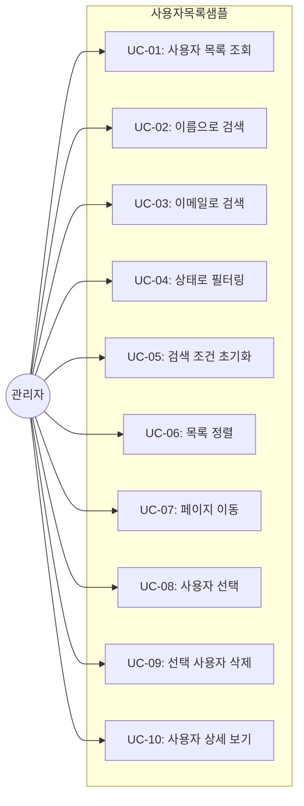
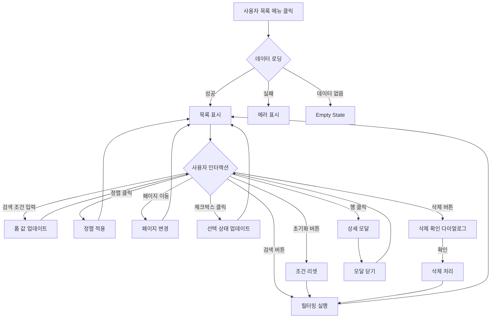

# TSK-06-07 - [샘플] 사용자 목록 화면 설계 문서

## 문서 정보

| 항목 | 내용 |
|------|------|
| Task ID | TSK-06-07 |
| 문서 버전 | 1.0 |
| 작성일 | 2026-01-21 |
| 상태 | 작성중 |
| 카테고리 | development |

---

## 1. 개요

### 1.1 배경 및 문제 정의

**현재 상황:**
- MES Portal에서 TSK-06-01로 구현된 ListTemplate 컴포넌트의 기능 검증이 필요함
- 실제 사용 시나리오를 통해 템플릿의 완성도와 사용성을 확인해야 함
- 개발자가 ListTemplate을 사용하는 방법을 보여주는 참조 구현이 필요함

**해결하려는 문제:**
- ListTemplate의 다양한 검색 필드 타입(텍스트, 셀렉트, 날짜 등) 동작 검증
- 정렬, 페이징, 필터링 기능의 통합 테스트
- 행 클릭, 행 선택, 삭제 등 사용자 인터랙션 검증
- mock 데이터 기반 화면 개발 패턴 정립

### 1.2 목적 및 기대 효과

**목적:**
- ListTemplate 컴포넌트 사용법을 보여주는 샘플 화면 구현
- 사용자 목록 조회/검색/삭제 기능 제공
- JSON mock 데이터 기반으로 백엔드 없이 동작하는 화면 구현

**기대 효과:**
- 사용자 관점: 표준화된 목록 화면 UX 경험
- 개발자 관점: ListTemplate 사용 참조 코드 제공, 신규 목록 화면 개발 시간 단축
- 품질 관점: 템플릿 기능 검증을 통한 품질 확보

### 1.3 범위

**포함:**
- 사용자 목록 샘플 화면 (screens/sample/UserList.tsx)
- 검색 조건: 이름, 이메일, 상태 (텍스트, 텍스트, 셀렉트)
- 그리드: 사용자 목록 표시 (정렬, 페이징)
- 행 선택 및 삭제 기능
- 행 클릭 시 상세 모달 표시
- mock 데이터 파일 (mock-data/users.json)

**제외:**
- 실제 API 연동 (mock 데이터 사용)
- 사용자 등록/수정 기능 (샘플에서는 조회/삭제만)
- 서버 사이드 정렬/페이징 (클라이언트 사이드)

### 1.4 참조 문서

| 문서 | 경로 | 관련 섹션 |
|------|------|----------|
| PRD | `.orchay/projects/mes-portal/prd.md` | 4.1.1 화면 템플릿 샘플 - 사용자 목록 |
| TRD | `.orchay/projects/mes-portal/trd.md` | 2.3 Mock 데이터 전략 |
| TSK-06-01 | `.orchay/projects/mes-portal/tasks/TSK-06-01/010-design.md` | ListTemplate 설계 |

---

## 2. 사용자 분석

### 2.1 대상 사용자

| 사용자 유형 | 특성 | 주요 니즈 |
|------------|------|----------|
| 시스템 관리자 | 사용자 계정 관리 담당 | 빠른 사용자 검색, 계정 상태 확인, 비활성 계정 정리 |
| 개발자 | ListTemplate 사용법 학습 | 참조 코드 확인, Props 사용 예시 |
| QA 담당자 | ListTemplate 기능 검증 | 모든 기능 동작 확인, 에지 케이스 테스트 |

### 2.2 사용자 페르소나

**페르소나 1: 이관리 (시스템 관리자)**
- 역할: MES Portal 사용자 계정 관리
- 목표: 비활성 사용자 찾아서 정리, 특정 사용자 정보 확인
- 불만: 사용자가 많을 때 원하는 사람 찾기 어려움
- 시나리오: 이름 또는 이메일로 사용자 검색 후 상세 정보 확인

**페르소나 2: 박개발 (프론트엔드 개발자)**
- 역할: 새로운 목록 화면 개발
- 목표: ListTemplate 사용법 파악, 검색 필드 설정 방법 확인
- 불만: 문서만으로는 실제 사용법 파악 어려움
- 시나리오: 샘플 코드 참조하여 새 목록 화면 구현

---

## 3. 유즈케이스

### 3.1 유즈케이스 다이어그램



### 3.2 유즈케이스 상세

#### UC-01: 사용자 목록 조회

| 항목 | 내용 |
|------|------|
| 액터 | 시스템 관리자 |
| 목적 | 전체 사용자 목록 확인 |
| 사전 조건 | 사용자 목록 화면 접근 |
| 사후 조건 | 사용자 목록이 테이블에 표시됨 |
| 트리거 | 화면 진입 시 자동 조회 |

**기본 흐름:**
1. 사용자가 사용자 목록 메뉴를 클릭한다
2. 시스템이 사용자 목록 화면을 로드한다
3. 시스템이 mock-data/users.json 데이터를 로드한다
4. 사용자 목록이 테이블에 표시된다 (기본 10건/페이지)
5. 총 건수가 툴바에 표시된다

#### UC-02: 이름으로 검색

| 항목 | 내용 |
|------|------|
| 액터 | 시스템 관리자 |
| 목적 | 특정 이름의 사용자 찾기 |
| 사전 조건 | 사용자 목록 화면 표시 |
| 사후 조건 | 이름이 일치하는 사용자만 표시 |
| 트리거 | 이름 필드 입력 후 검색 버튼 클릭 |

**기본 흐름:**
1. 사용자가 이름 검색 필드에 검색어를 입력한다 (예: "홍길동")
2. 사용자가 검색 버튼을 클릭한다 (또는 Enter)
3. 시스템이 이름에 검색어가 포함된 사용자를 필터링한다 (부분 일치)
4. 필터링된 목록이 표시된다
5. 페이지가 첫 페이지로 이동한다

#### UC-03: 이메일로 검색

| 항목 | 내용 |
|------|------|
| 액터 | 시스템 관리자 |
| 목적 | 특정 이메일의 사용자 찾기 |
| 사전 조건 | 사용자 목록 화면 표시 |
| 사후 조건 | 이메일이 일치하는 사용자만 표시 |
| 트리거 | 이메일 필드 입력 후 검색 버튼 클릭 |

**기본 흐름:**
1. 사용자가 이메일 검색 필드에 검색어를 입력한다 (예: "@company.com")
2. 사용자가 검색 버튼을 클릭한다
3. 시스템이 이메일에 검색어가 포함된 사용자를 필터링한다 (부분 일치)
4. 필터링된 목록이 표시된다

#### UC-04: 상태로 필터링

| 항목 | 내용 |
|------|------|
| 액터 | 시스템 관리자 |
| 목적 | 특정 상태의 사용자만 보기 |
| 사전 조건 | 사용자 목록 화면 표시 |
| 사후 조건 | 선택한 상태의 사용자만 표시 |
| 트리거 | 상태 셀렉트에서 옵션 선택 후 검색 |

**기본 흐름:**
1. 사용자가 상태 셀렉트 필드를 클릭한다
2. 드롭다운에서 상태 옵션을 선택한다 (전체/활성/비활성/대기)
3. 사용자가 검색 버튼을 클릭한다
4. 시스템이 해당 상태의 사용자만 필터링한다
5. 필터링된 목록이 표시된다

**상태 옵션:**
| 값 | 라벨 | 설명 |
|----|------|------|
| (빈 값) | 전체 | 모든 상태 표시 |
| active | 활성 | 정상 사용 가능 계정 |
| inactive | 비활성 | 비활성화된 계정 |
| pending | 대기 | 승인 대기 계정 |

#### UC-05: 검색 조건 초기화

| 항목 | 내용 |
|------|------|
| 액터 | 시스템 관리자 |
| 목적 | 모든 검색 조건을 초기 상태로 되돌리기 |
| 사전 조건 | 검색 조건이 입력된 상태 |
| 사후 조건 | 모든 조건이 초기값으로 복원 |
| 트리거 | 초기화 버튼 클릭 |

**기본 흐름:**
1. 사용자가 초기화 버튼을 클릭한다
2. 시스템이 모든 검색 필드를 초기값으로 리셋한다
3. 시스템이 자동으로 전체 데이터를 다시 조회한다

#### UC-06: 목록 정렬

| 항목 | 내용 |
|------|------|
| 액터 | 시스템 관리자 |
| 목적 | 특정 컬럼 기준으로 목록 정렬 |
| 사전 조건 | 사용자 목록이 표시됨 |
| 사후 조건 | 정렬된 목록이 표시됨 |
| 트리거 | 컬럼 헤더 클릭 |

**기본 흐름:**
1. 사용자가 정렬하려는 컬럼 헤더를 클릭한다 (예: 이름)
2. 시스템이 해당 컬럼 기준 오름차순으로 정렬한다
3. 컬럼 헤더에 오름차순 아이콘(▲)이 표시된다
4. 동일 컬럼 재클릭 시 내림차순(▼) -> 정렬 해제 순으로 토글

**정렬 가능 컬럼:**
- 이름 (name): 가나다순
- 이메일 (email): 알파벳순
- 상태 (status): 알파벳순
- 역할 (role): 알파벳순
- 생성일 (createdAt): 날짜순

#### UC-07: 페이지 이동

| 항목 | 내용 |
|------|------|
| 액터 | 시스템 관리자 |
| 목적 | 대량 데이터 페이지 단위 탐색 |
| 사전 조건 | 데이터가 한 페이지 크기 초과 |
| 사후 조건 | 선택한 페이지 데이터 표시 |
| 트리거 | 페이지네이션 컨트롤 조작 |

**기본 흐름:**
1. 사용자가 원하는 페이지 번호를 클릭한다
2. 시스템이 해당 페이지의 데이터를 표시한다
3. 현재 페이지 번호가 강조 표시된다

**대안 흐름:**
- 페이지 크기 변경: 사용자가 "10건/페이지" 드롭다운에서 다른 값 선택 (10, 20, 50, 100)

#### UC-08: 사용자 선택

| 항목 | 내용 |
|------|------|
| 액터 | 시스템 관리자 |
| 목적 | 삭제 등 일괄 작업을 위한 사용자 선택 |
| 사전 조건 | 사용자 목록이 표시됨 |
| 사후 조건 | 선택된 사용자가 하이라이트 |
| 트리거 | 체크박스 클릭 |

**기본 흐름:**
1. 사용자가 행의 체크박스를 클릭한다
2. 시스템이 해당 행을 선택 상태로 표시한다
3. 툴바에 "N건 선택됨" 표시
4. 삭제 버튼이 활성화된다

**대안 흐름:**
- 헤더 체크박스 클릭 시 현재 페이지 전체 선택/해제

#### UC-09: 선택 사용자 삭제

| 항목 | 내용 |
|------|------|
| 액터 | 시스템 관리자 |
| 목적 | 선택한 사용자 계정 삭제 |
| 사전 조건 | 1개 이상의 사용자가 선택됨 |
| 사후 조건 | 선택된 사용자가 목록에서 제거됨 |
| 트리거 | 삭제 버튼 클릭 |

**기본 흐름:**
1. 사용자가 삭제할 사용자들을 체크박스로 선택한다
2. 사용자가 삭제 버튼을 클릭한다
3. 시스템이 확인 다이얼로그를 표시한다: "N명의 사용자를 삭제하시겠습니까?"
4. 사용자가 확인을 클릭한다
5. 시스템이 선택된 사용자를 목록에서 제거한다 (mock 데이터 상태 업데이트)
6. "삭제되었습니다" 토스트 메시지 표시
7. 목록이 갱신되고 선택 상태 초기화

**예외 흐름:**
- 4a. 사용자가 취소를 클릭하면 삭제가 취소됨

#### UC-10: 사용자 상세 보기

| 항목 | 내용 |
|------|------|
| 액터 | 시스템 관리자 |
| 목적 | 특정 사용자의 상세 정보 확인 |
| 사전 조건 | 사용자 목록이 표시됨 |
| 사후 조건 | 상세 정보 모달이 표시됨 |
| 트리거 | 테이블 행 클릭 (체크박스 영역 제외) |

**기본 흐름:**
1. 사용자가 목록에서 특정 행을 클릭한다 (체크박스 영역 제외)
2. 시스템이 사용자 상세 정보 모달을 표시한다
3. 모달에 사용자 정보가 표시된다 (이름, 이메일, 상태, 역할, 생성일 등)
4. 사용자가 닫기 버튼 또는 배경을 클릭하면 모달이 닫힌다

---

## 4. 사용자 시나리오

### 4.1 시나리오 1: 비활성 사용자 정리

**상황 설명:**
이관리 시스템 관리자가 비활성 상태인 사용자들을 찾아 정리하려 한다.

**단계별 진행:**

| 단계 | 사용자 행동 | 시스템 반응 | 사용자 기대 |
|------|-----------|------------|------------|
| 1 | 사용자 목록 메뉴 클릭 | 사용자 목록 화면 로드, 전체 목록 표시 | 화면 정상 로드 |
| 2 | 상태 셀렉트에서 "비활성" 선택 | 선택값 표시 | 필터 조건 설정 |
| 3 | 검색 버튼 클릭 | 비활성 사용자만 필터링 | 비활성 사용자 목록 확인 |
| 4 | 삭제할 사용자들 체크박스 선택 | 선택 행 하이라이트, "N건 선택됨" | 선택 상태 확인 |
| 5 | 삭제 버튼 클릭 | 확인 다이얼로그 표시 | 실수 방지 확인 |
| 6 | 확인 클릭 | 삭제 완료, 목록 갱신, 토스트 표시 | 삭제 결과 확인 |

**성공 조건:**
- 비활성 사용자만 정확히 필터링됨
- 선택한 사용자들이 삭제됨
- 삭제 후 목록이 자동 갱신됨

### 4.2 시나리오 2: 특정 사용자 검색 및 상세 확인

**상황 설명:**
관리자가 "홍길동"이라는 이름의 사용자를 찾아 상세 정보를 확인하려 한다.

**단계별 진행:**

| 단계 | 사용자 행동 | 시스템 반응 | 사용자 기대 |
|------|-----------|------------|------------|
| 1 | 이름 검색 필드에 "홍길동" 입력 | 입력값 표시 | 검색어 입력 |
| 2 | Enter 키 또는 검색 버튼 클릭 | 이름에 "홍길동" 포함된 사용자 필터링 | 검색 결과 표시 |
| 3 | 검색 결과에서 원하는 행 클릭 | 사용자 상세 모달 표시 | 상세 정보 확인 |
| 4 | 모달에서 정보 확인 후 닫기 클릭 | 모달 닫힘, 목록 화면 복귀 | 작업 완료 |

**성공 조건:**
- 이름 검색이 부분 일치로 동작
- 상세 모달에 모든 정보가 표시됨
- 모달 닫기 후 검색 조건 유지

### 4.3 시나리오 3: 검색 결과 없음

**상황 설명:**
관리자가 존재하지 않는 이름으로 검색한 경우

**단계별 진행:**

| 단계 | 사용자 행동 | 시스템 반응 | 복구 방법 |
|------|-----------|------------|----------|
| 1 | 이름에 "없는사용자명" 입력 후 검색 | 로딩 후 Empty State 표시 | - |
| 2 | Empty State 메시지 확인 | "검색 결과가 없습니다" + 조건 초기화 버튼 | 조건 변경 안내 |
| 3 | 조건 초기화 버튼 클릭 | 조건 리셋, 전체 목록 표시 | 다시 검색 |

---

## 5. 화면 설계

### 5.1 화면 흐름도



### 5.2 화면별 상세

#### 화면 1: 사용자 목록 화면 (UserList)

**화면 목적:**
ListTemplate을 사용한 사용자 목록 조회 샘플. 검색, 정렬, 페이징, 선택, 삭제 기능 검증.

**진입 경로:**
- 사이드바 메뉴: 샘플 > 사용자 목록
- MDI 탭으로 열림
- 경로: /sample/users

**와이어프레임:**
```
┌─────────────────────────────────────────────────────────────────────────────────┐
│                                                                                 │
│  ┌───────────────────────────────────────────────────────────────────────────┐  │
│  │  검색 조건 영역 (Card)                                                    │  │
│  │  ┌─────────────────────────────────────────────────────────────────────┐  │  │
│  │  │                                                                     │  │  │
│  │  │  ┌──────────────────┐ ┌──────────────────┐ ┌──────────────────┐   │  │  │
│  │  │  │ 이름             │ │ 이메일           │ │ 상태       ▼     │   │  │  │
│  │  │  │ [이름 검색...]   │ │ [이메일 검색...] │ │ [전체]           │   │  │  │
│  │  │  └──────────────────┘ └──────────────────┘ └──────────────────┘   │  │  │
│  │  │                                                                     │  │  │
│  │  └─────────────────────────────────────────────────────────────────────┘  │  │
│  │                                                                            │  │
│  │                                              [초기화]  [🔍 검색]          │  │
│  └───────────────────────────────────────────────────────────────────────────┘  │
│                                                                                 │
│  ┌───────────────────────────────────────────────────────────────────────────┐  │
│  │  그리드 영역 (Card)                                                       │  │
│  │  ┌─────────────────────────────────────────────────────────────────────┐  │  │
│  │  │  툴바 영역                                                          │  │  │
│  │  │  [🗑️ 삭제]                               2건 선택됨 │ 총 25건       │  │  │
│  │  └─────────────────────────────────────────────────────────────────────┘  │  │
│  │                                                                            │  │
│  │  ┌─────────────────────────────────────────────────────────────────────┐  │  │
│  │  │  DataTable                                                          │  │  │
│  │  │  ┌────┬──────────┬────────────────────┬────────┬────────┬─────────┐ │  │  │
│  │  │  │ ☐  │ 이름 ▲   │ 이메일             │ 상태   │ 역할   │ 생성일  │ │  │  │
│  │  │  │    │ ‖        │ ‖                  │ ‖      │ ‖      │ ‖       │ │  │  │
│  │  │  ├────┼──────────┼────────────────────┼────────┼────────┼─────────┤ │  │  │
│  │  │  │ ☑  │ 홍길동   │ hong@company.com   │ 🟢활성 │ 관리자 │ 2026-01 │ │  │  │
│  │  │  ├────┼──────────┼────────────────────┼────────┼────────┼─────────┤ │  │  │
│  │  │  │ ☑  │ 김영희   │ kim@company.com    │ 🟢활성 │ 사용자 │ 2026-01 │ │  │  │
│  │  │  ├────┼──────────┼────────────────────┼────────┼────────┼─────────┤ │  │  │
│  │  │  │ ☐  │ 이철수   │ lee@company.com    │ 🔴비활 │ 사용자 │ 2025-12 │ │  │  │
│  │  │  ├────┼──────────┼────────────────────┼────────┼────────┼─────────┤ │  │  │
│  │  │  │ ☐  │ 박민수   │ park@company.com   │ 🟡대기 │ 사용자 │ 2025-12 │ │  │  │
│  │  │  ├────┼──────────┼────────────────────┼────────┼────────┼─────────┤ │  │  │
│  │  │  │ ☐  │ 정지영   │ jung@company.com   │ 🟢활성 │ 매니저 │ 2025-11 │ │  │  │
│  │  │  └────┴──────────┴────────────────────┴────────┴────────┴─────────┘ │  │  │
│  │  └─────────────────────────────────────────────────────────────────────┘  │  │
│  │                                                                            │  │
│  │  ┌─────────────────────────────────────────────────────────────────────┐  │  │
│  │  │  페이지네이션                                                        │  │  │
│  │  │  총 25건               │ [10 ▼] 건/페이지    [<] 1 2 3 [>]          │  │  │
│  │  └─────────────────────────────────────────────────────────────────────┘  │  │
│  └───────────────────────────────────────────────────────────────────────────┘  │
│                                                                                 │
└─────────────────────────────────────────────────────────────────────────────────┘

범례:
▼ : 드롭다운 (셀렉트)
▲ : 오름차순 정렬 표시
‖ : 컬럼 리사이즈 핸들
☐ : 미선택 체크박스
☑ : 선택된 체크박스
🟢 : 활성 상태 (녹색)
🔴 : 비활성 상태 (빨간색)
🟡 : 대기 상태 (노란색)
```

**화면 요소 설명:**

| 영역 | 설명 | 사용자 인터랙션 |
|------|------|----------------|
| 검색 조건 Card | 이름, 이메일, 상태 검색 필드 | 조건 입력 후 검색/초기화 |
| 이름 필드 | Input 텍스트 (부분 일치 검색) | 키워드 입력 |
| 이메일 필드 | Input 텍스트 (부분 일치 검색) | 키워드 입력 |
| 상태 필드 | Select 드롭다운 (전체/활성/비활성/대기) | 옵션 선택 |
| 초기화 버튼 | Default 버튼 | 클릭 시 조건 리셋 |
| 검색 버튼 | Primary 버튼, 검색 아이콘 | 클릭 또는 Enter |
| 툴바 | 삭제 버튼 + 선택/총건수 | 삭제 액션 |
| 삭제 버튼 | Danger 버튼, 선택 시 활성화 | 선택 후 클릭 시 삭제 |
| DataTable | 사용자 목록 테이블 | 정렬, 선택, 클릭 |
| 페이지네이션 | 페이지 이동 + 크기 선택 | 페이지 탐색 |

#### 화면 2: 사용자 상세 모달 (UserDetailModal)

**화면 목적:**
선택한 사용자의 상세 정보를 모달로 표시

**와이어프레임:**
```
┌─────────────────────────────────────────────────────┐
│                   사용자 상세 정보              [×] │
├─────────────────────────────────────────────────────┤
│                                                     │
│   ┌────────────────────────────────────────────┐   │
│   │          [👤]                               │   │
│   │         홍길동                              │   │
│   │     hong@company.com                       │   │
│   └────────────────────────────────────────────┘   │
│                                                     │
│   ┌────────────────────────────────────────────┐   │
│   │  상태          │  🟢 활성                   │   │
│   ├────────────────┼───────────────────────────┤   │
│   │  역할          │  관리자 (ADMIN)            │   │
│   ├────────────────┼───────────────────────────┤   │
│   │  부서          │  시스템관리팀              │   │
│   ├────────────────┼───────────────────────────┤   │
│   │  연락처        │  010-1234-5678            │   │
│   ├────────────────┼───────────────────────────┤   │
│   │  생성일        │  2026-01-15               │   │
│   ├────────────────┼───────────────────────────┤   │
│   │  최근 로그인   │  2026-01-21 14:30         │   │
│   └────────────────┴───────────────────────────┘   │
│                                                     │
│                                        [닫기]      │
└─────────────────────────────────────────────────────┘
```

### 5.3 반응형 동작

| 화면 크기 | 레이아웃 변화 | 사용자 경험 |
|----------|--------------|------------|
| 데스크톱 (1024px+) | 검색 조건 3열, 테이블 전체 컬럼 표시 | 한 눈에 모든 정보 확인 |
| 태블릿 (768-1023px) | 검색 조건 2열, 테이블 일부 컬럼 숨김 | 주요 정보 표시 |
| 모바일 (767px-) | 검색 조건 1열, 테이블 가로 스크롤 | 터치 친화적 |

---

## 6. 인터랙션 설계

### 6.1 사용자 액션과 피드백

| 사용자 액션 | 즉각 피드백 | 결과 피드백 | 에러 피드백 |
|------------|-----------|------------|------------|
| 검색 버튼 클릭 | 버튼 로딩 상태 | 필터링된 데이터 표시 | - |
| 초기화 버튼 클릭 | 필드 값 초기화 | 전체 데이터 표시 | - |
| 정렬 헤더 클릭 | 정렬 아이콘 변경 | 정렬된 데이터 표시 | - |
| 체크박스 클릭 | 체크 상태 토글 | 선택 건수 업데이트 | - |
| 삭제 버튼 클릭 | 확인 다이얼로그 표시 | "삭제되었습니다" 토스트 | - |
| 행 클릭 | 행 하이라이트 | 상세 모달 표시 | - |

### 6.2 상태별 화면 변화

| 상태 | 화면 표시 | 사용자 안내 |
|------|----------|------------|
| 초기 로딩 | 검색 영역 + 테이블 Skeleton | "데이터를 불러오는 중..." |
| 데이터 로드 성공 | 검색 영역 + 데이터 테이블 | - |
| 데이터 없음 | 검색 영역 + Empty State | "검색 결과가 없습니다" |
| N건 선택됨 | 툴바에 선택 건수 표시 | "N건 선택됨" |
| 삭제 확인 | Modal.confirm 다이얼로그 | "N명의 사용자를 삭제하시겠습니까?" |
| 상세 보기 | 상세 정보 모달 | 사용자 정보 표시 |

### 6.3 키보드/접근성

| 기능 | 키보드 단축키 | 스크린 리더 안내 |
|------|-------------|-----------------|
| 검색 실행 | Enter (폼 내에서) | "검색 버튼" |
| 모달 닫기 | Escape | "다이얼로그 닫힘" |
| 포커스 이동 | Tab | 각 필드 라벨 안내 |
| 체크박스 토글 | Space | "행 선택됨/해제됨" |

---

## 7. 데이터 요구사항

### 7.1 필요한 데이터

| 데이터 | 설명 | 출처 | 용도 |
|--------|------|------|------|
| users | 사용자 목록 데이터 | mock-data/users.json | 테이블 표시 |

### 7.2 mock-data/users.json 구조

```json
{
  "users": [
    {
      "id": "user-001",
      "name": "홍길동",
      "email": "hong@company.com",
      "status": "active",
      "role": "ADMIN",
      "roleLabel": "관리자",
      "department": "시스템관리팀",
      "phone": "010-1234-5678",
      "createdAt": "2026-01-15T09:00:00Z",
      "lastLoginAt": "2026-01-21T14:30:00Z"
    }
  ],
  "total": 25
}
```

### 7.3 User 타입 정의

```typescript
interface User {
  id: string;
  name: string;
  email: string;
  status: 'active' | 'inactive' | 'pending';
  role: 'ADMIN' | 'MANAGER' | 'USER';
  roleLabel: string;
  department?: string;
  phone?: string;
  createdAt: string;
  lastLoginAt?: string;
}

interface UserListResponse {
  users: User[];
  total: number;
}
```

### 7.4 검색 조건 정의

```typescript
const searchFields: SearchFieldDefinition[] = [
  {
    name: 'name',
    label: '이름',
    type: 'text',
    placeholder: '이름 검색...',
    span: 8,
  },
  {
    name: 'email',
    label: '이메일',
    type: 'text',
    placeholder: '이메일 검색...',
    span: 8,
  },
  {
    name: 'status',
    label: '상태',
    type: 'select',
    placeholder: '전체',
    span: 8,
    options: [
      { label: '전체', value: '' },
      { label: '활성', value: 'active' },
      { label: '비활성', value: 'inactive' },
      { label: '대기', value: 'pending' },
    ],
  },
];
```

### 7.5 테이블 컬럼 정의

```typescript
const columns: ColumnsType<User> = [
  {
    title: '이름',
    dataIndex: 'name',
    key: 'name',
    sorter: true,
    width: 120,
  },
  {
    title: '이메일',
    dataIndex: 'email',
    key: 'email',
    sorter: true,
    width: 200,
  },
  {
    title: '상태',
    dataIndex: 'status',
    key: 'status',
    width: 80,
    render: (status: string) => <StatusTag status={status} />,
  },
  {
    title: '역할',
    dataIndex: 'roleLabel',
    key: 'roleLabel',
    width: 100,
  },
  {
    title: '생성일',
    dataIndex: 'createdAt',
    key: 'createdAt',
    sorter: true,
    width: 120,
    render: (date: string) => formatDate(date),
  },
];
```

---

## 8. 비즈니스 규칙

### 8.1 핵심 규칙

| 규칙 ID | 규칙 설명 | 적용 상황 | 예외 |
|---------|----------|----------|------|
| BR-01 | 이름/이메일 검색은 부분 일치 (contains) | 검색 실행 | 없음 |
| BR-02 | 상태 검색은 완전 일치 | 검색 실행 | 전체 선택 시 조건 미적용 |
| BR-03 | 삭제 시 확인 다이얼로그 필수 | 삭제 버튼 클릭 | 없음 |
| BR-04 | 선택 없이 삭제 버튼 비활성화 | 삭제 버튼 표시 | 선택된 행 있을 때 활성화 |
| BR-05 | 행 클릭 시 상세 모달 표시 (체크박스 영역 제외) | 행 클릭 | 체크박스 클릭은 선택만 |
| BR-06 | 검색 조건 복합 적용 (AND) | 검색 실행 | 빈 값은 조건에서 제외 |

### 8.2 규칙 상세 설명

**BR-01: 부분 일치 검색**

설명: 이름 또는 이메일 검색 시 입력값이 해당 필드에 포함되어 있으면 매칭된다.

예시:
- 검색어 "홍" → "홍길동", "홍철", "김홍수" 모두 매칭
- 검색어 "@company" → "hong@company.com", "kim@company.com" 모두 매칭

**BR-06: 복합 검색 조건**

설명: 여러 검색 조건이 입력되면 모든 조건을 만족하는 데이터만 필터링된다 (AND 조건).

예시:
- 이름: "홍", 상태: "활성" → 이름에 "홍"이 포함되고 상태가 "활성"인 사용자만 표시

---

## 9. 에러 처리

### 9.1 예상 에러 상황

| 상황 | 원인 | 사용자 메시지 | 복구 방법 |
|------|------|--------------|----------|
| 데이터 로드 실패 | JSON 파일 로드 실패 | "데이터를 불러오지 못했습니다" | 재시도 버튼 |
| 검색 결과 없음 | 조건에 맞는 데이터 없음 | "검색 결과가 없습니다" | 조건 초기화 버튼 |

### 9.2 에러 표시 방식

| 에러 유형 | 표시 위치 | 표시 방법 |
|----------|----------|----------|
| 데이터 로드 실패 | 그리드 영역 | Result 컴포넌트 (status="error") |
| 삭제 실패 | 화면 상단 | message.error() 토스트 |
| 검색 결과 없음 | 그리드 영역 | Empty 컴포넌트 + 조건 초기화 버튼 |

---

## 10. 연관 문서

| 문서 | 경로 | 용도 |
|------|------|------|
| 요구사항 추적 매트릭스 | `025-traceability-matrix.md` | PRD → 설계 → 테스트 추적 |
| 테스트 명세서 | `026-test-specification.md` | 테스트 케이스 정의 |

---

## 11. 구현 범위

### 11.1 파일 구조

```
src/
├── screens/
│   └── sample/
│       └── UserList/
│           ├── index.tsx           # 메인 화면 컴포넌트
│           ├── UserDetailModal.tsx # 상세 모달 컴포넌트
│           ├── types.ts            # 타입 정의
│           └── useUserList.ts      # 상태 관리 훅
├── mock-data/
│   └── users.json                  # mock 데이터
```

### 11.2 영향받는 영역

| 영역 | 변경 내용 | 영향도 |
|------|----------|--------|
| screens/sample/UserList/ | 신규 생성 | 높음 |
| mock-data/users.json | 신규 생성 | 중간 |

### 11.3 의존성

| 의존 항목 | 이유 | 상태 |
|----------|------|------|
| TSK-06-01 (ListTemplate) | 목록 템플릿 컴포넌트 사용 | 의존 |
| TSK-05-04 (DataTable) | 테이블 컴포넌트 사용 | 완료 |
| Ant Design Modal | 상세 모달 | TRD 확인됨 |
| Ant Design Descriptions | 상세 정보 표시 | TRD 확인됨 |
| Ant Design Tag | 상태 표시 | TRD 확인됨 |

### 11.4 사용할 Ant Design 컴포넌트

| 컴포넌트 | 용도 |
|----------|------|
| Modal | 상세 모달 |
| Descriptions | 상세 정보 레이아웃 |
| Tag | 상태 표시 (활성/비활성/대기) |
| Avatar | 사용자 아바타 |

### 11.5 제약 사항

| 제약 | 설명 | 대응 방안 |
|------|------|----------|
| Mock 데이터 | 실제 API 없음 | JSON import로 데이터 로드 |
| 클라이언트 필터링 | 서버 필터링 없음 | useMemo로 필터 로직 구현 |
| TSK-06-01 의존 | ListTemplate 필요 | 의존성 관리 (순차 구현) |

### 11.6 Server/Client Component 구분

| 컴포넌트 | 타입 | 사유 |
|----------|------|------|
| UserList (page) | Client Component | ListTemplate 사용, 상태 관리 |
| UserDetailModal | Client Component | Modal 컴포넌트 사용 |

---

## 12. 체크리스트

### 12.1 설계 완료 확인

- [x] 문제 정의 및 목적 명확화
- [x] 사용자 분석 완료
- [x] 유즈케이스 정의 완료
- [x] 사용자 시나리오 작성 완료
- [x] 화면 설계 완료 (와이어프레임)
- [x] 인터랙션 설계 완료
- [x] 데이터 요구사항 정의 완료
- [x] 비즈니스 규칙 정의 완료
- [x] 에러 처리 정의 완료

### 12.2 연관 문서 작성

- [ ] 요구사항 추적 매트릭스 작성 (→ `025-traceability-matrix.md`)
- [ ] 테스트 명세서 작성 (→ `026-test-specification.md`)

### 12.3 구현 준비

- [x] 구현 우선순위 결정
- [x] 의존성 확인 완료
- [x] 제약 사항 검토 완료

---

## 변경 이력

| 버전 | 일자 | 작성자 | 변경 내용 |
|------|------|--------|----------|
| 1.0 | 2026-01-21 | Claude | 최초 작성 |
