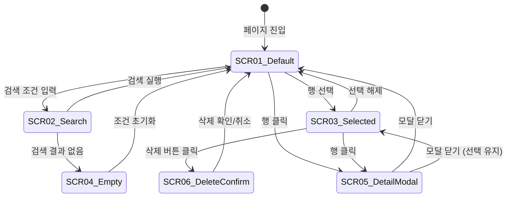

# TSK-06-07 - [샘플] 사용자 목록 화면 UI 설계

## 문서 정보

| 항목 | 내용 |
|------|------|
| Task ID | TSK-06-07 |
| 문서 버전 | 1.0 |
| 작성일 | 2026-01-21 |
| 상태 | 작성중 |
| 카테고리 | development |
| Domain | frontend |

---

## 1. 화면 목록

| 화면 ID | 화면명 | 목적 | SVG 참조 |
|---------|--------|------|----------|
| SCR-01 | 사용자 목록 (기본) | 전체 사용자 목록 조회 | `ui-assets/screen-01-user-list-default.svg` |
| SCR-02 | 사용자 목록 (검색) | 검색 조건 입력 상태 | `ui-assets/screen-02-user-list-search.svg` |
| SCR-03 | 사용자 목록 (선택) | 행 선택 상태 | `ui-assets/screen-03-user-list-selected.svg` |
| SCR-04 | 사용자 목록 (Empty) | 검색 결과 없음 | `ui-assets/screen-04-user-list-empty.svg` |
| SCR-05 | 사용자 상세 모달 | 사용자 상세 정보 표시 | `ui-assets/screen-05-user-detail-modal.svg` |
| SCR-06 | 삭제 확인 다이얼로그 | 삭제 전 확인 | `ui-assets/screen-06-delete-confirm.svg` |

---

## 2. 화면 전환 흐름

### 2.1 화면 전환 다이어그램



### 2.2 액션-화면 매트릭스

| 현재 화면 | 사용자 액션 | 결과 화면 |
|----------|-----------|----------|
| SCR-01 Default | 검색 조건 입력 | SCR-02 Search |
| SCR-02 Search | 검색 버튼 클릭 | SCR-01 Default (필터링) |
| SCR-02 Search | 초기화 버튼 클릭 | SCR-01 Default |
| SCR-01/02 | 결과 0건 | SCR-04 Empty |
| SCR-04 Empty | 조건 초기화 클릭 | SCR-01 Default |
| SCR-01 Default | 체크박스 클릭 | SCR-03 Selected |
| SCR-03 Selected | 체크박스 해제 | SCR-01 Default |
| SCR-03 Selected | 삭제 버튼 클릭 | SCR-06 Delete Confirm |
| SCR-06 Confirm | 확인/취소 클릭 | SCR-01 Default |
| SCR-01/03 | 행 클릭 | SCR-05 Detail Modal |
| SCR-05 Modal | 닫기 클릭 | 이전 화면 |

---

## 3. 화면별 상세

### 3.1 SCR-01: 사용자 목록 (기본)

**화면 목적:**
전체 사용자 목록을 조회하는 기본 화면. ListTemplate을 사용한 표준 레이아웃.

**레이아웃:**
```
┌─────────────────────────────────────────────────────────────────────────────────┐
│  검색 조건 영역 (Card)                                                          │
│  ┌─────────────────────────────────────────────────────────────────────────────┐│
│  │  이름: [         ]  이메일: [         ]  상태: [전체     ▼]                 ││
│  │                                                                             ││
│  │                                                    [초기화]  [🔍 검색]      ││
│  └─────────────────────────────────────────────────────────────────────────────┘│
│                                                                                 │
│  ┌─────────────────────────────────────────────────────────────────────────────┐│
│  │  [🗑️ 삭제]                                          0건 선택됨 │ 총 25건    ││
│  │─────────────────────────────────────────────────────────────────────────────││
│  │  ☐ │ 이름    │ 이메일              │ 상태   │ 역할   │ 생성일              ││
│  │────┼─────────┼─────────────────────┼────────┼────────┼─────────────────────││
│  │  ☐ │ 홍길동  │ hong@company.com    │ 🟢활성 │ 관리자 │ 2026-01-15          ││
│  │  ☐ │ 김영희  │ kim@company.com     │ 🟢활성 │ 사용자 │ 2026-01-14          ││
│  │  ☐ │ 이철수  │ lee@company.com     │ 🔴비활 │ 사용자 │ 2026-01-13          ││
│  │  ☐ │ 박민수  │ park@company.com    │ 🟡대기 │ 사용자 │ 2026-01-12          ││
│  │  ☐ │ 정지영  │ jung@company.com    │ 🟢활성 │ 매니저 │ 2026-01-11          ││
│  │─────────────────────────────────────────────────────────────────────────────││
│  │  총 25건              │ [10 ▼] 건/페이지    [<] 1 2 3 [>]                   ││
│  └─────────────────────────────────────────────────────────────────────────────┘│
└─────────────────────────────────────────────────────────────────────────────────┘
```

**컴포넌트 목록:**

| 컴포넌트 | Ant Design | Props/설정 |
|----------|------------|-----------|
| 검색 Card | Card | bordered, bodyStyle |
| 이름 Input | Input | placeholder="이름 검색..." |
| 이메일 Input | Input | placeholder="이메일 검색..." |
| 상태 Select | Select | options: 전체/활성/비활성/대기 |
| 초기화 버튼 | Button | type="default" |
| 검색 버튼 | Button | type="primary", icon=SearchOutlined |
| 삭제 버튼 | Button | type="primary", danger, disabled (선택 없을 때) |
| 테이블 | DataTable (TSK-05-04) | rowSelection, pagination |
| 상태 태그 | Tag | color: green/red/orange |

**상태 관리:**

| 상태 | 타입 | 초기값 | 설명 |
|------|------|--------|------|
| users | User[] | [] | 전체 사용자 목록 |
| filteredUsers | User[] | [] | 필터링된 목록 |
| selectedRowKeys | string[] | [] | 선택된 행 키 |
| loading | boolean | false | 로딩 상태 |
| searchParams | object | {} | 검색 조건 |
| pagination | object | { current: 1, pageSize: 10 } | 페이지네이션 |

**액션:**

| 액션 | 트리거 | 결과 |
|------|--------|------|
| 검색 | 검색 버튼 클릭, Enter | 필터링된 목록 표시 |
| 초기화 | 초기화 버튼 클릭 | 검색 조건 리셋, 전체 목록 |
| 정렬 | 컬럼 헤더 클릭 | 정렬 적용 |
| 페이지 이동 | 페이지 번호 클릭 | 해당 페이지 표시 |
| 행 선택 | 체크박스 클릭 | selectedRowKeys 업데이트 |
| 행 클릭 | 테이블 행 클릭 | 상세 모달 표시 |

---

### 3.2 SCR-03: 사용자 목록 (선택)

**화면 목적:**
사용자가 1개 이상의 행을 선택한 상태. 삭제 버튼 활성화, 선택 건수 표시.

**상태 변화:**
- 삭제 버튼: disabled → enabled
- 선택 건수: "0건 선택됨" → "N건 선택됨"
- 선택된 행: 배경색 하이라이트

**레이아웃 변화:**
```
│  [🗑️ 삭제]                                          2건 선택됨 │ 총 25건    │
│─────────────────────────────────────────────────────────────────────────────│
│  ☑ │ 홍길동  │ hong@company.com    │ 🟢활성 │ 관리자 │ 2026-01-15 │ ← 선택됨 |
│  ☑ │ 김영희  │ kim@company.com     │ 🟢활성 │ 사용자 │ 2026-01-14 │ ← 선택됨 |
│  ☐ │ 이철수  │ lee@company.com     │ 🔴비활 │ 사용자 │ 2026-01-13 │
```

---

### 3.3 SCR-04: 사용자 목록 (Empty)

**화면 목적:**
검색 결과가 없을 때 Empty State 표시.

**레이아웃:**
```
┌─────────────────────────────────────────────────────────────────────────────────┐
│  (검색 조건 영역 - 동일)                                                        │
│                                                                                 │
│  ┌─────────────────────────────────────────────────────────────────────────────┐│
│  │                                                                             ││
│  │                              📋                                             ││
│  │                                                                             ││
│  │                      검색 결과가 없습니다                                    ││
│  │              검색 조건을 변경하거나 필터를 초기화해보세요                     ││
│  │                                                                             ││
│  │                        [조건 초기화]                                        ││
│  │                                                                             ││
│  └─────────────────────────────────────────────────────────────────────────────┘│
└─────────────────────────────────────────────────────────────────────────────────┘
```

**컴포넌트:**
- Empty: Ant Design Empty 컴포넌트
- 조건 초기화 버튼: Button, type="primary", onClick=handleReset

---

### 3.4 SCR-05: 사용자 상세 모달

**화면 목적:**
선택한 사용자의 상세 정보를 모달로 표시.

**레이아웃:**
```
┌─────────────────────────────────────────────────────┐
│                 사용자 상세 정보                [×] │
├─────────────────────────────────────────────────────┤
│                                                     │
│   ┌────────────────────────────────────────────┐   │
│   │              [👤 아바타]                    │   │
│   │              홍길동                         │   │
│   │          hong@company.com                   │   │
│   └────────────────────────────────────────────┘   │
│                                                     │
│   ┌────────────────────────────────────────────┐   │
│   │  상태          │  🟢 활성                   │   │
│   ├────────────────┼───────────────────────────┤   │
│   │  역할          │  관리자 (ADMIN)            │   │
│   ├────────────────┼───────────────────────────┤   │
│   │  부서          │  시스템관리팀              │   │
│   ├────────────────┼───────────────────────────┤   │
│   │  연락처        │  010-1234-5678            │   │
│   ├────────────────┼───────────────────────────┤   │
│   │  생성일        │  2026-01-15               │   │
│   ├────────────────┼───────────────────────────┤   │
│   │  최근 로그인   │  2026-01-21 14:30         │   │
│   └────────────────┴───────────────────────────┘   │
│                                                     │
│                                        [닫기]      │
└─────────────────────────────────────────────────────┘
```

**컴포넌트:**

| 컴포넌트 | Ant Design | Props/설정 |
|----------|------------|-----------|
| 모달 | Modal | width=480, centered |
| 아바타 | Avatar | size=64, icon=UserOutlined |
| 정보 목록 | Descriptions | column=1, bordered |
| 상태 태그 | Tag | color: green/red/orange |
| 닫기 버튼 | Button | type="primary" |

**Props:**

```typescript
interface UserDetailModalProps {
  open: boolean;
  user: User | null;
  onClose: () => void;
}
```

---

### 3.5 SCR-06: 삭제 확인 다이얼로그

**화면 목적:**
삭제 전 사용자에게 확인을 요청하는 다이얼로그.

**레이아웃:**
```
┌─────────────────────────────────────────────────────┐
│  ⚠️  삭제 확인                                      │
├─────────────────────────────────────────────────────┤
│                                                     │
│     2명의 사용자를 삭제하시겠습니까?                 │
│                                                     │
│     이 작업은 되돌릴 수 없습니다.                    │
│                                                     │
│                              [취소]  [삭제]         │
└─────────────────────────────────────────────────────┘
```

**컴포넌트:**
- Modal.confirm: Ant Design 확인 다이얼로그
- title: "삭제 확인"
- icon: ExclamationCircleOutlined
- content: "N명의 사용자를 삭제하시겠습니까?"
- okText: "삭제"
- okType: "danger"
- cancelText: "취소"

---

## 4. 공통 컴포넌트

### 4.1 StatusTag (상태 태그)

**용도:** 사용자 상태를 색상별 태그로 표시

**Props:**
```typescript
interface StatusTagProps {
  status: 'active' | 'inactive' | 'pending';
}
```

**상태별 스타일:**

| 상태 | 라벨 | 색상 | Ant Design color |
|------|------|------|------------------|
| active | 활성 | 녹색 | success |
| inactive | 비활성 | 빨간색 | error |
| pending | 대기 | 노란색 | warning |

### 4.2 UserAvatar (사용자 아바타)

**용도:** 사용자 프로필 이미지 또는 이니셜 표시

**Props:**
```typescript
interface UserAvatarProps {
  name: string;
  size?: 'small' | 'default' | 'large' | number;
}
```

---

## 5. 반응형 설계

### 5.1 Breakpoint 정의

| Breakpoint | 화면 너비 | 검색 조건 | 테이블 |
|------------|----------|----------|--------|
| XL | 1600px+ | 3열 | 전체 컬럼 |
| LG | 1200-1599px | 3열 | 전체 컬럼 |
| MD | 992-1199px | 2열 | 이메일 컬럼 숨김 |
| SM | 768-991px | 2열 | 이메일, 생성일 숨김 |
| XS | 767px- | 1열 | 가로 스크롤 |

### 5.2 검색 조건 반응형

```typescript
const responsiveSpan = {
  xs: 24,  // 1열
  sm: 12,  // 2열
  md: 8,   // 3열
  lg: 8,   // 3열
  xl: 8,   // 3열
};
```

### 5.3 테이블 반응형

| 컬럼 | XL/LG | MD | SM | XS |
|------|-------|----|----|-----|
| 선택 | ✓ | ✓ | ✓ | ✓ |
| 이름 | ✓ | ✓ | ✓ | ✓ |
| 이메일 | ✓ | - | - | ✓ (스크롤) |
| 상태 | ✓ | ✓ | ✓ | ✓ |
| 역할 | ✓ | ✓ | ✓ | ✓ |
| 생성일 | ✓ | ✓ | - | ✓ (스크롤) |

---

## 6. 접근성

### 6.1 키보드 네비게이션

| 키 | 동작 | 컨텍스트 |
|----|------|---------|
| Tab | 다음 요소로 이동 | 전체 |
| Shift+Tab | 이전 요소로 이동 | 전체 |
| Enter | 검색 실행 | 검색 폼 |
| Enter | 버튼 클릭 | 버튼 포커스 |
| Space | 체크박스 토글 | 체크박스 포커스 |
| Escape | 모달 닫기 | 모달 열림 상태 |
| Arrow Up/Down | 셀렉트 옵션 이동 | 셀렉트 열림 |

### 6.2 ARIA 레이블

| 요소 | aria-label |
|------|------------|
| 이름 검색 | "이름으로 검색" |
| 이메일 검색 | "이메일로 검색" |
| 상태 필터 | "상태로 필터링" |
| 검색 버튼 | "검색" |
| 초기화 버튼 | "검색 조건 초기화" |
| 삭제 버튼 | "선택한 항목 삭제" |
| 테이블 | "사용자 목록" |

### 6.3 색상 대비

- 텍스트/배경: WCAG AA 기준 충족 (4.5:1 이상)
- 상태 태그: 색상뿐 아니라 텍스트로도 상태 표시
- 선택된 행: 배경색 + 체크 아이콘으로 구분

---

## 7. SVG 파일 목록

| 파일명 | 화면 | 상태 |
|--------|------|------|
| `screen-01-user-list-default.svg` | 사용자 목록 기본 | 생성됨 |
| `screen-02-user-list-search.svg` | 검색 조건 입력 | 생성됨 |
| `screen-03-user-list-selected.svg` | 행 선택 상태 | 생성됨 |
| `screen-04-user-list-empty.svg` | Empty State | 생성됨 |
| `screen-05-user-detail-modal.svg` | 상세 모달 | 생성됨 |
| `screen-06-delete-confirm.svg` | 삭제 확인 | 생성됨 |

---

## 변경 이력

| 버전 | 일자 | 작성자 | 변경 내용 |
|------|------|--------|----------|
| 1.0 | 2026-01-21 | Claude | 최초 작성 |
