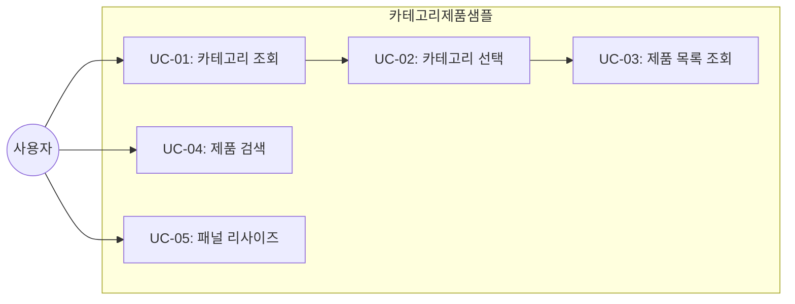
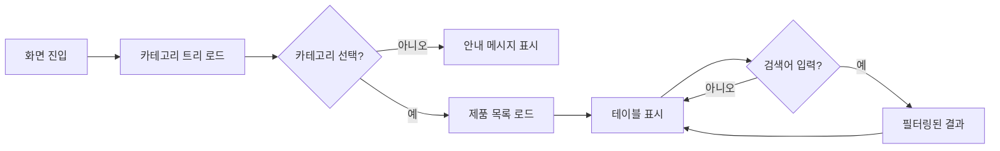
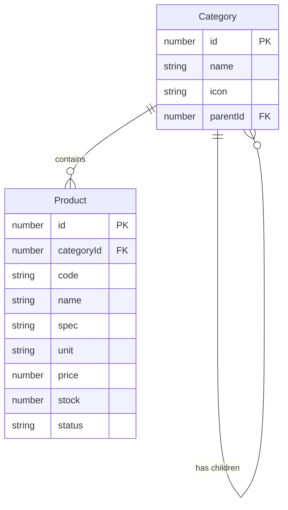

# TSK-06-08 - [샘플] 카테고리-제품 마스터-디테일 설계 문서

## 문서 정보

| 항목 | 내용 |
|------|------|
| Task ID | TSK-06-08 |
| 문서 버전 | 1.0 |
| 작성일 | 2026-01-21 |
| 상태 | 작성중 |
| 카테고리 | development |

---

## 1. 개요

### 1.1 배경 및 문제 정의

**현재 상황:**
- TSK-06-04에서 마스터-디테일 화면 템플릿(MasterDetailTemplate)이 설계됨
- 템플릿의 기능 검증을 위한 실제 샘플 화면이 필요함
- 카테고리-제품 관계는 제조 현장에서 흔히 사용되는 마스터-디테일 패턴의 대표적 사례임

**해결하려는 문제:**
- MasterDetailTemplate의 기능 및 사용성 검증
- 트리 구조 마스터 영역과 테이블 디테일 영역의 연동 패턴 확인
- 분할 패널 리사이즈 기능 검증

### 1.2 목적 및 기대 효과

**목적:**
- MasterDetailTemplate을 활용한 샘플 화면 구현
- 카테고리 선택에 따른 제품 목록 조회 기능 구현
- 마스터-디테일 패턴의 실제 사용 예시 제공

**기대 효과:**
- 템플릿 기능 검증 완료
- 개발자를 위한 템플릿 사용 가이드 역할
- 유사 화면 개발 시 참조 가능한 샘플 코드 제공

### 1.3 범위

**포함:**
- 카테고리-제품 마스터-디테일 샘플 화면 구현
- 카테고리 트리 컴포넌트 (마스터 영역)
- 제품 목록 테이블 (디테일 영역)
- 분할 패널 리사이즈 기능
- Mock 데이터 연동 (categories-products.json)

**제외:**
- 제품 CRUD 기능 (조회만 지원)
- 카테고리 관리 기능
- 서버 API 연동 (Mock 데이터만 사용)

### 1.4 참조 문서

| 문서 | 경로 | 관련 섹션 |
|------|------|----------|
| PRD | `.orchay/projects/mes-portal/prd.md` | 4.1.1 카테고리-제품 샘플 |
| TRD | `.orchay/projects/mes-portal/trd.md` | react-split-pane, Ant Design |
| MasterDetailTemplate 설계 | `tasks/TSK-06-04/010-design.md` | 전체 |
| Mock 데이터 | `mock-data/categories-products.json` | 전체 |

---

## 2. 사용자 분석

### 2.1 대상 사용자

| 사용자 유형 | 특성 | 주요 니즈 |
|------------|------|----------|
| 프론트엔드 개발자 | MasterDetailTemplate 사용자 | 템플릿 사용법 이해, 코드 참조 |
| UI/UX 설계자 | 화면 패턴 검증 | 마스터-디테일 UX 확인 |
| QA 엔지니어 | 기능 테스트 | 템플릿 동작 검증 |

### 2.2 사용자 페르소나

**페르소나 1: 프론트엔드 개발자 (김개발)**
- 역할: MES 포털 화면 개발 담당
- 목표: MasterDetailTemplate을 활용한 화면 개발
- 불만: 템플릿 사용법을 문서만으로 이해하기 어려움
- 시나리오: 샘플 화면 코드를 참조하여 유사 화면 개발

---

## 3. 유즈케이스

### 3.1 유즈케이스 다이어그램



### 3.2 유즈케이스 상세

#### UC-01: 카테고리 조회

| 항목 | 내용 |
|------|------|
| 액터 | 일반 사용자 |
| 목적 | 전체 카테고리 목록 확인 |
| 사전 조건 | 화면 진입 |
| 사후 조건 | 카테고리 트리 표시 |
| 트리거 | 화면 로드 |

**기본 흐름:**
1. 사용자가 화면에 진입한다
2. 시스템이 categories-products.json에서 카테고리 데이터를 로드한다
3. 시스템이 좌측 마스터 영역에 카테고리 트리를 표시한다

#### UC-02: 카테고리 선택

| 항목 | 내용 |
|------|------|
| 액터 | 일반 사용자 |
| 목적 | 특정 카테고리의 제품 조회 |
| 사전 조건 | 카테고리 트리 표시됨 |
| 사후 조건 | 카테고리 선택 상태, 디테일 영역에 제품 목록 |
| 트리거 | 카테고리 항목 클릭 |

**기본 흐름:**
1. 사용자가 카테고리 항목을 클릭한다
2. 시스템이 선택된 카테고리를 하이라이트한다
3. 시스템이 해당 카테고리의 제품 목록을 필터링한다
4. 시스템이 우측 디테일 영역에 제품 테이블을 표시한다

**대안 흐름:**
- 2a. 상위 카테고리 선택 시:
  - 시스템이 하위 카테고리의 모든 제품을 표시한다

#### UC-03: 제품 목록 조회

| 항목 | 내용 |
|------|------|
| 액터 | 일반 사용자 |
| 목적 | 선택된 카테고리의 제품 목록 확인 |
| 사전 조건 | 카테고리 선택됨 |
| 사후 조건 | 제품 테이블 표시 |
| 트리거 | 카테고리 선택 완료 |

**기본 흐름:**
1. 시스템이 선택된 카테고리 ID로 제품을 필터링한다
2. 시스템이 테이블에 제품 목록을 표시한다 (코드, 이름, 규격, 단위, 가격, 재고, 상태)
3. 사용자가 테이블을 스크롤하거나 페이징한다

#### UC-04: 제품 검색

| 항목 | 내용 |
|------|------|
| 액터 | 일반 사용자 |
| 목적 | 제품 목록 내 특정 제품 검색 |
| 사전 조건 | 제품 목록 표시됨 |
| 사후 조건 | 검색 조건에 맞는 제품만 표시 |
| 트리거 | 검색어 입력 |

**기본 흐름:**
1. 사용자가 디테일 영역 검색창에 검색어를 입력한다
2. 시스템이 제품 코드, 이름에서 검색어를 포함하는 항목을 필터링한다
3. 시스템이 필터링된 결과를 테이블에 표시한다

#### UC-05: 패널 리사이즈

| 항목 | 내용 |
|------|------|
| 액터 | 일반 사용자 |
| 목적 | 마스터/디테일 영역 크기 조절 |
| 사전 조건 | 화면 표시됨 |
| 사후 조건 | 패널 크기 변경됨 |
| 트리거 | 분할 경계 드래그 |

**기본 흐름:**
1. 사용자가 분할 경계(Splitter)를 드래그한다
2. 시스템이 실시간으로 패널 크기를 조절한다
3. 사용자가 드래그를 놓으면 크기가 고정된다

**예외 흐름:**
- 1a. 최소 너비 도달 시:
  - 시스템이 더 이상 줄어들지 않도록 제한한다

---

## 4. 사용자 시나리오

### 4.1 시나리오 1: 카테고리별 제품 조회

**상황 설명:**
개발자가 마스터-디테일 템플릿 기능을 검증하기 위해 카테고리를 선택하고 해당 제품 목록을 확인한다.

**단계별 진행:**

| 단계 | 사용자 행동 | 시스템 반응 | 사용자 기대 |
|------|-----------|------------|------------|
| 1 | 화면 진입 | 카테고리 트리 로드, 디테일 안내 메시지 | 트리 구조 표시 |
| 2 | "전자부품" 폴더 펼침 | 하위 카테고리 표시 | 애니메이션 효과 |
| 3 | "반도체" 카테고리 클릭 | 선택 강조, 제품 목록 로드 | 즉시 반응 |
| 4 | 제품 목록 확인 | 테이블에 2개 제품 표시 | 정렬/페이징 가능 |
| 5 | 패널 경계 드래그 | 실시간 크기 조절 | 부드러운 리사이즈 |
| 6 | "기계부품" 카테고리 클릭 | 디테일 갱신 | 빠른 전환 |

**성공 조건:**
- 카테고리 선택에 따라 제품 목록이 정확히 필터링됨
- 패널 리사이즈가 부드럽게 동작함
- 테이블 정렬/페이징이 정상 동작함

### 4.2 시나리오 2: 제품 검색

**상황 설명:**
특정 카테고리 내에서 제품명으로 검색하여 원하는 제품을 찾는다.

**단계별 진행:**

| 단계 | 사용자 행동 | 시스템 반응 | 사용자 기대 |
|------|-----------|------------|------------|
| 1 | "전자부품" 카테고리 선택 | 모든 전자부품 제품 표시 | 하위 카테고리 제품 포함 |
| 2 | 검색창에 "USB" 입력 | 실시간 필터링 | 결과 즉시 반영 |
| 3 | 검색 결과 확인 | USB 관련 제품만 표시 | 2개 결과 표시 |
| 4 | 검색어 삭제 | 전체 목록 복원 | 원래 목록 표시 |

**성공 조건:**
- 검색어 입력 시 실시간 필터링
- 검색어 삭제 시 전체 목록 복원

### 4.3 시나리오 3: 제품 없는 카테고리 선택

**상황 설명:**
제품이 등록되지 않은 카테고리를 선택했을 때의 처리를 확인한다.

**단계별 진행:**

| 단계 | 사용자 행동 | 시스템 반응 | 복구 방법 |
|------|-----------|------------|----------|
| 1 | 제품이 없는 카테고리 클릭 | 빈 테이블 + 안내 메시지 | 다른 카테고리 선택 |

---

## 5. 화면 설계

### 5.1 화면 흐름도



### 5.2 화면별 상세

#### 화면 1: 카테고리-제품 마스터-디테일

**화면 목적:**
마스터-디테일 템플릿의 기능 검증을 위한 샘플 화면. 좌측 카테고리 트리에서 선택 시 우측에 해당 제품 목록을 표시한다.

**진입 경로:**
- 사이드바 메뉴: 샘플 > 카테고리-제품

**와이어프레임:**
```
┌─────────────────────────────────────────────────────────────────────────────┐
│                                                                              │
│  ┌───────────────────────┬─┬──────────────────────────────────────────────┐ │
│  │  카테고리              │↔│  제품 목록                                    │ │
│  │                       │ │                                               │ │
│  │  ┌─────────────────┐  │ │  선택된 카테고리: 반도체                       │ │
│  │  │ 🔍 검색...      │  │ │                                               │ │
│  │  └─────────────────┘  │ │  ┌─────────────────────────────────────────┐  │ │
│  │                       │ │  │ 🔍 검색...              [상태 v] [정렬 v]│  │ │
│  │  📂 전자부품          │ │  └─────────────────────────────────────────┘  │ │
│  │    ├─ 📁 반도체 ●     │ │                                               │ │
│  │    ├─ 📁 커넥터       │ │  ┌───────┬─────────────┬────────┬────┬──────┐ │ │
│  │    └─ 📁 PCB          │ │  │ 코드  │ 제품명       │ 규격   │단위│ 가격 │ │ │
│  │  📂 기계부품          │ │  ├───────┼─────────────┼────────┼────┼──────┤ │ │
│  │    ├─ 📁 베어링       │ │  │SC-001 │메모리칩 8GB │DDR4-32 │EA  │15,000│ │ │
│  │    ├─ 📁 기어         │ │  │SC-002 │메모리칩 16GB│DDR4-32 │EA  │28,000│ │ │
│  │    └─ 📁 샤프트       │ │  └───────┴─────────────┴────────┴────┴──────┘ │ │
│  │  📂 포장재            │ │                                               │ │
│  │    ├─ 📁 박스         │ │  총 2건 | 1-2 of 2                            │ │
│  │    └─ 📁 완충재       │ │                                               │ │
│  │                       │ │                                               │ │
│  └───────────────────────┴─┴──────────────────────────────────────────────┘ │
│                                                                              │
└─────────────────────────────────────────────────────────────────────────────┘

● = 현재 선택된 카테고리
↔ = 드래그 가능한 분할 경계
```

**화면 요소 설명:**

| 영역 | 설명 | 사용자 인터랙션 |
|------|------|----------------|
| 마스터 헤더 | "카테고리" 타이틀 | - |
| 카테고리 검색 | 카테고리 필터링 | 텍스트 입력 |
| 카테고리 트리 | 계층형 카테고리 목록 | 펼침/접힘, 선택 |
| 분할 경계 | 리사이즈 핸들 | 드래그 |
| 디테일 헤더 | 선택된 카테고리명 표시 | - |
| 제품 검색 | 제품 필터링 | 텍스트 입력 |
| 제품 테이블 | 제품 목록 그리드 | 정렬, 페이징 |

**사용자 행동 시나리오:**
1. 사용자가 화면에 진입하면 카테고리 트리가 표시된다
2. 카테고리 폴더를 클릭하면 펼침/접힘이 토글된다
3. 하위 카테고리를 클릭하면 우측에 제품 목록이 표시된다
4. 분할 경계를 드래그하면 패널 크기가 조절된다
5. 제품 검색창에 입력하면 목록이 필터링된다

### 5.3 상태별 화면

#### 초기 상태 (카테고리 미선택)

```
┌───────────────────────┬─┬──────────────────────────────────────────────┐
│  카테고리              │↔│                                               │
│                       │ │                                               │
│  📂 전자부품          │ │     ┌─────────────────────────────────┐      │
│    ├─ 📁 반도체       │ │     │                                 │      │
│    ├─ 📁 커넥터       │ │     │    📋 카테고리를 선택하세요      │      │
│    └─ 📁 PCB          │ │     │                                 │      │
│  📂 기계부품          │ │     │    좌측에서 카테고리를 선택하면  │      │
│    ...                │ │     │    제품 목록이 표시됩니다.       │      │
│                       │ │     │                                 │      │
│                       │ │     └─────────────────────────────────┘      │
└───────────────────────┴─┴──────────────────────────────────────────────┘
```

#### 제품 로딩 중

```
┌──────────────────────────────────────────────┐
│  제품 목록                                    │
│                                               │
│  선택된 카테고리: 반도체                       │
│                                               │
│  ┌─────────────────────────────────────────┐ │
│  │ ████████████████████████████████████████│ │
│  │ ████████████████████████████████████████│ │
│  │ ████████████████████████████████████████│ │
│  └─────────────────────────────────────────┘ │
│                                               │
│       로딩 중...                              │
└──────────────────────────────────────────────┘
```

#### 제품 없음

```
┌──────────────────────────────────────────────┐
│  제품 목록                                    │
│                                               │
│  선택된 카테고리: 신규 카테고리                │
│                                               │
│     ┌─────────────────────────────────┐      │
│     │                                 │      │
│     │    📦 등록된 제품이 없습니다     │      │
│     │                                 │      │
│     └─────────────────────────────────┘      │
│                                               │
└──────────────────────────────────────────────┘
```

### 5.4 반응형 동작

| 화면 크기 | 레이아웃 변화 | 사용자 경험 |
|----------|--------------|------------|
| 데스크톱 (1024px+) | 좌우 분할 (30:70) | 마스터-디테일 동시 표시 |
| 태블릿 (768-1023px) | 좌우 분할 (35:65) | 패널 비율 조정 |
| 모바일 (767px-) | 상하 분할 또는 탭 전환 | 마스터/디테일 전환 |

---

## 6. 인터랙션 설계

### 6.1 사용자 액션과 피드백

| 사용자 액션 | 즉각 피드백 | 결과 피드백 | 에러 피드백 |
|------------|-----------|------------|------------|
| 카테고리 클릭 | 선택 하이라이트 | 제품 목록 표시 | - |
| 카테고리 펼침/접힘 | 화살표 회전, 애니메이션 | 하위 항목 표시/숨김 | - |
| 패널 드래그 | 실시간 크기 변경 | 크기 고정 | 최소 크기 제한 |
| 제품 검색 입력 | 입력 반영 | 필터링 결과 | 결과 없음 표시 |
| 테이블 정렬 클릭 | 정렬 아이콘 변경 | 데이터 정렬 | - |
| 페이지 전환 | 페이지 번호 강조 | 데이터 로드 | - |

### 6.2 상태별 화면 변화

| 상태 | 화면 표시 | 사용자 안내 |
|------|----------|------------|
| 초기 (미선택) | 마스터 트리 + 디테일 안내 | "카테고리를 선택하세요" |
| 카테고리 선택됨 | 마스터 트리 + 제품 테이블 | 선택된 카테고리명 표시 |
| 제품 로딩 중 | 디테일 영역 Skeleton | 로딩 인디케이터 |
| 제품 없음 | Empty 컴포넌트 | "등록된 제품이 없습니다" |
| 검색 결과 없음 | Empty 컴포넌트 | "검색 결과가 없습니다" |

### 6.3 키보드/접근성

| 기능 | 키보드 단축키 | 스크린 리더 안내 |
|------|-------------|-----------------|
| 트리 탐색 | 화살표 키 | "카테고리 트리, {카테고리명}" |
| 카테고리 선택 | Enter | "선택됨, {카테고리명}" |
| 펼침/접힘 | Space | "펼쳐짐/접힘" |
| 테이블 탐색 | Tab | "제품 테이블, {제품명}" |

---

## 7. 데이터 요구사항

### 7.1 필요한 데이터

| 데이터 | 설명 | 출처 | 용도 |
|--------|------|------|------|
| 카테고리 목록 | 계층형 카테고리 트리 | mock-data/categories-products.json | 마스터 영역 표시 |
| 제품 목록 | 제품 상세 정보 | mock-data/categories-products.json | 디테일 영역 표시 |

### 7.2 데이터 관계



**관계 설명:**
- Category는 자기 참조로 계층 구조를 형성 (parentId)
- 각 Category는 여러 Product를 가질 수 있음
- Product는 하나의 Category에만 속함 (리프 노드 카테고리)

### 7.3 데이터 인터페이스

```typescript
// 카테고리 데이터 타입
interface Category {
  id: number
  name: string
  icon: string
  parentId: number | null
  children?: Category[]
}

// 제품 데이터 타입
interface Product {
  id: number
  categoryId: number
  code: string
  name: string
  spec: string
  unit: string
  price: number
  stock: number
  status: 'active' | 'inactive'
}

// 컴포넌트 Props
interface CategoryProductScreenProps {
  // 별도 props 없음 (자체 데이터 로드)
}
```

### 7.4 데이터 유효성 규칙

| 데이터 필드 | 규칙 | 위반 시 메시지 |
|------------|------|---------------|
| 카테고리 | 최소 1개 존재 | "카테고리 데이터가 없습니다" |
| 제품 코드 | 고유값 | - (조회 전용) |
| 제품 가격 | 0 이상 | - (조회 전용) |

---

## 8. 비즈니스 규칙

### 8.1 핵심 규칙

| 규칙 ID | 규칙 설명 | 적용 상황 | 예외 |
|---------|----------|----------|------|
| BR-01 | 카테고리 미선택 시 디테일 안내 표시 | 초기 진입 시 | - |
| BR-02 | 상위 카테고리 선택 시 하위 제품 모두 표시 | 폴더 카테고리 선택 | - |
| BR-03 | 패널 최소 너비 유지 (200px) | 리사이즈 시 | - |
| BR-04 | 제품 없는 카테고리는 Empty 표시 | 제품 없음 | - |
| BR-05 | 검색은 코드, 제품명에서 수행 | 검색 입력 시 | 대소문자 무시 |

### 8.2 규칙 상세 설명

**BR-01: 카테고리 미선택 시 디테일 안내 표시**

설명: 사용자가 처음 화면에 진입했을 때 어떤 카테고리도 선택되지 않은 상태에서는 디테일 영역에 빈 테이블 대신 안내 메시지를 표시하여 사용자 행동을 유도한다.

예시:
- 화면 진입 시: "좌측에서 카테고리를 선택하면 제품 목록이 표시됩니다."

**BR-02: 상위 카테고리 선택 시 하위 제품 모두 표시**

설명: 사용자가 "전자부품"과 같은 상위 카테고리(폴더)를 선택하면 해당 카테고리 아래의 모든 하위 카테고리(반도체, 커넥터, PCB)에 속한 제품을 모두 표시한다.

예시:
- "전자부품" 선택 시: 반도체 제품 2개 + 커넥터 제품 2개 + PCB 제품 1개 = 총 5개 표시

---

## 9. 에러 처리

### 9.1 예상 에러 상황

| 상황 | 원인 | 사용자 메시지 | 복구 방법 |
|------|------|--------------|----------|
| 데이터 로딩 실패 | JSON 파일 로드 오류 | "데이터를 불러오지 못했습니다" | 재시도 버튼 |
| 빈 카테고리 | 제품 없음 | "등록된 제품이 없습니다" | 다른 카테고리 선택 |
| 검색 결과 없음 | 검색 조건 불일치 | "검색 결과가 없습니다" | 검색어 수정 또는 초기화 |

### 9.2 에러 표시 방식

| 에러 유형 | 표시 위치 | 표시 방법 |
|----------|----------|----------|
| 데이터 로딩 실패 | 해당 영역 전체 | Result 컴포넌트 + 재시도 버튼 |
| 빈 데이터 | 디테일 영역 | Empty 컴포넌트 |
| 검색 결과 없음 | 테이블 영역 | Empty 컴포넌트 + 초기화 버튼 |

---

## 10. 연관 문서

> 상세 테스트 명세 및 요구사항 추적은 별도 문서에서 관리합니다.

| 문서 | 경로 | 용도 |
|------|------|------|
| 요구사항 추적 매트릭스 | `025-traceability-matrix.md` | PRD -> 설계 -> 테스트 양방향 추적 |
| 테스트 명세서 | `026-test-specification.md` | 단위/E2E/매뉴얼 테스트 상세 정의 |

---

## 11. 구현 범위

### 11.1 영향받는 영역

| 영역 | 변경 내용 | 영향도 |
|------|----------|--------|
| screens/sample/ | CategoryProduct.tsx 신규 | 높음 |
| components/sample/ | CategoryTree.tsx 신규 (선택적) | 중간 |

### 11.2 의존성

| 의존 항목 | 이유 | 상태 |
|----------|------|------|
| TSK-06-04 MasterDetailTemplate | 화면 템플릿 | [dd] |
| Ant Design Tree | 카테고리 트리 | 라이브러리 |
| Ant Design Table | 제품 테이블 | 라이브러리 |
| mock-data/categories-products.json | 샘플 데이터 | 완료 |

### 11.3 제약 사항

| 제약 | 설명 | 대응 방안 |
|------|------|----------|
| Mock 데이터 전용 | 실제 API 없음 | JSON import로 데이터 로드 |
| 조회 기능만 | CRUD 미구현 | 추후 확장 고려 |

### 11.4 파일 구조

```
mes-portal/
├── app/
│   └── (portal)/
│       └── sample/
│           └── category-product/
│               └── page.tsx          # 라우트 페이지
├── components/
│   └── screens/
│       └── sample/
│           └── CategoryProduct.tsx   # 메인 컴포넌트
└── mock-data/
    └── categories-products.json      # Mock 데이터 (기존)
```

---

## 12. 체크리스트

### 12.1 설계 완료 확인

- [x] 문제 정의 및 목적 명확화
- [x] 사용자 분석 완료
- [x] 유즈케이스 정의 완료
- [x] 사용자 시나리오 작성 완료
- [x] 화면 설계 완료 (와이어프레임)
- [x] 인터랙션 설계 완료
- [x] 데이터 요구사항 정의 완료
- [x] 비즈니스 규칙 정의 완료
- [x] 에러 처리 정의 완료

### 12.2 연관 문서 작성

- [ ] 요구사항 추적 매트릭스 작성 (-> `025-traceability-matrix.md`)
- [ ] 테스트 명세서 작성 (-> `026-test-specification.md`)

### 12.3 구현 준비

- [x] 구현 우선순위 결정
- [x] 의존성 확인 완료
- [x] 제약 사항 검토 완료

---

## 변경 이력

| 버전 | 일자 | 작성자 | 변경 내용 |
|------|------|--------|----------|
| 1.0 | 2026-01-21 | Claude | 최초 작성 |
