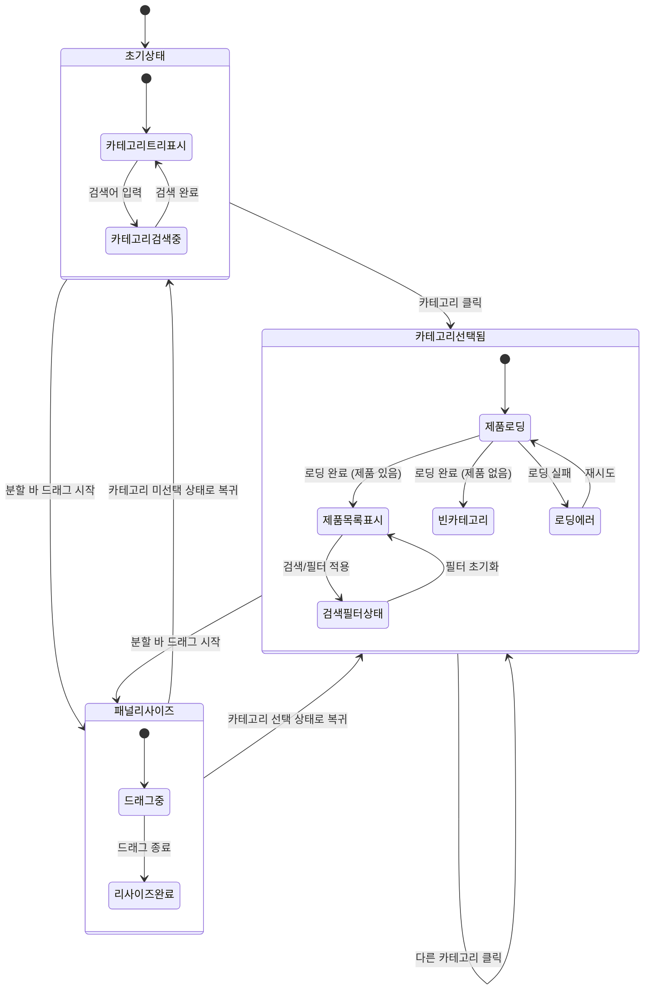

# TSK-06-08 - [샘플] 카테고리-제품 마스터-디테일 UI 설계

**Version:** 1.0 --- **Last Updated:** 2026-01-21

> **목적**: 카테고리-제품 마스터-디테일 화면의 UI 설계 및 인터랙션 정의

---

## 1. 화면 목록

| 화면 ID | 화면명 | 목적 | SVG 참조 |
|---------|--------|------|----------|
| SCR-01 | 초기 상태 (카테고리 미선택) | 카테고리 트리 표시, 제품 영역 안내 | `screen-01-initial-state.svg` |
| SCR-02 | 카테고리 선택 후 제품 로딩 | 선택 피드백, 제품 데이터 로딩 상태 | `screen-02-product-loading.svg` |
| SCR-03 | 카테고리 선택 완료 (제품 목록 표시) | 선택된 카테고리의 제품 테이블 표시 | `screen-03-product-loaded.svg` |
| SCR-04 | 제품 검색/필터링 상태 | 제품 목록 내 검색 및 필터 적용 | `screen-04-product-search.svg` |
| SCR-05 | 빈 카테고리 (제품 없음) | 선택된 카테고리에 제품이 없는 상태 | `screen-05-empty-category.svg` |

---

## 2. 화면 전환 흐름

### 2.1 상태 다이어그램



### 2.2 액션-화면 매트릭스

| 액션 | 현재 상태 | 결과 상태 | 트리거 |
|------|----------|----------|--------|
| 카테고리 클릭 | 초기 상태 | 제품 로딩 | 사용자 |
| 카테고리 클릭 | 제품 표시 중 | 새 제품 로딩 | 사용자 |
| 제품 로딩 완료 | 제품 로딩 | 제품 목록 표시 | 시스템 |
| 제품 로딩 완료 (0건) | 제품 로딩 | 빈 카테고리 | 시스템 |
| 검색어 입력 | 제품 목록 표시 | 검색 필터 상태 | 사용자 |
| 필터 적용 | 제품 목록 표시 | 검색 필터 상태 | 사용자 |
| 검색/필터 초기화 | 검색 필터 상태 | 제품 목록 표시 | 사용자 |
| 분할 바 드래그 시작 | 모든 상태 | 패널 리사이즈 | 사용자 |
| 분할 바 드래그 종료 | 패널 리사이즈 | 이전 상태 | 사용자 |

---

## 3. 화면별 상세

### 3.1 SCR-01: 초기 상태 (카테고리 미선택)

**화면 목적**: 카테고리 트리를 표시하고 사용자에게 카테고리 선택을 안내

**레이아웃 구조**:
```
+-------------------------------------------------------------------------+
|                                                                          |
|  +------------------------+---+----------------------------------------+|
|  |  카테고리 영역 (300px)  | ^ |  제품 영역 (나머지)                     ||
|  |                        | | |                                         ||
|  |  [카테고리 검색...]     | | |  +-----------------------------------+  ||
|  |  +------------------+  | | |  |                                   |  ||
|  |  | > 전자제품        |  | | |  |                                   |  ||
|  |  |   > 스마트폰      |  | | |  |                                   |  ||
|  |  |   > 노트북        |  | | |  |   카테고리를 선택하세요            |  ||
|  |  |   > 태블릿        |  | | |  |                                   |  ||
|  |  | > 가전            |  | | |  |   좌측 카테고리 목록에서           |  ||
|  |  |   > TV            |  | | |  |   카테고리를 선택하면              |  ||
|  |  |   > 냉장고        |  | | |  |   해당 제품 목록이 표시됩니다.      |  ||
|  |  | > 가구            |  | | |  |                                   |  ||
|  |  |   > 침대          |  | | |  |                                   |  ||
|  |  |   > 소파          |  | | |  +-----------------------------------+  ||
|  |  +------------------+  | | |                                         ||
|  |                        | | |                                         ||
|  +------------------------+---+----------------------------------------+|
|                                                                          |
+-------------------------------------------------------------------------+

^| = 드래그 가능한 분할 바 (4px, 호버 시 강조)
```

**컴포넌트 구성**:

| 영역 | 컴포넌트 | Props | 비고 |
|------|----------|-------|------|
| 컨테이너 | `Splitter` | `layout="horizontal"` | Ant Design Splitter |
| 카테고리 패널 | `Splitter.Panel` | `min={200}, collapsible` | 좌측 패널 |
| 분할 바 | `Splitter` | `lazy` | 드래그 리사이즈 |
| 제품 패널 | `Splitter.Panel` | `min={300}` | 우측 패널 |
| 검색창 | `Input.Search` | `placeholder="카테고리 검색..."` | 트리 필터 |
| 카테고리 트리 | `Tree` | `selectedKeys, onSelect, expandedKeys` | 계층 구조 |
| 빈 상태 안내 | `Empty` | `description="카테고리를 선택하세요"` | 제품 초기 |

**상태 관리**:
- `selectedCategory: null`
- `categoryTree: TreeNode[]` (mock-data/categories-products.json)
- `searchKeyword: ''`
- `expandedKeys: string[]`
- `splitSize: [30, 70]` (퍼센트)

**스타일 토큰**:

| 요소 | CSS Variable | 값 |
|------|-------------|-----|
| 카테고리 패널 기본 너비 | `--category-panel-default` | 300px (30%) |
| 카테고리 패널 최소 너비 | `--category-panel-min` | 200px |
| 제품 패널 최소 너비 | `--product-panel-min` | 300px |
| 분할 바 너비 | `--splitter-size` | 4px |
| 분할 바 호버 색상 | `--splitter-hover-color` | token.colorPrimary |

---

### 3.2 SCR-02: 카테고리 선택 후 제품 로딩

**화면 목적**: 카테고리 선택 시 제품 데이터 로딩 상태 표시

**레이아웃 구조**:
```
+-------------------------------------------------------------------------+
|                                                                          |
|  +------------------------+---+----------------------------------------+|
|  |  카테고리 영역          | ^ |  제품 영역                              ||
|  |                        | | |                                         ||
|  |  [카테고리 검색...]     | | |  전자제품 > 스마트폰                    ||
|  |  +------------------+  | | |                                         ||
|  |  | > 전자제품        |  | | |  +-----------------------------------+  ||
|  |  |   > 스마트폰  <<< |  | | |  | ################################# |  ||
|  |  |   > 노트북        |  | | |  | ################################# |  ||
|  |  |   > 태블릿        |  | | |  | ################################# |  ||
|  |  | > 가전            |  | | |  |                                   |  ||
|  |  |   > TV            |  | | |  |       Skeleton Loading            |  ||
|  |  |   > 냉장고        |  | | |  |                                   |  ||
|  |  | > 가구            |  | | |  | ################################# |  ||
|  |  |   > 침대          |  | | |  | ################################# |  ||
|  |  |   > 소파          |  | | |  +-----------------------------------+  ||
|  |  +------------------+  | | |                                         ||
|  |                        | | |                                         ||
|  +------------------------+---+----------------------------------------+|
|                                                                          |
+-------------------------------------------------------------------------+

<<< = 선택된 카테고리 (Primary 배경색)
### = Skeleton 로딩 애니메이션
```

**컴포넌트 구성**:

| 영역 | 컴포넌트 | Props | 비고 |
|------|----------|-------|------|
| 선택된 카테고리 | `Tree.TreeNode` | `selected={true}` | 배경 강조 |
| 제품 헤더 | `Breadcrumb` | - | 카테고리 경로 표시 |
| 로딩 상태 | `Skeleton` | `active, paragraph={{rows: 6}}` | 테이블 형태 |

**상태 관리**:
- `selectedCategory: { id: 'smartphones', name: '스마트폰', path: ['전자제품', '스마트폰'] }`
- `productLoading: true`
- `products: []`

**사용자 피드백**:

| 피드백 유형 | 표시 방식 | 지속 시간 |
|------------|----------|----------|
| 선택 하이라이트 | 배경색 변경 | 즉시 |
| 로딩 시작 | Skeleton 표시 | 로딩 완료까지 |

---

### 3.3 SCR-03: 카테고리 선택 완료 (제품 목록 표시)

**화면 목적**: 선택된 카테고리의 제품 목록을 테이블 형태로 표시

**레이아웃 구조**:
```
+-------------------------------------------------------------------------+
|                                                                          |
|  +------------------------+---+----------------------------------------+|
|  |  카테고리 영역          | ^ |  제품 영역                              ||
|  |                        | | |                                         ||
|  |  [카테고리 검색...]     | | |  전자제품 > 스마트폰      [+ 제품 추가] ||
|  |  +------------------+  | | |                                         ||
|  |  | > 전자제품        |  | | |  [제품 검색...]  [상태 v] [정렬 v]      ||
|  |  |   > 스마트폰  <<< |  | | |  +-----------------------------------+  ||
|  |  |   > 노트북        |  | | |  | 제품코드 | 제품명   | 가격   | 상태 |  ||
|  |  |   > 태블릿        |  | | |  |---------+----------+--------+------|  ||
|  |  | > 가전            |  | | |  | PRD-001 | 갤럭시S25| 1,200K | 판매중|  ||
|  |  |   > TV            |  | | |  | PRD-002 | 아이폰16 | 1,350K | 판매중|  ||
|  |  |   > 냉장고        |  | | |  | PRD-003 | 픽셀9   | 990K  | 품절  |  ||
|  |  | > 가구            |  | | |  | PRD-004 | 샤오미14 | 650K  | 판매중|  ||
|  |  |   > 침대          |  | | |  +-----------------------------------+  ||
|  |  |   > 소파          |  | | |                                         ||
|  |  +------------------+  | | |  [< 이전] 페이지 1/3 [다음 >]            ||
|  |                        | | |                                         ||
|  +------------------------+---+----------------------------------------+|
|                                                                          |
+-------------------------------------------------------------------------+
```

**컴포넌트 구성**:

| 영역 | 컴포넌트 | Props | 비고 |
|------|----------|-------|------|
| 제품 헤더 | `Breadcrumb` | - | 카테고리 경로 |
| 추가 버튼 | `Button` | `type="primary", icon={<PlusOutlined/>}` | 우측 상단 |
| 검색창 | `Input.Search` | `placeholder="제품 검색..."` | 제품 필터 |
| 상태 필터 | `Select` | `options={[판매중, 품절, 단종]}` | 드롭다운 |
| 정렬 | `Select` | `options={[이름순, 가격순, 등록일순]}` | 드롭다운 |
| 제품 테이블 | `Table` | `columns, dataSource, pagination` | 제품 목록 |
| 페이지네이션 | `Pagination` | `size="small"` | 테이블 하단 |

**테이블 컬럼**:

| 컬럼명 | dataIndex | 너비 | 정렬 | 비고 |
|--------|-----------|------|------|------|
| 제품코드 | `productCode` | 120px | center | 고유 식별자 |
| 제품명 | `productName` | flex | left | 링크 클릭 시 상세 |
| 가격 | `price` | 120px | right | 천단위 콤마 |
| 상태 | `status` | 100px | center | Tag 컴포넌트 |
| 등록일 | `createdAt` | 120px | center | YYYY-MM-DD |
| 작업 | - | 100px | center | 편집/삭제 버튼 |

**상태 관리**:
- `selectedCategory: { id: 'smartphones', name: '스마트폰', path: ['전자제품', '스마트폰'] }`
- `productLoading: false`
- `products: Product[]`
- `productSearch: ''`
- `statusFilter: null`
- `sortBy: 'productName'`
- `pagination: { current: 1, pageSize: 10, total: 25 }`

---

### 3.4 SCR-04: 제품 검색/필터링 상태

**화면 목적**: 제품 목록 내 검색 및 필터 적용 상태 표시

**레이아웃 구조**:
```
+-------------------------------------------------------------------------+
|                                                                          |
|  +------------------------+---+----------------------------------------+|
|  |  카테고리 영역          | ^ |  제품 영역                              ||
|  |                        | | |                                         ||
|  |  [카테고리 검색...]     | | |  전자제품 > 스마트폰      [+ 제품 추가] ||
|  |  +------------------+  | | |                                         ||
|  |  | > 전자제품        |  | | |  [갤럭시 X]  [상태: 판매중 X]  [초기화] ||
|  |  |   > 스마트폰  <<< |  | | |  +-----------------------------------+  ||
|  |  |   > 노트북        |  | | |  | 제품코드 | 제품명   | 가격   | 상태 |  ||
|  |  |   > 태블릿        |  | | |  |---------+----------+--------+------|  ||
|  |  | > 가전            |  | | |  | PRD-001 | 갤럭시S25| 1,200K | 판매중|  ||
|  |  |   > TV            |  | | |  +-----------------------------------+  ||
|  |  |   > 냉장고        |  | | |                                         ||
|  |  | > 가구            |  | | |  검색 결과: 1건 / 전체 4건              ||
|  |  |   > 침대          |  | | |                                         ||
|  |  |   > 소파          |  | | |                                         ||
|  |  +------------------+  | | |                                         ||
|  |                        | | |                                         ||
|  +------------------------+---+----------------------------------------+|
|                                                                          |
+-------------------------------------------------------------------------+

X = 필터 삭제 버튼 (Tag closable)
```

**컴포넌트 구성**:

| 영역 | 컴포넌트 | Props | 비고 |
|------|----------|-------|------|
| 검색 태그 | `Tag` | `closable, onClose` | 검색어 표시 |
| 필터 태그 | `Tag` | `closable, onClose` | 적용된 필터 |
| 초기화 버튼 | `Button` | `type="link"` | 모든 필터 초기화 |
| 검색 결과 | `Typography.Text` | - | 결과 수 표시 |

**상태 관리**:
- `productSearch: '갤럭시'`
- `statusFilter: '판매중'`
- `filteredProducts: Product[]` (필터 적용 결과)

**사용자 인터랙션**:

| 액션 | 요소 | 결과 |
|------|------|------|
| 검색 태그 X 클릭 | Tag | 검색어 초기화 |
| 필터 태그 X 클릭 | Tag | 해당 필터 해제 |
| 초기화 클릭 | Button | 모든 필터 초기화 |

---

### 3.5 SCR-05: 빈 카테고리 (제품 없음) 상태

**화면 목적**: 선택된 카테고리에 제품이 없는 상태 표시

**레이아웃 구조**:
```
+-------------------------------------------------------------------------+
|                                                                          |
|  +------------------------+---+----------------------------------------+|
|  |  카테고리 영역          | ^ |  제품 영역                              ||
|  |                        | | |                                         ||
|  |  [카테고리 검색...]     | | |  가구 > 침대              [+ 제품 추가] ||
|  |  +------------------+  | | |                                         ||
|  |  | > 전자제품        |  | | |  +-----------------------------------+  ||
|  |  |   > 스마트폰      |  | | |  |                                   |  ||
|  |  |   > 노트북        |  | | |  |                                   |  ||
|  |  |   > 태블릿        |  | | |  |       [빈 상자 아이콘]             |  ||
|  |  | > 가전            |  | | |  |                                   |  ||
|  |  |   > TV            |  | | |  |   이 카테고리에 등록된 제품이      |  ||
|  |  |   > 냉장고        |  | | |  |   없습니다.                        |  ||
|  |  | > 가구            |  | | |  |                                   |  ||
|  |  |   > 침대      <<< |  | | |  |   [+ 첫 번째 제품 추가하기]        |  ||
|  |  |   > 소파          |  | | |  |                                   |  ||
|  |  +------------------+  | | |  +-----------------------------------+  ||
|  |                        | | |                                         ||
|  +------------------------+---+----------------------------------------+|
|                                                                          |
+-------------------------------------------------------------------------+
```

**컴포넌트 구성**:

| 영역 | 컴포넌트 | Props | 비고 |
|------|----------|-------|------|
| 빈 상태 | `Empty` | `description, image` | 커스텀 이미지/메시지 |
| 추가 버튼 | `Button` | `type="primary"` | CTA 버튼 |

**상태 관리**:
- `selectedCategory: { id: 'beds', name: '침대', path: ['가구', '침대'] }`
- `productLoading: false`
- `products: []` (빈 배열)

---

## 4. 공통 컴포넌트

### 4.1 CategoryTree

```typescript
interface CategoryTreeProps {
  data: CategoryNode[]
  selectedKey: string | null
  expandedKeys: string[]
  searchKeyword?: string
  onSelect: (key: string, node: CategoryNode) => void
  onExpand: (keys: string[]) => void
}

interface CategoryNode {
  id: string
  name: string
  children?: CategoryNode[]
  productCount?: number
}
```

**렌더링**:
```
+---------------------+
| [카테고리 검색...]   |
+---------------------+
| > 전자제품 (15)     |
|   > 스마트폰 (4)    |
|   > 노트북 (6)      |
|   > 태블릿 (5)      |
| > 가전 (12)         |
|   > TV (4)          |
|   > 냉장고 (8)      |
| > 가구 (8)          |
|   > 침대 (0)        |
|   > 소파 (8)        |
+---------------------+
```

**트리 노드 스타일**:

| 상태 | 스타일 |
|------|--------|
| 기본 | `background: transparent` |
| 호버 | `background: token.colorBgTextHover` |
| 선택됨 | `background: token.colorPrimaryBg`, `color: token.colorPrimary` |
| 자식 없음 | 아이콘 없음 (leaf node) |

### 4.2 ProductTable

```typescript
interface ProductTableProps {
  products: Product[]
  loading: boolean
  pagination: PaginationConfig
  searchKeyword?: string
  statusFilter?: string
  sortBy?: string
  onSearch: (keyword: string) => void
  onFilter: (status: string | null) => void
  onSort: (field: string) => void
  onPageChange: (page: number, pageSize: number) => void
  onAdd: () => void
  onEdit: (product: Product) => void
  onDelete: (product: Product) => void
}

interface Product {
  id: string
  productCode: string
  productName: string
  price: number
  status: 'active' | 'soldout' | 'discontinued'
  categoryId: string
  createdAt: string
  updatedAt: string
}
```

**상태별 Tag 스타일**:

| 상태 | color | 라벨 |
|------|-------|------|
| active | `success` | 판매중 |
| soldout | `warning` | 품절 |
| discontinued | `default` | 단종 |

### 4.3 상태별 스타일

| 상태 | 카테고리 트리 스타일 |
|------|---------------------|
| 기본 | `background: transparent` |
| 호버 | `background: token.colorBgTextHover` |
| 선택됨 | `background: token.colorPrimaryBg`, `color: token.colorPrimary`, `fontWeight: 500` |
| 비활성 | `color: token.colorTextDisabled` |

---

## 5. 반응형 설계

### 5.1 Breakpoint 정의

| Breakpoint | 너비 범위 | 레이아웃 |
|------------|----------|----------|
| Desktop | 1024px+ | 좌우 분할 (Splitter) |
| Tablet | 768-1023px | 좌우 분할 (고정 비율) |
| Mobile | 0-767px | 탭 전환 (카테고리/제품) |

### 5.2 반응형 동작

**Desktop (1024px+)**:
```
+-------------+---+---------------------------+
|  카테고리    | ^ |        제품 목록           |
|   (30%)     |   |        (70%)              |
+-------------+---+---------------------------+
- 분할 바 드래그 가능
- 최소/최대 너비 제한 적용
- 테이블 전체 컬럼 표시
```

**Tablet (768-1023px)**:
```
+-------------+---------------------------+
|  카테고리    |       제품 목록            |
|   (250px)   |      (나머지)             |
+-------------+---------------------------+
- 카테고리 고정 너비 (250px)
- 분할 바 드래그 비활성화
- 테이블 일부 컬럼 숨김 (등록일 등)
```

**Mobile (0-767px)**:
```
+---------------------------------------------+
|  [카테고리] [제품]  <- 탭 전환               |
+---------------------------------------------+
|                                              |
|         선택된 탭 컨텐츠                      |
|                                              |
+---------------------------------------------+
- 탭으로 카테고리/제품 전환
- 카테고리 선택 시 자동으로 제품 탭 전환
- 테이블 -> 카드 리스트로 변경
```

### 5.3 모바일 제품 카드

```
+---------------------------------------+
| PRD-001              [판매중]         |
| 갤럭시 S25                            |
| 가격: 1,200,000원                     |
| 등록일: 2026-01-15                    |
|                          [편집] [삭제] |
+---------------------------------------+
```

### 5.4 반응형 구현

```typescript
const getLayoutMode = (width: number): 'split' | 'fixed' | 'tabs' => {
  if (width >= 1024) return 'split'    // Desktop: 분할 가능
  if (width >= 768) return 'fixed'     // Tablet: 고정 분할
  return 'tabs'                         // Mobile: 탭 전환
}

const getTableColumns = (width: number): ColumnType[] => {
  const baseColumns = ['productCode', 'productName', 'price', 'status', 'actions']
  if (width >= 1024) return [...baseColumns, 'createdAt']
  return baseColumns
}
```

---

## 6. 접근성

### 6.1 키보드 네비게이션

| 키 | 컨텍스트 | 동작 |
|-----|---------|------|
| `Tab` | 전체 | 카테고리 검색 -> 트리 -> 분할바 -> 제품 검색 -> 테이블 |
| `ArrowUp` / `ArrowDown` | 카테고리 트리 | 노드 간 이동 |
| `ArrowLeft` / `ArrowRight` | 카테고리 트리 | 노드 펼침/접힘 |
| `Enter` / `Space` | 카테고리 트리 | 카테고리 선택 |
| `ArrowLeft` / `ArrowRight` | 분할 바 포커스 | 패널 크기 조절 (10px 단위) |
| `ArrowUp` / `ArrowDown` | 제품 테이블 | 행 간 이동 |
| `Enter` | 제품 행 | 제품 상세 조회 |

### 6.2 ARIA 속성

| 요소 | ARIA 속성 | 값 |
|------|----------|-----|
| 컨테이너 | `role` | `group` |
| 컨테이너 | `aria-label` | "카테고리-제품 마스터-디테일" |
| 카테고리 패널 | `role` | `region` |
| 카테고리 패널 | `aria-label` | "카테고리 목록" |
| 제품 패널 | `role` | `region` |
| 제품 패널 | `aria-label` | "제품 목록" |
| 제품 패널 | `aria-live` | `polite` |
| 분할 바 | `role` | `separator` |
| 분할 바 | `aria-orientation` | `vertical` |
| 분할 바 | `aria-valuenow` | 현재 분할 위치 (%) |
| 카테고리 트리 | `role` | `tree` |
| 트리 노드 | `role` | `treeitem` |
| 트리 노드 (선택됨) | `aria-selected` | `true` |
| 제품 테이블 | `role` | `grid` |
| 테이블 행 | `role` | `row` |
| 검색 입력 | `aria-label` | "제품 검색" |

### 6.3 스크린 리더 안내

| 상황 | 안내 문구 |
|------|----------|
| 카테고리 선택 | "{카테고리명} 선택됨, 제품 목록 로딩 중" |
| 제품 로딩 완료 | "제품 목록 로딩 완료, {N}개 제품" |
| 빈 카테고리 | "이 카테고리에 등록된 제품이 없습니다" |
| 검색 결과 | "검색 결과 {N}개 제품" |
| 패널 리사이즈 | "카테고리 패널 {N}%, 제품 패널 {100-N}%" |

### 6.4 색상 대비

- 텍스트 vs 배경: 최소 4.5:1 (WCAG AA)
- 선택 상태 표시: 배경색 + 텍스트색 모두 변경
- 상태 Tag: 색상 + 텍스트 라벨 함께 표시
- 분할 바 호버: 명확한 시각적 피드백

### 6.5 포커스 표시

| 요소 | 포커스 스타일 |
|------|-------------|
| 카테고리 노드 | `outline: 2px solid token.colorPrimary` |
| 분할 바 | `outline: 2px solid token.colorPrimary`, `background: token.colorPrimaryBg` |
| 제품 테이블 행 | `outline: 2px solid token.colorPrimary` |
| 버튼/입력 | Ant Design 기본 포커스 스타일 |

---

## 7. SVG 파일 목록

| 파일명 | 설명 | 뷰포트 |
|--------|------|--------|
| `screen-01-initial-state.svg` | 초기 상태 (카테고리 미선택) | 800x500 |
| `screen-02-product-loading.svg` | 카테고리 선택 후 제품 로딩 | 800x500 |
| `screen-03-product-loaded.svg` | 제품 목록 표시 | 800x500 |
| `screen-04-product-search.svg` | 제품 검색/필터링 상태 | 800x500 |
| `screen-05-empty-category.svg` | 빈 카테고리 (제품 없음) | 800x500 |

---

## 관련 문서

- 템플릿 설계: `../TSK-06-04/011-ui-design.md`
- 테스트 명세: `026-test-specification.md`
- 추적성 매트릭스: `025-traceability-matrix.md`
- 데이터: `mock-data/categories-products.json`

---

<!--
TSK-06-08 [샘플] 카테고리-제품 마스터-디테일
Version: 1.0
Created: 2026-01-21
-->
