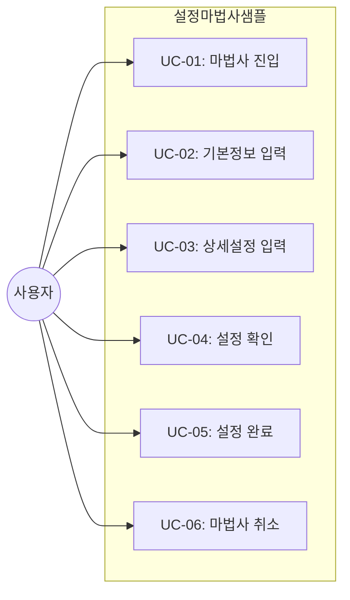
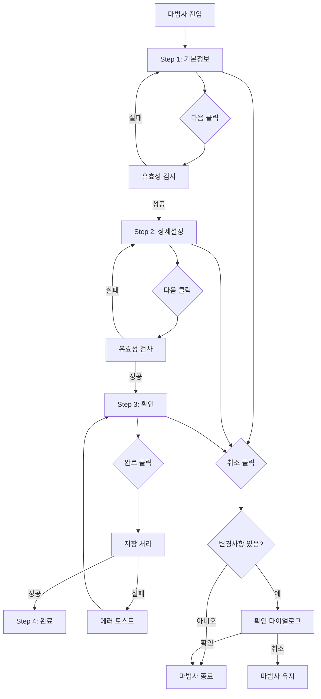

# TSK-06-09 - [샘플] 설정 마법사 설계 문서

## 문서 정보

| 항목 | 내용 |
|------|------|
| Task ID | TSK-06-09 |
| 문서 버전 | 1.0 |
| 작성일 | 2026-01-21 |
| 상태 | 설계완료 |
| 카테고리 | development |

---

## 1. 개요

### 1.1 배경 및 문제 정의

**현재 상황:**
- TSK-06-06에서 마법사(Wizard) 화면 템플릿(WizardTemplate)이 설계됨
- 템플릿의 기능 검증을 위한 실제 사용 예시가 필요함
- PRD에서 "설정 마법사 샘플"을 통한 고급 템플릿 검증 요구

**해결하려는 문제:**
- WizardTemplate의 실제 사용성 검증 (단계별 진행, 유효성 검사, 데이터 공유)
- 4단계 마법사 UI/UX 패턴 검증 (기본정보 → 상세설정 → 확인 → 완료)
- 개발자가 참고할 수 있는 템플릿 사용 예시 코드 제공
- Mock JSON 데이터 기반 화면 동작 검증

### 1.2 목적 및 기대 효과

**목적:**
- WizardTemplate 컴포넌트의 기능 검증용 샘플 화면 구현
- 4단계 설정 마법사(기본정보 → 상세설정 → 확인 → 완료) 구현
- Mock 데이터(`mock-data/wizard-config.json`) 기반 화면 동작 검증

**기대 효과:**
- 사용자 관점: 단계별 설정 과정 체험, 마법사 UI 패턴 이해
- 개발자 관점: WizardTemplate 사용 방법 참고 코드 제공
- QA 관점: 템플릿 기능 테스트를 위한 테스트 베드 확보

### 1.3 범위

**포함:**
- 설정 마법사 샘플 화면 구현 (`screens/sample/SettingWizard.tsx`)
- 4단계 마법사 (기본정보, 상세설정, 확인, 완료)
- 각 단계별 폼 및 유효성 검사
- Mock 데이터 파일 (`mock-data/wizard-config.json`)
- WizardTemplate 컴포넌트 활용
- 이전/다음 네비게이션
- 최종 확인 요약 화면
- 완료 결과 화면

**제외:**
- 실제 API 연동 (Mock 데이터 사용)
- 데이터베이스 저장 (저장 시뮬레이션만)
- 드래프트 자동 저장
- 비선형 마법사 (조건부 단계 분기)

### 1.4 참조 문서

| 문서 | 경로 | 관련 섹션 |
|------|------|----------|
| PRD | `.orchay/projects/mes-portal/prd.md` | 4.1.1 화면 템플릿 샘플 - 설정 마법사 |
| TRD | `.orchay/projects/mes-portal/trd.md` | 7. PRD 요구사항 - 기타 기능 (Ant Design Steps) |
| TSK-06-06 | `.orchay/projects/mes-portal/tasks/TSK-06-06/010-design.md` | 마법사(Wizard) 화면 템플릿 설계 |

---

## 2. 사용자 분석

### 2.1 대상 사용자

| 사용자 유형 | 특성 | 주요 니즈 |
|------------|------|----------|
| 시스템 관리자 | MES 초기 설정 담당, IT 역량 보유 | 복잡한 설정을 단계별로 명확하게 진행 |
| 개발자 | WizardTemplate 사용자 | 템플릿 사용 방법 학습, 참고 코드 |
| QA 엔지니어 | 템플릿 기능 검증 | 마법사 템플릿 기능 테스트 |

### 2.2 사용자 페르소나

**페르소나 1: 시스템 관리자 박관리**
- 역할: MES 시스템 초기 설정 담당자
- 목표: 시스템 초기 설정을 실수 없이 완료
- 불만: 한 화면에 모든 설정이 나열되면 무엇부터 해야 할지 혼란
- 시나리오: 기본정보 → 상세설정 → 확인 → 완료 순으로 설정 진행

**페르소나 2: 프론트엔드 개발자 김개발**
- 역할: MES Portal 화면 개발
- 목표: WizardTemplate 사용 방법 이해, 새 마법사 화면 개발
- 불만: 템플릿 문서만으로는 실제 사용법 이해 어려움
- 시나리오: 샘플 코드를 참고하여 새 마법사 화면 구현

---

## 3. 유즈케이스

### 3.1 유즈케이스 다이어그램



### 3.2 유즈케이스 상세

#### UC-01: 마법사 진입

| 항목 | 내용 |
|------|------|
| 액터 | 일반 사용자 |
| 목적 | 설정 마법사 시작 |
| 사전 조건 | 메뉴에서 설정 마법사 접근 가능 |
| 사후 조건 | 1단계(기본정보) 화면 표시 |
| 트리거 | 메뉴 클릭 또는 MDI 탭 열기 |

**기본 흐름:**
1. 사용자가 사이드바 메뉴에서 "설정 마법사" 클릭
2. MDI 탭에 설정 마법사 화면 열림
3. Steps 컴포넌트에 4단계 표시 (기본정보 → 상세설정 → 확인 → 완료)
4. 1단계(기본정보) 폼이 표시됨
5. 첫 번째 입력 필드에 포커스

#### UC-02: 기본정보 입력

| 항목 | 내용 |
|------|------|
| 액터 | 일반 사용자 |
| 목적 | 회사 및 공장 기본 정보 입력 |
| 사전 조건 | 1단계 화면 표시 중 |
| 사후 조건 | 기본정보 저장, 2단계로 이동 |
| 트리거 | 다음 버튼 클릭 |

**기본 흐름:**
1. 사용자가 회사명, 공장명, 관리자 이메일 입력
2. [다음] 버튼 클릭
3. 시스템이 유효성 검사 수행
4. 검사 통과 시 2단계(상세설정)으로 이동
5. Steps에 1단계 완료 표시 (체크마크)

**예외 흐름:**
- 3a. 유효성 검사 실패 시:
  - 에러 필드에 에러 메시지 표시
  - 첫 번째 에러 필드에 포커스
  - 2단계로 이동하지 않음

#### UC-03: 상세설정 입력

| 항목 | 내용 |
|------|------|
| 액터 | 일반 사용자 |
| 목적 | 연결 정보 및 옵션 설정 |
| 사전 조건 | 2단계 화면 표시 중, 1단계 완료 |
| 사후 조건 | 상세설정 저장, 3단계로 이동 |
| 트리거 | 다음 버튼 클릭 |

**기본 흐름:**
1. 사용자가 서버 주소, 포트 번호, 타임아웃, 옵션 체크박스 입력
2. [다음] 버튼 클릭
3. 시스템이 유효성 검사 수행
4. 검사 통과 시 3단계(확인)으로 이동
5. Steps에 2단계 완료 표시

**대안 흐름:**
- 1a. [이전] 버튼 클릭 시:
  - 1단계로 이동, 기존 데이터 유지

#### UC-04: 설정 확인

| 항목 | 내용 |
|------|------|
| 액터 | 일반 사용자 |
| 목적 | 전체 입력 내용 최종 확인 |
| 사전 조건 | 3단계 화면 표시 중, 1~2단계 완료 |
| 사후 조건 | 완료 요청, 4단계로 이동 |
| 트리거 | 완료 버튼 클릭 |

**기본 흐름:**
1. 시스템이 모든 입력 데이터를 요약하여 표시
2. 사용자가 각 섹션 검토
3. 수정 필요 시 해당 섹션의 [수정] 링크 클릭 → 해당 단계로 이동
4. 모두 확인 후 [완료] 버튼 클릭
5. 시스템이 저장 처리 (Mock 시뮬레이션)
6. 성공 시 4단계(완료)로 이동

#### UC-05: 설정 완료

| 항목 | 내용 |
|------|------|
| 액터 | 시스템 |
| 목적 | 설정 완료 결과 표시 |
| 사전 조건 | 저장 처리 성공 |
| 사후 조건 | 완료 화면 표시 |
| 트리거 | 저장 성공 |

**기본 흐름:**
1. 시스템이 Result 컴포넌트로 성공 메시지 표시
2. "설정이 완료되었습니다!" 메시지
3. [대시보드로 이동] 또는 [다시 시작] 버튼 표시
4. 사용자가 버튼 클릭 시 해당 화면으로 이동

#### UC-06: 마법사 취소

| 항목 | 내용 |
|------|------|
| 액터 | 일반 사용자 |
| 목적 | 진행 중인 마법사 취소 |
| 사전 조건 | 마법사 진행 중 |
| 사후 조건 | 마법사 종료, 이전 화면 또는 탭 닫기 |
| 트리거 | 취소 버튼 클릭 |

**기본 흐름:**
1. 사용자가 [취소] 버튼 클릭
2. 입력 데이터가 있으면 확인 다이얼로그 표시
3. "진행 중인 내용이 저장되지 않습니다. 취소하시겠습니까?"
4. [확인] 클릭 시 MDI 탭 닫기 또는 이전 화면 이동

---

## 4. 사용자 시나리오

### 4.1 시나리오 1: 설정 마법사 정상 완료

**상황 설명:**
시스템 관리자 박관리가 MES 시스템 초기 설정을 위해 설정 마법사를 실행한다.

**단계별 진행:**

| 단계 | 사용자 행동 | 시스템 반응 | 사용자 기대 |
|------|-----------|------------|------------|
| 1 | 메뉴에서 "설정 마법사" 클릭 | MDI 탭에 화면 열림, Steps 4단계 표시 | 전체 진행 단계 파악 |
| 2 | 회사명 "ABC 제조" 입력 | 입력값 표시 | 즉각 피드백 |
| 3 | 공장명 "1공장" 입력 | 입력값 표시 | - |
| 4 | 관리자 이메일 "admin@abc.com" 입력 | 입력값 표시 | - |
| 5 | [다음] 클릭 | 유효성 통과, 2단계 이동, 1단계 체크 | 1단계 완료 확인 |
| 6 | 서버 주소 "192.168.1.100" 입력 | 입력값 표시 | - |
| 7 | 포트 번호 "8080" 입력 | 입력값 표시 | - |
| 8 | 타임아웃 "30" 입력 | 입력값 표시 | - |
| 9 | "자동 재연결" 체크 | 체크 표시 | - |
| 10 | [다음] 클릭 | 유효성 통과, 3단계 이동, 2단계 체크 | 2단계 완료 확인 |
| 11 | 확인 화면에서 입력 내용 검토 | Descriptions로 요약 표시 | 전체 내용 확인 |
| 12 | [완료] 클릭 | 로딩 표시 후 4단계 이동 | 저장 진행 |
| 13 | - | Result 컴포넌트로 "설정이 완료되었습니다!" 표시 | 성공 확인 |

**성공 조건:**
- 모든 단계 순차 진행
- 유효성 검사 통과
- 완료 화면 표시

### 4.2 시나리오 2: 유효성 검사 실패 후 수정

**상황 설명:**
사용자가 필수 필드를 비워두고 다음으로 이동하려 시도한다.

**단계별 진행:**

| 단계 | 사용자 행동 | 시스템 반응 | 복구 방법 |
|------|-----------|------------|----------|
| 1 | 회사명 비워둠 | - | - |
| 2 | [다음] 클릭 | "회사명을 입력해주세요" 에러 표시, 회사명 필드 포커스 | 회사명 입력 |
| 3 | 회사명 입력 | 에러 메시지 사라짐 | - |
| 4 | [다음] 클릭 | 유효성 통과, 2단계 이동 | - |

### 4.3 시나리오 3: 이전 단계 수정

**상황 설명:**
사용자가 3단계(확인)에서 1단계 정보를 수정하려 한다.

**단계별 진행:**

| 단계 | 사용자 행동 | 시스템 반응 | 사용자 기대 |
|------|-----------|------------|------------|
| 1 | 3단계에서 기본정보 섹션의 [수정] 클릭 | 1단계로 이동, 기존 데이터 유지 | 빠른 수정 접근 |
| 2 | 회사명 수정 | 입력값 갱신 | - |
| 3 | [다음] 클릭 (2회) | 각 단계 유효성 검사 후 3단계 도달 | - |
| 4 | 수정된 내용 확인 | 갱신된 회사명 표시 | 수정 반영 확인 |

### 4.4 시나리오 4: 마법사 취소

**상황 설명:**
사용자가 2단계에서 마법사를 취소하려 한다.

**단계별 진행:**

| 단계 | 사용자 행동 | 시스템 반응 | 복구 방법 |
|------|-----------|------------|----------|
| 1 | 1~2단계 데이터 입력 | 데이터 저장 상태 | - |
| 2 | [취소] 클릭 | 확인 다이얼로그 표시 | [취소]로 마법사 유지 |
| 3 | [확인] 클릭 | MDI 탭 닫기, 데이터 삭제 | - |

---

## 5. 화면 설계

### 5.1 화면 흐름도



### 5.2 화면별 상세

#### 화면 1: Step 1 - 기본정보 입력

**화면 목적:**
회사명, 공장명, 관리자 이메일 등 기본 정보 입력

**진입 경로:**
- 사이드바 메뉴 > 샘플 > 설정 마법사

**와이어프레임:**
```
+-------------------------------------------------------------------------+
|  +-----------------------------------------------------------------+    |
|  |  설정 마법사                                            [취소]  |    |
|  +-----------------------------------------------------------------+    |
|                                                                          |
|  +-----------------------------------------------------------------+    |
|  |                         Steps 영역                               |    |
|  |  +----------+    +----------+    +----------+    +----------+   |    |
|  |  |    1     |    |    2     |    |    3     |    |    4     |   |    |
|  |  |  기본    |--->|  상세    |--->|  확인    |--->|  완료    |   |    |
|  |  |  정보    |    |  설정    |    |          |    |          |   |    |
|  |  +----------+    +----------+    +----------+    +----------+   |    |
|  |     -->          [ ]             [ ]             [ ]            |    |
|  |   현재 단계       대기            대기           대기            |    |
|  +-----------------------------------------------------------------+    |
|                                                                          |
|  +-----------------------------------------------------------------+    |
|  |                     기본 정보                                    |    |
|  |  +-----------------------------------------------------------+  |    |
|  |  | 회사명 *                                                   |  |    |
|  |  | +-------------------------------------------------------+ |  |    |
|  |  | |                                                       | |  |    |
|  |  | +-------------------------------------------------------+ |  |    |
|  |  +-----------------------------------------------------------+  |    |
|  |                                                                 |    |
|  |  +-----------------------------------------------------------+  |    |
|  |  | 공장명 *                                                   |  |    |
|  |  | +-------------------------------------------------------+ |  |    |
|  |  | |                                                       | |  |    |
|  |  | +-------------------------------------------------------+ |  |    |
|  |  +-----------------------------------------------------------+  |    |
|  |                                                                 |    |
|  |  +-----------------------------------------------------------+  |    |
|  |  | 관리자 이메일 *                                            |  |    |
|  |  | +-------------------------------------------------------+ |  |    |
|  |  | |                                                       | |  |    |
|  |  | +-------------------------------------------------------+ |  |    |
|  |  +-----------------------------------------------------------+  |    |
|  +-----------------------------------------------------------------+    |
|                                                                          |
|  +-----------------------------------------------------------------+    |
|  |                                                    [다음]         |    |
|  +-----------------------------------------------------------------+    |
+-------------------------------------------------------------------------+

범례:
* : 필수 필드
--> : 현재 단계
[ ] : 대기 중인 단계
```

**화면 요소 설명:**

| 영역 | 설명 | Ant Design 컴포넌트 | 사용자 인터랙션 |
|------|------|-------------------|----------------|
| 헤더 | 마법사 제목 | Card title | - |
| 취소 버튼 | 마법사 취소 | Button | 클릭 시 확인 다이얼로그 |
| Steps | 단계 표시 | Steps (horizontal) | 완료된 단계 클릭 시 이동 |
| 회사명 | 필수 텍스트 입력 | Form.Item + Input | 입력 |
| 공장명 | 필수 텍스트 입력 | Form.Item + Input | 입력 |
| 관리자 이메일 | 필수 이메일 입력 | Form.Item + Input | 입력 |
| 다음 버튼 | 다음 단계 이동 | Button type="primary" | 클릭 시 유효성 검사 |

#### 화면 2: Step 2 - 상세설정 입력

**화면 목적:**
서버 연결 정보 및 옵션 설정

**와이어프레임:**
```
+-------------------------------------------------------------------------+
|  +-----------------------------------------------------------------+    |
|  |  설정 마법사                                            [취소]  |    |
|  +-----------------------------------------------------------------+    |
|                                                                          |
|  +-----------------------------------------------------------------+    |
|  |  +----------+    +----------+    +----------+    +----------+   |    |
|  |  |    1     |    |    2     |    |    3     |    |    4     |   |    |
|  |  |  기본    |--->|  상세    |--->|  확인    |--->|  완료    |   |    |
|  |  |  정보    |    |  설정    |    |          |    |          |   |    |
|  |  +----------+    +----------+    +----------+    +----------+   |    |
|  |     [v]            -->           [ ]             [ ]            |    |
|  |   완료됨         현재 단계        대기           대기            |    |
|  +-----------------------------------------------------------------+    |
|                                                                          |
|  +-----------------------------------------------------------------+    |
|  |                     상세 설정                                    |    |
|  |                                                                 |    |
|  |  연결 정보                                                       |    |
|  |  +-----------------------------------------------------------+  |    |
|  |  | 서버 주소 *                                                |  |    |
|  |  | +-------------------------------------------------------+ |  |    |
|  |  | | 192.168.1.100                                         | |  |    |
|  |  | +-------------------------------------------------------+ |  |    |
|  |  +-----------------------------------------------------------+  |    |
|  |                                                                 |    |
|  |  +-------------------------+  +-------------------------+       |    |
|  |  | 포트 번호 *             |  | 타임아웃(초)            |       |    |
|  |  | +---------------------+ |  | +---------------------+ |       |    |
|  |  | | 8080                | |  | | 30                  | |       |    |
|  |  | +---------------------+ |  | +---------------------+ |       |    |
|  |  +-------------------------+  +-------------------------+       |    |
|  |                                                                 |    |
|  |  옵션 설정                                                       |    |
|  |  +-----------------------------------------------------------+  |    |
|  |  | [v] 자동 재연결 활성화                                     |  |    |
|  |  | [ ] 디버그 모드 활성화                                     |  |    |
|  |  | [ ] SSL 사용                                               |  |    |
|  |  +-----------------------------------------------------------+  |    |
|  +-----------------------------------------------------------------+    |
|                                                                          |
|  +-----------------------------------------------------------------+    |
|  |                                    [이전]  [다음]                 |    |
|  +-----------------------------------------------------------------+    |
+-------------------------------------------------------------------------+

범례:
[v] : 체크됨
[ ] : 체크 안됨
```

**화면 요소 설명:**

| 영역 | 설명 | Ant Design 컴포넌트 | 사용자 인터랙션 |
|------|------|-------------------|----------------|
| 서버 주소 | 필수 텍스트 입력 | Form.Item + Input | IP 또는 도메인 입력 |
| 포트 번호 | 필수 숫자 입력 | Form.Item + InputNumber | 1-65535 범위 |
| 타임아웃 | 선택 숫자 입력 | Form.Item + InputNumber | 기본값 30 |
| 자동 재연결 | 체크박스 | Form.Item + Checkbox | 토글 |
| 디버그 모드 | 체크박스 | Form.Item + Checkbox | 토글 |
| SSL 사용 | 체크박스 | Form.Item + Checkbox | 토글 |
| 이전 버튼 | 이전 단계 이동 | Button | 클릭 시 1단계 이동 |
| 다음 버튼 | 다음 단계 이동 | Button type="primary" | 유효성 검사 후 이동 |

#### 화면 3: Step 3 - 확인

**화면 목적:**
모든 입력 데이터 최종 확인

**와이어프레임:**
```
+-------------------------------------------------------------------------+
|  +-----------------------------------------------------------------+    |
|  |  설정 마법사                                            [취소]  |    |
|  +-----------------------------------------------------------------+    |
|                                                                          |
|  +-----------------------------------------------------------------+    |
|  |  +----------+    +----------+    +----------+    +----------+   |    |
|  |  |    1     |    |    2     |    |    3     |    |    4     |   |    |
|  |  |  기본    |--->|  상세    |--->|  확인    |--->|  완료    |   |    |
|  |  |  정보    |    |  설정    |    |          |    |          |   |    |
|  |  +----------+    +----------+    +----------+    +----------+   |    |
|  |     [v]            [v]            -->           [ ]             |    |
|  |   완료됨         완료됨        현재 단계        대기             |    |
|  +-----------------------------------------------------------------+    |
|                                                                          |
|  +-----------------------------------------------------------------+    |
|  |                       최종 확인                                   |    |
|  |  +-----------------------------------------------------------+  |    |
|  |  | 기본 정보                                        [수정]   |  |    |
|  |  | +---------------------------------------------------------+  |    |
|  |  | | 회사명         : ABC 제조                               |  |    |
|  |  | | 공장명         : 1공장                                  |  |    |
|  |  | | 관리자 이메일  : admin@abc.com                          |  |    |
|  |  | +---------------------------------------------------------+  |    |
|  |  +-----------------------------------------------------------+  |    |
|  |                                                                 |    |
|  |  +-----------------------------------------------------------+  |    |
|  |  | 상세 설정                                        [수정]   |  |    |
|  |  | +---------------------------------------------------------+  |    |
|  |  | | 서버 주소      : 192.168.1.100                          |  |    |
|  |  | | 포트 번호      : 8080                                   |  |    |
|  |  | | 타임아웃       : 30초                                   |  |    |
|  |  | | 자동 재연결    : 활성화                                 |  |    |
|  |  | | 디버그 모드    : 비활성화                               |  |    |
|  |  | | SSL 사용       : 비활성화                               |  |    |
|  |  | +---------------------------------------------------------+  |    |
|  |  +-----------------------------------------------------------+  |    |
|  +-----------------------------------------------------------------+    |
|                                                                          |
|  +-----------------------------------------------------------------+    |
|  |                                          [이전]  [완료]         |    |
|  +-----------------------------------------------------------------+    |
+-------------------------------------------------------------------------+
```

**화면 요소 설명:**

| 영역 | 설명 | Ant Design 컴포넌트 | 사용자 인터랙션 |
|------|------|-------------------|----------------|
| 기본 정보 섹션 | 1단계 입력 요약 | Card + Descriptions | 읽기 전용 |
| 기본 정보 수정 | 1단계로 이동 | Button type="link" | 클릭 시 1단계 이동 |
| 상세 설정 섹션 | 2단계 입력 요약 | Card + Descriptions | 읽기 전용 |
| 상세 설정 수정 | 2단계로 이동 | Button type="link" | 클릭 시 2단계 이동 |
| 이전 버튼 | 이전 단계 이동 | Button | 클릭 시 2단계 이동 |
| 완료 버튼 | 마법사 완료 | Button type="primary" | 클릭 시 저장 및 완료 |

#### 화면 4: Step 4 - 완료

**화면 목적:**
설정 완료 결과 표시

**와이어프레임:**
```
+-------------------------------------------------------------------------+
|  +-----------------------------------------------------------------+    |
|  |  설정 마법사                                                     |    |
|  +-----------------------------------------------------------------+    |
|                                                                          |
|  +-----------------------------------------------------------------+    |
|  |  +----------+    +----------+    +----------+    +----------+   |    |
|  |  |    1     |    |    2     |    |    3     |    |    4     |   |    |
|  |  |  기본    |--->|  상세    |--->|  확인    |--->|  완료    |   |    |
|  |  |  정보    |    |  설정    |    |          |    |          |   |    |
|  |  +----------+    +----------+    +----------+    +----------+   |    |
|  |     [v]            [v]            [v]            [v]            |    |
|  |   완료됨         완료됨         완료됨         완료됨            |    |
|  +-----------------------------------------------------------------+    |
|                                                                          |
|  +-----------------------------------------------------------------+    |
|  |                                                                 |    |
|  |                         +--------+                              |    |
|  |                         |   [v]  |                              |    |
|  |                         +--------+                              |    |
|  |                                                                 |    |
|  |                   설정이 완료되었습니다!                         |    |
|  |                                                                 |    |
|  |         시스템 설정이 성공적으로 저장되었습니다.                  |    |
|  |           이제 대시보드로 이동하여 사용할 수 있습니다.            |    |
|  |                                                                 |    |
|  |              [대시보드로 이동]    [다시 시작]                    |    |
|  |                                                                 |    |
|  +-----------------------------------------------------------------+    |
+-------------------------------------------------------------------------+
```

**화면 요소 설명:**

| 영역 | 설명 | Ant Design 컴포넌트 | 사용자 인터랙션 |
|------|------|-------------------|----------------|
| 성공 아이콘 | 완료 표시 | Result icon | - |
| 성공 메시지 | 완료 안내 | Result title | - |
| 부가 설명 | 다음 단계 안내 | Result subTitle | - |
| 대시보드 이동 | 대시보드로 이동 | Button type="primary" | 클릭 시 대시보드 |
| 다시 시작 | 마법사 재시작 | Button | 클릭 시 1단계로 초기화 |

### 5.3 반응형 동작

| 화면 크기 | 레이아웃 변화 | 사용자 경험 |
|----------|--------------|------------|
| 데스크톱 (1024px+) | 수평 Steps, 중앙 정렬 콘텐츠 | 전체 단계 한눈에 파악 |
| 태블릿 (768-1023px) | 수평 Steps, 좁은 콘텐츠 | 스크롤 최소화 |
| 모바일 (767px-) | 수직 Steps 또는 미니 Steps, 버튼 풀 너비 | 터치 친화적 |

---

## 6. 인터랙션 설계

### 6.1 사용자 액션과 피드백

| 사용자 액션 | 즉각 피드백 | 결과 피드백 | 에러 피드백 |
|------------|-----------|------------|------------|
| 필드 입력 | 입력값 표시 | - | 실시간 유효성 검사 (설정 시) |
| 다음 버튼 클릭 | 버튼 로딩 | 다음 단계 이동, Steps 갱신 | 필드별 에러 메시지 |
| 이전 버튼 클릭 | - | 이전 단계 이동, 데이터 유지 | - |
| 완료 버튼 클릭 | 버튼 로딩 | 성공 메시지 + 완료 화면 | 에러 토스트 |
| 취소 버튼 클릭 | 확인 다이얼로그 | MDI 탭 닫기 | - |
| 수정 링크 클릭 | - | 해당 단계 이동 | - |

### 6.2 상태별 화면 변화

| 상태 | 화면 표시 | 사용자 안내 |
|------|----------|------------|
| 초기 로딩 | Skeleton | "로딩 중..." |
| 단계 진행 중 | Steps current 표시 | - |
| 단계 완료 | Steps status="finish" | 체크 아이콘 |
| 유효성 검사 중 | 다음 버튼 로딩 | - |
| 유효성 실패 | 에러 필드 강조 | 에러 메시지 |
| 완료 처리 중 | 완료 버튼 로딩 | "저장 중..." |
| 완료 성공 | Result status="success" | "설정이 완료되었습니다!" |

### 6.3 키보드/접근성

| 기능 | 키보드 단축키 | 스크린 리더 안내 |
|------|-------------|-----------------|
| 다음 필드 | Tab | "{필드명}으로 이동" |
| 다음 단계 | Enter (폼 내) | "다음 단계로 이동" |
| 취소 | Escape | "마법사 취소" |
| Steps 탐색 | 화살표 키 | "단계 {n}: {단계명}, {상태}" |

---

## 7. 데이터 요구사항

### 7.1 필요한 데이터

| 데이터 | 설명 | 출처 | 용도 |
|--------|------|------|------|
| wizardConfig | 초기 설정값 | mock-data/wizard-config.json | 기본값 로드 |
| stepData | 단계별 입력 데이터 | 사용자 입력 | 마법사 상태 관리 |

### 7.2 Mock 데이터 구조

**mock-data/wizard-config.json:**

```json
{
  "defaults": {
    "basicInfo": {
      "companyName": "",
      "factoryName": "",
      "adminEmail": ""
    },
    "detailSettings": {
      "serverAddress": "192.168.1.100",
      "port": 8080,
      "timeout": 30,
      "autoReconnect": true,
      "debugMode": false,
      "useSSL": false
    }
  },
  "validation": {
    "port": {
      "min": 1,
      "max": 65535
    },
    "timeout": {
      "min": 1,
      "max": 300
    }
  },
  "messages": {
    "success": "설정이 완료되었습니다!",
    "successDescription": "시스템 설정이 성공적으로 저장되었습니다. 이제 대시보드로 이동하여 사용할 수 있습니다."
  }
}
```

### 7.3 데이터 유효성 규칙

| 데이터 필드 | 규칙 | 위반 시 메시지 |
|------------|------|---------------|
| companyName | 필수, 2-50자 | "회사명을 입력해주세요" / "회사명은 2-50자 사이로 입력해주세요" |
| factoryName | 필수, 2-50자 | "공장명을 입력해주세요" / "공장명은 2-50자 사이로 입력해주세요" |
| adminEmail | 필수, 이메일 형식, 최대 254자 | "관리자 이메일을 입력해주세요" / "올바른 이메일 형식이 아닙니다" |
| serverAddress | 필수, IP 또는 도메인, 최대 253자 | "서버 주소를 입력해주세요" / "올바른 서버 주소 형식이 아닙니다" |
| port | 필수, 1-65535 | "포트 번호를 입력해주세요" / "1-65535 사이의 숫자를 입력해주세요" |
| timeout | 선택, 1-300 | "1-300 사이의 숫자를 입력해주세요" |

#### 7.3.1 serverAddress 검증 패턴

```typescript
// IPv4 패턴
const IPv4_PATTERN = /^(?:(?:25[0-5]|2[0-4][0-9]|[01]?[0-9][0-9]?)\.){3}(?:25[0-5]|2[0-4][0-9]|[01]?[0-9][0-9]?)$/;

// 도메인 패턴
const DOMAIN_PATTERN = /^(?:[a-zA-Z0-9](?:[a-zA-Z0-9-]{0,61}[a-zA-Z0-9])?\.)+[a-zA-Z]{2,}$/;

// 유효성 검사 함수
const isValidServerAddress = (value: string) =>
  IPv4_PATTERN.test(value) || DOMAIN_PATTERN.test(value);
```

#### 7.3.2 이메일 검증

- Ant Design Form의 `type: 'email'` 규칙 사용
- 최대 길이 254자 제한

---

## 8. 비즈니스 규칙

### 8.1 핵심 규칙

| 규칙 ID | 규칙 설명 | 적용 상황 | 예외 |
|---------|----------|----------|------|
| BR-001 | 단계별 순차 진행 필수 | 다음 단계 이동 | 없음 |
| BR-002 | 다음 이동 전 유효성 검사 필수 | 다음 버튼 클릭 | 없음 |
| BR-003 | 이전 단계 데이터 유지 | 단계 이동 | 마법사 취소 시 삭제 |
| BR-004 | 완료된 단계만 Steps 클릭 가능 | Steps 상호작용 | 없음 |
| BR-005 | 입력 데이터 있을 때 이탈 확인 | 취소, 탭 닫기 | 없음 |

### 8.2 규칙 상세 설명

**BR-001: 단계별 순차 진행 필수**

설명: 사용자는 반드시 이전 단계를 완료해야 다음 단계로 진행할 수 있다.

예시:
- 1단계 미완료 시 2단계 접근 불가
- Steps에서 미완료 단계 클릭 시 무시

**BR-002: 다음 이동 전 유효성 검사 필수**

설명: 다음 단계로 이동하기 전 현재 단계의 모든 필수 필드와 유효성 규칙을 검사한다.

예시:
- 다음 버튼 클릭 시 Form.validateFields() 실행
- 실패 시 에러 표시 및 이동 차단

---

## 9. 에러 처리

### 9.1 예상 에러 상황

| 상황 | 원인 | 사용자 메시지 | 복구 방법 |
|------|------|--------------|----------|
| 유효성 검사 실패 | 필수 값 누락, 형식 오류 | 필드별 에러 메시지 | 해당 필드 수정 |
| 저장 실패 (Mock) | Mock 시뮬레이션 | "저장에 실패했습니다. 다시 시도해주세요." | 재시도 버튼 |

### 9.2 에러 표시 방식

| 에러 유형 | 표시 위치 | 표시 방법 | Ant Design 컴포넌트 |
|----------|----------|----------|-------------------|
| 필드 유효성 | 해당 필드 하단 | 빨간색 텍스트 | Form.Item validateStatus |
| 저장 에러 | 화면 상단 | 토스트 알림 | message.error() |

---

## 10. 연관 문서

| 문서 | 경로 | 용도 |
|------|------|------|
| 요구사항 추적 매트릭스 | `025-traceability-matrix.md` | PRD → 설계 → 테스트 추적 |
| 테스트 명세서 | `026-test-specification.md` | 단위/E2E/매뉴얼 테스트 정의 |

---

## 11. 구현 범위

### 11.1 파일 구조

```
mes-portal/
├── app/(portal)/sample/setting-wizard/
│   └── page.tsx                      # 라우트 페이지
├── components/
│   └── screens/
│       └── sample/
│           ├── SettingWizard/
│           │   ├── index.tsx              # 메인 컴포넌트 (상태 관리)
│           │   ├── BasicInfoStep.tsx      # 1단계: 기본정보
│           │   ├── DetailSettingsStep.tsx # 2단계: 상세설정
│           │   ├── ConfirmationStep.tsx   # 3단계: 확인 (신규)
│           │   ├── CompleteStep.tsx       # 4단계: 완료 (신규)
│           │   ├── types.ts               # 타입 정의
│           │   └── __tests__/             # 테스트 디렉토리
│           │       ├── BasicInfoStep.test.tsx
│           │       ├── DetailSettingsStep.test.tsx
│           │       └── SettingWizard.test.tsx
├── mock-data/
│   └── wizard-config.json            # Mock 설정 데이터
```

### 11.2 영향받는 영역

| 영역 | 변경 내용 | 영향도 |
|------|----------|--------|
| app/(portal)/sample/setting-wizard/ | 신규 생성 | 높음 |
| components/screens/sample/SettingWizard/ | 신규 생성 | 높음 |
| mock-data/wizard-config.json | 신규 생성 | 중간 |
| 사이드바 메뉴 | 메뉴 항목 추가 | 낮음 |

### 11.3 의존성

| 의존 항목 | 이유 | 상태 |
|----------|------|------|
| TSK-06-06 (WizardTemplate) | 마법사 템플릿 컴포넌트 사용 | 완료 예정 |
| Ant Design Form | 폼 유효성 검사 | TRD 확인됨 |
| Ant Design Steps | 단계 표시 | TRD 확인됨 |
| Ant Design Descriptions | 확인 단계 요약 | TRD 확인됨 |
| Ant Design Result | 완료 화면 | TRD 확인됨 |

#### 11.3.1 WizardContext 활용 방식

TSK-06-06에서 제공하는 `WizardContext`와 `useWizardStep` 훅을 활용합니다:

```typescript
// 데이터 흐름 인터페이스
interface SettingWizardData {
  basicInfo: {
    companyName: string;
    factoryName: string;
    adminEmail: string;
  };
  detailSettings: {
    serverAddress: string;
    port: number;
    timeout: number;
    autoReconnect: boolean;
    debugMode: boolean;
    useSSL: boolean;
  };
}

// 각 단계 컴포넌트에서 useWizardStep 훅 사용 예시
function BasicInfoStep() {
  const [form] = Form.useForm();
  const { handleValuesChange } = useWizardStep<BasicInfo>('basicInfo', form);

  return (
    <Form
      form={form}
      onValuesChange={handleValuesChange}
      initialValues={/* WizardContext에서 제공 */}
    >
      {/* 폼 필드 */}
    </Form>
  );
}
```

#### 11.3.2 Form-Context 연동 전략

```typescript
// SettingWizard/index.tsx에서
const steps: WizardStep[] = [
  {
    key: 'basicInfo',
    title: '기본 정보',
    content: <BasicInfoStep />,
    // validate는 WizardTemplate 내부에서 registerStepForm으로 등록된
    // Form 인스턴스를 사용하여 자동 검증 (TSK-06-06 적용)
  },
  {
    key: 'detailSettings',
    title: '상세 설정',
    content: <DetailSettingsStep />,
  },
  {
    key: 'confirmation',
    title: '확인',
    content: <ConfirmationStep />,
  },
  {
    key: 'complete',
    title: '완료',
    content: <CompleteStep />,
  },
];
```

#### 11.3.3 WizardTemplate Props 활용

```typescript
<WizardTemplate
  title="설정 마법사"
  steps={steps}
  onFinish={handleFinish}
  onCancel={handleCancel}
  autoConfirmStep={false}     // 커스텀 확인 단계 사용 (ConfirmationStep)
  autoFinishStep={false}      // 커스텀 완료 단계 사용 (CompleteStep)
  enableLeaveConfirm={true}   // 이탈 경고 활성화
  direction="horizontal"       // 수평 Steps
/>
```

### 11.4 제약 사항

| 제약 | 설명 | 대응 방안 |
|------|------|----------|
| Mock 데이터 전용 | 실제 API 연동 없음 | 저장 시뮬레이션 (setTimeout) |
| TSK-06-06 의존 | WizardTemplate 필요 | 의존성 관리 |

### 11.5 Server/Client Component 구분

| 컴포넌트 | 타입 | 사유 |
|----------|------|------|
| page.tsx | Server Component (권장) | 초기 Mock 데이터 로드 |
| SettingWizard/index.tsx | Client Component | Ant Design, 상태 관리 |
| BasicInfoStep.tsx | Client Component | Form 컴포넌트 |
| DetailSettingsStep.tsx | Client Component | Form 컴포넌트 |

### 11.6 주요 data-testid 정의

| data-testid | 요소 | 용도 |
|-------------|------|------|
| `setting-wizard-page` | 페이지 컨테이너 | 페이지 로드 확인 |
| `wizard-steps` | Steps 컴포넌트 | 단계 표시 확인 |
| `wizard-step-basic-info` | 1단계 | 기본정보 단계 |
| `wizard-step-detail-settings` | 2단계 | 상세설정 단계 |
| `wizard-step-confirmation` | 3단계 | 확인 단계 |
| `wizard-step-complete` | 4단계 | 완료 단계 |
| `wizard-content` | 콘텐츠 영역 | 콘텐츠 표시 확인 |
| `company-name-input` | 회사명 입력 | 회사명 입력 |
| `factory-name-input` | 공장명 입력 | 공장명 입력 |
| `admin-email-input` | 관리자 이메일 입력 | 이메일 입력 |
| `server-address-input` | 서버 주소 입력 | IP/도메인 입력 |
| `port-input` | 포트 번호 입력 | 포트 입력 |
| `timeout-input` | 타임아웃 입력 | 타임아웃 입력 |
| `auto-reconnect-checkbox` | 자동 재연결 체크박스 | 옵션 토글 |
| `debug-mode-checkbox` | 디버그 모드 체크박스 | 옵션 토글 |
| `use-ssl-checkbox` | SSL 사용 체크박스 | 옵션 토글 |
| `wizard-prev-btn` | 이전 버튼 | 이전 단계 이동 |
| `wizard-next-btn` | 다음 버튼 | 다음 단계 이동 |
| `wizard-finish-btn` | 완료 버튼 | 마법사 완료 |
| `wizard-cancel-btn` | 취소 버튼 | 마법사 취소 |
| `wizard-confirmation` | 확인 영역 | 요약 데이터 확인 |
| `confirmation-basic-info-section` | 기본정보 요약 | 값 검증 |
| `confirmation-detail-settings-section` | 상세설정 요약 | 값 검증 |
| `edit-basic-info-link` | 기본정보 수정 링크 | 1단계 이동 |
| `edit-detail-settings-link` | 상세설정 수정 링크 | 2단계 이동 |
| `wizard-result` | 완료 결과 영역 | 완료 메시지 |
| `go-dashboard-btn` | 대시보드 이동 버튼 | 대시보드 이동 |
| `restart-wizard-btn` | 다시 시작 버튼 | 마법사 재시작 |

### 11.7 보안 고려사항

> 본 Task는 Mock 데이터 전용 샘플이므로 실제 보안 구현은 제외됩니다.
> 보안 원칙의 상세 내용은 TSK-06-06 (WizardTemplate) 설계 문서 "10.1 보안 원칙" 섹션을 참조하세요.

| 항목 | 현재 (Mock) | 실제 구현 시 |
|------|------------|--------------|
| 유효성 검사 | 클라이언트 측만 | 서버 측 검증 필수 |
| 접근 권한 | 없음 (샘플) | ADMIN 역할 필수 |
| 민감 정보 | 로깅 없음 | 이메일/IP 마스킹 |
| API 연동 | Mock 시뮬레이션 | HTTPS 필수, CSRF 토큰 |

---

## 12. 체크리스트

### 12.1 설계 완료 확인

- [x] 문제 정의 및 목적 명확화
- [x] 사용자 분석 완료
- [x] 유즈케이스 정의 완료
- [x] 사용자 시나리오 작성 완료
- [x] 화면 설계 완료 (와이어프레임)
- [x] 인터랙션 설계 완료
- [x] 데이터 요구사항 정의 완료
- [x] 비즈니스 규칙 정의 완료
- [x] 에러 처리 정의 완료

### 12.2 연관 문서 작성

- [x] 요구사항 추적 매트릭스 작성 (→ `025-traceability-matrix.md`)
- [x] 테스트 명세서 작성 (→ `026-test-specification.md`)

### 12.3 구현 준비

- [x] 구현 우선순위 결정
- [x] 의존성 확인 완료 (TSK-06-06)
- [x] 제약 사항 검토 완료

---

## 변경 이력

| 버전 | 일자 | 작성자 | 변경 내용 |
|------|------|--------|----------|
| 1.0 | 2026-01-21 | Claude | 최초 작성 |
