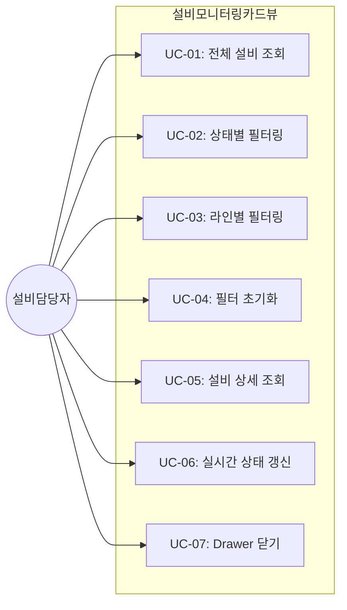
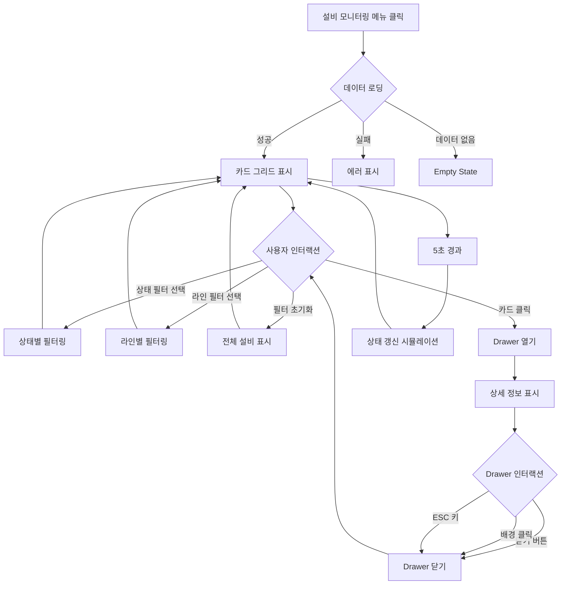
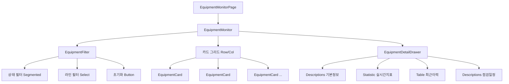

# TSK-06-10 - [샘플] 설비 모니터링 카드뷰 설계 문서

## 문서 정보

| 항목 | 내용 |
|------|------|
| Task ID | TSK-06-10 |
| 문서 버전 | 1.0 |
| 작성일 | 2026-01-22 |
| 상태 | 작성중 |
| 카테고리 | development |

---

## 1. 개요

### 1.1 배경 및 문제 정의

**현재 상황:**
- MES Portal에서 카드뷰 패턴을 활용한 화면 템플릿의 기능 검증이 필요함
- 제조 현장에서 설비 상태를 실시간으로 모니터링하는 것은 핵심 업무 중 하나임
- 설비 상태(가동/정지/고장/점검)를 직관적으로 파악할 수 있는 시각적 표현이 필요함
- 기존 테이블 형태의 목록 화면으로는 다수 설비의 상태를 한눈에 파악하기 어려움

**해결하려는 문제:**
- 카드뷰 패턴을 활용한 설비 모니터링 화면 구현 필요
- 상태별 색상 구분을 통한 직관적인 상태 파악
- 실시간 상태 갱신 시뮬레이션 검증 (Polling 패턴)
- 필터링 기능을 통한 효율적인 설비 탐색

### 1.2 목적 및 기대 효과

**목적:**
- 카드뷰 패턴을 활용한 샘플 화면 구현
- 설비 상태 카드 그리드 컴포넌트 개발
- 상태별 시각적 구분 (색상, 뱃지) 적용
- 실시간 상태 갱신 시뮬레이션 (5초 간격 Polling)
- Drawer를 활용한 상세 정보 표시 패턴 검증

**기대 효과:**
- 사용자 관점: 다수 설비의 상태를 한눈에 파악, 이상 설비 즉시 인지
- 개발자 관점: 카드뷰 패턴 참조 코드 제공, 실시간 갱신 패턴 활용
- 비즈니스 관점: 설비 가동률 향상, 고장 대응 시간 단축

### 1.3 범위

**포함:**
- 설비 모니터링 카드뷰 샘플 화면 (screens/sample/EquipmentMonitor.tsx)
- 설비 카드 컴포넌트 (components/sample/EquipmentCard.tsx)
- 상태별 필터링 (가동/정지/고장/점검/전체)
- 라인별 필터링
- 카드 클릭 시 상세 정보 Drawer
- 실시간 상태 갱신 시뮬레이션 (5초 간격)
- Mock 데이터 파일 (mock-data/equipment.json)

**제외:**
- 실제 API 연동 (Mock 데이터 사용)
- 설비 CRUD 기능 (조회만 지원)
- 알림/경고 기능 (Phase 2)
- 설비 제어 기능 (가동/정지 명령)

### 1.4 참조 문서

| 문서 | 경로 | 관련 섹션 |
|------|------|----------|
| PRD | `.orchay/projects/mes-portal/prd.md` | 4.1.1 특수 패턴 샘플 - 설비 모니터링 카드뷰 |
| TRD | `.orchay/projects/mes-portal/trd.md` | 2.3 Mock 데이터 전략, 3.1 실시간 데이터 갱신 |
| WBS | `.orchay/projects/mes-portal/wbs.yaml` | TSK-06-10 |

---

## 2. 사용자 분석

### 2.1 대상 사용자

| 사용자 유형 | 특성 | 주요 니즈 |
|------------|------|----------|
| 설비 담당자 | 설비 상태 모니터링, 유지보수 관리 | 전체 설비 상태 한눈에 파악, 고장 설비 즉시 인지 |
| 공장장/관리자 | 전체 생산 현황 총괄 | 라인별 설비 가동률 파악, 이상 설비 현황 확인 |
| 프론트엔드 개발자 | 카드뷰 패턴 학습 | 카드뷰 컴포넌트 사용법, 실시간 갱신 패턴 확인 |
| QA 엔지니어 | 카드뷰 패턴 검증 | 반응형 그리드, 필터링, Drawer 동작 검증 |

### 2.2 사용자 페르소나

**페르소나 1: 최설비 (설비 담당자)**
- 역할: 공장 내 설비 유지보수 및 상태 관리
- 목표: 고장 설비를 빠르게 발견하고 대응, 점검 일정 관리
- 불만: 설비가 많아서 일일이 확인하기 어려움, 고장 발생 인지가 늦음
- 시나리오: 카드뷰에서 빨간색(고장) 카드를 즉시 발견하고 상세 정보 확인 후 조치

**페르소나 2: 박공장장 (공장장)**
- 역할: 공장 전체 생산 현황 총괄
- 목표: 설비 가동률 파악, 라인별 설비 현황 모니터링
- 불만: 여러 라인의 설비를 한눈에 파악하기 어려움
- 시나리오: 라인별 필터링으로 특정 라인의 설비 상태 확인, 정지/고장 설비 파악

**페르소나 3: 김개발 (프론트엔드 개발자)**
- 역할: MES 포털 화면 개발
- 목표: 카드뷰 패턴 학습, 실시간 갱신 패턴 파악
- 불만: 카드뷰와 실시간 갱신을 어떻게 구현하는지 예시가 필요
- 시나리오: 샘플 코드 참조하여 유사 모니터링 화면 개발

---

## 3. 유즈케이스

### 3.1 유즈케이스 다이어그램



### 3.2 유즈케이스 상세

#### UC-01: 전체 설비 조회

| 항목 | 내용 |
|------|------|
| 액터 | 설비 담당자, 공장장 |
| 목적 | 전체 설비 목록 및 상태 확인 |
| 사전 조건 | 설비 모니터링 화면 접근 |
| 사후 조건 | 설비 카드 그리드 표시 |
| 트리거 | 화면 진입 시 자동 로드 |

**기본 흐름:**
1. 사용자가 설비 모니터링 메뉴를 클릭한다
2. 시스템이 설비 모니터링 화면을 로드한다
3. 시스템이 mock-data/equipment.json 데이터를 로드한다
4. 설비 카드 그리드가 표시된다 (반응형: xs:1열, sm:2열, md:3열, lg:4열)
5. 상단에 필터 영역이 표시된다 (상태, 라인)
6. 각 카드에 설비 상태가 색상으로 구분되어 표시된다

**설비 상태 색상 구분:**

| 상태 | 영문코드 | 색상 | Ant Design Token |
|------|----------|------|------------------|
| 가동 | RUNNING | 녹색 | success (#52c41a) |
| 정지 | STOPPED | 회색 | default (#d9d9d9) |
| 고장 | FAULT | 빨강 | error (#ff4d4f) |
| 점검 | MAINTENANCE | 노랑 | warning (#faad14) |

#### UC-02: 상태별 필터링

| 항목 | 내용 |
|------|------|
| 액터 | 설비 담당자, 공장장 |
| 목적 | 특정 상태의 설비만 조회 |
| 사전 조건 | 설비 카드 그리드 표시됨 |
| 사후 조건 | 선택한 상태의 설비만 표시 |
| 트리거 | 상태 필터 선택 |

**기본 흐름:**
1. 사용자가 상태 필터 버튼/태그를 클릭한다 (전체/가동/정지/고장/점검)
2. 시스템이 선택된 상태에 해당하는 설비만 필터링한다
3. 필터링된 설비 카드만 그리드에 표시된다
4. 선택된 필터가 시각적으로 강조된다
5. 필터링된 설비 개수가 표시된다

**상태 필터 옵션:**

| 값 | 라벨 | 설명 |
|----|------|------|
| all | 전체 | 모든 설비 표시 |
| RUNNING | 가동 | 가동 중인 설비만 |
| STOPPED | 정지 | 정지 상태 설비만 |
| FAULT | 고장 | 고장 발생 설비만 |
| MAINTENANCE | 점검 | 점검 중인 설비만 |

#### UC-03: 라인별 필터링

| 항목 | 내용 |
|------|------|
| 액터 | 설비 담당자, 공장장 |
| 목적 | 특정 생산 라인의 설비만 조회 |
| 사전 조건 | 설비 카드 그리드 표시됨 |
| 사후 조건 | 선택한 라인의 설비만 표시 |
| 트리거 | 라인 필터 선택 |

**기본 흐름:**
1. 사용자가 라인 필터 드롭다운에서 라인을 선택한다
2. 시스템이 선택된 라인에 해당하는 설비만 필터링한다
3. 필터링된 설비 카드만 그리드에 표시된다
4. 상태 필터와 라인 필터는 AND 조건으로 적용된다

**라인 옵션 (예시):**

| 값 | 라벨 |
|----|------|
| all | 전체 라인 |
| LINE-A | A 라인 |
| LINE-B | B 라인 |
| LINE-C | C 라인 |

#### UC-04: 필터 초기화

| 항목 | 내용 |
|------|------|
| 액터 | 설비 담당자, 공장장 |
| 목적 | 모든 필터 조건을 초기 상태로 복원 |
| 사전 조건 | 필터가 적용된 상태 |
| 사후 조건 | 전체 설비 표시 |
| 트리거 | 초기화 버튼 클릭 |

**기본 흐름:**
1. 사용자가 초기화 버튼을 클릭한다
2. 시스템이 상태 필터를 "전체"로 리셋한다
3. 시스템이 라인 필터를 "전체 라인"으로 리셋한다
4. 전체 설비가 다시 표시된다

#### UC-05: 설비 상세 조회

| 항목 | 내용 |
|------|------|
| 액터 | 설비 담당자, 공장장 |
| 목적 | 특정 설비의 상세 정보 확인 |
| 사전 조건 | 설비 카드 표시됨 |
| 사후 조건 | Drawer에 상세 정보 표시 |
| 트리거 | 설비 카드 클릭 |

**기본 흐름:**
1. 사용자가 설비 카드를 클릭한다
2. 시스템이 우측에서 Drawer를 슬라이드하여 표시한다
3. Drawer에 설비 상세 정보가 표시된다:
   - 설비 기본정보 (설비ID, 설비명, 라인, 설비유형)
   - 현재 상태 및 상태 변경 시간
   - 실시간 지표 (가동률, 금일 생산량, 불량 건수)
   - 최근 이력 (가동/정지/고장/점검 이력)
   - 점검 일정 (다음 정기점검일, 마지막 점검일)
4. 사용자가 Drawer의 닫기 버튼 또는 배경을 클릭하면 닫힌다

**Drawer 표시 정보:**

| 섹션 | 정보 항목 |
|------|----------|
| 기본정보 | 설비ID, 설비명, 라인, 설비유형, 제조사, 설치일 |
| 현재상태 | 상태 뱃지, 상태 변경 시간, 가동 시작 시간 |
| 실시간지표 | 가동률(%), 금일 생산량(개), 불량 건수(건), 목표 대비 달성률(%) |
| 최근이력 | 최근 5건의 상태 변경 이력 (시간, 이전상태, 변경상태, 사유) |
| 점검일정 | 마지막 정기점검일, 다음 정기점검일, 점검 담당자 |

#### UC-06: 실시간 상태 갱신

| 항목 | 내용 |
|------|------|
| 액터 | 시스템 (자동) |
| 목적 | 설비 상태를 실시간으로 갱신 |
| 사전 조건 | 화면이 활성화된 상태 |
| 사후 조건 | 최신 설비 상태 표시 |
| 트리거 | 5초 간격 타이머 |

**기본 흐름:**
1. 화면 로드 시 5초 간격 타이머가 시작된다
2. 5초마다 시스템이 설비 상태 데이터를 다시 로드한다 (시뮬레이션)
3. 상태가 변경된 설비 카드가 업데이트된다
4. Drawer가 열려 있는 경우 상세 정보도 갱신된다
5. 화면 이탈 시 타이머가 정지된다

**시뮬레이션 규칙 (Mock):**
- 랜덤하게 일부 설비의 상태를 변경
- 변경 확률: 각 갱신 시 설비당 5%
- 상태 전이: RUNNING <-> STOPPED, 가끔 FAULT 발생

#### UC-07: Drawer 닫기

| 항목 | 내용 |
|------|------|
| 액터 | 설비 담당자, 공장장 |
| 목적 | 상세 정보 Drawer 닫기 |
| 사전 조건 | Drawer가 열려 있음 |
| 사후 조건 | Drawer 닫힘, 카드 그리드만 표시 |
| 트리거 | 닫기 버튼 클릭, 배경 클릭, ESC 키 |

**기본 흐름:**
1. 사용자가 다음 중 하나를 수행한다:
   - Drawer 상단의 X 버튼 클릭
   - Drawer 외부 배경(마스크) 클릭
   - ESC 키 입력
2. Drawer가 우측으로 슬라이드되며 닫힌다
3. 카드 그리드 화면으로 복귀한다

---

## 4. 사용자 시나리오

### 4.1 시나리오 1: 고장 설비 확인 및 조치

**상황 설명:**
최설비 담당자가 출근 후 설비 모니터링 화면에서 고장 설비를 확인하고 상세 정보를 파악하려 한다.

**단계별 진행:**

| 단계 | 사용자 행동 | 시스템 반응 | 사용자 기대 |
|------|-----------|------------|------------|
| 1 | 설비 모니터링 메뉴 클릭 | 설비 카드 그리드 로드, 12개 설비 표시 | 화면 정상 로드 |
| 2 | 화면 전체 확인 | 빨간색(고장) 카드 2개 발견 | 이상 설비 즉시 인지 |
| 3 | 상태 필터에서 "고장" 선택 | 고장 상태 설비 2개만 표시 | 고장 설비만 집중 확인 |
| 4 | 첫 번째 고장 설비 카드 클릭 | Drawer 열림, 상세 정보 표시 | 고장 원인/이력 확인 |
| 5 | 최근 이력에서 고장 발생 시간 확인 | 이력 테이블에 고장 발생 기록 표시 | 고장 발생 시점 파악 |
| 6 | Drawer 닫기 클릭 | Drawer 닫힘 | 다음 설비 확인 준비 |
| 7 | 두 번째 고장 설비 카드 클릭 | Drawer 열림 | 나머지 고장 설비 확인 |

**성공 조건:**
- 고장 설비를 빨간색으로 즉시 식별 가능
- 상태 필터로 고장 설비만 효율적으로 조회
- Drawer에서 고장 이력 및 상세 정보 확인 가능

### 4.2 시나리오 2: 라인별 설비 현황 파악

**상황 설명:**
박공장장이 A 라인의 설비 가동 현황을 확인하려 한다.

**단계별 진행:**

| 단계 | 사용자 행동 | 시스템 반응 | 사용자 기대 |
|------|-----------|------------|------------|
| 1 | 설비 모니터링 화면 진입 | 전체 설비 12개 표시 | 화면 로드 |
| 2 | 라인 필터에서 "A 라인" 선택 | A 라인 설비 4개만 표시 | A 라인 설비만 집중 |
| 3 | 설비 상태 확인 | 가동 3개, 정지 1개 표시 | 라인 현황 파악 |
| 4 | 정지 설비 카드 클릭 | Drawer 열림 | 정지 사유 확인 |
| 5 | 실시간 지표 확인 | 금일 생산량, 가동률 표시 | 생산성 확인 |

**성공 조건:**
- 라인 필터로 특정 라인 설비만 조회
- 라인 내 설비 상태 분포 파악 가능

### 4.3 시나리오 3: 실시간 상태 변화 감지

**상황 설명:**
설비 담당자가 모니터링 화면을 띄워놓고 있는 동안 설비 상태가 변경되는 경우

**단계별 진행:**

| 단계 | 사용자 행동 | 시스템 반응 | 사용자 기대 |
|------|-----------|------------|------------|
| 1 | 화면 모니터링 중 | 5초 간격으로 상태 갱신 | 자동 갱신 |
| 2 | (대기) | 특정 설비 상태가 RUNNING -> FAULT로 변경 | 변화 감지 |
| 3 | 화면 확인 | 해당 카드가 녹색 -> 빨간색으로 변경됨 | 즉시 인지 |
| 4 | 변경된 카드 클릭 | Drawer에 최신 상태 표시 | 상세 확인 |

**성공 조건:**
- 5초 간격으로 상태 자동 갱신
- 상태 변경 시 색상 변화로 즉시 인지 가능

### 4.4 시나리오 4: 검색 결과 없음

**상황 설명:**
특정 조건으로 필터링했을 때 해당하는 설비가 없는 경우

**단계별 진행:**

| 단계 | 사용자 행동 | 시스템 반응 | 복구 방법 |
|------|-----------|------------|----------|
| 1 | 상태 필터: "고장", 라인 필터: "C 라인" 선택 | 해당 조건의 설비 없음 | - |
| 2 | Empty State 확인 | "조건에 맞는 설비가 없습니다" + 필터 초기화 버튼 | 조건 변경 안내 |
| 3 | 필터 초기화 버튼 클릭 | 모든 필터 리셋, 전체 설비 표시 | 다시 조회 |

---

## 5. 화면 설계

### 5.1 화면 흐름도



### 5.2 화면별 상세

#### 화면 1: 설비 모니터링 카드뷰 (EquipmentMonitor)

**화면 목적:**
카드뷰 패턴을 활용한 설비 상태 모니터링 샘플 화면. 설비 상태를 색상으로 구분하여 직관적으로 표시하고, 필터링 및 상세 조회 기능 제공.

**진입 경로:**
- 사이드바 메뉴: 샘플 > 설비 모니터링
- MDI 탭으로 열림
- 경로: /sample/equipment-monitor

**와이어프레임:**
```
+---------------------------------------------------------------------------------+
|                                                                                 |
|  +-----------------------------------------------------------------------+     |
|  |  필터 영역 (Card)                                                     |     |
|  |  +-------------------------------------------------------------------+|     |
|  |  |                                                                   ||     |
|  |  |  상태:                                                            ||     |
|  |  |  [ 전체 ] [ 가동 ] [ 정지 ] [ 고장 ] [ 점검 ]                    ||     |
|  |  |                                                                   ||     |
|  |  |  라인: [ 전체 라인      v ]        [초기화]                       ||     |
|  |  |                                                                   ||     |
|  |  +-------------------------------------------------------------------+|     |
|  |                                                            총 12대    |     |
|  +-----------------------------------------------------------------------+     |
|                                                                                 |
|  +-----------------------------------------------------------------------+     |
|  |  카드 그리드 영역                                                     |     |
|  |                                                                       |     |
|  |  +---------------+ +---------------+ +---------------+ +---------------+    |
|  |  | [====]        | | [====]        | | [====]        | | [====]        |    |
|  |  | EQ-001        | | EQ-002        | | EQ-003        | | EQ-004        |    |
|  |  | CNC 가공기 #1 | | 프레스기 #1  | | 조립로봇 #1  | | 용접기 #1    |    |
|  |  |               | |               | |               | |               |    |
|  |  | [가동 ] 87.3% | | [정지 ] --   | | [고장 ] !!   | | [점검 ] PM   |    |
|  |  | A라인         | | A라인         | | B라인         | | B라인         |    |
|  |  +---------------+ +---------------+ +---------------+ +---------------+    |
|  |      (녹색)           (회색)           (빨강)           (노랑)              |
|  |                                                                       |     |
|  |  +---------------+ +---------------+ +---------------+ +---------------+    |
|  |  | [====]        | | [====]        | | [====]        | | [====]        |    |
|  |  | EQ-005        | | EQ-006        | | EQ-007        | | EQ-008        |    |
|  |  | ...           | | ...           | | ...           | | ...           |    |
|  |  +---------------+ +---------------+ +---------------+ +---------------+    |
|  |                                                                       |     |
|  +-----------------------------------------------------------------------+     |
|                                                                                 |
+---------------------------------------------------------------------------------+

범례:
[====] : 설비 상태 표시 바 (색상으로 상태 구분)
[가동] : 상태 뱃지 (녹색)
[정지] : 상태 뱃지 (회색)
[고장] : 상태 뱃지 (빨강)
[점검] : 상태 뱃지 (노랑)
87.3%  : 가동률
--     : 정지 상태 (가동률 표시 안함)
!!     : 고장 경고
PM     : Preventive Maintenance (점검)
```

**화면 요소 설명:**

| 영역 | 설명 | 사용자 인터랙션 |
|------|------|----------------|
| 필터 영역 Card | 상태/라인 필터 컨트롤 | 필터 선택, 초기화 |
| 상태 필터 | Segmented 또는 Tag 형태 버튼 그룹 | 상태 선택 |
| 라인 필터 | Select 드롭다운 | 라인 선택 |
| 초기화 버튼 | Default 버튼 | 클릭 시 필터 리셋 |
| 총 N대 | 필터링된 설비 개수 | - |
| 카드 그리드 | Row + Col 반응형 그리드 | 카드 클릭 |
| 설비 카드 | 개별 설비 정보 카드 | 클릭 시 Drawer |

#### 화면 2: 설비 카드 컴포넌트 (EquipmentCard)

**와이어프레임:**
```
+-----------------------------------+
|  [=============================]  |  <- 상태 색상 바 (상단)
|                                   |
|  EQ-001                           |  <- 설비 ID
|  CNC 가공기 #1                    |  <- 설비명
|                                   |
|  +-----------------------------+  |
|  |  [가동]        87.3%        |  |  <- 상태 뱃지 + 가동률
|  +-----------------------------+  |
|                                   |
|  A 라인                           |  <- 라인명
|  1,247 개                         |  <- 금일 생산량
|  마지막 점검: 2026-01-15          |  <- 마지막 점검일
|                                   |
+-----------------------------------+
```

**카드 요소 설명:**

| 요소 | 설명 | Ant Design 컴포넌트 |
|------|------|-------------------|
| 상태 색상 바 | 카드 상단에 상태 색상 표시 | Card + CSS borderTop |
| 설비 ID | 설비 고유 코드 | Typography.Text type="secondary" |
| 설비명 | 설비 이름 | Typography.Title level={5} |
| 상태 뱃지 | 상태 텍스트 + 색상 | Badge 또는 Tag |
| 가동률 | 현재 가동률 (%) | Statistic 또는 Typography |
| 라인명 | 소속 라인 | Typography.Text |
| 금일 생산량 | 오늘 생산한 수량 | Typography.Text |
| 마지막 점검일 | 최근 정기점검일 | Typography.Text type="secondary" |

#### 화면 3: 설비 상세 Drawer (EquipmentDetailDrawer)

**와이어프레임:**
```
+---------------------------------------------+
|  설비 상세 정보                        [X]  |
+---------------------------------------------+
|                                             |
|  +---------------------------------------+  |
|  |  기본 정보                            |  |
|  |  +-----------------------------------+|  |
|  |  | 설비 ID    | EQ-001               ||  |
|  |  | 설비명     | CNC 가공기 #1        ||  |
|  |  | 설비 유형  | CNC 가공기           ||  |
|  |  | 소속 라인  | A 라인               ||  |
|  |  | 제조사     | DMG MORI             ||  |
|  |  | 설치일     | 2024-06-15           ||  |
|  |  +-----------------------------------+|  |
|  +---------------------------------------+  |
|                                             |
|  +---------------------------------------+  |
|  |  현재 상태                            |  |
|  |  +-----------------------------------+|  |
|  |  | 상태       | [가동]               ||  |
|  |  | 상태 변경  | 2026-01-22 08:30     ||  |
|  |  | 가동 시작  | 2026-01-22 08:30     ||  |
|  |  +-----------------------------------+|  |
|  +---------------------------------------+  |
|                                             |
|  +---------------------------------------+  |
|  |  실시간 지표                          |  |
|  |  +-----------------------------------+|  |
|  |  | +-------+ +-------+ +-------+     ||  |
|  |  | | 가동률| | 생산량| | 불량  |     ||  |
|  |  | | 87.3% | | 1,247 | | 3건   |     ||  |
|  |  | +-------+ +-------+ +-------+     ||  |
|  |  +-----------------------------------+|  |
|  +---------------------------------------+  |
|                                             |
|  +---------------------------------------+  |
|  |  최근 이력                            |  |
|  |  +-----------------------------------+|  |
|  |  | 시간       | 이전   | 변경   | 사유||  |
|  |  +------------+--------+--------+-----+|  |
|  |  | 01-22 08:30| 정지   | 가동   | 작업||  |
|  |  | 01-22 07:00| 가동   | 정지   | 휴식||  |
|  |  | 01-21 18:00| 점검   | 가동   | 점검||  |
|  |  +-----------------------------------+|  |
|  +---------------------------------------+  |
|                                             |
|  +---------------------------------------+  |
|  |  점검 일정                            |  |
|  |  +-----------------------------------+|  |
|  |  | 마지막 점검 | 2026-01-15          ||  |
|  |  | 다음 점검   | 2026-02-15          ||  |
|  |  | 점검 담당   | 김정비              ||  |
|  |  +-----------------------------------+|  |
|  +---------------------------------------+  |
|                                             |
|                                   [닫기]    |
+---------------------------------------------+
```

### 5.3 반응형 동작

| 화면 크기 | 카드 배치 | 설명 |
|----------|----------|------|
| XL (1600px+) | 4열 (Col span=6) | 한 행에 4개 카드 |
| LG (1200-1599px) | 4열 (Col span=6) | 한 행에 4개 카드 |
| MD (992-1199px) | 3열 (Col span=8) | 한 행에 3개 카드 |
| SM (768-991px) | 2열 (Col span=12) | 한 행에 2개 카드 |
| XS (767px-) | 1열 (Col span=24) | 한 행에 1개 카드 |

---

## 6. 인터랙션 설계

### 6.1 사용자 액션과 피드백

| 사용자 액션 | 즉각 피드백 | 결과 피드백 | 에러 피드백 |
|------------|-----------|------------|------------|
| 화면 진입 | 스켈레톤 로딩 | 카드 그리드 표시 | 에러 메시지 + 재시도 |
| 상태 필터 선택 | 선택된 필터 강조 | 필터링된 카드만 표시 | - |
| 라인 필터 선택 | 드롭다운 값 변경 | 필터링된 카드만 표시 | - |
| 필터 초기화 | 필터 값 리셋 | 전체 카드 표시 | - |
| 카드 호버 | 그림자 효과 증가 | - | - |
| 카드 클릭 | 클릭 효과 | Drawer 열림 | - |
| Drawer 닫기 | 슬라이드 아웃 | Drawer 사라짐 | - |
| 5초 경과 | (자동) | 상태 갱신된 카드 업데이트 | - |

### 6.2 상태별 화면 변화

| 상태 | 화면 표시 | 사용자 안내 |
|------|----------|------------|
| 초기 로딩 | Card Skeleton 12개 | "설비 정보를 불러오는 중..." |
| 데이터 로드 성공 | 설비 카드 그리드 | - |
| 데이터 없음 | Empty State | "등록된 설비가 없습니다" |
| 필터 결과 없음 | Empty State | "조건에 맞는 설비가 없습니다" + 초기화 버튼 |
| 에러 발생 | Result (error) | "데이터를 불러오지 못했습니다" + 재시도 |
| Drawer 열림 | 우측 Drawer 표시 | 설비 상세 정보 |
| 실시간 갱신 중 | 상태 변경된 카드만 업데이트 | (시각적 변화) |

### 6.3 상태별 색상 규칙

| 설비 상태 | 상태 코드 | 카드 상단 색상 | 뱃지 색상 | Ant Design Token |
|----------|----------|---------------|----------|------------------|
| 가동 | RUNNING | 녹색 | success | colorSuccess (#52c41a) |
| 정지 | STOPPED | 회색 | default | colorTextDisabled (#d9d9d9) |
| 고장 | FAULT | 빨강 | error | colorError (#ff4d4f) |
| 점검 | MAINTENANCE | 노랑 | warning | colorWarning (#faad14) |

### 6.4 키보드/접근성

| 기능 | 키보드 | 스크린 리더 안내 |
|------|--------|-----------------|
| 필터 탐색 | Tab | "상태 필터, 전체 선택됨" |
| 필터 선택 | Enter/Space | "고장 필터 선택됨" |
| 카드 탐색 | Tab | "설비 EQ-001, CNC 가공기 #1, 가동 중" |
| 카드 선택 | Enter/Space | "설비 상세 정보 열림" |
| Drawer 닫기 | ESC | "상세 정보 닫힘" |

---

## 7. 데이터 요구사항

### 7.1 필요한 데이터

| 데이터 | 설명 | 출처 | 용도 |
|--------|------|------|------|
| equipment | 설비 목록 데이터 | mock-data/equipment.json | 카드 그리드 표시 |
| lines | 라인 목록 | mock-data/equipment.json | 라인 필터 옵션 |

### 7.2 mock-data/equipment.json 구조

```json
{
  "lines": [
    { "id": "LINE-A", "name": "A 라인" },
    { "id": "LINE-B", "name": "B 라인" },
    { "id": "LINE-C", "name": "C 라인" }
  ],
  "equipment": [
    {
      "id": "EQ-001",
      "name": "CNC 가공기 #1",
      "type": "CNC",
      "typeLabel": "CNC 가공기",
      "lineId": "LINE-A",
      "lineName": "A 라인",
      "status": "RUNNING",
      "statusLabel": "가동",
      "statusChangedAt": "2026-01-22T08:30:00Z",
      "manufacturer": "DMG MORI",
      "installedAt": "2024-06-15",
      "metrics": {
        "efficiency": 87.3,
        "todayProduction": 1247,
        "defectCount": 3,
        "targetRate": 92.5
      },
      "maintenance": {
        "lastMaintenanceAt": "2026-01-15",
        "nextMaintenanceAt": "2026-02-15",
        "maintenanceManager": "김정비"
      },
      "history": [
        {
          "timestamp": "2026-01-22T08:30:00Z",
          "previousStatus": "STOPPED",
          "newStatus": "RUNNING",
          "reason": "작업 시작"
        },
        {
          "timestamp": "2026-01-22T07:00:00Z",
          "previousStatus": "RUNNING",
          "newStatus": "STOPPED",
          "reason": "휴식 시간"
        }
      ]
    }
  ],
  "total": 12
}
```

### 7.3 타입 정의

```typescript
// types/equipment.ts

/**
 * 설비 상태 유형
 */
type EquipmentStatus = 'RUNNING' | 'STOPPED' | 'FAULT' | 'MAINTENANCE';

/**
 * 라인 정보
 */
interface Line {
  id: string;
  name: string;
}

/**
 * 설비 실시간 지표
 */
interface EquipmentMetrics {
  efficiency: number;       // 가동률 (%)
  todayProduction: number;  // 금일 생산량 (개)
  defectCount: number;      // 불량 건수 (건)
  targetRate: number;       // 목표 대비 달성률 (%)
}

/**
 * 점검 정보
 */
interface MaintenanceInfo {
  lastMaintenanceAt: string;   // 마지막 점검일
  nextMaintenanceAt: string;   // 다음 점검 예정일
  maintenanceManager: string;  // 점검 담당자
}

/**
 * 상태 변경 이력
 */
interface StatusHistory {
  timestamp: string;
  previousStatus: EquipmentStatus;
  newStatus: EquipmentStatus;
  reason: string;
}

/**
 * 설비 데이터
 */
interface Equipment {
  id: string;
  name: string;
  type: string;
  typeLabel: string;
  lineId: string;
  lineName: string;
  status: EquipmentStatus;
  statusLabel: string;
  statusChangedAt: string;
  manufacturer: string;
  installedAt: string;
  metrics: EquipmentMetrics;
  maintenance: MaintenanceInfo;
  history: StatusHistory[];
}

/**
 * 설비 목록 응답 타입
 */
interface EquipmentListResponse {
  lines: Line[];
  equipment: Equipment[];
  total: number;
}

/**
 * EquipmentCard Props
 */
interface EquipmentCardProps {
  equipment: Equipment;
  onClick?: (equipment: Equipment) => void;
  loading?: boolean;
}

/**
 * EquipmentDetailDrawer Props
 */
interface EquipmentDetailDrawerProps {
  equipment: Equipment | null;
  open: boolean;
  onClose: () => void;
}

/**
 * 필터 상태
 */
interface EquipmentFilterState {
  status: EquipmentStatus | 'all';
  lineId: string | 'all';
}
```

### 7.4 상태 설정

```typescript
// lib/equipment/config.ts

/**
 * 설비 상태별 설정
 */
const EQUIPMENT_STATUS_CONFIG: Record<EquipmentStatus, {
  label: string;
  color: 'success' | 'default' | 'error' | 'warning';
  colorHex: string;
}> = {
  RUNNING: {
    label: '가동',
    color: 'success',
    colorHex: '#52c41a',
  },
  STOPPED: {
    label: '정지',
    color: 'default',
    colorHex: '#d9d9d9',
  },
  FAULT: {
    label: '고장',
    color: 'error',
    colorHex: '#ff4d4f',
  },
  MAINTENANCE: {
    label: '점검',
    color: 'warning',
    colorHex: '#faad14',
  },
};

export { EQUIPMENT_STATUS_CONFIG };
```

### 7.5 데이터 유효성 규칙

| 데이터 필드 | 규칙 | 위반 시 처리 |
|------------|------|-------------|
| id | 필수, 문자열 | 렌더링 스킵 |
| name | 필수, 문자열 | "알 수 없음" 표시 |
| status | 필수, 열거형 | "STOPPED" 처리 |
| lineId | 필수, 문자열 | "미배정" 표시 |
| metrics.efficiency | 숫자, 0-100 | "-" 표시 |
| metrics.todayProduction | 숫자, 0 이상 | "0" 표시 |

---

## 8. 비즈니스 규칙

### 8.1 핵심 규칙

| 규칙 ID | 규칙 설명 | 적용 상황 | 예외 |
|---------|----------|----------|------|
| BR-01 | 가동 상태는 녹색으로 표시 | status === 'RUNNING' | 없음 |
| BR-02 | 정지 상태는 회색으로 표시 | status === 'STOPPED' | 없음 |
| BR-03 | 고장 상태는 빨간색으로 표시 | status === 'FAULT' | 없음 |
| BR-04 | 점검 상태는 노란색으로 표시 | status === 'MAINTENANCE' | 없음 |
| BR-05 | 상태/라인 필터는 AND 조건 적용 | 복합 필터링 시 | 없음 |
| BR-06 | 5초 간격 상태 갱신 | 화면 활성화 시 | 화면 이탈 시 중지 |
| BR-07 | 정지/고장 시 가동률 표시 안 함 | status !== 'RUNNING' | 없음 |
| BR-08 | 카드는 상태별 우선순위로 정렬 가능 | 옵션 (기본: ID순) | 고장 > 점검 > 정지 > 가동 |

### 8.2 규칙 상세 설명

**BR-01 ~ BR-04: 상태별 색상 규칙**

설명: 설비 상태에 따라 일관된 색상 코드를 적용하여 사용자가 직관적으로 상태를 파악할 수 있도록 한다.

```typescript
/**
 * 상태별 색상 반환
 */
function getStatusColor(status: EquipmentStatus): string {
  const config = EQUIPMENT_STATUS_CONFIG[status];
  return config?.colorHex || '#d9d9d9';
}
```

**BR-05: 복합 필터링**

설명: 상태 필터와 라인 필터를 동시에 적용할 경우 두 조건을 모두 만족하는 설비만 표시한다.

```typescript
/**
 * 필터링 로직
 */
function filterEquipment(
  equipment: Equipment[],
  filter: EquipmentFilterState
): Equipment[] {
  return equipment.filter(eq => {
    const statusMatch = filter.status === 'all' || eq.status === filter.status;
    const lineMatch = filter.lineId === 'all' || eq.lineId === filter.lineId;
    return statusMatch && lineMatch;
  });
}
```

**BR-06: 실시간 상태 갱신**

설명: 5초 간격으로 설비 상태를 갱신하여 실시간 모니터링 기능을 제공한다. (Mock 데이터에서는 시뮬레이션)

```typescript
/**
 * 실시간 갱신 훅
 */
function useEquipmentPolling(interval: number = 5000) {
  const [data, setData] = useState<Equipment[]>([]);

  useEffect(() => {
    const timer = setInterval(() => {
      // 상태 갱신 시뮬레이션
      setData(prev => simulateStatusChange(prev));
    }, interval);

    return () => clearInterval(timer);
  }, [interval]);

  return data;
}
```

**BR-07: 정지/고장 시 가동률 미표시**

설명: 정지 또는 고장 상태인 설비는 가동률 수치 대신 상태에 맞는 표시를 한다.

예시:
- 가동: "87.3%"
- 정지: "--" 또는 빈 값
- 고장: "!" 경고 아이콘
- 점검: "PM" (Preventive Maintenance)

---

## 9. 에러 처리

### 9.1 예상 에러 상황

| 상황 | 원인 | 사용자 메시지 | 복구 방법 |
|------|------|--------------|----------|
| 데이터 로드 실패 | JSON 파일 로드 실패, 네트워크 | "설비 정보를 불러오지 못했습니다" | 재시도 버튼 |
| 필터 결과 없음 | 조건에 맞는 설비 없음 | "조건에 맞는 설비가 없습니다" | 필터 초기화 버튼 |
| 상세 정보 로드 실패 | 특정 설비 데이터 오류 | "상세 정보를 불러오지 못했습니다" | Drawer 닫기 |

### 9.2 에러 표시 방식

| 에러 유형 | 표시 위치 | 표시 방법 |
|----------|----------|----------|
| 전체 데이터 로드 실패 | 카드 그리드 영역 | Result (status="error") + 재시도 버튼 |
| 필터 결과 없음 | 카드 그리드 영역 | Empty 컴포넌트 + 필터 초기화 버튼 |
| Drawer 데이터 오류 | Drawer 내부 | Result (status="warning") |
| 갱신 실패 | 상단 알림 | message.warning() 토스트 |

---

## 10. 연관 문서

| 문서 | 경로 | 용도 |
|------|------|------|
| 요구사항 추적 매트릭스 | `025-traceability-matrix.md` | PRD -> 설계 -> 테스트 추적 |
| 테스트 명세서 | `026-test-specification.md` | 테스트 케이스 정의 |

---

## 11. 구현 범위

### 11.1 파일 구조

```
mes-portal/
├── app/
│   └── (portal)/
│       └── sample/
│           └── equipment-monitor/
│               └── page.tsx                # 라우트 페이지
├── components/
│   └── screens/
│       └── sample/
│           └── EquipmentMonitor/
│               ├── index.tsx               # 메인 컴포넌트
│               ├── EquipmentCard.tsx       # 설비 카드 컴포넌트
│               ├── EquipmentDetailDrawer.tsx # 상세 Drawer
│               ├── EquipmentFilter.tsx     # 필터 컴포넌트
│               ├── types.ts                # 타입 정의
│               └── useEquipmentMonitor.ts  # 상태 관리 훅
├── lib/
│   └── equipment/
│       └── config.ts                       # 상태 설정
└── mock-data/
    └── equipment.json                      # Mock 데이터
```

### 11.2 컴포넌트 구조



### 11.3 영향받는 영역

| 영역 | 변경 내용 | 영향도 |
|------|----------|--------|
| app/(portal)/sample/equipment-monitor/ | 신규 생성 | 높음 |
| components/screens/sample/EquipmentMonitor/ | 신규 생성 | 높음 |
| lib/equipment/config.ts | 신규 생성 | 중간 |
| mock-data/equipment.json | 신규 생성 | 중간 |
| types/equipment.ts | 신규 생성 | 중간 |

### 11.4 의존성

| 의존 항목 | 이유 | 상태 |
|----------|------|------|
| TSK-00-02 (UI 라이브러리 설정) | Ant Design 컴포넌트 사용 | 완료 |
| Ant Design Card | 설비 카드 컨테이너 | TRD 확인됨 |
| Ant Design Row, Col | 반응형 그리드 | TRD 확인됨 |
| Ant Design Badge, Tag | 상태 표시 | TRD 확인됨 |
| Ant Design Drawer | 상세 정보 표시 | TRD 확인됨 |
| Ant Design Segmented | 상태 필터 | TRD 확인됨 |
| Ant Design Select | 라인 필터 | TRD 확인됨 |
| Ant Design Descriptions | 상세 정보 레이아웃 | TRD 확인됨 |
| Ant Design Table | 이력 테이블 | TRD 확인됨 |
| Ant Design Statistic | 실시간 지표 | TRD 확인됨 |

### 11.5 사용할 Ant Design 컴포넌트

| 컴포넌트 | 용도 |
|----------|------|
| Card | 필터 영역 컨테이너, 설비 카드 |
| Row, Col | 반응형 카드 그리드 (gutter, span) |
| Badge | 상태 표시 (색상 dot) |
| Tag | 상태 라벨 (색상 배경) |
| Drawer | 설비 상세 정보 패널 |
| Segmented | 상태 필터 선택 |
| Select | 라인 필터 드롭다운 |
| Button | 초기화 버튼 |
| Descriptions | 상세 정보 키-값 레이아웃 |
| Descriptions.Item | 개별 항목 |
| Statistic | 실시간 지표 숫자 표시 |
| Table | 최근 이력 테이블 |
| Typography | 텍스트 표시 (Title, Text) |
| Skeleton | 로딩 상태 |
| Empty | 데이터 없음 |
| Result | 에러 상태 |

### 11.6 제약 사항

| 제약 | 설명 | 대응 방안 |
|------|------|----------|
| Mock 데이터 | 실제 API 없음 | JSON import로 데이터 로드, 상태 변경 시뮬레이션 |
| 실시간 갱신 시뮬레이션 | 실제 WebSocket/Polling 없음 | setInterval로 상태 변경 시뮬레이션 |
| 조회 기능만 | CRUD 미구현 | Phase 2 확장 고려 |

### 11.7 Server/Client Component 구분

| 컴포넌트 | 타입 | 사유 |
|----------|------|------|
| EquipmentMonitorPage | Client Component | 상태 관리, 필터링, Drawer |
| EquipmentMonitor | Client Component | useState, useEffect 사용 |
| EquipmentCard | Client Component | 호버 효과, onClick |
| EquipmentFilter | Client Component | Ant Design 컴포넌트 |
| EquipmentDetailDrawer | Client Component | Drawer, 동적 컨텐츠 |

### 11.8 주요 data-testid 정의

| data-testid | 요소 | 용도 |
|-------------|------|------|
| `equipment-monitor` | 메인 컨테이너 | 컴포넌트 렌더링 확인 |
| `equipment-filter` | 필터 영역 | 필터 렌더링 확인 |
| `status-filter` | 상태 필터 | 상태 필터 동작 확인 |
| `line-filter` | 라인 필터 | 라인 필터 동작 확인 |
| `reset-filter-btn` | 초기화 버튼 | 초기화 동작 확인 |
| `equipment-grid` | 카드 그리드 | 그리드 렌더링 확인 |
| `equipment-card-{id}` | 개별 설비 카드 | 카드 렌더링 확인 |
| `equipment-status-{id}` | 상태 뱃지 | 상태 표시 확인 |
| `equipment-drawer` | 상세 Drawer | Drawer 렌더링 확인 |
| `equipment-detail-{section}` | Drawer 섹션 | 상세 정보 확인 |
| `equipment-loading` | 로딩 스켈레톤 | 로딩 상태 확인 |
| `equipment-empty` | Empty State | 빈 상태 확인 |
| `equipment-error` | 에러 상태 | 에러 표시 확인 |

---

## 12. 체크리스트

### 12.1 설계 완료 확인

- [x] 문제 정의 및 목적 명확화
- [x] 사용자 분석 완료
- [x] 유즈케이스 정의 완료
- [x] 사용자 시나리오 작성 완료
- [x] 화면 설계 완료 (와이어프레임)
- [x] 인터랙션 설계 완료
- [x] 데이터 요구사항 정의 완료
- [x] 비즈니스 규칙 정의 완료
- [x] 에러 처리 정의 완료

### 12.2 연관 문서 작성

- [ ] 요구사항 추적 매트릭스 작성 (-> `025-traceability-matrix.md`)
- [ ] 테스트 명세서 작성 (-> `026-test-specification.md`)

### 12.3 구현 준비

- [x] 구현 우선순위 결정
- [x] 의존성 확인 완료
- [x] 제약 사항 검토 완료

---

## 변경 이력

| 버전 | 일자 | 작성자 | 변경 내용 |
|------|------|--------|----------|
| 1.0 | 2026-01-22 | Claude | 최초 작성 |
