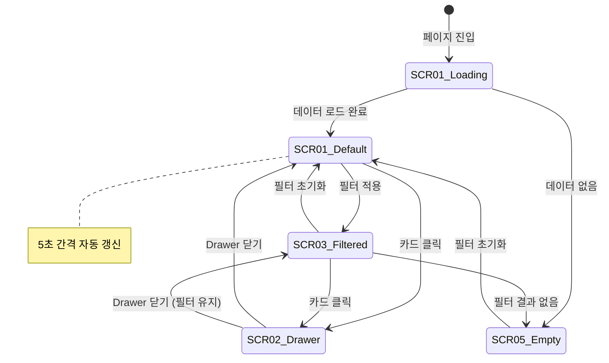

# TSK-06-10 - [샘플] 설비 모니터링 카드뷰 UI 설계

## 문서 정보

| 항목 | 내용 |
|------|------|
| Task ID | TSK-06-10 |
| 문서 버전 | 1.0 |
| 작성일 | 2026-01-22 |
| 상태 | 작성완료 |
| 카테고리 | development |
| Domain | frontend |
| PRD 참조 | PRD 4.1.1 카드뷰 샘플 |

---

## 1. 화면 목록

| 화면 ID | 화면명 | 목적 | SVG 참조 |
|---------|--------|------|----------|
| SCR-01 | 설비 모니터링 메인 | 설비 상태 카드 그리드 표시 | `ui-assets/screen-01-equipment-monitor.svg` |
| SCR-02 | 설비 상세 Drawer | 개별 설비 상세 정보 표시 | `ui-assets/screen-02-equipment-drawer.svg` |
| SCR-03 | 필터링 상태 | 필터 적용된 카드 그리드 | (SCR-01 변형) |
| SCR-04 | 로딩 상태 | 데이터 로딩 중 스켈레톤 | (SCR-01 변형) |
| SCR-05 | 빈 상태 | 필터 결과 없음 | (SCR-01 변형) |

---

## 2. 화면 전환 흐름

### 2.1 화면 전환 다이어그램



### 2.2 액션-화면 매트릭스

| 현재 화면 | 사용자 액션 | 결과 화면 | 비고 |
|----------|-------------|----------|------|
| SCR-01 Loading | 데이터 로드 완료 | SCR-01 Default | 5초 후 자동 갱신 시작 |
| SCR-01 Default | 상태 필터 선택 | SCR-03 Filtered | 해당 상태만 표시 |
| SCR-01 Default | 라인 필터 선택 | SCR-03 Filtered | 해당 라인만 표시 |
| SCR-03 Filtered | 필터 초기화 | SCR-01 Default | 전체 목록 표시 |
| SCR-03 Filtered | 결과 0건 | SCR-05 Empty | 빈 상태 표시 |
| SCR-05 Empty | 필터 초기화 클릭 | SCR-01 Default | 전체 목록 표시 |
| SCR-01/03 | 카드 클릭 | SCR-02 Drawer | 상세 정보 표시 |
| SCR-02 Drawer | 닫기 / 외부 클릭 | 이전 화면 | 필터 상태 유지 |
| SCR-02 Drawer | ESC 키 | 이전 화면 | 키보드 네비게이션 |

---

## 3. 화면별 상세

### 3.1 SCR-01: 설비 모니터링 메인

**화면 목적:**
설비 상태를 카드 그리드 형태로 시각화하여 한눈에 전체 설비 현황을 파악할 수 있도록 함.

**레이아웃:**
```
+---------------------------------------------------------------------------------+
|  설비 모니터링                                          마지막 갱신: 14:30:25   |
|                                                                                  |
|  +---------------------------------------------------------------------------+  |
|  |  필터 영역                                                                 |  |
|  |  상태: [전체      v]    라인: [전체      v]               [초기화]         |  |
|  +---------------------------------------------------------------------------+  |
|                                                                                  |
|  +---------------------------------------------------------------------------+  |
|  |  요약 정보                                                                 |  |
|  |  +-------------+  +-------------+  +-------------+  +-------------+        |  |
|  |  |   가동 12   |  |   정지 3    |  |   고장 1    |  |   점검 2    |        |  |
|  |  +-------------+  +-------------+  +-------------+  +-------------+        |  |
|  +---------------------------------------------------------------------------+  |
|                                                                                  |
|  +---------------------------------------------------------------------------+  |
|  |  카드 그리드 (Row/Col 반응형)                                              |  |
|  |                                                                            |  |
|  |  +------------+  +------------+  +------------+  +------------+            |  |
|  |  | CNC-001    |  | CNC-002    |  | PRESS-001  |  | PRESS-002  |            |  |
|  |  | [가동]     |  | [정지]     |  | [가동]     |  | [고장]     |            |  |
|  |  | Line A     |  | Line A     |  | Line B     |  | Line B     |            |  |
|  |  | 85%        |  | --         |  | 92%        |  | Error      |            |  |
|  |  +------------+  +------------+  +------------+  +------------+            |  |
|  |                                                                            |  |
|  |  +------------+  +------------+  +------------+  +------------+            |  |
|  |  | ROBOT-001  |  | ROBOT-002  |  | INSP-001   |  | INSP-002   |            |  |
|  |  | [가동]     |  | [점검]     |  | [가동]     |  | [가동]     |            |  |
|  |  | Line C     |  | Line C     |  | Line D     |  | Line D     |            |  |
|  |  | 78%        |  | 보수중     |  | 95%        |  | 88%        |            |  |
|  |  +------------+  +------------+  +------------+  +------------+            |  |
|  |                                                                            |  |
|  +---------------------------------------------------------------------------+  |
+---------------------------------------------------------------------------------+
```

**컴포넌트 목록:**

| 컴포넌트 | Ant Design | Props/설정 | 비고 |
|----------|------------|-----------|------|
| 페이지 제목 | Typography.Title | level=4 | "설비 모니터링" |
| 갱신 시간 | Typography.Text | type="secondary" | 실시간 갱신 |
| 필터 Card | Card | size="small" | 필터 영역 |
| 상태 Select | Select | mode="default", allowClear | 상태별 필터 |
| 라인 Select | Select | mode="default", allowClear | 라인별 필터 |
| 초기화 Button | Button | type="default" | onClick=handleReset |
| 요약 Statistic | Statistic | valueStyle={{ color }} | 상태별 개수 |
| 카드 그리드 | Row, Col | gutter=[16, 16] | 반응형 그리드 |
| 설비 카드 | EquipmentCard | custom component | 개별 설비 카드 |

**상태 관리:**

| 상태 | 타입 | 초기값 | 설명 |
|------|------|--------|------|
| equipment | Equipment[] | [] | 전체 설비 목록 |
| filteredEquipment | Equipment[] | [] | 필터링된 목록 |
| loading | boolean | true | 로딩 상태 |
| statusFilter | EquipmentStatus \| null | null | 상태 필터 |
| lineFilter | string \| null | null | 라인 필터 |
| selectedEquipment | Equipment \| null | null | 선택된 설비 |
| drawerOpen | boolean | false | Drawer 열림 상태 |
| lastUpdated | Date | null | 마지막 갱신 시간 |

**액션:**

| 액션 | 트리거 | 결과 | 조건 |
|------|--------|------|------|
| 데이터 로드 | 페이지 진입 | equipment 상태 업데이트 | - |
| 자동 갱신 | 5초 타이머 | 데이터 리로드 | 페이지 활성 상태 |
| 상태 필터 | Select 변경 | filteredEquipment 업데이트 | - |
| 라인 필터 | Select 변경 | filteredEquipment 업데이트 | - |
| 필터 초기화 | 버튼 클릭 | 모든 필터 해제 | - |
| 카드 클릭 | 카드 클릭 | Drawer 열기 + 상세 표시 | - |
| Drawer 닫기 | 닫기/외부 클릭/ESC | drawerOpen=false | - |

---

### 3.2 SCR-02: 설비 상세 Drawer

**화면 목적:**
선택한 설비의 상세 정보를 Drawer 컴포넌트로 표시.

**레이아웃:**
```
                                                +-------------------------------+
                                                |  CNC-001 상세 정보       [X]  |
                                                |-------------------------------|
                                                |                               |
                                                |  +-------------------------+  |
                                                |  |    [   가동 중   ]      |  |
                                                |  |    녹색 배경 Badge      |  |
                                                |  +-------------------------+  |
                                                |                               |
                                                |  기본 정보                    |
                                                |  +-------------------------+  |
                                                |  | 설비코드    | CNC-001   |  |
                                                |  | 설비명      | CNC 선반 1|  |
                                                |  | 설비유형    | CNC       |  |
                                                |  | 생산라인    | Line A    |  |
                                                |  | 위치        | A동 1층   |  |
                                                |  +-------------------------+  |
                                                |                               |
                                                |  운영 정보                    |
                                                |  +-------------------------+  |
                                                |  | 현재 상태   | 가동       |  |
                                                |  | 가동률      | 85%        |  |
                                                |  | 금일 생산   | 1,250 EA   |  |
                                                |  | 목표 생산   | 1,500 EA   |  |
                                                |  | 달성률      | 83.3%      |  |
                                                |  +-------------------------+  |
                                                |                               |
                                                |  상태 이력 (최근 5건)         |
                                                |  +-------------------------+  |
                                                |  | 14:25 | 가동 시작      |  |
                                                |  | 12:30 | 점심 정지      |  |
                                                |  | 08:00 | 가동 시작      |  |
                                                |  | 어제  | 일일 점검      |  |
                                                |  | 어제  | 가동 종료      |  |
                                                |  +-------------------------+  |
                                                |                               |
                                                |           [닫기]              |
                                                +-------------------------------+
```

**컴포넌트 목록:**

| 컴포넌트 | Ant Design | Props/설정 | 비고 |
|----------|------------|-----------|------|
| Drawer | Drawer | width=400, placement="right" | 우측 슬라이드 |
| 상태 Badge | Badge | status, text | 상태별 색상 |
| 기본 정보 | Descriptions | column=1, bordered, size="small" | - |
| 운영 정보 | Descriptions | column=1, bordered, size="small" | - |
| 달성률 Progress | Progress | percent, strokeColor | 시각화 |
| 상태 이력 | Timeline | items | 최근 5건 |
| 닫기 Button | Button | type="primary", block | - |

**Props:**

```typescript
interface EquipmentDrawerProps {
  open: boolean;
  equipment: Equipment | null;
  onClose: () => void;
}

interface Equipment {
  id: string;
  code: string;
  name: string;
  type: string;
  line: string;
  location: string;
  status: EquipmentStatus;
  operationRate: number;
  todayProduction: number;
  targetProduction: number;
  statusHistory: StatusHistoryItem[];
}

type EquipmentStatus = 'RUNNING' | 'STOPPED' | 'FAULT' | 'MAINTENANCE';

interface StatusHistoryItem {
  timestamp: string;
  status: EquipmentStatus;
  description: string;
}
```

---

### 3.3 SCR-03: 필터링 상태 (SCR-01 변형)

**화면 변화:**
- 필터 Select에 선택된 값 표시
- 카드 그리드에 필터링된 결과만 표시
- 요약 정보는 전체 기준 유지 (필터와 무관)

**필터 옵션:**

| 필터 | 옵션 | 비고 |
|------|------|------|
| 상태 | 전체, 가동, 정지, 고장, 점검 | allowClear로 전체 선택 |
| 라인 | 전체, Line A, Line B, Line C, Line D | 동적 로드 가능 |

---

### 3.4 SCR-04: 로딩 상태 (SCR-01 변형)

**레이아웃:**
```
+---------------------------------------------------------------------------------+
|  설비 모니터링                                                                   |
|                                                                                  |
|  +---------------------------------------------------------------------------+  |
|  |  [Skeleton 필터 영역]                                                      |  |
|  +---------------------------------------------------------------------------+  |
|                                                                                  |
|  +---------------------------------------------------------------------------+  |
|  |  +-------------+  +-------------+  +-------------+  +-------------+        |  |
|  |  | [Skeleton]  |  | [Skeleton]  |  | [Skeleton]  |  | [Skeleton]  |        |  |
|  |  +-------------+  +-------------+  +-------------+  +-------------+        |  |
|  +---------------------------------------------------------------------------+  |
|                                                                                  |
|  +---------------------------------------------------------------------------+  |
|  |  +------------+  +------------+  +------------+  +------------+            |  |
|  |  | [Skeleton] |  | [Skeleton] |  | [Skeleton] |  | [Skeleton] |            |  |
|  |  | Card       |  | Card       |  | Card       |  | Card       |            |  |
|  |  +------------+  +------------+  +------------+  +------------+            |  |
|  +---------------------------------------------------------------------------+  |
+---------------------------------------------------------------------------------+
```

**컴포넌트:**
- Card + Skeleton: `<Card><Skeleton active /></Card>` 패턴 사용
- 카드 개수: 최초 8개 스켈레톤 표시

---

### 3.5 SCR-05: 빈 상태 (SCR-01 변형)

**레이아웃:**
```
+---------------------------------------------------------------------------------+
|  설비 모니터링                                          마지막 갱신: 14:30:25   |
|                                                                                  |
|  +---------------------------------------------------------------------------+  |
|  |  상태: [고장      v]    라인: [Line E    v]               [초기화]         |  |
|  +---------------------------------------------------------------------------+  |
|                                                                                  |
|  +---------------------------------------------------------------------------+  |
|  |                                                                            |  |
|  |                            [Empty Icon]                                    |  |
|  |                                                                            |  |
|  |                    조건에 맞는 설비가 없습니다                              |  |
|  |                  필터 조건을 변경하거나 초기화해주세요                       |  |
|  |                                                                            |  |
|  |                         [필터 초기화]                                       |  |
|  |                                                                            |  |
|  +---------------------------------------------------------------------------+  |
+---------------------------------------------------------------------------------+
```

**컴포넌트:**
- Empty: `<Empty description="조건에 맞는 설비가 없습니다" />`
- 초기화 Button: `type="primary"`, `onClick=handleReset`

---

## 4. 공통 컴포넌트

### 4.1 EquipmentCard (설비 카드)

**용도:** 개별 설비 상태를 카드 형태로 표시

**레이아웃:**
```
+---------------------------+
|  CNC-001          [Badge] |
|  CNC 선반 1호기            |
|---------------------------|
|  Line A                   |
|  가동률: 85%              |
|  [===========    ] 85%    |
+---------------------------+
```

**Props:**
```typescript
interface EquipmentCardProps {
  equipment: Equipment;
  onClick: (equipment: Equipment) => void;
}
```

**상태별 스타일:**

| 상태 | 영문 코드 | Badge Status | 배경색 (Light) | 배경색 (Dark) | 테두리 색상 |
|------|----------|--------------|----------------|---------------|------------|
| 가동 | RUNNING | success | #F6FFED | #162312 | #52C41A |
| 정지 | STOPPED | default | #FAFAFA | #262626 | #8C8C8C |
| 고장 | FAULT | error | #FFF2F0 | #2A1215 | #FF4D4F |
| 점검 | MAINTENANCE | warning | #FFFBE6 | #2B2111 | #FAAD14 |

**컴포넌트 구조:**
```typescript
// components/sample/EquipmentCard.tsx
interface EquipmentCardProps {
  equipment: Equipment;
  onClick: (equipment: Equipment) => void;
}

const statusConfig: Record<EquipmentStatus, {
  label: string;
  badgeStatus: 'success' | 'default' | 'error' | 'warning';
  color: string;
}> = {
  RUNNING: { label: '가동', badgeStatus: 'success', color: '#52C41A' },
  STOPPED: { label: '정지', badgeStatus: 'default', color: '#8C8C8C' },
  FAULT: { label: '고장', badgeStatus: 'error', color: '#FF4D4F' },
  MAINTENANCE: { label: '점검', badgeStatus: 'warning', color: '#FAAD14' },
};
```

### 4.2 StatusSummary (상태 요약)

**용도:** 상태별 설비 개수를 시각화

**레이아웃:**
```
+-------------+  +-------------+  +-------------+  +-------------+
| [G] 가동    |  | [--] 정지   |  | [!] 고장    |  | [W] 점검    |
|     12      |  |     3       |  |     1       |  |     2       |
+-------------+  +-------------+  +-------------+  +-------------+
```

**Props:**
```typescript
interface StatusSummaryProps {
  counts: {
    RUNNING: number;
    STOPPED: number;
    FAULT: number;
    MAINTENANCE: number;
  };
}
```

---

## 5. 반응형 설계

### 5.1 Breakpoint 정의

| Breakpoint | Ant Design | 화면 너비 | 카드 컬럼 수 |
|------------|------------|----------|-------------|
| XS | xs | 0-575px | 1 |
| SM | sm | 576-767px | 2 |
| MD | md | 768-991px | 3 |
| LG | lg | 992px+ | 4 |
| XL | xl | 1200px+ | 4 |
| XXL | xxl | 1600px+ | 4 |

### 5.2 그리드 설정

```typescript
// 반응형 Col 설정
const colSpan = {
  xs: 24,    // 1열 (24/24)
  sm: 12,    // 2열 (24/12)
  md: 8,     // 3열 (24/8)
  lg: 6,     // 4열 (24/6)
};

// Row gutter (간격)
const gutter: [number, number] = [16, 16]; // [가로, 세로]
```

### 5.3 필터 영역 반응형

| Breakpoint | 필터 레이아웃 | 버튼 위치 |
|------------|--------------|----------|
| XS | 수직 스택 (1열) | 하단 전체 너비 |
| SM | 수평 (2열) | 우측 정렬 |
| MD+ | 수평 (3열) | 우측 정렬 |

```typescript
// 필터 영역 반응형
<Row gutter={[16, 16]}>
  <Col xs={24} sm={8}>
    <Select placeholder="상태" />
  </Col>
  <Col xs={24} sm={8}>
    <Select placeholder="라인" />
  </Col>
  <Col xs={24} sm={8} className="text-right">
    <Button>초기화</Button>
  </Col>
</Row>
```

### 5.4 Drawer 반응형

| Breakpoint | Drawer 너비 |
|------------|------------|
| XS | 100% (전체 화면) |
| SM | 320px |
| MD+ | 400px |

---

## 6. 상태별 색상 정의

### 6.1 설비 상태 색상 토큰

| 상태 | CSS Variable | Light Mode | Dark Mode |
|------|-------------|------------|-----------|
| 가동 (RUNNING) | --color-status-running | #52C41A | #52C41A |
| 정지 (STOPPED) | --color-status-stopped | #8C8C8C | #8C8C8C |
| 고장 (FAULT) | --color-status-fault | #FF4D4F | #FF4D4F |
| 점검 (MAINTENANCE) | --color-status-maintenance | #FAAD14 | #FAAD14 |

### 6.2 Ant Design Token 매핑

```typescript
// lib/theme/tokens.ts 에 추가
export const equipmentStatusColors = {
  running: {
    color: '#52C41A',
    bg: 'rgba(82, 196, 26, 0.1)',
    border: '#52C41A',
  },
  stopped: {
    color: '#8C8C8C',
    bg: 'rgba(140, 140, 140, 0.1)',
    border: '#8C8C8C',
  },
  fault: {
    color: '#FF4D4F',
    bg: 'rgba(255, 77, 79, 0.1)',
    border: '#FF4D4F',
  },
  maintenance: {
    color: '#FAAD14',
    bg: 'rgba(250, 173, 20, 0.1)',
    border: '#FAAD14',
  },
};
```

---

## 7. 접근성

### 7.1 키보드 네비게이션

| 키 | 동작 | 컨텍스트 |
|----|------|---------|
| Tab | 다음 카드/요소로 이동 | 카드 그리드 |
| Shift+Tab | 이전 카드/요소로 이동 | 카드 그리드 |
| Enter | 카드 선택 (Drawer 열기) | 카드 포커스 |
| Space | 카드 선택 (Drawer 열기) | 카드 포커스 |
| Escape | Drawer 닫기 | Drawer 열림 상태 |
| Arrow Keys | 필터 옵션 이동 | Select 열림 상태 |

### 7.2 ARIA 속성

| 요소 | ARIA 속성 | 값 |
|------|----------|-----|
| 카드 그리드 | role | "grid" |
| 설비 카드 | role | "button" |
| 설비 카드 | aria-label | "{설비명} - {상태}" |
| 설비 카드 | tabindex | "0" |
| 상태 필터 | aria-label | "상태로 필터링" |
| 라인 필터 | aria-label | "라인으로 필터링" |
| Drawer | aria-label | "설비 상세 정보" |
| 닫기 버튼 | aria-label | "상세 정보 닫기" |

### 7.3 색상 대비

| 요소 | 전경색 | 배경색 | 대비율 | WCAG |
|------|--------|--------|--------|------|
| 가동 텍스트 | #52C41A | #FFFFFF | 3.0:1 | AA (Large) |
| 정지 텍스트 | #8C8C8C | #FFFFFF | 3.5:1 | AA (Large) |
| 고장 텍스트 | #FF4D4F | #FFFFFF | 3.9:1 | AA (Large) |
| 점검 텍스트 | #FAAD14 | #FFFFFF | 2.1:1 | - |
| 카드 제목 | #0F172A | #FFFFFF | 15.7:1 | AAA |
| 보조 텍스트 | #475569 | #FFFFFF | 7.0:1 | AAA |

**색상 접근성 보완:**
- 상태를 색상뿐 아니라 텍스트 라벨로도 표시
- Badge 아이콘으로 상태 구분 추가
- 고대비 모드 지원 고려

### 7.4 스크린 리더 지원

```typescript
// 카드 aria-label 예시
<Card
  aria-label={`${equipment.name}, 현재 상태: ${statusLabel}, 가동률: ${equipment.operationRate}%`}
  tabIndex={0}
  role="button"
  onKeyDown={(e) => {
    if (e.key === 'Enter' || e.key === ' ') {
      onClick(equipment);
    }
  }}
>
```

---

## 8. 실시간 갱신

### 8.1 갱신 전략

| 항목 | 설정 | 비고 |
|------|------|------|
| 갱신 주기 | 5초 | setInterval |
| 갱신 시점 | 페이지 활성 시 | visibilitychange 이벤트 연동 |
| 애니메이션 | 값 변경 시 하이라이트 | 선택적 |

### 8.2 구현 패턴

```typescript
// 실시간 갱신 훅
useEffect(() => {
  const fetchData = async () => {
    const data = await loadEquipmentData();
    setEquipment(data);
    setLastUpdated(new Date());
  };

  fetchData(); // 초기 로드

  const interval = setInterval(fetchData, 5000); // 5초 간격

  // 페이지 비활성 시 갱신 중지
  const handleVisibilityChange = () => {
    if (document.hidden) {
      clearInterval(interval);
    } else {
      fetchData();
    }
  };
  document.addEventListener('visibilitychange', handleVisibilityChange);

  return () => {
    clearInterval(interval);
    document.removeEventListener('visibilitychange', handleVisibilityChange);
  };
}, []);
```

---

## 9. Mock 데이터 구조

### 9.1 데이터 파일 경로

`mes-portal/mock-data/equipment.json`

### 9.2 데이터 스키마

```typescript
interface EquipmentData {
  equipment: Equipment[];
  lines: Line[];
  statusHistory: Record<string, StatusHistoryItem[]>;
}

interface Equipment {
  id: string;
  code: string;
  name: string;
  type: string;
  line: string;
  location: string;
  status: EquipmentStatus;
  operationRate: number;
  todayProduction: number;
  targetProduction: number;
}

interface Line {
  id: string;
  code: string;
  name: string;
}

interface StatusHistoryItem {
  timestamp: string;
  status: EquipmentStatus;
  description: string;
}
```

### 9.3 샘플 데이터

```json
{
  "equipment": [
    {
      "id": "eq-001",
      "code": "CNC-001",
      "name": "CNC 선반 1호기",
      "type": "CNC",
      "line": "LINE-A",
      "location": "A동 1층",
      "status": "RUNNING",
      "operationRate": 85,
      "todayProduction": 1250,
      "targetProduction": 1500
    }
  ],
  "lines": [
    { "id": "LINE-A", "code": "LINE-A", "name": "Line A" }
  ]
}
```

---

## 10. SVG 파일 목록

| 파일명 | 화면 | 크기 | 상태 |
|--------|------|------|------|
| `screen-01-equipment-monitor.svg` | 설비 모니터링 메인 | 1200x800 | 생성 예정 |
| `screen-02-equipment-drawer.svg` | 설비 상세 Drawer | 500x800 | 생성 예정 |

---

## 11. 파일 구조

```
mes-portal/
├── screens/
│   └── sample/
│       └── EquipmentMonitor.tsx      # 메인 화면 컴포넌트
├── components/
│   └── sample/
│       ├── EquipmentCard.tsx         # 설비 카드 컴포넌트
│       ├── EquipmentDrawer.tsx       # 설비 상세 Drawer
│       ├── StatusSummary.tsx         # 상태 요약 컴포넌트
│       └── EquipmentFilter.tsx       # 필터 컴포넌트
└── mock-data/
    └── equipment.json                # Mock 데이터
```

---

## 변경 이력

| 버전 | 일자 | 작성자 | 변경 내용 |
|------|------|--------|----------|
| 1.0 | 2026-01-22 | Claude | 최초 작성 |
