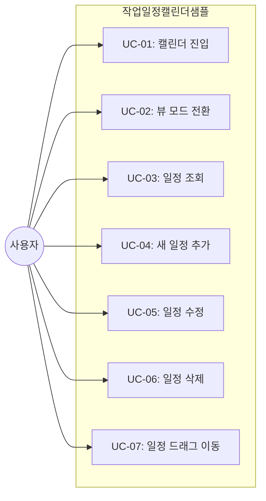
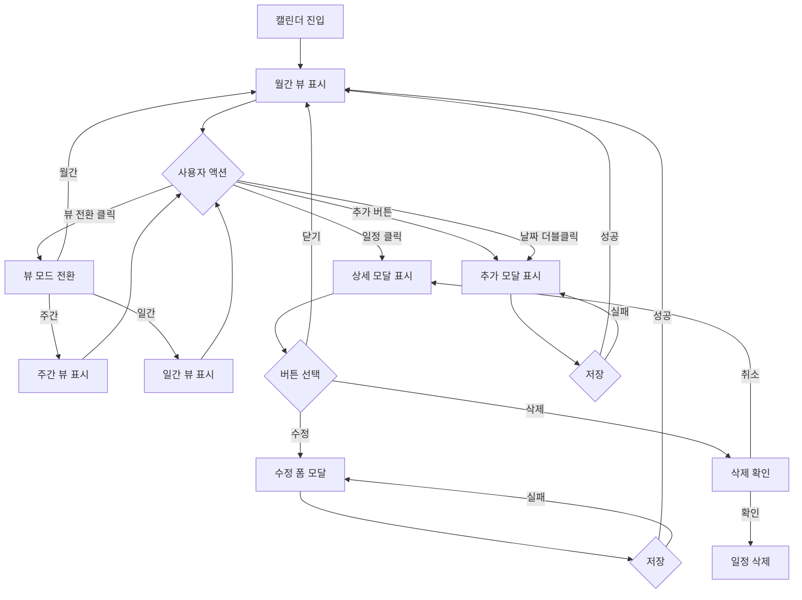

# TSK-06-11 - [샘플] 작업 일정 캘린더 설계 문서

## 문서 정보

| 항목 | 내용 |
|------|------|
| Task ID | TSK-06-11 |
| 문서 버전 | 1.0 |
| 작성일 | 2026-01-22 |
| 상태 | 설계중 |
| 카테고리 | development |

---

## 1. 개요

### 1.1 배경 및 문제 정의

**현재 상황:**
- MES Portal에서 캘린더 패턴의 실제 사용 예시가 필요함
- PRD에서 "작업 일정 캘린더 샘플"을 통한 캘린더 패턴 검증 요구
- 제조 현장에서 작업 일정 관리는 핵심 기능 중 하나

**해결하려는 문제:**
- 캘린더 UI/UX 패턴 검증 (월간/주간/일간 뷰 전환)
- 일정 CRUD 기능 검증 (조회, 추가, 수정, 삭제)
- 일정 시각화 패턴 검증 (색상 구분, 이벤트 표시)
- 개발자가 참고할 수 있는 캘린더 사용 예시 코드 제공
- Mock JSON 데이터 기반 화면 동작 검증

### 1.2 목적 및 기대 효과

**목적:**
- 캘린더 기반 일정 관리 샘플 화면 구현
- 월간/주간/일간 뷰 전환 기능 검증
- Mock 데이터(`mock-data/schedule.json`) 기반 화면 동작 검증

**기대 효과:**
- 사용자 관점: 작업 일정을 직관적으로 파악하고 관리
- 개발자 관점: 캘린더 패턴 사용 방법 참고 코드 제공
- QA 관점: 캘린더 기능 테스트를 위한 테스트 베드 확보

### 1.3 범위

**포함:**
- 작업 일정 캘린더 샘플 화면 구현 (`screens/sample/WorkCalendar.tsx`)
- 월간/주간/일간 뷰 전환
- 작업 일정 표시 (유형별 색상 구분)
- 일정 클릭 시 상세 정보 팝업
- 새 일정 추가/수정/삭제 모달
- 드래그로 일정 이동 (선택 기능)
- Mock 데이터 파일 (`mock-data/schedule.json`)

**제외:**
- 실제 API 연동 (Mock 데이터 사용)
- 데이터베이스 저장 (저장 시뮬레이션만)
- 반복 일정 설정
- 알림/리마인더 기능
- 참석자 관리

### 1.4 참조 문서

| 문서 | 경로 | 관련 섹션 |
|------|------|----------|
| PRD | `.orchay/projects/mes-portal/prd.md` | 4.1.1 특수 패턴 샘플 - 작업 일정 캘린더 |
| TRD | `.orchay/projects/mes-portal/trd.md` | 7. PRD 요구사항 - 기타 기능 (dayjs) |
| WBS | `.orchay/projects/mes-portal/wbs.yaml` | TSK-06-11 |

---

## 2. 사용자 분석

### 2.1 대상 사용자

| 사용자 유형 | 특성 | 주요 니즈 |
|------------|------|----------|
| 생산 관리자 | 작업 일정 계획 및 관리 담당 | 전체 작업 일정 한눈에 파악, 일정 조정 |
| 현장 작업자 | 할당된 작업 확인 | 자신의 작업 일정 확인 |
| 개발자 | 캘린더 패턴 사용자 | 캘린더 구현 방법 학습, 참고 코드 |
| QA 엔지니어 | 캘린더 기능 검증 | 캘린더 기능 테스트 |

### 2.2 사용자 페르소나

**페르소나 1: 생산 관리자 김계획**
- 역할: 생산 라인 작업 일정 계획 담당
- 목표: 월간 작업 일정을 효율적으로 배치하고 관리
- 불만: 엑셀로 일정 관리 시 한눈에 파악하기 어려움
- 시나리오: 캘린더에서 월간 일정 확인 후 신규 작업 추가

**페르소나 2: 현장 작업자 박현장**
- 역할: 생산 라인 작업 수행
- 목표: 오늘/이번 주 할당된 작업 확인
- 불만: 자신의 작업 일정을 빠르게 확인하기 어려움
- 시나리오: 일간 뷰에서 오늘 작업 일정 확인

**페르소나 3: 프론트엔드 개발자 이개발**
- 역할: MES Portal 화면 개발
- 목표: 캘린더 컴포넌트 사용 방법 이해
- 불만: 캘린더 구현 시 참고할 예시 부족
- 시나리오: 샘플 코드를 참고하여 새 캘린더 화면 구현

---

## 3. 유즈케이스

### 3.1 유즈케이스 다이어그램



### 3.2 유즈케이스 상세

#### UC-01: 캘린더 진입

| 항목 | 내용 |
|------|------|
| 액터 | 일반 사용자 |
| 목적 | 작업 일정 캘린더 화면 접근 |
| 사전 조건 | 메뉴에서 작업 일정 캘린더 접근 가능 |
| 사후 조건 | 월간 뷰 캘린더 표시, 현재 월 일정 로드 |
| 트리거 | 메뉴 클릭 또는 MDI 탭 열기 |

**기본 흐름:**
1. 사용자가 사이드바 메뉴에서 "작업 일정 캘린더" 클릭
2. MDI 탭에 작업 일정 캘린더 화면 열림
3. 기본 월간 뷰로 캘린더 렌더링
4. 현재 월의 일정 데이터 로드 (Mock)
5. 캘린더에 일정 이벤트 표시

#### UC-02: 뷰 모드 전환

| 항목 | 내용 |
|------|------|
| 액터 | 일반 사용자 |
| 목적 | 캘린더 보기 방식 변경 |
| 사전 조건 | 캘린더 화면 표시 중 |
| 사후 조건 | 선택한 뷰 모드로 캘린더 렌더링 |
| 트리거 | 뷰 모드 버튼 클릭 |

**기본 흐름:**
1. 사용자가 뷰 모드 토글 버튼 그룹 확인 (월간/주간/일간)
2. 원하는 뷰 모드 버튼 클릭
3. 캘린더가 선택한 뷰 모드로 전환
4. 해당 기간의 일정 데이터 표시

**대안 흐름:**
- 1a. 네비게이션 버튼으로 이전/다음 기간 이동
  - 이전(<) 버튼: 이전 월/주/일로 이동
  - 다음(>) 버튼: 다음 월/주/일로 이동
  - 오늘 버튼: 현재 날짜로 이동

#### UC-03: 일정 조회 (상세 팝업)

| 항목 | 내용 |
|------|------|
| 액터 | 일반 사용자 |
| 목적 | 특정 일정의 상세 정보 확인 |
| 사전 조건 | 캘린더에 일정 이벤트 표시 중 |
| 사후 조건 | 상세 정보 모달 표시 |
| 트리거 | 일정 이벤트 클릭 |

**기본 흐름:**
1. 사용자가 캘린더의 일정 이벤트 클릭
2. 일정 상세 모달 표시
3. 일정 정보 표시 (제목, 유형, 시작/종료, 설명 등)
4. 수정/삭제 버튼 표시
5. 모달 외부 클릭 또는 닫기 버튼 클릭 시 모달 닫힘

#### UC-04: 새 일정 추가

| 항목 | 내용 |
|------|------|
| 액터 | 일반 사용자 |
| 목적 | 새로운 작업 일정 등록 |
| 사전 조건 | 캘린더 화면 표시 중 |
| 사후 조건 | 새 일정이 캘린더에 추가됨 |
| 트리거 | 일정 추가 버튼 클릭 또는 날짜 셀 더블클릭 |

**기본 흐름:**
1. 사용자가 [일정 추가] 버튼 클릭 또는 빈 날짜 셀 더블클릭
2. 일정 추가 모달 표시
3. 일정 정보 입력 (제목, 유형, 시작일시, 종료일시, 설명)
4. [저장] 버튼 클릭
5. 유효성 검사 수행
6. 검사 통과 시 일정 추가 (Mock 시뮬레이션)
7. 성공 메시지 표시 및 캘린더 갱신
8. 모달 닫힘

**예외 흐름:**
- 5a. 유효성 검사 실패 시:
  - 에러 필드에 에러 메시지 표시
  - 첫 번째 에러 필드에 포커스
  - 저장하지 않음

#### UC-05: 일정 수정

| 항목 | 내용 |
|------|------|
| 액터 | 일반 사용자 |
| 목적 | 기존 일정 정보 변경 |
| 사전 조건 | 일정 상세 모달 표시 중 |
| 사후 조건 | 일정 정보 업데이트 |
| 트리거 | 수정 버튼 클릭 |

**기본 흐름:**
1. 일정 상세 모달에서 [수정] 버튼 클릭
2. 상세 모달이 수정 폼 모달로 전환
3. 기존 데이터가 폼에 채워짐
4. 사용자가 정보 수정
5. [저장] 버튼 클릭
6. 유효성 검사 및 저장 (Mock 시뮬레이션)
7. 성공 메시지 표시 및 캘린더 갱신

#### UC-06: 일정 삭제

| 항목 | 내용 |
|------|------|
| 액터 | 일반 사용자 |
| 목적 | 기존 일정 삭제 |
| 사전 조건 | 일정 상세 모달 표시 중 |
| 사후 조건 | 일정 삭제 |
| 트리거 | 삭제 버튼 클릭 |

**기본 흐름:**
1. 일정 상세 모달에서 [삭제] 버튼 클릭
2. 삭제 확인 다이얼로그 표시
3. [확인] 클릭 시 일정 삭제 (Mock 시뮬레이션)
4. 성공 메시지 표시 및 캘린더 갱신
5. 모달 닫힘

**대안 흐름:**
- 3a. [취소] 클릭 시 다이얼로그 닫히고 상세 모달 유지

#### UC-07: 일정 드래그 이동 (선택 기능)

| 항목 | 내용 |
|------|------|
| 액터 | 일반 사용자 |
| 목적 | 일정 날짜/시간 변경 |
| 사전 조건 | 캘린더에 일정 이벤트 표시 중 |
| 사후 조건 | 일정 날짜/시간 업데이트 |
| 트리거 | 일정 이벤트 드래그 |

**기본 흐름:**
1. 사용자가 일정 이벤트를 드래그
2. 드래그 중 시각적 피드백 (반투명 효과)
3. 원하는 날짜/시간에 드롭
4. 일정 날짜/시간 업데이트 (Mock 시뮬레이션)
5. 캘린더 갱신

**참고:** 드래그 이동은 선택 기능으로, Ant Design Calendar의 기본 기능이 아니므로 구현 여부는 시간에 따라 결정

---

## 4. 사용자 시나리오

### 4.1 시나리오 1: 월간 일정 확인 및 새 일정 추가

**상황 설명:**
생산 관리자 김계획이 이번 달 작업 일정을 확인하고 새로운 작업 일정을 추가한다.

**단계별 진행:**

| 단계 | 사용자 행동 | 시스템 반응 | 사용자 기대 |
|------|-----------|------------|------------|
| 1 | 메뉴에서 "작업 일정 캘린더" 클릭 | MDI 탭에 화면 열림, 월간 캘린더 표시 | 전체 일정 한눈에 파악 |
| 2 | 캘린더에서 일정 확인 | 유형별 색상으로 일정 표시 | 일정 구분 용이 |
| 3 | [일정 추가] 버튼 클릭 | 일정 추가 모달 열림 | 폼 입력 가능 |
| 4 | 제목 "A라인 정기점검" 입력 | 입력값 표시 | 즉각 피드백 |
| 5 | 일정 유형 "정기점검" 선택 | 선택값 표시 | - |
| 6 | 시작일 "2026-01-25 09:00" 선택 | 날짜/시간 설정 | - |
| 7 | 종료일 "2026-01-25 12:00" 선택 | 날짜/시간 설정 | - |
| 8 | 설명 입력 | 입력값 표시 | - |
| 9 | [저장] 클릭 | 로딩 후 성공 메시지, 캘린더에 새 일정 표시 | 저장 완료 확인 |

**성공 조건:**
- 모달 폼 정상 입력
- 유효성 검사 통과
- 캘린더에 새 일정 표시

### 4.2 시나리오 2: 일정 상세 확인 및 수정

**상황 설명:**
사용자가 기존 일정을 클릭하여 상세 정보를 확인하고 시간을 변경한다.

**단계별 진행:**

| 단계 | 사용자 행동 | 시스템 반응 | 사용자 기대 |
|------|-----------|------------|------------|
| 1 | 캘린더의 일정 이벤트 클릭 | 상세 모달 표시 | 일정 정보 확인 |
| 2 | 상세 정보 확인 | 제목, 유형, 시간, 설명 표시 | - |
| 3 | [수정] 버튼 클릭 | 수정 폼 모달로 전환 | 기존 데이터 유지 |
| 4 | 종료 시간 "15:00"으로 변경 | 시간 갱신 | - |
| 5 | [저장] 클릭 | 저장 후 성공 메시지 | 수정 반영 |
| 6 | 캘린더 확인 | 변경된 일정 시간 표시 | 수정 완료 |

### 4.3 시나리오 3: 뷰 모드 전환

**상황 설명:**
현장 작업자 박현장이 오늘 작업 일정만 상세히 확인하기 위해 일간 뷰로 전환한다.

**단계별 진행:**

| 단계 | 사용자 행동 | 시스템 반응 | 사용자 기대 |
|------|-----------|------------|------------|
| 1 | 월간 뷰 캘린더 확인 | 월간 캘린더 표시 | - |
| 2 | [일간] 버튼 클릭 | 일간 뷰로 전환, 시간대별 일정 표시 | 상세 시간 확인 |
| 3 | 오늘 일정 확인 | 시간대별로 일정 블록 표시 | 작업 순서 파악 |
| 4 | [주간] 버튼 클릭 | 주간 뷰로 전환 | 이번 주 일정 파악 |
| 5 | 다음 주 버튼(>) 클릭 | 다음 주 일정 표시 | 다음 주 계획 확인 |

### 4.4 시나리오 4: 일정 삭제

**상황 설명:**
사용자가 취소된 작업 일정을 삭제한다.

**단계별 진행:**

| 단계 | 사용자 행동 | 시스템 반응 | 복구 방법 |
|------|-----------|------------|----------|
| 1 | 삭제할 일정 클릭 | 상세 모달 표시 | - |
| 2 | [삭제] 버튼 클릭 | 확인 다이얼로그 표시 | [취소]로 복구 |
| 3 | [확인] 클릭 | 삭제 처리, 성공 메시지 | - |
| 4 | 캘린더 확인 | 해당 일정 제거됨 | - |

---

## 5. 화면 설계

### 5.1 화면 흐름도



### 5.2 화면별 상세

#### 화면 1: 캘린더 메인 화면

**화면 목적:**
작업 일정을 캘린더 형태로 시각화하여 전체 일정 파악 및 관리

**진입 경로:**
- 사이드바 메뉴 > 샘플 > 작업 일정 캘린더

**와이어프레임 (월간 뷰):**
```
+--------------------------------------------------------------------------+
|  +-----------------------------------------------------------------+     |
|  |  작업 일정 캘린더                                        [일정 추가]  |     |
|  +-----------------------------------------------------------------+     |
|                                                                           |
|  +-----------------------------------------------------------------+     |
|  |  +---------+  [<]  2026년 1월  [>]  [오늘]                        |     |
|  |  | 월간    |                                                      |     |
|  |  | 주간    |                                                      |     |
|  |  | 일간    |                                                      |     |
|  |  +---------+                                                      |     |
|  +-----------------------------------------------------------------+     |
|                                                                           |
|  +-----------------------------------------------------------------+     |
|  |  일    월    화    수    목    금    토                           |     |
|  +----+----+----+----+----+----+----+----+----+----+----+----+----+  |     |
|  | 29 | 30 | 31 |  1 |  2 |  3 |  4 |                              |  |     |
|  |    |    |    |====|    |    |    |  ==== : 작업일정 (파랑)       |  |     |
|  +----+----+----+----+----+----+----+                              |  |     |
|  |  5 |  6 |  7 |  8 |  9 | 10 | 11 |  #### : 정기점검 (주황)       |  |     |
|  |####|    |====|====|    |    |    |  ~~~~ : 긴급작업 (빨강)       |  |     |
|  +----+----+----+----+----+----+----+                              |  |     |
|  | 12 | 13 | 14 | 15 | 16 | 17 | 18 |                              |  |     |
|  |    |~~~~|    |    |    |    |    |                              |  |     |
|  +----+----+----+----+----+----+----+----+----+----+----+----+----+  |     |
|  | 19 | 20 | 21 | 22 | 23 | 24 | 25 |                              |  |     |
|  |====|    |    |    |    |    |####|                              |  |     |
|  +----+----+----+----+----+----+----+                              |  |     |
|  | 26 | 27 | 28 | 29 | 30 | 31 |  1 |                              |  |     |
|  |    |    |    |    |    |    |    |                              |  |     |
|  +----+----+----+----+----+----+----+----+----+----+----+----+----+  |     |
|  +-----------------------------------------------------------------+     |
+--------------------------------------------------------------------------+

범례:
==== : 작업일정 (파란색)
#### : 정기점검 (주황색)
~~~~ : 긴급작업 (빨간색)
```

**화면 요소 설명:**

| 영역 | 설명 | Ant Design 컴포넌트 | 사용자 인터랙션 |
|------|------|-------------------|----------------|
| 헤더 | 화면 제목 | Card title | - |
| 일정 추가 버튼 | 새 일정 추가 | Button type="primary" | 클릭 시 추가 모달 |
| 뷰 모드 토글 | 월간/주간/일간 전환 | Radio.Group | 클릭 시 뷰 전환 |
| 네비게이션 | 이전/다음/오늘 | Button.Group | 기간 이동 |
| 현재 기간 표시 | 현재 월/주/일 | Typography.Title | - |
| 캘린더 그리드 | 날짜별 셀 | Calendar (Ant Design) | 날짜 셀 클릭/더블클릭 |
| 일정 이벤트 | 일정 표시 블록 | Badge + Tag | 클릭 시 상세 모달 |
| 범례 | 유형별 색상 설명 | Tag | - |

**와이어프레임 (주간 뷰):**
```
+--------------------------------------------------------------------------+
|  +-----------------------------------------------------------------+     |
|  |  작업 일정 캘린더                                        [일정 추가]  |     |
|  +-----------------------------------------------------------------+     |
|                                                                           |
|  +-----------------------------------------------------------------+     |
|  |  +---------+  [<]  2026년 1월 3주차 (1/13 - 1/19)  [>]  [오늘]    |     |
|  |  | 월간    |                                                      |     |
|  |  | 주간 v  |                                                      |     |
|  |  | 일간    |                                                      |     |
|  |  +---------+                                                      |     |
|  +-----------------------------------------------------------------+     |
|                                                                           |
|  +-----------------------------------------------------------------+     |
|  |       | 13 월 | 14 화 | 15 수 | 16 목 | 17 금 | 18 토 | 19 일 |   |     |
|  +-------+-------+-------+-------+-------+-------+-------+-------+   |     |
|  | 08:00 |       |       |       |       |       |       |       |   |     |
|  +-------+-------+-------+-------+-------+-------+-------+-------+   |     |
|  | 09:00 | ===== | ===== |       |       |       |       |       |   |     |
|  +-------+ A라인 + A라인 +-------+-------+-------+-------+-------+   |     |
|  | 10:00 | 점검  | 점검  |       |       |       |       |       |   |     |
|  +-------+-------+-------+-------+-------+-------+-------+-------+   |     |
|  | 11:00 |       |       |       |       |       |       |       |   |     |
|  +-------+-------+-------+-------+-------+-------+-------+-------+   |     |
|  | 12:00 |       |       |       |       |       |       |       |   |     |
|  +-------+-------+-------+-------+-------+-------+-------+-------+   |     |
|  | 13:00 |       |       | ~~~~~ |       |       |       |       |   |     |
|  +-------+-------+-------+ 긴급  +-------+-------+-------+-------+   |     |
|  | 14:00 |       |       | 수리  |       |       |       |       |   |     |
|  +-------+-------+-------+-------+-------+-------+-------+-------+   |     |
|  | ... (스크롤) ...                                                  |     |
|  +-----------------------------------------------------------------+     |
+--------------------------------------------------------------------------+
```

**와이어프레임 (일간 뷰):**
```
+--------------------------------------------------------------------------+
|  +-----------------------------------------------------------------+     |
|  |  작업 일정 캘린더                                        [일정 추가]  |     |
|  +-----------------------------------------------------------------+     |
|                                                                           |
|  +-----------------------------------------------------------------+     |
|  |  +---------+  [<]  2026년 1월 22일 (수)  [>]  [오늘]              |     |
|  |  | 월간    |                                                      |     |
|  |  | 주간    |                                                      |     |
|  |  | 일간 v  |                                                      |     |
|  |  +---------+                                                      |     |
|  +-----------------------------------------------------------------+     |
|                                                                           |
|  +-----------------------------------------------------------------+     |
|  | 시간      |   일정                                                |     |
|  +-----------+---------------------------------------------------+   |     |
|  | 08:00     |                                                   |   |     |
|  +-----------+---------------------------------------------------+   |     |
|  | 09:00     | ================================================= |   |     |
|  +-----------+ B라인 생산 작업                                    +   |     |
|  | 10:00     | (09:00 - 12:00)                                   |   |     |
|  +-----------+                                                   +   |     |
|  | 11:00     |                                                   |   |     |
|  +-----------+---------------------------------------------------+   |     |
|  | 12:00     |                                                   |   |     |
|  +-----------+---------------------------------------------------+   |     |
|  | 13:00     | ================================================= |   |     |
|  +-----------+ 점심 후 회의                                       +   |     |
|  | 14:00     | (13:00 - 14:00)                                   |   |     |
|  +-----------+---------------------------------------------------+   |     |
|  | 15:00     |                                                   |   |     |
|  +-----------+---------------------------------------------------+   |     |
|  | ... (스크롤) ...                                                  |     |
|  +-----------------------------------------------------------------+     |
+--------------------------------------------------------------------------+
```

#### 화면 2: 일정 상세 모달

**화면 목적:**
선택한 일정의 상세 정보 표시 및 수정/삭제 액션 제공

**와이어프레임:**
```
+----------------------------------------------------------+
|  일정 상세                                          [X]   |
+----------------------------------------------------------+
|                                                           |
|  +-----------------------------------------------------+  |
|  |  제목          A라인 정기점검                        |  |
|  +-----------------------------------------------------+  |
|  |  유형          [정기점검]  (주황색 태그)             |  |
|  +-----------------------------------------------------+  |
|  |  시작 일시     2026-01-25 09:00                     |  |
|  +-----------------------------------------------------+  |
|  |  종료 일시     2026-01-25 12:00                     |  |
|  +-----------------------------------------------------+  |
|  |  설명          1월 정기 점검 작업. 전원 차단 후      |  |
|  |                점검 진행 예정.                       |  |
|  +-----------------------------------------------------+  |
|                                                           |
+----------------------------------------------------------+
|                              [삭제]  [수정]  [닫기]       |
+----------------------------------------------------------+
```

**화면 요소 설명:**

| 영역 | 설명 | Ant Design 컴포넌트 | 사용자 인터랙션 |
|------|------|-------------------|----------------|
| 모달 헤더 | 제목 + 닫기 버튼 | Modal | 닫기 클릭 시 모달 닫힘 |
| 정보 영역 | 일정 상세 정보 | Descriptions | 읽기 전용 |
| 유형 태그 | 일정 유형 표시 | Tag (색상 구분) | - |
| 삭제 버튼 | 일정 삭제 | Button danger | 클릭 시 확인 다이얼로그 |
| 수정 버튼 | 일정 수정 | Button | 클릭 시 수정 폼 전환 |
| 닫기 버튼 | 모달 닫기 | Button | 모달 닫기 |

#### 화면 3: 일정 추가/수정 모달

**화면 목적:**
새 일정 추가 또는 기존 일정 수정

**와이어프레임:**
```
+----------------------------------------------------------+
|  일정 추가 (또는 "일정 수정")                        [X]   |
+----------------------------------------------------------+
|                                                           |
|  +-----------------------------------------------------+  |
|  | 제목 *                                              |  |
|  | +--------------------------------------------------+|  |
|  | | A라인 정기점검                                   ||  |
|  | +--------------------------------------------------+|  |
|  +-----------------------------------------------------+  |
|                                                           |
|  +-----------------------------------------------------+  |
|  | 일정 유형 *                                         |  |
|  | +--------------------------------------------------+|  |
|  | | [작업일정 v]                                     ||  |
|  | +--------------------------------------------------+|  |
|  +-----------------------------------------------------+  |
|                                                           |
|  +-------------------------+  +-------------------------+  |
|  | 시작 일시 *             |  | 종료 일시 *             |  |
|  | +---------------------+ |  | +---------------------+ |  |
|  | | 2026-01-25 09:00    | |  | | 2026-01-25 12:00    | |  |
|  | +---------------------+ |  | +---------------------+ |  |
|  +-------------------------+  +-------------------------+  |
|                                                           |
|  +-----------------------------------------------------+  |
|  | 설명                                                |  |
|  | +--------------------------------------------------+|  |
|  | | 점검 내용을 입력하세요...                        ||  |
|  | |                                                  ||  |
|  | +--------------------------------------------------+|  |
|  +-----------------------------------------------------+  |
|                                                           |
+----------------------------------------------------------+
|                                        [취소]  [저장]     |
+----------------------------------------------------------+

* : 필수 입력 필드
```

**화면 요소 설명:**

| 영역 | 설명 | Ant Design 컴포넌트 | 사용자 인터랙션 |
|------|------|-------------------|----------------|
| 모달 헤더 | 제목 + 닫기 버튼 | Modal | - |
| 제목 입력 | 필수 텍스트 입력 | Form.Item + Input | 입력 |
| 일정 유형 | 필수 선택 | Form.Item + Select | 드롭다운 선택 |
| 시작 일시 | 필수 날짜/시간 | Form.Item + DatePicker | 날짜/시간 선택 |
| 종료 일시 | 필수 날짜/시간 | Form.Item + DatePicker | 날짜/시간 선택 |
| 설명 | 선택 텍스트 영역 | Form.Item + Input.TextArea | 입력 |
| 취소 버튼 | 모달 닫기 | Button | 변경사항 폐기 |
| 저장 버튼 | 폼 제출 | Button type="primary" | 유효성 검사 후 저장 |

### 5.3 반응형 동작

| 화면 크기 | 레이아웃 변화 | 사용자 경험 |
|----------|--------------|------------|
| 데스크톱 (1024px+) | 풀 캘린더 표시, 모든 일정 텍스트 표시 | 전체 일정 한눈에 파악 |
| 태블릿 (768-1023px) | 캘린더 축소, 일정 아이콘/뱃지로 표시 | 터치 친화적 |
| 모바일 (767px-) | 리스트 뷰 권장, 캘린더 최소화 | 스크롤로 일정 확인 |

---

## 6. 인터랙션 설계

### 6.1 사용자 액션과 피드백

| 사용자 액션 | 즉각 피드백 | 결과 피드백 | 에러 피드백 |
|------------|-----------|------------|------------|
| 뷰 모드 버튼 클릭 | 버튼 활성 상태 변경 | 캘린더 뷰 전환 | - |
| 네비게이션 버튼 클릭 | - | 기간 이동, 일정 갱신 | - |
| 일정 이벤트 클릭 | 이벤트 하이라이트 | 상세 모달 표시 | - |
| 날짜 셀 더블클릭 | - | 추가 모달 (해당 날짜 기본값) | - |
| 일정 추가 버튼 클릭 | - | 추가 모달 표시 | - |
| 폼 입력 | 입력값 표시 | - | 유효성 에러 메시지 |
| 저장 버튼 클릭 | 버튼 로딩 | 성공 메시지 + 캘린더 갱신 | 에러 토스트 |
| 삭제 버튼 클릭 | 확인 다이얼로그 | 삭제 후 캘린더 갱신 | - |
| 일정 드래그 (선택) | 반투명 효과 | 일정 날짜 변경 | - |

### 6.2 상태별 화면 변화

| 상태 | 화면 표시 | 사용자 안내 |
|------|----------|------------|
| 초기 로딩 | Skeleton | "로딩 중..." |
| 일정 없음 | Empty 컴포넌트 | "등록된 일정이 없습니다" |
| 일정 있음 | 캘린더에 일정 표시 | 유형별 색상 구분 |
| 모달 열림 | 모달 오버레이 | - |
| 폼 제출 중 | 저장 버튼 로딩 | "저장 중..." |
| 저장 성공 | 성공 토스트 | "일정이 저장되었습니다" |
| 저장 실패 | 에러 토스트 | "저장에 실패했습니다" |

### 6.3 키보드/접근성

| 기능 | 키보드 단축키 | 스크린 리더 안내 |
|------|-------------|-----------------|
| 다음 필드 | Tab | "{필드명}으로 이동" |
| 모달 닫기 | Escape | "모달 닫기" |
| 폼 제출 | Enter (폼 내 마지막 필드) | "저장" |
| 날짜 선택 | 화살표 키 | "날짜 선택" |
| 뷰 전환 | - | "월간/주간/일간 뷰 전환" |

---

## 7. 데이터 요구사항

### 7.1 필요한 데이터

| 데이터 | 설명 | 출처 | 용도 |
|--------|------|------|------|
| scheduleData | 일정 목록 | mock-data/schedule.json | 캘린더 일정 표시 |
| scheduleTypes | 일정 유형 목록 | mock-data/schedule.json | 유형 선택 드롭다운 |

### 7.2 Mock 데이터 구조

**mock-data/schedule.json:**

```json
{
  "scheduleTypes": [
    {
      "code": "WORK",
      "name": "작업일정",
      "color": "#1890ff"
    },
    {
      "code": "MAINTENANCE",
      "name": "정기점검",
      "color": "#faad14"
    },
    {
      "code": "URGENT",
      "name": "긴급작업",
      "color": "#ff4d4f"
    },
    {
      "code": "MEETING",
      "name": "회의",
      "color": "#52c41a"
    }
  ],
  "schedules": [
    {
      "id": "SCH-001",
      "title": "A라인 생산 작업",
      "type": "WORK",
      "start": "2026-01-20T09:00:00",
      "end": "2026-01-20T17:00:00",
      "description": "A라인 정규 생산 작업",
      "allDay": false
    },
    {
      "id": "SCH-002",
      "title": "B라인 정기점검",
      "type": "MAINTENANCE",
      "start": "2026-01-22T09:00:00",
      "end": "2026-01-22T12:00:00",
      "description": "월간 정기 점검",
      "allDay": false
    },
    {
      "id": "SCH-003",
      "title": "긴급 설비 수리",
      "type": "URGENT",
      "start": "2026-01-23T14:00:00",
      "end": "2026-01-23T16:00:00",
      "description": "C라인 컨베이어 긴급 수리",
      "allDay": false
    },
    {
      "id": "SCH-004",
      "title": "생산 계획 회의",
      "type": "MEETING",
      "start": "2026-01-24T10:00:00",
      "end": "2026-01-24T11:30:00",
      "description": "2월 생산 계획 논의",
      "allDay": false
    },
    {
      "id": "SCH-005",
      "title": "설비 대점검",
      "type": "MAINTENANCE",
      "start": "2026-01-27",
      "end": "2026-01-27",
      "description": "전체 설비 대점검 (종일)",
      "allDay": true
    },
    {
      "id": "SCH-006",
      "title": "A라인 야간 작업",
      "type": "WORK",
      "start": "2026-01-28T22:00:00",
      "end": "2026-01-29T06:00:00",
      "description": "긴급 납기 대응 야간 작업",
      "allDay": false
    },
    {
      "id": "SCH-007",
      "title": "분기 실적 회의",
      "type": "MEETING",
      "start": "2026-01-30T14:00:00",
      "end": "2026-01-30T16:00:00",
      "description": "1분기 생산 실적 검토",
      "allDay": false
    },
    {
      "id": "SCH-008",
      "title": "신규 설비 설치",
      "type": "WORK",
      "start": "2026-02-03T08:00:00",
      "end": "2026-02-05T18:00:00",
      "description": "D라인 신규 설비 설치 및 테스트",
      "allDay": false
    }
  ]
}
```

### 7.3 데이터 유효성 규칙

| 데이터 필드 | 규칙 | 위반 시 메시지 |
|------------|------|---------------|
| title | 필수, 2-100자 | "제목을 입력해주세요" / "제목은 2-100자 사이로 입력해주세요" |
| type | 필수, scheduleTypes.code 중 하나 | "일정 유형을 선택해주세요" |
| start | 필수, ISO 8601 날짜/시간 | "시작 일시를 선택해주세요" |
| end | 필수, ISO 8601 날짜/시간, start 이후 | "종료 일시를 선택해주세요" / "종료 일시는 시작 일시 이후여야 합니다" |
| description | 선택, 최대 500자 | "설명은 500자 이내로 입력해주세요" |

### 7.4 데이터 타입 정의

```typescript
// 일정 유형
interface ScheduleType {
  code: string;       // 유형 코드 (WORK, MAINTENANCE, URGENT, MEETING)
  name: string;       // 유형명
  color: string;      // 표시 색상 (hex)
}

// 일정
interface Schedule {
  id: string;         // 일정 ID (예: SCH-001)
  title: string;      // 일정 제목
  type: string;       // 일정 유형 코드
  start: string;      // 시작 일시 (ISO 8601)
  end: string;        // 종료 일시 (ISO 8601)
  description?: string; // 설명 (선택)
  allDay: boolean;    // 종일 여부
}

// 일정 폼 데이터
interface ScheduleFormData {
  title: string;
  type: string;
  start: Dayjs;       // dayjs 객체
  end: Dayjs;
  description?: string;
  allDay?: boolean;
}
```

---

## 8. 비즈니스 규칙

### 8.1 핵심 규칙

| 규칙 ID | 규칙 설명 | 적용 상황 | 예외 |
|---------|----------|----------|------|
| BR-001 | 종료 일시는 시작 일시 이후여야 함 | 일정 저장 시 | 없음 |
| BR-002 | 종일 일정은 시간 정보 불필요 | allDay: true | 시간 선택 비활성화 |
| BR-003 | 일정 유형별 색상 적용 | 캘린더 표시 | 없음 |
| BR-004 | 중복 일정 허용 | 같은 시간대 여러 일정 | 없음 |
| BR-005 | 과거 일정 수정/삭제 허용 | 모든 일정 | 없음 (샘플이므로) |

### 8.2 규칙 상세 설명

**BR-001: 종료 일시는 시작 일시 이후여야 함**

설명: 일정의 종료 일시는 반드시 시작 일시보다 같거나 이후여야 한다.

예시:
- 시작: 2026-01-25 09:00, 종료: 2026-01-25 12:00 (유효)
- 시작: 2026-01-25 09:00, 종료: 2026-01-25 08:00 (무효)

**BR-002: 종일 일정은 시간 정보 불필요**

설명: allDay가 true인 경우 시간 선택 필드를 숨기고 날짜만 저장한다.

예시:
- allDay: true → start: "2026-01-25", end: "2026-01-25"
- allDay: false → start: "2026-01-25T09:00:00", end: "2026-01-25T12:00:00"

**BR-003: 일정 유형별 색상 적용**

설명: 각 일정 유형(type)에 따라 지정된 색상으로 캘린더에 표시한다.

| 유형 코드 | 유형명 | 색상 |
|----------|--------|------|
| WORK | 작업일정 | #1890ff (파랑) |
| MAINTENANCE | 정기점검 | #faad14 (주황) |
| URGENT | 긴급작업 | #ff4d4f (빨강) |
| MEETING | 회의 | #52c41a (초록) |

---

## 9. 에러 처리

### 9.1 예상 에러 상황

| 상황 | 원인 | 사용자 메시지 | 복구 방법 |
|------|------|--------------|----------|
| 유효성 검사 실패 | 필수 값 누락, 형식 오류 | 필드별 에러 메시지 | 해당 필드 수정 |
| 종료 일시 오류 | 종료 < 시작 | "종료 일시는 시작 일시 이후여야 합니다" | 종료 일시 재선택 |
| 저장 실패 (Mock) | Mock 시뮬레이션 | "저장에 실패했습니다. 다시 시도해주세요." | 재시도 버튼 |
| 데이터 로드 실패 | JSON 파싱 오류 | "일정을 불러오는데 실패했습니다." | 새로고침 |

### 9.2 에러 표시 방식

| 에러 유형 | 표시 위치 | 표시 방법 | Ant Design 컴포넌트 |
|----------|----------|----------|-------------------|
| 필드 유효성 | 해당 필드 하단 | 빨간색 텍스트 | Form.Item validateStatus |
| 날짜 범위 오류 | 종료 일시 필드 | 빨간색 텍스트 | Form.Item validateStatus |
| 저장 에러 | 화면 상단 | 토스트 알림 | message.error() |
| 로드 에러 | 캘린더 영역 | Empty + 재시도 버튼 | Empty, Button |

---

## 10. 연관 문서

| 문서 | 경로 | 용도 |
|------|------|------|
| 요구사항 추적 매트릭스 | `025-traceability-matrix.md` | PRD → 설계 → 테스트 추적 |
| 테스트 명세서 | `026-test-specification.md` | 단위/E2E/매뉴얼 테스트 정의 |

---

## 11. 구현 범위

### 11.1 파일 구조

```
mes-portal/
├── app/(portal)/sample/work-calendar/
│   └── page.tsx                          # 라우트 페이지
├── components/
│   └── screens/
│       └── sample/
│           └── WorkCalendar/
│               ├── index.tsx             # 메인 컴포넌트 (캘린더 + 상태 관리)
│               ├── ScheduleDetailModal.tsx  # 일정 상세 모달
│               ├── ScheduleFormModal.tsx    # 일정 추가/수정 폼 모달
│               ├── CalendarHeader.tsx       # 캘린더 헤더 (뷰 전환, 네비게이션)
│               ├── types.ts              # 타입 정의
│               └── __tests__/            # 테스트 디렉토리
│                   ├── WorkCalendar.test.tsx
│                   ├── ScheduleDetailModal.test.tsx
│                   └── ScheduleFormModal.test.tsx
├── mock-data/
│   └── schedule.json                     # Mock 일정 데이터
```

### 11.2 영향받는 영역

| 영역 | 변경 내용 | 영향도 |
|------|----------|--------|
| app/(portal)/sample/work-calendar/ | 신규 생성 | 높음 |
| components/screens/sample/WorkCalendar/ | 신규 생성 | 높음 |
| mock-data/schedule.json | 신규 생성 | 중간 |
| 사이드바 메뉴 | 메뉴 항목 추가 | 낮음 |

### 11.3 의존성

| 의존 항목 | 이유 | 상태 |
|----------|------|------|
| TSK-00-02 (UI 라이브러리 설정) | Ant Design, TailwindCSS 사용 | 완료 |
| Ant Design Calendar | 캘린더 UI 컴포넌트 | TRD 확인됨 |
| Ant Design Modal | 모달 컴포넌트 | TRD 확인됨 |
| Ant Design Form | 폼 컴포넌트 | TRD 확인됨 |
| Ant Design DatePicker | 날짜/시간 선택 | TRD 확인됨 |
| dayjs | 날짜 처리 | TRD 확인됨 |

### 11.4 제약 사항

| 제약 | 설명 | 대응 방안 |
|------|------|----------|
| Mock 데이터 전용 | 실제 API 연동 없음 | 저장 시뮬레이션 (상태 관리) |
| Ant Design Calendar 한계 | 주간/일간 뷰 미지원 | 커스텀 구현 또는 FullCalendar 검토 |
| 드래그 이동 | 선택 기능 | 시간 여유에 따라 구현 여부 결정 |

### 11.5 Server/Client Component 구분

| 컴포넌트 | 타입 | 사유 |
|----------|------|------|
| page.tsx | Server Component | 초기 Mock 데이터 로드 |
| WorkCalendar/index.tsx | Client Component | Ant Design, 상태 관리 |
| ScheduleDetailModal.tsx | Client Component | Modal 컴포넌트 |
| ScheduleFormModal.tsx | Client Component | Form 컴포넌트 |
| CalendarHeader.tsx | Client Component | 이벤트 핸들링 |

### 11.6 주요 data-testid 정의

| data-testid | 요소 | 용도 |
|-------------|------|------|
| `work-calendar-page` | 페이지 컨테이너 | 페이지 로드 확인 |
| `calendar-view-toggle` | 뷰 모드 토글 버튼 그룹 | 뷰 전환 테스트 |
| `calendar-view-month` | 월간 뷰 버튼 | 월간 뷰 전환 |
| `calendar-view-week` | 주간 뷰 버튼 | 주간 뷰 전환 |
| `calendar-view-day` | 일간 뷰 버튼 | 일간 뷰 전환 |
| `calendar-nav-prev` | 이전 버튼 | 이전 기간 이동 |
| `calendar-nav-next` | 다음 버튼 | 다음 기간 이동 |
| `calendar-nav-today` | 오늘 버튼 | 현재 날짜 이동 |
| `calendar-current-period` | 현재 기간 표시 | 기간 표시 확인 |
| `calendar-container` | 캘린더 영역 | 캘린더 렌더링 확인 |
| `schedule-event-{id}` | 일정 이벤트 | 일정 클릭 테스트 |
| `schedule-detail-modal` | 일정 상세 모달 | 모달 표시 확인 |
| `schedule-form-modal` | 일정 추가/수정 모달 | 폼 모달 확인 |
| `add-schedule-btn` | 일정 추가 버튼 | 추가 버튼 클릭 |
| `schedule-title-input` | 일정 제목 입력 | 제목 입력 테스트 |
| `schedule-type-select` | 일정 유형 선택 | 유형 선택 테스트 |
| `schedule-start-date` | 시작 날짜/시간 | 시작 일시 선택 |
| `schedule-end-date` | 종료 날짜/시간 | 종료 일시 선택 |
| `schedule-description-input` | 설명 입력 | 설명 입력 테스트 |
| `schedule-allday-checkbox` | 종일 체크박스 | 종일 설정 테스트 |
| `save-schedule-btn` | 저장 버튼 | 저장 버튼 클릭 |
| `cancel-schedule-btn` | 취소 버튼 | 취소 버튼 클릭 |
| `edit-schedule-btn` | 수정 버튼 | 수정 버튼 클릭 |
| `delete-schedule-btn` | 삭제 버튼 | 삭제 버튼 클릭 |
| `close-modal-btn` | 모달 닫기 버튼 | 모달 닫기 테스트 |
| `schedule-legend` | 일정 유형 범례 | 범례 표시 확인 |

### 11.7 캘린더 구현 전략

#### 11.7.1 Ant Design Calendar 활용

Ant Design Calendar는 월간 뷰를 기본 지원하지만, 주간/일간 뷰는 기본 제공되지 않음.

**구현 옵션:**

| 옵션 | 장점 | 단점 | 권장 |
|------|------|------|------|
| Ant Design Calendar + 커스텀 주간/일간 | Ant Design 일관성 | 추가 구현 필요 | 권장 |
| FullCalendar React | 풍부한 기능, 드래그 지원 | 번들 크기 증가, 스타일 통합 어려움 | 선택 사항 |

**권장 접근 방식:**
1. 월간 뷰: Ant Design Calendar 직접 사용
2. 주간/일간 뷰: 커스텀 타임라인 컴포넌트 구현
3. 드래그 이동: 선택 기능으로 후순위

#### 11.7.2 주간 뷰 커스텀 구현 가이드

```typescript
// 주간 뷰 그리드 구조
const WeekView = ({ currentDate, schedules }) => {
  const weekDays = getWeekDays(currentDate); // dayjs로 해당 주의 7일 계산
  const hours = Array.from({ length: 24 }, (_, i) => i); // 0-23시

  return (
    <div className="grid grid-cols-8"> {/* 시간 + 7일 */}
      {/* 헤더: 요일 */}
      <div>시간</div>
      {weekDays.map(day => <div key={day.format()}>{day.format('DD ddd')}</div>)}

      {/* 시간대별 셀 */}
      {hours.map(hour => (
        <>
          <div>{hour}:00</div>
          {weekDays.map(day => (
            <TimeSlotCell
              key={`${day.format()}-${hour}`}
              date={day}
              hour={hour}
              schedules={getSchedulesForSlot(schedules, day, hour)}
            />
          ))}
        </>
      ))}
    </div>
  );
};
```

### 11.8 보안 고려사항

> 본 Task는 Mock 데이터 전용 샘플이므로 실제 보안 구현은 제외됩니다.

| 항목 | 현재 (Mock) | 실제 구현 시 |
|------|------------|--------------|
| 유효성 검사 | 클라이언트 측만 | 서버 측 검증 필수 |
| 접근 권한 | 없음 (샘플) | 역할별 CRUD 권한 |
| 데이터 검증 | 기본 타입 검사 | XSS 방지, 입력값 sanitize |
| API 연동 | Mock 시뮬레이션 | HTTPS 필수, CSRF 토큰 |

---

## 12. 체크리스트

### 12.1 설계 완료 확인

- [x] 문제 정의 및 목적 명확화
- [x] 사용자 분석 완료
- [x] 유즈케이스 정의 완료
- [x] 사용자 시나리오 작성 완료
- [x] 화면 설계 완료 (와이어프레임)
- [x] 인터랙션 설계 완료
- [x] 데이터 요구사항 정의 완료
- [x] 비즈니스 규칙 정의 완료
- [x] 에러 처리 정의 완료

### 12.2 연관 문서 작성

- [ ] 요구사항 추적 매트릭스 작성 (→ `025-traceability-matrix.md`)
- [ ] 테스트 명세서 작성 (→ `026-test-specification.md`)

### 12.3 구현 준비

- [x] 구현 우선순위 결정
- [x] 의존성 확인 완료
- [x] 제약 사항 검토 완료

---

## 변경 이력

| 버전 | 일자 | 작성자 | 변경 내용 |
|------|------|--------|----------|
| 1.0 | 2026-01-22 | Claude | 최초 작성 |
