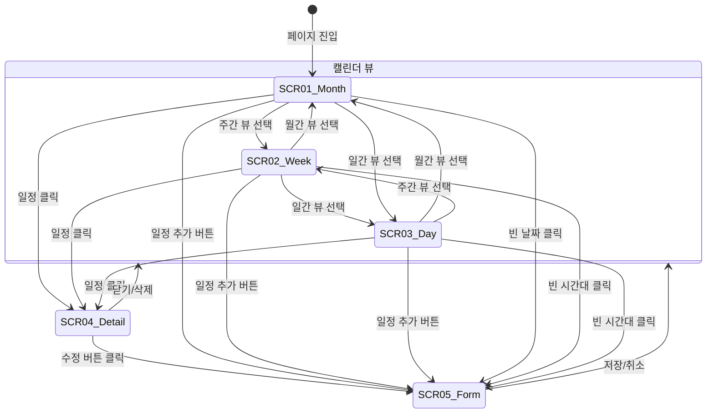

# TSK-06-11 - [샘플] 작업 일정 캘린더 UI 설계

## 문서 정보

| 항목 | 내용 |
|------|------|
| Task ID | TSK-06-11 |
| 문서 버전 | 1.0 |
| 작성일 | 2026-01-22 |
| 상태 | 작성완료 |
| 카테고리 | development |
| Domain | frontend |
| PRD 참조 | PRD 4.1.1 캘린더 샘플 |

---

## 1. 화면 목록

| 화면 ID | 화면명 | 목적 | SVG 참조 |
|---------|--------|------|----------|
| SCR-01 | 작업 일정 캘린더 (월간 뷰) | 월간 일정 표시 | `ui-assets/screen-01-calendar-month.svg` |
| SCR-02 | 작업 일정 캘린더 (주간 뷰) | 주간 일정 표시 | `ui-assets/screen-02-calendar-week.svg` |
| SCR-03 | 작업 일정 캘린더 (일간 뷰) | 일간 일정 표시 | `ui-assets/screen-03-calendar-day.svg` |
| SCR-04 | 일정 상세 모달 | 일정 상세 정보 표시 | `ui-assets/screen-04-schedule-detail.svg` |
| SCR-05 | 일정 추가/수정 모달 | 일정 폼 입력 | `ui-assets/screen-05-schedule-form.svg` |

---

## 2. 화면 전환 흐름

### 2.1 화면 전환 다이어그램



### 2.2 액션-화면 매트릭스

| 현재 화면 | 사용자 액션 | 결과 화면 | 비고 |
|----------|-------------|----------|------|
| SCR-01 Month | 뷰 전환 (주간) | SCR-02 Week | 현재 날짜 기준 주간 표시 |
| SCR-01 Month | 뷰 전환 (일간) | SCR-03 Day | 현재 날짜 기준 일간 표시 |
| SCR-01 Month | 이전/다음 버튼 | SCR-01 Month | 월 변경 |
| SCR-01 Month | 오늘 버튼 | SCR-01 Month | 현재 월로 이동 |
| SCR-01 Month | 일정 클릭 | SCR-04 Detail | 모달 열기 |
| SCR-01 Month | 빈 날짜 클릭 | SCR-05 Form | 신규 일정 생성 모달 |
| SCR-01 Month | 일정 추가 버튼 | SCR-05 Form | 신규 일정 생성 모달 |
| SCR-02 Week | 뷰 전환 (월간) | SCR-01 Month | 현재 주 포함 월 표시 |
| SCR-02 Week | 뷰 전환 (일간) | SCR-03 Day | 현재 선택 날짜 기준 |
| SCR-03 Day | 뷰 전환 (월간) | SCR-01 Month | 현재 날짜 포함 월 |
| SCR-03 Day | 뷰 전환 (주간) | SCR-02 Week | 현재 날짜 포함 주 |
| SCR-04 Detail | 수정 버튼 | SCR-05 Form | 기존 데이터 로드 |
| SCR-04 Detail | 삭제 버튼 | 확인 다이얼로그 | Modal.confirm |
| SCR-04 Detail | 닫기/외부 클릭 | 이전 뷰 | 모달 닫기 |
| SCR-05 Form | 저장 버튼 | 이전 뷰 | 데이터 저장 후 갱신 |
| SCR-05 Form | 취소/외부 클릭 | 이전 뷰 | 변경 취소 |

---

## 3. 화면별 상세

### 3.1 SCR-01: 월간 뷰

**화면 목적:**
월간 캘린더 형태로 작업 일정을 표시하여 전체 일정 현황을 한눈에 파악할 수 있도록 함.

**레이아웃:**
```
+---------------------------------------------------------------------------------+
|  작업 일정 캘린더                                                                 |
|                                                                                  |
|  +---------------------------------------------------------------------------+  |
|  |  [<] [오늘] [>]      2026년 1월              [월간] [주간] [일간]  [+ 일정] |  |
|  +---------------------------------------------------------------------------+  |
|                                                                                  |
|  +---------------------------------------------------------------------------+  |
|  |  일   |  월   |  화   |  수   |  목   |  금   |  토   |                     |
|  |-------|-------|-------|-------|-------|-------|-------|                     |
|  |  28   |  29   |  30   |  31   |   1   |   2   |   3   |                     |
|  |       |       |       |       |[생산] |       |       |                     |
|  |-------|-------|-------|-------|-------|-------|-------|                     |
|  |   4   |   5   |   6   |   7   |   8   |   9   |  10   |                     |
|  |[정비] |       |[교육] |       |[생산] |       |       |                     |
|  |       |       |       |       |[회의] |       |       |                     |
|  |-------|-------|-------|-------|-------|-------|-------|                     |
|  |  11   |  12   |  13   |  14   |  15   |  16   |  17   |                     |
|  |       |[생산] |       |[정비] |       |[회의] |       |                     |
|  |-------|-------|-------|-------|-------|-------|-------|                     |
|  |  18   |  19   |  20   |  21   |  22   |  23   |  24   |                     |
|  |[교육] |       |       |[생산] |       |       |       |                     |
|  |-------|-------|-------|-------|-------|-------|-------|                     |
|  |  25   |  26   |  27   |  28   |  29   |  30   |  31   |                     |
|  |       |[정비] |       |       |       |       |       |                     |
|  +---------------------------------------------------------------------------+  |
+---------------------------------------------------------------------------------+
```

**컴포넌트 목록:**

| 컴포넌트 | Ant Design | Props/설정 | 비고 |
|----------|------------|-----------|------|
| 페이지 제목 | Typography.Title | level=4 | "작업 일정 캘린더" |
| 네비게이션 | Button.Group | - | 이전/오늘/다음 |
| 현재 월 표시 | Typography.Title | level=4 | "2026년 1월" |
| 뷰 전환 | Segmented | options: 월간/주간/일간 | - |
| 일정 추가 | Button | type="primary", icon | "+ 일정" |
| 캘린더 그리드 | Custom Grid | CSS Grid 7x6 | - |
| 요일 헤더 | - | 일-토 | 주말 색상 구분 |
| 날짜 셀 | - | 날짜 + 일정 목록 | - |
| 일정 태그 | Tag | color by type | 일정 유형별 색상 |

**상태 관리:**

| 상태 | 타입 | 초기값 | 설명 |
|------|------|--------|------|
| currentDate | Date | new Date() | 현재 표시 월 기준 날짜 |
| viewMode | 'month' \| 'week' \| 'day' | 'month' | 뷰 모드 |
| schedules | Schedule[] | [] | 전체 일정 목록 |
| selectedSchedule | Schedule \| null | null | 선택된 일정 |
| detailModalOpen | boolean | false | 상세 모달 열림 상태 |
| formModalOpen | boolean | false | 폼 모달 열림 상태 |
| isEditing | boolean | false | 수정 모드 여부 |

**액션:**

| 액션 | 트리거 | 결과 | 조건 |
|------|--------|------|------|
| 데이터 로드 | 페이지 진입/월 변경 | schedules 상태 업데이트 | - |
| 이전 월 | 이전 버튼 클릭 | currentDate -1 month | viewMode='month' |
| 다음 월 | 다음 버튼 클릭 | currentDate +1 month | viewMode='month' |
| 오늘 이동 | 오늘 버튼 클릭 | currentDate = today | - |
| 뷰 전환 | Segmented 변경 | viewMode 변경 | - |
| 일정 클릭 | Tag 클릭 | 상세 모달 열기 | - |
| 빈 날짜 클릭 | 날짜 셀 더블클릭 | 폼 모달 열기 (신규) | - |
| 일정 추가 | 버튼 클릭 | 폼 모달 열기 (신규) | - |

---

### 3.2 SCR-02: 주간 뷰

**화면 목적:**
주간 타임라인 형태로 시간대별 일정을 상세하게 표시.

**레이아웃:**
```
+---------------------------------------------------------------------------------+
|  작업 일정 캘린더                                                                 |
|                                                                                  |
|  +---------------------------------------------------------------------------+  |
|  |  [<] [오늘] [>]    2026년 1월 2주차           [월간] [주간] [일간]  [+ 일정] |  |
|  +---------------------------------------------------------------------------+  |
|                                                                                  |
|  +---------------------------------------------------------------------------+  |
|  |       |  5(일) |  6(월) |  7(화) |  8(수) |  9(목) | 10(금) | 11(토) |       |
|  |-------|--------|--------|--------|--------|--------|--------|--------|       |
|  | 08:00 |        |        | [교육] |        |        |        |        |       |
|  |       |        |        | 09:00- |        |        |        |        |       |
|  |       |        |        | 12:00  |        |        |        |        |       |
|  |-------|--------|--------|--------|--------|--------|--------|--------|       |
|  | 09:00 |        |        |        | [생산] |        |        |        |       |
|  |       |        |        |        | A라인  |        |        |        |       |
|  |       |        |        |        | 09:00- |        |        |        |       |
|  |       |        |        |        | 18:00  |        |        |        |       |
|  |-------|--------|--------|--------|--------|--------|--------|--------|       |
|  | 10:00 |        |        |        |        |        |        |        |       |
|  |-------|--------|--------|--------|--------|--------|--------|--------|       |
|  | 11:00 |        |        |        |        |        |        |        |       |
|  |-------|--------|--------|--------|--------|--------|--------|--------|       |
|  | 14:00 |        |        |        | [회의] |        |        |        |       |
|  |       |        |        |        | 주간   |        |        |        |       |
|  |       |        |        |        | 14:00- |        |        |        |       |
|  |       |        |        |        | 15:00  |        |        |        |       |
|  |-------|--------|--------|--------|--------|--------|--------|--------|       |
|  | ...   |        |        |        |        |        |        |        |       |
|  +---------------------------------------------------------------------------+  |
+---------------------------------------------------------------------------------+
```

**컴포넌트 목록:**

| 컴포넌트 | Ant Design | Props/설정 | 비고 |
|----------|------------|-----------|------|
| 시간 헤더 | - | 08:00-20:00 | 1시간 단위 |
| 요일 헤더 | - | 날짜 + 요일 | 오늘 강조 |
| 시간대 셀 | - | 60px 높이 | - |
| 일정 블록 | Card | 높이 = 시간 비례 | 겹침 처리 |

**그리드 설계:**

```typescript
// 주간 뷰 그리드 설정
const weekViewConfig = {
  startHour: 8,        // 08:00 시작
  endHour: 20,         // 20:00 종료
  hourHeight: 60,      // 시간당 60px
  columnWidth: 'auto', // 7등분
};
```

---

### 3.3 SCR-03: 일간 뷰

**화면 목적:**
특정 날짜의 시간대별 일정을 상세하게 표시.

**레이아웃:**
```
+---------------------------------------------------------------------------------+
|  작업 일정 캘린더                                                                 |
|                                                                                  |
|  +---------------------------------------------------------------------------+  |
|  |  [<] [오늘] [>]    2026년 1월 8일 (수)        [월간] [주간] [일간]  [+ 일정] |  |
|  +---------------------------------------------------------------------------+  |
|                                                                                  |
|  +---------------------------------------------------------------------------+  |
|  |         |                  일정                                            |  |
|  |---------|--------------------------------------------------------------|  |
|  |  08:00  |                                                              |  |
|  |---------|--------------------------------------------------------------|  |
|  |  09:00  | +-------------------------------------------------------+   |  |
|  |         | |  [생산] A라인 생산 작업                                 |   |  |
|  |  10:00  | |  담당: 김생산                                           |   |  |
|  |         | |  09:00 - 18:00                                          |   |  |
|  |  11:00  | |                                                         |   |  |
|  |         | +-------------------------------------------------------+   |  |
|  |  12:00  |                                                              |  |
|  |---------|--------------------------------------------------------------|  |
|  |  13:00  |                                                              |  |
|  |---------|--------------------------------------------------------------|  |
|  |  14:00  | +-------------------------------------------------------+   |  |
|  |         | |  [회의] 주간 생산 회의                                  |   |  |
|  |  15:00  | |  장소: 회의실 A                                         |   |  |
|  |         | |  14:00 - 15:00                                          |   |  |
|  |         | +-------------------------------------------------------+   |  |
|  |---------|--------------------------------------------------------------|  |
|  |  16:00  |                                                              |  |
|  |---------|--------------------------------------------------------------|  |
|  |  ...    |                                                              |  |
|  +---------------------------------------------------------------------------+  |
+---------------------------------------------------------------------------------+
```

---

### 3.4 SCR-04: 일정 상세 모달

**화면 목적:**
선택한 일정의 상세 정보를 모달로 표시.

**레이아웃:**
```
+-----------------------------------------------+
|  [생산] A라인 생산 작업                   [X]  |
|-----------------------------------------------|
|                                               |
|  +-------------------------------------------+|
|  |    유형      |  [생산]                    ||
|  |-------------------------------------------||
|  |    기간      |  2026-01-08 09:00          ||
|  |              |  ~ 2026-01-08 18:00        ||
|  |-------------------------------------------||
|  |    담당자    |  김생산                     ||
|  |-------------------------------------------||
|  |    장소      |  A동 생산라인               ||
|  |-------------------------------------------||
|  |    설명      |  1월 2주차 정기 생산 작업   ||
|  |              |  목표 생산량: 1,000개       ||
|  +-------------------------------------------+|
|                                               |
|              [수정]  [삭제]  [닫기]            |
+-----------------------------------------------+
```

**컴포넌트 목록:**

| 컴포넌트 | Ant Design | Props/설정 | 비고 |
|----------|------------|-----------|------|
| Modal | Modal | width=480, centered | - |
| 제목 영역 | Space + Tag | 유형 태그 + 제목 | - |
| 상세 정보 | Descriptions | column=1, bordered | - |
| 유형 Tag | Tag | color by type | - |
| 기간 | - | 시작~종료 | DatePicker 포맷 |
| 버튼 그룹 | Space + Button | - | 수정/삭제/닫기 |

**Props:**

```typescript
interface ScheduleDetailModalProps {
  open: boolean;
  schedule: Schedule | null;
  onClose: () => void;
  onEdit: (schedule: Schedule) => void;
  onDelete: (id: string) => void;
}

interface Schedule {
  id: string;
  title: string;
  type: ScheduleType;
  startTime: string;  // ISO 8601
  endTime: string;    // ISO 8601
  assignee?: string;
  location?: string;
  description?: string;
}

type ScheduleType = 'PRODUCTION' | 'MAINTENANCE' | 'MEETING' | 'TRAINING';
```

---

### 3.5 SCR-05: 일정 추가/수정 모달

**화면 목적:**
새 일정 생성 또는 기존 일정 수정을 위한 폼 모달.

**레이아웃:**
```
+-----------------------------------------------+
|  일정 등록                                [X]  |
|-----------------------------------------------|
|                                               |
|  제목 *                                       |
|  +-------------------------------------------+|
|  |  A라인 생산 작업                          ||
|  +-------------------------------------------+|
|                                               |
|  유형 *                                       |
|  +-------------------------------------------+|
|  |  [생산 v]                                 ||
|  +-------------------------------------------+|
|                                               |
|  시작 일시 *                                  |
|  +-------------------------------------------+|
|  |  2026-01-08  09:00                        ||
|  +-------------------------------------------+|
|                                               |
|  종료 일시 *                                  |
|  +-------------------------------------------+|
|  |  2026-01-08  18:00                        ||
|  +-------------------------------------------+|
|                                               |
|  담당자                                       |
|  +-------------------------------------------+|
|  |  김생산                                   ||
|  +-------------------------------------------+|
|                                               |
|  장소                                         |
|  +-------------------------------------------+|
|  |  A동 생산라인                             ||
|  +-------------------------------------------+|
|                                               |
|  설명                                         |
|  +-------------------------------------------+|
|  |  1월 2주차 정기 생산 작업                 ||
|  |  목표 생산량: 1,000개                     ||
|  +-------------------------------------------+|
|                                               |
|                       [취소]  [저장]          |
+-----------------------------------------------+
```

**컴포넌트 목록:**

| 컴포넌트 | Ant Design | Props/설정 | 비고 |
|----------|------------|-----------|------|
| Modal | Modal | width=520, centered | - |
| Form | Form | layout="vertical" | - |
| 제목 | Input | maxLength=100, required | - |
| 유형 | Select | options: 4가지 | - |
| 시작 일시 | DatePicker | showTime, required | - |
| 종료 일시 | DatePicker | showTime, required | - |
| 담당자 | Input | maxLength=50 | optional |
| 장소 | Input | maxLength=100 | optional |
| 설명 | Input.TextArea | rows=4 | optional |
| 버튼 | Button | 취소/저장 | - |

**유효성 검사:**

| 필드 | 규칙 | 에러 메시지 |
|------|------|------------|
| 제목 | required, max 100 | "제목을 입력해주세요" |
| 유형 | required | "유형을 선택해주세요" |
| 시작 일시 | required | "시작 일시를 선택해주세요" |
| 종료 일시 | required, > 시작 | "종료 일시는 시작 일시 이후여야 합니다" |

**Props:**

```typescript
interface ScheduleFormModalProps {
  open: boolean;
  schedule?: Schedule | null;  // null이면 신규, 값 있으면 수정
  defaultDate?: Date;          // 빈 날짜 클릭 시 기본 날짜
  onClose: () => void;
  onSave: (data: ScheduleFormData) => void;
}

interface ScheduleFormData {
  title: string;
  type: ScheduleType;
  startTime: string;
  endTime: string;
  assignee?: string;
  location?: string;
  description?: string;
}
```

---

## 4. 공통 컴포넌트

### 4.1 CalendarHeader (캘린더 헤더)

**용도:** 네비게이션, 뷰 전환, 일정 추가 버튼

**레이아웃:**
```
+---------------------------------------------------------------------------------+
|  [<] [오늘] [>]      2026년 1월              [월간] [주간] [일간]    [+ 일정]    |
+---------------------------------------------------------------------------------+
```

**Props:**
```typescript
interface CalendarHeaderProps {
  currentDate: Date;
  viewMode: 'month' | 'week' | 'day';
  onPrev: () => void;
  onNext: () => void;
  onToday: () => void;
  onViewChange: (mode: 'month' | 'week' | 'day') => void;
  onAddSchedule: () => void;
}
```

### 4.2 ScheduleTag (일정 태그)

**용도:** 캘린더 셀 내 일정 표시

**레이아웃:**
```
+------------------+
| [색상] 일정 제목  |
+------------------+
```

**Props:**
```typescript
interface ScheduleTagProps {
  schedule: Schedule;
  onClick: (schedule: Schedule) => void;
  showTime?: boolean;  // 시간 표시 여부
}
```

**유형별 스타일:**

| 유형 | 영문 코드 | Tag Color | 배경색 | 텍스트색 |
|------|----------|-----------|--------|----------|
| 생산 | PRODUCTION | green | #F6FFED | #52C41A |
| 정비 | MAINTENANCE | orange | #FFF7E6 | #FA8C16 |
| 회의 | MEETING | blue | #E6F4FF | #1677FF |
| 교육 | TRAINING | purple | #F9F0FF | #722ED1 |

### 4.3 ScheduleBlock (일정 블록 - 주간/일간 뷰용)

**용도:** 시간대별 일정 블록 표시

**레이아웃:**
```
+---------------------------------------+
|  [유형] 일정 제목                      |
|  담당자 / 장소                         |
|  09:00 - 18:00                        |
+---------------------------------------+
```

**Props:**
```typescript
interface ScheduleBlockProps {
  schedule: Schedule;
  onClick: (schedule: Schedule) => void;
  height: number;  // 시간 비례 높이
  top: number;     // 시작 시간 기준 위치
}
```

---

## 5. 반응형 설계

### 5.1 Breakpoint 정의

| Breakpoint | Ant Design | 화면 너비 | 월간 뷰 | 주간 뷰 | 일간 뷰 |
|------------|------------|----------|--------|--------|--------|
| XS | xs | 0-575px | 세로 스크롤 | 3일 표시 | 1일 전체 |
| SM | sm | 576-767px | 세로 스크롤 | 5일 표시 | 1일 전체 |
| MD | md | 768-991px | 7x6 그리드 | 7일 표시 | 1일 전체 |
| LG | lg | 992px+ | 7x6 그리드 | 7일 표시 | 1일 전체 |

### 5.2 모바일 최적화

**월간 뷰 (모바일):**
- 날짜 셀 높이 축소 (80px -> 60px)
- 일정 태그 1줄 표시, 나머지 "+N개" 표시
- 날짜 클릭 시 해당 날짜의 일간 뷰로 전환

**주간 뷰 (모바일):**
- 3일 또는 5일만 표시
- 좌우 스와이프로 날짜 이동
- 시간 컬럼 고정

**모달 (모바일):**
- 전체 화면 모달 (width: 100%, height: 100%)
- 하단 고정 버튼

```typescript
// 반응형 모달 너비
const modalWidth = {
  xs: '100%',
  sm: '100%',
  md: 480,
  lg: 520,
};
```

### 5.3 헤더 반응형

| Breakpoint | 레이아웃 |
|------------|---------|
| XS | 2행 (네비게이션 / 뷰 전환 + 버튼) |
| SM | 2행 |
| MD+ | 1행 전체 |

---

## 6. 일정 유형별 색상 정의

### 6.1 유형 색상 토큰

| 유형 | 영문 코드 | Primary | Background | Border |
|------|----------|---------|------------|--------|
| 생산 | PRODUCTION | #52C41A | rgba(82, 196, 26, 0.1) | #52C41A |
| 정비 | MAINTENANCE | #FA8C16 | rgba(250, 140, 22, 0.1) | #FA8C16 |
| 회의 | MEETING | #1677FF | rgba(22, 119, 255, 0.1) | #1677FF |
| 교육 | TRAINING | #722ED1 | rgba(114, 46, 209, 0.1) | #722ED1 |

### 6.2 색상 상수 정의

```typescript
// lib/constants/scheduleColors.ts
export const scheduleTypeColors = {
  PRODUCTION: {
    primary: '#52C41A',
    background: 'rgba(82, 196, 26, 0.1)',
    border: '#52C41A',
    label: '생산',
    antdColor: 'green',
  },
  MAINTENANCE: {
    primary: '#FA8C16',
    background: 'rgba(250, 140, 22, 0.1)',
    border: '#FA8C16',
    label: '정비',
    antdColor: 'orange',
  },
  MEETING: {
    primary: '#1677FF',
    background: 'rgba(22, 119, 255, 0.1)',
    border: '#1677FF',
    label: '회의',
    antdColor: 'blue',
  },
  TRAINING: {
    primary: '#722ED1',
    background: 'rgba(114, 46, 209, 0.1)',
    border: '#722ED1',
    label: '교육',
    antdColor: 'purple',
  },
};
```

---

## 7. 접근성

### 7.1 키보드 네비게이션

| 키 | 동작 | 컨텍스트 |
|----|------|---------|
| Tab | 다음 요소로 이동 | 전체 |
| Shift+Tab | 이전 요소로 이동 | 전체 |
| Arrow Left/Right | 이전/다음 날짜 | 캘린더 포커스 |
| Arrow Up/Down | 이전/다음 주 | 월간 뷰 |
| Enter | 일정 선택/날짜 선택 | 캘린더 |
| Space | 일정 선택 | 캘린더 |
| Escape | 모달 닫기 | 모달 열림 상태 |
| Home | 현재 월 첫 날 | 월간 뷰 |
| End | 현재 월 마지막 날 | 월간 뷰 |

### 7.2 ARIA 속성

| 요소 | ARIA 속성 | 값 |
|------|----------|-----|
| 캘린더 그리드 | role | "grid" |
| 요일 헤더 | role | "columnheader" |
| 날짜 셀 | role | "gridcell" |
| 날짜 셀 | aria-label | "2026년 1월 8일 수요일, 일정 2건" |
| 일정 태그 | role | "button" |
| 일정 태그 | aria-label | "생산: A라인 생산 작업, 09:00-18:00" |
| 네비게이션 버튼 | aria-label | "이전 월", "오늘", "다음 월" |
| 뷰 전환 | aria-label | "캘린더 뷰 전환" |
| 모달 | aria-labelledby | 제목 ID |
| 모달 | aria-modal | "true" |

### 7.3 색상 대비

| 요소 | 전경색 | 배경색 | 대비율 | WCAG |
|------|--------|--------|--------|------|
| 생산 태그 | #52C41A | #F6FFED | 3.0:1 | AA (Large) |
| 정비 태그 | #FA8C16 | #FFF7E6 | 2.9:1 | - |
| 회의 태그 | #1677FF | #E6F4FF | 3.4:1 | AA (Large) |
| 교육 태그 | #722ED1 | #F9F0FF | 4.5:1 | AA |
| 날짜 텍스트 | #0F172A | #FFFFFF | 15.7:1 | AAA |
| 주말 텍스트 | #FF4D4F | #FFFFFF | 3.9:1 | AA (Large) |

**색상 접근성 보완:**
- 일정 유형은 색상 + 텍스트 라벨로 표시
- 고대비 모드 지원 고려
- 일정 블록에 유형 아이콘 추가 (선택적)

### 7.4 스크린 리더 지원

```typescript
// 날짜 셀 aria-label 생성
const getDateCellLabel = (date: Date, schedules: Schedule[]) => {
  const dateStr = format(date, 'yyyy년 M월 d일 EEEE', { locale: ko });
  const scheduleCount = schedules.length;
  if (scheduleCount === 0) {
    return `${dateStr}, 일정 없음`;
  }
  return `${dateStr}, 일정 ${scheduleCount}건`;
};

// 일정 태그 aria-label 생성
const getScheduleLabel = (schedule: Schedule) => {
  const typeLabel = scheduleTypeColors[schedule.type].label;
  const timeRange = `${format(schedule.startTime, 'HH:mm')}-${format(schedule.endTime, 'HH:mm')}`;
  return `${typeLabel}: ${schedule.title}, ${timeRange}`;
};
```

---

## 8. Mock 데이터 구조

### 8.1 데이터 파일 경로

`mes-portal/mock-data/schedules.json`

### 8.2 데이터 스키마

```typescript
interface ScheduleData {
  schedules: Schedule[];
  types: ScheduleTypeInfo[];
}

interface Schedule {
  id: string;
  title: string;
  type: ScheduleType;
  startTime: string;  // ISO 8601
  endTime: string;    // ISO 8601
  assignee?: string;
  location?: string;
  description?: string;
  allDay?: boolean;   // 종일 일정 여부
}

type ScheduleType = 'PRODUCTION' | 'MAINTENANCE' | 'MEETING' | 'TRAINING';

interface ScheduleTypeInfo {
  code: ScheduleType;
  label: string;
  color: string;
}
```

### 8.3 샘플 데이터

```json
{
  "schedules": [
    {
      "id": "sch-001",
      "title": "A라인 생산 작업",
      "type": "PRODUCTION",
      "startTime": "2026-01-08T09:00:00",
      "endTime": "2026-01-08T18:00:00",
      "assignee": "김생산",
      "location": "A동 생산라인",
      "description": "1월 2주차 정기 생산 작업\n목표 생산량: 1,000개"
    },
    {
      "id": "sch-002",
      "title": "설비 정기 점검",
      "type": "MAINTENANCE",
      "startTime": "2026-01-04T08:00:00",
      "endTime": "2026-01-04T12:00:00",
      "assignee": "박정비",
      "location": "B동 설비실",
      "description": "CNC-001, CNC-002 정기 점검"
    },
    {
      "id": "sch-003",
      "title": "주간 생산 회의",
      "type": "MEETING",
      "startTime": "2026-01-08T14:00:00",
      "endTime": "2026-01-08T15:00:00",
      "assignee": "이관리",
      "location": "회의실 A",
      "description": "주간 생산 실적 및 계획 검토"
    },
    {
      "id": "sch-004",
      "title": "신입사원 안전 교육",
      "type": "TRAINING",
      "startTime": "2026-01-06T09:00:00",
      "endTime": "2026-01-06T12:00:00",
      "assignee": "최교육",
      "location": "교육장",
      "description": "신입사원 대상 산업안전 교육"
    }
  ],
  "types": [
    { "code": "PRODUCTION", "label": "생산", "color": "#52C41A" },
    { "code": "MAINTENANCE", "label": "정비", "color": "#FA8C16" },
    { "code": "MEETING", "label": "회의", "color": "#1677FF" },
    { "code": "TRAINING", "label": "교육", "color": "#722ED1" }
  ]
}
```

---

## 9. 드래그 앤 드롭 (옵션)

### 9.1 기능 범위

| 기능 | 구현 우선순위 | 설명 |
|------|-------------|------|
| 일정 이동 (날짜) | 선택적 | 월간 뷰에서 다른 날짜로 드래그 |
| 일정 이동 (시간) | 선택적 | 주간/일간 뷰에서 시간대 이동 |
| 일정 리사이즈 | 선택적 | 주간/일간 뷰에서 종료 시간 조절 |

### 9.2 구현 라이브러리

- `@dnd-kit/core` (권장)
- `react-beautiful-dnd` (대안)

### 9.3 드래그 피드백

```typescript
// 드래그 중 시각적 피드백
const dragOverlay = {
  opacity: 0.7,
  boxShadow: '0 4px 12px rgba(0, 0, 0, 0.15)',
  cursor: 'grabbing',
};

// 드롭 가능 영역 하이라이트
const dropTarget = {
  background: 'rgba(22, 119, 255, 0.1)',
  border: '2px dashed #1677FF',
};
```

---

## 10. SVG 파일 목록

| 파일명 | 화면 | 크기 | 상태 |
|--------|------|------|------|
| `screen-01-calendar-month.svg` | 월간 뷰 | 1200x800 | 생성 예정 |
| `screen-02-calendar-week.svg` | 주간 뷰 | 1200x800 | 생성 예정 |
| `screen-03-calendar-day.svg` | 일간 뷰 | 1200x800 | 생성 예정 |
| `screen-04-schedule-detail.svg` | 일정 상세 모달 | 600x500 | 생성 예정 |
| `screen-05-schedule-form.svg` | 일정 폼 모달 | 600x700 | 생성 예정 |

---

## 11. 파일 구조

```
mes-portal/
├── app/
│   └── (portal)/
│       └── sample/
│           └── calendar/
│               └── page.tsx              # 캘린더 페이지
├── screens/
│   └── sample/
│       └── ScheduleCalendar.tsx          # 메인 화면 컴포넌트
├── components/
│   └── sample/
│       ├── calendar/
│       │   ├── CalendarHeader.tsx        # 캘린더 헤더
│       │   ├── MonthView.tsx             # 월간 뷰
│       │   ├── WeekView.tsx              # 주간 뷰
│       │   ├── DayView.tsx               # 일간 뷰
│       │   ├── ScheduleTag.tsx           # 일정 태그
│       │   └── ScheduleBlock.tsx         # 일정 블록 (주간/일간)
│       ├── ScheduleDetailModal.tsx       # 일정 상세 모달
│       └── ScheduleFormModal.tsx         # 일정 폼 모달
├── lib/
│   └── constants/
│       └── scheduleColors.ts             # 일정 유형 색상 상수
└── mock-data/
    └── schedules.json                    # Mock 데이터
```

---

## 12. 날짜 라이브러리

### 12.1 권장 라이브러리

- **date-fns**: 경량, 트리쉐이킹 지원, 함수형 API
- **dayjs**: moment.js 대안, 경량

### 12.2 사용 예시

```typescript
import {
  format,
  startOfMonth,
  endOfMonth,
  startOfWeek,
  endOfWeek,
  eachDayOfInterval,
  isSameMonth,
  isSameDay,
  isToday,
  addMonths,
  subMonths,
  addWeeks,
  subWeeks,
  addDays,
  subDays,
} from 'date-fns';
import { ko } from 'date-fns/locale';

// 월간 뷰 날짜 배열 생성
const getMonthDays = (date: Date) => {
  const start = startOfWeek(startOfMonth(date), { weekStartsOn: 0 });
  const end = endOfWeek(endOfMonth(date), { weekStartsOn: 0 });
  return eachDayOfInterval({ start, end });
};

// 날짜 포맷
const formatDate = (date: Date) => format(date, 'yyyy년 M월', { locale: ko });
```

---

## 변경 이력

| 버전 | 일자 | 작성자 | 변경 내용 |
|------|------|--------|----------|
| 1.0 | 2026-01-22 | Claude | 최초 작성 |
