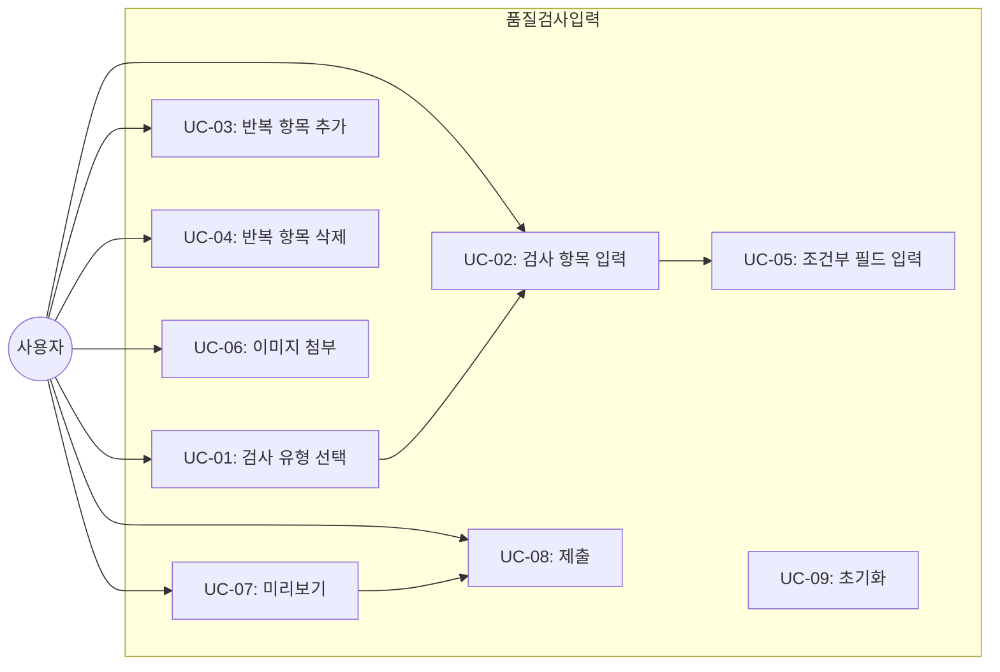

# TSK-06-12 - [샘플] 품질 검사 입력 폼 설계 문서

## 문서 정보

| 항목 | 내용 |
|------|------|
| Task ID | TSK-06-12 |
| 문서 버전 | 1.0 |
| 작성일 | 2026-01-22 |
| 상태 | 작성중 |
| 카테고리 | development |

---

## 1. 개요

### 1.1 배경 및 문제 정의

**현재 상황:**
- MES Portal에서 품질 검사 데이터를 입력하는 화면이 필요함
- 검사 유형에 따라 입력해야 하는 필드가 다르며, 동적으로 폼을 구성해야 함
- 반복적인 검사 항목을 추가/삭제할 수 있어야 함
- 검사 결과에 따라 추가 입력 필드가 조건부로 표시되어야 함

**해결하려는 문제:**
- 동적 폼 필드 렌더링의 표준 패턴 필요
- Form.List를 활용한 반복 항목 처리 방법 검증
- 조건부 필드 표시 로직의 검증
- 파일 업로드(이미지) 기능 검증

### 1.2 목적 및 기대 효과

**목적:**
- 동적 폼 패턴 검증을 위한 샘플 화면 구현
- Ant Design Form.List를 활용한 반복 항목 처리 검증
- 조건부 필드 렌더링 로직 검증
- 이미지 업로드 기능 검증
- TSK-06-03 입력/수정 폼 템플릿의 활용 검증

**기대 효과:**
- 사용자 관점: 검사 유형에 맞는 동적 폼으로 효율적인 데이터 입력
- 개발자 관점: 동적 폼 패턴의 참조 구현, 재사용 가능한 패턴 확보
- 유지보수 관점: 검사 유형 추가 시 구조화된 방식으로 확장 가능

### 1.3 범위

**포함:**
- 품질 검사 입력 폼 화면 (QualityInspection.tsx)
- 검사 유형 선택에 따른 동적 필드 렌더링
- Form.List를 활용한 반복 검사 항목 추가/삭제
- 조건부 필드 표시 (검사 결과에 따른 추가 입력)
- 이미지 첨부 기능 (Upload 컴포넌트)
- 폼 데이터 미리보기 및 제출

**제외:**
- 실제 API 연동 (Mock 데이터 사용)
- 서버 사이드 파일 저장 (미리보기만)
- 검사 기준 관리 화면 (별도 Task)

### 1.4 참조 문서

| 문서 | 경로 | 관련 섹션 |
|------|------|----------|
| PRD | `.orchay/projects/mes-portal/prd.md` | 4.1.1 동적 폼 샘플 (품질 검사 입력 폼) |
| TRD | `.orchay/projects/mes-portal/trd.md` | 7. 폼/입력 (Ant Design Form, Form.List, Upload) |
| TSK-06-03 | `.orchay/projects/mes-portal/tasks/TSK-06-03/010-design.md` | 입력/수정 폼 템플릿 |

---

## 2. 사용자 분석

### 2.1 대상 사용자

| 사용자 유형 | 특성 | 주요 니즈 |
|------------|------|----------|
| 품질 담당자 | 검사 결과 입력, 정확성 중요 | 검사 유형에 맞는 필드, 빠른 입력, 명확한 피드백 |
| 검사원 | 현장 검사 수행, 다량 데이터 입력 | 간편한 반복 항목 추가, 이미지 첨부 |
| 개발자 | 동적 폼 패턴 참조 | Form.List 활용 예시, 조건부 렌더링 패턴 |

### 2.2 사용자 페르소나

**페르소나 1: 품질 담당자 김품질**
- 역할: 품질 검사 결과 입력 및 관리
- 목표: 정확한 검사 데이터 기록, 불량 발생 시 상세 정보 입력
- 불만: 검사 유형마다 다른 필드를 일일이 확인하기 번거로움
- 시나리오: 검사 유형 선택 → 측정값 입력 → 불량 시 사유 입력 → 이미지 첨부 → 제출

**페르소나 2: 현장 검사원 박검사**
- 역할: 라인별 품질 검사 수행
- 목표: 여러 검사 항목을 빠르게 입력
- 불만: 반복 항목 추가/삭제가 불편함
- 시나리오: 검사 항목 여러 개 추가 → 각 항목 측정값 입력 → 저장

---

## 3. 유즈케이스

### 3.1 유즈케이스 다이어그램



### 3.2 유즈케이스 상세

#### UC-01: 검사 유형 선택

| 항목 | 내용 |
|------|------|
| 액터 | 품질 담당자 |
| 목적 | 수행할 검사 유형 선택 |
| 사전 조건 | 품질 검사 입력 화면 진입 |
| 사후 조건 | 선택된 검사 유형에 맞는 폼 필드 표시 |
| 트리거 | Segmented 또는 Select에서 검사 유형 선택 |

**기본 흐름:**
1. 사용자가 검사 유형(치수 검사/외관 검사/기능 검사)을 선택한다
2. 시스템이 해당 검사 유형에 맞는 폼 필드를 동적으로 렌더링한다
3. 기존에 입력한 값이 있다면 해당 검사 유형 데이터만 유지한다

**대안 흐름:**
- 2a. 다른 검사 유형으로 변경 시:
  - 변경 확인 다이얼로그 표시 (입력 데이터 존재 시)
  - 확인 시 폼 초기화 후 새 유형 필드 표시

#### UC-02: 검사 항목 입력

| 항목 | 내용 |
|------|------|
| 액터 | 품질 담당자 |
| 목적 | 검사 측정값 및 결과 입력 |
| 사전 조건 | 검사 유형 선택됨 |
| 사후 조건 | 검사 데이터 폼에 저장됨 |
| 트리거 | 필드 입력 |

**기본 흐름:**
1. 사용자가 검사 항목(측정값, 기준값, 합격/불합격 등)을 입력한다
2. 시스템이 입력값에 대한 실시간 유효성 검사를 수행한다
3. 유효하면 값이 저장되고, 무효하면 에러 메시지를 표시한다

#### UC-03: 반복 항목 추가

| 항목 | 내용 |
|------|------|
| 액터 | 품질 담당자 |
| 목적 | 추가 검사 항목 입력 |
| 사전 조건 | 폼 화면 표시 |
| 사후 조건 | 새 검사 항목 행 추가됨 |
| 트리거 | 항목 추가 버튼 클릭 |

**기본 흐름:**
1. 사용자가 [항목 추가] 버튼을 클릭한다
2. 시스템이 Form.List에 새 항목을 추가한다
3. 새 항목의 첫 번째 필드에 포커스가 설정된다

**대안 흐름:**
- 2a. 최대 항목 수 도달 시:
  - "최대 10개까지 추가할 수 있습니다" 메시지 표시
  - 추가 버튼 비활성화

#### UC-04: 반복 항목 삭제

| 항목 | 내용 |
|------|------|
| 액터 | 품질 담당자 |
| 목적 | 불필요한 검사 항목 제거 |
| 사전 조건 | 검사 항목이 2개 이상 존재 |
| 사후 조건 | 해당 검사 항목 제거됨 |
| 트리거 | 항목 삭제 버튼 클릭 |

**기본 흐름:**
1. 사용자가 삭제하려는 항목의 [삭제] 버튼을 클릭한다
2. 시스템이 해당 항목을 Form.List에서 제거한다
3. 남은 항목들의 인덱스가 재정렬된다

**예외 흐름:**
- 1a. 마지막 1개 항목일 경우:
  - 삭제 버튼 비활성화 (최소 1개 필수)

#### UC-05: 조건부 필드 입력

| 항목 | 내용 |
|------|------|
| 액터 | 품질 담당자 |
| 목적 | 검사 결과에 따른 추가 정보 입력 |
| 사전 조건 | 검사 결과(합격/불합격)가 선택됨 |
| 사후 조건 | 조건에 따라 추가 필드가 표시되거나 숨겨짐 |
| 트리거 | 검사 결과 필드 값 변경 |

**기본 흐름:**
1. 사용자가 검사 결과를 '불합격'으로 선택한다
2. 시스템이 불량 사유 입력 필드를 동적으로 표시한다
3. 불량 유형, 불량 사유, 조치사항 필드가 나타난다

**대안 흐름:**
- 1a. '합격'으로 변경 시:
  - 불량 관련 필드 숨김
  - 입력된 불량 데이터 초기화

#### UC-06: 이미지 첨부

| 항목 | 내용 |
|------|------|
| 액터 | 품질 담당자 |
| 목적 | 검사 증빙 이미지 첨부 |
| 사전 조건 | 폼 화면 표시 |
| 사후 조건 | 이미지 미리보기 표시 |
| 트리거 | 파일 선택 또는 드래그 앤 드롭 |

**기본 흐름:**
1. 사용자가 Upload 영역에 이미지를 드래그하거나 클릭하여 파일을 선택한다
2. 시스템이 이미지 형식 및 크기를 검증한다
3. 검증 통과 시 이미지 미리보기를 표시한다
4. 여러 이미지 추가 가능 (최대 5개)

**예외 흐름:**
- 2a. 지원하지 않는 형식일 경우:
  - "JPG, PNG 형식만 지원합니다" 에러 메시지
- 2b. 파일 크기 초과 시:
  - "5MB 이하 파일만 업로드 가능합니다" 에러 메시지

#### UC-07: 미리보기

| 항목 | 내용 |
|------|------|
| 액터 | 품질 담당자 |
| 목적 | 입력 데이터 최종 확인 |
| 사전 조건 | 필수 필드 입력 완료 |
| 사후 조건 | 미리보기 모달 또는 영역 표시 |
| 트리거 | 미리보기 버튼 클릭 |

**기본 흐름:**
1. 사용자가 [미리보기] 버튼을 클릭한다
2. 시스템이 전체 폼 유효성을 검사한다
3. 유효하면 입력 데이터를 요약하여 표시한다
4. 사용자가 내용을 확인한다

#### UC-08: 제출

| 항목 | 내용 |
|------|------|
| 액터 | 품질 담당자 |
| 목적 | 검사 데이터 저장 |
| 사전 조건 | 폼 유효성 검사 통과 |
| 사후 조건 | 데이터 저장 완료 (Mock) |
| 트리거 | 저장 버튼 클릭 |

**기본 흐름:**
1. 사용자가 [저장] 버튼을 클릭한다
2. 시스템이 전체 폼 유효성을 검사한다
3. 버튼이 로딩 상태로 변경된다
4. 저장 성공 시 성공 메시지 표시 및 폼 초기화

---

## 4. 사용자 시나리오

### 4.1 시나리오 1: 치수 검사 결과 입력 (정상 흐름)

**상황 설명:**
품질 담당자가 치수 검사 결과를 입력한다. 3개의 측정 포인트에서 길이를 측정하고 모두 합격.

**단계별 진행:**

| 단계 | 사용자 행동 | 시스템 반응 | 사용자 기대 |
|------|-----------|------------|------------|
| 1 | 검사 유형에서 '치수 검사' 선택 | 치수 검사 전용 필드 표시 (측정값, 기준값, 허용오차) | 해당 유형에 맞는 필드 확인 |
| 2 | 제품코드, 로트번호 입력 | 입력값 표시 | 기본 정보 입력 |
| 3 | 첫 번째 측정 항목 입력 (측정위치: A, 기준값: 100, 측정값: 100.2) | 입력값 저장, 허용오차 내 = 합격 자동 표시 | 자동 판정 |
| 4 | [항목 추가] 클릭 | 새 측정 항목 행 추가 | 추가 측정 가능 |
| 5 | 두 번째, 세 번째 항목 입력 | 각 항목 저장 | 여러 항목 입력 |
| 6 | [미리보기] 클릭 | 입력 데이터 요약 표시 | 최종 확인 |
| 7 | [저장] 클릭 | 로딩 후 "저장되었습니다" 토스트 | 저장 완료 |

**성공 조건:**
- 모든 측정 항목 입력 완료
- 자동 합격/불합격 판정 표시
- 2초 이내 저장 완료

### 4.2 시나리오 2: 외관 검사 - 불합격 처리

**상황 설명:**
외관 검사에서 불량이 발견되어 불합격 처리 및 불량 사유 입력.

**단계별 진행:**

| 단계 | 사용자 행동 | 시스템 반응 | 사용자 기대 |
|------|-----------|------------|------------|
| 1 | 검사 유형에서 '외관 검사' 선택 | 외관 검사 필드 표시 | 외관 검사 필드 |
| 2 | 검사 결과를 '불합격' 선택 | 불량 관련 필드 동적 표시 | 추가 필드 표시 |
| 3 | 불량 유형 선택 (스크래치) | 선택값 저장 | - |
| 4 | 불량 사유 입력 | 텍스트 저장 | - |
| 5 | 조치사항 입력 | 텍스트 저장 | - |
| 6 | 불량 이미지 첨부 (드래그 앤 드롭) | 이미지 미리보기 표시 | 증빙 이미지 확인 |
| 7 | [저장] 클릭 | 저장 완료 | 불합격 데이터 저장 |

### 4.3 시나리오 3: 반복 항목 관리

**상황 설명:**
여러 검사 항목을 추가했다가 불필요한 항목을 삭제.

**단계별 진행:**

| 단계 | 사용자 행동 | 시스템 반응 | 복구 방법 |
|------|-----------|------------|----------|
| 1 | [항목 추가] 3번 클릭 | 총 4개 항목 표시 (기본 1 + 추가 3) | - |
| 2 | 마지막 항목의 [삭제] 클릭 | 해당 항목 제거, 3개 남음 | [항목 추가]로 복원 |
| 3 | 다시 [삭제] 클릭 | 2개 남음 | - |
| 4 | 마지막 1개에서 [삭제] 시도 | 삭제 버튼 비활성화 | 최소 1개 필수 |

---

## 5. 화면 설계

### 5.1 화면 흐름도

```mermaid
flowchart TD
    A[화면 진입] --> B[검사 유형 선택]
    B -->|치수 검사| C1[치수 검사 필드]
    B -->|외관 검사| C2[외관 검사 필드]
    B -->|기능 검사| C3[기능 검사 필드]
    C1 --> D[검사 항목 입력]
    C2 --> D
    C3 --> D
    D --> E{검사 결과}
    E -->|합격| F[기본 필드만 표시]
    E -->|불합격| G[불량 관련 필드 추가 표시]
    F --> H[이미지 첨부 (선택)]
    G --> H
    H --> I{미리보기}
    I --> J[데이터 확인]
    J --> K{제출}
    K -->|성공| L[저장 완료]
    K -->|실패| M[에러 표시]
    M --> D
```

### 5.2 화면별 상세

#### 화면 1: 품질 검사 입력 폼

**화면 목적:**
검사 유형에 따른 동적 폼 입력 및 검사 데이터 기록

**진입 경로:**
- 사이드바 메뉴 > 샘플 화면 > 품질 검사 입력
- MDI 탭으로 열기

**와이어프레임 (기본 상태 - 치수 검사):**
```
┌─────────────────────────────────────────────────────────────────────────┐
│  ┌───────────────────────────────────────────────────────────────────┐  │
│  │  품질 검사 입력                                         [초기화]  │  │
│  └───────────────────────────────────────────────────────────────────┘  │
│                                                                          │
│  ┌───────────────────────────────────────────────────────────────────┐  │
│  │  검사 유형                                                        │  │
│  │  ┌─────────────┬─────────────┬─────────────┐                      │  │
│  │  │  치수 검사  │  외관 검사  │  기능 검사  │   ◀ Segmented       │  │
│  │  │  ═══════   │             │             │                      │  │
│  │  └─────────────┴─────────────┴─────────────┘                      │  │
│  └───────────────────────────────────────────────────────────────────┘  │
│                                                                          │
│  ┌───────────────────────────────────────────────────────────────────┐  │
│  │  기본 정보                                                        │  │
│  │  ┌─────────────────────────┐  ┌─────────────────────────┐         │  │
│  │  │ 제품코드 *              │  │ 로트번호 *              │         │  │
│  │  │ ┌─────────────────────┐ │  │ ┌─────────────────────┐ │         │  │
│  │  │ │ PROD-001            │ │  │ │ LOT-20260122-001    │ │         │  │
│  │  │ └─────────────────────┘ │  │ └─────────────────────┘ │         │  │
│  │  └─────────────────────────┘  └─────────────────────────┘         │  │
│  │                                                                    │  │
│  │  검사일시 *                                                        │  │
│  │  ┌───────────────────────────────────────────────────────────┐    │  │
│  │  │ 2026-01-22 14:30                                    📅    │    │  │
│  │  └───────────────────────────────────────────────────────────┘    │  │
│  └───────────────────────────────────────────────────────────────────┘  │
│                                                                          │
│  ┌───────────────────────────────────────────────────────────────────┐  │
│  │  측정 항목                                            [+ 항목 추가] │  │
│  │  ┌─────────────────────────────────────────────────────────────┐  │  │
│  │  │ #1                                                   [🗑️]    │  │  │
│  │  │ ┌──────────┐ ┌──────────┐ ┌──────────┐ ┌──────────┐ ┌─────┐ │  │  │
│  │  │ │측정위치* │ │기준값(mm)│ │허용오차  │ │측정값(mm)│ │판정 │ │  │  │
│  │  │ │┌────────┐│ │┌────────┐│ │┌────────┐│ │┌────────┐│ │     │ │  │  │
│  │  │ ││ A      ││ ││ 100    ││ ││ ±0.5   ││ ││ 100.2  ││ │ ✓  │ │  │  │
│  │  │ │└────────┘│ │└────────┘│ │└────────┘│ │└────────┘│ │     │ │  │  │
│  │  │ └──────────┘ └──────────┘ └──────────┘ └──────────┘ └─────┘ │  │  │
│  │  └─────────────────────────────────────────────────────────────┘  │  │
│  │  ┌─────────────────────────────────────────────────────────────┐  │  │
│  │  │ #2                                                   [🗑️]    │  │  │
│  │  │ ┌──────────┐ ┌──────────┐ ┌──────────┐ ┌──────────┐ ┌─────┐ │  │  │
│  │  │ │측정위치* │ │기준값(mm)│ │허용오차  │ │측정값(mm)│ │판정 │ │  │  │
│  │  │ │┌────────┐│ │┌────────┐│ │┌────────┐│ │┌────────┐│ │     │ │  │  │
│  │  │ ││ B      ││ ││ 50     ││ ││ ±0.3   ││ ││ 49.8   ││ │ ✓  │ │  │  │
│  │  │ │└────────┘│ │└────────┘│ │└────────┘│ │└────────┘│ │     │ │  │  │
│  │  │ └──────────┘ └──────────┘ └──────────┘ └──────────┘ └─────┘ │  │  │
│  │  └─────────────────────────────────────────────────────────────┘  │  │
│  └───────────────────────────────────────────────────────────────────┘  │
│                                                                          │
│  ┌───────────────────────────────────────────────────────────────────┐  │
│  │  첨부 이미지                                                      │  │
│  │  ┌───────────────────────────────────────────────────────────┐    │  │
│  │  │     📁                                                    │    │  │
│  │  │                                                           │    │  │
│  │  │   이미지를 드래그하거나 클릭하여 업로드                    │    │  │
│  │  │   (JPG, PNG / 최대 5MB / 최대 5개)                        │    │  │
│  │  │                                                           │    │  │
│  │  └───────────────────────────────────────────────────────────┘    │  │
│  │  ┌────┐ ┌────┐                                                    │  │
│  │  │ 🖼️ │ │ 🖼️ │  ◀ 업로드된 이미지 미리보기                       │  │
│  │  │  ×  │ │  ×  │                                                    │  │
│  │  └────┘ └────┘                                                    │  │
│  └───────────────────────────────────────────────────────────────────┘  │
│                                                                          │
│  ┌───────────────────────────────────────────────────────────────────┐  │
│  │  비고                                                             │  │
│  │  ┌───────────────────────────────────────────────────────────┐    │  │
│  │  │                                                           │    │  │
│  │  │                                                           │    │  │
│  │  └───────────────────────────────────────────────────────────┘    │  │
│  │  0/500                                                            │  │
│  └───────────────────────────────────────────────────────────────────┘  │
│                                                                          │
│  ┌───────────────────────────────────────────────────────────────────┐  │
│  │                           [미리보기]  [취소]  [💾 저장]           │  │
│  └───────────────────────────────────────────────────────────────────┘  │
└─────────────────────────────────────────────────────────────────────────┘

범례:
* : 필수 필드
✓ : 합격 판정 (녹색)
✗ : 불합격 판정 (빨간색)
[🗑️] : 삭제 버튼
```

**와이어프레임 (외관 검사 - 불합격 시):**
```
┌─────────────────────────────────────────────────────────────────────────┐
│  ┌───────────────────────────────────────────────────────────────────┐  │
│  │  검사 유형                                                        │  │
│  │  ┌─────────────┬─────────────┬─────────────┐                      │  │
│  │  │  치수 검사  │  외관 검사  │  기능 검사  │                      │  │
│  │  │             │  ═══════   │             │                      │  │
│  │  └─────────────┴─────────────┴─────────────┘                      │  │
│  └───────────────────────────────────────────────────────────────────┘  │
│                                                                          │
│  ┌───────────────────────────────────────────────────────────────────┐  │
│  │  기본 정보                                                        │  │
│  │  (... 동일 ...)                                                   │  │
│  └───────────────────────────────────────────────────────────────────┘  │
│                                                                          │
│  ┌───────────────────────────────────────────────────────────────────┐  │
│  │  외관 검사 항목                                      [+ 항목 추가] │  │
│  │  ┌─────────────────────────────────────────────────────────────┐  │  │
│  │  │ #1                                                   [🗑️]    │  │  │
│  │  │ ┌──────────────┐ ┌──────────────┐ ┌───────────────────────┐ │  │  │
│  │  │ │ 검사부위 *   │ │ 검사항목 *   │ │ 검사결과 *            │ │  │  │
│  │  │ │┌────────────┐│ │┌────────────┐│ │ ○ 합격   ● 불합격     │ │  │  │
│  │  │ ││ 외부 표면  ││ ││ 스크래치   ││ │                       │ │  │  │
│  │  │ │└────────────┘│ │└────────────┘│ │                       │ │  │  │
│  │  │ └──────────────┘ └──────────────┘ └───────────────────────┘ │  │  │
│  │  │                                                              │  │  │
│  │  │  ┌─────────────────────────────────────────────────────┐    │  │  │
│  │  │  │ 🔴 불합격 상세 (조건부 표시)                         │    │  │  │
│  │  │  │ ┌──────────────┐ ┌──────────────────────────────┐   │    │  │  │
│  │  │  │ │ 불량유형 *   │ │ 불량사유 *                    │   │    │  │  │
│  │  │  │ │┌────────────┐│ │┌────────────────────────────┐│   │    │  │  │
│  │  │  │ ││ 표면불량 ▼ ││ ││ 제품 운반 중 스크래치 발생 ││   │    │  │  │
│  │  │  │ │└────────────┘│ │└────────────────────────────┘│   │    │  │  │
│  │  │  │ └──────────────┘ └──────────────────────────────┘   │    │  │  │
│  │  │  │                                                      │    │  │  │
│  │  │  │ 조치사항                                             │    │  │  │
│  │  │  │ ┌────────────────────────────────────────────────┐  │    │  │  │
│  │  │  │ │ 재작업 대상 분류                                │  │    │  │  │
│  │  │  │ └────────────────────────────────────────────────┘  │    │  │  │
│  │  │  └─────────────────────────────────────────────────────┘    │  │  │
│  │  └─────────────────────────────────────────────────────────────┘  │  │
│  └───────────────────────────────────────────────────────────────────┘  │
│                                                                          │
│  (... 첨부 이미지, 비고, 버튼 영역 동일 ...)                            │
└─────────────────────────────────────────────────────────────────────────┘

범례:
🔴 : 불합격 시에만 표시되는 조건부 영역
```

**화면 요소 설명:**

| 영역 | 설명 | Ant Design 컴포넌트 | 사용자 인터랙션 |
|------|------|-------------------|----------------|
| 헤더 | 화면 제목 | Card title | - |
| 초기화 버튼 | 폼 리셋 | Button | 클릭 시 확인 후 초기화 |
| 검사 유형 선택 | 검사 유형 (치수/외관/기능) | Segmented | 클릭 시 폼 필드 변경 |
| 기본 정보 | 제품코드, 로트번호, 검사일시 | Input, DatePicker | 입력 |
| 측정 항목 (Form.List) | 반복 가능한 검사 항목 | Form.List + Card | 추가/삭제/입력 |
| 항목 추가 버튼 | 새 측정 항목 추가 | Button + PlusOutlined | 클릭 시 항목 추가 |
| 삭제 버튼 | 해당 측정 항목 삭제 | Button + DeleteOutlined | 클릭 시 항목 삭제 |
| 판정 | 자동 합격/불합격 표시 | Tag (success/error) | 자동 계산 |
| 조건부 필드 | 불합격 시에만 표시 | Form.Item (conditional) | 불합격 선택 시 표시 |
| 이미지 업로드 | 첨부 이미지 | Upload.Dragger | 드래그 또는 클릭 |
| 비고 | 추가 메모 | Input.TextArea | 입력 |
| 미리보기 버튼 | 입력 데이터 확인 | Button | 클릭 시 미리보기 모달 |
| 취소 버튼 | 입력 취소 | Button | 클릭 시 이탈 경고 |
| 저장 버튼 | 데이터 저장 | Button type="primary" | 클릭 시 저장 |

### 5.3 반응형 동작

| 화면 크기 | 레이아웃 변화 | 사용자 경험 |
|----------|--------------|------------|
| 데스크톱 (1024px+) | 2열 배치 (기본 정보), 측정 항목 가로 나열 | 한 눈에 모든 필드 확인 |
| 태블릿 (768-1023px) | 1-2열 혼합, 측정 항목 축약 | 터치 친화적 |
| 모바일 (767px-) | 1열 수직 배치, 측정 항목 수직 나열 | 모바일 최적화 |

---

## 6. 인터랙션 설계

### 6.1 사용자 액션과 피드백

| 사용자 액션 | 즉각 피드백 | 결과 피드백 | 에러 피드백 |
|------------|-----------|------------|------------|
| 검사 유형 변경 | Segmented 선택 표시 | 해당 폼 필드 렌더링 | 변경 확인 (데이터 있을 때) |
| 측정값 입력 | 입력값 표시 | 자동 판정 계산 | 숫자 형식 에러 |
| 검사 결과 변경 | 라디오 선택 표시 | 조건부 필드 표시/숨김 | - |
| 항목 추가 | 애니메이션 추가 | 새 항목 표시, 포커스 | 최대 개수 도달 |
| 항목 삭제 | 애니메이션 제거 | 항목 제거 | 최소 1개 유지 |
| 이미지 업로드 | 프로그레스 바 | 미리보기 표시 | 형식/크기 에러 |
| 이미지 삭제 | 즉시 삭제 | 미리보기 제거 | - |
| 저장 클릭 | 버튼 로딩 | 성공 토스트 | 에러 토스트, 필드 에러 |

### 6.2 상태별 화면 변화

| 상태 | 화면 표시 | 사용자 안내 |
|------|----------|------------|
| 초기 상태 | 빈 폼, 기본 검사 유형 선택됨 | "검사 데이터를 입력하세요" |
| 입력 중 | 필드별 값 표시 | 실시간 판정 표시 |
| 불합격 선택 | 추가 필드 슬라이드 표시 | "불량 상세 정보를 입력하세요" |
| 저장 중 | 저장 버튼 로딩 | "저장 중..." |
| 저장 성공 | 성공 토스트 | "검사 결과가 저장되었습니다" |
| 저장 실패 | 에러 토스트 | "저장에 실패했습니다" |

### 6.3 조건부 렌더링 규칙

| 트리거 | 조건 | 표시 필드 |
|--------|------|----------|
| 검사 유형 = 치수 검사 | 항상 | 측정위치, 기준값, 허용오차, 측정값, 판정 |
| 검사 유형 = 외관 검사 | 항상 | 검사부위, 검사항목, 검사결과 |
| 검사 유형 = 기능 검사 | 항상 | 테스트항목, 테스트조건, 테스트결과, 측정값 |
| 검사 결과 = 불합격 | 외관/기능 검사 | 불량유형, 불량사유, 조치사항 |

### 6.4 키보드/접근성

| 기능 | 키보드 단축키 | 스크린 리더 안내 |
|------|-------------|-----------------|
| 저장 | Ctrl+S | "저장 버튼" |
| 취소 | Escape | "취소하고 이전으로" |
| 항목 추가 | Ctrl+Enter | "검사 항목 추가" |
| 다음 필드 | Tab | "{필드명}으로 이동" |
| 검사 유형 전환 | 화살표 키 | "검사 유형 {유형명} 선택됨" |

---

## 7. 데이터 요구사항

### 7.1 필요한 데이터

| 데이터 | 설명 | 출처 | 용도 |
|--------|------|------|------|
| inspectionTypes | 검사 유형 목록 | 상수/Mock | Segmented 옵션 |
| defectTypes | 불량 유형 목록 | Mock JSON | 불량유형 Select 옵션 |
| inspectionData | 입력 데이터 | 폼 상태 | 저장 |
| uploadedImages | 첨부 이미지 | Upload | 파일 미리보기 |

### 7.2 폼 데이터 구조

```typescript
interface QualityInspectionFormData {
  // 기본 정보
  inspectionType: 'dimension' | 'appearance' | 'function';
  productCode: string;
  lotNumber: string;
  inspectionDate: Dayjs;

  // 치수 검사 항목 (Form.List)
  dimensionItems?: DimensionItem[];

  // 외관 검사 항목 (Form.List)
  appearanceItems?: AppearanceItem[];

  // 기능 검사 항목 (Form.List)
  functionItems?: FunctionItem[];

  // 첨부 이미지
  images?: UploadFile[];

  // 비고
  remarks?: string;
}

interface DimensionItem {
  position: string;        // 측정위치
  standardValue: number;   // 기준값(mm)
  tolerance: string;       // 허용오차 (예: ±0.5)
  measuredValue: number;   // 측정값(mm)
  result?: 'pass' | 'fail'; // 자동 계산 판정
}

interface AppearanceItem {
  area: string;           // 검사부위
  checkItem: string;      // 검사항목
  result: 'pass' | 'fail'; // 검사결과
  // 조건부 (불합격 시)
  defectType?: string;    // 불량유형
  defectReason?: string;  // 불량사유
  action?: string;        // 조치사항
}

interface FunctionItem {
  testItem: string;       // 테스트항목
  testCondition: string;  // 테스트조건
  testResult: 'pass' | 'fail'; // 테스트결과
  measuredValue?: string; // 측정값
  // 조건부 (불합격 시)
  defectType?: string;
  defectReason?: string;
  action?: string;
}
```

### 7.3 Mock 데이터 파일

```typescript
// mock-data/quality-inspection.json
{
  "defectTypes": [
    { "value": "surface", "label": "표면불량" },
    { "value": "dimension", "label": "치수불량" },
    { "value": "function", "label": "기능불량" },
    { "value": "material", "label": "재질불량" },
    { "value": "other", "label": "기타" }
  ],
  "inspectionAreas": [
    { "value": "external", "label": "외부 표면" },
    { "value": "internal", "label": "내부" },
    { "value": "edge", "label": "모서리" },
    { "value": "connection", "label": "연결부" }
  ],
  "checkItems": [
    { "value": "scratch", "label": "스크래치" },
    { "value": "dent", "label": "찍힘" },
    { "value": "stain", "label": "얼룩" },
    { "value": "crack", "label": "균열" },
    { "value": "discolor", "label": "변색" }
  ]
}
```

### 7.4 데이터 유효성 규칙

| 데이터 필드 | 규칙 | 위반 시 메시지 |
|------------|------|---------------|
| productCode | 필수 | "제품코드를 입력해주세요" |
| lotNumber | 필수 | "로트번호를 입력해주세요" |
| inspectionDate | 필수 | "검사일시를 선택해주세요" |
| dimensionItems[].position | 필수 | "측정위치를 입력해주세요" |
| dimensionItems[].standardValue | 필수, 숫자 | "기준값을 입력해주세요" |
| dimensionItems[].measuredValue | 필수, 숫자 | "측정값을 입력해주세요" |
| appearanceItems[].result | 필수 | "검사결과를 선택해주세요" |
| defectType (불합격 시) | 필수 | "불량유형을 선택해주세요" |
| defectReason (불합격 시) | 필수 | "불량사유를 입력해주세요" |
| images | 최대 5개, JPG/PNG, 5MB 이하 | "파일 형식/크기를 확인해주세요" |

---

## 8. 비즈니스 규칙

### 8.1 핵심 규칙

| 규칙 ID | 규칙 설명 | 적용 상황 | 예외 |
|---------|----------|----------|------|
| BR-01 | 검사 유형 변경 시 해당 유형 필드만 표시 | 유형 선택 | 없음 |
| BR-02 | 검사 결과 불합격 시 불량 상세 필드 필수 | 불합격 선택 | 없음 |
| BR-03 | 치수 검사 판정은 허용오차 기준 자동 계산 | 측정값 입력 | 수동 오버라이드 불가 |
| BR-04 | 최소 1개 검사 항목 필수 | 저장 | 없음 |
| BR-05 | 최대 10개 검사 항목까지 추가 가능 | 항목 추가 | 없음 |
| BR-06 | 이미지는 최대 5개, 각 5MB 이하 | 업로드 | 없음 |

### 8.2 규칙 상세 설명

**BR-03: 치수 검사 판정 자동 계산**

설명: 측정값이 기준값 ± 허용오차 범위 내이면 합격, 범위 밖이면 불합격

예시:
- 기준값: 100mm, 허용오차: ±0.5mm, 측정값: 100.3mm → 합격 (99.5 ~ 100.5 범위 내)
- 기준값: 100mm, 허용오차: ±0.5mm, 측정값: 100.8mm → 불합격 (범위 초과)

**BR-02: 불합격 시 필수 필드**

설명: 검사 결과가 불합격인 경우, 불량유형과 불량사유는 필수 입력

예시:
- 외관 검사 불합격 → 불량유형(표면불량), 불량사유 입력 필수
- 조치사항은 선택

---

## 9. 에러 처리

### 9.1 예상 에러 상황

| 상황 | 원인 | 사용자 메시지 | 복구 방법 |
|------|------|--------------|----------|
| 필수 값 누락 | 필수 필드 비어있음 | "필수 항목입니다" | 해당 필드 입력 |
| 숫자 형식 오류 | 측정값에 문자 입력 | "숫자만 입력 가능합니다" | 숫자로 재입력 |
| 이미지 형식 오류 | 지원하지 않는 형식 | "JPG, PNG 형식만 지원합니다" | 올바른 형식 업로드 |
| 이미지 크기 초과 | 5MB 초과 | "5MB 이하 파일만 업로드 가능합니다" | 작은 파일 선택 |
| 이미지 개수 초과 | 5개 초과 | "최대 5개까지 업로드 가능합니다" | 기존 이미지 삭제 |
| 저장 실패 | 서버/네트워크 오류 | "저장에 실패했습니다" | 재시도 |

### 9.2 에러 표시 방식

| 에러 유형 | 표시 위치 | 표시 방법 | Ant Design 컴포넌트 |
|----------|----------|----------|-------------------|
| 필드 오류 | 해당 필드 하단 | 빨간색 텍스트 | Form.Item validateStatus |
| 업로드 오류 | Upload 영역 | 토스트 알림 | message.error() |
| 저장 오류 | 화면 상단 | 토스트 알림 | message.error() |

---

## 10. 연관 문서

| 문서 | 경로 | 용도 |
|------|------|------|
| 요구사항 추적 매트릭스 | `025-traceability-matrix.md` | PRD → 설계 → 테스트 양방향 추적 |
| 테스트 명세서 | `026-test-specification.md` | 단위/E2E/매뉴얼 테스트 상세 정의 |

---

## 11. 구현 범위

### 11.1 파일 구조

```
screens/
└── sample/
    └── QualityInspection/
        ├── index.tsx                    # 페이지 진입점
        ├── QualityInspection.tsx        # 메인 컴포넌트
        ├── DimensionInspection.tsx      # 치수 검사 폼 섹션
        ├── AppearanceInspection.tsx     # 외관 검사 폼 섹션
        ├── FunctionInspection.tsx       # 기능 검사 폼 섹션
        ├── InspectionPreview.tsx        # 미리보기 모달
        └── types.ts                     # 타입 정의

mock-data/
└── quality-inspection.json              # Mock 데이터
```

### 11.2 영향받는 영역

| 영역 | 변경 내용 | 영향도 |
|------|----------|--------|
| screens/sample/ | QualityInspection 폴더 신규 생성 | 높음 |
| mock-data/ | quality-inspection.json 신규 생성 | 낮음 |
| 메뉴 시드 | 샘플 메뉴에 품질 검사 추가 | 낮음 |

### 11.3 의존성

| 의존 항목 | 이유 | 상태 |
|----------|------|------|
| TSK-06-03 (입력/수정 폼 템플릿) | FormTemplate 패턴 활용 | 완료 |
| Ant Design Form | Form, Form.Item, Form.List | TRD 확인됨 |
| Ant Design Segmented | 검사 유형 선택 | TRD 확인됨 |
| Ant Design Upload | 이미지 업로드 | TRD 확인됨 |
| Ant Design Radio | 합격/불합격 선택 | TRD 확인됨 |
| Ant Design InputNumber | 측정값 입력 | TRD 확인됨 |
| Ant Design Tag | 판정 결과 표시 | TRD 확인됨 |

### 11.4 제약 사항

| 제약 | 설명 | 대응 방안 |
|------|------|----------|
| Mock 데이터 | 실제 API 연동 없음 | JSON 파일에서 로드 |
| 파일 저장 | 서버 저장 없음 | 미리보기만 제공 |
| 검사 기준 관리 | 별도 화면 필요 | Phase 2에서 구현 |

### 11.5 사용할 Ant Design 컴포넌트

| 컴포넌트 | 용도 |
|----------|------|
| Form | 전체 폼 컨테이너 |
| Form.Item | 개별 필드 래퍼 |
| Form.List | 반복 항목 (측정 항목) |
| Card | 섹션 컨테이너 |
| Segmented | 검사 유형 선택 |
| Input | 텍스트 입력 |
| InputNumber | 숫자 입력 |
| Select | 드롭다운 선택 |
| DatePicker | 날짜 선택 |
| Radio.Group | 합격/불합격 선택 |
| Upload.Dragger | 이미지 드래그 업로드 |
| Tag | 판정 결과 표시 |
| Button | 저장/취소/추가/삭제 버튼 |
| Space | 버튼 그룹 |
| Modal | 미리보기 다이얼로그 |
| Descriptions | 미리보기 데이터 표시 |
| message | 토스트 알림 |

### 11.6 주요 data-testid 정의

| data-testid | 요소 | 용도 |
|-------------|------|------|
| `quality-inspection-page` | 페이지 컨테이너 | 페이지 로드 확인 |
| `inspection-type-selector` | Segmented | 검사 유형 선택 |
| `product-code-input` | 제품코드 입력 | 입력 테스트 |
| `lot-number-input` | 로트번호 입력 | 입력 테스트 |
| `inspection-date-picker` | 검사일시 선택 | 날짜 선택 |
| `dimension-items-list` | 치수 측정 항목 리스트 | Form.List 확인 |
| `add-item-btn` | 항목 추가 버튼 | 추가 테스트 |
| `remove-item-btn-{index}` | 항목 삭제 버튼 | 삭제 테스트 |
| `result-tag-{index}` | 판정 결과 태그 | 자동 판정 확인 |
| `defect-fields-{index}` | 불량 상세 필드 영역 | 조건부 표시 확인 |
| `image-upload` | 이미지 업로드 영역 | 업로드 테스트 |
| `preview-btn` | 미리보기 버튼 | 미리보기 테스트 |
| `submit-btn` | 저장 버튼 | 저장 테스트 |
| `cancel-btn` | 취소 버튼 | 취소 테스트 |
| `reset-btn` | 초기화 버튼 | 초기화 테스트 |

---

## 12. 체크리스트

### 12.1 설계 완료 확인

- [x] 문제 정의 및 목적 명확화
- [x] 사용자 분석 완료
- [x] 유즈케이스 정의 완료
- [x] 사용자 시나리오 작성 완료
- [x] 화면 설계 완료 (와이어프레임)
- [x] 인터랙션 설계 완료
- [x] 데이터 요구사항 정의 완료
- [x] 비즈니스 규칙 정의 완료
- [x] 에러 처리 정의 완료

### 12.2 연관 문서 작성

- [ ] 요구사항 추적 매트릭스 작성 (→ `025-traceability-matrix.md`)
- [ ] 테스트 명세서 작성 (→ `026-test-specification.md`)

### 12.3 구현 준비

- [x] 구현 우선순위 결정
- [x] 의존성 확인 완료
- [x] 제약 사항 검토 완료

---

## 변경 이력

| 버전 | 일자 | 작성자 | 변경 내용 |
|------|------|--------|----------|
| 1.0 | 2026-01-22 | Claude | 최초 작성 |
