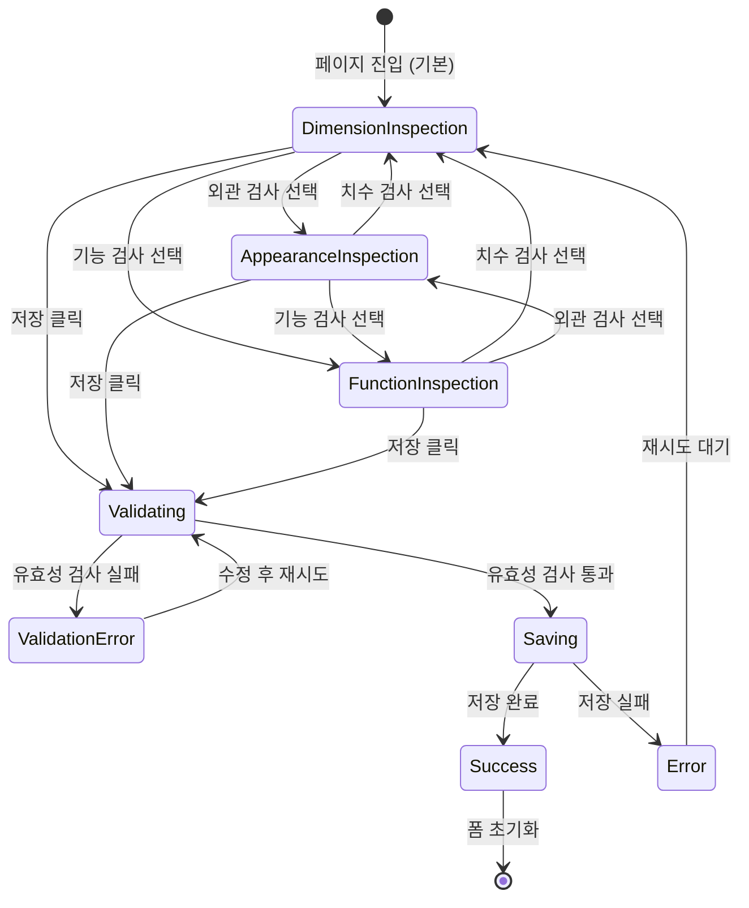

# TSK-06-12 - 품질 검사 입력 폼 UI 설계

## 문서 정보

| 항목 | 내용 |
|------|------|
| Task ID | TSK-06-12 |
| 문서 버전 | 1.0 |
| 작성일 | 2026-01-22 |
| 상태 | 작성완료 |
| 참조 설계 문서 | `010-design.md` |

---

## 1. 화면 목록

| 화면 ID | 화면명 | 목적 | SVG 참조 |
|---------|--------|------|----------|
| SCR-01 | 치수 검사 입력 | 치수 검사 유형 선택 시 기본 화면 | `screen-01-dimension-inspection.svg` |
| SCR-02 | 외관 검사 입력 (합격) | 외관 검사 유형, 합격 상태 | `screen-02-appearance-pass.svg` |
| SCR-03 | 외관 검사 입력 (불합격) | 외관 검사 유형, 불합격 + 조건부 필드 | `screen-03-appearance-fail.svg` |
| SCR-04 | 기능 검사 입력 | 기능 검사 유형 화면 | `screen-04-function-inspection.svg` |
| SCR-05 | 이미지 업로드 상태 | 이미지 첨부 및 미리보기 | `screen-05-image-upload.svg` |
| SCR-06 | 유효성 검사 실패 | 필수 필드 에러 표시 | `screen-06-validation-error.svg` |
| SCR-07 | 저장 중 상태 | 저장 버튼 로딩 상태 | `screen-07-saving.svg` |
| SCR-08 | 미리보기 모달 | 입력 데이터 확인 모달 | `screen-08-preview-modal.svg` |

---

## 2. 화면 전환 흐름



### 액션-화면 매트릭스

| 현재 상태 | 액션 | 다음 상태 |
|----------|------|----------|
| DimensionInspection | 외관 검사 선택 | AppearanceInspection |
| DimensionInspection | 기능 검사 선택 | FunctionInspection |
| AppearanceInspection | 합격 선택 | 기본 필드만 표시 |
| AppearanceInspection | 불합격 선택 | 불량 상세 필드 표시 |
| 모든 유형 | 항목 추가 클릭 | 새 항목 추가 (최대 10개) |
| 모든 유형 | 항목 삭제 클릭 | 해당 항목 삭제 (최소 1개) |
| 모든 유형 | 미리보기 클릭 | Preview Modal 표시 |
| 모든 유형 | 저장 클릭 | Validating → Saving |
| 모든 유형 | 초기화 클릭 | 폼 리셋, 기본 상태 |

---

## 3. 화면별 상세

### 3.1 SCR-01: 치수 검사 입력

**화면 목적:**
치수 검사 유형 선택 시 표시되는 기본 화면. 측정위치, 기준값, 허용오차, 측정값 입력 및 자동 판정 표시.

**레이아웃:**

```
┌─────────────────────────────────────────────────────────────────────────────────┐
│  ┌───────────────────────────────────────────────────────────────────────────┐  │
│  │  품질 검사 입력                                               [초기화]    │  │
│  └───────────────────────────────────────────────────────────────────────────┘  │
│                                                                                  │
│  ┌───────────────────────────────────────────────────────────────────────────┐  │
│  │  검사 유형                                                                │  │
│  │  ┌───────────────┬───────────────┬───────────────┐                        │  │
│  │  │   치수 검사   │   외관 검사   │   기능 검사   │    ◀ Segmented        │  │
│  │  │   ═══════════ │               │               │                        │  │
│  │  └───────────────┴───────────────┴───────────────┘                        │  │
│  └───────────────────────────────────────────────────────────────────────────┘  │
│                                                                                  │
│  ┌───────────────────────────────────────────────────────────────────────────┐  │
│  │  기본 정보                                                                │  │
│  │  ┌───────────────────────────┐  ┌───────────────────────────┐             │  │
│  │  │ 제품코드 *                │  │ 로트번호 *                │             │  │
│  │  │ ┌───────────────────────┐ │  │ ┌───────────────────────┐ │             │  │
│  │  │ │ PROD-001              │ │  │ │ LOT-20260122-001      │ │             │  │
│  │  │ └───────────────────────┘ │  │ └───────────────────────┘ │             │  │
│  │  └───────────────────────────┘  └───────────────────────────┘             │  │
│  │                                                                            │  │
│  │  ┌───────────────────────────────────────────────────────────────────┐    │  │
│  │  │ 검사일시 *                                                        │    │  │
│  │  │ ┌───────────────────────────────────────────────────────────────┐ │    │  │
│  │  │ │ 2026-01-22 14:30                                          📅  │ │    │  │
│  │  │ └───────────────────────────────────────────────────────────────┘ │    │  │
│  │  └───────────────────────────────────────────────────────────────────┘    │  │
│  └───────────────────────────────────────────────────────────────────────────┘  │
│                                                                                  │
│  ┌───────────────────────────────────────────────────────────────────────────┐  │
│  │  측정 항목                                                 [+ 항목 추가]  │  │
│  │  ┌─────────────────────────────────────────────────────────────────────┐  │  │
│  │  │ #1                                                           [🗑️]   │  │  │
│  │  │ ┌─────────┐ ┌─────────┐ ┌─────────┐ ┌─────────┐ ┌──────────────┐   │  │  │
│  │  │ │측정위치*│ │기준값   │ │허용오차 │ │측정값   │ │    판정      │   │  │  │
│  │  │ │┌───────┐│ │┌───────┐│ │┌───────┐│ │┌───────┐│ │ ┌──────────┐ │   │  │  │
│  │  │ ││ A     ││ ││ 100   ││ ││ ±0.5  ││ ││ 100.3 ││ │ │  ✓ 합격  │ │   │  │  │
│  │  │ │└───────┘│ │└───────┘│ │└───────┘│ │└───────┘│ │ └──────────┘ │   │  │  │
│  │  │ └─────────┘ └─────────┘ └─────────┘ └─────────┘ └──────────────┘   │  │  │
│  │  └─────────────────────────────────────────────────────────────────────┘  │  │
│  │                                                                            │  │
│  │  ┌─────────────────────────────────────────────────────────────────────┐  │  │
│  │  │ #2                                                           [🗑️]   │  │  │
│  │  │ ┌─────────┐ ┌─────────┐ ┌─────────┐ ┌─────────┐ ┌──────────────┐   │  │  │
│  │  │ │측정위치*│ │기준값   │ │허용오차 │ │측정값   │ │    판정      │   │  │  │
│  │  │ │┌───────┐│ │┌───────┐│ │┌───────┐│ │┌───────┐│ │ ┌──────────┐ │   │  │  │
│  │  │ ││ B     ││ ││ 50    ││ ││ ±0.3  ││ ││ 50.8  ││ │ │  ✗ 불합격│ │   │  │  │
│  │  │ │└───────┘│ │└───────┘│ │└───────┘│ │└───────┘│ │ └──────────┘ │   │  │  │
│  │  │ └─────────┘ └─────────┘ └─────────┘ └─────────┘ └──────────────┘   │  │  │
│  │  └─────────────────────────────────────────────────────────────────────┘  │  │
│  └───────────────────────────────────────────────────────────────────────────┘  │
│                                                                                  │
│  ┌───────────────────────────────────────────────────────────────────────────┐  │
│  │  첨부 이미지                                                              │  │
│  │  ┌─────────────────────────────────────────────────────────────────────┐  │  │
│  │  │                              📁                                     │  │  │
│  │  │      이미지를 드래그하거나 클릭하여 업로드                          │  │  │
│  │  │      (JPG, PNG / 최대 5MB / 최대 5개)                               │  │  │
│  │  └─────────────────────────────────────────────────────────────────────┘  │  │
│  └───────────────────────────────────────────────────────────────────────────┘  │
│                                                                                  │
│  ┌───────────────────────────────────────────────────────────────────────────┐  │
│  │  비고                                                                     │  │
│  │  ┌─────────────────────────────────────────────────────────────────────┐  │  │
│  │  │                                                                     │  │  │
│  │  └─────────────────────────────────────────────────────────────────────┘  │  │
│  │  0/500                                                                    │  │
│  └───────────────────────────────────────────────────────────────────────────┘  │
│                                                                                  │
│  ┌───────────────────────────────────────────────────────────────────────────┐  │
│  │                             [미리보기]  [취소]  [💾 저장]                 │  │
│  └───────────────────────────────────────────────────────────────────────────┘  │
└─────────────────────────────────────────────────────────────────────────────────┘

범례:
* : 필수 필드
✓ 합격 : 녹색 Tag (ant-tag-success)
✗ 불합격 : 빨간색 Tag (ant-tag-error)
[🗑️] : 삭제 버튼 (DeleteOutlined)
```

**컴포넌트 구성:**

| 컴포넌트 | Ant Design | Props |
|----------|------------|-------|
| 페이지 컨테이너 | `Card` | title="품질 검사 입력" |
| 검사 유형 | `Segmented` | options=[치수검사, 외관검사, 기능검사] |
| 기본 정보 | `Form.Item` | layout="vertical" |
| 제품코드 | `Input` | placeholder="PROD-XXX" |
| 로트번호 | `Input` | placeholder="LOT-YYYYMMDD-XXX" |
| 검사일시 | `DatePicker` | showTime, format="YYYY-MM-DD HH:mm" |
| 측정 항목 | `Form.List` | name="dimensionItems" |
| 항목 카드 | `Card` | size="small" |
| 측정위치 | `Input` | placeholder="A, B, C..." |
| 기준값 | `InputNumber` | suffix="mm" |
| 허용오차 | `Input` | placeholder="±0.5" |
| 측정값 | `InputNumber` | suffix="mm" |
| 판정 태그 | `Tag` | color="success" 또는 color="error" |
| 추가 버튼 | `Button` | icon={PlusOutlined} |
| 삭제 버튼 | `Button` | icon={DeleteOutlined}, danger |
| 이미지 업로드 | `Upload.Dragger` | listType="picture-card" |
| 비고 | `Input.TextArea` | maxLength={500}, showCount |
| 버튼 그룹 | `Space` | 미리보기, 취소, 저장 |

**상태별 변화:**

| 상태 | 설명 | 시각적 표현 |
|------|------|------------|
| 기본 | 초기 빈 폼 | 필드 비어있음, 판정 태그 없음 |
| 입력 중 | 값 입력 시 | 측정값 입력 시 자동 판정 계산 |
| 합격 | 허용오차 범위 내 | 녹색 "✓ 합격" 태그 |
| 불합격 | 허용오차 범위 밖 | 빨간색 "✗ 불합격" 태그 |

### 3.2 SCR-02: 외관 검사 입력 (합격)

**화면 목적:**
외관 검사 유형 선택 시 표시되는 화면. 검사결과가 합격인 경우 기본 필드만 표시.

**레이아웃:**

```
┌───────────────────────────────────────────────────────────────────────────────┐
│  외관 검사 항목                                               [+ 항목 추가]  │
│  ┌─────────────────────────────────────────────────────────────────────────┐  │
│  │ #1                                                             [🗑️]     │  │
│  │ ┌──────────────────┐ ┌──────────────────┐ ┌─────────────────────────┐   │  │
│  │ │ 검사부위 *       │ │ 검사항목 *       │ │ 검사결과 *              │   │  │
│  │ │┌────────────────┐│ │┌────────────────┐│ │ ● 합격   ○ 불합격       │   │  │
│  │ ││ 외부 표면    ▼ ││ ││ 스크래치     ▼ ││ │                         │   │  │
│  │ │└────────────────┘│ │└────────────────┘│ │                         │   │  │
│  │ └──────────────────┘ └──────────────────┘ └─────────────────────────┘   │  │
│  └─────────────────────────────────────────────────────────────────────────┘  │
└───────────────────────────────────────────────────────────────────────────────┘
```

**컴포넌트 구성:**

| 컴포넌트 | Ant Design | Props |
|----------|------------|-------|
| 검사부위 | `Select` | options=[외부 표면, 내부, 모서리, 연결부] |
| 검사항목 | `Select` | options=[스크래치, 찍힘, 얼룩, 균열, 변색] |
| 검사결과 | `Radio.Group` | options=[합격, 불합격] |

### 3.3 SCR-03: 외관 검사 입력 (불합격 - 조건부 필드)

**화면 목적:**
검사결과가 불합격인 경우 불량 상세 필드가 조건부로 표시됨.

**레이아웃:**

```
┌───────────────────────────────────────────────────────────────────────────────┐
│  외관 검사 항목                                               [+ 항목 추가]  │
│  ┌─────────────────────────────────────────────────────────────────────────┐  │
│  │ #1                                                             [🗑️]     │  │
│  │ ┌──────────────────┐ ┌──────────────────┐ ┌─────────────────────────┐   │  │
│  │ │ 검사부위 *       │ │ 검사항목 *       │ │ 검사결과 *              │   │  │
│  │ │┌────────────────┐│ │┌────────────────┐│ │ ○ 합격   ● 불합격       │   │  │
│  │ ││ 외부 표면    ▼ ││ ││ 스크래치     ▼ ││ │                         │   │  │
│  │ │└────────────────┘│ │└────────────────┘│ │                         │   │  │
│  │ └──────────────────┘ └──────────────────┘ └─────────────────────────┘   │  │
│  │                                                                          │  │
│  │  ┌─────────────────────────────────────────────────────────────────┐    │  │
│  │  │ 🔴 불합격 상세 (조건부 영역)                                     │    │  │
│  │  │ ┌──────────────────┐ ┌──────────────────────────────────────────┐│    │  │
│  │  │ │ 불량유형 *       │ │ 불량사유 *                               ││    │  │
│  │  │ │┌────────────────┐│ │┌────────────────────────────────────────┐││    │  │
│  │  │ ││ 표면불량     ▼ ││ ││ 제품 운반 중 스크래치 발생             │││    │  │
│  │  │ │└────────────────┘│ │└────────────────────────────────────────┘││    │  │
│  │  │ └──────────────────┘ └──────────────────────────────────────────┘│    │  │
│  │  │                                                                  │    │  │
│  │  │ ┌──────────────────────────────────────────────────────────────┐│    │  │
│  │  │ │ 조치사항                                                     ││    │  │
│  │  │ │┌────────────────────────────────────────────────────────────┐││    │  │
│  │  │ ││ 재작업 대상 분류                                           │││    │  │
│  │  │ │└────────────────────────────────────────────────────────────┘││    │  │
│  │  │ └──────────────────────────────────────────────────────────────┘│    │  │
│  │  └─────────────────────────────────────────────────────────────────┘    │  │
│  └─────────────────────────────────────────────────────────────────────────┘  │
└───────────────────────────────────────────────────────────────────────────────┘

범례:
🔴 : 불합격 시에만 표시되는 조건부 영역 (배경: 연한 빨간색)
```

**컴포넌트 구성:**

| 컴포넌트 | Ant Design | Props |
|----------|------------|-------|
| 불량 상세 영역 | `div` | 조건부 렌더링, 배경색 연한 빨간색 |
| 불량유형 | `Select` | options=[표면불량, 치수불량, 기능불량, 재질불량, 기타] |
| 불량사유 | `Input.TextArea` | rows={2}, maxLength={200} |
| 조치사항 | `Input.TextArea` | rows={2}, maxLength={200} |

**조건부 렌더링 규칙:**

| 트리거 | 조건 | 표시 | 필수 여부 |
|--------|------|------|----------|
| 검사결과 = 불합격 | result === 'fail' | 불량 상세 영역 | 불량유형, 불량사유 필수 |
| 검사결과 = 합격 | result === 'pass' | 숨김 | - |

### 3.4 SCR-05: 이미지 업로드 상태

**화면 목적:**
이미지가 업로드된 상태를 표시. 미리보기 썸네일과 삭제 버튼.

**레이아웃:**

```
┌───────────────────────────────────────────────────────────────────────────────┐
│  첨부 이미지                                                                  │
│  ┌─────────────────────────────────────────────────────────────────────────┐  │
│  │                              📁                                         │  │
│  │      이미지를 드래그하거나 클릭하여 업로드                              │  │
│  │      (JPG, PNG / 최대 5MB / 최대 5개)                                   │  │
│  └─────────────────────────────────────────────────────────────────────────┘  │
│                                                                                │
│  ┌────────┐ ┌────────┐ ┌────────┐                                             │
│  │ ┌────┐ │ │ ┌────┐ │ │ ┌────┐ │                                             │
│  │ │ 🖼️ │ │ │ │ 🖼️ │ │ │ │ 🖼️ │ │   ◀ 업로드된 이미지 미리보기               │
│  │ │    │ │ │ │    │ │ │ │    │ │                                             │
│  │ └────┘ │ │ └────┘ │ │ └────┘ │                                             │
│  │   ×    │ │   ×    │ │   ×    │   ◀ 삭제 버튼                               │
│  └────────┘ └────────┘ └────────┘                                             │
└───────────────────────────────────────────────────────────────────────────────┘
```

**컴포넌트 구성:**

| 컴포넌트 | Ant Design | Props |
|----------|------------|-------|
| 업로드 영역 | `Upload.Dragger` | multiple, listType="picture-card" |
| 미리보기 | `Upload` itemRender | showPreviewIcon, showRemoveIcon |

**업로드 제한:**

| 제한 항목 | 값 | 에러 메시지 |
|----------|-----|------------|
| 파일 형식 | JPG, PNG | "JPG, PNG 형식만 지원합니다" |
| 파일 크기 | 5MB | "5MB 이하 파일만 업로드 가능합니다" |
| 파일 개수 | 최대 5개 | "최대 5개까지 업로드 가능합니다" |

### 3.5 SCR-06: 유효성 검사 실패

**화면 목적:**
저장 시 유효성 검사에 실패한 필드에 에러 메시지 표시.

**레이아웃:**

```
┌───────────────────────────────────────────────────────────────────────────────┐
│  기본 정보                                                                    │
│  ┌───────────────────────────┐  ┌───────────────────────────┐                 │
│  │ 제품코드 *                │  │ 로트번호 *                │                 │
│  │ ┌───────────────────────┐ │  │ ┌───────────────────────┐ │                 │
│  │ │                [빨간색]│ │  │ │                [빨간색]│ │                 │
│  │ └───────────────────────┘ │  │ └───────────────────────┘ │                 │
│  │ ⚠ 제품코드를 입력해주세요│  │ ⚠ 로트번호를 입력해주세요│                 │
│  └───────────────────────────┘  └───────────────────────────┘                 │
│                                                                                │
│  측정 항목                                                    [+ 항목 추가]   │
│  ┌─────────────────────────────────────────────────────────────────────────┐  │
│  │ #1                                                             [🗑️]     │  │
│  │ ┌─────────┐ ┌─────────┐ ┌─────────┐ ┌─────────┐                         │  │
│  │ │측정위치*│ │기준값   │ │허용오차 │ │측정값   │                         │  │
│  │ │┌───────┐│ │┌───────┐│ │┌───────┐│ │┌───────┐│                         │  │
│  │ ││[빨간] ││ ││       ││ ││       ││ ││       ││                         │  │
│  │ │└───────┘│ │└───────┘│ │└───────┘│ │└───────┘│                         │  │
│  │ │⚠ 입력필│ │         │ │         │ │         │                         │  │
│  │ └─────────┘ └─────────┘ └─────────┘ └─────────┘                         │  │
│  └─────────────────────────────────────────────────────────────────────────┘  │
└───────────────────────────────────────────────────────────────────────────────┘
```

**에러 상태:**

| 필드 상태 | 테두리 색상 | 아이콘 | 메시지 |
|----------|------------|--------|--------|
| 에러 | #FF4D4F | ⚠ (경고) | 빨간색 텍스트 |

### 3.6 SCR-08: 미리보기 모달

**화면 목적:**
저장 전 입력 데이터를 요약하여 확인할 수 있는 모달.

**레이아웃:**

```
┌──────────────────────────────────────────────────────────────────────────────┐
│  검사 결과 미리보기                                                      [×] │
├──────────────────────────────────────────────────────────────────────────────┤
│                                                                               │
│  ┌─────────────────────────────────────────────────────────────────────────┐ │
│  │ 기본 정보                                                               │ │
│  │ ┌─────────────┬───────────────────────────────────────────────────────┐ │ │
│  │ │ 검사 유형   │ 치수 검사                                             │ │ │
│  │ ├─────────────┼───────────────────────────────────────────────────────┤ │ │
│  │ │ 제품코드    │ PROD-001                                              │ │ │
│  │ ├─────────────┼───────────────────────────────────────────────────────┤ │ │
│  │ │ 로트번호    │ LOT-20260122-001                                      │ │ │
│  │ ├─────────────┼───────────────────────────────────────────────────────┤ │ │
│  │ │ 검사일시    │ 2026-01-22 14:30                                      │ │ │
│  │ └─────────────┴───────────────────────────────────────────────────────┘ │ │
│  └─────────────────────────────────────────────────────────────────────────┘ │
│                                                                               │
│  ┌─────────────────────────────────────────────────────────────────────────┐ │
│  │ 측정 항목 (2건)                                                         │ │
│  │ ┌─────┬────────┬────────┬─────────┬────────┬────────┐                   │ │
│  │ │ No. │ 측정위치│ 기준값 │ 허용오차 │ 측정값 │  판정  │                   │ │
│  │ ├─────┼────────┼────────┼─────────┼────────┼────────┤                   │ │
│  │ │ 1   │ A      │ 100    │ ±0.5    │ 100.3  │ ✓ 합격 │                   │ │
│  │ ├─────┼────────┼────────┼─────────┼────────┼────────┤                   │ │
│  │ │ 2   │ B      │ 50     │ ±0.3    │ 50.8   │ ✗ 불합격│                   │ │
│  │ └─────┴────────┴────────┴─────────┴────────┴────────┘                   │ │
│  └─────────────────────────────────────────────────────────────────────────┘ │
│                                                                               │
│  ┌─────────────────────────────────────────────────────────────────────────┐ │
│  │ 첨부 이미지 (3개)                                                       │ │
│  │ ┌────────┐ ┌────────┐ ┌────────┐                                        │ │
│  │ │  🖼️    │ │  🖼️    │ │  🖼️    │                                        │ │
│  │ └────────┘ └────────┘ └────────┘                                        │ │
│  └─────────────────────────────────────────────────────────────────────────┘ │
│                                                                               │
│  ┌─────────────────────────────────────────────────────────────────────────┐ │
│  │                                       [닫기]           [저장]           │ │
│  └─────────────────────────────────────────────────────────────────────────┘ │
└──────────────────────────────────────────────────────────────────────────────┘
```

**컴포넌트 구성:**

| 컴포넌트 | Ant Design | Props |
|----------|------------|-------|
| 모달 | `Modal` | title="검사 결과 미리보기", width={720} |
| 기본 정보 | `Descriptions` | column={1}, bordered |
| 측정 항목 | `Table` | columns, dataSource, size="small" |
| 이미지 목록 | `Image.PreviewGroup` | 썸네일 목록 |
| 버튼 | `Space` | 닫기, 저장 |

---

## 4. 공통 컴포넌트

### 4.1 검사 유형 Segmented

| 요소 | 설명 | 스타일 |
|------|------|--------|
| 컴포넌트 | Segmented | 3개 옵션 |
| 옵션 | 치수 검사, 외관 검사, 기능 검사 | 동일 너비 |
| 선택 상태 | 배경색 변경, 텍스트 강조 | primary 색상 |

### 4.2 Form.List 항목 카드

| 요소 | 설명 | 스타일 |
|------|------|--------|
| 카드 | 각 항목 컨테이너 | Card size="small", hoverable |
| 헤더 | "#N" 번호 표시 | 좌측 |
| 삭제 버튼 | 우측 상단 | DeleteOutlined, danger |
| 필드 배치 | 수평 나열 | Row + Col, gutter={16} |

### 4.3 자동 판정 Tag

| 상태 | 색상 | 아이콘 | 텍스트 |
|------|------|--------|--------|
| 합격 | success (#52C41A) | CheckOutlined | "합격" |
| 불합격 | error (#FF4D4F) | CloseOutlined | "불합격" |
| 미입력 | default | - | "-" |

### 4.4 버튼 영역

| 버튼 | 타입 | 위치 | 단축키 |
|------|------|------|--------|
| 미리보기 | default | 좌측 | - |
| 취소 | default | 중앙 | Escape |
| 저장 | primary | 우측 | Ctrl+S |

---

## 5. 반응형 설계

### 5.1 Breakpoint 정의

| Breakpoint | 크기 | 설명 |
|------------|------|------|
| Desktop | 1024px+ | 2열 배치, 측정 항목 가로 나열 |
| Tablet | 768-1023px | 1-2열 혼합, 항목 축약 |
| Mobile | 767px- | 1열 수직 배치 |

### 5.2 반응형 동작

| 화면 크기 | 기본 정보 | 측정 항목 | 버튼 |
|----------|----------|----------|------|
| Desktop | 2열 (Row + Col) | 5필드 가로 나열 | 우측 정렬 |
| Tablet | 2열 | 3필드 + 2필드 줄바꿈 | 우측 정렬 |
| Mobile | 1열 수직 | 모든 필드 수직 나열 | 전체 너비 |

### 5.3 측정 항목 반응형

| 화면 크기 | 레이아웃 |
|----------|----------|
| Desktop (1024px+) | `측정위치` `기준값` `허용오차` `측정값` `판정` 한 줄 |
| Tablet (768-1023px) | `측정위치` `기준값` `허용오차` / `측정값` `판정` 두 줄 |
| Mobile (767px-) | 각 필드 수직 나열 |

---

## 6. 접근성

### 6.1 키보드 네비게이션

| 키 | 동작 |
|-----|------|
| Tab | 다음 필드로 포커스 이동 |
| Shift + Tab | 이전 필드로 포커스 이동 |
| Enter | 폼 제출 (저장 버튼 포커스 시) |
| Escape | 취소 / 모달 닫기 |
| Ctrl + S | 저장 |
| Ctrl + Enter | 항목 추가 |
| Arrow Keys | Segmented 옵션, Radio 옵션 탐색 |

### 6.2 ARIA 속성

| 요소 | ARIA 속성 | 값 |
|------|----------|-----|
| 필수 필드 | aria-required | true |
| 에러 필드 | aria-invalid | true |
| 에러 메시지 | aria-describedby | 에러 메시지 ID |
| 검사 유형 | role | radiogroup |
| 측정 항목 그룹 | role | list |
| 각 항목 | role | listitem |

### 6.3 색상 대비

| 요소 | 전경색 | 배경색 | 대비율 |
|------|--------|--------|--------|
| 합격 태그 | #FFFFFF | #52C41A | 4.5:1+ |
| 불합격 태그 | #FFFFFF | #FF4D4F | 4.5:1+ |
| 에러 메시지 | #FF4D4F | #FFFFFF | 4.5:1+ |
| 레이블 | #000000D9 | #FFFFFF | 15.1:1 |

---

## 7. 다크 모드 지원

### 7.1 색상 매핑

| 요소 | 라이트 모드 | 다크 모드 |
|------|------------|----------|
| 카드 배경 | #FFFFFF | #1F1F1F |
| 입력 필드 배경 | #FFFFFF | #141414 |
| 입력 필드 테두리 | #D9D9D9 | #434343 |
| 레이블 텍스트 | #000000D9 | #FFFFFFD9 |
| 조건부 영역 배경 | #FFF1F0 | #2A1A1A |
| Segmented 선택 | #1677FF | #1668DC |

### 7.2 태그 색상 (다크 모드)

| 상태 | 배경색 | 텍스트 색상 |
|------|--------|------------|
| 합격 | #162312 | #95DE64 |
| 불합격 | #2A1215 | #FF7875 |

---

## 8. SVG 파일 목록

| 파일명 | 화면 | 상태 |
|--------|------|------|
| `screen-01-dimension-inspection.svg` | 치수 검사 입력 | 기본 |
| `screen-02-appearance-pass.svg` | 외관 검사 (합격) | 기본 |
| `screen-03-appearance-fail.svg` | 외관 검사 (불합격) | 조건부 필드 표시 |
| `screen-04-function-inspection.svg` | 기능 검사 입력 | 기본 |
| `screen-05-image-upload.svg` | 이미지 업로드 | 업로드 완료 |
| `screen-06-validation-error.svg` | 유효성 검사 실패 | 에러 |
| `screen-07-saving.svg` | 저장 중 | 로딩 |
| `screen-08-preview-modal.svg` | 미리보기 모달 | 모달 |

---

## 9. 디자인 토큰 참조

### 9.1 간격 (Spacing)

| 토큰 | 값 | 용도 |
|------|-----|------|
| card-padding | 24px | 섹션 카드 패딩 |
| form-item-margin-bottom | 16px | 폼 아이템 간격 |
| form-list-item-gap | 16px | Form.List 항목 간격 |
| button-gap | 8px | 버튼 사이 간격 |

### 9.2 크기 (Size)

| 토큰 | 값 | 용도 |
|------|-----|------|
| segmented-height | 36px | Segmented 높이 |
| input-height | 32px | 입력 필드 높이 |
| tag-height | 22px | 판정 태그 높이 |
| upload-thumbnail | 80x80px | 이미지 미리보기 크기 |

### 9.3 테두리 (Border)

| 토큰 | 값 | 용도 |
|------|-----|------|
| border-radius-base | 6px | 카드, 입력 필드 |
| border-radius-tag | 4px | 태그 모서리 |
| conditional-border-left | 4px solid #FF4D4F | 조건부 영역 좌측 바 |

---

## 변경 이력

| 버전 | 일자 | 작성자 | 변경 내용 |
|------|------|--------|----------|
| 1.0 | 2026-01-22 | Claude | 최초 작성 |
