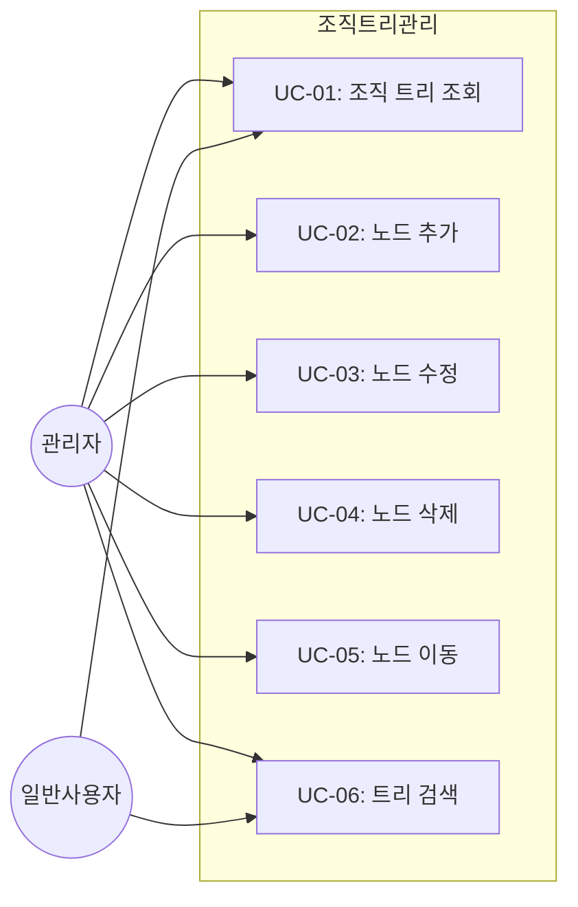
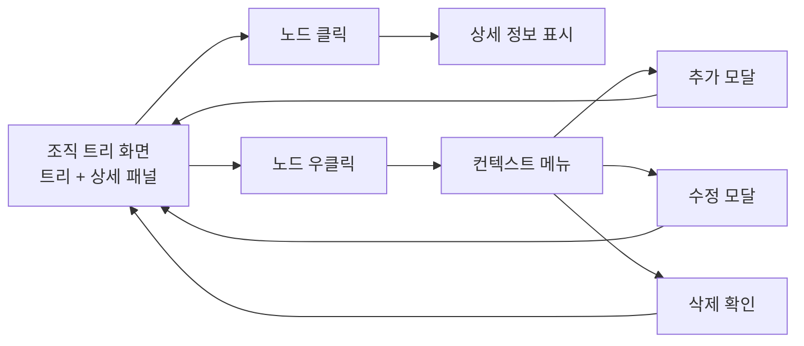
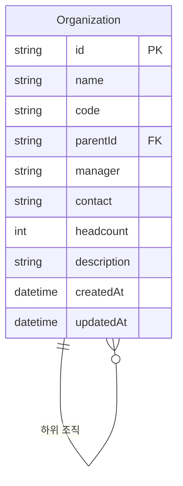

# TSK-06-13 - [샘플] 조직/부서 트리 설계 문서

## 문서 정보

| 항목 | 내용 |
|------|------|
| Task ID | TSK-06-13 |
| 문서 버전 | 1.0 |
| 작성일 | 2026-01-22 |
| 상태 | 작성중 |
| 카테고리 | development |

---

## 1. 개요

### 1.1 배경 및 문제 정의

**현재 상황:**
- MES 포털에서 조직/부서 구조를 관리하는 화면이 필요함
- 계층형 데이터(트리 구조)의 CRUD 패턴을 검증할 샘플 화면이 필요함
- 트리 관리 패턴(노드 추가/수정/삭제, 드래그 앤 드롭)을 표준화하여 재사용 필요

**해결하려는 문제:**
- 계층형 데이터를 효과적으로 시각화하고 관리하는 UI 패턴 부재
- 노드 이동(드래그 앤 드롭)을 통한 조직 구조 변경 기능 필요
- 검색 및 필터링을 통한 대규모 조직 트리 탐색 용이성

### 1.2 목적 및 기대 효과

**목적:**
- 계층형 트리 구조의 CRUD 기능을 갖춘 샘플 화면 구현
- 트리 관리 UI 패턴의 표준화 및 검증
- 마스터-디테일 패턴과 트리 컴포넌트의 통합 검증

**기대 효과:**
- 조직/부서 구조를 직관적으로 시각화하여 관리 용이성 향상
- 드래그 앤 드롭을 통한 빠른 조직 구조 변경
- 트리 관리 패턴을 다른 계층형 데이터(메뉴, 카테고리 등)에 재사용 가능

### 1.3 범위

**포함:**
- 계층형 트리 구조 표시 (Ant Design Tree)
- 노드 추가/수정/삭제 (컨텍스트 메뉴)
- 드래그 앤 드롭으로 노드 위치 이동
- 검색 및 필터링 기능
- 노드 선택 시 우측에 상세 정보 표시 (좌우 분할)
- mock-data/organization.json 데이터 사용

**제외:**
- 실제 API 연동 (향후 과제)
- 서버 사이드 저장 (localStorage로 대체)
- 다중 선택 기능 (단일 선택만 지원)

### 1.4 참조 문서

| 문서 | 경로 | 관련 섹션 |
|------|------|----------|
| PRD | `.orchay/projects/mes-portal/prd.md` | 4.1.1 트리 관리 샘플 |
| TRD | `.orchay/projects/mes-portal/trd.md` | 1.2 UI 라이브러리 |

---

## 2. 사용자 분석

### 2.1 대상 사용자

| 사용자 유형 | 특성 | 주요 니즈 |
|------------|------|----------|
| 관리자 | 조직 구조 관리 권한 보유 | 조직 편집, 부서 이동, 신규 부서 추가 |
| 일반 사용자 | 조회 권한만 보유 | 조직 구조 확인, 담당자 검색 |

### 2.2 사용자 페르소나

**페르소나 1: 인사팀 관리자 김철수**
- 역할: 인사팀 과장, 조직 구조 관리 담당
- 목표: 분기별 조직 개편 시 빠르게 구조 변경
- 불만: 기존 시스템에서 조직 이동이 번거로움
- 시나리오: 드래그 앤 드롭으로 부서를 다른 상위 조직으로 이동

**페르소나 2: 신입사원 박영희**
- 역할: 생산팀 사원, 조직 정보 조회 필요
- 목표: 담당 부서 및 담당자 정보 빠르게 찾기
- 불만: 대규모 조직에서 원하는 부서 찾기 어려움
- 시나리오: 검색 기능으로 특정 부서를 빠르게 찾아 상세 정보 확인

---

## 3. 유즈케이스

### 3.1 유즈케이스 다이어그램



### 3.2 유즈케이스 상세

#### UC-01: 조직 트리 조회

| 항목 | 내용 |
|------|------|
| 액터 | 관리자, 일반 사용자 |
| 목적 | 전체 조직 구조를 트리 형태로 확인 |
| 사전 조건 | 로그인 상태, 조직 트리 화면 접근 |
| 사후 조건 | 조직 트리가 화면에 표시됨 |
| 트리거 | 사이드바 메뉴에서 "조직/부서 트리" 클릭 |

**기본 흐름:**
1. 사용자가 조직/부서 트리 메뉴를 클릭한다
2. 시스템이 조직 데이터를 로드한다
3. 트리 구조가 좌측에 표시된다
4. 루트 노드가 펼쳐진 상태로 표시된다
5. 사용자가 노드를 클릭하여 펼침/접힘을 토글한다

**대안 흐름:**
- 2a. 데이터 로딩 중:
  - 로딩 스피너가 표시된다
  - 로딩 완료 후 트리가 표시된다

#### UC-02: 노드 추가

| 항목 | 내용 |
|------|------|
| 액터 | 관리자 |
| 목적 | 새로운 조직/부서 노드 추가 |
| 사전 조건 | 조직 트리 화면, 관리자 권한 |
| 사후 조건 | 새 노드가 트리에 추가됨 |
| 트리거 | 노드 우클릭 → "하위 노드 추가" 선택 |

**기본 흐름:**
1. 사용자가 부모 노드를 우클릭한다
2. 컨텍스트 메뉴가 표시된다
3. "하위 노드 추가"를 클릭한다
4. 입력 모달이 열린다
5. 부서명, 코드, 담당자 등을 입력한다
6. "저장" 버튼을 클릭한다
7. 새 노드가 부모 노드 하위에 추가된다
8. 성공 토스트 메시지가 표시된다

**예외 흐름:**
- 5a. 필수 값 누락:
  - 에러 메시지가 필드 하단에 표시된다
  - 저장 버튼이 비활성화 상태 유지

#### UC-03: 노드 수정

| 항목 | 내용 |
|------|------|
| 액터 | 관리자 |
| 목적 | 기존 노드 정보 수정 |
| 사전 조건 | 조직 트리 화면, 관리자 권한 |
| 사후 조건 | 노드 정보가 업데이트됨 |
| 트리거 | 노드 우클릭 → "수정" 선택 |

**기본 흐름:**
1. 사용자가 수정할 노드를 우클릭한다
2. 컨텍스트 메뉴에서 "수정"을 클릭한다
3. 수정 모달이 기존 데이터와 함께 열린다
4. 정보를 수정한다
5. "저장" 버튼을 클릭한다
6. 노드 정보가 업데이트된다
7. 성공 토스트 메시지가 표시된다

#### UC-04: 노드 삭제

| 항목 | 내용 |
|------|------|
| 액터 | 관리자 |
| 목적 | 조직/부서 노드 삭제 |
| 사전 조건 | 조직 트리 화면, 관리자 권한 |
| 사후 조건 | 노드 및 하위 노드가 삭제됨 |
| 트리거 | 노드 우클릭 → "삭제" 선택 |

**기본 흐름:**
1. 사용자가 삭제할 노드를 우클릭한다
2. 컨텍스트 메뉴에서 "삭제"를 클릭한다
3. 확인 다이얼로그가 표시된다 ("하위 부서도 함께 삭제됩니다")
4. "확인" 버튼을 클릭한다
5. 노드 및 하위 노드가 삭제된다
6. 성공 토스트 메시지가 표시된다

**대안 흐름:**
- 4a. "취소" 클릭:
  - 다이얼로그가 닫히고 삭제되지 않음

**예외 흐름:**
- 3a. 루트 노드 삭제 시도:
  - "루트 노드는 삭제할 수 없습니다" 에러 표시

#### UC-05: 노드 이동 (드래그 앤 드롭)

| 항목 | 내용 |
|------|------|
| 액터 | 관리자 |
| 목적 | 드래그 앤 드롭으로 노드 위치 변경 |
| 사전 조건 | 조직 트리 화면, 관리자 권한 |
| 사후 조건 | 노드가 새 위치로 이동됨 |
| 트리거 | 노드를 드래그하여 다른 위치에 드롭 |

**기본 흐름:**
1. 사용자가 이동할 노드를 드래그 시작한다
2. 드래그 중 시각적 피드백이 표시된다 (드래그 프리뷰)
3. 대상 위치에 드롭 가능 표시가 나타난다
4. 사용자가 대상 위치에 드롭한다
5. 노드가 새 위치로 이동된다
6. 트리가 자동으로 펼쳐져 이동된 노드가 보인다

**예외 흐름:**
- 3a. 드롭 불가 위치:
  - 금지 아이콘이 표시됨
  - 드롭해도 이동되지 않음

#### UC-06: 트리 검색

| 항목 | 내용 |
|------|------|
| 액터 | 관리자, 일반 사용자 |
| 목적 | 특정 조직/부서를 빠르게 찾기 |
| 사전 조건 | 조직 트리 화면 |
| 사후 조건 | 검색 결과에 해당하는 노드가 강조됨 |
| 트리거 | 검색 입력창에 검색어 입력 |

**기본 흐름:**
1. 사용자가 검색 입력창에 검색어를 입력한다
2. 입력 디바운스 후 검색이 실행된다 (300ms)
3. 검색어와 일치하는 노드가 강조 표시된다
4. 해당 노드가 보이도록 부모 노드가 자동 펼침된다
5. 검색 결과 개수가 표시된다 ("3건 검색됨")

**대안 흐름:**
- 3a. 검색 결과 없음:
  - "검색 결과가 없습니다" 메시지 표시

---

## 4. 사용자 시나리오

### 4.1 시나리오 1: 신규 부서 추가

**상황 설명:**
인사팀 관리자 김철수가 생산본부 아래에 새로운 "품질혁신팀"을 추가해야 한다.

**단계별 진행:**

| 단계 | 사용자 행동 | 시스템 반응 | 사용자 기대 |
|------|-----------|------------|------------|
| 1 | 조직/부서 트리 메뉴 클릭 | 조직 트리 화면 로드 | 전체 조직 구조 표시 |
| 2 | 검색창에 "생산본부" 입력 | 생산본부 노드 강조 | 빠르게 찾기 |
| 3 | 생산본부 노드 우클릭 | 컨텍스트 메뉴 표시 | 추가 메뉴 표시 |
| 4 | "하위 노드 추가" 클릭 | 입력 모달 열림 | 부서 정보 입력 폼 |
| 5 | 부서명: "품질혁신팀", 코드: "QI" 입력 | 입력 값 반영 | 유효성 검사 통과 |
| 6 | "저장" 버튼 클릭 | 새 노드 추가, 성공 토스트 | 트리에 반영 확인 |

**성공 조건:**
- 생산본부 하위에 "품질혁신팀" 노드가 추가됨
- 새 노드가 선택 상태가 되어 우측 상세 패널에 표시됨

### 4.2 시나리오 2: 조직 구조 변경 (드래그 앤 드롭)

**상황 설명:**
조직 개편으로 "기술지원팀"을 "생산본부"에서 "경영지원본부"로 이동해야 한다.

**단계별 진행:**

| 단계 | 사용자 행동 | 시스템 반응 | 사용자 기대 |
|------|-----------|------------|------------|
| 1 | 트리에서 "기술지원팀" 노드 확인 | 노드 표시 | 현재 위치 확인 |
| 2 | "기술지원팀" 노드 드래그 시작 | 드래그 프리뷰 표시 | 시각적 피드백 |
| 3 | "경영지원본부" 위로 드래그 | 드롭 가능 표시 | 이동 가능 확인 |
| 4 | 드롭 | 노드 이동, 트리 재렌더링 | 새 위치에 표시 |

**성공 조건:**
- "기술지원팀"이 "경영지원본부" 하위로 이동됨
- 하위 부서도 함께 이동됨

### 4.3 시나리오 3: 부서 정보 조회

**상황 설명:**
신입사원 박영희가 "품질관리팀"의 담당자와 연락처를 확인해야 한다.

**단계별 진행:**

| 단계 | 사용자 행동 | 시스템 반응 | 복구 방법 |
|------|-----------|------------|----------|
| 1 | 검색창에 "품질관리" 입력 | 해당 노드 강조 | - |
| 2 | 강조된 노드 클릭 | 노드 선택, 상세 패널 표시 | - |
| 3 | 상세 패널에서 정보 확인 | 부서명, 담당자, 연락처 표시 | - |

---

## 5. 화면 설계

### 5.1 화면 흐름도



### 5.2 화면별 상세

#### 화면 1: 조직 트리 메인 화면

**화면 목적:**
조직 구조를 트리 형태로 시각화하고, 노드 선택 시 상세 정보를 표시하는 마스터-디테일 화면

**진입 경로:**
- 사이드바 메뉴 → "샘플" → "조직/부서 트리"

**와이어프레임:**
```
┌─────────────────────────────────────────────────────────────────────────┐
│  조직/부서 트리                                           [+ 루트 추가]  │
├─────────────────────────────────────────────────────────────────────────┤
│  ┌────────────────────────┐                                             │
│  │ 🔍 검색...            │  "3건 검색됨"                                │
│  └────────────────────────┘                                             │
├─────────────────────────────┬───────────────────────────────────────────┤
│                             │                                           │
│  📁 주식회사 A              │   부서 상세 정보                          │
│   ├── 📁 경영지원본부       │   ─────────────────                       │
│   │    ├── 📄 인사팀        │                                           │
│   │    ├── 📄 재무팀        │   부서명: 생산1팀                         │
│   │    └── 📄 총무팀        │   부서 코드: P1                           │
│   ├── 📁 생산본부           │   상위 부서: 생산본부                     │
│   │    ├── 📄 생산1팀 ←선택 │   담당자: 이철수                          │
│   │    ├── 📄 생산2팀       │   연락처: 02-1234-5678                    │
│   │    └── 📄 품질관리팀    │   인원: 15명                              │
│   └── 📁 영업본부           │   설명: 제품 A 생산 담당                  │
│        ├── 📄 국내영업팀    │                                           │
│        └── 📄 해외영업팀    │   생성일: 2024-01-15                      │
│                             │   수정일: 2026-01-10                      │
│                             │                                           │
│                             │   [수정]  [삭제]                          │
│                             │                                           │
├─────────────────────────────┴───────────────────────────────────────────┤
│  드래그하여 노드 위치를 변경할 수 있습니다.                              │
└─────────────────────────────────────────────────────────────────────────┘
```

**화면 요소 설명:**

| 영역 | 설명 | 사용자 인터랙션 |
|------|------|----------------|
| 헤더 | 화면 제목, 루트 추가 버튼 | 버튼 클릭 시 루트 노드 추가 모달 |
| 검색 영역 | 검색 입력창, 결과 개수 | 검색어 입력 시 실시간 필터링 |
| 트리 영역 (좌측) | 조직 트리 구조 | 클릭 선택, 우클릭 메뉴, 드래그 이동 |
| 상세 패널 (우측) | 선택된 노드의 상세 정보 | 수정/삭제 버튼 |
| 푸터 | 도움말 텍스트 | - |

**사용자 행동 시나리오:**
1. 사용자가 화면에 진입하면 전체 조직 트리를 본다
2. 검색창에 입력하면 해당 노드가 강조된다
3. 노드를 클릭하면 우측 상세 패널에 정보가 표시된다
4. 노드를 우클릭하면 컨텍스트 메뉴(추가/수정/삭제)가 나타난다
5. 노드를 드래그하면 다른 위치로 이동할 수 있다

#### 화면 2: 노드 추가/수정 모달

**화면 목적:**
새 조직/부서를 추가하거나 기존 정보를 수정하는 폼

**와이어프레임:**
```
┌─────────────────────────────────────────────────┐
│  부서 추가                                   ✕  │
├─────────────────────────────────────────────────┤
│                                                 │
│  부서명 *                                       │
│  ┌───────────────────────────────────────────┐ │
│  │                                           │ │
│  └───────────────────────────────────────────┘ │
│                                                 │
│  부서 코드 *                                    │
│  ┌───────────────────────────────────────────┐ │
│  │                                           │ │
│  └───────────────────────────────────────────┘ │
│                                                 │
│  담당자                                         │
│  ┌───────────────────────────────────────────┐ │
│  │                                           │ │
│  └───────────────────────────────────────────┘ │
│                                                 │
│  연락처                                         │
│  ┌───────────────────────────────────────────┐ │
│  │                                           │ │
│  └───────────────────────────────────────────┘ │
│                                                 │
│  인원                                           │
│  ┌───────────────────────────────────────────┐ │
│  │ 0                                         │ │
│  └───────────────────────────────────────────┘ │
│                                                 │
│  설명                                           │
│  ┌───────────────────────────────────────────┐ │
│  │                                           │ │
│  │                                           │ │
│  └───────────────────────────────────────────┘ │
│                                                 │
│                         [취소]      [저장]      │
│                                                 │
└─────────────────────────────────────────────────┘
```

### 5.3 반응형 동작

| 화면 크기 | 레이아웃 변화 | 사용자 경험 |
|----------|--------------|------------|
| 데스크톱 (1024px+) | 좌우 분할 (트리 40%, 상세 60%) | 동시 조회 가능 |
| 태블릿 (768-1023px) | 좌우 분할 (트리 50%, 상세 50%) | 약간 좁은 상세 패널 |
| 모바일 (767px-) | 단일 컬럼 (탭 전환) | 트리/상세 탭으로 전환 |

---

## 6. 인터랙션 설계

### 6.1 사용자 액션과 피드백

| 사용자 액션 | 즉각 피드백 | 결과 피드백 | 에러 피드백 |
|------------|-----------|------------|------------|
| 노드 클릭 | 선택 상태 표시 (배경색) | 상세 패널 업데이트 | - |
| 노드 더블클릭 | 펼침/접힘 토글 | 하위 노드 표시/숨김 | - |
| 노드 우클릭 | 컨텍스트 메뉴 표시 | 메뉴 항목 클릭 시 동작 | - |
| 드래그 시작 | 드래그 프리뷰 표시 | - | - |
| 드래그 중 | 드롭 가능 영역 표시 | - | 불가 영역 금지 아이콘 |
| 드롭 | 노드 이동 애니메이션 | 트리 구조 업데이트 | 이동 불가 시 원위치 |
| 검색 입력 | 입력 표시 | 결과 강조, 개수 표시 | 결과 없음 메시지 |
| 저장 버튼 | 버튼 로딩 상태 | 성공 토스트 | 에러 메시지 |

### 6.2 상태별 화면 변화

| 상태 | 화면 표시 | 사용자 안내 |
|------|----------|------------|
| 초기 로딩 | 트리 영역 스켈레톤 | "불러오는 중..." |
| 데이터 없음 | 빈 트리 이미지 | "조직 데이터가 없습니다. 루트 노드를 추가해주세요." |
| 노드 미선택 | 상세 패널 안내 | "좌측 트리에서 조직을 선택하세요." |
| 검색 결과 없음 | 검색 영역 안내 | "'{검색어}'에 대한 검색 결과가 없습니다." |
| 저장 성공 | 성공 토스트 | "저장되었습니다." |
| 삭제 성공 | 성공 토스트 | "삭제되었습니다." |

### 6.3 키보드/접근성

| 기능 | 키보드 단축키 | 스크린 리더 안내 |
|------|-------------|-----------------|
| 노드 선택 이동 | 화살표 키 (↑↓) | "생산1팀, 펼쳐짐, 3개 하위 항목" |
| 노드 펼침/접힘 | Enter 또는 →/← | "펼쳐짐" / "접혀짐" |
| 검색 포커스 | Ctrl+F | "검색 입력창" |
| 선택 노드 삭제 | Delete | "삭제 확인 대화상자" |
| 모달 닫기 | Escape | "대화상자 닫힘" |

---

## 7. 데이터 요구사항

### 7.1 필요한 데이터

| 데이터 | 설명 | 출처 | 용도 |
|--------|------|------|------|
| 조직 트리 데이터 | 계층형 조직 구조 | mock-data/organization.json | 트리 렌더링 |
| 노드 상세 정보 | 부서명, 코드, 담당자 등 | 트리 데이터 내 포함 | 상세 패널 표시 |

### 7.2 데이터 관계



**관계 설명:**
- Organization은 자기참조 관계로 부모-자식 계층 구조 형성
- parentId가 null이면 루트 노드
- 하나의 부모 노드는 여러 자식 노드를 가질 수 있음

### 7.3 데이터 유효성 규칙

| 데이터 필드 | 규칙 | 위반 시 메시지 |
|------------|------|---------------|
| name (부서명) | 필수, 2-50자 | "부서명은 2-50자 사이로 입력해주세요" |
| code (부서 코드) | 필수, 영문/숫자, 2-10자 | "부서 코드는 영문/숫자 2-10자로 입력해주세요" |
| code (중복 검사) | 동일 부서 코드 없음 | "이미 사용 중인 부서 코드입니다" |
| manager (담당자) | 선택, 최대 20자 | "담당자명은 20자 이내로 입력해주세요" |
| headcount (인원) | 선택, 0 이상 정수 | "인원은 0 이상의 숫자로 입력해주세요" |

---

## 8. 비즈니스 규칙

### 8.1 핵심 규칙

| 규칙 ID | 규칙 설명 | 적용 상황 | 예외 |
|---------|----------|----------|------|
| BR-01 | 루트 노드는 삭제 불가 | 노드 삭제 시 | 없음 |
| BR-02 | 자기 자신 또는 하위 노드로 이동 불가 | 드래그 앤 드롭 시 | 없음 |
| BR-03 | 부서 코드는 전체 트리에서 고유 | 노드 추가/수정 시 | 없음 |
| BR-04 | 노드 삭제 시 하위 노드도 함께 삭제 | 노드 삭제 시 | 없음 |

### 8.2 규칙 상세 설명

**BR-01: 루트 노드 삭제 불가**

설명: 트리의 최상위 노드(회사)는 삭제할 수 없음. 전체 조직 구조의 루트가 유지되어야 함.

예시:
- "주식회사 A" (루트) 삭제 시도 → 에러 메시지 표시
- "경영지원본부" (2레벨) 삭제 → 정상 삭제

**BR-02: 순환 참조 방지**

설명: 노드를 자기 자신 또는 자신의 하위 노드로 이동할 수 없음. 순환 참조로 인한 무한 루프 방지.

예시:
- "생산본부"를 "생산1팀" (자기 하위) 아래로 이동 시도 → 드롭 불가 표시
- "생산본부"를 "경영지원본부" (형제) 아래로 이동 → 정상 이동

---

## 9. 에러 처리

### 9.1 예상 에러 상황

| 상황 | 원인 | 사용자 메시지 | 복구 방법 |
|------|------|--------------|----------|
| 입력 오류 | 필수 값 누락 | "필수 항목을 입력해주세요" | 필드 포커스 이동 |
| 중복 코드 | 이미 존재하는 코드 | "이미 사용 중인 부서 코드입니다" | 다른 코드 입력 |
| 루트 삭제 시도 | 루트 노드 삭제 | "루트 노드는 삭제할 수 없습니다" | 삭제 취소 |
| 순환 이동 시도 | 자기 하위로 이동 | "해당 위치로 이동할 수 없습니다" | 드래그 취소 |
| 데이터 로드 실패 | JSON 파일 오류 | "데이터를 불러오는 데 실패했습니다" | 새로고침 버튼 |

### 9.2 에러 표시 방식

| 에러 유형 | 표시 위치 | 표시 방법 |
|----------|----------|----------|
| 필드 오류 | 해당 필드 하단 | 빨간색 텍스트 |
| 폼 전체 오류 | 모달 상단 | 경고 Alert |
| 시스템 오류 | 화면 상단 | 에러 토스트 |
| 작업 오류 | 컨텍스트 | 경고 토스트 |

---

## 10. 연관 문서

> 상세 테스트 명세 및 요구사항 추적은 별도 문서에서 관리합니다.

| 문서 | 경로 | 용도 |
|------|------|------|
| 요구사항 추적 매트릭스 | `025-traceability-matrix.md` | PRD → 설계 → 테스트 양방향 추적 |
| 테스트 명세서 | `026-test-specification.md` | 단위/E2E/매뉴얼 테스트 상세 정의 |

---

## 11. 구현 범위

### 11.1 영향받는 영역

| 영역 | 변경 내용 | 영향도 |
|------|----------|--------|
| screens/sample/ | OrganizationTree.tsx 신규 생성 | 높음 |
| mock-data/ | organization.json 신규 생성 | 낮음 |
| lib/hooks/ | useOrganizationTree 훅 (선택) | 중간 |

### 11.2 의존성

| 의존 항목 | 이유 | 상태 |
|----------|------|------|
| TSK-00-02 | Ant Design Tree 컴포넌트 사용 | 완료 |
| Ant Design Tree | 트리 렌더링, 드래그 앤 드롭 | 설치됨 |

### 11.3 제약 사항

| 제약 | 설명 | 대응 방안 |
|------|------|----------|
| 샘플 화면 | 실제 API 연동 없음 | mock-data JSON 사용 |
| 데이터 영속성 | 새로고침 시 초기화 | localStorage 사용 (선택) |

---

## 12. 체크리스트

### 12.1 설계 완료 확인

- [x] 문제 정의 및 목적 명확화
- [x] 사용자 분석 완료
- [x] 유즈케이스 정의 완료
- [x] 사용자 시나리오 작성 완료
- [x] 화면 설계 완료 (와이어프레임)
- [x] 인터랙션 설계 완료
- [x] 데이터 요구사항 정의 완료
- [x] 비즈니스 규칙 정의 완료
- [x] 에러 처리 정의 완료

### 12.2 연관 문서 작성

- [ ] 요구사항 추적 매트릭스 작성 (→ `025-traceability-matrix.md`)
- [ ] 테스트 명세서 작성 (→ `026-test-specification.md`)

### 12.3 구현 준비

- [x] 구현 우선순위 결정
- [x] 의존성 확인 완료
- [x] 제약 사항 검토 완료

---

## 변경 이력

| 버전 | 일자 | 작성자 | 변경 내용 |
|------|------|--------|----------|
| 1.0 | 2026-01-22 | Claude | 최초 작성 |
