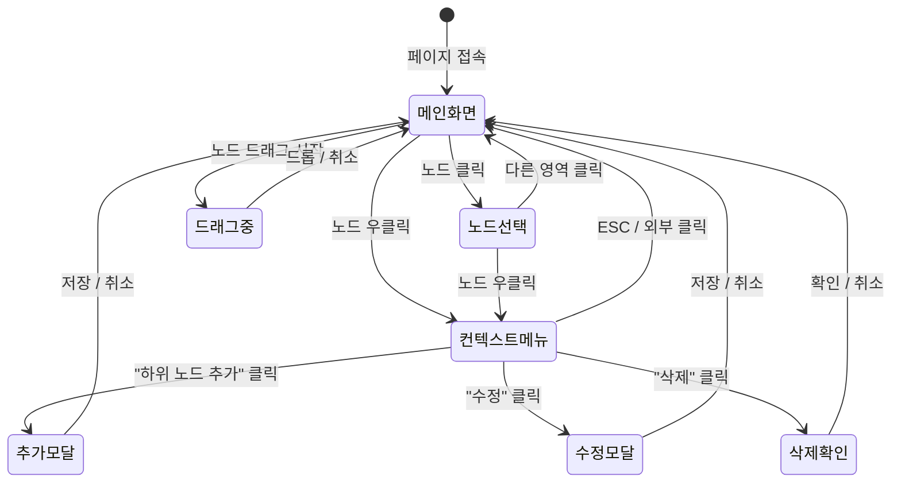
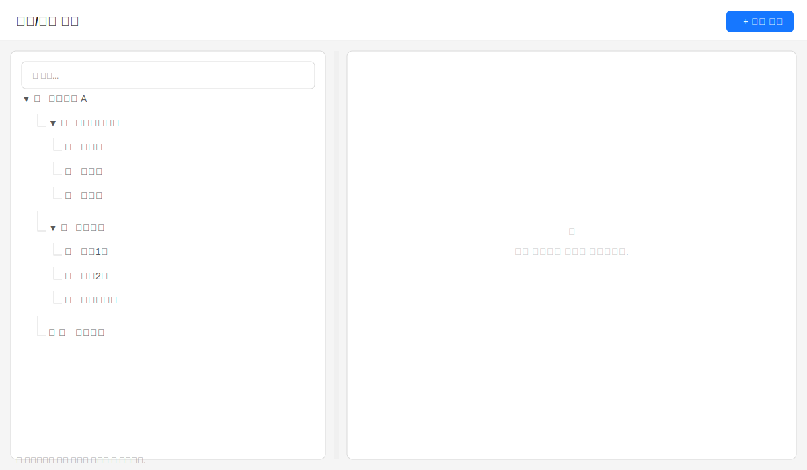
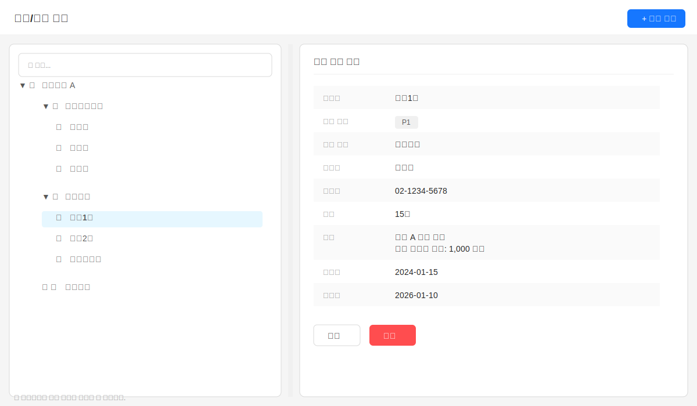
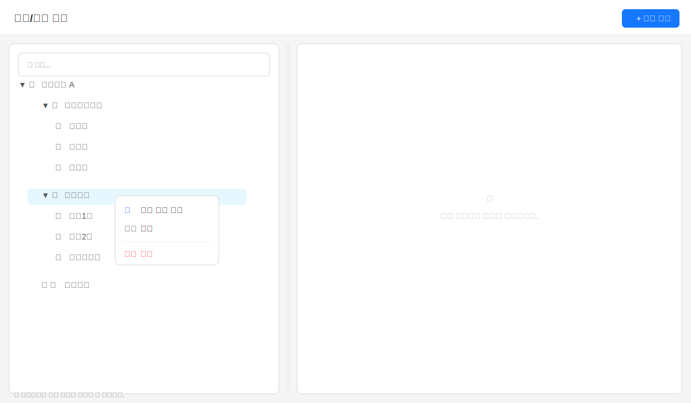
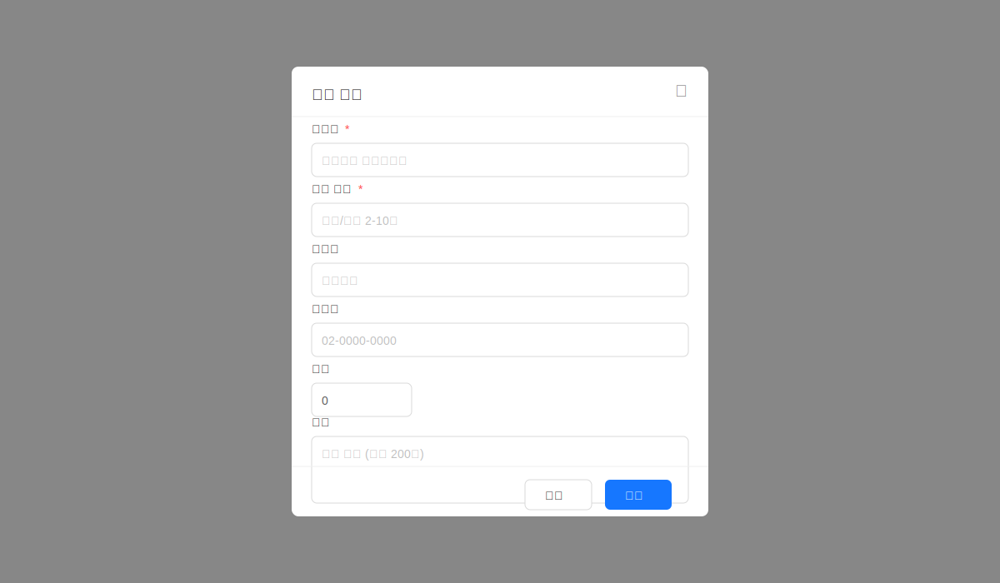

# TSK-06-13 화면 설계 문서 (011-ui-design.md)

**Version:** 1.0 — **Last Updated:** 2026-01-22

> **참조**: 이 문서는 `010-design.md`와 함께 사용됩니다.

---

## 0. 문서 메타데이터

| 항목 | 내용 |
|------|------|
| Task ID | TSK-06-13 |
| Task명 | [샘플] 조직/부서 트리 |
| 설계 문서 참조 | `010-design.md` |
| 작성일 | 2026-01-22 |
| 작성자 | Claude |

---

## 1. 화면 목록

| 화면 ID | 화면명 | 목적 | SVG 파일 |
|---------|--------|------|----------|
| SCR-01 | 조직 트리 메인 | 트리 조회 및 관리 | screen-01-organization-tree.svg |
| SCR-02 | 노드 선택 상태 | 상세 정보 표시 | screen-02-node-selected.svg |
| SCR-03 | 컨텍스트 메뉴 | 노드 우클릭 메뉴 | screen-03-context-menu.svg |
| SCR-04 | 추가/수정 모달 | 노드 정보 입력 | screen-04-form-modal.svg |

---

## 2. 화면 전환 흐름

### 2.1 액션-화면 매트릭스

| 현재 화면 | 사용자 액션 | 결과 화면 | 비고 |
|----------|------------|----------|------|
| 메인화면 | 노드 클릭 | 노드선택 상태 | 상세 패널 업데이트 |
| 메인화면 | 노드 우클릭 | 컨텍스트 메뉴 | - |
| 메인화면 | 검색어 입력 | 메인화면 (필터 적용) | 노드 강조 |
| 메인화면 | 노드 드래그 | 드래그 중 상태 | 프리뷰 표시 |
| 컨텍스트 메뉴 | 하위 노드 추가 클릭 | 추가 모달 | - |
| 컨텍스트 메뉴 | 수정 클릭 | 수정 모달 | 기존 데이터 로드 |
| 컨텍스트 메뉴 | 삭제 클릭 | 삭제 확인 다이얼로그 | - |
| 추가/수정 모달 | 저장 클릭 | 메인화면 | 성공 토스트 |
| 추가/수정 모달 | 취소 클릭 | 메인화면 | - |

---

## 3. 화면별 상세

### 3.1 SCR-01: 조직 트리 메인 화면

**화면 목적:** 조직 구조를 트리 형태로 시각화하고, 검색/필터링/CRUD 기능 제공

**레이아웃:**
- 좌우 분할 레이아웃 (Ant Design Splitter)
- 좌측: 검색 + 트리 (40%)
- 우측: 상세 정보 패널 (60%)

**컴포넌트 구성:**

| 영역 | 컴포넌트 | Ant Design | Props |
|------|----------|------------|-------|
| 헤더 | 제목 + 버튼 | Typography.Title, Button | - |
| 검색 | 검색 입력 | Input.Search | allowClear, placeholder |
| 트리 | 조직 트리 | Tree | draggable, showIcon, onSelect, onRightClick, onDrop |
| 상세 | 상세 정보 | Descriptions | bordered, column={1} |
| 버튼 | 액션 버튼 | Space, Button | - |

**상태 관리:**
- `selectedNode`: 선택된 노드 ID
- `treeData`: 트리 데이터 배열
- `searchValue`: 검색어
- `expandedKeys`: 펼쳐진 노드 키 배열

**SVG 참조:** `ui-assets/screen-01-organization-tree.svg`

---

### 3.2 SCR-02: 노드 선택 상태

**화면 목적:** 선택된 노드의 상세 정보를 우측 패널에 표시

**상세 패널 필드:**

| 필드명 | 데이터 키 | 표시 형식 |
|--------|----------|----------|
| 부서명 | name | 텍스트 |
| 부서 코드 | code | 텍스트 (Badge) |
| 상위 부서 | parentName | 텍스트 |
| 담당자 | manager | 텍스트 |
| 연락처 | contact | 텍스트 (전화번호 형식) |
| 인원 | headcount | 숫자 + "명" |
| 설명 | description | 텍스트 (여러 줄) |
| 생성일 | createdAt | YYYY-MM-DD |
| 수정일 | updatedAt | YYYY-MM-DD |

**액션 버튼:**
- 수정: 수정 모달 열기
- 삭제: 삭제 확인 다이얼로그

**SVG 참조:** `ui-assets/screen-02-node-selected.svg`

---

### 3.3 SCR-03: 컨텍스트 메뉴

**화면 목적:** 노드 우클릭 시 CRUD 메뉴 제공

**메뉴 항목:**

| 항목 | 아이콘 | 동작 | 조건 |
|------|--------|------|------|
| 하위 노드 추가 | PlusOutlined | 추가 모달 열기 | 항상 활성 |
| 수정 | EditOutlined | 수정 모달 열기 | 항상 활성 |
| 삭제 | DeleteOutlined | 삭제 확인 | 루트 노드면 비활성 |

**컴포넌트:**
- Ant Design Dropdown (trigger: contextMenu)
- Menu.Item으로 메뉴 구성

**SVG 참조:** `ui-assets/screen-03-context-menu.svg`

---

### 3.4 SCR-04: 추가/수정 모달

**화면 목적:** 새 노드 추가 또는 기존 노드 정보 수정

**폼 필드:**

| 필드명 | 컴포넌트 | 필수 | 규칙 |
|--------|----------|------|------|
| 부서명 | Input | ✅ | 2-50자 |
| 부서 코드 | Input | ✅ | 영문/숫자 2-10자, 고유 |
| 담당자 | Input | - | 최대 20자 |
| 연락처 | Input | - | 전화번호 형식 |
| 인원 | InputNumber | - | 0 이상 정수 |
| 설명 | Input.TextArea | - | 최대 200자 |

**모달 속성:**
- width: 500px
- title: "부서 추가" / "부서 수정"
- footer: 취소, 저장 버튼
- destroyOnClose: true

**SVG 참조:** `ui-assets/screen-04-form-modal.svg`

---

## 4. 공통 컴포넌트

### 4.1 삭제 확인 다이얼로그

**사용:** Modal.confirm

**속성:**
- title: "삭제 확인"
- content: "'{부서명}'을(를) 삭제하시겠습니까? 하위 부서도 함께 삭제됩니다."
- okText: "삭제"
- okType: "danger"
- cancelText: "취소"

### 4.2 성공/에러 토스트

**사용:** message (Ant Design)

| 상황 | 타입 | 메시지 |
|------|------|--------|
| 추가 성공 | success | "부서가 추가되었습니다." |
| 수정 성공 | success | "부서 정보가 수정되었습니다." |
| 삭제 성공 | success | "부서가 삭제되었습니다." |
| 중복 코드 | error | "이미 사용 중인 부서 코드입니다." |
| 루트 삭제 | error | "루트 노드는 삭제할 수 없습니다." |

### 4.3 Empty 상태

**사용:** Empty (Ant Design)

| 상황 | description |
|------|-------------|
| 노드 미선택 | "좌측 트리에서 조직을 선택하세요." |
| 검색 결과 없음 | "'{검색어}'에 대한 검색 결과가 없습니다." |
| 데이터 없음 | "조직 데이터가 없습니다. 루트 노드를 추가해주세요." |

---

## 5. 반응형 설계

### 5.1 Breakpoint 정의

| Breakpoint | 화면 너비 | 레이아웃 |
|------------|----------|----------|
| Desktop | 1024px+ | 좌우 분할 (40:60) |
| Tablet | 768-1023px | 좌우 분할 (50:50) |
| Mobile | 767px- | 단일 컬럼 + 탭 전환 |

### 5.2 모바일 대응

**레이아웃 변경:**
- 트리와 상세를 탭으로 분리
- Tabs 컴포넌트 사용 (트리 탭 / 상세 탭)
- 노드 선택 시 자동으로 상세 탭으로 전환

**터치 대응:**
- 드래그 앤 드롭 비활성화 (모바일)
- 컨텍스트 메뉴 → 롱프레스로 트리거
- 터치 영역 확대 (44px 이상)

---

## 6. 접근성

### 6.1 키보드 네비게이션

| 키 | 동작 |
|-----|------|
| ↑/↓ | 트리 노드 이동 |
| ←/→ | 노드 접힘/펼침 |
| Enter | 노드 선택 |
| Space | 노드 체크 (체크박스 모드 시) |
| Ctrl+F | 검색 입력 포커스 |
| Delete | 선택 노드 삭제 (확인 후) |
| Escape | 모달/메뉴 닫기 |

### 6.2 ARIA 속성

| 요소 | ARIA 속성 |
|------|-----------|
| 트리 컨테이너 | role="tree", aria-label="조직 트리" |
| 트리 노드 | role="treeitem", aria-expanded, aria-selected |
| 검색 입력 | aria-label="조직 검색" |
| 상세 패널 | aria-live="polite" (선택 변경 시) |

### 6.3 색상 대비

| 요소 | 전경색 | 배경색 | 대비율 |
|------|--------|--------|--------|
| 선택 노드 | #000000 | #e6f7ff | 12.63:1 |
| 검색 강조 | #fa8c16 | transparent | - |
| 에러 텍스트 | #ff4d4f | #ffffff | 4.5:1 이상 |

---

## 7. SVG 파일 목록

### 7.1 파일 목록

| 파일명 | 화면 | 상태 |
|--------|------|------|
| screen-01-organization-tree.svg | 메인 화면 (초기) | 기본 |
| screen-02-node-selected.svg | 노드 선택 상태 | 선택됨 |
| screen-03-context-menu.svg | 컨텍스트 메뉴 | 우클릭 |
| screen-04-form-modal.svg | 추가/수정 모달 | 모달 열림 |

### 7.2 SVG 미리보기

#### screen-01-organization-tree.svg

#### screen-02-node-selected.svg

#### screen-03-context-menu.svg

#### screen-04-form-modal.svg

---

## 변경 이력

| 버전 | 일자 | 작성자 | 변경 내용 |
|------|------|--------|----------|
| 1.0 | 2026-01-22 | Claude | 최초 작성 |
