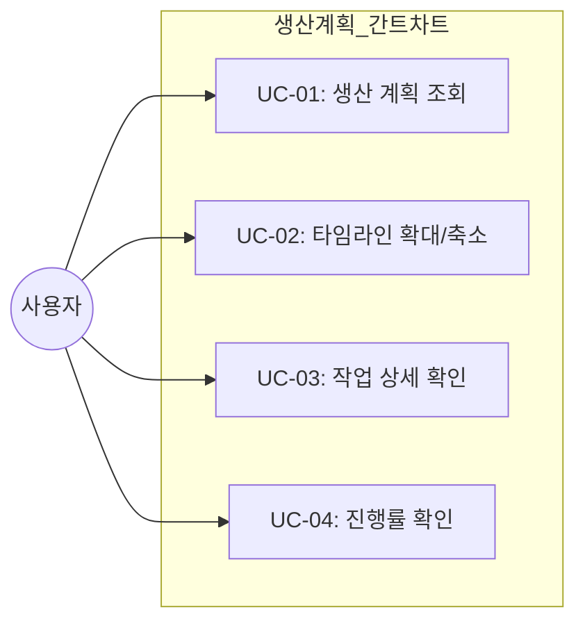
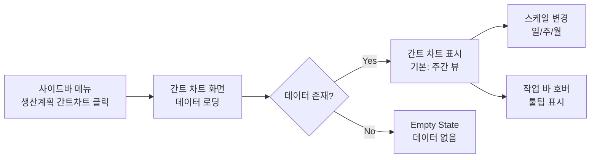

# TSK-06-14 - [샘플] 생산 계획 간트 차트 설계 문서

## 문서 정보

| 항목 | 내용 |
|------|------|
| Task ID | TSK-06-14 |
| 문서 버전 | 1.0 |
| 작성일 | 2026-01-22 |
| 상태 | 작성중 |
| 카테고리 | development |

---

## 1. 개요

### 1.1 배경 및 문제 정의

**현재 상황:**
- MES 포털에서 생산 계획을 시간 기반으로 시각화하는 기능이 없음
- 생산 담당자가 작업 일정을 한눈에 파악하기 어려움
- 작업 간 의존성과 진행률을 직관적으로 확인할 수 없음

**해결하려는 문제:**
- 타임라인 형태로 생산 계획을 시각화하여 일정 관리 효율성 향상
- 작업별 시작일~종료일을 바 형태로 표시하여 직관적 이해 제공
- 확대/축소 기능으로 일/주/월 단위로 상세 또는 전체 일정 확인 가능

### 1.2 목적 및 기대 효과

**목적:**
- 간트 차트/타임라인 패턴 검증용 샘플 화면 구현
- 생산 계획 데이터를 시간축 기반으로 시각화

**기대 효과:**
- 생산 담당자가 일정 계획을 한눈에 파악 가능
- 화면 템플릿 검증을 통한 재사용 가능한 패턴 확보
- 간트 차트 UI 컴포넌트의 MES 포털 적용 가능성 검증

### 1.3 범위

**포함:**
- 타임라인 형태의 일정 표시
- 작업 항목 바 (시작일~종료일)
- 확대/축소 (일/주/월 단위)
- 진행률 표시
- 바 호버 시 상세 정보 툴팁
- mock-data/production-plan.json 데이터 사용

**제외:**
- 의존성 연결선 (옵션 - 기본 구현에서 제외)
- 실제 API 연동 (MVP에서는 Mock 데이터 사용)
- 드래그로 일정 수정 기능

### 1.4 참조 문서

| 문서 | 경로 | 관련 섹션 |
|------|------|----------|
| PRD | `.orchay/projects/mes-portal/prd.md` | 4.1.1 생산 계획 간트 차트 |
| TRD | `.orchay/projects/mes-portal/trd.md` | 1.2, 7 |

---

## 2. 사용자 분석

### 2.1 대상 사용자

| 사용자 유형 | 특성 | 주요 니즈 |
|------------|------|----------|
| 생산 담당자 | 라인별 생산 관리 담당, PC 사용 숙련 | 작업 일정 한눈에 파악, 진행 상황 확인 |
| 공장장/관리자 | 전체 생산 현황 관리, 의사결정자 | 전체 생산 계획 조망, 병목 구간 파악 |

### 2.2 사용자 페르소나

**페르소나 1: 김생산**
- 역할: 생산 담당자
- 목표: 담당 라인의 작업 일정을 효율적으로 관리
- 불만: 엑셀로 일정 관리 시 시각적 파악 어려움
- 시나리오: 매일 아침 금일/금주 작업 일정 확인, 진행률 모니터링

**페르소나 2: 박공장**
- 역할: 공장장
- 목표: 전체 생산 라인의 일정 현황 파악
- 불만: 여러 보고서를 종합해야 전체 현황 파악 가능
- 시나리오: 주간 회의 전 전체 생산 계획 검토, 월간 계획 조정

---

## 3. 유즈케이스

### 3.1 유즈케이스 다이어그램



### 3.2 유즈케이스 상세

#### UC-01: 생산 계획 조회

| 항목 | 내용 |
|------|------|
| 액터 | 생산 담당자, 공장장 |
| 목적 | 생산 계획을 타임라인 형태로 조회 |
| 사전 조건 | 사용자가 로그인된 상태 |
| 사후 조건 | 간트 차트에 생산 계획이 표시됨 |
| 트리거 | 사이드바 메뉴에서 "생산 계획 간트 차트" 클릭 |

**기본 흐름:**
1. 사용자가 사이드바에서 메뉴를 클릭한다
2. 시스템이 간트 차트 화면을 로드한다
3. 시스템이 mock-data/production-plan.json 데이터를 로드한다
4. 시스템이 타임라인에 작업 바를 렌더링한다
5. 사용자에게 생산 계획 간트 차트가 표시된다

**대안 흐름:**
- 3a. 만약 데이터 로딩 중이면:
  - 시스템이 로딩 스피너를 표시한다
  - 로딩 완료 후 차트를 표시한다

**예외 흐름:**
- 3a. 만약 데이터가 없으면:
  - 시스템이 "등록된 생산 계획이 없습니다" Empty 상태를 표시한다

#### UC-02: 타임라인 확대/축소

| 항목 | 내용 |
|------|------|
| 액터 | 생산 담당자, 공장장 |
| 목적 | 일/주/월 단위로 타임라인 스케일 변경 |
| 사전 조건 | 간트 차트가 표시된 상태 |
| 사후 조건 | 선택한 스케일로 타임라인이 변경됨 |
| 트리거 | 확대/축소 컨트롤 조작 |

**기본 흐름:**
1. 사용자가 스케일 선택 컨트롤(일/주/월)을 클릭한다
2. 시스템이 선택된 스케일에 맞게 타임라인을 재렌더링한다
3. 작업 바가 새 스케일에 맞게 조정된다

#### UC-03: 작업 상세 확인

| 항목 | 내용 |
|------|------|
| 액터 | 생산 담당자, 공장장 |
| 목적 | 특정 작업의 상세 정보 확인 |
| 사전 조건 | 간트 차트에 작업 바가 표시된 상태 |
| 사후 조건 | 작업 상세 정보가 툴팁으로 표시됨 |
| 트리거 | 작업 바에 마우스 호버 |

**기본 흐름:**
1. 사용자가 작업 바 위에 마우스를 올린다
2. 시스템이 툴팁으로 상세 정보를 표시한다
   - 작업명, 제품명, 수량
   - 시작일, 종료일
   - 담당 라인
   - 진행률

#### UC-04: 진행률 확인

| 항목 | 내용 |
|------|------|
| 액터 | 생산 담당자, 공장장 |
| 목적 | 각 작업의 진행 상황 파악 |
| 사전 조건 | 간트 차트가 표시된 상태 |
| 사후 조건 | 진행률이 시각적으로 확인됨 |
| 트리거 | 화면 조회 시 자동 |

**기본 흐름:**
1. 시스템이 각 작업 바 내부에 진행률을 표시한다
2. 진행된 부분은 다른 색상으로 채워진다
3. 진행률 퍼센트가 바 내부 또는 툴팁에 표시된다

---

## 4. 사용자 시나리오

### 4.1 시나리오 1: 금주 생산 계획 확인

**상황 설명:**
생산 담당자 김생산이 월요일 아침 출근하여 금주 담당 라인의 생산 계획을 확인하려 한다.

**단계별 진행:**

| 단계 | 사용자 행동 | 시스템 반응 | 사용자 기대 |
|------|-----------|------------|------------|
| 1 | 포털 로그인 후 메뉴 클릭 | 간트 차트 화면 로드 | 생산 계획 차트 표시 |
| 2 | "주간" 스케일 선택 | 주 단위 타임라인 표시 | 금주 일정 한눈에 파악 |
| 3 | 특정 작업 바 호버 | 툴팁으로 상세 정보 표시 | 작업 세부사항 확인 |
| 4 | 진행률 확인 | 진행된 부분 색상 표시 | 현재 진행 상황 파악 |

**성공 조건:**
- 금주의 모든 작업이 타임라인에 표시됨
- 각 작업의 시작/종료일이 정확히 표시됨
- 진행률이 시각적으로 구분됨

### 4.2 시나리오 2: 월간 계획 조망

**상황 설명:**
공장장 박공장이 월간 회의를 위해 이번 달 전체 생산 계획을 조망하려 한다.

**단계별 진행:**

| 단계 | 사용자 행동 | 시스템 반응 | 사용자 기대 |
|------|-----------|------------|------------|
| 1 | 간트 차트 화면 접속 | 기본 뷰(주간) 표시 | 차트 로드 |
| 2 | "월간" 스케일 선택 | 월 단위 타임라인 표시 | 한 달 전체 일정 조망 |
| 3 | 스크롤하여 전체 확인 | 모든 작업 바 표시 | 전체 계획 파악 |

---

## 5. 화면 설계

### 5.1 화면 흐름도



### 5.2 화면별 상세

#### 화면 1: 생산 계획 간트 차트

**화면 목적:**
생산 계획을 타임라인 형태로 시각화하여 일정 관리를 지원

**진입 경로:**
- 사이드바 메뉴 > 샘플 > 생산 계획 간트 차트
- MDI 탭으로 열림

**와이어프레임:**
```
┌─────────────────────────────────────────────────────────────────────────┐
│  생산 계획 간트 차트                                                      │
├─────────────────────────────────────────────────────────────────────────┤
│  ┌─────────────────────────────────────────────────────────────────┐   │
│  │  스케일: [일간] [주간*] [월간]      │ ◀ 이전 │ 2026년 1월 │ 다음 ▶ │ │
│  └─────────────────────────────────────────────────────────────────┘   │
│                                                                         │
│  ┌─────────────────────────────────────────────────────────────────┐   │
│  │ 작업명        │ 월   │ 화   │ 수   │ 목   │ 금   │ 토   │ 일   │   │
│  ├───────────────┼──────┴──────┴──────┴──────┴──────┴──────┴──────┤   │
│  │ 제품A 생산    │ ████████████████████░░░░░░░░ (70%)              │   │
│  │ 제품B 생산    │       ████████████████████████ (100%)           │   │
│  │ 제품C 생산    │             ██████████████████████░░░░ (80%)    │   │
│  │ 설비 점검     │                   ████████ (100%)               │   │
│  │ 제품D 생산    │                         ████████████████ (50%)  │   │
│  └─────────────────────────────────────────────────────────────────┘   │
│                                                                         │
│  ┌─────────────────────────────────────────────────────────────────┐   │
│  │  범례: █ 완료  ░ 미완료  │ 총 5개 작업 │ 평균 진행률: 80%        │   │
│  └─────────────────────────────────────────────────────────────────┘   │
└─────────────────────────────────────────────────────────────────────────┘
```

**화면 요소 설명:**

| 영역 | 설명 | 사용자 인터랙션 |
|------|------|----------------|
| 스케일 컨트롤 | 일/주/월 단위 선택 | 버튼 클릭 시 타임라인 스케일 변경 |
| 기간 네비게이션 | 이전/다음 기간 이동 | 버튼 클릭 시 표시 기간 변경 |
| 작업명 열 | 작업 목록 표시 | - |
| 타임라인 영역 | 날짜 헤더 + 작업 바 | 바 호버 시 툴팁 |
| 작업 바 | 시작~종료 기간 표시 | 호버 시 상세 정보 툴팁 |
| 진행률 표시 | 바 내부 색상 구분 | 시각적 진행 상황 표시 |
| 범례/요약 | 색상 의미, 통계 | 정보 제공 |

**툴팁 내용:**
```
┌──────────────────────────────┐
│ 제품A 생산                    │
│ ─────────────────────────── │
│ 제품: 제품A (PRD-001)        │
│ 수량: 1,000 EA               │
│ 시작: 2026-01-20             │
│ 종료: 2026-01-24             │
│ 라인: Line-01                │
│ 진행률: 70%                  │
│ 상태: 진행중                  │
└──────────────────────────────┘
```

**사용자 행동 시나리오:**
1. 사용자가 화면에 진입하면 주간 뷰로 간트 차트를 본다
2. 스케일 버튼을 클릭하면 일간/주간/월간 뷰로 전환된다
3. 작업 바에 마우스를 올리면 툴팁으로 상세 정보가 나타난다
4. 이전/다음 버튼을 클릭하면 표시 기간이 이동한다

### 5.3 반응형 동작

| 화면 크기 | 레이아웃 변화 | 사용자 경험 |
|----------|--------------|------------|
| 데스크톱 (1024px+) | 전체 타임라인 표시, 7일/4주 표시 | 넓은 화면에서 전체 일정 조망 |
| 태블릿 (768-1023px) | 타임라인 축소, 5일/2주 표시 | 터치로 스크롤/확대 가능 |
| 모바일 (767px-) | 작업명 축약, 3일/1주 표시 | 좌우 스크롤로 탐색 |

---

## 6. 인터랙션 설계

### 6.1 사용자 액션과 피드백

| 사용자 액션 | 즉각 피드백 | 결과 피드백 | 에러 피드백 |
|------------|-----------|------------|------------|
| 스케일 버튼 클릭 | 버튼 활성 상태 변경 | 타임라인 재렌더링 | - |
| 기간 네비게이션 클릭 | 버튼 눌림 효과 | 기간 라벨 변경, 차트 갱신 | - |
| 작업 바 호버 | 바 하이라이트 | 툴팁 표시 | - |
| 데이터 로딩 | 스켈레톤 표시 | 차트 렌더링 | 에러 메시지 |

### 6.2 상태별 화면 변화

| 상태 | 화면 표시 | 사용자 안내 |
|------|----------|------------|
| 초기 로딩 | Skeleton (타임라인 모양) | "불러오는 중..." |
| 데이터 없음 | Empty 컴포넌트 | "등록된 생산 계획이 없습니다." |
| 정상 표시 | 간트 차트 | - |
| 에러 발생 | Result (error) | "데이터를 불러올 수 없습니다. 다시 시도해주세요." |

### 6.3 키보드/접근성

| 기능 | 키보드 단축키 | 스크린 리더 안내 |
|------|-------------|-----------------|
| 스케일 변경 | Tab으로 이동, Enter/Space로 선택 | "일간/주간/월간 보기 선택" |
| 기간 이동 | 좌우 화살표 | "이전/다음 기간으로 이동" |
| 작업 선택 | Tab으로 작업 바 이동 | "작업명: 제품A 생산, 진행률 70%" |

---

## 7. 데이터 요구사항

### 7.1 필요한 데이터

| 데이터 | 설명 | 출처 | 용도 |
|--------|------|------|------|
| 작업 목록 | 생산 계획 작업 리스트 | mock-data/production-plan.json | 간트 차트 렌더링 |
| 작업 상세 | 각 작업의 상세 정보 | mock-data/production-plan.json | 툴팁 표시 |

### 7.2 데이터 구조

**mock-data/production-plan.json 스키마:**

```typescript
interface ProductionPlan {
  id: string;              // 작업 ID
  name: string;            // 작업명
  productCode: string;     // 제품 코드
  productName: string;     // 제품명
  quantity: number;        // 생산 수량
  unit: string;            // 단위 (EA, KG 등)
  startDate: string;       // 시작일 (YYYY-MM-DD)
  endDate: string;         // 종료일 (YYYY-MM-DD)
  progress: number;        // 진행률 (0-100)
  status: 'planned' | 'in_progress' | 'completed' | 'delayed';
  line: string;            // 담당 라인
  priority: 'high' | 'medium' | 'low';
  color?: string;          // 바 색상 (선택)
}

interface ProductionPlanData {
  plans: ProductionPlan[];
  meta: {
    totalCount: number;
    dateRange: {
      start: string;
      end: string;
    };
  };
}
```

### 7.3 Mock 데이터 예시

```json
{
  "plans": [
    {
      "id": "PP-001",
      "name": "제품A 생산",
      "productCode": "PRD-001",
      "productName": "제품A",
      "quantity": 1000,
      "unit": "EA",
      "startDate": "2026-01-20",
      "endDate": "2026-01-24",
      "progress": 70,
      "status": "in_progress",
      "line": "Line-01",
      "priority": "high",
      "color": "#1677ff"
    }
  ],
  "meta": {
    "totalCount": 5,
    "dateRange": {
      "start": "2026-01-01",
      "end": "2026-01-31"
    }
  }
}
```

### 7.4 데이터 유효성 규칙

| 데이터 필드 | 규칙 | 위반 시 메시지 |
|------------|------|---------------|
| startDate | 유효한 날짜 형식 | 시작일 형식이 올바르지 않습니다 |
| endDate | startDate 이후 | 종료일은 시작일 이후여야 합니다 |
| progress | 0-100 사이 정수 | 진행률은 0~100 사이여야 합니다 |

---

## 8. 비즈니스 규칙

### 8.1 핵심 규칙

| 규칙 ID | 규칙 설명 | 적용 상황 | 예외 |
|---------|----------|----------|------|
| BR-01 | 작업 바는 시작일~종료일 범위로 표시 | 모든 작업 | 없음 |
| BR-02 | 진행률은 바 내부 채움 비율로 표시 | 모든 작업 | 없음 |
| BR-03 | 상태별 색상 구분 적용 | 모든 작업 | 커스텀 색상 지정 시 |
| BR-04 | 기본 스케일은 주간 뷰 | 화면 초기 로드 | 없음 |

### 8.2 규칙 상세 설명

**BR-01: 작업 바 표시 규칙**

설명: 각 작업은 타임라인 상에서 시작일부터 종료일까지의 범위를 차지하는 바로 표시된다.

예시:
- 시작일 2026-01-20, 종료일 2026-01-24 → 5일 길이의 바

**BR-02: 진행률 표시 규칙**

설명: 각 작업 바 내부는 진행률에 따라 채워진 영역과 미완료 영역으로 구분된다.

예시:
- 진행률 70% → 바의 70%가 진한 색, 30%가 연한 색

**BR-03: 상태별 색상 규칙**

| 상태 | 색상 | 설명 |
|------|------|------|
| planned | 회색 (#8c8c8c) | 계획됨 |
| in_progress | 파란색 (#1677ff) | 진행중 |
| completed | 녹색 (#52c41a) | 완료 |
| delayed | 빨간색 (#ff4d4f) | 지연 |

---

## 9. 에러 처리

### 9.1 예상 에러 상황

| 상황 | 원인 | 사용자 메시지 | 복구 방법 |
|------|------|--------------|----------|
| 데이터 로드 실패 | JSON 파일 로드 오류 | "데이터를 불러올 수 없습니다" | 새로고침 버튼 |
| 빈 데이터 | 작업 계획 없음 | "등록된 생산 계획이 없습니다" | 안내 메시지 표시 |
| 잘못된 날짜 | 데이터 형식 오류 | 해당 작업 표시 생략 | 콘솔 경고 |

### 9.2 에러 표시 방식

| 에러 유형 | 표시 위치 | 표시 방법 |
|----------|----------|----------|
| 전체 로드 실패 | 화면 중앙 | Result 컴포넌트 (error) |
| 빈 데이터 | 화면 중앙 | Empty 컴포넌트 |
| 부분 데이터 오류 | 콘솔 | 경고 로그 |

---

## 10. 연관 문서

> 상세 테스트 명세 및 요구사항 추적은 별도 문서에서 관리합니다.

| 문서 | 경로 | 용도 |
|------|------|------|
| 요구사항 추적 매트릭스 | `025-traceability-matrix.md` | PRD → 설계 → 테스트 양방향 추적 |
| 테스트 명세서 | `026-test-specification.md` | 단위/E2E/매뉴얼 테스트 상세 정의 |

---

## 11. 구현 범위

### 11.1 영향받는 영역

| 영역 | 변경 내용 | 영향도 |
|------|----------|--------|
| screens/sample/ | ProductionGantt.tsx 신규 생성 | 높음 |
| mock-data/ | production-plan.json 신규 생성 | 중간 |
| 메뉴 데이터 | 샘플 메뉴에 항목 추가 | 낮음 |

### 11.2 의존성

| 의존 항목 | 이유 | 상태 |
|----------|------|------|
| TSK-00-02 | UI 라이브러리 및 테마 설정 | 완료 |
| Ant Design | 기본 UI 컴포넌트 | 완료 |
| dayjs | 날짜 처리 | 완료 |

### 11.3 제약 사항

| 제약 | 설명 | 대응 방안 |
|------|------|----------|
| MVP 범위 | 실제 API 연동 없음 | Mock JSON 데이터 사용 |
| 의존성 연결선 | PRD에서 옵션 사항 | 기본 구현에서 제외 |
| 드래그 편집 | PRD에서 미언급 | 구현 제외 |

### 11.4 기술 구현 방안

**간트 차트 구현 옵션:**

| 옵션 | 장점 | 단점 | 선택 |
|------|------|------|------|
| 커스텀 구현 (Ant Design Table + CSS) | 완전한 커스터마이징 가능 | 구현 복잡도 높음 | - |
| @ant-design/charts Timeline | Ant Design 통합 | 간트 차트 기능 제한적 | - |
| gantt-task-react | 전문 간트 차트 라이브러리 | 추가 의존성 | ✅ |

**선택: gantt-task-react**
- PRD TRD에서 권장하는 라이브러리
- 간트 차트 전문 기능 (바 표시, 스케일 조절, 진행률)
- React 최적화

**대안: Ant Design Table 기반 커스텀**
- gantt-task-react 미사용 시 fallback
- Table + 커스텀 셀 렌더링으로 타임라인 구현

---

## 12. 체크리스트

### 12.1 설계 완료 확인

- [x] 문제 정의 및 목적 명확화
- [x] 사용자 분석 완료
- [x] 유즈케이스 정의 완료
- [x] 사용자 시나리오 작성 완료
- [x] 화면 설계 완료 (와이어프레임)
- [x] 인터랙션 설계 완료
- [x] 데이터 요구사항 정의 완료
- [x] 비즈니스 규칙 정의 완료
- [x] 에러 처리 정의 완료

### 12.2 연관 문서 작성

- [ ] 요구사항 추적 매트릭스 작성 (→ `025-traceability-matrix.md`)
- [ ] 테스트 명세서 작성 (→ `026-test-specification.md`)

### 12.3 구현 준비

- [x] 구현 우선순위 결정
- [x] 의존성 확인 완료
- [x] 제약 사항 검토 완료

---

## 변경 이력

| 버전 | 일자 | 작성자 | 변경 내용 |
|------|------|--------|----------|
| 1.0 | 2026-01-22 | Claude | 최초 작성 |
