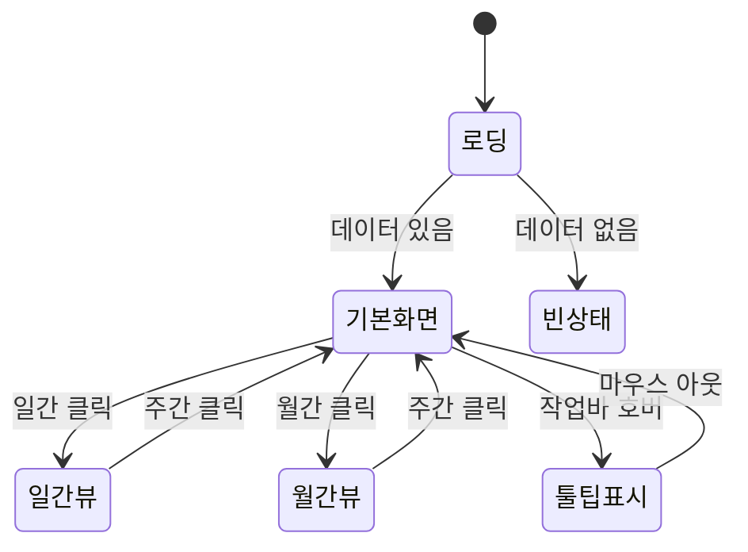

# TSK-06-14 화면 설계서 (011-ui-design.md)

**Version:** 1.0 — **Last Updated:** 2026-01-22

> **목적**: 생산 계획 간트 차트 샘플 화면의 UI/UX 상세 설계
>
> **참조**: `010-design.md` 설계 문서의 화면 요구사항 기반

---

## 1. 화면 목록

| 화면 ID | 화면명 | 목적 | SVG 참조 |
|---------|--------|------|----------|
| SCR-01 | 생산 계획 간트 차트 (기본) | 주간 뷰 기본 상태 | `screen-01-gantt-default.svg` |
| SCR-02 | 생산 계획 간트 차트 (월간) | 월간 뷰 스케일 | `screen-02-gantt-month.svg` |
| SCR-03 | 생산 계획 간트 차트 (툴팁) | 작업 바 호버 시 툴팁 | `screen-03-gantt-tooltip.svg` |
| SCR-04 | 생산 계획 간트 차트 (빈 상태) | 데이터 없음 | `screen-04-gantt-empty.svg` |

---

## 2. 화면 전환 흐름

### 2.1 화면 전환 다이어그램



### 2.2 액션-화면 매트릭스

| 액션 | 현재 화면 | 결과 화면 | 비고 |
|------|----------|----------|------|
| 화면 진입 | - | 로딩 → 기본화면(주간) | 자동 |
| 일간 버튼 클릭 | 기본화면 | 일간 뷰 | 스케일 변경 |
| 주간 버튼 클릭 | 일간/월간 뷰 | 주간 뷰 (기본) | 스케일 변경 |
| 월간 버튼 클릭 | 기본화면 | 월간 뷰 | 스케일 변경 |
| 작업 바 호버 | 모든 뷰 | 툴팁 오버레이 | 마우스 이벤트 |
| 이전 버튼 클릭 | 모든 뷰 | 이전 기간 | 기간 네비게이션 |
| 다음 버튼 클릭 | 모든 뷰 | 다음 기간 | 기간 네비게이션 |

---

## 3. 화면별 상세

### 3.1 SCR-01: 생산 계획 간트 차트 (기본)

**화면 목적**: 생산 계획을 주간 단위 타임라인으로 표시하는 기본 화면

**레이아웃 구조**:

```
┌─────────────────────────────────────────────────────────────────────────┐
│ 헤더 (컨트롤 영역)                                                        │
│ ┌─────────────────────────────────────────────────────────────────────┐ │
│ │ [일간] [주간*] [월간]   │   ◀  │  2026년 1월 3주차  │  ▶   │       │ │
│ └─────────────────────────────────────────────────────────────────────┘ │
├─────────────────────────────────────────────────────────────────────────┤
│ 간트 차트 본체                                                           │
│ ┌──────────────┬────────────────────────────────────────────────────┐   │
│ │   작업명     │  월    │  화    │  수    │  목    │  금    │ 토/일 │   │
│ ├──────────────┼────────┴────────┴────────┴────────┴────────┴───────┤   │
│ │ 제품A 생산   │ ████████████████████░░░░░░░░ (70%)                  │   │
│ │ 제품B 생산   │       ████████████████████████ (100%)               │   │
│ │ 제품C 생산   │             ██████████████████████░░░░ (80%)        │   │
│ │ 설비 점검    │                   ████████ (100%)                   │   │
│ │ 제품D 생산   │                         ████████████████ (50%)      │   │
│ └──────────────┴────────────────────────────────────────────────────┘   │
├─────────────────────────────────────────────────────────────────────────┤
│ 범례 / 요약                                                              │
│ █ 완료  ░ 미완료  ■ 진행중  ■ 지연  │ 총 5개 작업 │ 평균 진행률: 80%     │
└─────────────────────────────────────────────────────────────────────────┘
```

**컴포넌트 구성**:

| 영역 | 컴포넌트 | 설명 |
|------|---------|------|
| 헤더 | Card + 컨트롤 | 스케일 선택, 기간 네비게이션 |
| 스케일 선택 | Segmented | 일간/주간/월간 버튼 그룹 |
| 기간 네비게이션 | Button + Typography | 이전/다음 버튼, 현재 기간 라벨 |
| 간트 차트 | Card + 커스텀 (또는 라이브러리) | 작업명 열 + 타임라인 |
| 작업명 열 | 좌측 고정 영역 | 작업명 목록 |
| 타임라인 | 스크롤 가능 영역 | 날짜 헤더 + 작업 바 |
| 작업 바 | 커스텀 컴포넌트 | 시작~종료 범위, 진행률 표시 |
| 범례 | Space + Tag | 색상 범례 |
| 요약 | Statistic | 작업 수, 평균 진행률 |

**상태 정의**:

| 상태 | 조건 | UI 표현 |
|------|------|--------|
| 기본 | 데이터 로드 완료 | 간트 차트 표시 |
| 로딩 | 데이터 로딩 중 | Skeleton |
| 빈 상태 | 데이터 0건 | Empty 컴포넌트 |
| 에러 | 로드 실패 | Result (error) |

**액션 정의**:

| 액션 | 트리거 | 결과 |
|------|--------|------|
| 스케일 변경 | Segmented 선택 | 타임라인 재렌더링 |
| 이전 기간 | ◀ 버튼 클릭 | 기간 라벨 변경, 데이터 갱신 |
| 다음 기간 | ▶ 버튼 클릭 | 기간 라벨 변경, 데이터 갱신 |
| 작업 바 호버 | 마우스 호버 | Tooltip 표시 |

---

### 3.2 SCR-02: 생산 계획 간트 차트 (월간)

**화면 목적**: 월간 단위로 전체 생산 계획을 조망

**SCR-01과의 차이점**:

| 항목 | 주간 뷰 (SCR-01) | 월간 뷰 (SCR-02) |
|------|-----------------|-----------------|
| 타임라인 헤더 | 일별 (월~일) | 주별 (1주~4주) |
| 기간 라벨 | "2026년 1월 3주차" | "2026년 1월" |
| 작업 바 크기 | 상대적으로 큼 | 상대적으로 작음 |
| 스케일 버튼 | [주간*] 활성 | [월간*] 활성 |

---

### 3.3 SCR-03: 생산 계획 간트 차트 (툴팁)

**화면 목적**: 작업 바 호버 시 상세 정보 툴팁 표시

**툴팁 레이아웃**:

```
┌──────────────────────────────┐
│ 제품A 생산                    │
│ ─────────────────────────── │
│ 제품: 제품A (PRD-001)        │
│ 수량: 1,000 EA               │
│ 시작: 2026-01-20             │
│ 종료: 2026-01-24             │
│ 라인: Line-01                │
│ 진행률: 70%                  │
│ 상태: 진행중                  │
└──────────────────────────────┘
```

**툴팁 컴포넌트**: Ant Design Tooltip 커스터마이징

| 필드 | 라벨 | 포맷 |
|------|------|------|
| name | (제목) | 볼드 |
| productName (productCode) | 제품 | 텍스트 (코드) |
| quantity unit | 수량 | 숫자 단위 |
| startDate | 시작 | YYYY-MM-DD |
| endDate | 종료 | YYYY-MM-DD |
| line | 라인 | 텍스트 |
| progress | 진행률 | N% |
| status | 상태 | 한글 라벨 |

---

### 3.4 SCR-04: 생산 계획 간트 차트 (빈 상태)

**화면 목적**: 생산 계획 데이터가 없을 때 표시

**레이아웃**:

```
┌─────────────────────────────────────────────────────────────────────────┐
│ 헤더 (컨트롤 영역)                                                        │
│ ┌─────────────────────────────────────────────────────────────────────┐ │
│ │ [일간] [주간*] [월간]   │   ◀  │  2026년 1월 3주차  │  ▶   │       │ │
│ └─────────────────────────────────────────────────────────────────────┘ │
├─────────────────────────────────────────────────────────────────────────┤
│                                                                         │
│                                                                         │
│                        ┌─────────────────┐                              │
│                        │     📋          │                              │
│                        │                 │                              │
│                        │ 등록된 생산 계획이│                              │
│                        │ 없습니다.        │                              │
│                        │                 │                              │
│                        └─────────────────┘                              │
│                                                                         │
│                                                                         │
└─────────────────────────────────────────────────────────────────────────┘
```

**사용 컴포넌트**: Ant Design Empty

---

## 4. 공통 컴포넌트

### 4.1 스케일 선택기

| 속성 | 값 |
|------|-----|
| 컴포넌트 | Ant Design Segmented |
| 옵션 | 일간, 주간, 월간 |
| 기본값 | 주간 |
| 크기 | middle |

### 4.2 기간 네비게이션

| 요소 | 컴포넌트 | 속성 |
|------|---------|------|
| 이전 버튼 | Button | icon=LeftOutlined |
| 기간 라벨 | Typography.Text | strong, 중앙 정렬 |
| 다음 버튼 | Button | icon=RightOutlined |

### 4.3 작업 바 색상

| 상태 | 색상 코드 | Ant Design Token |
|------|----------|------------------|
| planned (계획됨) | #8c8c8c | colorTextSecondary |
| in_progress (진행중) | #1677ff | colorPrimary |
| completed (완료) | #52c41a | colorSuccess |
| delayed (지연) | #ff4d4f | colorError |

### 4.4 진행률 표시

| 구분 | 스타일 |
|------|--------|
| 완료 부분 | 상태 색상 (불투명) |
| 미완료 부분 | 상태 색상 (투명도 30%) |
| 진행률 텍스트 | 바 내부 또는 툴팁 |

---

## 5. 반응형 설계

### 5.1 Breakpoint 정의

| Breakpoint | 범위 | 레이아웃 변화 |
|------------|------|-------------|
| Desktop | 1024px+ | 전체 표시, 7일/4주 |
| Tablet | 768-1023px | 작업명 축약, 좌우 스크롤 |
| Mobile | 767px- | 작업명 최소화, 좌우 스크롤 |

### 5.2 반응형 조정 사항

| 요소 | Desktop | Tablet | Mobile |
|------|---------|--------|--------|
| 작업명 열 너비 | 150px | 120px | 80px |
| 타임라인 셀 너비 | 40px | 30px | 25px |
| 스케일 버튼 | 모두 표시 | 모두 표시 | 아이콘만 |
| 범례 | 전체 표시 | 축약 | 숨김 |

---

## 6. 접근성

### 6.1 키보드 네비게이션

| 키 | 기능 |
|-----|------|
| Tab | 요소 간 이동 (스케일 → 네비게이션 → 작업 바) |
| Enter/Space | 버튼 활성화, 스케일 선택 |
| 좌/우 화살표 | 스케일 옵션 간 이동 |
| Escape | 툴팁 닫기 |

### 6.2 ARIA 속성

| 요소 | ARIA 속성 | 값 |
|------|----------|-----|
| 스케일 선택기 | role | tablist |
| 스케일 버튼 | role | tab |
| 작업 바 | role | button |
| 작업 바 | aria-label | "{작업명}, 진행률 {N}%, {상태}" |
| 툴팁 | role | tooltip |

### 6.3 색상 대비

| 요소 | 전경색 | 배경색 | 대비율 |
|------|--------|--------|--------|
| 작업명 텍스트 | #262626 | #ffffff | 14.8:1 |
| 바 내 텍스트 | #ffffff | 상태색상 | 4.5:1+ |
| 헤더 날짜 | #595959 | #fafafa | 7.0:1 |

---

## 7. SVG 파일 목록

| 파일명 | 설명 | 상태 |
|--------|------|------|
| `screen-01-gantt-default.svg` | 기본 상태 (주간 뷰) | 생성 예정 |
| `screen-02-gantt-month.svg` | 월간 뷰 | 생성 예정 |
| `screen-03-gantt-tooltip.svg` | 툴팁 표시 상태 | 생성 예정 |
| `screen-04-gantt-empty.svg` | 빈 상태 | 생성 예정 |

---

## 변경 이력

| 버전 | 일자 | 작성자 | 변경 내용 |
|------|------|--------|----------|
| 1.0 | 2026-01-22 | Claude | 최초 작성 |

---

<!--
Task: TSK-06-14
Version: 1.0
Created: 2026-01-22
-->
