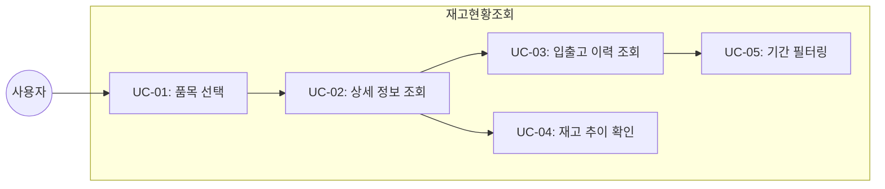
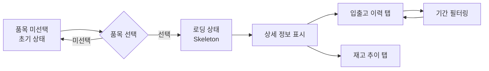
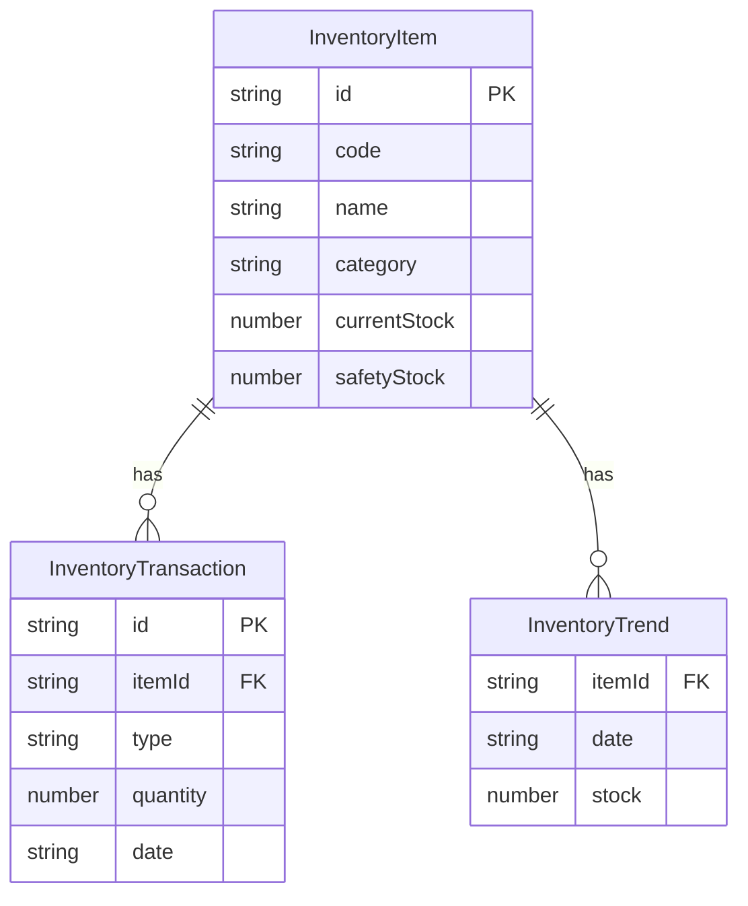

# TSK-06-15 - [샘플] 재고 현황 조회 설계 문서

## 문서 정보

| 항목 | 내용 |
|------|------|
| Task ID | TSK-06-15 |
| 문서 버전 | 1.0 |
| 작성일 | 2026-01-22 |
| 상태 | 작성중 |
| 카테고리 | development |

---

## 1. 개요

### 1.1 배경 및 문제 정의

**현재 상황:**
- MES Portal에서 재고 현황을 조회하는 샘플 화면이 필요함
- DetailTemplate(상세 화면 템플릿)의 기능 검증을 위한 실제 사용 예시가 필요함
- 품목 선택, 상세 정보 표시, 탭 기반 관련 정보 조회 패턴의 검증 필요

**해결하려는 문제:**
- 상세 화면 템플릿의 실제 사용 패턴 검증
- 로딩 스켈레톤, 빈 상태 처리 등 공통 컴포넌트 활용 예시 제공
- 차트 위젯과 테이블 조합 패턴 검증

### 1.2 목적 및 기대 효과

**목적:**
- DetailTemplate을 활용한 재고 현황 조회 샘플 화면 구현
- 품목 선택 → 상세 정보 → 입출고 이력 → 재고 추이 차트의 사용자 시나리오 구현
- mock-data 기반 JSON 파일로 UI 검증

**기대 효과:**
- DetailTemplate의 기능 검증 및 사용 예시 제공
- 개발자에게 상세 화면 구현 패턴 가이드 제공
- 로딩/빈 상태 처리 패턴 표준화

### 1.3 범위

**포함:**
- screens/sample/InventoryDetail.tsx 화면 컴포넌트 구현
- 품목 선택 AutoComplete 컴포넌트
- 재고 상세 정보 Descriptions 표시
- 입출고 이력 탭 (Table + RangePicker)
- 재고 추이 차트 탭 (Line Chart)
- mock-data/inventory.json 데이터 파일
- 로딩 스켈레톤 및 빈 상태 처리

**제외:**
- 실제 백엔드 API 연동 (mock 데이터 사용)
- 재고 수정/삭제 기능 (조회 전용)
- 실시간 데이터 갱신

### 1.4 참조 문서

| 문서 | 경로 | 관련 섹션 |
|------|------|----------|
| PRD | `.orchay/projects/mes-portal/prd.md` | 4.1.1 상세 화면 샘플 |
| TRD | `.orchay/projects/mes-portal/trd.md` | 7. PRD 요구사항 ↔ 기술 스택 매핑 |
| 상세 화면 템플릿 | `TSK-06-02/010-design.md` | 템플릿 구조 및 Props |
| 로딩 및 에러 상태 | `TSK-05-01/010-design.md` | 공통 컴포넌트 |
| 날짜 선택기 | `TSK-05-05/010-design.md` | RangePicker |

---

## 2. 사용자 분석

### 2.1 대상 사용자

| 사용자 유형 | 특성 | 주요 니즈 |
|------------|------|----------|
| 자재 담당자 | 재고 현황 확인 빈번, 입출고 이력 추적 필요 | 품목별 재고 상세 정보, 입출고 이력, 재고 추이 확인 |
| 생산 담당자 | 생산에 필요한 자재 재고 확인 | 안전 재고 수준 파악, 부족 품목 식별 |
| 개발자 | 상세 화면 템플릿 사용 예시 필요 | 명확한 구현 패턴, 컴포넌트 조합 방법 |

### 2.2 사용자 페르소나

**페르소나 1: 자재 관리자 정민수**
- 역할: 자재팀 담당자, 재고 관리 및 입출고 처리
- 목표: 특정 품목의 현재 재고 상태와 입출고 이력 확인
- 불만: 품목별 재고 정보가 여러 화면에 분산되어 있음
- 시나리오: 품목 검색 → 현재 재고 확인 → 최근 입출고 이력 확인 → 재고 추이 분석

**페르소나 2: 생산 계획 담당자 이수진**
- 역할: 생산팀, 생산 계획 수립
- 목표: 생산에 필요한 자재의 가용 재고 확인
- 불만: 재고 부족 시 사전 인지가 어려움
- 시나리오: 품목 선택 → 안전 재고 대비 현재 재고 확인 → 재고 추이로 부족 시점 예측

---

## 3. 유즈케이스

### 3.1 유즈케이스 다이어그램



### 3.2 유즈케이스 상세

#### UC-01: 품목 선택

| 항목 | 내용 |
|------|------|
| 액터 | 자재 담당자, 생산 담당자 |
| 목적 | 조회할 품목 선택 |
| 사전 조건 | 재고 현황 화면 진입 |
| 사후 조건 | 품목이 선택되고 상세 정보 로딩 시작 |
| 트리거 | 품목 검색 또는 드롭다운 선택 |

**기본 흐름:**
1. 사용자가 품목 선택 AutoComplete에 품목코드 또는 품목명을 입력한다
2. 시스템이 입력에 맞는 품목 목록을 필터링하여 보여준다
3. 사용자가 원하는 품목을 선택한다
4. 시스템이 해당 품목의 상세 정보 로딩을 시작한다

**대안 흐름:**
- 1a. 품목 목록이 많을 경우:
  - 드롭다운에 최대 10개 표시
  - 스크롤로 추가 항목 확인 가능

**예외 흐름:**
- 2a. 검색 결과가 없는 경우:
  - "검색 결과가 없습니다" 메시지 표시

#### UC-02: 상세 정보 조회

| 항목 | 내용 |
|------|------|
| 액터 | 자재 담당자, 생산 담당자 |
| 목적 | 품목의 재고 상세 정보 확인 |
| 사전 조건 | 품목 선택 완료 |
| 사후 조건 | 재고 상세 정보가 Descriptions로 표시됨 |
| 트리거 | 품목 선택 완료 시 자동 |

**기본 흐름:**
1. 품목 선택이 완료되면 시스템이 로딩 상태를 표시한다 (Skeleton)
2. mock 데이터에서 해당 품목의 상세 정보를 조회한다
3. 상세 정보가 Descriptions 컴포넌트로 표시된다
4. 탭 영역에 입출고 이력과 재고 추이 탭이 표시된다

**대안 흐름:**
- 1a. 이미 로드된 품목을 다시 선택한 경우:
  - 캐시된 데이터로 즉시 표시

#### UC-03: 입출고 이력 조회

| 항목 | 내용 |
|------|------|
| 액터 | 자재 담당자 |
| 목적 | 품목의 입출고 이력 확인 |
| 사전 조건 | 상세 정보 표시 완료 |
| 사후 조건 | 입출고 이력이 테이블로 표시됨 |
| 트리거 | 입출고 이력 탭 클릭 (기본 활성 탭) |

**기본 흐름:**
1. 입출고 이력 탭이 기본 활성화되어 있다
2. 해당 품목의 입출고 이력이 테이블로 표시된다
3. 테이블에 일시, 유형(입고/출고), 수량, 담당자 정보가 표시된다
4. 최신순으로 정렬되어 표시된다

#### UC-04: 재고 추이 확인

| 항목 | 내용 |
|------|------|
| 액터 | 생산 담당자, 자재 담당자 |
| 목적 | 재고 수준 변화 추이 시각화 |
| 사전 조건 | 상세 정보 표시 완료 |
| 사후 조건 | 재고 추이 라인 차트가 표시됨 |
| 트리거 | 재고 추이 탭 클릭 |

**기본 흐름:**
1. 사용자가 "재고 추이" 탭을 클릭한다
2. 해당 품목의 일별 재고 추이가 라인 차트로 표시된다
3. 차트에 현재 재고선, 안전 재고선이 함께 표시된다
4. 호버 시 해당 일자의 재고량 툴팁 표시

#### UC-05: 기간 필터링

| 항목 | 내용 |
|------|------|
| 액터 | 자재 담당자 |
| 목적 | 입출고 이력의 기간 필터링 |
| 사전 조건 | 입출고 이력 탭 표시 중 |
| 사후 조건 | 선택한 기간의 이력만 표시됨 |
| 트리거 | RangePicker에서 기간 선택 |

**기본 흐름:**
1. 사용자가 RangePicker에서 시작일과 종료일을 선택한다
2. 선택한 기간에 해당하는 입출고 이력만 테이블에 표시된다
3. 기간 외 데이터는 필터링되어 숨겨진다

---

## 4. 사용자 시나리오

### 4.1 시나리오 1: 품목 재고 상세 확인

**상황 설명:**
자재 담당자 정민수가 "원자재A-001" 품목의 현재 재고 상태와 최근 입출고 내역을 확인하려 한다.

**단계별 진행:**

| 단계 | 사용자 행동 | 시스템 반응 | 사용자 기대 |
|------|-----------|------------|------------|
| 1 | 재고 현황 메뉴 클릭 | 화면 로딩, 품목 선택 영역 표시 | 빠른 화면 전환 |
| 2 | AutoComplete에 "원자재A" 입력 | 매칭되는 품목 목록 드롭다운 표시 | 실시간 필터링 |
| 3 | "원자재A-001" 선택 | 로딩 스켈레톤 표시 → 상세 정보 표시 | 2초 이내 표시 |
| 4 | 기본 정보 확인 | 품목코드, 품목명, 현재재고, 안전재고 등 표시 | 한눈에 파악 가능 |
| 5 | 입출고 이력 확인 | 최근 이력 테이블 표시 | 정렬된 이력 확인 |
| 6 | 특정 기간 이력 필터링 | RangePicker로 기간 선택, 필터링된 결과 표시 | 원하는 기간만 조회 |

**성공 조건:**
- 품목 선택 후 2초 이내 상세 정보 표시
- 입출고 이력 테이블 정상 표시
- 기간 필터링 정상 동작

### 4.2 시나리오 2: 재고 추이 분석

**상황 설명:**
생산 담당자 이수진이 주요 자재의 재고 추이를 확인하여 부족 시점을 예측하려 한다.

**단계별 진행:**

| 단계 | 사용자 행동 | 시스템 반응 | 사용자 기대 |
|------|-----------|------------|------------|
| 1 | 품목 선택 | 상세 정보 로딩 및 표시 | - |
| 2 | "재고 추이" 탭 클릭 | 라인 차트 로딩 및 표시 | 부드러운 탭 전환 |
| 3 | 차트 데이터 확인 | 일별 재고 추이 그래프 표시 | 추세 파악 가능 |
| 4 | 차트 포인트 호버 | 해당 일자 재고량 툴팁 표시 | 정확한 수치 확인 |
| 5 | 안전 재고선 확인 | 빨간 점선으로 안전 재고 수준 표시 | 부족 시점 예측 |

### 4.3 시나리오 3: 빈 데이터 상태

**상황 설명:**
사용자가 아직 입출고 이력이 없는 신규 품목을 조회하는 경우

**단계별 진행:**

| 단계 | 사용자 행동 | 시스템 반응 | 복구 방법 |
|------|-----------|------------|----------|
| 1 | 신규 품목 선택 | 상세 정보 표시 | - |
| 2 | 입출고 이력 탭 확인 | Empty 컴포넌트 표시 "입출고 이력이 없습니다" | - |
| 3 | 재고 추이 탭 확인 | Empty 컴포넌트 표시 "재고 추이 데이터가 없습니다" | - |

---

## 5. 화면 설계

### 5.1 화면 흐름도



### 5.2 화면별 상세

#### 화면 1: 초기 상태 (품목 미선택)

**화면 목적:**
재고 현황 조회 화면 진입 시 품목 선택을 유도하는 상태

**진입 경로:**
- 사이드바 메뉴 > 샘플화면 > 재고 현황 조회

**와이어프레임:**
```
+---------------------------------------------------------------------+
|  +-----------------------------------------------------------------+|
|  |  재고 현황 조회                                                 ||
|  +-----------------------------------------------------------------+|
|                                                                     |
|  +-----------------------------------------------------------------+|
|  |  품목 선택                                                      ||
|  |  +-----------------------------------------------------------+ ||
|  |  |  🔍 품목코드 또는 품목명을 입력하세요              ▼       | ||
|  |  +-----------------------------------------------------------+ ||
|  +-----------------------------------------------------------------+|
|                                                                     |
|  +-----------------------------------------------------------------+|
|  |                                                                 ||
|  |                          📦                                     ||
|  |                                                                 ||
|  |                  품목을 선택해주세요                            ||
|  |                                                                 ||
|  |         조회할 품목을 검색하여 선택하면                         ||
|  |         상세 정보를 확인할 수 있습니다.                         ||
|  |                                                                 ||
|  +-----------------------------------------------------------------+|
+---------------------------------------------------------------------+
```

**화면 요소 설명:**

| 영역 | 컴포넌트 | 설명 | 사용자 인터랙션 |
|------|----------|------|----------------|
| 제목 | Typography.Title | 화면 제목 | - |
| 품목 선택 | AutoComplete | 품목 검색 및 선택 | 입력/선택 |
| 빈 상태 | Empty | 품목 선택 유도 메시지 | - |

#### 화면 2: 상세 정보 표시 (품목 선택 후)

**화면 목적:**
선택한 품목의 재고 상세 정보와 관련 데이터를 탭 형식으로 표시

**와이어프레임:**
```
+---------------------------------------------------------------------+
|  +-----------------------------------------------------------------+|
|  |  재고 현황 조회                                                 ||
|  +-----------------------------------------------------------------+|
|                                                                     |
|  +-----------------------------------------------------------------+|
|  |  품목 선택                                                      ||
|  |  +-----------------------------------------------------------+ ||
|  |  |  원자재A-001 - 알루미늄 판재 6mm                    ▼       | ||
|  |  +-----------------------------------------------------------+ ||
|  +-----------------------------------------------------------------+|
|                                                                     |
|  +-----------------------------------------------------------------+|
|  | +---------------------------------------------------------------+|
|  | |  재고 상세 정보                                               ||
|  | |  +---------------------------------------------------------+  ||
|  | |  | 품목코드      | RAW-A-001                               |  ||
|  | |  +---------------+-----------------------------------------+  ||
|  | |  | 품목명        | 알루미늄 판재 6mm                       |  ||
|  | |  +---------------+-----------------------------------------+  ||
|  | |  | 카테고리      | 원자재                                  |  ||
|  | |  +---------------+-----------------------------------------+  ||
|  | |  | 규격          | 1000x2000x6mm                           |  ||
|  | |  +---------------+-----------------------------------------+  ||
|  | |  | 현재 재고     | 1,500 EA                                |  ||
|  | |  +---------------+-----------------------------------------+  ||
|  | |  | 안전 재고     | 500 EA                                  |  ||
|  | |  +---------------+-----------------------------------------+  ||
|  | |  | 재고 상태     | [정상] 충분                             |  ||
|  | |  +---------------+-----------------------------------------+  ||
|  | |  | 최종 입고일   | 2026-01-20                              |  ||
|  | |  +---------------+-----------------------------------------+  ||
|  | |  | 최종 출고일   | 2026-01-21                              |  ||
|  | |  +---------------------------------------------------------+  ||
|  | +---------------------------------------------------------------+|
|  |                                                                   |
|  | +---------------------------------------------------------------+|
|  | |  +------------------+  +------------------+                    ||
|  | |  |  📋 입출고 이력  |  |  📈 재고 추이   |                    ||
|  | |  +------------------+  +------------------+                    ||
|  | |  +---------------------------------------------------------+  ||
|  | |  | 기간 선택: [2026-01-01] ~ [2026-01-22]        [검색]    |  ||
|  | |  +---------------------------------------------------------+  ||
|  | |  |                                                         |  ||
|  | |  |  +----+------------+--------+--------+-----------+      |  ||
|  | |  |  | No | 일시       | 유형   | 수량   | 담당자    |      |  ||
|  | |  |  +----+------------+--------+--------+-----------+      |  ||
|  | |  |  | 1  | 01-21 14:30| 출고   | -200   | 김생산    |      |  ||
|  | |  |  +----+------------+--------+--------+-----------+      |  ||
|  | |  |  | 2  | 01-20 10:00| 입고   | +500   | 이자재    |      |  ||
|  | |  |  +----+------------+--------+--------+-----------+      |  ||
|  | |  |  | 3  | 01-19 16:45| 출고   | -100   | 박생산    |      |  ||
|  | |  |  +----+------------+--------+--------+-----------+      |  ||
|  | |  |                                                         |  ||
|  | |  |         < 1 2 3 4 5 ... 10 >     10건/페이지           |  ||
|  | |  +---------------------------------------------------------+  ||
|  | +---------------------------------------------------------------+|
|  +-----------------------------------------------------------------+|
+---------------------------------------------------------------------+
```

**화면 요소 설명:**

| 영역 | 컴포넌트 | 설명 | 사용자 인터랙션 |
|------|----------|------|----------------|
| 재고 상세 정보 | Descriptions | 품목 상세 정보 표시 | 읽기 전용 |
| 탭 영역 | Tabs | 입출고 이력 / 재고 추이 전환 | 탭 클릭 |
| 기간 선택 | RangePicker | 입출고 이력 필터링 기간 | 날짜 선택 |
| 검색 버튼 | Button | 기간 필터 적용 | 클릭 |
| 이력 테이블 | Table | 입출고 이력 목록 | 정렬, 페이징 |
| 재고 상태 | Tag | 정상/주의/부족 상태 표시 | - |

#### 화면 3: 재고 추이 탭

**와이어프레임:**
```
+---------------------------------------------------------------------+
|  | +---------------------------------------------------------------+|
|  | |  +------------------+  +------------------+                    ||
|  | |  |  📋 입출고 이력  |  |  📈 재고 추이   |  <- 활성           ||
|  | |  +------------------+  +------------------+                    ||
|  | |  +---------------------------------------------------------+  ||
|  | |  |                                                         |  ||
|  | |  |   수량                                                  |  ||
|  | |  |   ^                                                     |  ||
|  | |  | 2000|                                      ●            |  ||
|  | |  |     |                                ●  ●               |  ||
|  | |  | 1500|    ●     ●  ●              ●                      |  ||
|  | |  |     | ●     ●                 ●                         |  ||
|  | |  | 1000|------------------------  ← 현재 재고              |  ||
|  | |  |     |                                                   |  ||
|  | |  |  500|- - - - - - - - - - - - - - - - - - ← 안전 재고    |  ||
|  | |  |     |                                                   |  ||
|  | |  |    0+----+----+----+----+----+----+----+----+----+---->  |  ||
|  | |  |      1/14 1/15 1/16 1/17 1/18 1/19 1/20 1/21 1/22 날짜  |  ||
|  | |  |                                                         |  ||
|  | |  |         ● 일별 재고  — 현재 재고  - - 안전 재고         |  ||
|  | |  +---------------------------------------------------------+  ||
|  | +---------------------------------------------------------------+|
+---------------------------------------------------------------------+
```

#### 화면 4: 로딩 상태

**와이어프레임:**
```
+---------------------------------------------------------------------+
|  +-----------------------------------------------------------------+|
|  |  재고 현황 조회                                                 ||
|  +-----------------------------------------------------------------+|
|                                                                     |
|  +-----------------------------------------------------------------+|
|  |  품목 선택                                                      ||
|  |  +-----------------------------------------------------------+ ||
|  |  |  원자재A-001 - 알루미늄 판재 6mm                    ▼       | ||
|  |  +-----------------------------------------------------------+ ||
|  +-----------------------------------------------------------------+|
|                                                                     |
|  +-----------------------------------------------------------------+|
|  | +---------------------------------------------------------------+|
|  | |  ████████████████                                             ||
|  | |  +-------------------------------------------------------+    ||
|  | |  | ████████      | ████████████████████████              |    ||
|  | |  +---------------+---------------------------------------+    ||
|  | |  | ████████      | ████████████████                      |    ||
|  | |  +---------------+---------------------------------------+    ||
|  | |  | ████████      | ████████████████████████████████      |    ||
|  | |  +---------------+---------------------------------------+    ||
|  | +---------------------------------------------------------------+|
|  +-----------------------------------------------------------------+|
+---------------------------------------------------------------------+
```

### 5.3 반응형 동작

| 화면 크기 | 레이아웃 변화 | 사용자 경험 |
|----------|--------------|------------|
| 데스크톱 (1024px+) | Descriptions 3열, 차트 전체 너비, 테이블 전체 컬럼 | 최적 정보 밀도 |
| 태블릿 (768-1023px) | Descriptions 2열, 차트/테이블 스크롤 | 주요 정보 확인 가능 |
| 모바일 (767px-) | Descriptions 1열, 테이블 수평 스크롤, 차트 축소 | 터치 친화적 |

---

## 6. 인터랙션 설계

### 6.1 사용자 액션과 피드백

| 사용자 액션 | 즉각 피드백 | 결과 피드백 | 에러 피드백 |
|------------|-----------|------------|------------|
| 품목 검색 입력 | 드롭다운 열림, 필터링 결과 | 매칭 품목 목록 표시 | "검색 결과 없음" |
| 품목 선택 | 드롭다운 닫힘, 선택 품목 표시 | Skeleton → 상세 정보 표시 | - |
| 탭 전환 | 활성 탭 스타일 변경 | 탭 컨텐츠 표시 | - |
| 기간 선택 | 선택 날짜 표시 | - | - |
| 검색 버튼 클릭 | 버튼 로딩 상태 | 필터링된 이력 표시 | "해당 기간 이력 없음" |
| 차트 포인트 호버 | 툴팁 표시 | - | - |

### 6.2 상태별 화면 변화

| 상태 | 화면 표시 | 사용자 안내 |
|------|----------|------------|
| 초기 (품목 미선택) | Empty 컴포넌트 | "품목을 선택해주세요" |
| 로딩 중 | Skeleton (Descriptions + Tabs 구조) | - |
| 정상 표시 | 상세 정보 + 탭 컨텐츠 | - |
| 이력 없음 | Table 내 Empty | "입출고 이력이 없습니다" |
| 추이 데이터 없음 | 차트 영역 Empty | "재고 추이 데이터가 없습니다" |

### 6.3 키보드/접근성

| 기능 | 키보드 단축키 | 스크린 리더 안내 |
|------|-------------|-----------------|
| AutoComplete 포커스 | Tab | "품목 검색" |
| 드롭다운 탐색 | ↑/↓ 화살표 | "{품목명}, {n}개 중 {m}번째" |
| 품목 선택 | Enter | "선택됨" |
| 탭 전환 | Tab + Enter | "탭: {탭명}" |

---

## 7. 데이터 요구사항

### 7.1 필요한 데이터

| 데이터 | 설명 | 출처 | 용도 |
|--------|------|------|------|
| 품목 목록 | 검색/선택용 품목 데이터 | mock-data/inventory.json | AutoComplete 옵션 |
| 품목 상세 | 재고 상세 정보 | mock-data/inventory.json | Descriptions 표시 |
| 입출고 이력 | 품목별 입출고 내역 | mock-data/inventory.json | Table 표시 |
| 재고 추이 | 일별 재고 변화 데이터 | mock-data/inventory.json | Line Chart |

### 7.2 데이터 구조 (mock-data/inventory.json)

```typescript
interface InventoryData {
  // 품목 목록 (AutoComplete용)
  items: InventoryItem[]
  // 입출고 이력
  transactions: InventoryTransaction[]
  // 재고 추이 (일별)
  trends: InventoryTrend[]
}

interface InventoryItem {
  id: string                    // 고유 ID
  code: string                  // 품목코드 (RAW-A-001)
  name: string                  // 품목명
  category: string              // 카테고리 (원자재/반제품/완제품)
  specification: string         // 규격
  unit: string                  // 단위 (EA, KG, M 등)
  currentStock: number          // 현재 재고
  safetyStock: number           // 안전 재고
  status: 'normal' | 'warning' | 'danger'  // 재고 상태
  lastInDate: string            // 최종 입고일
  lastOutDate: string           // 최종 출고일
  warehouse: string             // 창고 위치
  remarks?: string              // 비고
}

interface InventoryTransaction {
  id: string                    // 거래 ID
  itemId: string                // 품목 ID (FK)
  type: 'in' | 'out'            // 입고/출고
  quantity: number              // 수량
  date: string                  // 일시 (ISO 8601)
  handler: string               // 담당자
  reference?: string            // 참조 문서 (입고전표/출고전표)
  remarks?: string              // 비고
}

interface InventoryTrend {
  itemId: string                // 품목 ID (FK)
  date: string                  // 날짜
  stock: number                 // 해당일 재고량
}
```

### 7.3 mock-data 예시

```json
{
  "items": [
    {
      "id": "item-001",
      "code": "RAW-A-001",
      "name": "알루미늄 판재 6mm",
      "category": "원자재",
      "specification": "1000x2000x6mm",
      "unit": "EA",
      "currentStock": 1500,
      "safetyStock": 500,
      "status": "normal",
      "lastInDate": "2026-01-20",
      "lastOutDate": "2026-01-21",
      "warehouse": "A창고-1구역",
      "remarks": "ISO 인증 자재"
    },
    {
      "id": "item-002",
      "code": "RAW-B-002",
      "name": "스테인리스 파이프 50mm",
      "category": "원자재",
      "specification": "외경50mm x 내경45mm x 길이6000mm",
      "unit": "EA",
      "currentStock": 150,
      "safetyStock": 200,
      "status": "warning",
      "lastInDate": "2026-01-15",
      "lastOutDate": "2026-01-21",
      "warehouse": "B창고-2구역"
    }
  ],
  "transactions": [
    {
      "id": "tx-001",
      "itemId": "item-001",
      "type": "out",
      "quantity": 200,
      "date": "2026-01-21T14:30:00",
      "handler": "김생산",
      "reference": "WO-2026-0015"
    },
    {
      "id": "tx-002",
      "itemId": "item-001",
      "type": "in",
      "quantity": 500,
      "date": "2026-01-20T10:00:00",
      "handler": "이자재",
      "reference": "PO-2026-0042"
    }
  ],
  "trends": [
    { "itemId": "item-001", "date": "2026-01-14", "stock": 1200 },
    { "itemId": "item-001", "date": "2026-01-15", "stock": 1100 },
    { "itemId": "item-001", "date": "2026-01-16", "stock": 1300 },
    { "itemId": "item-001", "date": "2026-01-17", "stock": 1250 },
    { "itemId": "item-001", "date": "2026-01-18", "stock": 1400 },
    { "itemId": "item-001", "date": "2026-01-19", "stock": 1350 },
    { "itemId": "item-001", "date": "2026-01-20", "stock": 1700 },
    { "itemId": "item-001", "date": "2026-01-21", "stock": 1500 }
  ]
}
```

### 7.4 데이터 관계



---

## 8. 비즈니스 규칙

### 8.1 핵심 규칙

| 규칙 ID | 규칙 설명 | 적용 상황 | 예외 |
|---------|----------|----------|------|
| BR-01 | 재고 상태는 현재 재고와 안전 재고 비교로 결정 | 상세 정보 표시 시 | - |
| BR-02 | 입출고 이력은 최신순(내림차순) 정렬 | 이력 테이블 표시 시 | 사용자 정렬 변경 가능 |
| BR-03 | 기간 필터 미지정 시 최근 30일 이력 표시 | 이력 탭 진입 시 | - |
| BR-04 | 재고 추이 차트는 최근 30일 데이터 표시 | 추이 탭 진입 시 | - |

### 8.2 규칙 상세 설명

**BR-01: 재고 상태 결정**

설명: 현재 재고를 안전 재고와 비교하여 상태를 결정한다.

계산 로직:
- `normal` (정상): 현재 재고 >= 안전 재고 * 1.5
- `warning` (주의): 안전 재고 <= 현재 재고 < 안전 재고 * 1.5
- `danger` (부족): 현재 재고 < 안전 재고

표시 방법:
- normal: 녹색 Tag "충분"
- warning: 주황색 Tag "주의"
- danger: 빨간색 Tag "부족"

**BR-02: 입출고 이력 정렬**

설명: 가장 최근 입출고 내역이 먼저 보이도록 일시 기준 내림차순 정렬

**BR-03: 기본 조회 기간**

설명: 기간 필터를 별도 지정하지 않으면 오늘로부터 30일 전까지의 이력을 표시

**BR-04: 재고 추이 기간**

설명: 재고 추이 차트는 최근 30일간의 일별 재고 데이터를 표시

---

## 9. 에러 처리

### 9.1 예상 에러 상황

| 상황 | 원인 | 사용자 메시지 | 복구 방법 |
|------|------|--------------|----------|
| 품목 검색 결과 없음 | 매칭 품목 없음 | "검색 결과가 없습니다" | 검색어 수정 |
| 데이터 로드 실패 | mock 파일 오류 | "데이터를 불러올 수 없습니다" | 새로고침 |
| 이력 없음 | 해당 품목/기간 이력 없음 | "입출고 이력이 없습니다" | 기간 변경 |
| 추이 데이터 없음 | 신규 품목 등 | "재고 추이 데이터가 없습니다" | - |

### 9.2 에러 표시 방식

| 에러 유형 | 표시 위치 | 표시 방법 | Ant Design 컴포넌트 |
|----------|----------|----------|-------------------|
| 검색 결과 없음 | AutoComplete 드롭다운 | "검색 결과 없음" 텍스트 | notFoundContent prop |
| 데이터 로드 실패 | 상세 정보 영역 | Result 컴포넌트 | `<Result status="error" />` |
| 이력 없음 | 테이블 영역 | Empty 컴포넌트 | `<Table locale={{ emptyText: <Empty /> }} />` |
| 추이 데이터 없음 | 차트 영역 | Empty 컴포넌트 | `<Empty description="..." />` |

---

## 10. 연관 문서

> 상세 테스트 명세 및 요구사항 추적은 별도 문서에서 관리합니다.

| 문서 | 경로 | 용도 |
|------|------|------|
| 요구사항 추적 매트릭스 | `025-traceability-matrix.md` | PRD → 설계 → 테스트 양방향 추적 |
| 테스트 명세서 | `026-test-specification.md` | 단위/E2E/매뉴얼 테스트 상세 정의 |

---

## 11. 구현 범위

### 11.1 영향받는 영역

| 영역 | 변경 내용 | 영향도 |
|------|----------|--------|
| screens/sample/InventoryDetail.tsx | 신규 화면 컴포넌트 | 높음 |
| screens/sample/InventoryDetail/index.tsx | 메인 화면 컴포넌트 | 높음 |
| mock-data/inventory.json | 신규 mock 데이터 | 중간 |

### 11.2 파일 구조

```
mes-portal/
├── screens/
│   └── sample/
│       └── InventoryDetail/
│           ├── index.tsx                  # 메인 화면 컴포넌트
│           ├── ItemSelect.tsx             # 품목 선택 AutoComplete
│           ├── InventoryDescriptions.tsx  # 상세 정보 Descriptions
│           ├── TransactionTable.tsx       # 입출고 이력 Table
│           ├── StockTrendChart.tsx        # 재고 추이 Chart
│           └── types.ts                   # 타입 정의
├── mock-data/
│   └── inventory.json                     # mock 데이터
└── lib/
    └── mdi/
        └── screens.ts                     # 화면 등록 (InventoryDetail 추가)
```

### 11.3 의존성

| 의존 항목 | 이유 | 상태 |
|----------|------|------|
| TSK-06-02 상세 화면 템플릿 | DetailTemplate 사용 | 완료 |
| TSK-05-01 로딩/에러 상태 | Skeleton, Empty 사용 | 완료 |
| TSK-05-05 날짜 선택기 | RangePicker 사용 | 완료 |
| @ant-design/charts | Line Chart | 라이브러리 제공 |
| Ant Design | Descriptions, Tabs, Table, AutoComplete | 라이브러리 제공 |

### 11.4 제약 사항

| 제약 | 설명 | 대응 방안 |
|------|------|----------|
| mock 데이터 한계 | 실시간 갱신 불가 | JSON 파일로 정적 데이터 제공 |
| 차트 라이브러리 | @ant-design/charts 필요 | package.json에 의존성 추가 |
| 대용량 데이터 | 가상 스크롤 미적용 | 샘플 데이터 규모 제한 |

---

## 12. 체크리스트

### 12.1 설계 완료 확인

- [x] 문제 정의 및 목적 명확화
- [x] 사용자 분석 완료
- [x] 유즈케이스 정의 완료
- [x] 사용자 시나리오 작성 완료
- [x] 화면 설계 완료 (와이어프레임)
- [x] 인터랙션 설계 완료
- [x] 데이터 요구사항 정의 완료
- [x] 비즈니스 규칙 정의 완료
- [x] 에러 처리 정의 완료

### 12.2 연관 문서 작성

- [ ] 요구사항 추적 매트릭스 작성 (→ `025-traceability-matrix.md`)
- [ ] 테스트 명세서 작성 (→ `026-test-specification.md`)

### 12.3 구현 준비

- [x] 구현 우선순위 결정
- [x] 의존성 확인 완료
- [x] 제약 사항 검토 완료

---

## 변경 이력

| 버전 | 일자 | 작성자 | 변경 내용 |
|------|------|--------|----------|
| 1.0 | 2026-01-22 | Claude | 최초 작성 |
