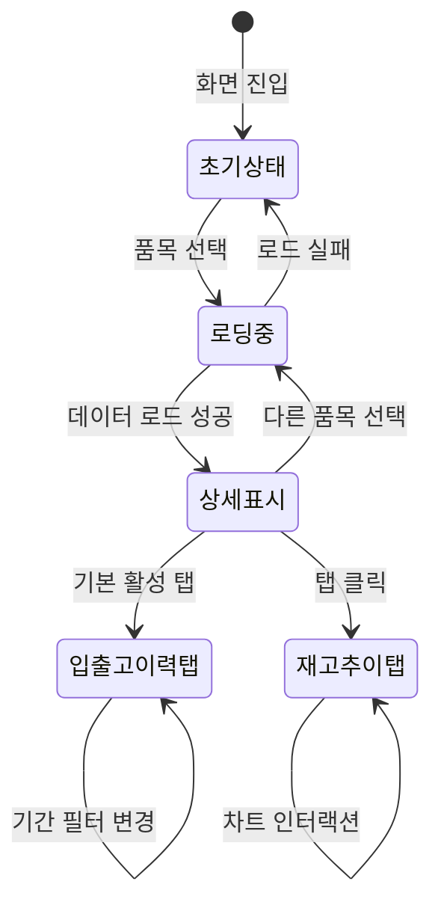

# TSK-06-15 - [샘플] 재고 현황 조회 UI 설계

**Version:** 1.0 - **Last Updated:** 2026-01-22

> **목적**: DetailTemplate을 활용한 재고 현황 조회 샘플 화면의 UI 상세 설계

---

## 1. 화면 목록

| 화면 ID | 화면명 | 목적 | SVG 참조 |
|---------|--------|------|----------|
| SCR-01 | 초기 상태 | 품목 미선택 시 선택 유도 | `screen-01-initial-state.svg` |
| SCR-02 | 상세 정보 표시 | 품목 선택 후 재고 상세 정보 | `screen-02-detail-view.svg` |
| SCR-03 | 재고 추이 탭 | 재고 추이 차트 표시 | `screen-03-trend-chart.svg` |
| SCR-04 | 로딩 상태 | 데이터 로딩 중 스켈레톤 | `screen-04-loading-state.svg` |

---

## 2. 화면 전환 흐름

### 2.1 상태 다이어그램



### 2.2 액션-화면 매트릭스

| 액션 | 현재 상태 | 결과 상태 | 트리거 |
|------|----------|----------|--------|
| 화면 진입 | - | 초기상태 | URL 접근 |
| 품목 선택 | 초기상태/상세표시 | 로딩중 | 사용자 |
| 로드 완료 | 로딩중 | 상세표시 | 시스템 |
| 탭 클릭 | 상세표시 | 탭 컨텐츠 전환 | 사용자 |
| 기간 필터 | 입출고이력탭 | 필터링 결과 | 사용자 |
| 차트 호버 | 재고추이탭 | 툴팁 표시 | 사용자 |

---

## 3. 화면별 상세

### 3.1 SCR-01: 초기 상태 (품목 미선택)

**화면 목적**: 품목 선택을 유도하는 초기 상태 화면

**레이아웃 구조**:
```
+---------------------------------------------------------------------+
|  +---------------------------------------------------------------+  |
|  |  [📦] 재고 현황 조회                                           |  |
|  +---------------------------------------------------------------+  |
|                                                                      |
|  +---------------------------------------------------------------+  |
|  |  품목 선택                                          [Card]     |  |
|  |  +-----------------------------------------------------------+  |
|  |  |  🔍 품목코드 또는 품목명을 입력하세요                 [▼]  |  |
|  |  +-----------------------------------------------------------+  |
|  +---------------------------------------------------------------+  |
|                                                                      |
|  +---------------------------------------------------------------+  |
|  |                                                                |  |
|  |                       +-------+                                |  |
|  |                       |  📦   |                                |  |
|  |                       +-------+                                |  |
|  |                                                                |  |
|  |                   품목을 선택해주세요                          |  |
|  |                                                                |  |
|  |       조회할 품목을 검색하여 선택하면                          |  |
|  |       상세 정보를 확인할 수 있습니다.                          |  |
|  |                                                                |  |
|  +---------------------------------------------------------------+  |
+---------------------------------------------------------------------+
```

**컴포넌트 구성**:

| 영역 | 컴포넌트 | Props | 비고 |
|------|----------|-------|------|
| 제목 | `Typography.Title` | `level={4}` | 페이지 제목 |
| 품목 선택 | `Card` + `AutoComplete` | `placeholder`, `options` | 품목 검색 |
| 빈 상태 | `Empty` | `image`, `description` | 선택 유도 메시지 |

**상태 관리**:

```typescript
interface InitialState {
  selectedItem: null;
  searchValue: string;
  options: ItemOption[];
}

interface ItemOption {
  value: string;      // item.id
  label: string;      // `${item.code} - ${item.name}`
  item: InventoryItem;
}
```

**사용자 액션**:

| 액션 | 요소 | 결과 |
|------|------|------|
| 검색어 입력 | AutoComplete | 필터링된 품목 목록 표시 |
| 품목 선택 | 드롭다운 항목 | 로딩 상태로 전환, 데이터 로드 |
| 드롭다운 스크롤 | 드롭다운 | 추가 항목 표시 (가상 스크롤) |

**스타일 토큰**:

```css
.inventory-page {
  padding: var(--spacing-lg);
  min-height: calc(100vh - var(--header-height) - var(--footer-height));
}

.inventory-page-title {
  display: flex;
  align-items: center;
  gap: var(--spacing-sm);
  margin-bottom: var(--spacing-lg);
  color: var(--color-text-primary);
}

.item-select-card {
  margin-bottom: var(--spacing-lg);
}

.item-select-card .ant-card-body {
  padding: var(--spacing-md);
}

.item-autocomplete {
  width: 100%;
  max-width: 480px;
}

.empty-state {
  padding: var(--spacing-xl) 0;
}
```

---

### 3.2 SCR-02: 상세 정보 표시

**화면 목적**: 선택한 품목의 재고 상세 정보와 입출고 이력 표시

**레이아웃 구조**:
```
+---------------------------------------------------------------------+
|  +---------------------------------------------------------------+  |
|  |  [📦] 재고 현황 조회                                           |  |
|  +---------------------------------------------------------------+  |
|                                                                      |
|  +---------------------------------------------------------------+  |
|  |  품목 선택                                          [Card]     |  |
|  |  +-----------------------------------------------------------+  |
|  |  |  RAW-A-001 - 알루미늄 판재 6mm                        [▼]  |  |
|  |  +-----------------------------------------------------------+  |
|  +---------------------------------------------------------------+  |
|                                                                      |
|  +---------------------------------------------------------------+  |
|  |  재고 상세 정보                                     [Card]     |  |
|  |  +-----------------------------------------------------------+  |
|  |  | 품목코드      | RAW-A-001        | 품목명   | 알루미늄 판재 |  |
|  |  +---------------+------------------+----------+---------------+  |
|  |  | 카테고리      | 원자재           | 규격     | 1000x2000x6mm |  |
|  |  +---------------+------------------+----------+---------------+  |
|  |  | 현재 재고     | 1,500 EA         | 안전 재고| 500 EA        |  |
|  |  +---------------+------------------+----------+---------------+  |
|  |  | 재고 상태     | [정상] 충분      | 창고     | A창고-1구역   |  |
|  |  +---------------+------------------+----------+---------------+  |
|  |  | 최종 입고일   | 2026-01-20       | 최종 출고| 2026-01-21    |  |
|  |  +-----------------------------------------------------------+  |
|  +---------------------------------------------------------------+  |
|                                                                      |
|  +---------------------------------------------------------------+  |
|  |  +---------------------+  +------------------+          [Tabs] |  |
|  |  |  📋 입출고 이력     |  |  📈 재고 추이   |                  |  |
|  |  +---------------------+  +------------------+                  |  |
|  |  +-----------------------------------------------------------+  |
|  |  | 기간: [2026-01-01] ~ [2026-01-22]              [검색]     |  |
|  |  +-----------------------------------------------------------+  |
|  |  |                                                           |  |
|  |  |  +----+------------+--------+--------+--------+--------+  |  |
|  |  |  | No | 일시       | 유형   | 수량   | 담당자 | 참조   |  |  |
|  |  |  +----+------------+--------+--------+--------+--------+  |  |
|  |  |  | 1  | 01-21 14:30| [출고] | -200   | 김생산 | WO-015 |  |  |
|  |  |  +----+------------+--------+--------+--------+--------+  |  |
|  |  |  | 2  | 01-20 10:00| [입고] | +500   | 이자재 | PO-042 |  |  |
|  |  |  +----+------------+--------+--------+--------+--------+  |  |
|  |  |  | 3  | 01-19 16:45| [출고] | -100   | 박생산 | WO-014 |  |  |
|  |  |  +----+------------+--------+--------+--------+--------+  |  |
|  |  |                                                           |  |
|  |  |             < 1 2 3 4 5 ... 10 >     10건/페이지         |  |
|  |  +-----------------------------------------------------------+  |
|  +---------------------------------------------------------------+  |
+---------------------------------------------------------------------+
```

**컴포넌트 구성**:

| 영역 | 컴포넌트 | Props | 비고 |
|------|----------|-------|------|
| 상세 정보 | `Card` + `Descriptions` | `column={2}`, `bordered` | Ant Design |
| 재고 상태 | `Tag` | `color` (green/orange/red) | 상태별 색상 |
| 탭 영역 | `Tabs` | `items`, `defaultActiveKey="history"` | Ant Design |
| 기간 선택 | `RangePicker` | `value`, `onChange` | Ant Design DatePicker |
| 검색 버튼 | `Button` | `type="primary"` | 기간 필터 적용 |
| 이력 테이블 | `Table` | `dataSource`, `columns`, `pagination` | Ant Design |
| 유형 태그 | `Tag` | `color` (blue/red) | 입고: blue, 출고: red |

**테이블 컬럼 정의**:

```typescript
const transactionColumns: ColumnsType<InventoryTransaction> = [
  {
    title: 'No',
    key: 'index',
    width: 60,
    render: (_, __, index) => index + 1,
  },
  {
    title: '일시',
    dataIndex: 'date',
    key: 'date',
    width: 140,
    render: (date: string) => dayjs(date).format('MM-DD HH:mm'),
    sorter: (a, b) => dayjs(a.date).unix() - dayjs(b.date).unix(),
    defaultSortOrder: 'descend',
  },
  {
    title: '유형',
    dataIndex: 'type',
    key: 'type',
    width: 80,
    render: (type: 'in' | 'out') => (
      <Tag color={type === 'in' ? 'blue' : 'red'}>
        {type === 'in' ? '입고' : '출고'}
      </Tag>
    ),
    filters: [
      { text: '입고', value: 'in' },
      { text: '출고', value: 'out' },
    ],
    onFilter: (value, record) => record.type === value,
  },
  {
    title: '수량',
    dataIndex: 'quantity',
    key: 'quantity',
    width: 100,
    align: 'right',
    render: (qty: number, record) => (
      <span className={record.type === 'in' ? 'text-blue' : 'text-red'}>
        {record.type === 'in' ? '+' : '-'}{qty.toLocaleString()}
      </span>
    ),
  },
  {
    title: '담당자',
    dataIndex: 'handler',
    key: 'handler',
    width: 100,
  },
  {
    title: '참조',
    dataIndex: 'reference',
    key: 'reference',
    width: 120,
    render: (ref: string) => ref || '-',
  },
];
```

**Descriptions 항목**:

```typescript
const descriptionItems: DescriptionItemType[] = [
  { key: 'code', label: '품목코드', children: item.code },
  { key: 'name', label: '품목명', children: item.name },
  { key: 'category', label: '카테고리', children: item.category },
  { key: 'specification', label: '규격', children: item.specification },
  {
    key: 'currentStock',
    label: '현재 재고',
    children: `${item.currentStock.toLocaleString()} ${item.unit}`
  },
  {
    key: 'safetyStock',
    label: '안전 재고',
    children: `${item.safetyStock.toLocaleString()} ${item.unit}`
  },
  {
    key: 'status',
    label: '재고 상태',
    children: <StockStatusTag status={item.status} />,
  },
  { key: 'warehouse', label: '창고', children: item.warehouse },
  { key: 'lastInDate', label: '최종 입고일', children: item.lastInDate },
  { key: 'lastOutDate', label: '최종 출고일', children: item.lastOutDate },
];
```

**상태 관리**:

```typescript
interface DetailViewState {
  selectedItem: InventoryItem | null;
  loading: boolean;
  transactions: InventoryTransaction[];
  trends: InventoryTrend[];
  activeTab: 'history' | 'trend';
  dateRange: [Dayjs, Dayjs] | null;
  pagination: {
    current: number;
    pageSize: number;
    total: number;
  };
}
```

**스타일 토큰**:

```css
.detail-card {
  margin-bottom: var(--spacing-lg);
}

.detail-card .ant-descriptions-item-label {
  width: 100px;
  background: var(--color-bg-container-disabled);
  font-weight: 500;
}

.detail-tabs {
  margin-bottom: var(--spacing-lg);
}

.filter-bar {
  display: flex;
  align-items: center;
  gap: var(--spacing-sm);
  margin-bottom: var(--spacing-md);
  padding: var(--spacing-sm);
  background: var(--color-bg-container);
  border-radius: var(--border-radius);
}

.filter-bar .ant-picker {
  width: 260px;
}

.transaction-table .text-blue {
  color: var(--color-primary);
  font-weight: 500;
}

.transaction-table .text-red {
  color: var(--color-error);
  font-weight: 500;
}
```

---

### 3.3 SCR-03: 재고 추이 탭

**화면 목적**: 품목의 일별 재고 변화를 라인 차트로 시각화

**레이아웃 구조**:
```
+---------------------------------------------------------------------+
|  +---------------------------------------------------------------+  |
|  |  +---------------------+  +------------------+          [Tabs] |  |
|  |  |  📋 입출고 이력     |  |  📈 재고 추이   |  <- 활성        |  |
|  |  +---------------------+  +------------------+                  |  |
|  |  +-----------------------------------------------------------+  |
|  |  |                                                           |  |
|  |  |  수량                                                     |  |
|  |  |  ^                                                        |  |
|  |  |  |                                                        |  |
|  |  | 2000|                                          ●          |  |
|  |  |     |                                    ●  ●             |  |
|  |  | 1500|    ●     ●  ●              ●                        |  |
|  |  |     | ●     ●                 ●                           |  |
|  |  | 1000|----------------------------- 현재 재고 (1,500)      |  |
|  |  |     |                                                     |  |
|  |  |  500|- - - - - - - - - - - - - - - 안전 재고 (500)        |  |
|  |  |     |                                                     |  |
|  |  |    0+----+----+----+----+----+----+----+----+----->       |  |
|  |  |      1/14 1/15 1/16 1/17 1/18 1/19 1/20 1/21   날짜       |  |
|  |  |                                                           |  |
|  |  |  범례: ● 일별 재고  ── 현재 재고  - - 안전 재고           |  |
|  |  +-----------------------------------------------------------+  |
|  +---------------------------------------------------------------+  |
+---------------------------------------------------------------------+
```

**컴포넌트 구성**:

| 영역 | 컴포넌트 | Props | 비고 |
|------|----------|-------|------|
| 차트 영역 | `Line` (@ant-design/charts) | `data`, `xField`, `yField` 등 | 라인 차트 |
| 범례 | 차트 내장 legend | `position: 'bottom'` | 자동 생성 |
| 툴팁 | 차트 내장 tooltip | custom formatter | 호버 시 표시 |
| 빈 상태 | `Empty` | `description` | 데이터 없을 때 |

**차트 설정**:

```typescript
const chartConfig: LineConfig = {
  data: chartData,
  xField: 'date',
  yField: 'value',
  seriesField: 'type',
  smooth: true,
  animation: {
    appear: {
      animation: 'path-in',
      duration: 1000,
    },
  },
  xAxis: {
    label: {
      formatter: (text: string) => dayjs(text).format('M/D'),
    },
  },
  yAxis: {
    label: {
      formatter: (value: number) => value.toLocaleString(),
    },
    min: 0,
  },
  legend: {
    position: 'bottom',
    itemName: {
      formatter: (text: string) => {
        const labels: Record<string, string> = {
          stock: '일별 재고',
          current: '현재 재고',
          safety: '안전 재고',
        };
        return labels[text] || text;
      },
    },
  },
  tooltip: {
    formatter: (datum: any) => ({
      name: datum.type === 'stock' ? '재고량' :
            datum.type === 'current' ? '현재 재고' : '안전 재고',
      value: `${datum.value.toLocaleString()} ${item.unit}`,
    }),
  },
  lineStyle: (datum: any) => {
    if (datum.type === 'safety') {
      return { lineDash: [4, 4], stroke: 'var(--color-error)' };
    }
    if (datum.type === 'current') {
      return { stroke: 'var(--color-success)' };
    }
    return { stroke: 'var(--color-primary)' };
  },
  point: {
    size: 4,
    shape: 'circle',
  },
  annotations: [
    {
      type: 'line',
      yFieldIndex: 'safety',
      style: { lineDash: [4, 4], stroke: 'var(--color-error)' },
    },
  ],
};

// 차트 데이터 변환
const transformChartData = (
  trends: InventoryTrend[],
  item: InventoryItem
): ChartDataPoint[] => {
  const result: ChartDataPoint[] = [];

  // 일별 재고 데이터
  trends.forEach((trend) => {
    result.push({
      date: trend.date,
      value: trend.stock,
      type: 'stock',
    });
  });

  // 안전 재고선 (수평선)
  trends.forEach((trend) => {
    result.push({
      date: trend.date,
      value: item.safetyStock,
      type: 'safety',
    });
  });

  return result;
};
```

**스타일 토큰**:

```css
.trend-chart-container {
  padding: var(--spacing-md);
  min-height: 400px;
}

.trend-chart-container .empty-state {
  display: flex;
  align-items: center;
  justify-content: center;
  min-height: 300px;
}
```

---

### 3.4 SCR-04: 로딩 상태

**화면 목적**: 품목 데이터 로딩 중 스켈레톤 UI 표시

**레이아웃 구조**:
```
+---------------------------------------------------------------------+
|  +---------------------------------------------------------------+  |
|  |  [📦] 재고 현황 조회                                           |  |
|  +---------------------------------------------------------------+  |
|                                                                      |
|  +---------------------------------------------------------------+  |
|  |  품목 선택                                          [Card]     |  |
|  |  +-----------------------------------------------------------+  |
|  |  |  RAW-A-001 - 알루미늄 판재 6mm                        [▼]  |  |
|  |  +-----------------------------------------------------------+  |
|  +---------------------------------------------------------------+  |
|                                                                      |
|  +---------------------------------------------------------------+  |
|  |  ████████████████                                   [Card]     |  |
|  |  +-----------------------------------------------------------+  |
|  |  | ████████      | ████████████████ | ████████ | ████████████ |  |
|  |  +---------------+------------------+----------+--------------+  |
|  |  | ████████      | ████████████████ | ████████ | ████████████ |  |
|  |  +---------------+------------------+----------+--------------+  |
|  |  | ████████      | ████████████████ | ████████ | ████████████ |  |
|  |  +---------------+------------------+----------+--------------+  |
|  |  | ████████      | ████████████████ | ████████ | ████████████ |  |
|  |  +---------------+------------------+----------+--------------+  |
|  |  | ████████      | ████████████████ | ████████ | ████████████ |  |
|  |  +-----------------------------------------------------------+  |
|  +---------------------------------------------------------------+  |
|                                                                      |
|  +---------------------------------------------------------------+  |
|  |  ████████  ████████  ████████                                  |  |
|  |  +-----------------------------------------------------------+  |
|  |  | ████████████████████████████████████████████████████████  |  |
|  |  | ████████████████████████████████████████████████████████  |  |
|  |  | ████████████████████████████████████████████████████████  |  |
|  |  +-----------------------------------------------------------+  |
|  +---------------------------------------------------------------+  |
+---------------------------------------------------------------------+
```

**컴포넌트 구성**:

| 영역 | 컴포넌트 | Props | 비고 |
|------|----------|-------|------|
| 상세 정보 | `Skeleton` | `active`, `paragraph={{ rows: 5 }}` | Descriptions 영역 |
| 탭 버튼 | `Skeleton.Button` x 2 | `active`, `size="default"` | 탭 버튼 |
| 탭 컨텐츠 | `Skeleton` | `active`, `paragraph={{ rows: 4 }}` | 테이블/차트 영역 |

**스켈레톤 설정**:

```typescript
interface InventorySkeletonProps {
  showItemSelect?: boolean;  // 품목 선택 영역 표시 여부 (기본: true)
}

const InventorySkeleton: React.FC<InventorySkeletonProps> = ({
  showItemSelect = true,
}) => (
  <div className="inventory-skeleton">
    {/* 상세 정보 스켈레톤 */}
    <Card className="detail-card">
      <Skeleton.Input active style={{ width: 150, marginBottom: 16 }} />
      <Skeleton active paragraph={{ rows: 5 }} />
    </Card>

    {/* 탭 영역 스켈레톤 */}
    <Card>
      <Space style={{ marginBottom: 16 }}>
        <Skeleton.Button active />
        <Skeleton.Button active />
      </Space>
      <Skeleton active paragraph={{ rows: 6 }} />
    </Card>
  </div>
);
```

**애니메이션**:
- Skeleton `active` prop으로 펄스 애니메이션
- 로딩 딜레이: 200ms (깜빡임 방지 - useDeferredValue 또는 startTransition 활용)

---

## 4. 공통 컴포넌트

### 4.1 ItemSelect (품목 선택)

```typescript
interface ItemSelectProps {
  value?: string;
  onChange?: (value: string, item: InventoryItem) => void;
  items: InventoryItem[];
  placeholder?: string;
  disabled?: boolean;
  loading?: boolean;
}

const ItemSelect: React.FC<ItemSelectProps> = ({
  value,
  onChange,
  items,
  placeholder = '품목코드 또는 품목명을 입력하세요',
  disabled,
  loading,
}) => {
  const [options, setOptions] = useState<SelectOption[]>([]);

  const handleSearch = (searchText: string) => {
    const filtered = items.filter(
      (item) =>
        item.code.toLowerCase().includes(searchText.toLowerCase()) ||
        item.name.toLowerCase().includes(searchText.toLowerCase())
    );
    setOptions(
      filtered.slice(0, 20).map((item) => ({
        value: item.id,
        label: `${item.code} - ${item.name}`,
        item,
      }))
    );
  };

  const handleSelect = (selectedValue: string, option: any) => {
    onChange?.(selectedValue, option.item);
  };

  return (
    <AutoComplete
      value={value}
      options={options}
      onSearch={handleSearch}
      onSelect={handleSelect}
      placeholder={placeholder}
      disabled={disabled}
      allowClear
      suffixIcon={loading ? <LoadingOutlined /> : <SearchOutlined />}
      notFoundContent="검색 결과가 없습니다"
      data-testid="item-select"
    />
  );
};
```

### 4.2 StockStatusTag (재고 상태 태그)

```typescript
interface StockStatusTagProps {
  status: 'normal' | 'warning' | 'danger';
}

const STATUS_CONFIG = {
  normal: { color: 'success', text: '충분', icon: <CheckCircleOutlined /> },
  warning: { color: 'warning', text: '주의', icon: <ExclamationCircleOutlined /> },
  danger: { color: 'error', text: '부족', icon: <CloseCircleOutlined /> },
};

const StockStatusTag: React.FC<StockStatusTagProps> = ({ status }) => {
  const config = STATUS_CONFIG[status];
  return (
    <Tag color={config.color} icon={config.icon} data-testid="stock-status-tag">
      {config.text}
    </Tag>
  );
};
```

### 4.3 TransactionTypeTag (입출고 유형 태그)

```typescript
interface TransactionTypeTagProps {
  type: 'in' | 'out';
}

const TransactionTypeTag: React.FC<TransactionTypeTagProps> = ({ type }) => (
  <Tag color={type === 'in' ? 'blue' : 'red'} data-testid="transaction-type-tag">
    {type === 'in' ? '입고' : '출고'}
  </Tag>
);
```

---

## 5. 반응형 설계

### 5.1 Breakpoint별 레이아웃

| Breakpoint | 너비 범위 | Descriptions | Table | Chart |
|------------|----------|--------------|-------|-------|
| Desktop | 1024px+ | 2열 레이아웃 | 전체 컬럼 | 전체 너비 |
| Tablet | 768-1023px | 2열 레이아웃 | 전체 컬럼 | 전체 너비 |
| Mobile | 0-767px | 1열 레이아웃 | 수평 스크롤 | 전체 너비, 높이 축소 |

### 5.2 반응형 CSS

```css
/* Desktop (1024px+) */
.inventory-page {
  padding: var(--spacing-lg);
}

.detail-descriptions {
  --descriptions-column: 2;
}

.item-autocomplete {
  width: 100%;
  max-width: 480px;
}

/* Tablet (768-1023px) */
@media (max-width: 1023px) {
  .inventory-page {
    padding: var(--spacing-md);
  }
}

/* Mobile (767px-) */
@media (max-width: 767px) {
  .inventory-page {
    padding: var(--spacing-sm);
  }

  .item-autocomplete {
    max-width: 100%;
  }

  .detail-descriptions {
    --descriptions-column: 1;
  }

  .filter-bar {
    flex-direction: column;
    align-items: stretch;
  }

  .filter-bar .ant-picker {
    width: 100%;
  }

  .filter-bar .ant-btn {
    width: 100%;
  }

  .transaction-table {
    overflow-x: auto;
  }

  .trend-chart-container {
    min-height: 300px;
  }
}
```

### 5.3 터치 디바이스 최적화

```css
/* 터치 타겟 최소 크기 */
@media (pointer: coarse) {
  .item-autocomplete .ant-select-selector {
    min-height: 44px;
  }

  .filter-bar .ant-btn {
    min-height: 44px;
  }

  .detail-tabs .ant-tabs-tab {
    padding: 12px 16px;
  }

  .transaction-table .ant-table-pagination .ant-pagination-item {
    min-width: 44px;
    min-height: 44px;
  }
}
```

---

## 6. 접근성

### 6.1 키보드 네비게이션

| 키 | 동작 | 컨텍스트 |
|----|------|---------|
| Tab | 다음 포커스 가능 요소로 이동 | 전체 |
| Shift + Tab | 이전 포커스 가능 요소로 이동 | 전체 |
| ↑/↓ 화살표 | AutoComplete 옵션 탐색 | 품목 선택 |
| Enter | 품목 선택 / 버튼 활성화 | AutoComplete, Button |
| Escape | 드롭다운 닫기 | AutoComplete |
| Arrow Left/Right | 탭 전환 | Tabs |

### 6.2 ARIA 속성

| 요소 | ARIA 속성 | 값 |
|------|----------|-----|
| 품목 선택 | `role` | `combobox` |
| 품목 선택 | `aria-label` | "품목 검색" |
| 품목 선택 | `aria-expanded` | `true/false` |
| 상세 정보 | `role` | `region` |
| 상세 정보 | `aria-label` | "재고 상세 정보" |
| 탭 컨테이너 | `role` | `tablist` |
| 탭 버튼 | `role` | `tab` |
| 탭 버튼 | `aria-selected` | `true/false` |
| 탭 패널 | `role` | `tabpanel` |
| 로딩 상태 | `aria-busy` | `true` |
| 로딩 상태 | `aria-live` | `polite` |
| 재고 상태 태그 | `aria-label` | "재고 상태: {상태}" |

### 6.3 스크린 리더 안내

```typescript
// 품목 선택 완료 시
<div role="status" aria-live="polite" className="sr-only">
  {selectedItem
    ? `${selectedItem.name} 품목이 선택되었습니다. 현재 재고 ${selectedItem.currentStock}${selectedItem.unit}입니다.`
    : ''}
</div>

// 탭 전환 시
<div role="status" aria-live="polite" className="sr-only">
  {activeTab === 'history' ? '입출고 이력 탭이 선택되었습니다' : '재고 추이 탭이 선택되었습니다'}
</div>

// 재고 상태 알림
<div role="alert" className="sr-only">
  {selectedItem?.status === 'danger' &&
    `경고: ${selectedItem.name} 품목의 재고가 안전 재고 미만입니다.`}
</div>
```

### 6.4 색상 대비

- 모든 텍스트: WCAG 2.1 AA 기준 충족 (4.5:1 이상)
- 재고 상태 태그: 배경과 텍스트 대비 4.5:1 이상
- 입출고 유형 색상: 색상만으로 구분하지 않고 텍스트 라벨 병행
- 차트 라인: 색상 + 라인 스타일(실선/점선)로 구분
- 포커스 아웃라인: 2px solid, 대비 3:1 이상

### 6.5 포커스 관리

```typescript
// 품목 선택 완료 시 상세 정보 영역으로 포커스
const detailSectionRef = useRef<HTMLDivElement>(null);

useEffect(() => {
  if (selectedItem && !loading) {
    detailSectionRef.current?.focus();
  }
}, [selectedItem, loading]);

// 포커스 가능 영역 정의
<div
  ref={detailSectionRef}
  tabIndex={-1}
  role="region"
  aria-label="재고 상세 정보"
  className="detail-section"
>
  {/* 상세 정보 컨텐츠 */}
</div>
```

---

## 7. data-testid 명세

| 요소 | data-testid | 용도 |
|------|-------------|------|
| 페이지 컨테이너 | `inventory-detail-page` | E2E 페이지 식별 |
| 페이지 제목 | `inventory-detail-title` | 제목 확인 |
| 품목 선택 | `item-select` | 품목 검색/선택 |
| 품목 드롭다운 옵션 | `item-option-{id}` | 개별 옵션 선택 |
| 빈 상태 | `empty-state` | 초기 상태 확인 |
| 상세 정보 카드 | `detail-descriptions-card` | 상세 정보 영역 |
| 재고 상태 태그 | `stock-status-tag` | 상태 확인 |
| 탭 영역 | `detail-tabs` | 탭 컨테이너 |
| 입출고 이력 탭 | `tab-history` | 이력 탭 |
| 재고 추이 탭 | `tab-trend` | 추이 탭 |
| 기간 선택 | `date-range-picker` | 기간 필터 |
| 검색 버튼 | `search-button` | 필터 적용 |
| 이력 테이블 | `transaction-table` | 이력 테이블 |
| 추이 차트 | `trend-chart` | 라인 차트 |
| 스켈레톤 | `loading-skeleton` | 로딩 상태 |

---

## 8. SVG 파일 목록

| 파일명 | 설명 | 뷰박스 |
|--------|------|--------|
| `screen-01-initial-state.svg` | 초기 상태 (품목 미선택) | 800x600 |
| `screen-02-detail-view.svg` | 상세 정보 표시 + 입출고 이력 | 800x700 |
| `screen-03-trend-chart.svg` | 재고 추이 차트 탭 | 800x700 |
| `screen-04-loading-state.svg` | 로딩 상태 (스켈레톤) | 800x600 |

---

## 9. 컴포넌트 사용 예시

### 9.1 메인 화면 컴포넌트

```tsx
'use client';

import { useState, useEffect, useRef } from 'react';
import { Card, Typography, Empty, Tabs, Space } from 'antd';
import { InboxOutlined, HistoryOutlined, LineChartOutlined } from '@ant-design/icons';
import { ItemSelect } from './ItemSelect';
import { InventoryDescriptions } from './InventoryDescriptions';
import { TransactionTable } from './TransactionTable';
import { StockTrendChart } from './StockTrendChart';
import { useInventoryData } from '@/hooks/useInventoryData';
import type { InventoryItem } from './types';

const { Title } = Typography;

export default function InventoryDetailScreen() {
  const [selectedItemId, setSelectedItemId] = useState<string | null>(null);
  const { items, getItemDetail, loading, transactions, trends } = useInventoryData();
  const detailSectionRef = useRef<HTMLDivElement>(null);

  const selectedItem = selectedItemId
    ? items.find((item) => item.id === selectedItemId) || null
    : null;

  const handleItemChange = (itemId: string, item: InventoryItem) => {
    setSelectedItemId(itemId);
    getItemDetail(itemId);
  };

  useEffect(() => {
    if (selectedItem && !loading) {
      detailSectionRef.current?.focus();
    }
  }, [selectedItem, loading]);

  const tabItems = [
    {
      key: 'history',
      label: (
        <Space>
          <HistoryOutlined />
          입출고 이력
        </Space>
      ),
      children: (
        <TransactionTable
          transactions={transactions}
          loading={loading}
        />
      ),
    },
    {
      key: 'trend',
      label: (
        <Space>
          <LineChartOutlined />
          재고 추이
        </Space>
      ),
      children: (
        <StockTrendChart
          trends={trends}
          item={selectedItem}
          loading={loading}
        />
      ),
    },
  ];

  return (
    <div className="inventory-page" data-testid="inventory-detail-page">
      <Title level={4} className="inventory-page-title" data-testid="inventory-detail-title">
        <InboxOutlined />
        재고 현황 조회
      </Title>

      {/* 품목 선택 */}
      <Card className="item-select-card">
        <ItemSelect
          value={selectedItemId}
          onChange={handleItemChange}
          items={items}
          disabled={loading}
        />
      </Card>

      {/* 상세 정보 또는 빈 상태 */}
      {!selectedItem ? (
        <Card>
          <Empty
            image={<InboxOutlined style={{ fontSize: 64, color: '#bfbfbf' }} />}
            description={
              <>
                <p>품목을 선택해주세요</p>
                <p>조회할 품목을 검색하여 선택하면 상세 정보를 확인할 수 있습니다.</p>
              </>
            }
            data-testid="empty-state"
          />
        </Card>
      ) : loading ? (
        <InventorySkeleton />
      ) : (
        <div
          ref={detailSectionRef}
          tabIndex={-1}
          role="region"
          aria-label="재고 상세 정보"
        >
          {/* 상세 정보 */}
          <InventoryDescriptions item={selectedItem} />

          {/* 탭 영역 */}
          <Card>
            <Tabs
              defaultActiveKey="history"
              items={tabItems}
              data-testid="detail-tabs"
            />
          </Card>
        </div>
      )}
    </div>
  );
}
```

---

## 관련 문서

- PRD: `../../../prd.md` - 4.1.1 상세 화면 샘플
- TRD: `../../../trd.md` - 7. PRD 요구사항 매핑
- 설계 문서: `./010-design.md`
- 상세 화면 템플릿: `../TSK-06-02/011-ui-design.md`
- 로딩/에러 상태: `../TSK-05-01/011-ui-design.md`
- 날짜 선택기: `../TSK-05-05/011-ui-design.md`
