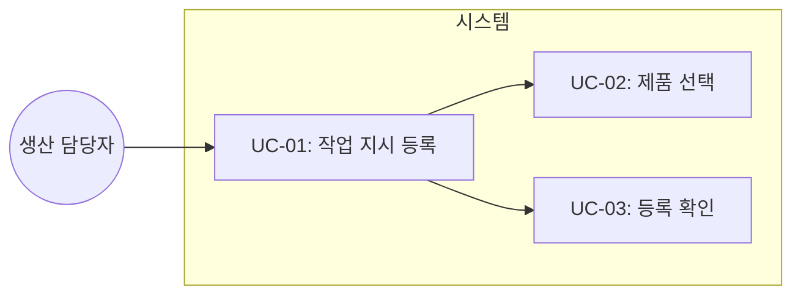
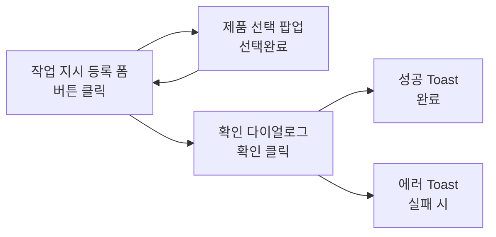

# TSK-06-16 - [샘플] 작업 지시 등록 설계 문서

## 문서 정보

| 항목 | 내용 |
|------|------|
| Task ID | TSK-06-16 |
| 문서 버전 | 1.0 |
| 작성일 | 2026-01-22 |
| 상태 | 작성중 |
| 카테고리 | development |

---

## 1. 개요

### 1.1 배경 및 문제 정의

**현재 상황:**
- 화면 템플릿(FormTemplate, SelectPopupTemplate)이 구현되어 있으나 실제 업무 시나리오에서의 통합 활용 검증이 필요함
- 확인 다이얼로그(confirm.ts), Toast 알림(toast.ts) 유틸리티가 구현되어 있으나 폼 화면과의 연동 검증 필요
- 제품 선택 팝업과 폼의 연동 패턴 검증 필요

**해결하려는 문제:**
- FormTemplate + SelectPopupTemplate + confirm + toast 통합 사용 패턴 검증
- 실제 MES 업무 화면(작업 지시 등록)과 유사한 샘플 구현
- 폼 유효성 검사와 사용자 피드백 흐름 검증

### 1.2 목적 및 기대 효과

**목적:**
- FormTemplate, SelectPopupTemplate, confirm 다이얼로그, Toast 알림의 통합 활용 검증
- 작업 지시 등록 폼의 표준 구현 패턴 제시

**기대 효과:**
- 실제 MES 화면 개발 시 참조 가능한 표준 샘플 제공
- 폼 ↔ 팝업 ↔ 다이얼로그 ↔ Toast 연동 패턴 검증
- FormTemplate의 enableDirtyCheck, 유효성 검사 기능 검증

### 1.3 범위

**포함:**
- 작업 지시 입력 폼 (제품, 수량, 라인, 일정)
- 제품 선택 팝업 (SelectPopupTemplate)
- 저장 전 확인 다이얼로그 (confirmDelete 패턴 활용)
- 저장 성공/실패 Toast 알림
- 폼 유효성 검사 (필수값, 숫자 범위)

**제외:**
- 실제 API 연동 (Mock 데이터 사용)
- 작업 지시 목록 화면 (별도 Task)
- 작업 지시 수정/삭제 기능

### 1.4 참조 문서

| 문서 | 경로 | 관련 섹션 |
|------|------|----------|
| PRD | `.orchay/projects/mes-portal/prd.md` | 4.1.1 입력 폼 샘플 |
| TRD | `.orchay/projects/mes-portal/trd.md` | 1.2 UI/스타일링 스택, 4 AI 코딩 가이드라인 |
| FormTemplate | `components/templates/FormTemplate/index.tsx` | 전체 |
| SelectPopupTemplate | `components/templates/SelectPopupTemplate/SelectPopupTemplate.tsx` | 전체 |

---

## 2. 사용자 분석

### 2.1 대상 사용자

| 사용자 유형 | 특성 | 주요 니즈 |
|------------|------|----------|
| 생산 담당자 | 생산 라인별 작업 지시 등록 담당, 기본적인 PC 사용 능력 | 빠른 작업 지시 등록, 제품 선택 용이성 |
| 생산 관리자 | 작업 지시 검토 및 승인, 전체 생산 일정 관리 | 정확한 데이터 입력, 필수 항목 누락 방지 |

### 2.2 사용자 페르소나

**페르소나 1: 김생산 (생산 담당자)**
- 역할: 생산 라인 A 담당
- 목표: 당일 작업 지시를 빠르게 등록하고 싶다
- 불만: 제품 코드를 외워야 하는 것이 불편하다
- 시나리오: 제품 선택 팝업에서 검색하여 제품을 선택하고, 수량과 일정을 입력하여 작업 지시를 등록한다

---

## 3. 유즈케이스

### 3.1 유즈케이스 다이어그램



### 3.2 유즈케이스 상세

#### UC-01: 작업 지시 등록

| 항목 | 내용 |
|------|------|
| 액터 | 생산 담당자 |
| 목적 | 새로운 작업 지시를 등록한다 |
| 사전 조건 | 사용자가 로그인되어 있고, 작업 지시 등록 화면에 접근한 상태 |
| 사후 조건 | 작업 지시가 저장되고 성공 메시지가 표시됨 |
| 트리거 | 사이드바 메뉴에서 "작업 지시 등록" 클릭 |

**기본 흐름:**
1. 사용자가 작업 지시 등록 화면에 진입한다
2. 시스템이 빈 폼을 표시한다
3. 사용자가 "제품 선택" 버튼을 클릭한다
4. 시스템이 제품 선택 팝업을 표시한다
5. 사용자가 제품을 검색하고 선택한다
6. 시스템이 선택된 제품 정보를 폼에 표시한다
7. 사용자가 수량, 생산 라인, 시작일, 종료일을 입력한다
8. 사용자가 "저장" 버튼을 클릭한다
9. 시스템이 확인 다이얼로그를 표시한다
10. 사용자가 "확인"을 클릭한다
11. 시스템이 저장 처리하고 성공 Toast를 표시한다

**대안 흐름:**
- 8a. 유효성 검사 실패:
  - 시스템이 에러 메시지를 해당 필드에 표시한다
  - 사용자가 값을 수정한다

**예외 흐름:**
- 11a. 저장 실패:
  - 시스템이 에러 Toast를 표시한다
  - 사용자가 재시도하거나 취소한다

#### UC-02: 제품 선택

| 항목 | 내용 |
|------|------|
| 액터 | 생산 담당자 |
| 목적 | 작업 지시에 사용할 제품을 선택한다 |
| 사전 조건 | 제품 선택 팝업이 열린 상태 |
| 사후 조건 | 선택된 제품 정보가 폼에 반영됨 |
| 트리거 | "제품 선택" 버튼 클릭 |

**기본 흐름:**
1. 사용자가 검색어를 입력한다
2. 시스템이 검색 결과를 표시한다
3. 사용자가 제품 행을 클릭하여 선택한다
4. 사용자가 "선택완료" 버튼을 클릭한다
5. 시스템이 팝업을 닫고 선택된 제품을 폼에 표시한다

---

## 4. 사용자 시나리오

### 4.1 시나리오 1: 정상 작업 지시 등록

**상황 설명:**
생산 담당자 김생산씨가 오늘 오전에 "LCD 패널 A형" 500개를 라인 1에서 생산하는 작업 지시를 등록하려 한다.

**단계별 진행:**

| 단계 | 사용자 행동 | 시스템 반응 | 사용자 기대 |
|------|-----------|------------|------------|
| 1 | 작업 지시 등록 메뉴 클릭 | 빈 폼 화면 표시 | 입력 가능한 폼이 보임 |
| 2 | "제품 선택" 버튼 클릭 | 제품 선택 팝업 열림 | 제품 목록이 보임 |
| 3 | "LCD" 검색 | 검색 결과 필터링 | LCD 관련 제품만 표시 |
| 4 | "LCD 패널 A형" 행 클릭 | 행 선택 표시 | 선택된 것이 강조됨 |
| 5 | "선택완료" 클릭 | 팝업 닫힘, 폼에 제품 정보 표시 | 제품명, 코드가 폼에 표시됨 |
| 6 | 수량 500 입력 | 입력 반영 | 숫자가 입력됨 |
| 7 | 라인 1 선택 | 선택 반영 | 라인이 선택됨 |
| 8 | 시작일/종료일 선택 | 날짜 반영 | 날짜가 표시됨 |
| 9 | "저장" 버튼 클릭 | 확인 다이얼로그 표시 | "등록하시겠습니까?" 확인 |
| 10 | "확인" 클릭 | 성공 Toast 표시 | "저장되었습니다" 메시지 |

**성공 조건:**
- 작업 지시가 정상적으로 저장됨
- 성공 Toast가 표시됨

### 4.2 시나리오 2: 유효성 검사 실패

**상황 설명:**
사용자가 필수 항목(제품)을 선택하지 않고 저장을 시도한다.

**단계별 진행:**

| 단계 | 사용자 행동 | 시스템 반응 | 복구 방법 |
|------|-----------|------------|----------|
| 1 | 제품 선택 없이 저장 클릭 | "제품을 선택해주세요" 에러 표시 | 제품 선택 필드로 포커스 |
| 2 | 수량 0 입력 후 저장 | "수량은 1 이상이어야 합니다" 에러 표시 | 수량 수정 |
| 3 | 종료일 < 시작일 설정 | "종료일은 시작일 이후여야 합니다" 에러 표시 | 날짜 수정 |

---

## 5. 화면 설계

### 5.1 화면 흐름도



### 5.2 화면별 상세

#### 화면 1: 작업 지시 등록 폼

**화면 목적:**
새로운 작업 지시 정보를 입력하고 저장하는 화면

**진입 경로:**
- 사이드바 메뉴 > 샘플 > 작업 지시 등록

**와이어프레임:**
```
┌─────────────────────────────────────────────────────────────┐
│  작업 지시 등록                                              │
├─────────────────────────────────────────────────────────────┤
│                                                             │
│  제품 *                                                     │
│  ┌───────────────────────────────────┬─────────────┐       │
│  │ P001 - LCD 패널 A형               │ [제품 선택] │       │
│  └───────────────────────────────────┴─────────────┘       │
│                                                             │
│  수량 *                                                     │
│  ┌─────────────────────────┐                                │
│  │ 500                     │ 개                             │
│  └─────────────────────────┘                                │
│                                                             │
│  생산 라인 *                                                │
│  ┌─────────────────────────┐                                │
│  │ 라인 1             ▼    │                                │
│  └─────────────────────────┘                                │
│                                                             │
│  시작일 *                        종료일 *                   │
│  ┌──────────────────┐          ┌──────────────────┐        │
│  │ 2026-01-22   📅 │          │ 2026-01-22   📅 │        │
│  └──────────────────┘          └──────────────────┘        │
│                                                             │
│  비고                                                       │
│  ┌─────────────────────────────────────────────────┐       │
│  │                                                 │       │
│  │                                                 │       │
│  └─────────────────────────────────────────────────┘       │
│                                                             │
│           [취소]  [저장]                                    │
│                                                             │
└─────────────────────────────────────────────────────────────┘
```

**화면 요소 설명:**

| 영역 | 설명 | 사용자 인터랙션 |
|------|------|----------------|
| 제품 필드 | 읽기 전용 표시 + 선택 버튼 | 버튼 클릭 시 팝업 오픈 |
| 수량 필드 | 숫자 입력, 1-99999 범위 | 직접 입력 또는 스피너 조작 |
| 생산 라인 | 드롭다운 선택 | 라인 1~5 중 선택 |
| 시작일/종료일 | 날짜 선택기 | 캘린더에서 날짜 선택 |
| 비고 | 텍스트 영역 | 자유 텍스트 입력 (선택) |
| 취소 버튼 | 입력 취소 | 변경사항 있으면 확인 후 이전 화면 |
| 저장 버튼 | 작업 지시 저장 | 유효성 검사 → 확인 다이얼로그 → 저장 |

#### 화면 2: 제품 선택 팝업

**화면 목적:**
제품 목록에서 작업 지시에 사용할 제품을 검색/선택

**와이어프레임:**
```
┌─────────────────────────────────────────────────────────────┐
│  제품 선택                                           [✕]   │
├─────────────────────────────────────────────────────────────┤
│  ┌─────────────────────────────────────────┬──────────┐    │
│  │ 🔍 제품명 또는 코드로 검색              │ [검색]   │    │
│  └─────────────────────────────────────────┴──────────┘    │
│                                                             │
│  ┌─────────────────────────────────────────────────────┐   │
│  │ 제품 코드  │ 제품명          │ 규격    │ 단위 │   │
│  ├────────────┼─────────────────┼─────────┼──────┼   │
│  │ P001      │ LCD 패널 A형    │ 15인치  │ EA   │   │
│  │ P002      │ LCD 패널 B형    │ 17인치  │ EA   │   │
│  │ P003      │ 메인보드 A      │ ATX     │ EA   │   │
│  │ ...       │ ...             │ ...     │ ...  │   │
│  └─────────────────────────────────────────────────────┘   │
│                                    총 50건 | 1 / 5 페이지   │
│                                                             │
│                            [취소]  [선택완료]               │
└─────────────────────────────────────────────────────────────┘
```

### 5.3 반응형 동작

| 화면 크기 | 레이아웃 변화 | 사용자 경험 |
|----------|--------------|------------|
| 데스크톱 (1024px+) | 2열 레이아웃 (시작일/종료일 나란히) | 넓은 화면 활용 |
| 태블릿 (768-1023px) | 1열 레이아웃 | 세로 스크롤 |
| 모바일 (767px-) | 1열, 팝업 전체 화면 | 터치 친화적 |

---

## 6. 인터랙션 설계

### 6.1 사용자 액션과 피드백

| 사용자 액션 | 즉각 피드백 | 결과 피드백 | 에러 피드백 |
|------------|-----------|------------|------------|
| 제품 선택 버튼 클릭 | 버튼 눌림 효과 | 팝업 열림 | - |
| 팝업에서 행 클릭 | 행 하이라이트 | 선택 표시 | - |
| 저장 버튼 클릭 | 버튼 로딩 | 확인 다이얼로그 | 유효성 에러 표시 |
| 확인 다이얼로그 확인 | 버튼 로딩 | 성공 Toast | 에러 Toast |
| 취소 버튼 클릭 | 버튼 눌림 효과 | 변경 확인 다이얼로그 (dirty 시) | - |

### 6.2 상태별 화면 변화

| 상태 | 화면 표시 | 사용자 안내 |
|------|----------|------------|
| 초기 (빈 폼) | 모든 필드 비어있음 | 필수 필드 * 표시 |
| 제품 선택됨 | 제품 정보 표시 | - |
| 유효성 에러 | 필드 빨간 테두리 + 에러 메시지 | "필수 항목입니다" |
| 저장 중 | 저장 버튼 로딩 스피너 | 폼 비활성화 |
| 저장 성공 | 성공 Toast | "저장되었습니다" |
| 저장 실패 | 에러 Toast | "저장에 실패했습니다. 다시 시도해주세요" |

### 6.3 키보드/접근성

| 기능 | 키보드 단축키 | 스크린 리더 안내 |
|------|-------------|-----------------|
| 저장 | Ctrl+S (enableDirtyCheck 시) | "저장 버튼" |
| 취소 | Esc (팝업 닫기) | "취소하고 이전으로" |
| 다음 필드 | Tab | 필드 레이블 읽기 |
| 팝업 닫기 | Esc | "팝업 닫기" |

---

## 7. 데이터 요구사항

### 7.1 필요한 데이터

| 데이터 | 설명 | 출처 | 용도 |
|--------|------|------|------|
| 제품 목록 | 선택 가능한 제품 정보 | mock-data/products.json | 제품 선택 팝업 |
| 생산 라인 목록 | 선택 가능한 라인 | 상수 정의 | 드롭다운 옵션 |
| 작업 지시 | 등록할 작업 지시 데이터 | 사용자 입력 | 저장 처리 |

### 7.2 데이터 모델

```typescript
// 작업 지시 폼 데이터
interface WorkOrderFormData {
  productCode: string       // 제품 코드 (필수)
  productName: string       // 제품명 (표시용)
  quantity: number          // 수량 (필수, 1-99999)
  lineId: string            // 생산 라인 ID (필수)
  startDate: string         // 시작일 (필수, YYYY-MM-DD)
  endDate: string           // 종료일 (필수, YYYY-MM-DD)
  remarks?: string          // 비고 (선택, 최대 500자)
}

// 제품 데이터
interface Product {
  code: string              // 제품 코드
  name: string              // 제품명
  spec: string              // 규격
  unit: string              // 단위
}
```

### 7.3 데이터 유효성 규칙

| 데이터 필드 | 규칙 | 위반 시 메시지 |
|------------|------|---------------|
| productCode | 필수 | "제품을 선택해주세요" |
| quantity | 필수, 1-99999 정수 | "수량은 1 이상 99,999 이하로 입력해주세요" |
| lineId | 필수 | "생산 라인을 선택해주세요" |
| startDate | 필수 | "시작일을 선택해주세요" |
| endDate | 필수, startDate 이상 | "종료일은 시작일 이후여야 합니다" |
| remarks | 최대 500자 | "비고는 500자 이내로 입력해주세요" |

---

## 8. 비즈니스 규칙

### 8.1 핵심 규칙

| 규칙 ID | 규칙 설명 | 적용 상황 | 예외 |
|---------|----------|----------|------|
| BR-01 | 저장 전 확인 다이얼로그 필수 | 저장 버튼 클릭 시 | 없음 |
| BR-02 | 필수 필드 입력 완료 후 저장 가능 | 저장 시도 시 | 없음 |
| BR-03 | 종료일은 시작일 이후여야 함 | 날짜 입력 시 | 없음 |
| BR-04 | 수량은 1 이상 99999 이하 | 수량 입력 시 | 없음 |
| BR-05 | 변경사항 있을 때 취소 시 확인 | enableDirtyCheck 활성화 시 | 없음 |

### 8.2 규칙 상세 설명

**BR-01: 저장 전 확인 다이얼로그 필수**

설명: 사용자가 실수로 저장하는 것을 방지하기 위해 저장 전 확인 다이얼로그를 표시합니다.

예시:
- 저장 버튼 클릭 → "작업 지시를 등록하시겠습니까?" 다이얼로그 표시
- "확인" 클릭 → 실제 저장 처리
- "취소" 클릭 → 다이얼로그 닫기, 폼 유지

**BR-03: 종료일은 시작일 이후여야 함**

설명: 논리적으로 작업 종료일은 시작일과 같거나 이후여야 합니다.

예시:
- 시작일 2026-01-22, 종료일 2026-01-23 → 유효
- 시작일 2026-01-22, 종료일 2026-01-22 → 유효 (당일 완료)
- 시작일 2026-01-22, 종료일 2026-01-21 → 무효

---

## 9. 에러 처리

### 9.1 예상 에러 상황

| 상황 | 원인 | 사용자 메시지 | 복구 방법 |
|------|------|--------------|----------|
| 필수값 누락 | 필수 필드 미입력 | "필수 항목입니다" | 해당 필드로 포커스 |
| 수량 범위 초과 | 0 이하 또는 99999 초과 | "수량은 1~99,999 범위입니다" | 값 수정 |
| 날짜 오류 | 종료일 < 시작일 | "종료일은 시작일 이후여야 합니다" | 날짜 수정 |
| 저장 실패 | 네트워크/서버 오류 | "저장에 실패했습니다. 다시 시도해주세요" | 재시도 |

### 9.2 에러 표시 방식

| 에러 유형 | 표시 위치 | 표시 방법 |
|----------|----------|----------|
| 필드 오류 | 해당 필드 하단 | 빨간색 텍스트 + 빨간 테두리 |
| 저장 실패 | 화면 상단 | Toast 알림 (showError) |

---

## 10. 연관 문서

> 상세 테스트 명세 및 요구사항 추적은 별도 문서에서 관리합니다.

| 문서 | 경로 | 용도 |
|------|------|------|
| 요구사항 추적 매트릭스 | `025-traceability-matrix.md` | PRD → 설계 → 테스트 양방향 추적 |
| 테스트 명세서 | `026-test-specification.md` | 단위/E2E/매뉴얼 테스트 상세 정의 |

---

## 11. 구현 범위

### 11.1 영향받는 영역

| 영역 | 변경 내용 | 영향도 |
|------|----------|--------|
| screens/sample/WorkOrderForm.tsx | 신규 생성 | 높음 |
| mock-data/products.json | 신규 생성 | 중간 |
| app/(portal)/sample/work-order-form/page.tsx | 신규 생성 | 중간 |

### 11.2 의존성

| 의존 항목 | 이유 | 상태 |
|----------|------|------|
| TSK-06-03 FormTemplate | 폼 템플릿 사용 | 완료 |
| TSK-06-05 SelectPopupTemplate | 제품 선택 팝업 사용 | 완료 |
| TSK-05-02 확인 다이얼로그 | confirmDelete 패턴 활용 | 완료 |
| TSK-05-03 Toast 알림 | showSuccess, showError 사용 | 완료 |

### 11.3 제약 사항

| 제약 | 설명 | 대응 방안 |
|------|------|----------|
| Mock 데이터 | 실제 API 없음 | JSON 파일로 데이터 제공 |
| 저장 시뮬레이션 | 실제 저장 없음 | setTimeout으로 저장 시뮬레이션 |

---

## 12. 체크리스트

### 12.1 설계 완료 확인

- [x] 문제 정의 및 목적 명확화
- [x] 사용자 분석 완료
- [x] 유즈케이스 정의 완료
- [x] 사용자 시나리오 작성 완료
- [x] 화면 설계 완료 (와이어프레임)
- [x] 인터랙션 설계 완료
- [x] 데이터 요구사항 정의 완료
- [x] 비즈니스 규칙 정의 완료
- [x] 에러 처리 정의 완료

### 12.2 연관 문서 작성

- [ ] 요구사항 추적 매트릭스 작성 (→ `025-traceability-matrix.md`)
- [ ] 테스트 명세서 작성 (→ `026-test-specification.md`)

### 12.3 구현 준비

- [x] 구현 우선순위 결정
- [x] 의존성 확인 완료
- [x] 제약 사항 검토 완료

---

## 변경 이력

| 버전 | 일자 | 작성자 | 변경 내용 |
|------|------|--------|----------|
| 1.0 | 2026-01-22 | Claude | 최초 작성 |
