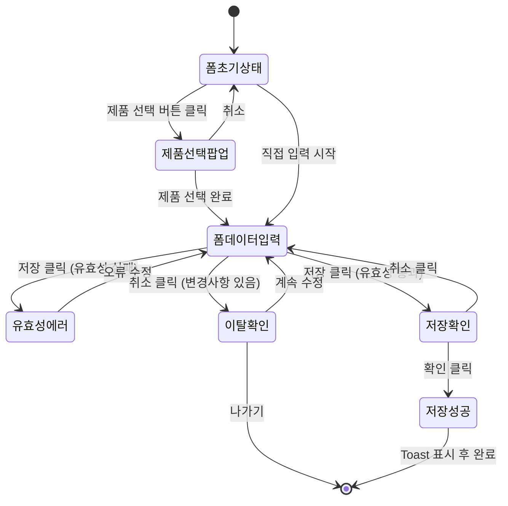

# TSK-06-16 - [샘플] 작업 지시 등록 화면 설계서

## 문서 정보

| 항목 | 내용 |
|------|------|
| Task ID | TSK-06-16 |
| 문서 버전 | 1.0 |
| 작성일 | 2026-01-22 |
| 상태 | 작성중 |

---

## 1. 화면 목록

| 화면 ID | 화면명 | 목적 | SVG 참조 |
|---------|-------|------|----------|
| SCR-01 | 작업 지시 등록 폼 | 새 작업 지시 정보 입력 | `screen-01-work-order-form.svg` |
| SCR-02 | 제품 선택 팝업 | 제품 검색 및 선택 | `screen-02-product-popup.svg` |
| SCR-03 | 저장 확인 다이얼로그 | 저장 전 확인 | `screen-03-confirm-dialog.svg` |
| SCR-04 | 유효성 에러 상태 | 입력 오류 표시 | `screen-04-validation-error.svg` |

---

## 2. 화면 전환 흐름

### 2.1 상태 다이어그램



### 2.2 액션-화면 매트릭스

| 현재 상태 | 액션 | 다음 상태 | 조건 |
|----------|------|----------|------|
| 폼 초기 상태 | 제품 선택 버튼 클릭 | 제품 선택 팝업 | - |
| 제품 선택 팝업 | 선택완료 클릭 | 폼 데이터 입력 | 제품 선택됨 |
| 제품 선택 팝업 | 취소 클릭 | 폼 초기 상태 | - |
| 폼 데이터 입력 | 저장 클릭 | 저장 확인 다이얼로그 | 유효성 통과 |
| 폼 데이터 입력 | 저장 클릭 | 유효성 에러 상태 | 유효성 실패 |
| 저장 확인 다이얼로그 | 확인 클릭 | 저장 성공 | - |
| 폼 데이터 입력 | 취소 클릭 | 이탈 확인 다이얼로그 | 변경사항 있음 |

---

## 3. 화면별 상세

### 3.1 SCR-01: 작업 지시 등록 폼

**화면 목적:** 새로운 작업 지시의 제품, 수량, 라인, 일정 정보를 입력

**레이아웃:**

```
┌─────────────────────────────────────────────────────────────┐
│  Card: "작업 지시 등록"                                      │
├─────────────────────────────────────────────────────────────┤
│                                                             │
│  ┌─────────────────────────────────────────────────────┐   │
│  │ Form (vertical layout)                               │   │
│  │                                                      │   │
│  │ 제품 *                                              │   │
│  │ ┌──────────────────────────────────┬─────────────┐  │   │
│  │ │ [읽기전용] P001 - LCD 패널 A형   │ [제품 선택] │  │   │
│  │ └──────────────────────────────────┴─────────────┘  │   │
│  │                                                      │   │
│  │ 수량 *                                              │   │
│  │ ┌─────────────────────────────────────┐             │   │
│  │ │ [-] 500                         [+] │ 개          │   │
│  │ └─────────────────────────────────────┘             │   │
│  │                                                      │   │
│  │ 생산 라인 *                                         │   │
│  │ ┌─────────────────────────────────────┐             │   │
│  │ │ 라인 1                           ▼  │             │   │
│  │ └─────────────────────────────────────┘             │   │
│  │                                                      │   │
│  │ 시작일 *                    종료일 *                │   │
│  │ ┌──────────────────┐      ┌──────────────────┐     │   │
│  │ │ 2026-01-22   📅 │      │ 2026-01-22   📅 │     │   │
│  │ └──────────────────┘      └──────────────────┘     │   │
│  │                                                      │   │
│  │ 비고                                                │   │
│  │ ┌─────────────────────────────────────────────────┐ │   │
│  │ │                                                 │ │   │
│  │ │ 생산 관련 참고 사항을 입력하세요                │ │   │
│  │ │                                                 │ │   │
│  │ └─────────────────────────────────────────────────┘ │   │
│  │                                                      │   │
│  │                    [취소]  [저장]                   │   │
│  │                                                      │   │
│  └─────────────────────────────────────────────────────┘   │
│                                                             │
└─────────────────────────────────────────────────────────────┘
```

**컴포넌트 상세:**

| 컴포넌트 | Ant Design | 속성 |
|---------|------------|------|
| 카드 | Card | title="작업 지시 등록" |
| 폼 | Form | layout="vertical" |
| 제품 필드 | Input.Group | compact |
| 제품 표시 | Input | disabled, value=선택된 제품 |
| 제품 선택 버튼 | Button | onClick=openProductPopup |
| 수량 입력 | InputNumber | min=1, max=99999, addonAfter="개" |
| 라인 선택 | Select | options=라인 목록 |
| 날짜 선택 | DatePicker | format="YYYY-MM-DD" |
| 비고 | Input.TextArea | rows=3, maxLength=500 |
| 취소 버튼 | Button | onClick=handleCancel |
| 저장 버튼 | Button | type="primary", htmlType="submit" |

**상태 관리:**

| 상태 | 타입 | 초기값 | 설명 |
|------|------|--------|------|
| productPopupOpen | boolean | false | 제품 선택 팝업 열림 상태 |
| selectedProduct | Product | null | 선택된 제품 정보 |
| loading | boolean | false | 저장 중 로딩 상태 |

**액션:**

| 액션 | 트리거 | 처리 |
|------|--------|------|
| openProductPopup | 제품 선택 버튼 클릭 | productPopupOpen = true |
| handleProductSelect | 팝업에서 선택완료 | selectedProduct 설정, 팝업 닫기 |
| handleSubmit | 저장 버튼 클릭 | 유효성 검사 → 확인 다이얼로그 → 저장 |
| handleCancel | 취소 버튼 클릭 | dirty check → 확인 → 이전 페이지 |

### 3.2 SCR-02: 제품 선택 팝업

**화면 목적:** 제품 목록에서 작업 지시에 사용할 제품을 검색하고 선택

**레이아웃:**

```
┌─────────────────────────────────────────────────────────────┐
│  Modal: "제품 선택"                                  [✕]   │
├─────────────────────────────────────────────────────────────┤
│                                                             │
│  ┌─────────────────────────────────────────┬──────────┐    │
│  │ 🔍 제품명 또는 코드로 검색              │ [검색]   │    │
│  └─────────────────────────────────────────┴──────────┘    │
│                                                             │
│  ┌─────────────────────────────────────────────────────┐   │
│  │ 제품 코드  │ 제품명          │ 규격    │ 단위 │   │   │
│  ├────────────┼─────────────────┼─────────┼──────┤   │   │
│  │ P001      │ LCD 패널 A형    │ 15인치  │ EA   │   │   │
│  │ P002      │ LCD 패널 B형    │ 17인치  │ EA   │   │   │
│  │ P003      │ 메인보드 A      │ ATX     │ EA   │   │   │
│  │ P004      │ 메인보드 B      │ Mini-ITX│ EA   │   │   │
│  │ P005      │ 케이스 A형      │ Mid Tower│ EA  │   │   │
│  └─────────────────────────────────────────────────────┘   │
│                                                             │
│                                    총 10건 | 1 / 1 페이지   │
│                                                             │
├─────────────────────────────────────────────────────────────┤
│                            [취소]  [선택완료]               │
└─────────────────────────────────────────────────────────────┘
```

**컴포넌트:** SelectPopupTemplate 재사용

| 속성 | 값 |
|------|-----|
| title | "제품 선택" |
| columns | productColumns |
| dataSource | products |
| rowKey | "code" |
| multiple | false |
| searchFields | ["code", "name"] |
| searchPlaceholder | "제품명 또는 코드로 검색" |

### 3.3 SCR-03: 저장 확인 다이얼로그

**화면 목적:** 저장 전 사용자 확인

**레이아웃:**

```
┌─────────────────────────────────────────────────┐
│  ⚠️ 등록 확인                                   │
├─────────────────────────────────────────────────┤
│                                                 │
│  작업 지시를 등록하시겠습니까?                   │
│                                                 │
├─────────────────────────────────────────────────┤
│                    [취소]  [확인]               │
└─────────────────────────────────────────────────┘
```

**구현:** Modal.confirm() 사용

```typescript
Modal.confirm({
  title: '등록 확인',
  icon: <ExclamationCircleFilled />,
  content: '작업 지시를 등록하시겠습니까?',
  okText: '확인',
  cancelText: '취소',
  onOk: () => saveWorkOrder()
})
```

### 3.4 SCR-04: 유효성 에러 상태

**화면 목적:** 입력 오류 시 사용자에게 명확한 피드백 제공

**레이아웃:**

```
┌─────────────────────────────────────────────────────────────┐
│  Card: "작업 지시 등록"                                      │
├─────────────────────────────────────────────────────────────┤
│                                                             │
│  제품 *                                                     │
│  ┌──────────────────────────────────┬─────────────┐        │
│  │ [빨간 테두리] 선택된 제품 없음   │ [제품 선택] │        │
│  └──────────────────────────────────┴─────────────┘        │
│  ⚠️ 제품을 선택해주세요                                     │
│                                                             │
│  수량 *                                                     │
│  ┌─────────────────────────────────────┐                   │
│  │ [빨간 테두리] 0                     │ 개                 │
│  └─────────────────────────────────────┘                   │
│  ⚠️ 수량은 1 이상 99,999 이하로 입력해주세요                │
│                                                             │
│  ...                                                        │
│                                                             │
└─────────────────────────────────────────────────────────────┘
```

**에러 표시 규칙:**

| 에러 상황 | 표시 방식 |
|----------|----------|
| 필수 필드 미입력 | 빨간 테두리 + 에러 메시지 |
| 범위 초과 | 빨간 테두리 + 에러 메시지 |
| 날짜 오류 | 빨간 테두리 + 에러 메시지 |

---

## 4. 공통 컴포넌트

### 4.1 사용하는 공통 컴포넌트

| 컴포넌트 | 출처 | 용도 |
|---------|------|------|
| FormTemplate | TSK-06-03 | 폼 래퍼, 저장/취소 버튼, dirty check |
| SelectPopupTemplate | TSK-06-05 | 제품 선택 팝업 |
| showSuccess | TSK-05-03 | 성공 Toast |
| showError | TSK-05-03 | 에러 Toast |

### 4.2 확인 다이얼로그

```typescript
// 저장 확인
const confirmSave = () => {
  Modal.confirm({
    title: '등록 확인',
    icon: <ExclamationCircleFilled />,
    content: '작업 지시를 등록하시겠습니까?',
    okText: '확인',
    cancelText: '취소',
    onOk: () => saveWorkOrder()
  })
}
```

### 4.3 Toast 알림

```typescript
// 저장 성공
showSuccess('저장되었습니다.')

// 저장 실패
showError('저장에 실패했습니다. 다시 시도해주세요.')
```

---

## 5. 반응형 설계

### 5.1 Breakpoint

| Breakpoint | 너비 | 레이아웃 변화 |
|------------|------|--------------|
| Desktop | >= 1024px | 날짜 필드 2열 |
| Tablet | 768-1023px | 날짜 필드 1열 |
| Mobile | < 768px | 모든 필드 1열, 팝업 전체 화면 |

### 5.2 반응형 Form 레이아웃

```typescript
const dateColSpan = {
  xs: 24,  // Mobile: 1열
  sm: 24,  // Small: 1열
  md: 12,  // Medium: 2열
  lg: 12,  // Large: 2열
}

<Row gutter={16}>
  <Col {...dateColSpan}>
    <Form.Item name="startDate" label="시작일">
      <DatePicker />
    </Form.Item>
  </Col>
  <Col {...dateColSpan}>
    <Form.Item name="endDate" label="종료일">
      <DatePicker />
    </Form.Item>
  </Col>
</Row>
```

---

## 6. 접근성

### 6.1 키보드 네비게이션

| 키 | 동작 |
|-----|------|
| Tab | 다음 폼 필드로 이동 |
| Shift+Tab | 이전 폼 필드로 이동 |
| Enter | 저장 버튼 실행 (폼 내) |
| Escape | 팝업/다이얼로그 닫기 |

### 6.2 ARIA 속성

| 요소 | ARIA 속성 |
|------|----------|
| 필수 필드 | aria-required="true" |
| 에러 필드 | aria-invalid="true", aria-describedby="에러메시지ID" |
| 제품 선택 버튼 | aria-label="제품 선택 팝업 열기" |
| 저장 버튼 | aria-label="작업 지시 저장" |

### 6.3 색상 대비

- 에러 메시지: `#ff4d4f` on white (대비율 4.5:1 이상)
- 필수 표시(*): `#ff4d4f` on white

---

## 7. SVG 파일 목록

| 파일명 | 화면 | 설명 |
|--------|------|------|
| `screen-01-work-order-form.svg` | 작업 지시 등록 폼 | 기본 상태 |
| `screen-02-product-popup.svg` | 제품 선택 팝업 | 팝업 열린 상태 |
| `screen-03-confirm-dialog.svg` | 저장 확인 다이얼로그 | 다이얼로그 표시 |
| `screen-04-validation-error.svg` | 유효성 에러 상태 | 에러 메시지 표시 |

---

## 변경 이력

| 버전 | 일자 | 작성자 | 변경 내용 |
|------|------|--------|----------|
| 1.0 | 2026-01-22 | Claude | 최초 작성 |
