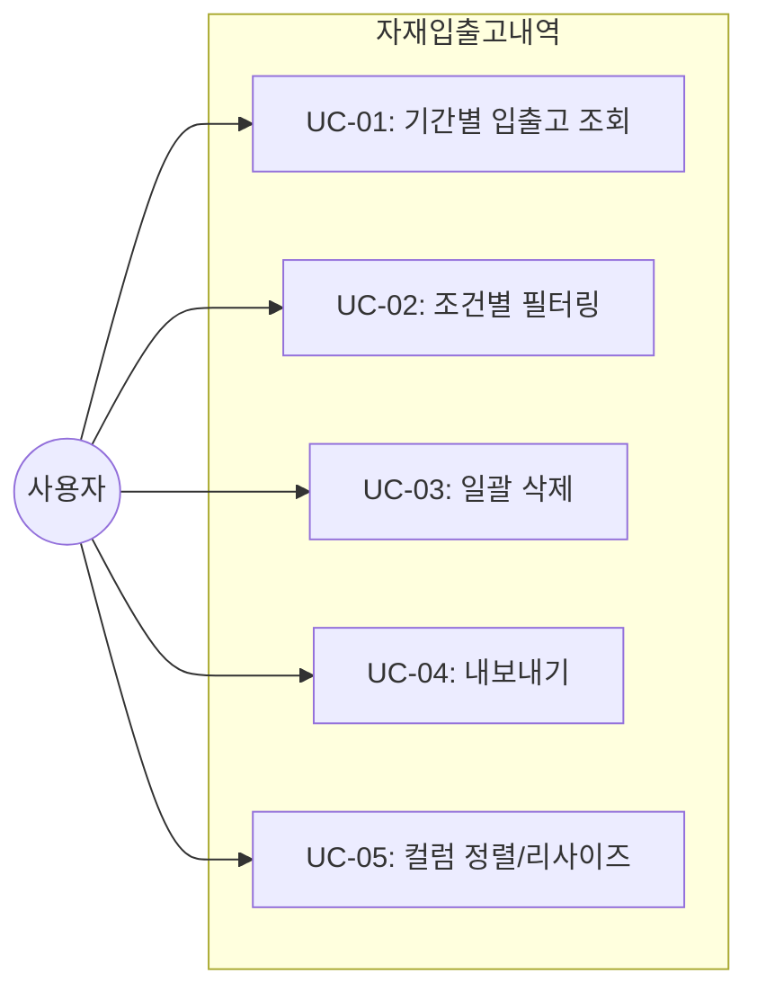
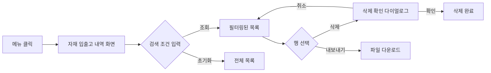

# TSK-06-17 - [샘플] 자재 입출고 내역 설계 문서

## 문서 정보

| 항목 | 내용 |
|------|------|
| Task ID | TSK-06-17 |
| 문서 버전 | 1.0 |
| 작성일 | 2026-01-22 |
| 상태 | 작성중 |
| 카테고리 | development |

---

## 1. 개요

### 1.1 배경 및 문제 정의

**현재 상황:**
- MES 포털에 목록(조회) 화면 템플릿(ListTemplate)이 구현되어 있음
- 기본적인 사용자 목록 샘플(TSK-06-07)이 구현됨
- 목록 템플릿의 고급 기능(RangePicker, 컬럼 리사이즈, 일괄 처리) 검증 필요

**해결하려는 문제:**
- ListTemplate의 RangePicker(기간 선택) 통합 검증 필요
- 컬럼 리사이즈 기능 실제 사용 예시 부재
- 다중 행 선택 및 일괄 처리 패턴 검증 필요

### 1.2 목적 및 기대 효과

**목적:**
- ListTemplate의 확장 기능(RangePicker, 컬럼 리사이즈, 일괄 처리)을 검증하는 샘플 화면 구현
- 자재 입출고 내역 조회라는 실제 MES 시나리오로 템플릿 활용도 검증

**기대 효과:**
- ListTemplate의 고급 기능 검증 및 문서화
- 개발자가 참고할 수 있는 기간 검색 + 일괄 처리 패턴 예시 제공
- DataTable의 컬럼 리사이즈 기능 활용 사례 확립

### 1.3 범위

**포함:**
- 자재 입출고 내역 조회 화면 (ListTemplate 활용)
- 검색 조건: 자재명, 입출고유형, 기간(RangePicker)
- 테이블: 정렬/페이징/필터링, 컬럼 리사이즈
- 다중 행 선택 및 일괄 삭제/내보내기

**제외:**
- 실제 API 연동 (Mock 데이터 사용)
- 자재 입출고 등록/수정 폼 (조회 전용)
- 상세 화면 (목록 조회만)

### 1.4 참조 문서

| 문서 | 경로 | 관련 섹션 |
|------|------|----------|
| PRD | `.orchay/projects/mes-portal/prd.md` | 4.1.1 목록 화면 샘플 |
| TRD | `.orchay/projects/mes-portal/trd.md` | 1.2, 1.5 |
| ListTemplate | `components/templates/ListTemplate/` | - |
| DataTable | `components/common/DataTable.tsx` | - |

---

## 2. 사용자 분석

### 2.1 대상 사용자

| 사용자 유형 | 특성 | 주요 니즈 |
|------------|------|----------|
| 자재 담당자 | 자재 입출고 관리 담당, 일반 PC 사용 수준 | 기간별 입출고 내역 조회, 일괄 처리 |
| 생산 담당자 | 생산에 필요한 자재 확인, 중급 IT 활용 | 빠른 검색, 특정 기간 내역 확인 |
| 관리자 | 전체 현황 파악, 고급 IT 활용 | 대량 데이터 조회, 내보내기 |

### 2.2 사용자 페르소나

**페르소나 1: 김자재 (자재 담당자)**
- 역할: 자재팀 사원, 일일 입출고 관리
- 목표: 오늘/이번 주 입출고 내역 빠르게 확인
- 불만: 기간 선택이 번거로움, 많은 데이터에서 원하는 항목 찾기 어려움
- 시나리오: 매일 아침 어제 입출고 내역 확인, 월말 정산 시 월간 데이터 조회

**페르소나 2: 이생산 (생산 담당자)**
- 역할: 생산팀 과장, 자재 소요 확인
- 목표: 특정 자재의 입출고 이력 추적
- 불만: 자재명 검색 결과가 너무 많음
- 시나리오: 특정 자재 부족 시 최근 입고 내역 확인

---

## 3. 유즈케이스

### 3.1 유즈케이스 다이어그램



### 3.2 유즈케이스 상세

#### UC-01: 기간별 입출고 조회

| 항목 | 내용 |
|------|------|
| 액터 | 자재 담당자, 생산 담당자, 관리자 |
| 목적 | 특정 기간 내 입출고 내역 조회 |
| 사전 조건 | 로그인 완료, 자재 입출고 메뉴 접근 |
| 사후 조건 | 기간에 해당하는 입출고 내역 표시 |
| 트리거 | 기간 선택 후 조회 버튼 클릭 |

**기본 흐름:**
1. 사용자가 RangePicker에서 시작일/종료일 선택
2. 조회 버튼 클릭
3. 시스템이 해당 기간의 입출고 내역 표시
4. 테이블에 페이지네이션과 함께 결과 표시

**대안 흐름:**
- 1a. 기간 미선택 시 전체 데이터 조회

**예외 흐름:**
- 3a. 조회 결과 없음 → Empty State 표시

#### UC-02: 조건별 필터링

| 항목 | 내용 |
|------|------|
| 액터 | 모든 사용자 |
| 목적 | 자재명, 입출고유형으로 데이터 필터링 |
| 사전 조건 | 자재 입출고 내역 화면 진입 |
| 사후 조건 | 조건에 맞는 데이터만 표시 |
| 트리거 | 검색 조건 입력 후 조회 클릭 |

**기본 흐름:**
1. 사용자가 자재명 입력 또는 입출고유형 선택
2. 조회 버튼 클릭
3. 시스템이 조건에 맞는 데이터 필터링
4. 결과 표시

#### UC-03: 일괄 삭제

| 항목 | 내용 |
|------|------|
| 액터 | 관리자, 자재 담당자 |
| 목적 | 여러 건의 입출고 내역 일괄 삭제 |
| 사전 조건 | 1건 이상 행 선택 |
| 사후 조건 | 선택된 항목 삭제됨 |
| 트리거 | 삭제 버튼 클릭 |

**기본 흐름:**
1. 사용자가 체크박스로 여러 행 선택
2. 삭제 버튼 클릭
3. 확인 다이얼로그 표시 ("N건의 항목을 삭제하시겠습니까?")
4. 확인 클릭 시 삭제 처리
5. 성공 Toast 표시, 목록 갱신

**예외 흐름:**
- 2a. 선택된 행 없음 → 삭제 버튼 비활성화
- 4a. 취소 클릭 → 다이얼로그 닫힘, 상태 유지

#### UC-04: 내보내기

| 항목 | 내용 |
|------|------|
| 액터 | 모든 사용자 |
| 목적 | 현재 조회 결과를 Excel/CSV로 내보내기 |
| 사전 조건 | 데이터 조회 완료 |
| 사후 조건 | 파일 다운로드 시작 |
| 트리거 | 내보내기 버튼 클릭 |

**기본 흐름:**
1. 사용자가 내보내기 버튼 클릭
2. 현재 검색 조건 적용된 데이터 추출
3. Excel/CSV 파일 생성
4. 브라우저 다운로드

#### UC-05: 컬럼 정렬/리사이즈

| 항목 | 내용 |
|------|------|
| 액터 | 모든 사용자 |
| 목적 | 데이터 정렬 및 컬럼 너비 조절 |
| 사전 조건 | 데이터 표시 중 |
| 사후 조건 | 정렬/컬럼 너비 변경됨 |
| 트리거 | 컬럼 헤더 클릭/드래그 |

**기본 흐름:**
1. 컬럼 헤더 클릭 → 오름차순/내림차순 정렬 토글
2. 컬럼 경계 드래그 → 컬럼 너비 조절

---

## 4. 사용자 시나리오

### 4.1 시나리오 1: 월간 입출고 내역 조회

**상황 설명:**
김자재 사원이 월말 정산을 위해 이번 달 입출고 내역을 조회하고자 한다.

**단계별 진행:**

| 단계 | 사용자 행동 | 시스템 반응 | 사용자 기대 |
|------|-----------|------------|------------|
| 1 | 자재 입출고 메뉴 클릭 | 입출고 내역 화면 로드 | 목록 화면 표시 |
| 2 | RangePicker에서 이번 달 시작~종료일 선택 | 날짜 표시 | 선택한 기간 확인 |
| 3 | 조회 버튼 클릭 | 해당 기간 데이터 로드 | 월간 데이터 표시 |
| 4 | 입고량 컬럼 클릭 | 입고량 내림차순 정렬 | 큰 입고량부터 확인 |

**성공 조건:**
- 선택한 기간의 데이터만 표시
- 정렬 기능 정상 동작

### 4.2 시나리오 2: 특정 자재 입고 내역 확인

**상황 설명:**
이생산 과장이 "원자재A"의 최근 입고 내역을 확인하고자 한다.

**단계별 진행:**

| 단계 | 사용자 행동 | 시스템 반응 | 사용자 기대 |
|------|-----------|------------|------------|
| 1 | 자재명 입력란에 "원자재A" 입력 | 입력 표시 | 검색어 입력 확인 |
| 2 | 입출고유형 "입고" 선택 | 선택 표시 | 입고만 필터 |
| 3 | 조회 버튼 클릭 | 필터링된 결과 표시 | 원자재A 입고 내역만 표시 |

**성공 조건:**
- 자재명에 "원자재A" 포함된 입고 건만 표시

### 4.3 시나리오 3: 불필요 데이터 일괄 삭제

**상황 설명:**
관리자가 테스트로 입력한 데이터를 일괄 삭제하고자 한다.

**단계별 진행:**

| 단계 | 사용자 행동 | 시스템 반응 | 복구 방법 |
|------|-----------|------------|----------|
| 1 | 삭제할 행들 체크박스 선택 | 선택 개수 표시 | - |
| 2 | 삭제 버튼 클릭 | 확인 다이얼로그 표시 | 취소 클릭 |
| 3 | 확인 클릭 | 삭제 처리 후 Toast | - |

---

## 5. 화면 설계

### 5.1 화면 흐름도



### 5.2 화면별 상세

#### 화면 1: 자재 입출고 내역

**화면 목적:**
자재의 입출고 내역을 기간별, 조건별로 조회하고 일괄 처리하는 화면

**진입 경로:**
- 사이드바 메뉴 > 샘플 > 자재 입출고 내역

**와이어프레임:**
```
┌─────────────────────────────────────────────────────────────────────────┐
│  검색 조건                                                               │
│  ┌───────────────────────────────────────────────────────────────────┐  │
│  │  자재명           입출고유형          기간                         │  │
│  │  [입력란______]   [전체    ▼]        [시작일] ~ [종료일]          │  │
│  │                                                                   │  │
│  │                                      [초기화]  [조회]             │  │
│  └───────────────────────────────────────────────────────────────────┘  │
│                                                                          │
│  ┌───────────────────────────────────────────────────────────────────┐  │
│  │  총 123건  |  선택: 2건                    [삭제] [내보내기]      │  │
│  ├───────────────────────────────────────────────────────────────────┤  │
│  │  ☐ │ 자재명     │ 입출고유형 │ 수량  │ 일자       │ 담당자  │ 비고│  │
│  │  ────────────────────────────────────────────────────────────────│  │
│  │  ☐ │ 원자재A    │ 입고      │ 100  │ 2026-01-20 │ 김자재  │ ... │  │
│  │  ☑ │ 원자재B    │ 출고      │  50  │ 2026-01-19 │ 이생산  │ ... │  │
│  │  ☑ │ 부자재C    │ 입고      │ 200  │ 2026-01-18 │ 김자재  │ ... │  │
│  │  ...                                                              │  │
│  ├───────────────────────────────────────────────────────────────────┤  │
│  │                         < 1 2 3 4 5 >  10건/페이지 ▼              │  │
│  └───────────────────────────────────────────────────────────────────┘  │
└─────────────────────────────────────────────────────────────────────────┘
```

**화면 요소 설명:**

| 영역 | 설명 | 사용자 인터랙션 |
|------|------|----------------|
| 검색 조건 카드 | 필터링 조건 입력 영역 | 조건 입력 후 조회 클릭 |
| 자재명 입력 | 텍스트 입력, 포함 검색 | 키워드 입력 |
| 입출고유형 | Select (전체/입고/출고) | 드롭다운 선택 |
| 기간 | RangePicker (시작~종료) | 날짜 선택 |
| 툴바 | 총 건수, 선택 건수, 액션 버튼 | 삭제/내보내기 클릭 |
| 테이블 | 입출고 내역 목록 | 정렬, 선택, 컬럼 리사이즈 |
| 페이지네이션 | 페이지 이동, 페이지 크기 | 페이지 변경 |

**사용자 행동 시나리오:**
1. 화면 진입 시 전체 데이터 로드 (기본 정렬: 일자 내림차순)
2. 기간 선택 시 RangePicker 팝업 표시
3. 조회 클릭 시 검색 조건 적용된 결과 표시
4. 컬럼 헤더 클릭 시 정렬 토글
5. 컬럼 경계 드래그 시 너비 조절
6. 체크박스 선택 시 선택 건수 업데이트
7. 삭제 클릭 시 확인 다이얼로그 → 확인 시 삭제

### 5.3 반응형 동작

| 화면 크기 | 레이아웃 변화 | 사용자 경험 |
|----------|--------------|------------|
| 데스크톱 (1024px+) | 검색 조건 한 줄 배치, 테이블 전체 컬럼 표시 | 최적 사용 환경 |
| 태블릿 (768-1023px) | 검색 조건 2줄 배치, 일부 컬럼 숨김 가능 | 수평 스크롤 최소화 |
| 모바일 (767px-) | 검색 조건 수직 배치, 카드 형태 또는 수평 스크롤 | 터치 친화적 |

---

## 6. 인터랙션 설계

### 6.1 사용자 액션과 피드백

| 사용자 액션 | 즉각 피드백 | 결과 피드백 | 에러 피드백 |
|------------|-----------|------------|------------|
| 조회 클릭 | 버튼 로딩 상태 | 테이블 데이터 갱신 | 에러 Toast |
| 초기화 클릭 | 검색 조건 초기화 | 전체 데이터 로드 | - |
| 삭제 클릭 | 확인 다이얼로그 | 성공 Toast, 목록 갱신 | 에러 Toast |
| 내보내기 클릭 | 버튼 로딩 | 파일 다운로드 시작 | 에러 Toast |
| 컬럼 정렬 | 정렬 아이콘 변경 | 데이터 재정렬 | - |
| 컬럼 리사이즈 | 드래그 중 시각화 | 컬럼 너비 변경 | - |
| 행 선택 | 체크박스 체크 | 선택 건수 업데이트 | - |

### 6.2 상태별 화면 변화

| 상태 | 화면 표시 | 사용자 안내 |
|------|----------|------------|
| 초기 로딩 | 테이블 스켈레톤/스피너 | "불러오는 중..." |
| 데이터 없음 | Empty 컴포넌트 | "검색 결과가 없습니다" + 조건 초기화 버튼 |
| 조회 중 | 테이블 로딩 오버레이 | 스피너 표시 |
| 삭제 확인 | Modal 다이얼로그 | "N건의 항목을 삭제하시겠습니까?" |
| 삭제 성공 | Toast 알림 | "삭제되었습니다" |

### 6.3 키보드/접근성

| 기능 | 키보드 단축키 | 스크린 리더 안내 |
|------|-------------|-----------------|
| 조회 | Enter (검색 필드 포커스 시) | "조회 버튼" |
| 전체 선택 | - | "전체 선택 체크박스" |
| 행 선택 | Space (체크박스 포커스 시) | "행 선택" |

---

## 7. 데이터 요구사항

### 7.1 필요한 데이터

| 데이터 | 설명 | 출처 | 용도 |
|--------|------|------|------|
| 자재 입출고 내역 | 입출고 이력 데이터 | mock-data/material-history.json | 목록 표시 |

### 7.2 데이터 모델

```typescript
interface MaterialHistory {
  id: string                    // 고유 ID
  materialName: string          // 자재명
  materialCode: string          // 자재 코드
  transactionType: 'in' | 'out' // 입출고 유형 (in: 입고, out: 출고)
  quantity: number              // 수량
  unit: string                  // 단위 (EA, KG, M 등)
  transactionDate: string       // 입출고 일자 (YYYY-MM-DD)
  warehouse: string             // 창고
  handler: string               // 담당자
  remark?: string               // 비고
  createdAt: string             // 생성일시
}
```

### 7.3 데이터 유효성 규칙

| 데이터 필드 | 규칙 | 위반 시 메시지 |
|------------|------|---------------|
| 기간 시작일 | 종료일 이전 | "시작일은 종료일보다 이전이어야 합니다" |
| 기간 종료일 | 시작일 이후 | "종료일은 시작일보다 이후이어야 합니다" |

---

## 8. 비즈니스 규칙

### 8.1 핵심 규칙

| 규칙 ID | 규칙 설명 | 적용 상황 | 예외 |
|---------|----------|----------|------|
| BR-01 | 기간 미선택 시 전체 데이터 조회 | 조회 시 | - |
| BR-02 | 검색어는 포함 검색 (부분 일치) | 자재명 검색 | - |
| BR-03 | 삭제 전 확인 다이얼로그 필수 | 삭제 시 | - |
| BR-04 | 선택된 행 없으면 삭제/내보내기 비활성화 | 항상 | 내보내기는 전체 데이터 가능 |
| BR-05 | 정렬 기본값: 입출고일자 내림차순 | 초기 로드 | 사용자 정렬 시 |

### 8.2 규칙 상세 설명

**BR-01: 기간 미선택 시 전체 데이터 조회**

설명: 사용자가 기간을 선택하지 않고 조회하면 전체 데이터를 표시한다.
이는 사용자 편의를 위해 필수 조건을 강제하지 않음.

**BR-03: 삭제 전 확인 다이얼로그 필수**

설명: 데이터 삭제는 복구 불가능한 작업이므로 사용자에게 확인을 받아야 한다.
다이얼로그에 삭제 대상 건수를 명확히 표시한다.

---

## 9. 에러 처리

### 9.1 예상 에러 상황

| 상황 | 원인 | 사용자 메시지 | 복구 방법 |
|------|------|--------------|----------|
| 데이터 로드 실패 | 네트워크/서버 | "데이터를 불러오는데 실패했습니다" | 재시도 버튼 |
| 삭제 실패 | 서버 오류 | "삭제에 실패했습니다" | 재시도 안내 |
| 내보내기 실패 | 파일 생성 오류 | "내보내기에 실패했습니다" | 재시도 안내 |

### 9.2 에러 표시 방식

| 에러 유형 | 표시 위치 | 표시 방법 |
|----------|----------|----------|
| 로드 실패 | 테이블 영역 | Empty + 에러 메시지 |
| 액션 실패 | 화면 상단 | Toast 알림 |

---

## 10. 연관 문서

> 상세 테스트 명세 및 요구사항 추적은 별도 문서에서 관리합니다.

| 문서 | 경로 | 용도 |
|------|------|------|
| 요구사항 추적 매트릭스 | `025-traceability-matrix.md` | PRD → 설계 → 테스트 양방향 추적 |
| 테스트 명세서 | `026-test-specification.md` | 단위/E2E/매뉴얼 테스트 상세 정의 |

---

## 11. 구현 범위

### 11.1 영향받는 영역

| 영역 | 변경 내용 | 영향도 |
|------|----------|--------|
| screens/sample/MaterialHistory.tsx | 신규 화면 생성 | 높음 |
| mock-data/material-history.json | 신규 Mock 데이터 | 중간 |
| app/(portal)/sample/material-history/ | 라우트 추가 | 낮음 |

### 11.2 의존성

| 의존 항목 | 이유 | 상태 |
|----------|------|------|
| TSK-06-01 ListTemplate | 목록 템플릿 사용 | 완료 |
| TSK-05-04 DataTable | 테이블 컴포넌트 사용 | 완료 |
| TSK-05-05 날짜 선택기 | RangePicker 사용 | 완료 |

### 11.3 제약 사항

| 제약 | 설명 | 대응 방안 |
|------|------|----------|
| Mock 데이터 | 실제 API 없음 | JSON 파일 로드 |
| 내보내기 | 클라이언트 사이드 처리 | xlsx 또는 CSV 직접 생성 |

---

## 12. 체크리스트

### 12.1 설계 완료 확인

- [x] 문제 정의 및 목적 명확화
- [x] 사용자 분석 완료
- [x] 유즈케이스 정의 완료
- [x] 사용자 시나리오 작성 완료
- [x] 화면 설계 완료 (와이어프레임)
- [x] 인터랙션 설계 완료
- [x] 데이터 요구사항 정의 완료
- [x] 비즈니스 규칙 정의 완료
- [x] 에러 처리 정의 완료

### 12.2 연관 문서 작성

- [x] 요구사항 추적 매트릭스 작성 (→ `025-traceability-matrix.md`)
- [x] 테스트 명세서 작성 (→ `026-test-specification.md`)

### 12.3 구현 준비

- [x] 구현 우선순위 결정
- [x] 의존성 확인 완료
- [x] 제약 사항 검토 완료

---

## 변경 이력

| 버전 | 일자 | 작성자 | 변경 내용 |
|------|------|--------|----------|
| 1.0 | 2026-01-22 | Claude | 최초 작성 |
