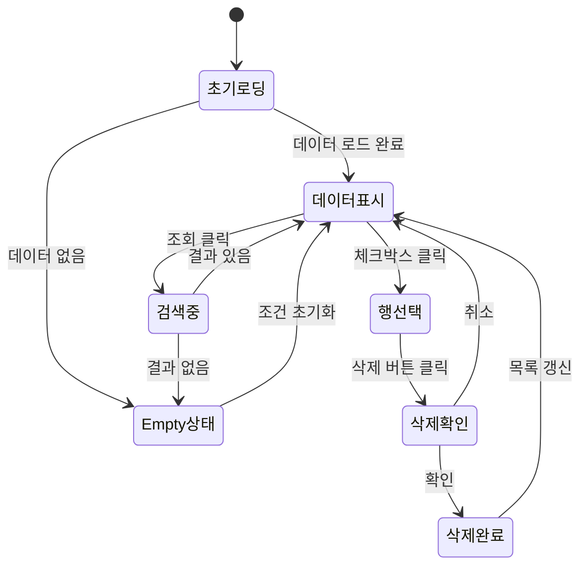

# TSK-06-17 - [샘플] 자재 입출고 내역 UI 설계 문서

## 문서 정보

| 항목 | 내용 |
|------|------|
| Task ID | TSK-06-17 |
| 문서 버전 | 1.0 |
| 작성일 | 2026-01-22 |
| 상태 | 작성완료 |
| 설계 문서 참조 | `010-design.md` |

---

## 1. 화면 목록

| 화면 ID | 화면명 | 목적 | SVG 참조 |
|---------|--------|------|----------|
| SCR-01 | 자재 입출고 내역 | 입출고 내역 조회, 검색, 일괄 처리 | `screen-01-material-history.svg` |
| SCR-02 | 자재 입출고 내역 (삭제 확인) | 삭제 확인 다이얼로그 | `screen-02-delete-confirm.svg` |
| SCR-03 | 자재 입출고 내역 (Empty) | 검색 결과 없음 상태 | `screen-03-empty-state.svg` |

---

## 2. 화면 전환 흐름

### 2.1 상태 다이어그램



### 2.2 액션-화면 매트릭스

| 현재 상태 | 액션 | 결과 상태 |
|----------|------|----------|
| 초기 로딩 | 데이터 로드 완료 | 데이터 표시 |
| 데이터 표시 | 조회 클릭 | 검색 중 → 데이터 표시 or Empty |
| 데이터 표시 | 체크박스 클릭 | 행 선택 |
| 행 선택 | 삭제 클릭 | 삭제 확인 다이얼로그 |
| 삭제 확인 | 확인 클릭 | 삭제 완료 → 데이터 표시 |
| 삭제 확인 | 취소 클릭 | 데이터 표시 (상태 유지) |
| Empty 상태 | 조건 초기화 | 데이터 표시 |

---

## 3. 화면별 상세

### 3.1 SCR-01: 자재 입출고 내역

**화면 목적:**
자재의 입출고 내역을 조회하고 관리하는 메인 화면

**레이아웃:**

```
┌─────────────────────────────────────────────────────────────────────────┐
│                          검색 조건 카드                                   │
│  ┌────────────────┬────────────────┬──────────────────────────────────┐ │
│  │     자재명     │   입출고유형   │              기간                │ │
│  │ [입력란_____]  │ [전체    ▼]   │ [2026-01-01] ~ [2026-01-22]     │ │
│  └────────────────┴────────────────┴──────────────────────────────────┘ │
│                                              [초기화]  [조회]            │
├─────────────────────────────────────────────────────────────────────────┤
│  총 30건  |  선택: 0건                         [삭제]  [내보내기]        │
├─────────────────────────────────────────────────────────────────────────┤
│  ☐ │ 자재명    │ 자재코드 │ 유형 │ 수량 │ 단위 │ 일자       │ 담당자  │ │
│  ───────────────────────────────────────────────────────────────────── │
│  ☐ │ 원자재A   │ MAT-001  │ 입고 │ 100 │ EA  │ 2026-01-20 │ 김자재  │ │
│  ☐ │ 원자재B   │ MAT-002  │ 출고 │  50 │ KG  │ 2026-01-19 │ 이생산  │ │
│  ☐ │ 부자재C   │ MAT-003  │ 입고 │ 200 │ M   │ 2026-01-18 │ 김자재  │ │
│  ...                                                                   │
├─────────────────────────────────────────────────────────────────────────┤
│                      < 1 2 3 >   10건/페이지 ▼                          │
└─────────────────────────────────────────────────────────────────────────┘
```

**컴포넌트 구성:**

| 영역 | 컴포넌트 | Ant Design | Props/설정 |
|------|----------|-----------|------------|
| 검색 카드 | Card | Card | size="small" |
| 자재명 입력 | Input | Form.Item + Input | placeholder="자재명 검색..." |
| 입출고유형 | Select | Form.Item + Select | options: 전체/입고/출고 |
| 기간 | RangePicker | Form.Item + DatePicker.RangePicker | format="YYYY-MM-DD" |
| 조회 버튼 | Button | Button | type="primary" |
| 초기화 버튼 | Button | Button | - |
| 툴바 | Toolbar | Custom | total, selectedCount |
| 삭제 버튼 | Button | Button | danger, disabled={selectedCount===0} |
| 내보내기 버튼 | Button | Button | - |
| 테이블 | DataTable | Table | resizable, pagination |
| 페이지네이션 | Pagination | Table.pagination | showSizeChanger, showTotal |

**상태 관리:**

| 상태 | 타입 | 초기값 | 변경 시점 |
|------|------|--------|----------|
| searchParams | object | {} | 검색 조건 변경 |
| data | MaterialHistory[] | [] | 데이터 로드 |
| loading | boolean | false | API 호출 중 |
| selectedRowKeys | Key[] | [] | 체크박스 선택 |
| selectedRows | MaterialHistory[] | [] | 체크박스 선택 |

**인터랙션:**

| 액션 | 트리거 | 결과 |
|------|--------|------|
| 검색 | 조회 버튼 클릭 / Enter | 데이터 필터링, 선택 초기화 |
| 초기화 | 초기화 버튼 클릭 | 검색 조건 초기화, 전체 조회 |
| 행 선택 | 체크박스 클릭 | selectedRowKeys 업데이트 |
| 전체 선택 | 헤더 체크박스 클릭 | 전체 행 선택/해제 |
| 정렬 | 컬럼 헤더 클릭 | 오름차순/내림차순 토글 |
| 리사이즈 | 컬럼 경계 드래그 | 컬럼 너비 변경 |
| 삭제 | 삭제 버튼 클릭 | 확인 다이얼로그 표시 |
| 내보내기 | 내보내기 버튼 클릭 | CSV/Excel 다운로드 |

---

### 3.2 SCR-02: 삭제 확인 다이얼로그

**화면 목적:**
삭제 전 사용자 확인을 받는 모달 다이얼로그

**레이아웃:**

```
┌────────────────────────────────────────────┐
│  ⚠️ 삭제 확인                        [X]  │
├────────────────────────────────────────────┤
│                                            │
│    3건의 항목을 삭제하시겠습니까?          │
│                                            │
│    삭제된 데이터는 복구할 수 없습니다.     │
│                                            │
├────────────────────────────────────────────┤
│                    [취소]  [삭제]          │
└────────────────────────────────────────────┘
```

**컴포넌트 구성:**

| 영역 | 컴포넌트 | Ant Design | Props/설정 |
|------|----------|-----------|------------|
| 모달 | Modal | Modal | open, onOk, onCancel |
| 아이콘 | Icon | ExclamationCircleFilled | color: warning |
| 삭제 버튼 | Button | Modal.okButtonProps | danger |

---

### 3.3 SCR-03: Empty State

**화면 목적:**
검색 결과가 없을 때 표시하는 빈 상태 화면

**레이아웃:**

```
┌─────────────────────────────────────────────────────────────────────────┐
│                          검색 조건 카드                                   │
│  (검색 조건 유지)                                                         │
├─────────────────────────────────────────────────────────────────────────┤
│                                                                          │
│                          📋                                              │
│                                                                          │
│                    검색 결과가 없습니다                                   │
│                                                                          │
│                     [조건 초기화]                                         │
│                                                                          │
└─────────────────────────────────────────────────────────────────────────┘
```

**컴포넌트 구성:**

| 영역 | 컴포넌트 | Ant Design | Props/설정 |
|------|----------|-----------|------------|
| Empty | Empty | Empty | description="검색 결과가 없습니다" |
| 초기화 버튼 | Button | Button | type="primary" |

---

## 4. 공통 컴포넌트

### 4.1 토스트 알림

| 상황 | 유형 | 메시지 |
|------|------|--------|
| 삭제 성공 | success | "삭제되었습니다" |
| 삭제 실패 | error | "삭제에 실패했습니다" |
| 내보내기 성공 | success | "내보내기가 완료되었습니다" |
| 내보내기 실패 | error | "내보내기에 실패했습니다" |

### 4.2 로딩 상태

| 상황 | 표시 |
|------|------|
| 초기 로딩 | 테이블 영역 스피너 |
| 검색 중 | 조회 버튼 로딩 + 테이블 오버레이 |
| 삭제 중 | 확인 버튼 로딩 |
| 내보내기 중 | 내보내기 버튼 로딩 |

---

## 5. 반응형 설계

### 5.1 Breakpoint 정의

| Breakpoint | 너비 | 검색 조건 | 테이블 |
|------------|------|----------|--------|
| Desktop | 1024px+ | 한 줄 (8-8-8) | 전체 컬럼 |
| Tablet | 768-1023px | 두 줄 (12-12) | 일부 컬럼 숨김 |
| Mobile | 767px- | 수직 배치 (24) | 수평 스크롤 |

### 5.2 컬럼 가시성

| 컬럼 | Desktop | Tablet | Mobile |
|------|---------|--------|--------|
| 자재명 | ✓ | ✓ | ✓ |
| 자재코드 | ✓ | ✓ | - |
| 입출고유형 | ✓ | ✓ | ✓ |
| 수량 | ✓ | ✓ | ✓ |
| 단위 | ✓ | ✓ | - |
| 일자 | ✓ | ✓ | ✓ |
| 담당자 | ✓ | - | - |
| 비고 | ✓ | - | - |

---

## 6. 접근성

### 6.1 키보드 네비게이션

| 키 | 동작 |
|-----|------|
| Tab | 폼 필드 간 이동 |
| Enter | 검색 실행 (폼 포커스 시) |
| Space | 체크박스 토글 (포커스 시) |
| Escape | 모달 닫기 |

### 6.2 ARIA 레이블

| 요소 | aria-label |
|------|-----------|
| 검색 카드 | "검색 조건" |
| 조회 버튼 | "조회" |
| 삭제 버튼 | "선택 항목 삭제" |
| 테이블 | "자재 입출고 내역 목록" |

### 6.3 색상 대비

| 요소 | 전경색 | 배경색 | 대비율 |
|------|--------|--------|--------|
| 텍스트 | #000000 | #FFFFFF | 21:1 |
| 입고 태그 | #52C41A | #F6FFED | 4.5:1+ |
| 출고 태그 | #1890FF | #E6F7FF | 4.5:1+ |

---

## 7. SVG 파일 목록

| 파일명 | 화면 | 상태 |
|--------|------|------|
| `screen-01-material-history.svg` | 자재 입출고 내역 | 기본 (데이터 있음) |
| `screen-02-delete-confirm.svg` | 삭제 확인 다이얼로그 | 삭제 확인 중 |
| `screen-03-empty-state.svg` | Empty State | 검색 결과 없음 |

---

## 변경 이력

| 버전 | 일자 | 작성자 | 변경 내용 |
|------|------|--------|----------|
| 1.0 | 2026-01-22 | Claude | 최초 작성 |
