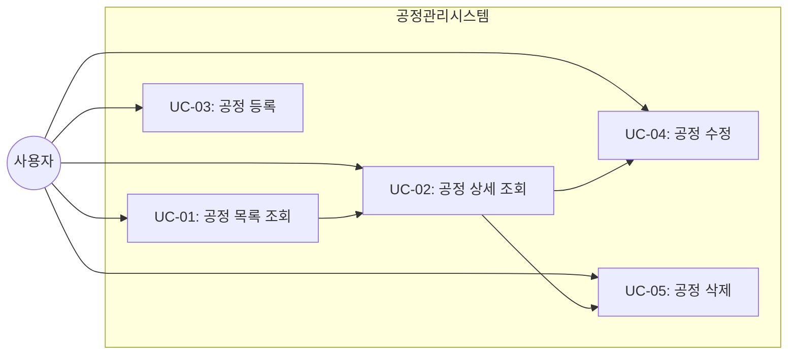
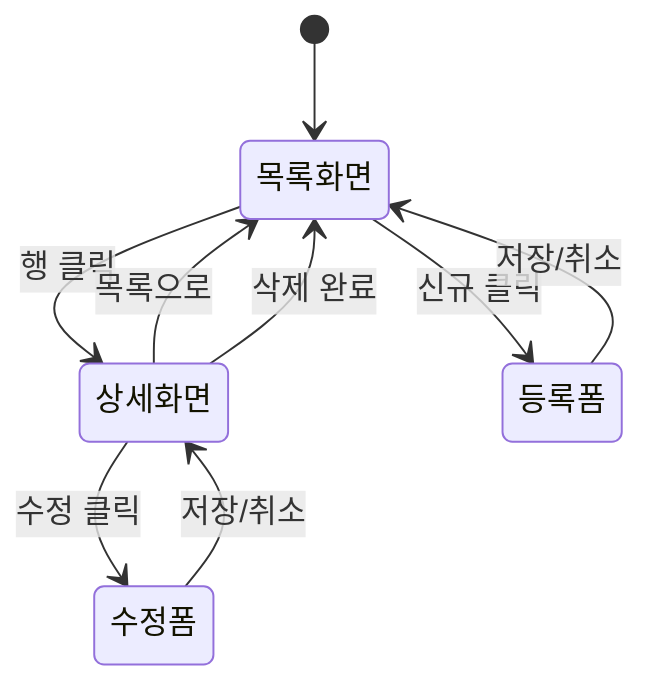
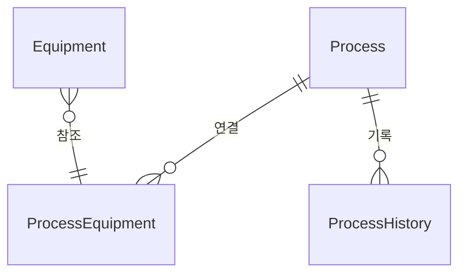

# TSK-06-18 - [샘플] 공정 관리 설계 문서

## 문서 정보

| 항목 | 내용 |
|------|------|
| Task ID | TSK-06-18 |
| 문서 버전 | 1.0 |
| 작성일 | 2026-01-22 |
| 상태 | 작성중 |
| 카테고리 | development |

---

## 1. 개요

### 1.1 배경 및 문제 정의

MES 포털 시스템에서 공정(Process)은 제조 현장의 핵심 마스터 데이터입니다. 공정 정보를 효과적으로 관리하기 위해 CRUD(생성/조회/수정/삭제) 기능이 통합된 샘플 화면이 필요합니다.

**현재 상황:**
- 개별 템플릿(ListTemplate, DetailTemplate, FormTemplate)은 구현되어 있음
- 이 템플릿들을 조합한 종합적인 CRUD 화면 샘플이 부재
- 상태 관리 패턴(Loading/Empty/Error)의 통합 적용 예시가 없음

**해결하려는 문제:**
- 템플릿 조합 방법의 표준 제시
- 화면 모드 전환(목록 → 상세 → 폼) 패턴 검증
- 상태별 UI 처리 패턴 통합 검증

### 1.2 목적 및 기대 효과

**목적:**
- ListTemplate, DetailTemplate, FormTemplate을 조합한 완전한 CRUD 화면 구현
- 공정 관리라는 실제 MES 도메인 시나리오 제공
- 상태별 UI(Loading/Empty/Error) 처리 패턴 통합 검증

**기대 효과:**
- 개발자가 새로운 CRUD 화면 구현 시 참조 가능한 표준 코드 제공
- 템플릿 조합 패턴의 검증 및 문서화
- 재사용 가능한 CRUD 화면 구현 패턴 확립

### 1.3 범위

**포함:**
- 공정 목록 조회 (Table)
- 공정 상세 보기 (Descriptions + Tabs)
- 공정 등록/수정 폼 (신규/수정 모드 전환)
- 공정 삭제 (확인 후 삭제)
- 상태별 Empty/Loading/Error 처리

**제외:**
- 실제 백엔드 API 연동 (mock-data 사용)
- 공정별 설비 연결 실제 기능 (탭 내 목록만 표시)
- 공정 이력 실제 데이터 (mock 데이터로 대체)

### 1.4 참조 문서

| 문서 | 경로 | 관련 섹션 |
|------|------|----------|
| PRD | `.orchay/projects/mes-portal/prd.md` | 4.1.1 CRUD 샘플 |
| TRD | `.orchay/projects/mes-portal/trd.md` | 4. AI 코딩 가이드라인 |

---

## 2. 사용자 분석

### 2.1 대상 사용자

| 사용자 유형 | 특성 | 주요 니즈 |
|------------|------|----------|
| 공장장/관리자 | 전체 공정 현황 파악 | 공정 목록 조회, 검색, 필터링 |
| 생산 담당자 | 공정별 상세 정보 확인 | 공정 상세 조회, 설비 연결 확인 |
| 시스템 관리자 | 공정 마스터 데이터 관리 | 공정 등록/수정/삭제 |

### 2.2 사용자 페르소나

**페르소나 1: 생산관리 박대리**
- 역할: 생산 담당자
- 목표: 공정별 상세 정보 신속하게 확인
- 불만: 여러 화면을 이동하며 정보 확인이 번거로움
- 시나리오: 목록에서 클릭 한 번으로 상세 정보 확인

**페르소나 2: 시스템 관리자 김과장**
- 역할: 마스터 데이터 관리자
- 목표: 공정 정보 효율적으로 관리
- 불만: 등록/수정 시 여러 단계 거쳐야 함
- 시나리오: 동일 화면에서 조회/수정/등록 전환

---

## 3. 유즈케이스

### 3.1 유즈케이스 다이어그램



### 3.2 유즈케이스 상세

#### UC-01: 공정 목록 조회

| 항목 | 내용 |
|------|------|
| 액터 | 모든 사용자 |
| 목적 | 공정 목록을 조회하고 필요한 공정을 찾는다 |
| 사전 조건 | 로그인 완료 |
| 사후 조건 | 공정 목록이 화면에 표시된다 |
| 트리거 | 공정 관리 메뉴 클릭 |

**기본 흐름:**
1. 사용자가 공정 관리 메뉴를 클릭한다
2. 시스템이 공정 목록 화면을 표시한다
3. 사용자가 검색 조건을 입력하고 검색 버튼을 클릭한다
4. 시스템이 필터링된 공정 목록을 표시한다
5. 사용자가 정렬 또는 페이지 이동을 수행할 수 있다

**대안 흐름:**
- 3a. 검색 결과가 없으면:
  - 시스템이 Empty State를 표시한다
  - 검색 조건 초기화 버튼을 제공한다

**예외 흐름:**
- 2a. 데이터 로딩 실패 시:
  - 시스템이 에러 메시지를 표시한다
  - 재시도 버튼을 제공한다

#### UC-02: 공정 상세 조회

| 항목 | 내용 |
|------|------|
| 액터 | 모든 사용자 |
| 목적 | 특정 공정의 상세 정보를 확인한다 |
| 사전 조건 | 공정 목록이 표시된 상태 |
| 사후 조건 | 공정 상세 정보가 표시된다 |
| 트리거 | 목록에서 공정 행 클릭 |

**기본 흐름:**
1. 사용자가 목록에서 공정 행을 클릭한다
2. 시스템이 상세 보기 모드로 전환한다
3. 시스템이 기본 정보, 설비 연결, 이력 탭을 표시한다
4. 사용자가 탭을 전환하며 정보를 확인한다

**대안 흐름:**
- 3a. 설비 연결이 없으면:
  - 해당 탭에 Empty State 표시

#### UC-03: 공정 등록

| 항목 | 내용 |
|------|------|
| 액터 | 시스템 관리자 |
| 목적 | 새로운 공정을 등록한다 |
| 사전 조건 | 등록 권한 보유 |
| 사후 조건 | 새 공정이 목록에 추가된다 |
| 트리거 | 신규 버튼 클릭 |

**기본 흐름:**
1. 사용자가 신규 버튼을 클릭한다
2. 시스템이 빈 폼 화면을 표시한다
3. 사용자가 공정 정보를 입력한다
4. 사용자가 저장 버튼을 클릭한다
5. 시스템이 유효성 검사를 수행한다
6. 시스템이 공정을 저장하고 성공 메시지를 표시한다
7. 시스템이 목록 화면으로 돌아간다

**예외 흐름:**
- 5a. 유효성 검사 실패 시:
  - 시스템이 에러 필드를 표시한다
  - 사용자가 수정 후 재시도한다

#### UC-04: 공정 수정

| 항목 | 내용 |
|------|------|
| 액터 | 시스템 관리자 |
| 목적 | 기존 공정 정보를 수정한다 |
| 사전 조건 | 수정 권한 보유, 공정 상세 보기 상태 |
| 사후 조건 | 공정 정보가 업데이트된다 |
| 트리거 | 수정 버튼 클릭 |

**기본 흐름:**
1. 사용자가 상세 화면에서 수정 버튼을 클릭한다
2. 시스템이 기존 값이 채워진 폼 화면을 표시한다
3. 사용자가 정보를 수정한다
4. 사용자가 저장 버튼을 클릭한다
5. 시스템이 유효성 검사를 수행한다
6. 시스템이 변경 사항을 저장하고 성공 메시지를 표시한다
7. 시스템이 상세 화면으로 돌아간다

#### UC-05: 공정 삭제

| 항목 | 내용 |
|------|------|
| 액터 | 시스템 관리자 |
| 목적 | 공정을 삭제한다 |
| 사전 조건 | 삭제 권한 보유, 공정 상세 보기 상태 |
| 사후 조건 | 공정이 목록에서 제거된다 |
| 트리거 | 삭제 버튼 클릭 |

**기본 흐름:**
1. 사용자가 상세 화면에서 삭제 버튼을 클릭한다
2. 시스템이 삭제 확인 다이얼로그를 표시한다
3. 사용자가 확인 버튼을 클릭한다
4. 시스템이 공정을 삭제하고 성공 메시지를 표시한다
5. 시스템이 목록 화면으로 돌아간다

**대안 흐름:**
- 3a. 사용자가 취소 버튼을 클릭하면:
  - 다이얼로그가 닫히고 상세 화면으로 복귀

---

## 4. 사용자 시나리오

### 4.1 시나리오 1: 공정 검색 및 상세 확인

**상황 설명:**
생산관리 박대리가 "도장 공정"의 연결된 설비를 확인하려 한다.

**단계별 진행:**

| 단계 | 사용자 행동 | 시스템 반응 | 사용자 기대 |
|------|-----------|------------|------------|
| 1 | 공정 관리 메뉴 클릭 | 공정 목록 화면 표시 | 목록이 빠르게 로딩 |
| 2 | 공정명 검색창에 "도장" 입력 | 실시간 필터링 | 관련 공정만 표시 |
| 3 | "도장" 공정 행 클릭 | 상세 화면으로 전환 | 상세 정보 표시 |
| 4 | "설비 연결" 탭 클릭 | 연결된 설비 목록 표시 | 설비 정보 확인 |

**성공 조건:**
- 검색에서 상세 확인까지 3클릭 이내
- 탭 전환 시 데이터 즉시 표시

### 4.2 시나리오 2: 공정 등록

**상황 설명:**
시스템 관리자 김과장이 새로운 "검사" 공정을 등록한다.

**단계별 진행:**

| 단계 | 사용자 행동 | 시스템 반응 | 사용자 기대 |
|------|-----------|------------|------------|
| 1 | 신규 버튼 클릭 | 빈 폼 화면 표시 | 입력 폼 표시 |
| 2 | 공정코드 "INS001" 입력 | - | 입력 반영 |
| 3 | 공정명 "검사" 입력 | - | 입력 반영 |
| 4 | 상태 "활성" 선택 | - | 선택 반영 |
| 5 | 저장 버튼 클릭 | 유효성 검사 후 저장 | 성공 메시지 |
| 6 | - | 목록 화면으로 복귀 | 신규 공정 목록에 표시 |

**성공 조건:**
- 저장 후 목록에서 새 공정 확인 가능
- 성공 Toast 메시지 표시

### 4.3 시나리오 3: 에러 상황 - 네트워크 오류

**상황 설명:**
데이터 로딩 중 네트워크 오류가 발생한 상황

**단계별 진행:**

| 단계 | 사용자 행동 | 시스템 반응 | 복구 방법 |
|------|-----------|------------|----------|
| 1 | 공정 관리 진입 | 로딩 스피너 표시 | - |
| 2 | - | 에러 발생 | Error 컴포넌트 표시 |
| 3 | 재시도 버튼 클릭 | 재로딩 시도 | 정상 복구 |

---

## 5. 화면 설계

### 5.1 화면 흐름도



### 5.2 화면별 상세

#### 화면 1: 공정 목록 (ProcessList)

**화면 목적:**
공정 목록을 조회하고 검색, 정렬, 필터링을 수행하는 메인 화면

**진입 경로:**
- 사이드바 메뉴 > 샘플 > 공정 관리

**와이어프레임:**
```
┌─────────────────────────────────────────────────────────────┐
│  ┌─────────────────────────────────────────────────────┐   │
│  │ 검색 조건                                            │   │
│  │ ┌──────────────┬──────────────┬──────────────┐      │   │
│  │ │ 공정코드    │ 공정명      │ 상태        │      │   │
│  │ │ [________ ] │ [________ ] │ [전체   v ] │      │   │
│  │ └──────────────┴──────────────┴──────────────┘      │   │
│  │                              [초기화] [검색]         │   │
│  └─────────────────────────────────────────────────────┘   │
│                                                             │
│  ┌─────────────────────────────────────────────────────┐   │
│  │ [신규] [삭제]                        총 15건         │   │
│  ├─────────────────────────────────────────────────────┤   │
│  │ □ │ 공정코드 │ 공정명   │ 상태   │ 설비수 │ 생성일  │   │
│  ├───┼──────────┼──────────┼────────┼────────┼─────────┤   │
│  │ □ │ PRC001   │ 조립     │ 활성   │ 5      │ 2026-01 │   │
│  │ □ │ PRC002   │ 도장     │ 활성   │ 3      │ 2026-01 │   │
│  │ □ │ PRC003   │ 검사     │ 비활성 │ 2      │ 2026-01 │   │
│  └─────────────────────────────────────────────────────┘   │
│                    < 1 2 3 ... 10 >                         │
└─────────────────────────────────────────────────────────────┘
```

**화면 요소 설명:**

| 영역 | 설명 | 사용자 인터랙션 |
|------|------|----------------|
| 검색 조건 | 공정 필터링 조건 | 입력 후 검색 버튼 클릭 |
| 툴바 | 신규/삭제 버튼, 총 건수 | 신규: 등록 폼 이동, 삭제: 선택 항목 삭제 |
| 테이블 | 공정 목록 | 행 클릭: 상세 이동, 체크박스: 삭제 대상 선택 |
| 페이지네이션 | 페이지 이동 | 페이지 번호 클릭 |

#### 화면 2: 공정 상세 (ProcessDetail)

**화면 목적:**
선택한 공정의 상세 정보 확인 및 수정/삭제 진입점

**와이어프레임:**
```
┌─────────────────────────────────────────────────────────────┐
│  ┌─────────────────────────────────────────────────────┐   │
│  │ 공정 상세                             [수정] [삭제] │   │
│  └─────────────────────────────────────────────────────┘   │
│                                                             │
│  ┌─────────────────────────────────────────────────────┐   │
│  │ 기본 정보                                            │   │
│  │ ┌────────────┬────────────┬────────────┬──────────┐ │   │
│  │ │ 공정코드   │ PRC001     │ 공정명     │ 조립     │ │   │
│  │ ├────────────┼────────────┼────────────┼──────────┤ │   │
│  │ │ 상태       │ 활성       │ 순서       │ 1        │ │   │
│  │ ├────────────┼────────────┼────────────┼──────────┤ │   │
│  │ │ 생성일     │ 2026-01-01 │ 수정일     │ 2026-01-20│ │   │
│  │ └────────────┴────────────┴────────────┴──────────┘ │   │
│  └─────────────────────────────────────────────────────┘   │
│                                                             │
│  ┌─────────────────────────────────────────────────────┐   │
│  │ [기본정보] [설비연결] [이력]                         │   │
│  ├─────────────────────────────────────────────────────┤   │
│  │                                                     │   │
│  │           (탭 컨텐츠 영역)                          │   │
│  │                                                     │   │
│  └─────────────────────────────────────────────────────┘   │
│                                                             │
│                                        [목록으로]           │
└─────────────────────────────────────────────────────────────┘
```

**탭 구성:**

| 탭 | 내용 |
|---|------|
| 기본정보 | 공정 설명, 비고 등 추가 정보 |
| 설비연결 | 해당 공정에 연결된 설비 목록 (Table) |
| 이력 | 공정 변경 이력 (Timeline) |

#### 화면 3: 공정 등록/수정 (ProcessForm)

**화면 목적:**
신규 공정 등록 또는 기존 공정 수정

**와이어프레임:**
```
┌─────────────────────────────────────────────────────────────┐
│  ┌─────────────────────────────────────────────────────┐   │
│  │ 공정 등록 (또는 공정 수정)                           │   │
│  ├─────────────────────────────────────────────────────┤   │
│  │                                                     │   │
│  │  공정코드 *  [____________]                         │   │
│  │              영문/숫자 조합, 최대 20자              │   │
│  │                                                     │   │
│  │  공정명 *    [____________]                         │   │
│  │              한글/영문, 최대 50자                   │   │
│  │                                                     │   │
│  │  상태 *      ○ 활성  ○ 비활성                      │   │
│  │                                                     │   │
│  │  순서        [___] (숫자)                           │   │
│  │                                                     │   │
│  │  설명        [_________________________]            │   │
│  │              [_________________________]            │   │
│  │                                                     │   │
│  │                             [취소] [저장]           │   │
│  └─────────────────────────────────────────────────────┘   │
└─────────────────────────────────────────────────────────────┘
```

**폼 필드 정의:**

| 필드 | 타입 | 필수 | 유효성 규칙 |
|-----|------|-----|-----------|
| 공정코드 | text | Y | 영문/숫자, 1-20자 |
| 공정명 | text | Y | 1-50자 |
| 상태 | radio | Y | 활성/비활성 |
| 순서 | number | N | 1-999 |
| 설명 | textarea | N | 최대 500자 |

### 5.3 반응형 동작

| 화면 크기 | 레이아웃 변화 | 사용자 경험 |
|----------|--------------|------------|
| 데스크톱 (1024px+) | 검색 조건 3열, 테이블 전체 표시 | 전체 정보 한눈에 확인 |
| 태블릿 (768-1023px) | 검색 조건 2열, 일부 컬럼 숨김 | 주요 정보 표시 |
| 모바일 (767px-) | 검색 조건 1열, 카드형 목록 | 터치 최적화 |

---

## 6. 인터랙션 설계

### 6.1 사용자 액션과 피드백

| 사용자 액션 | 즉각 피드백 | 결과 피드백 | 에러 피드백 |
|------------|-----------|------------|------------|
| 검색 버튼 클릭 | 버튼 로딩 상태 | 필터링된 목록 | 에러 Toast |
| 행 클릭 | 행 하이라이트 | 상세 화면 전환 | - |
| 저장 버튼 클릭 | 버튼 로딩 상태 | 성공 Toast | 필드별 에러 |
| 삭제 확인 | 다이얼로그 표시 | 성공 Toast | 에러 메시지 |

### 6.2 상태별 화면 변화

| 상태 | 화면 표시 | 사용자 안내 |
|------|----------|------------|
| 초기 로딩 | 테이블 스켈레톤 | - |
| 데이터 없음 | Empty 컴포넌트 | "등록된 공정이 없습니다" |
| 검색 결과 없음 | Empty + 초기화 버튼 | "검색 결과가 없습니다" |
| 에러 발생 | Result (error) | "데이터를 불러올 수 없습니다" + 재시도 |
| 저장 성공 | 성공 Toast | "저장되었습니다" |

### 6.3 키보드/접근성

| 기능 | 키보드 단축키 | 스크린 리더 안내 |
|------|-------------|-----------------|
| 검색 | Enter (검색창에서) | "검색 버튼" |
| 저장 | Ctrl+S (폼에서) | "저장 버튼" |
| 취소/닫기 | Esc | "취소 버튼" |
| 테이블 탐색 | 화살표 키 | "공정 {이름} 행" |

---

## 7. 데이터 요구사항

### 7.1 필요한 데이터

| 데이터 | 설명 | 출처 | 용도 |
|--------|------|------|------|
| 공정 목록 | 전체 공정 데이터 | mock-data/processes.json | 목록 표시 |
| 공정 상세 | 개별 공정 상세 | mock-data/processes.json | 상세 표시 |
| 설비 연결 | 공정별 설비 목록 | mock-data/processes.json | 설비 탭 표시 |
| 이력 | 변경 이력 | mock-data/processes.json | 이력 탭 표시 |

### 7.2 데이터 관계



**관계 설명:**
- Process는 여러 Equipment와 연결될 수 있다 (N:M)
- Process는 여러 변경 이력을 가질 수 있다 (1:N)

### 7.3 데이터 유효성 규칙

| 데이터 필드 | 규칙 | 위반 시 메시지 |
|------------|------|---------------|
| 공정코드 | 필수, 1-20자, 영문숫자 | "공정코드는 영문/숫자 1-20자로 입력해주세요" |
| 공정명 | 필수, 1-50자 | "공정명은 1-50자로 입력해주세요" |
| 상태 | 필수 | "상태를 선택해주세요" |
| 순서 | 선택, 1-999 | "순서는 1-999 사이의 숫자로 입력해주세요" |
| 설명 | 선택, 최대 500자 | "설명은 500자 이내로 입력해주세요" |

### 7.4 Mock 데이터 구조

```typescript
// mock-data/processes.json 구조
interface Process {
  id: string
  code: string          // 공정코드
  name: string          // 공정명
  status: 'active' | 'inactive'
  order: number         // 순서
  description?: string  // 설명
  equipmentCount: number
  createdAt: string
  updatedAt: string
  equipment?: Equipment[]
  history?: History[]
}

interface Equipment {
  id: string
  code: string
  name: string
  status: 'running' | 'stopped' | 'error' | 'maintenance'
}

interface History {
  id: string
  action: 'create' | 'update' | 'delete'
  timestamp: string
  user: string
  changes?: string
}
```

---

## 8. 비즈니스 규칙

### 8.1 핵심 규칙

| 규칙 ID | 규칙 설명 | 적용 상황 | 예외 |
|---------|----------|----------|------|
| BR-01 | 삭제 시 확인 다이얼로그 필수 | 삭제 버튼 클릭 | 없음 |
| BR-02 | 저장 전 유효성 검사 필수 | 저장 버튼 클릭 | 없음 |
| BR-03 | 수정 모드에서 변경 감지 후 이탈 경고 | 페이지 이탈 시 | 변경 없을 때 |
| BR-04 | 공정코드 중복 불가 | 등록/수정 시 | 없음 |
| BR-05 | 비활성 공정은 목록에서 회색 표시 | 목록 표시 시 | 없음 |

### 8.2 규칙 상세 설명

**BR-01: 삭제 시 확인 다이얼로그 필수**

설명: 사용자 실수로 인한 데이터 손실 방지를 위해 삭제 전 반드시 확인 다이얼로그를 표시한다.

예시:
- 삭제 버튼 클릭: Modal.confirm 표시
- 확인 클릭: 삭제 진행
- 취소 클릭: 다이얼로그 닫기

**BR-02: 저장 전 유효성 검사 필수**

설명: 데이터 무결성 보장을 위해 폼 제출 전 모든 필수 필드와 형식을 검사한다.

예시:
- 필수 필드 누락: 해당 필드에 에러 메시지 표시
- 형식 오류: 규칙 위반 메시지 표시

**BR-03: 수정 모드에서 변경 감지 후 이탈 경고**

설명: 사용자가 변경 사항을 저장하지 않고 페이지를 이탈하려 할 때 경고 표시.

예시:
- 변경 후 취소 클릭: "저장하지 않은 내용이 있습니다" 확인 다이얼로그
- 변경 후 브라우저 닫기: beforeunload 이벤트 경고

---

## 9. 에러 처리

### 9.1 예상 에러 상황

| 상황 | 원인 | 사용자 메시지 | 복구 방법 |
|------|------|--------------|----------|
| 데이터 로딩 실패 | 네트워크/서버 오류 | "데이터를 불러올 수 없습니다" | 재시도 버튼 |
| 저장 실패 | 유효성 검사 실패 | 필드별 에러 메시지 | 필드 수정 |
| 삭제 실패 | 서버 오류 | "삭제에 실패했습니다" | 재시도 |
| 권한 없음 | 권한 부족 | "권한이 없습니다" | 관리자 문의 |
| 중복 코드 | 이미 존재 | "이미 사용 중인 공정코드입니다" | 코드 변경 |

### 9.2 에러 표시 방식

| 에러 유형 | 표시 위치 | 표시 방법 |
|----------|----------|----------|
| 필드 오류 | 해당 필드 하단 | Form.Item 에러 스타일 (빨간색) |
| 폼 전체 오류 | 폼 상단 | Alert 컴포넌트 |
| 페이지 오류 | 컨텐츠 영역 전체 | Result 컴포넌트 (error status) |
| 알림성 오류 | 화면 상단 | Toast 메시지 |

---

## 10. 연관 문서

> 상세 테스트 명세 및 요구사항 추적은 별도 문서에서 관리합니다.

| 문서 | 경로 | 용도 |
|------|------|------|
| 요구사항 추적 매트릭스 | `025-traceability-matrix.md` | PRD → 설계 → 테스트 양방향 추적 |
| 테스트 명세서 | `026-test-specification.md` | 단위/E2E/매뉴얼 테스트 상세 정의 |
| 화면 설계서 | `011-ui-design.md` | 상세 화면 설계 및 와이어프레임 |

---

## 11. 구현 범위

### 11.1 영향받는 영역

| 영역 | 변경 내용 | 영향도 |
|------|----------|--------|
| screens/sample/ProcessManagement/ | 신규 생성 | 높음 |
| mock-data/processes.json | 신규 생성 | 중간 |
| app/(portal)/sample/process-management | 라우트 추가 | 낮음 |

### 11.2 의존성

| 의존 항목 | 이유 | 상태 |
|----------|------|------|
| TSK-06-01 ListTemplate | 목록 화면 템플릿 | 완료 |
| TSK-06-02 DetailTemplate | 상세 화면 템플릿 | 완료 |
| TSK-06-03 FormTemplate | 입력 폼 템플릿 | 완료 |
| TSK-05-01 로딩/에러 컴포넌트 | 상태 처리 컴포넌트 | 완료 |

### 11.3 제약 사항

| 제약 | 설명 | 대응 방안 |
|------|------|----------|
| Mock 데이터 사용 | 실제 백엔드 없음 | JSON 파일 기반 데이터 처리 |
| 삭제 영구 반영 안됨 | 새로고침 시 복원 | MVP 범위에서 제외 |

---

## 12. 체크리스트

### 12.1 설계 완료 확인

- [x] 문제 정의 및 목적 명확화
- [x] 사용자 분석 완료
- [x] 유즈케이스 정의 완료
- [x] 사용자 시나리오 작성 완료
- [x] 화면 설계 완료 (와이어프레임)
- [x] 인터랙션 설계 완료
- [x] 데이터 요구사항 정의 완료
- [x] 비즈니스 규칙 정의 완료
- [x] 에러 처리 정의 완료

### 12.2 연관 문서 작성

- [ ] 요구사항 추적 매트릭스 작성 (→ `025-traceability-matrix.md`)
- [ ] 테스트 명세서 작성 (→ `026-test-specification.md`)
- [ ] 화면 설계서 작성 (→ `011-ui-design.md`)

### 12.3 구현 준비

- [x] 구현 우선순위 결정
- [x] 의존성 확인 완료
- [x] 제약 사항 검토 완료

---

## 변경 이력

| 버전 | 일자 | 작성자 | 변경 내용 |
|------|------|--------|----------|
| 1.0 | 2026-01-22 | Claude | 최초 작성 |
