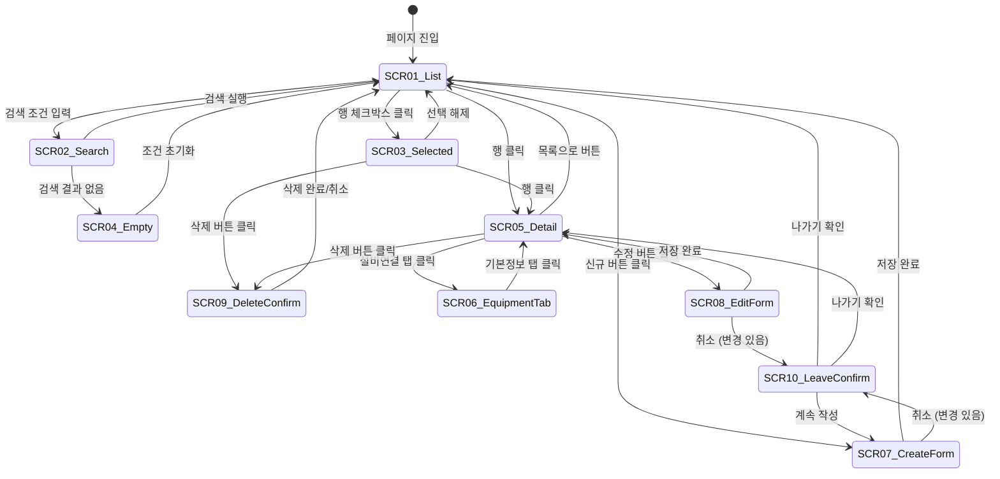

# TSK-06-18 - [샘플] 공정 관리 화면 UI 설계

## 문서 정보

| 항목 | 내용 |
|------|------|
| Task ID | TSK-06-18 |
| 문서 버전 | 1.0 |
| 작성일 | 2026-01-22 |
| 상태 | 작성중 |
| 카테고리 | development |
| Domain | frontend |

---

## 1. 화면 목록

| 화면 ID | 화면명 | 목적 | SVG 참조 |
|---------|--------|------|----------|
| SCR-01 | 공정 목록 (기본) | 전체 공정 목록 조회 | `ui-assets/screen-01-process-list-default.svg` |
| SCR-02 | 공정 목록 (검색) | 검색 조건 입력 상태 | `ui-assets/screen-02-process-list-search.svg` |
| SCR-03 | 공정 목록 (선택) | 행 선택 상태 | `ui-assets/screen-03-process-list-selected.svg` |
| SCR-04 | 공정 목록 (Empty) | 검색 결과 없음 | `ui-assets/screen-04-process-list-empty.svg` |
| SCR-05 | 공정 상세 | 공정 상세 정보 표시 | `ui-assets/screen-05-process-detail.svg` |
| SCR-06 | 공정 상세 (설비탭) | 연결된 설비 목록 | `ui-assets/screen-06-process-detail-equipment.svg` |
| SCR-07 | 공정 등록 폼 | 신규 공정 등록 | `ui-assets/screen-07-process-form-create.svg` |
| SCR-08 | 공정 수정 폼 | 기존 공정 수정 | `ui-assets/screen-08-process-form-edit.svg` |
| SCR-09 | 삭제 확인 다이얼로그 | 삭제 전 확인 | `ui-assets/screen-09-delete-confirm.svg` |
| SCR-10 | 이탈 확인 다이얼로그 | 저장하지 않고 이탈 시 확인 | `ui-assets/screen-10-leave-confirm.svg` |

---

## 2. 화면 전환 흐름

### 2.1 화면 전환 다이어그램



### 2.2 액션-화면 매트릭스

| 현재 화면 | 사용자 액션 | 결과 화면 |
|----------|-----------|----------|
| SCR-01 List | 검색 조건 입력 | SCR-02 Search |
| SCR-02 Search | 검색 버튼 클릭 | SCR-01 List (필터링) |
| SCR-02 Search | 초기화 버튼 클릭 | SCR-01 List |
| SCR-01/02 | 결과 0건 | SCR-04 Empty |
| SCR-04 Empty | 조건 초기화 클릭 | SCR-01 List |
| SCR-01 List | 체크박스 클릭 | SCR-03 Selected |
| SCR-03 Selected | 체크박스 해제 | SCR-01 List |
| SCR-03 Selected | 삭제 버튼 클릭 | SCR-09 Delete Confirm |
| SCR-09 Confirm | 확인 클릭 | SCR-01 List |
| SCR-09 Confirm | 취소 클릭 | 이전 화면 |
| SCR-01/03 | 행 클릭 | SCR-05 Detail |
| SCR-05 Detail | 목록으로 클릭 | SCR-01 List |
| SCR-05 Detail | 설비연결 탭 클릭 | SCR-06 Equipment Tab |
| SCR-05 Detail | 수정 버튼 클릭 | SCR-08 Edit Form |
| SCR-05 Detail | 삭제 버튼 클릭 | SCR-09 Delete Confirm |
| SCR-01 List | 신규 버튼 클릭 | SCR-07 Create Form |
| SCR-07 Create | 저장 클릭 | SCR-01 List |
| SCR-07 Create | 취소 클릭 (변경 있음) | SCR-10 Leave Confirm |
| SCR-08 Edit | 저장 클릭 | SCR-05 Detail |
| SCR-08 Edit | 취소 클릭 (변경 있음) | SCR-10 Leave Confirm |

---

## 3. 화면별 상세

### 3.1 SCR-01: 공정 목록 (기본)

**화면 목적:**
전체 공정 목록을 조회하는 기본 화면. ListTemplate을 사용한 표준 레이아웃.

**레이아웃:**
```
┌─────────────────────────────────────────────────────────────────────────────────┐
│  검색 조건 영역 (Card)                                                          │
│  ┌─────────────────────────────────────────────────────────────────────────────┐│
│  │  공정코드: [         ]  공정명: [         ]  상태: [전체     ▼]             ││
│  │                                                                             ││
│  │                                                    [초기화]  [🔍 검색]      ││
│  └─────────────────────────────────────────────────────────────────────────────┘│
│                                                                                 │
│  ┌─────────────────────────────────────────────────────────────────────────────┐│
│  │  [+ 신규] [🗑️ 삭제]                                    0건 선택됨 │ 총 15건 ││
│  │─────────────────────────────────────────────────────────────────────────────││
│  │  ☐ │ 공정코드 │ 공정명     │ 상태   │ 순서 │ 설비수 │ 생성일              ││
│  │────┼──────────┼────────────┼────────┼──────┼────────┼─────────────────────││
│  │  ☐ │ PRC001   │ 조립       │ 🟢활성 │ 1    │ 5      │ 2026-01-15          ││
│  │  ☐ │ PRC002   │ 도장       │ 🟢활성 │ 2    │ 3      │ 2026-01-14          ││
│  │  ☐ │ PRC003   │ 검사       │ 🔴비활 │ 3    │ 2      │ 2026-01-13          ││
│  │  ☐ │ PRC004   │ 포장       │ 🟢활성 │ 4    │ 4      │ 2026-01-12          ││
│  │  ☐ │ PRC005   │ 출하       │ 🟢활성 │ 5    │ 1      │ 2026-01-11          ││
│  │─────────────────────────────────────────────────────────────────────────────││
│  │  총 15건              │ [10 ▼] 건/페이지    [<] 1 2 3 [>]                   ││
│  └─────────────────────────────────────────────────────────────────────────────┘│
└─────────────────────────────────────────────────────────────────────────────────┘
```

**컴포넌트 목록:**

| 컴포넌트 | Ant Design | Props/설정 |
|----------|------------|-----------|
| 검색 Card | Card | bordered, bodyStyle |
| 공정코드 Input | Input | placeholder="공정코드 검색..." |
| 공정명 Input | Input | placeholder="공정명 검색..." |
| 상태 Select | Select | options: 전체/활성/비활성 |
| 초기화 버튼 | Button | type="default" |
| 검색 버튼 | Button | type="primary", icon=SearchOutlined |
| 신규 버튼 | Button | type="primary", icon=PlusOutlined |
| 삭제 버튼 | Button | type="primary", danger, disabled (선택 없을 때) |
| 테이블 | DataTable (TSK-05-04) | rowSelection, pagination |
| 상태 태그 | Tag | color: green/red |

**상태 관리:**

| 상태 | 타입 | 초기값 | 설명 |
|------|------|--------|------|
| processes | Process[] | [] | 전체 공정 목록 |
| filteredProcesses | Process[] | [] | 필터링된 목록 |
| selectedRowKeys | string[] | [] | 선택된 행 키 |
| loading | boolean | true | 로딩 상태 |
| searchParams | object | {} | 검색 조건 |
| viewMode | 'list' \| 'detail' \| 'form' | 'list' | 화면 모드 |
| formMode | 'create' \| 'edit' | null | 폼 모드 |
| selectedProcess | Process \| null | null | 선택된 공정 |

**액션:**

| 액션 | 트리거 | 결과 |
|------|--------|------|
| 검색 | 검색 버튼 클릭, Enter | 필터링된 목록 표시 |
| 초기화 | 초기화 버튼 클릭 | 검색 조건 리셋, 전체 목록 |
| 정렬 | 컬럼 헤더 클릭 | 정렬 적용 |
| 페이지 이동 | 페이지 번호 클릭 | 해당 페이지 표시 |
| 행 선택 | 체크박스 클릭 | selectedRowKeys 업데이트 |
| 행 클릭 | 테이블 행 클릭 | 상세 화면으로 전환 |
| 신규 | 신규 버튼 클릭 | 등록 폼으로 전환 |
| 삭제 | 삭제 버튼 클릭 | 삭제 확인 다이얼로그 표시 |

---

### 3.2 SCR-03: 공정 목록 (선택)

**화면 목적:**
사용자가 1개 이상의 행을 선택한 상태. 삭제 버튼 활성화, 선택 건수 표시.

**상태 변화:**
- 삭제 버튼: disabled → enabled
- 선택 건수: "0건 선택됨" → "N건 선택됨"
- 선택된 행: 배경색 하이라이트

**레이아웃 변화:**
```
│  [+ 신규] [🗑️ 삭제]                                    2건 선택됨 │ 총 15건 │
│─────────────────────────────────────────────────────────────────────────────│
│  ☑ │ PRC001   │ 조립       │ 🟢활성 │ 1    │ 5      │ 2026-01-15 │ ← 선택됨 |
│  ☑ │ PRC002   │ 도장       │ 🟢활성 │ 2    │ 3      │ 2026-01-14 │ ← 선택됨 |
│  ☐ │ PRC003   │ 검사       │ 🔴비활 │ 3    │ 2      │ 2026-01-13 │ (회색)
```

---

### 3.3 SCR-04: 공정 목록 (Empty)

**화면 목적:**
검색 결과가 없을 때 Empty State 표시.

**레이아웃:**
```
┌─────────────────────────────────────────────────────────────────────────────────┐
│  (검색 조건 영역 - 동일)                                                        │
│                                                                                 │
│  ┌─────────────────────────────────────────────────────────────────────────────┐│
│  │                                                                             ││
│  │                              📋                                             ││
│  │                                                                             ││
│  │                      검색 결과가 없습니다                                    ││
│  │              검색 조건을 변경하거나 필터를 초기화해보세요                     ││
│  │                                                                             ││
│  │                        [조건 초기화]                                        ││
│  │                                                                             ││
│  └─────────────────────────────────────────────────────────────────────────────┘│
└─────────────────────────────────────────────────────────────────────────────────┘
```

**컴포넌트:**
- Empty: Ant Design Empty 컴포넌트
- 조건 초기화 버튼: Button, type="primary", onClick=handleReset

---

### 3.4 SCR-05: 공정 상세

**화면 목적:**
선택한 공정의 상세 정보 확인. DetailTemplate 사용.

**레이아웃:**
```
┌─────────────────────────────────────────────────────────────────────────────────┐
│  ┌─────────────────────────────────────────────────────────────────────────────┐│
│  │ 공정 상세: PRC001 - 조립                              [수정] [삭제]         ││
│  └─────────────────────────────────────────────────────────────────────────────┘│
│                                                                                 │
│  ┌─────────────────────────────────────────────────────────────────────────────┐│
│  │  기본 정보                                                                  ││
│  │  ┌────────────┬────────────┬────────────┬──────────┐                        ││
│  │  │ 공정코드   │ PRC001     │ 공정명     │ 조립     │                        ││
│  │  ├────────────┼────────────┼────────────┼──────────┤                        ││
│  │  │ 상태       │ 🟢 활성    │ 순서       │ 1        │                        ││
│  │  ├────────────┼────────────┼────────────┼──────────┤                        ││
│  │  │ 연결 설비  │ 5대        │ 생성일     │ 2026-01-15│                       ││
│  │  ├────────────┼────────────┼────────────┼──────────┤                        ││
│  │  │ 수정일     │ 2026-01-20 │            │          │                        ││
│  │  └────────────┴────────────┴────────────┴──────────┘                        ││
│  └─────────────────────────────────────────────────────────────────────────────┘│
│                                                                                 │
│  ┌─────────────────────────────────────────────────────────────────────────────┐│
│  │ [기본정보] [설비연결] [이력]                                                 ││
│  ├─────────────────────────────────────────────────────────────────────────────┤│
│  │                                                                             ││
│  │  설명:                                                                      ││
│  │  부품을 조립하는 핵심 공정입니다. 자동화 라인과 수동 라인이 혼합되어        ││
│  │  운영됩니다.                                                                ││
│  │                                                                             ││
│  └─────────────────────────────────────────────────────────────────────────────┘│
│                                                                                 │
│                                                           [목록으로]            │
└─────────────────────────────────────────────────────────────────────────────────┘
```

**컴포넌트:**

| 컴포넌트 | Ant Design | Props/설정 |
|----------|------------|-----------|
| 헤더 | - | 제목 + 액션 버튼 |
| 기본정보 | Descriptions | bordered, column=2 |
| 탭 | Tabs | items: 기본정보, 설비연결, 이력 |
| 수정 버튼 | Button | type="primary", icon=EditOutlined |
| 삭제 버튼 | Button | danger, icon=DeleteOutlined |
| 목록으로 버튼 | Button | type="default" |
| 상태 태그 | Tag | color: green/red |

---

### 3.5 SCR-06: 공정 상세 (설비연결 탭)

**화면 목적:**
해당 공정에 연결된 설비 목록 표시.

**레이아웃:**
```
│  ┌─────────────────────────────────────────────────────────────────────────────┐│
│  │ [기본정보] [설비연결 ✓] [이력]                                               ││
│  ├─────────────────────────────────────────────────────────────────────────────┤│
│  │                                                                             ││
│  │  연결된 설비 목록 (5건)                                                     ││
│  │  ┌──────────┬────────────┬────────────┬──────────────────┐                  ││
│  │  │ 설비코드 │ 설비명     │ 상태       │ 비고             │                  ││
│  │  ├──────────┼────────────┼────────────┼──────────────────┤                  ││
│  │  │ EQP001   │ 조립기 #1  │ 🟢 가동중  │ 자동화 라인      │                  ││
│  │  │ EQP002   │ 조립기 #2  │ 🟢 가동중  │ 자동화 라인      │                  ││
│  │  │ EQP003   │ 용접기 #1  │ 🟡 정지    │ 점검 예정        │                  ││
│  │  │ EQP004   │ 이송장치   │ 🟢 가동중  │ 컨베이어         │                  ││
│  │  │ EQP005   │ 검수대     │ 🔴 에러    │ 센서 교체 필요   │                  ││
│  │  └──────────┴────────────┴────────────┴──────────────────┘                  ││
│  │                                                                             ││
│  └─────────────────────────────────────────────────────────────────────────────┘│
```

**설비 상태 태그:**

| 상태 | 라벨 | 색상 |
|------|------|------|
| running | 가동중 | green |
| stopped | 정지 | orange |
| error | 에러 | red |
| maintenance | 점검중 | blue |

---

### 3.6 SCR-07: 공정 등록 폼

**화면 목적:**
신규 공정 등록 폼. FormTemplate 사용.

**레이아웃:**
```
┌─────────────────────────────────────────────────────────────────────────────────┐
│  ┌─────────────────────────────────────────────────────────────────────────────┐│
│  │ 공정 등록                                                                   ││
│  ├─────────────────────────────────────────────────────────────────────────────┤│
│  │                                                                             ││
│  │  공정코드 *                                                                 ││
│  │  [________________]                                                         ││
│  │  영문/숫자 조합, 최대 20자                                                  ││
│  │                                                                             ││
│  │  공정명 *                                                                   ││
│  │  [________________]                                                         ││
│  │  한글/영문, 최대 50자                                                       ││
│  │                                                                             ││
│  │  상태 *                                                                     ││
│  │  ● 활성  ○ 비활성                                                          ││
│  │                                                                             ││
│  │  순서                                                                       ││
│  │  [____] (숫자)                                                              ││
│  │                                                                             ││
│  │  설명                                                                       ││
│  │  [____________________________________]                                     ││
│  │  [____________________________________]                                     ││
│  │  최대 500자                                                                 ││
│  │                                                                             ││
│  │                                                [취소]  [저장]               ││
│  └─────────────────────────────────────────────────────────────────────────────┘│
└─────────────────────────────────────────────────────────────────────────────────┘
```

**폼 필드 상세:**

| 필드명 | 컴포넌트 | 필수 | 유효성 규칙 | data-testid |
|--------|----------|------|------------|-------------|
| 공정코드 | Input | Y | 영문/숫자, 1-20자, 중복 불가 | process-code-input |
| 공정명 | Input | Y | 1-50자 | process-name-input |
| 상태 | Radio.Group | Y | 활성/비활성 | process-status-radio |
| 순서 | InputNumber | N | 1-999 | process-order-input |
| 설명 | Input.TextArea | N | 최대 500자 | process-desc-input |

**버튼 상태:**

| 조건 | 취소 버튼 | 저장 버튼 |
|------|----------|----------|
| 초기 상태 | 활성 | 비활성 (필수 입력 전) |
| 필수 입력 완료 | 활성 | 활성 |
| 저장 중 | 비활성 | 로딩 |
| 유효성 오류 | 활성 | 활성 (클릭 시 오류 표시) |

---

### 3.7 SCR-08: 공정 수정 폼

**화면 목적:**
기존 공정 정보 수정 폼. 기존 값이 채워진 상태로 표시.

**레이아웃:**
```
┌─────────────────────────────────────────────────────────────────────────────────┐
│  ┌─────────────────────────────────────────────────────────────────────────────┐│
│  │ 공정 수정: PRC001 - 조립                                                    ││
│  ├─────────────────────────────────────────────────────────────────────────────┤│
│  │                                                                             ││
│  │  공정코드 *                                                                 ││
│  │  [PRC001__________] (읽기 전용)                                             ││
│  │  수정 불가                                                                  ││
│  │                                                                             ││
│  │  공정명 *                                                                   ││
│  │  [조립______________]                                                       ││
│  │                                                                             ││
│  │  상태 *                                                                     ││
│  │  ● 활성  ○ 비활성                                                          ││
│  │                                                                             ││
│  │  순서                                                                       ││
│  │  [1___]                                                                     ││
│  │                                                                             ││
│  │  설명                                                                       ││
│  │  [부품을 조립하는 핵심 공정입니다.___]                                      ││
│  │  [자동화 라인과 수동 라인이 혼합되어 운영됩니다.]                           ││
│  │                                                                             ││
│  │                                                [취소]  [저장]               ││
│  └─────────────────────────────────────────────────────────────────────────────┘│
└─────────────────────────────────────────────────────────────────────────────────┘
```

**수정 모드 특이사항:**
- 공정코드: 읽기 전용 (disabled)
- 변경 감지: 초기값과 비교하여 dirty 상태 관리
- 취소 시: 변경 있으면 확인 다이얼로그 표시

---

### 3.8 SCR-09: 삭제 확인 다이얼로그

**화면 목적:**
삭제 전 사용자에게 확인을 요청하는 다이얼로그.

**레이아웃:**
```
┌─────────────────────────────────────────────────────┐
│  ⚠️  삭제 확인                                      │
├─────────────────────────────────────────────────────┤
│                                                     │
│     선택한 2개의 공정을 삭제하시겠습니까?           │
│                                                     │
│     이 작업은 되돌릴 수 없습니다.                    │
│                                                     │
│                              [취소]  [삭제]         │
└─────────────────────────────────────────────────────┘
```

**컴포넌트:**
- Modal.confirm: Ant Design 확인 다이얼로그
- title: "삭제 확인"
- icon: ExclamationCircleOutlined
- content: deleteConfirmMessage props로 전달
- okText: "삭제"
- okType: "danger"
- cancelText: "취소"

---

### 3.9 SCR-10: 이탈 확인 다이얼로그

**화면 목적:**
저장하지 않은 변경 사항이 있을 때 페이지 이탈 확인.

**레이아웃:**
```
┌─────────────────────────────────────────────────────┐
│  ⚠️  저장되지 않은 변경 사항                         │
├─────────────────────────────────────────────────────┤
│                                                     │
│     저장하지 않은 내용이 있습니다.                   │
│     이 페이지를 나가시겠습니까?                      │
│                                                     │
│                         [계속 작성]  [나가기]       │
└─────────────────────────────────────────────────────┘
```

**컴포넌트:**
- Modal.confirm: Ant Design 확인 다이얼로그
- title: "저장되지 않은 변경 사항"
- icon: ExclamationCircleOutlined
- okText: "나가기"
- cancelText: "계속 작성"

---

## 4. 공통 컴포넌트

### 4.1 ProcessStatusTag (공정 상태 태그)

**용도:** 공정 상태를 색상별 태그로 표시

**Props:**
```typescript
interface ProcessStatusTagProps {
  status: 'active' | 'inactive';
}
```

**상태별 스타일:**

| 상태 | 라벨 | 색상 | Ant Design color |
|------|------|------|------------------|
| active | 활성 | 녹색 | success |
| inactive | 비활성 | 빨간색 | error |

### 4.2 EquipmentStatusTag (설비 상태 태그)

**용도:** 설비 상태를 색상별 태그로 표시

**Props:**
```typescript
interface EquipmentStatusTagProps {
  status: 'running' | 'stopped' | 'error' | 'maintenance';
}
```

**상태별 스타일:**

| 상태 | 라벨 | 색상 | Ant Design color |
|------|------|------|------------------|
| running | 가동중 | 녹색 | success |
| stopped | 정지 | 노란색 | warning |
| error | 에러 | 빨간색 | error |
| maintenance | 점검중 | 파란색 | processing |

---

## 5. 반응형 설계

### 5.1 Breakpoint 정의

| Breakpoint | 화면 너비 | 검색 조건 | 테이블 |
|------------|----------|----------|--------|
| XL | 1600px+ | 3열 | 전체 컬럼 |
| LG | 1200-1599px | 3열 | 전체 컬럼 |
| MD | 992-1199px | 2열 | 설명 컬럼 숨김 |
| SM | 768-991px | 2열 | 순서, 설비수, 생성일 숨김 |
| XS | 767px- | 1열 | 가로 스크롤 |

### 5.2 검색 조건 반응형

```typescript
const responsiveSpan = {
  xs: 24,  // 1열
  sm: 12,  // 2열
  md: 8,   // 3열
  lg: 8,   // 3열
  xl: 8,   // 3열
};
```

### 5.3 테이블 반응형

| 컬럼 | XL/LG | MD | SM | XS |
|------|-------|----|----|-----|
| 선택 | ✓ | ✓ | ✓ | ✓ |
| 공정코드 | ✓ | ✓ | ✓ | ✓ |
| 공정명 | ✓ | ✓ | ✓ | ✓ |
| 상태 | ✓ | ✓ | ✓ | ✓ |
| 순서 | ✓ | ✓ | - | ✓ (스크롤) |
| 설비수 | ✓ | ✓ | - | ✓ (스크롤) |
| 생성일 | ✓ | ✓ | - | ✓ (스크롤) |

---

## 6. 접근성

### 6.1 키보드 네비게이션

| 키 | 동작 | 컨텍스트 |
|----|------|---------|
| Tab | 다음 요소로 이동 | 전체 |
| Shift+Tab | 이전 요소로 이동 | 전체 |
| Enter | 검색 실행 | 검색 폼 |
| Enter | 버튼 클릭 | 버튼 포커스 |
| Space | 체크박스/라디오 토글 | 체크박스/라디오 포커스 |
| Escape | 모달/다이얼로그 닫기 | 모달 열림 상태 |
| Arrow Up/Down | 셀렉트 옵션 이동 | 셀렉트 열림 |

### 6.2 ARIA 레이블

| 요소 | aria-label |
|------|------------|
| 공정코드 검색 | "공정코드로 검색" |
| 공정명 검색 | "공정명으로 검색" |
| 상태 필터 | "상태로 필터링" |
| 검색 버튼 | "검색" |
| 초기화 버튼 | "검색 조건 초기화" |
| 신규 버튼 | "신규 공정 등록" |
| 삭제 버튼 | "선택한 항목 삭제" |
| 테이블 | "공정 목록" |
| 수정 버튼 | "공정 수정" |
| 목록으로 버튼 | "목록으로 돌아가기" |

### 6.3 색상 대비

- 텍스트/배경: WCAG AA 기준 충족 (4.5:1 이상)
- 상태 태그: 색상뿐 아니라 텍스트로도 상태 표시
- 선택된 행: 배경색 + 체크 아이콘으로 구분
- 비활성 공정: 회색 텍스트 + "비활성" 태그

---

## 7. data-testid 명세

### 7.1 목록 화면

| 요소 | data-testid |
|------|-------------|
| 페이지 컨테이너 | process-management-page |
| 검색 영역 | process-search-form |
| 공정코드 입력 | search-code-input |
| 공정명 입력 | search-name-input |
| 상태 선택 | search-status-select |
| 검색 버튼 | search-btn |
| 초기화 버튼 | reset-btn |
| 신규 버튼 | create-btn |
| 삭제 버튼 | delete-btn |
| 테이블 | process-table |
| 테이블 행 | process-row-{id} |
| Empty 상태 | process-list-empty |
| Empty 초기화 버튼 | empty-reset-btn |

### 7.2 상세 화면

| 요소 | data-testid |
|------|-------------|
| 상세 컨테이너 | process-detail-view |
| 기본정보 영역 | process-basic-info |
| 수정 버튼 | edit-btn |
| 삭제 버튼 | detail-delete-btn |
| 목록으로 버튼 | back-to-list-btn |
| 탭 컨테이너 | process-detail-tabs |
| 기본정보 탭 | tab-basic |
| 설비연결 탭 | tab-equipment |
| 이력 탭 | tab-history |
| 설비 테이블 | equipment-table |

### 7.3 폼 화면

| 요소 | data-testid |
|------|-------------|
| 폼 컨테이너 | process-form |
| 공정코드 입력 | process-code-input |
| 공정명 입력 | process-name-input |
| 상태 라디오 | process-status-radio |
| 순서 입력 | process-order-input |
| 설명 입력 | process-desc-input |
| 취소 버튼 | cancel-btn |
| 저장 버튼 | save-btn |

### 7.4 다이얼로그

| 요소 | data-testid |
|------|-------------|
| 삭제 확인 모달 | delete-confirm-modal |
| 삭제 확인 버튼 | confirm-delete-btn |
| 삭제 취소 버튼 | cancel-delete-btn |
| 이탈 확인 모달 | leave-confirm-modal |
| 나가기 버튼 | confirm-leave-btn |
| 계속 작성 버튼 | cancel-leave-btn |

---

## 8. SVG 파일 목록

| 파일명 | 화면 | 상태 |
|--------|------|------|
| `screen-01-process-list-default.svg` | 공정 목록 기본 | 생성됨 |
| `screen-02-process-list-search.svg` | 검색 조건 입력 | 생성됨 |
| `screen-03-process-list-selected.svg` | 행 선택 상태 | 생성됨 |
| `screen-04-process-list-empty.svg` | Empty State | 생성됨 |
| `screen-05-process-detail.svg` | 상세 화면 | 생성됨 |
| `screen-06-process-detail-equipment.svg` | 설비연결 탭 | 생성됨 |
| `screen-07-process-form-create.svg` | 등록 폼 | 생성됨 |
| `screen-08-process-form-edit.svg` | 수정 폼 | 생성됨 |
| `screen-09-delete-confirm.svg` | 삭제 확인 | 생성됨 |
| `screen-10-leave-confirm.svg` | 이탈 확인 | 생성됨 |

---

## 변경 이력

| 버전 | 일자 | 작성자 | 변경 내용 |
|------|------|--------|----------|
| 1.0 | 2026-01-22 | Claude | 최초 작성 |
