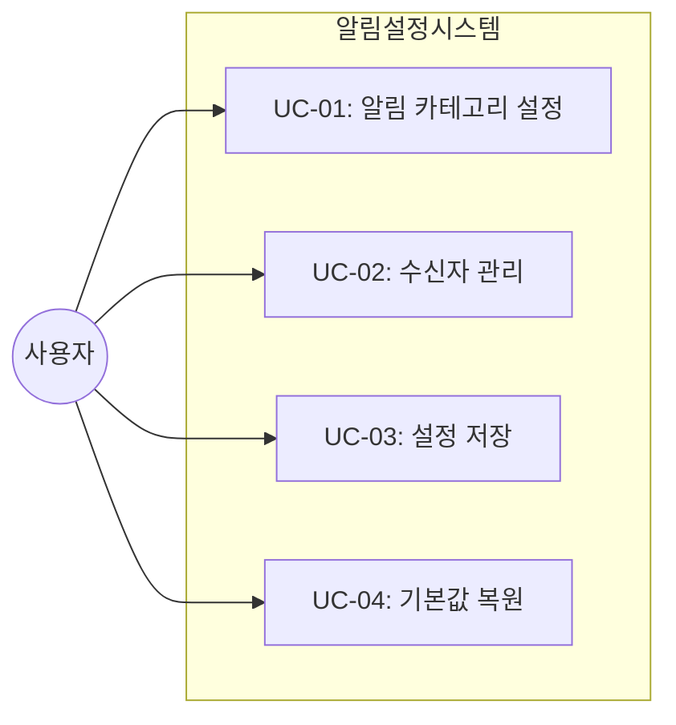
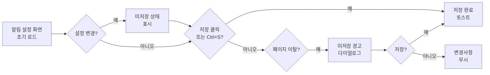
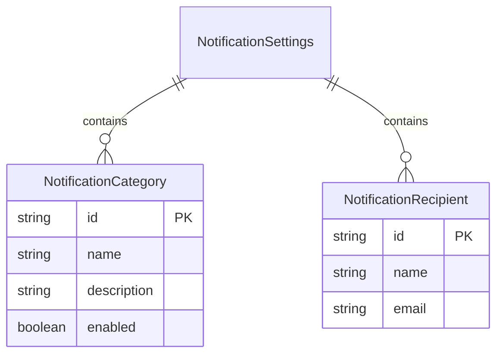

# TSK-06-19 - [샘플] 알림 설정 관리 설계 문서

## 문서 정보

| 항목 | 내용 |
|------|------|
| Task ID | TSK-06-19 |
| 문서 버전 | 1.0 |
| 작성일 | 2026-01-23 |
| 상태 | 작성중 |
| 카테고리 | development |

---

## 1. 개요

### 1.1 배경 및 문제 정의

**현재 상황:**
- MES 포털에서 다양한 알림(생산 경고, 품질 이슈, 설비 이상 등)이 발생
- 사용자마다 관심 있는 알림 유형과 수신 방식이 다름
- 현재 알림 설정을 관리하는 화면이 없음

**해결하려는 문제:**
- 사용자가 원하는 알림만 선택적으로 수신할 수 없음
- 알림 수신자를 유연하게 관리할 수 없음
- 설정 화면 템플릿의 표준 패턴이 필요함

### 1.2 목적 및 기대 효과

**목적:**
- 알림 설정 관리 샘플 화면을 통해 설정 화면 템플릿 패턴 검증
- Switch, 편집 가능한 테이블, 키보드 단축키 연동 기능 검증
- 미저장 경고 및 기본값 복원 기능 검증

**기대 효과:**
- 설정 화면 개발 시 참조할 수 있는 표준 패턴 제공
- FormTemplate과 키보드 단축키 시스템의 통합 검증
- 편집 가능한 테이블 패턴 검증

### 1.3 범위

**포함:**
- 알림 카테고리별 활성화/비활성화 Switch
- 알림 수신자 테이블 (추가/삭제)
- Ctrl+S 키보드 단축키로 저장
- 미저장 변경사항 경고 (beforeunload)
- 기본값 복원 기능

**제외:**
- 실제 알림 발송 로직 (Mock 데이터 사용)
- 수신자 이메일 검증 API
- 알림 템플릿 편집 기능

### 1.4 참조 문서

| 문서 | 경로 | 관련 섹션 |
|------|------|----------|
| PRD | `.orchay/projects/mes-portal/prd.md` | 4.1.1 설정 화면 샘플 |
| TRD | `.orchay/projects/mes-portal/trd.md` | 1.2 UI 스타일링, 7. PRD 요구사항 매핑 |
| WBS | `.orchay/projects/mes-portal/wbs.yaml` | TSK-06-19 |

---

## 2. 사용자 분석

### 2.1 대상 사용자

| 사용자 유형 | 특성 | 주요 니즈 |
|------------|------|----------|
| 공장장/관리자 | 전체 공장 관리, 중요 알림만 수신 원함 | 긴급 알림만 선택적 수신, 빠른 설정 변경 |
| 생산 담당자 | 담당 라인 관련 알림 필요 | 생산 관련 알림만 수신, 추가 수신자 지정 |
| 품질 담당자 | 품질 이슈 즉시 파악 필요 | 품질 관련 알림 우선, 이메일 수신자 관리 |

### 2.2 사용자 페르소나

**페르소나 1: 김생산 (생산팀장)**
- 역할: A라인 생산팀장
- 목표: 자신의 라인에 관련된 알림만 수신하고 싶음
- 불만: 모든 알림이 오면 중요한 것을 놓치기 쉬움
- 시나리오: 아침 출근 후 알림 설정에서 생산 관련만 켜고 나머지 끔

**페르소나 2: 이품질 (품질관리자)**
- 역할: 품질관리 담당
- 목표: 품질 이슈 발생 시 본인 외에 팀원들도 알림 수신
- 불만: 현재 수신자를 추가할 방법이 없음
- 시나리오: 품질 알림에 팀원 3명의 이메일 추가

---

## 3. 유즈케이스

### 3.1 유즈케이스 다이어그램



### 3.2 유즈케이스 상세

#### UC-01: 알림 카테고리 설정

| 항목 | 내용 |
|------|------|
| 액터 | 모든 로그인 사용자 |
| 목적 | 원하는 알림 카테고리만 활성화/비활성화 |
| 사전 조건 | 로그인 완료, 알림 설정 화면 접근 |
| 사후 조건 | 설정 변경 상태가 화면에 반영됨 (저장 전) |
| 트리거 | Switch 토글 클릭 |

**기본 흐름:**
1. 사용자가 알림 설정 화면에 진입한다
2. 시스템이 현재 저장된 알림 설정을 표시한다
3. 사용자가 특정 카테고리의 Switch를 토글한다
4. 시스템이 변경 상태를 표시한다 (미저장 상태)
5. 사용자가 저장 버튼을 클릭하거나 Ctrl+S를 누른다

**대안 흐름:**
- 3a. 사용자가 다른 페이지로 이동하려고 하면:
  - 시스템이 미저장 경고 다이얼로그를 표시한다
  - 사용자가 '저장 안 함' 선택 시 변경사항 무시하고 이동

#### UC-02: 수신자 관리

| 항목 | 내용 |
|------|------|
| 액터 | 관리자 권한 사용자 |
| 목적 | 알림 수신자 추가 또는 삭제 |
| 사전 조건 | 로그인 완료, 관리자 권한 |
| 사후 조건 | 수신자 목록이 업데이트됨 (저장 전) |
| 트리거 | 수신자 추가/삭제 버튼 클릭 |

**기본 흐름:**
1. 사용자가 수신자 테이블 영역을 확인한다
2. 사용자가 '수신자 추가' 버튼을 클릭한다
3. 시스템이 새 행을 테이블에 추가한다
4. 사용자가 이름과 이메일을 입력한다
5. 사용자가 저장 버튼을 클릭한다

**예외 흐름:**
- 4a. 이메일 형식이 올바르지 않으면:
  - 시스템이 필드 하단에 에러 메시지를 표시한다
  - 저장 시 유효성 검사 실패

#### UC-03: 설정 저장

| 항목 | 내용 |
|------|------|
| 액터 | 모든 로그인 사용자 |
| 목적 | 변경된 설정을 저장 |
| 사전 조건 | 설정 변경 상태 |
| 사후 조건 | 설정이 저장되고 성공 메시지 표시 |
| 트리거 | 저장 버튼 클릭 또는 Ctrl+S |

**기본 흐름:**
1. 사용자가 Ctrl+S를 누르거나 저장 버튼을 클릭한다
2. 시스템이 유효성 검사를 수행한다
3. 시스템이 설정을 저장한다 (Mock)
4. 시스템이 성공 토스트 메시지를 표시한다
5. 미저장 상태가 해제된다

#### UC-04: 기본값 복원

| 항목 | 내용 |
|------|------|
| 액터 | 모든 로그인 사용자 |
| 목적 | 모든 설정을 기본값으로 초기화 |
| 사전 조건 | 알림 설정 화면 접근 |
| 사후 조건 | 모든 설정이 기본값으로 복원됨 |
| 트리거 | '기본값 복원' 버튼 클릭 |

**기본 흐름:**
1. 사용자가 '기본값 복원' 버튼을 클릭한다
2. 시스템이 확인 다이얼로그를 표시한다
3. 사용자가 확인을 클릭한다
4. 시스템이 모든 설정을 기본값으로 초기화한다
5. 사용자가 저장 버튼을 클릭하여 확정한다

---

## 4. 사용자 시나리오

### 4.1 시나리오 1: 품질 알림만 활성화

**상황 설명:**
품질 담당자 이품질 씨가 출근 후 자신에게 필요한 품질 관련 알림만 수신하도록 설정을 변경하려고 한다.

**단계별 진행:**

| 단계 | 사용자 행동 | 시스템 반응 | 사용자 기대 |
|------|-----------|------------|------------|
| 1 | 사이드바에서 '알림 설정' 메뉴 클릭 | 알림 설정 화면 표시, 현재 설정 로드 | 현재 저장된 설정 확인 |
| 2 | '생산 알림' Switch를 OFF로 전환 | Switch가 꺼지고 미저장 상태 표시 | 변경이 반영됨 |
| 3 | '품질 알림' Switch가 ON인지 확인 | 이미 ON 상태 | 품질 알림은 유지 |
| 4 | Ctrl+S 단축키 입력 | 저장 처리 후 "저장되었습니다" 토스트 | 설정이 저장됨 |

**성공 조건:**
- 품질 알림만 ON 상태로 저장됨
- 생산 알림은 OFF로 저장됨
- 저장 완료 후 미저장 경고 없음

### 4.2 시나리오 2: 수신자 추가

**상황 설명:**
품질팀에 새로운 인원이 합류하여 알림 수신자에 추가하려고 한다.

**단계별 진행:**

| 단계 | 사용자 행동 | 시스템 반응 | 사용자 기대 |
|------|-----------|------------|------------|
| 1 | '수신자 추가' 버튼 클릭 | 테이블에 빈 행 추가 | 새 수신자 입력 가능 |
| 2 | 이름 필드에 '박신입' 입력 | 입력값 반영 | 이름 입력됨 |
| 3 | 이메일 필드에 'park@company.com' 입력 | 입력값 반영 | 이메일 입력됨 |
| 4 | 저장 버튼 클릭 | "저장되었습니다" 토스트 | 수신자 추가 완료 |

**성공 조건:**
- 새 수신자가 테이블에 표시됨
- 저장 완료 메시지 표시

### 4.3 시나리오 3: 미저장 상태에서 페이지 이탈 시도

**상황 설명:**
설정을 변경한 후 저장하지 않고 다른 메뉴로 이동하려고 한다.

**단계별 진행:**

| 단계 | 사용자 행동 | 시스템 반응 | 복구 방법 |
|------|-----------|------------|----------|
| 1 | Switch 토글하여 설정 변경 | 미저장 상태 표시 | - |
| 2 | 다른 메뉴 클릭 | 미저장 경고 다이얼로그 표시 | 저장 후 이동 또는 무시 |
| 3 | '저장 안 함' 선택 | 변경사항 버리고 이동 | - |

---

## 5. 화면 설계

### 5.1 화면 흐름도



### 5.2 화면별 상세

#### 화면 1: 알림 설정 관리

**화면 목적:**
사용자가 알림 카테고리별 활성화/비활성화 및 수신자를 관리하는 설정 화면

**진입 경로:**
- 사이드바 메뉴 → 시스템 설정 → 알림 설정
- 메뉴 경로: /sample/notification-settings

**와이어프레임:**
```
┌─────────────────────────────────────────────────────────────────┐
│  알림 설정                                         [기본값 복원] │
├─────────────────────────────────────────────────────────────────┤
│                                                                 │
│  ┌───────────────────────────────────────────────────────────┐ │
│  │  알림 카테고리 설정                                        │ │
│  ├───────────────────────────────────────────────────────────┤ │
│  │                                                           │ │
│  │  생산 알림                                          [ON]  │ │
│  │  생산 시작/완료, 목표 달성, 지연 경고                      │ │
│  │                                                           │ │
│  │  품질 알림                                          [ON]  │ │
│  │  품질 이상, 검사 완료, 불량률 초과                         │ │
│  │                                                           │ │
│  │  설비 알림                                          [OFF] │ │
│  │  설비 이상, 유지보수 예정, 가동률 저하                      │ │
│  │                                                           │ │
│  │  시스템 알림                                        [ON]  │ │
│  │  시스템 공지, 업데이트, 권한 변경                          │ │
│  │                                                           │ │
│  └───────────────────────────────────────────────────────────┘ │
│                                                                 │
│  ┌───────────────────────────────────────────────────────────┐ │
│  │  알림 수신자 관리                           [수신자 추가]  │ │
│  ├───────────────────────────────────────────────────────────┤ │
│  │  ┌─────┬───────────┬──────────────────────┬─────────────┐ │ │
│  │  │  #  │  이름      │  이메일               │   작업      │ │ │
│  │  ├─────┼───────────┼──────────────────────┼─────────────┤ │ │
│  │  │  1  │  홍길동    │  hong@company.com    │   [삭제]    │ │ │
│  │  │  2  │  김철수    │  kim@company.com     │   [삭제]    │ │ │
│  │  │  3  │  이영희    │  lee@company.com     │   [삭제]    │ │ │
│  │  └─────┴───────────┴──────────────────────┴─────────────┘ │ │
│  └───────────────────────────────────────────────────────────┘ │
│                                                                 │
│  ┌───────────────────────────────────────────────────────────┐ │
│  │                         [취소]  [저장]                     │ │
│  │                                                           │ │
│  │  💡 Ctrl+S로 빠르게 저장할 수 있습니다                     │ │
│  └───────────────────────────────────────────────────────────┘ │
│                                                                 │
└─────────────────────────────────────────────────────────────────┘
```

**화면 요소 설명:**

| 영역 | 설명 | 사용자 인터랙션 |
|------|------|----------------|
| 제목 영역 | 화면 제목 + 기본값 복원 버튼 | 기본값 복원 버튼 클릭 시 확인 후 초기화 |
| 카테고리 설정 | 알림 유형별 Switch | Switch 토글로 활성화/비활성화 |
| 수신자 테이블 | 알림 수신자 목록 | 추가/삭제 가능 |
| 버튼 영역 | 취소/저장 버튼 + 단축키 힌트 | 취소 시 이전 화면, 저장 시 설정 저장 |

**사용자 행동 시나리오:**
1. 사용자가 화면에 진입하면 현재 저장된 설정을 본다
2. Switch를 토글하면 즉시 화면에 반영되고 미저장 상태가 된다
3. 수신자 추가 버튼을 클릭하면 테이블에 빈 행이 추가된다
4. Ctrl+S를 누르면 변경사항이 저장된다

### 5.3 반응형 동작

| 화면 크기 | 레이아웃 변화 | 사용자 경험 |
|----------|--------------|------------|
| 데스크톱 (1024px+) | 전체 레이아웃 유지 | 최적 경험 |
| 태블릿 (768-1023px) | 테이블 컬럼 조정 | 가로 스크롤 최소화 |
| 모바일 (767px-) | 카드형 레이아웃 전환 | 수직 스택 배치 |

---

## 6. 인터랙션 설계

### 6.1 사용자 액션과 피드백

| 사용자 액션 | 즉각 피드백 | 결과 피드백 | 에러 피드백 |
|------------|-----------|------------|------------|
| Switch 토글 | 즉시 상태 전환 + 미저장 표시 | - | - |
| 수신자 추가 | 테이블에 빈 행 추가 | - | - |
| 수신자 삭제 | 해당 행 제거 + 미저장 표시 | - | - |
| 저장 (Ctrl+S) | 버튼 로딩 상태 | "저장되었습니다" 토스트 | "저장에 실패했습니다" |
| 기본값 복원 | 확인 다이얼로그 | 모든 설정 초기화 | - |
| 페이지 이탈 | 미저장 경고 다이얼로그 | - | - |

### 6.2 상태별 화면 변화

| 상태 | 화면 표시 | 사용자 안내 |
|------|----------|------------|
| 초기 로딩 | 스켈레톤 | "불러오는 중..." |
| 데이터 로드 완료 | 현재 설정 표시 | - |
| 미저장 상태 | 저장 버튼 강조 (primary) | "저장되지 않은 변경사항이 있습니다" |
| 저장 중 | 버튼 로딩 스피너 | - |
| 저장 완료 | 성공 토스트 | "저장되었습니다" |
| 저장 실패 | 에러 토스트 | "저장에 실패했습니다. 다시 시도해주세요" |

### 6.3 키보드/접근성

| 기능 | 키보드 단축키 | 스크린 리더 안내 |
|------|-------------|-----------------|
| 저장 | Ctrl+S (Mac: Cmd+S) | "설정 저장" |
| 취소 | - | "취소하고 이전으로" |
| Switch 토글 | Space (포커스 시) | "{카테고리명} 알림 활성화됨/비활성화됨" |
| 테이블 탐색 | Tab | 각 셀 포커스 이동 |

---

## 7. 데이터 요구사항

### 7.1 필요한 데이터

| 데이터 | 설명 | 출처 | 용도 |
|--------|------|------|------|
| 알림 카테고리 | 카테고리 ID, 이름, 설명, 활성화 상태 | mock-data/notification-settings.json | 카테고리별 Switch 표시 |
| 수신자 목록 | 수신자 ID, 이름, 이메일 | mock-data/notification-settings.json | 수신자 테이블 표시 |
| 기본값 설정 | 모든 카테고리의 기본 활성화 상태 | 코드 내 상수 | 기본값 복원 시 사용 |

### 7.2 데이터 관계



**관계 설명:**
- NotificationSettings는 여러 개의 NotificationCategory를 포함한다
- NotificationSettings는 여러 명의 NotificationRecipient를 포함한다

### 7.3 데이터 유효성 규칙

| 데이터 필드 | 규칙 | 위반 시 메시지 |
|------------|------|---------------|
| 수신자 이름 | 필수, 2-50자 | "이름은 2-50자 사이로 입력해주세요" |
| 수신자 이메일 | 필수, 이메일 형식 | "올바른 이메일 형식이 아닙니다" |
| 카테고리 활성화 | boolean | - |

---

## 8. 비즈니스 규칙

### 8.1 핵심 규칙

| 규칙 ID | 규칙 설명 | 적용 상황 | 예외 |
|---------|----------|----------|------|
| BR-01 | 변경 후 저장 전 페이지 이탈 시 경고 표시 | Switch 토글 또는 수신자 변경 시 | 저장 완료 후 이탈 |
| BR-02 | Ctrl+S로 저장 가능 | 입력 필드 포커스 중에도 동작 | 모달 열린 상태 |
| BR-03 | 수신자 이메일은 유일해야 함 | 수신자 추가/수정 시 | 없음 |
| BR-04 | 기본값 복원 시 확인 필요 | 기본값 복원 버튼 클릭 시 | 없음 |

### 8.2 규칙 상세 설명

**BR-01: 미저장 변경사항 경고**

설명: 사용자가 설정을 변경한 후 저장하지 않고 페이지를 이탈하려고 할 때, 변경사항이 손실될 수 있음을 경고합니다.

예시:
- Switch를 토글한 후 다른 메뉴 클릭 → 경고 다이얼로그
- 브라우저 탭 닫기 시도 → beforeunload 이벤트 경고

**BR-02: 키보드 단축키 저장**

설명: Ctrl+S (Mac: Cmd+S) 단축키로 현재 설정을 저장할 수 있습니다. 이 단축키는 입력 필드에 포커스가 있을 때도 동작합니다.

예시:
- 이름 입력 중 Ctrl+S → 저장 실행
- 테이블 밖에서 Ctrl+S → 저장 실행

**BR-03: 이메일 중복 방지**

설명: 동일한 이메일 주소를 가진 수신자를 여러 번 추가할 수 없습니다.

예시:
- 'hong@company.com' 이미 존재 시 동일 이메일 추가 → 에러 메시지

**BR-04: 기본값 복원 확인**

설명: 기본값 복원 버튼 클릭 시, 모든 설정이 초기화됨을 알리는 확인 다이얼로그가 표시됩니다.

---

## 9. 에러 처리

### 9.1 예상 에러 상황

| 상황 | 원인 | 사용자 메시지 | 복구 방법 |
|------|------|--------------|----------|
| 이메일 형식 오류 | 잘못된 이메일 입력 | "올바른 이메일 형식이 아닙니다" | 올바른 형식으로 재입력 |
| 이메일 중복 | 동일 이메일 존재 | "이미 등록된 이메일입니다" | 다른 이메일 사용 |
| 저장 실패 | 네트워크/서버 오류 | "저장에 실패했습니다. 다시 시도해주세요" | 재시도 |
| 데이터 로드 실패 | 네트워크/서버 오류 | "설정을 불러오는데 실패했습니다" | 새로고침 |

### 9.2 에러 표시 방식

| 에러 유형 | 표시 위치 | 표시 방법 |
|----------|----------|----------|
| 필드 유효성 오류 | 해당 필드 하단 | 빨간색 텍스트 |
| 저장 실패 | 화면 상단 | 에러 토스트 |
| 데이터 로드 실패 | 화면 중앙 | Empty 컴포넌트 + 재시도 버튼 |

---

## 10. 연관 문서

> 상세 테스트 명세 및 요구사항 추적은 별도 문서에서 관리합니다.

| 문서 | 경로 | 용도 |
|------|------|------|
| 요구사항 추적 매트릭스 | `025-traceability-matrix.md` | PRD → 설계 → 테스트 양방향 추적 |
| 테스트 명세서 | `026-test-specification.md` | 단위/E2E/매뉴얼 테스트 상세 정의 |
| UI 설계서 | `011-ui-design.md` | 화면 와이어프레임 및 컴포넌트 상세 |

---

## 11. 구현 범위

### 11.1 영향받는 영역

| 영역 | 변경 내용 | 영향도 |
|------|----------|--------|
| screens/sample/ | NotificationSettings 화면 신규 생성 | 높음 |
| mock-data/ | notification-settings.json 신규 생성 | 낮음 |
| menus.json | 알림 설정 메뉴 추가 | 낮음 |

### 11.2 의존성

| 의존 항목 | 이유 | 상태 |
|----------|------|------|
| TSK-06-03: 입력/수정 폼 템플릿 | FormTemplate 사용 | 완료 |
| TSK-05-04: 테이블 공통 기능 | DataTable 사용 | 완료 |
| TSK-05-06: 키보드 단축키 시스템 | useGlobalHotkeys 사용 | 완료 |

### 11.3 제약 사항

| 제약 | 설명 | 대응 방안 |
|------|------|----------|
| Mock 데이터 | 실제 API 없이 JSON 파일 사용 | mock-data/notification-settings.json 생성 |
| 클라이언트 컴포넌트 | Switch, Table 등 Ant Design 컴포넌트 사용 | 'use client' 지시어 사용 |

---

## 12. 체크리스트

### 12.1 설계 완료 확인

- [x] 문제 정의 및 목적 명확화
- [x] 사용자 분석 완료
- [x] 유즈케이스 정의 완료
- [x] 사용자 시나리오 작성 완료
- [x] 화면 설계 완료 (와이어프레임)
- [x] 인터랙션 설계 완료
- [x] 데이터 요구사항 정의 완료
- [x] 비즈니스 규칙 정의 완료
- [x] 에러 처리 정의 완료

### 12.2 연관 문서 작성

- [x] 요구사항 추적 매트릭스 작성 (→ `025-traceability-matrix.md`)
- [x] 테스트 명세서 작성 (→ `026-test-specification.md`)

### 12.3 구현 준비

- [x] 구현 우선순위 결정
- [x] 의존성 확인 완료
- [x] 제약 사항 검토 완료

---

## 변경 이력

| 버전 | 일자 | 작성자 | 변경 내용 |
|------|------|--------|----------|
| 1.0 | 2026-01-23 | Claude | 최초 작성 |
