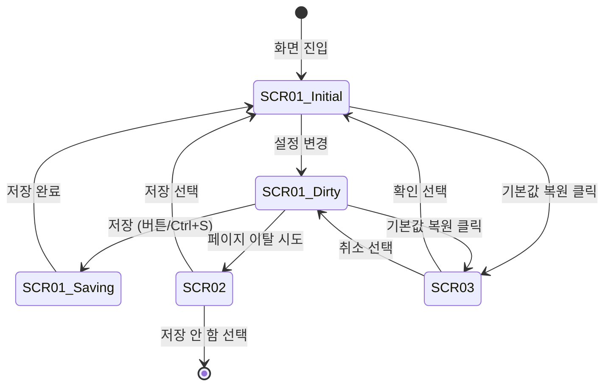

# TSK-06-19 - [샘플] 알림 설정 관리 UI 설계 문서

## 문서 정보

| 항목 | 내용 |
|------|------|
| Task ID | TSK-06-19 |
| 문서 버전 | 1.0 |
| 작성일 | 2026-01-23 |
| 상태 | 작성중 |
| 설계 참조 | `010-design.md` |

---

## 1. 화면 목록

| 화면 ID | 화면명 | 목적 | SVG 참조 |
|---------|--------|------|----------|
| SCR-01 | 알림 설정 메인 | 알림 카테고리 및 수신자 관리 | screen-01-notification-settings.svg |
| SCR-02 | 미저장 경고 다이얼로그 | 변경사항 저장 확인 | screen-02-unsaved-warning.svg |
| SCR-03 | 기본값 복원 확인 | 기본값 복원 확인 | screen-03-restore-confirm.svg |

---

## 2. 화면 전환 흐름

### 2.1 전체 흐름도



### 2.2 액션-화면 매트릭스

| 현재 상태 | 사용자 액션 | 다음 상태 | 비고 |
|----------|------------|----------|------|
| 초기 상태 | Switch 토글 | 변경 상태 | isDirty = true |
| 초기 상태 | 수신자 추가/삭제 | 변경 상태 | isDirty = true |
| 변경 상태 | 저장 버튼/Ctrl+S | 저장 중 → 초기 상태 | 성공 토스트 |
| 변경 상태 | 취소 버튼 | 미저장 경고 | 다이얼로그 |
| 변경 상태 | 다른 메뉴 클릭 | 미저장 경고 | 다이얼로그 |
| 미저장 경고 | 저장 선택 | 초기 상태 | 저장 후 이동 |
| 미저장 경고 | 저장 안 함 | 이전 화면 | 변경사항 폐기 |
| 모든 상태 | 기본값 복원 | 복원 확인 | 다이얼로그 |

---

## 3. 화면별 상세

### 3.1 SCR-01: 알림 설정 메인

#### 3.1.1 레이아웃 구조

```
┌─────────────────────────────────────────────────────────────────────────┐
│ [Card: 전체 컨테이너]                                                    │
│                                                                         │
│  ┌───────────────────────────────────────────────────────────────────┐ │
│  │  알림 설정                                       [기본값 복원]     │ │
│  └───────────────────────────────────────────────────────────────────┘ │
│                                                                         │
│  ┌───────────────────────────────────────────────────────────────────┐ │
│  │  [Card: 알림 카테고리 설정]                                        │ │
│  │                                                                   │ │
│  │  ┌─────────────────────────────────────────────────────────────┐ │ │
│  │  │  생산 알림                                            [ON]  │ │ │
│  │  │  생산 시작/완료, 목표 달성, 지연 경고                        │ │ │
│  │  └─────────────────────────────────────────────────────────────┘ │ │
│  │  ┌─────────────────────────────────────────────────────────────┐ │ │
│  │  │  품질 알림                                            [ON]  │ │ │
│  │  │  품질 이상, 검사 완료, 불량률 초과                           │ │ │
│  │  └─────────────────────────────────────────────────────────────┘ │ │
│  │  ┌─────────────────────────────────────────────────────────────┐ │ │
│  │  │  설비 알림                                           [OFF]  │ │ │
│  │  │  설비 이상, 유지보수 예정, 가동률 저하                        │ │ │
│  │  └─────────────────────────────────────────────────────────────┘ │ │
│  │  ┌─────────────────────────────────────────────────────────────┐ │ │
│  │  │  시스템 알림                                          [ON]  │ │ │
│  │  │  시스템 공지, 업데이트, 권한 변경                            │ │ │
│  │  └─────────────────────────────────────────────────────────────┘ │ │
│  └───────────────────────────────────────────────────────────────────┘ │
│                                                                         │
│  ┌───────────────────────────────────────────────────────────────────┐ │
│  │  [Card: 알림 수신자 관리]                         [수신자 추가]    │ │
│  │                                                                   │ │
│  │  ┌─────┬─────────────┬────────────────────────┬────────────────┐ │ │
│  │  │  #  │    이름     │        이메일          │      작업      │ │ │
│  │  ├─────┼─────────────┼────────────────────────┼────────────────┤ │ │
│  │  │  1  │   홍길동    │  hong@company.com      │    [삭제]      │ │ │
│  │  │  2  │   김철수    │  kim@company.com       │    [삭제]      │ │ │
│  │  │  3  │   이영희    │  lee@company.com       │    [삭제]      │ │ │
│  │  └─────┴─────────────┴────────────────────────┴────────────────┘ │ │
│  └───────────────────────────────────────────────────────────────────┘ │
│                                                                         │
│  ┌───────────────────────────────────────────────────────────────────┐ │
│  │                                          [취소]  [저장]           │ │
│  │  💡 Ctrl+S로 빠르게 저장할 수 있습니다                             │ │
│  └───────────────────────────────────────────────────────────────────┘ │
│                                                                         │
└─────────────────────────────────────────────────────────────────────────┘
```

#### 3.1.2 컴포넌트 구성

| 컴포넌트 | Ant Design | Props | data-testid |
|----------|------------|-------|-------------|
| 페이지 컨테이너 | Card | - | notification-settings-page |
| 제목 + 복원 버튼 | Card.title + Button | - | restore-defaults-btn |
| 카테고리 섹션 | Card | title="알림 카테고리 설정" | category-settings |
| 카테고리 아이템 | List.Item + Switch | - | category-switch-{id} |
| 수신자 섹션 | Card | title="알림 수신자 관리" | recipient-table |
| 수신자 테이블 | Table (editable) | columns, dataSource | - |
| 수신자 추가 버튼 | Button | type="primary" | add-recipient-btn |
| 버튼 영역 | Space | - | - |
| 취소 버튼 | Button | - | cancel-btn |
| 저장 버튼 | Button | type="primary" | save-btn |

#### 3.1.3 상태 정의

| 상태 | 조건 | 화면 변화 |
|------|------|----------|
| 초기 로딩 | 데이터 로드 중 | Skeleton 표시 |
| 정상 표시 | 데이터 로드 완료 | 현재 설정 표시 |
| 변경 상태 (Dirty) | 설정 변경됨 | 저장 버튼 활성화 강조 |
| 저장 중 | 저장 요청 중 | 버튼 로딩 상태 |
| 저장 완료 | 저장 성공 | 성공 토스트, Dirty 해제 |

#### 3.1.4 액션 정의

| 요소 | 이벤트 | 핸들러 | 결과 |
|------|--------|--------|------|
| Switch | onClick | handleCategoryToggle(id) | 해당 카테고리 enabled 토글, isDirty=true |
| 수신자 추가 버튼 | onClick | handleAddRecipient() | 테이블에 빈 행 추가 |
| 삭제 버튼 | onClick | handleDeleteRecipient(id) | 해당 수신자 삭제, isDirty=true |
| 이름/이메일 입력 | onChange | handleRecipientChange(id, field, value) | 해당 필드 업데이트 |
| 저장 버튼 | onClick | handleSave() | 설정 저장 |
| Ctrl+S | onKeyDown | handleSave() | 설정 저장 |
| 취소 버튼 | onClick | handleCancel() | 변경 있으면 경고, 없으면 이전 |
| 기본값 복원 | onClick | handleRestoreDefaults() | 확인 다이얼로그 후 복원 |

---

### 3.2 SCR-02: 미저장 경고 다이얼로그

#### 3.2.1 레이아웃 구조

```
┌───────────────────────────────────────────────┐
│  ⚠️ 저장되지 않은 변경사항                      │
├───────────────────────────────────────────────┤
│                                               │
│  저장하지 않은 변경사항이 있습니다.             │
│  저장하지 않고 이동하면 변경사항이 손실됩니다.   │
│                                               │
├───────────────────────────────────────────────┤
│           [저장 안 함]  [저장 후 이동]          │
└───────────────────────────────────────────────┘
```

#### 3.2.2 컴포넌트 구성

| 컴포넌트 | Ant Design | Props |
|----------|------------|-------|
| 다이얼로그 | Modal.confirm | type="warning" |
| 제목 | - | "저장되지 않은 변경사항" |
| 내용 | - | 경고 메시지 |
| 저장 안 함 버튼 | Button | - |
| 저장 후 이동 버튼 | Button | type="primary" |

---

### 3.3 SCR-03: 기본값 복원 확인 다이얼로그

#### 3.3.1 레이아웃 구조

```
┌───────────────────────────────────────────────┐
│  🔄 기본값 복원                                │
├───────────────────────────────────────────────┤
│                                               │
│  모든 알림 설정이 기본값으로 초기화됩니다.      │
│  이 작업은 취소할 수 없습니다.                 │
│                                               │
├───────────────────────────────────────────────┤
│                  [취소]  [복원]                │
└───────────────────────────────────────────────┘
```

#### 3.3.2 컴포넌트 구성

| 컴포넌트 | Ant Design | Props |
|----------|------------|-------|
| 다이얼로그 | Modal.confirm | type="info" |
| 제목 | - | "기본값 복원" |
| 내용 | - | 복원 안내 메시지 |
| 취소 버튼 | Button | - |
| 복원 버튼 | Button | type="primary" |

---

## 4. 공통 컴포넌트

### 4.1 CategoryItem (카테고리 아이템)

```tsx
interface CategoryItemProps {
  id: string
  name: string
  description: string
  enabled: boolean
  onChange: (id: string, enabled: boolean) => void
}
```

**렌더링:**
- 좌측: 카테고리명 (굵게) + 설명 (작은 글씨, 회색)
- 우측: Switch

### 4.2 RecipientRow (수신자 행)

```tsx
interface RecipientRowProps {
  id: string
  name: string
  email: string
  isNew?: boolean
  onChange: (id: string, field: 'name' | 'email', value: string) => void
  onDelete: (id: string) => void
  emailError?: string
}
```

**렌더링:**
- 번호, 이름 입력, 이메일 입력, 삭제 버튼
- 새 행일 경우 입력 필드 자동 포커스
- 이메일 에러 시 필드 하단에 에러 메시지

---

## 5. 반응형 설계

### 5.1 Breakpoint 정의

| Breakpoint | 화면 크기 | 레이아웃 변화 |
|------------|----------|--------------|
| Desktop | 1024px+ | 기본 레이아웃 |
| Tablet | 768-1023px | 테이블 컬럼 조정 (작업 컬럼 아이콘만) |
| Mobile | 767px- | 카드 스택, 테이블 → 리스트 변환 |

### 5.2 모바일 레이아웃

- 카테고리 섹션: 수직 스택 유지
- 수신자 테이블: 카드 리스트 형태로 변환
  - 각 수신자를 카드로 표시
  - 카드 내에 이름, 이메일, 삭제 버튼

---

## 6. 접근성

### 6.1 키보드 네비게이션

| 요소 | Tab 순서 | 키보드 액션 |
|------|----------|------------|
| 기본값 복원 버튼 | 1 | Enter: 복원 다이얼로그 |
| 카테고리 Switch (1~4) | 2~5 | Space: 토글 |
| 수신자 추가 버튼 | 6 | Enter: 새 행 추가 |
| 수신자 이름 입력 | 7~N | 텍스트 입력 |
| 수신자 이메일 입력 | 7~N | 텍스트 입력 |
| 수신자 삭제 버튼 | 7~N | Enter: 삭제 |
| 취소 버튼 | N+1 | Enter: 취소 |
| 저장 버튼 | N+2 | Enter: 저장 |

### 6.2 ARIA 속성

| 요소 | ARIA 속성 | 값 |
|------|----------|-----|
| Switch | aria-checked | true/false |
| Switch | aria-label | "{카테고리명} 알림 활성화" |
| 테이블 | role | table |
| 삭제 버튼 | aria-label | "{이름} 수신자 삭제" |
| 저장 버튼 (로딩) | aria-busy | true |

### 6.3 색상 대비

| 요소 | 전경색 | 배경색 | 대비율 |
|------|--------|--------|--------|
| 제목 | #262626 | #FFFFFF | 14.5:1 |
| 설명 텍스트 | #8C8C8C | #FFFFFF | 4.6:1 |
| Switch ON | #1677FF | - | - |
| Switch OFF | #D9D9D9 | - | - |
| 에러 텍스트 | #FF4D4F | #FFFFFF | 4.5:1 |

---

## 7. SVG 파일 목록

| 파일명 | 설명 | 화면 |
|--------|------|------|
| screen-01-notification-settings.svg | 알림 설정 메인 화면 | SCR-01 |
| screen-02-unsaved-warning.svg | 미저장 경고 다이얼로그 | SCR-02 |
| screen-03-restore-confirm.svg | 기본값 복원 확인 다이얼로그 | SCR-03 |

---

## 변경 이력

| 버전 | 일자 | 작성자 | 변경 내용 |
|------|------|--------|----------|
| 1.0 | 2026-01-23 | Claude | 최초 작성 |
