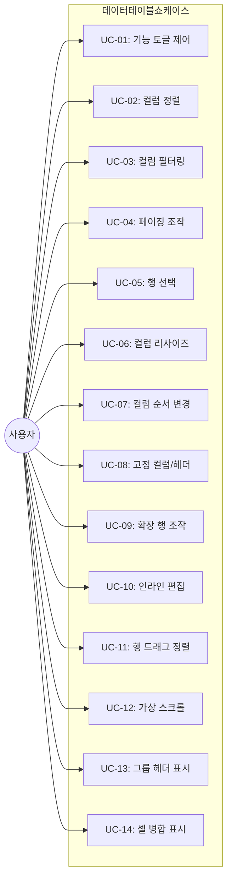
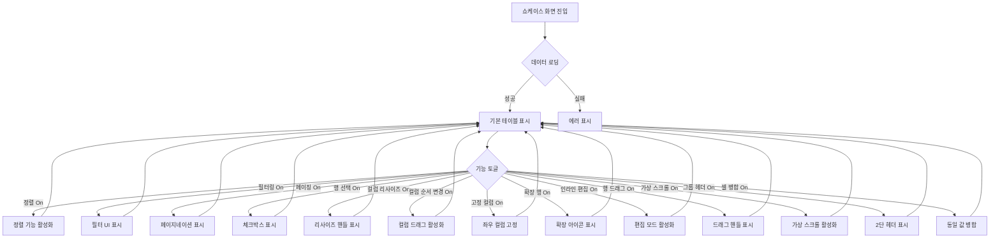
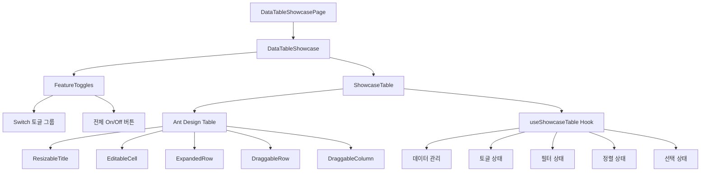

# TSK-06-20 - [샘플] 데이터 테이블 종합 설계 문서

## 문서 정보

| 항목 | 내용 |
|------|------|
| Task ID | TSK-06-20 |
| 문서 버전 | 1.0 |
| 작성일 | 2026-01-23 |
| 상태 | 작성중 |
| 카테고리 | development |

---

## 1. 개요

### 1.1 배경 및 문제 정의

**현재 상황:**
- MES Portal에 기본 DataTable 컴포넌트(components/common/DataTable.tsx)가 구현됨
- DataTable은 정렬, 페이징, 행 선택, 컬럼 리사이즈 기능을 제공
- Ant Design Table의 고급 기능(가상 스크롤, 그룹 헤더, 셀 병합, 확장 행 등)이 아직 통합되지 않음
- 대용량 데이터(1만건 이상)에서의 성능 검증 필요

**해결하려는 문제:**
- Ant Design Table의 모든 고급 기능을 한 화면에서 데모하고 검증할 수 있는 쇼케이스 필요
- 1만건 이상 대용량 데이터에서 가상 스크롤 성능 검증
- 그룹 헤더(2단 컬럼), 셀 병합(rowSpan/colSpan) 패턴 예시 필요
- 확장 행, 인라인 편집, 행/컬럼 드래그 앤 드롭 기능 검증
- 각 기능을 토글로 켜고 끌 수 있어 개별 기능 테스트 용이성 확보

### 1.2 목적 및 기대 효과

**목적:**
- DataTable 컴포넌트의 모든 고급 기능을 시연하는 종합 쇼케이스 화면 구현
- Ant Design Table의 props를 최대한 활용한 참조 코드 제공
- 1만건 데이터로 가상 스크롤 성능 검증
- 각 기능별 토글 UI로 개별 기능 테스트 지원

**기대 효과:**
- 개발자가 참조할 수 있는 테이블 고급 기능 예시 코드 확보
- 대용량 데이터 처리 성능 검증 및 최적화 가이드라인 확립
- DataTable 공통 컴포넌트 기능 확장 방향 도출
- QA 및 사용자 데모를 위한 쇼케이스 화면 제공

### 1.3 범위

**포함:**
- 데이터 테이블 종합 쇼케이스 화면 (screens/sample/DataTableShowcase.tsx)
- 기능별 토글 Switch UI (13개 기능)
- 1만건 Mock 데이터 (mock-data/large-dataset.json)
- 지원 기능:
  1. 컬럼 정렬 (단일/다중 정렬)
  2. 컬럼 필터링 (텍스트, 숫자, 날짜, 드롭다운)
  3. 페이징 (페이지 크기 선택, 전체 건수)
  4. 행 선택 (단일/다중 + 전체 선택)
  5. 컬럼 리사이즈
  6. 컬럼 순서 변경 (드래그 앤 드롭)
  7. 고정 컬럼/헤더 (sticky)
  8. 확장 행 (expandable row)
  9. 인라인 편집 (editable cell)
  10. 행 드래그 앤 드롭 정렬
  11. 가상 스크롤 (1만건+ 대용량 데이터)
  12. 그룹 헤더 (2단 컬럼 헤더)
  13. 셀 병합 (rowSpan, colSpan)

**제외:**
- 실제 API 연동 (Mock 데이터 사용)
- 데이터 CRUD 기능 (조회/편집만 지원)
- 컬럼 설정 영구 저장 (localStorage 저장은 선택적)

### 1.4 참조 문서

| 문서 | 경로 | 관련 섹션 |
|------|------|----------|
| PRD | `.orchay/projects/mes-portal/prd.md` | 4.1.1 테이블(그리드) 기능 |
| TRD | `.orchay/projects/mes-portal/trd.md` | 7. PRD 요구사항 <-> 기술 스택 매핑 |
| WBS | `.orchay/projects/mes-portal/wbs.yaml` | TSK-06-20 |
| DataTable | `components/common/DataTable.tsx` | 기존 구현 참조 |
| Ant Design Table | https://ant.design/components/table | 공식 문서 |

---

## 2. 사용자 분석

### 2.1 대상 사용자

| 사용자 유형 | 특성 | 주요 니즈 |
|------------|------|----------|
| 프론트엔드 개발자 | MES 포털 화면 개발 담당 | 테이블 고급 기능 구현 방법 학습, 참조 코드 확인 |
| QA 엔지니어 | 테이블 기능 검증 담당 | 각 기능별 개별 테스트, 성능 검증 |
| 기획자/PM | 테이블 기능 확인 | 요구사항 대비 구현 가능 기능 확인 |
| 고객/사용자 | MES 시스템 도입 검토 | 테이블 기능 데모, 성능 확인 |

### 2.2 사용자 페르소나

**페르소나 1: 김개발 (프론트엔드 개발자)**
- 역할: MES 포털 화면 개발
- 목표: 그룹 헤더, 셀 병합, 가상 스크롤 구현 방법 파악
- 불만: Ant Design 문서만으로는 실제 구현이 어려움, 복합 기능 예시 필요
- 시나리오: 쇼케이스 화면에서 필요한 기능을 토글로 켜고 코드 참조

**페르소나 2: 박테스터 (QA 엔지니어)**
- 역할: 테이블 기능 검증
- 목표: 각 기능이 개별적으로 및 조합 시 정상 동작하는지 확인
- 불만: 모든 기능이 동시에 켜진 상태에서는 개별 기능 테스트 어려움
- 시나리오: 토글로 특정 기능만 켜고 테스트 수행

**페르소나 3: 최기획 (기획자/PM)**
- 역할: 요구사항 정의 및 기능 확인
- 목표: 테이블에서 지원 가능한 기능 범위 파악
- 불만: 텍스트 설명만으로는 실제 동작 이해 어려움
- 시나리오: 데모 화면에서 각 기능을 직접 체험

---

## 3. 유즈케이스

### 3.1 유즈케이스 다이어그램



### 3.2 유즈케이스 상세

#### UC-01: 기능 토글 제어

| 항목 | 내용 |
|------|------|
| 액터 | 모든 사용자 |
| 목적 | 특정 테이블 기능을 활성화/비활성화 |
| 사전 조건 | 쇼케이스 화면 진입 |
| 사후 조건 | 선택한 기능 활성화/비활성화됨 |
| 트리거 | Switch 토글 클릭 |

**기본 흐름:**
1. 사용자가 화면 상단의 기능 토글 패널을 확인한다
2. 원하는 기능의 Switch를 클릭한다
3. Switch가 On/Off 상태로 변경된다
4. 테이블에 해당 기능이 활성화/비활성화된다

**토글 가능 기능 목록:**

| 토글 ID | 기능명 | 기본값 | 설명 |
|---------|--------|--------|------|
| sorting | 정렬 | On | 컬럼 헤더 클릭 시 정렬 |
| filtering | 필터링 | Off | 컬럼별 필터 UI |
| pagination | 페이징 | On | 페이지네이션 표시 |
| rowSelection | 행 선택 | Off | 체크박스 행 선택 |
| columnResize | 컬럼 리사이즈 | Off | 컬럼 너비 조절 |
| columnDrag | 컬럼 순서 변경 | Off | 컬럼 드래그 앤 드롭 |
| fixedColumn | 고정 컬럼 | Off | 좌측/우측 컬럼 고정 |
| expandable | 확장 행 | Off | 행 확장/축소 |
| editable | 인라인 편집 | Off | 셀 더블클릭 편집 |
| rowDrag | 행 드래그 정렬 | Off | 행 순서 변경 |
| virtualScroll | 가상 스크롤 | Off | 대용량 데이터 최적화 |
| groupHeader | 그룹 헤더 | Off | 2단 컬럼 헤더 |
| cellMerge | 셀 병합 | Off | rowSpan/colSpan |

#### UC-02: 컬럼 정렬

| 항목 | 내용 |
|------|------|
| 액터 | 모든 사용자 |
| 목적 | 데이터를 특정 컬럼 기준으로 정렬 |
| 사전 조건 | 정렬 토글 On |
| 사후 조건 | 데이터 정렬됨 |
| 트리거 | 컬럼 헤더 클릭 |

**기본 흐름:**
1. 사용자가 컬럼 헤더를 클릭한다
2. 해당 컬럼 기준 오름차순 정렬된다
3. 다시 클릭하면 내림차순 정렬된다
4. 다시 클릭하면 정렬 해제된다

**다중 정렬:**
- Shift + 클릭으로 다중 정렬 지원
- 정렬 순서 표시 (1, 2, 3...)

#### UC-03: 컬럼 필터링

| 항목 | 내용 |
|------|------|
| 액터 | 모든 사용자 |
| 목적 | 특정 조건으로 데이터 필터링 |
| 사전 조건 | 필터링 토글 On |
| 사후 조건 | 조건에 맞는 데이터만 표시 |
| 트리거 | 필터 아이콘 클릭 |

**필터 유형:**

| 컬럼 타입 | 필터 UI | 예시 |
|----------|---------|------|
| 텍스트 | Input + 포함/일치 | 이름 검색 |
| 숫자 | InputNumber + 범위 | 수량 >= 100 |
| 날짜 | DatePicker + 범위 | 2026-01-01 ~ 2026-01-31 |
| 드롭다운 | Select (다중 선택) | 상태: 가동, 정지 |

#### UC-04: 페이징 조작

| 항목 | 내용 |
|------|------|
| 액터 | 모든 사용자 |
| 목적 | 페이지 이동 및 페이지 크기 변경 |
| 사전 조건 | 페이징 토글 On, 가상 스크롤 Off |
| 사후 조건 | 해당 페이지 데이터 표시 |
| 트리거 | 페이지 번호 클릭, 페이지 크기 변경 |

**기본 흐름:**
1. 사용자가 페이지 번호를 클릭한다
2. 해당 페이지의 데이터가 표시된다
3. 페이지 크기 드롭다운에서 크기를 변경한다
4. 지정된 개수만큼 데이터가 표시된다

**페이지 크기 옵션:** 10, 20, 50, 100

#### UC-05: 행 선택

| 항목 | 내용 |
|------|------|
| 액터 | 모든 사용자 |
| 목적 | 특정 행을 선택 |
| 사전 조건 | 행 선택 토글 On |
| 사후 조건 | 행 선택됨, 선택 건수 표시 |
| 트리거 | 체크박스 클릭 |

**선택 유형:**
- 단일 선택: 라디오 버튼
- 다중 선택: 체크박스
- 전체 선택: 헤더 체크박스

#### UC-06: 컬럼 리사이즈

| 항목 | 내용 |
|------|------|
| 액터 | 모든 사용자 |
| 목적 | 컬럼 너비 조절 |
| 사전 조건 | 컬럼 리사이즈 토글 On |
| 사후 조건 | 컬럼 너비 변경됨 |
| 트리거 | 컬럼 경계 드래그 |

**기본 흐름:**
1. 사용자가 컬럼 헤더 우측 경계에 마우스를 올린다
2. 커서가 col-resize로 변경된다
3. 드래그하여 너비를 조절한다
4. 최소 너비 50px 제한

#### UC-07: 컬럼 순서 변경

| 항목 | 내용 |
|------|------|
| 액터 | 모든 사용자 |
| 목적 | 컬럼 순서 변경 |
| 사전 조건 | 컬럼 순서 변경 토글 On |
| 사후 조건 | 컬럼 순서 변경됨 |
| 트리거 | 컬럼 헤더 드래그 앤 드롭 |

**기본 흐름:**
1. 사용자가 컬럼 헤더를 드래그한다
2. 드롭 위치가 시각적으로 표시된다
3. 드롭하면 컬럼 순서가 변경된다

#### UC-08: 고정 컬럼/헤더

| 항목 | 내용 |
|------|------|
| 액터 | 모든 사용자 |
| 목적 | 특정 컬럼/헤더를 고정하여 스크롤 시에도 보이게 함 |
| 사전 조건 | 고정 컬럼 토글 On |
| 사후 조건 | 고정 컬럼/헤더 적용 |
| 트리거 | 토글 On |

**고정 대상:**
- 좌측 고정: ID 컬럼
- 우측 고정: 액션 컬럼
- 상단 고정: 헤더 행 (sticky)

#### UC-09: 확장 행 조작

| 항목 | 내용 |
|------|------|
| 액터 | 모든 사용자 |
| 목적 | 행의 상세 정보 확장/축소 |
| 사전 조건 | 확장 행 토글 On |
| 사후 조건 | 확장 행 표시/숨김 |
| 트리거 | 확장 아이콘(+/-) 클릭 |

**확장 행 내용:**
- 추가 상세 정보 (Descriptions 형태)
- 관련 하위 데이터 (중첩 Table)

#### UC-10: 인라인 편집

| 항목 | 내용 |
|------|------|
| 액터 | 모든 사용자 |
| 목적 | 셀 값을 직접 편집 |
| 사전 조건 | 인라인 편집 토글 On |
| 사후 조건 | 셀 값 변경됨 |
| 트리거 | 셀 더블클릭 |

**기본 흐름:**
1. 사용자가 편집 가능한 셀을 더블클릭한다
2. 셀이 Input 상태로 변경된다
3. 값을 수정한다
4. Enter 또는 셀 외부 클릭으로 저장
5. ESC로 취소

**편집 가능 컬럼:**
- 이름, 수량, 비고 등 특정 컬럼

#### UC-11: 행 드래그 정렬

| 항목 | 내용 |
|------|------|
| 액터 | 모든 사용자 |
| 목적 | 행 순서 변경 |
| 사전 조건 | 행 드래그 토글 On |
| 사후 조건 | 행 순서 변경됨 |
| 트리거 | 행 드래그 앤 드롭 |

**기본 흐름:**
1. 사용자가 행의 드래그 핸들을 클릭한다
2. 행을 드래그한다
3. 드롭 위치가 시각적으로 표시된다
4. 드롭하면 행 순서가 변경된다

#### UC-12: 가상 스크롤

| 항목 | 내용 |
|------|------|
| 액터 | 모든 사용자 |
| 목적 | 대용량 데이터에서 부드러운 스크롤 |
| 사전 조건 | 가상 스크롤 토글 On |
| 사후 조건 | 가상 스크롤 활성화 |
| 트리거 | 토글 On |

**동작 방식:**
- 1만건 데이터 로드
- 화면에 보이는 행만 렌더링
- 스크롤 시 동적으로 행 렌더링
- 페이징 대신 무한 스크롤

**성능 목표:**
- 스크롤 시 60fps 유지
- 초기 렌더링 1초 이내

#### UC-13: 그룹 헤더 표시

| 항목 | 내용 |
|------|------|
| 액터 | 모든 사용자 |
| 목적 | 2단 컬럼 헤더로 컬럼 그룹화 |
| 사전 조건 | 그룹 헤더 토글 On |
| 사후 조건 | 그룹 헤더 표시 |
| 트리거 | 토글 On |

**그룹 구조:**
```
+------------------+--------------------+
|    기본 정보     |      실적 정보      |
+------+-----+-----+------+------+-----+
| ID   | 이름| 라인| 수량 | 불량 | 가동률|
+------+-----+-----+------+------+-----+
```

#### UC-14: 셀 병합 표시

| 항목 | 내용 |
|------|------|
| 액터 | 모든 사용자 |
| 목적 | 동일 값 셀 자동 병합 |
| 사전 조건 | 셀 병합 토글 On |
| 사후 조건 | 셀 병합 표시 |
| 트리거 | 토글 On |

**병합 규칙:**
- rowSpan: 연속된 동일 값 행 병합
- 병합 대상 컬럼: 라인명, 상태 등

---

## 4. 사용자 시나리오

### 4.1 시나리오 1: 개발자의 그룹 헤더 구현 참조

**상황 설명:**
김개발 개발자가 생산 실적 화면에 그룹 헤더를 적용하려고 쇼케이스를 참조한다.

**단계별 진행:**

| 단계 | 사용자 행동 | 시스템 반응 | 사용자 기대 |
|------|-----------|------------|------------|
| 1 | 쇼케이스 화면 진입 | 기본 테이블 표시 | 화면 로드 |
| 2 | 모든 토글 Off 확인 | 기본 테이블만 표시 | 깔끔한 상태에서 시작 |
| 3 | 그룹 헤더 토글 On | 2단 헤더로 변경 | 그룹 헤더 표시 |
| 4 | 헤더 구조 확인 | 기본정보/실적정보 그룹 표시 | columns.children 구조 파악 |
| 5 | 코드 참조 (개발자 도구) | - | 구현 방법 확인 |

**성공 조건:**
- 그룹 헤더가 정상 표시됨
- columns.children 구조 확인 가능

### 4.2 시나리오 2: QA의 기능 조합 테스트

**상황 설명:**
박테스터 QA가 정렬 + 필터링 + 페이징 조합 동작을 테스트한다.

**단계별 진행:**

| 단계 | 사용자 행동 | 시스템 반응 | 사용자 기대 |
|------|-----------|------------|------------|
| 1 | 정렬 토글 On | 정렬 가능 상태 | 컬럼 헤더에 정렬 아이콘 |
| 2 | 필터링 토글 On | 필터 UI 표시 | 컬럼별 필터 아이콘 |
| 3 | 페이징 토글 On | 페이지네이션 표시 | 하단에 페이지네이션 |
| 4 | 라인 컬럼 필터 적용 | A라인만 표시 | 필터링 동작 |
| 5 | 수량 컬럼 정렬 | A라인 내에서 정렬 | 필터 + 정렬 조합 |
| 6 | 2페이지로 이동 | 2페이지 데이터 표시 | 페이징 동작 |

**성공 조건:**
- 필터링 후 정렬 정상 동작
- 정렬/필터 상태에서 페이징 정상 동작

### 4.3 시나리오 3: 대용량 데이터 가상 스크롤 테스트

**상황 설명:**
1만건 데이터에서 가상 스크롤 성능을 확인한다.

**단계별 진행:**

| 단계 | 사용자 행동 | 시스템 반응 | 사용자 기대 |
|------|-----------|------------|------------|
| 1 | 가상 스크롤 토글 On | 1만건 데이터 로드 | 빠른 로딩 |
| 2 | 페이징 자동 Off 확인 | 페이지네이션 숨김 | 가상 스크롤과 충돌 방지 |
| 3 | 스크롤 다운 | 부드러운 스크롤 | 60fps 유지 |
| 4 | 빠른 스크롤 | 데이터 동적 렌더링 | 끊김 없음 |
| 5 | 맨 아래까지 스크롤 | 마지막 데이터 표시 | 전체 데이터 접근 가능 |

**성공 조건:**
- 1만건 데이터 정상 로드
- 스크롤 시 60fps 이상 유지
- 메모리 사용량 안정적

### 4.4 시나리오 4: 인라인 편집 테스트

**상황 설명:**
셀 더블클릭으로 인라인 편집 기능을 테스트한다.

**단계별 진행:**

| 단계 | 사용자 행동 | 시스템 반응 | 복구 방법 |
|------|-----------|------------|----------|
| 1 | 인라인 편집 토글 On | 편집 가능 컬럼 표시 | - |
| 2 | 이름 셀 더블클릭 | Input으로 변환 | - |
| 3 | 새 값 입력 | 입력 표시 | - |
| 4 | Enter 키 입력 | 값 저장, 셀 닫힘 | ESC로 취소 |
| 5 | 값 변경 확인 | 변경된 값 표시 | - |

**성공 조건:**
- 더블클릭으로 편집 모드 진입
- Enter로 저장, ESC로 취소
- 변경 값 반영

---

## 5. 화면 설계

### 5.1 화면 흐름도



### 5.2 화면별 상세

#### 화면 1: 데이터 테이블 종합 쇼케이스 (DataTableShowcase)

**화면 목적:**
Ant Design Table의 모든 고급 기능을 한 화면에서 데모하고 테스트할 수 있는 종합 쇼케이스

**진입 경로:**
- 사이드바 메뉴: 샘플 > 데이터 테이블 종합
- 경로: /sample/data-table-showcase

**와이어프레임:**
```
+---------------------------------------------------------------------------------+
|                                                                                 |
|  +-----------------------------------------------------------------------+     |
|  |  기능 토글 (Card)                                                      |     |
|  |  +-------------------------------------------------------------------+|     |
|  |  |                                                                   ||     |
|  |  |  정렬      필터링     페이징     행선택     컬럼리사이즈           ||     |
|  |  |  [On]      [Off]      [On]       [Off]      [Off]                 ||     |
|  |  |                                                                   ||     |
|  |  |  컬럼순서   고정컬럼   확장행     인라인편집  행드래그              ||     |
|  |  |  [Off]     [Off]      [Off]      [Off]       [Off]                ||     |
|  |  |                                                                   ||     |
|  |  |  가상스크롤  그룹헤더   셀병합                                     ||     |
|  |  |  [Off]       [Off]     [Off]                                      ||     |
|  |  |                                                                   ||     |
|  |  |                                           [전체 On] [전체 Off]    ||     |
|  |  +-------------------------------------------------------------------+|     |
|  +-----------------------------------------------------------------------+     |
|                                                                                 |
|  +-----------------------------------------------------------------------+     |
|  |  데이터 테이블                                                         |     |
|  |  +-------------------------------------------------------------------+|     |
|  |  |  총 10,000건  |  선택: 0건                                        ||     |
|  |  +-------------------------------------------------------------------+|     |
|  |  |           기본 정보            |        실적 정보         | 액션   ||     |
|  |  +------+--------+--------+-------+--------+--------+--------+-------+|     |
|  |  | ID   | 이름   | 라인   | 상태  | 수량   | 불량   | 가동률 |       ||     |
|  |  +------+--------+--------+-------+--------+--------+--------+-------+|     |
|  |  | 0001 | 설비A  | A라인  | 가동  | 1,234  | 12     | 87.3%  | [편집]||     |
|  |  | 0002 | 설비B  | A라인  |       | 2,345  | 23     | 92.1%  | [편집]||     |
|  |  |  +-- (확장 행: 상세 정보) --+                                      ||     |
|  |  | 0003 | 설비C  | B라인  | 정지  | 3,456  | 34     | 78.5%  | [편집]||     |
|  |  | ...                                                               ||     |
|  |  +-------------------------------------------------------------------+|     |
|  |                                                                       |     |
|  |  (페이징: << < 1 2 3 4 5 > >> | 10건/페이지)                          |     |
|  |  또는                                                                 |     |
|  |  (가상스크롤: 스크롤바)                                                |     |
|  +-----------------------------------------------------------------------+     |
|                                                                                 |
+---------------------------------------------------------------------------------+
```

**화면 요소 설명:**

| 영역 | 설명 | 사용자 인터랙션 |
|------|------|----------------|
| 기능 토글 Card | 13개 기능 Switch | Switch 토글 클릭 |
| 전체 On/Off 버튼 | 모든 토글 일괄 제어 | 버튼 클릭 |
| 데이터 요약 | 총 건수, 선택 건수 | - |
| 그룹 헤더 | 기본정보/실적정보 그룹 | (그룹 헤더 On 시) |
| 테이블 | 데이터 표시 | 정렬, 필터, 선택 등 |
| 확장 행 | 상세 정보 | (확장 행 On 시) +/- 클릭 |
| 페이지네이션 | 페이지 이동 | (페이징 On, 가상스크롤 Off 시) |

### 5.3 컬럼 정의

**기본 컬럼 구조:**

| dataIndex | title | 그룹 | 타입 | 정렬 | 필터 | 고정 | 편집 | 병합 |
|-----------|-------|------|------|------|------|------|------|------|
| id | ID | 기본정보 | 문자열 | Y | 텍스트 | 좌측 | N | N |
| name | 이름 | 기본정보 | 문자열 | Y | 텍스트 | N | Y | N |
| line | 라인 | 기본정보 | 문자열 | Y | 드롭다운 | N | N | Y |
| status | 상태 | 기본정보 | 문자열 | Y | 드롭다운 | N | N | Y |
| quantity | 수량 | 실적정보 | 숫자 | Y | 숫자범위 | N | Y | N |
| defect | 불량 | 실적정보 | 숫자 | Y | 숫자범위 | N | N | N |
| efficiency | 가동률 | 실적정보 | 숫자 | Y | 숫자범위 | N | N | N |
| date | 일자 | 실적정보 | 날짜 | Y | 날짜범위 | N | N | N |
| action | 액션 | - | - | N | N | 우측 | N | N |

**그룹 헤더 구조 (columns.children):**

```typescript
const groupedColumns = [
  {
    title: '기본 정보',
    children: [
      { title: 'ID', dataIndex: 'id' },
      { title: '이름', dataIndex: 'name' },
      { title: '라인', dataIndex: 'line' },
      { title: '상태', dataIndex: 'status' },
    ],
  },
  {
    title: '실적 정보',
    children: [
      { title: '수량', dataIndex: 'quantity' },
      { title: '불량', dataIndex: 'defect' },
      { title: '가동률', dataIndex: 'efficiency' },
      { title: '일자', dataIndex: 'date' },
    ],
  },
  {
    title: '액션',
    dataIndex: 'action',
    fixed: 'right',
  },
];
```

### 5.4 반응형 동작

| 화면 크기 | 레이아웃 변화 | 설명 |
|----------|--------------|------|
| 데스크톱 (1200px+) | 전체 컬럼 표시, 토글 2행 | 최적 사용 환경 |
| 태블릿 (768-1199px) | 일부 컬럼 숨김 가능, 수평 스크롤 | 고정 컬럼 필수 |
| 모바일 (767px-) | 토글 수직 배치, 수평 스크롤 | 터치 스크롤 |

---

## 6. 인터랙션 설계

### 6.1 사용자 액션과 피드백

| 사용자 액션 | 즉각 피드백 | 결과 피드백 | 에러 피드백 |
|------------|-----------|------------|------------|
| 토글 클릭 | Switch 상태 변경 | 테이블 UI 변경 | - |
| 컬럼 헤더 클릭 (정렬) | 정렬 아이콘 변경 | 데이터 재정렬 | - |
| 필터 적용 | 로딩 표시 | 필터링된 데이터 | 결과 없음 Empty |
| 페이지 변경 | 로딩 표시 | 해당 페이지 데이터 | - |
| 행 체크박스 클릭 | 체크 상태 변경 | 선택 건수 업데이트 | - |
| 컬럼 리사이즈 드래그 | 너비 실시간 변경 | 너비 확정 | 최소 너비 제한 |
| 컬럼 순서 드래그 | 드래그 시각화 | 순서 변경 | - |
| 확장 아이콘 클릭 | 회전 애니메이션 | 확장 행 표시/숨김 | - |
| 셀 더블클릭 (편집) | 셀 -> Input 변환 | - | - |
| Enter (편집 저장) | Input -> 셀 변환 | 값 변경 반영 | 유효성 에러 |
| ESC (편집 취소) | Input -> 셀 변환 | 원래 값 유지 | - |
| 행 드래그 | 드래그 시각화 | 순서 변경 | - |
| 가상 스크롤 | 스크롤 | 동적 렌더링 | - |

### 6.2 상태별 화면 변화

| 상태 | 화면 표시 | 사용자 안내 |
|------|----------|------------|
| 초기 로딩 | 테이블 스켈레톤 | "데이터를 불러오는 중..." |
| 데이터 로드 성공 | 데이터 테이블 | - |
| 필터 결과 없음 | Empty State | "검색 결과가 없습니다" |
| 가상 스크롤 활성화 | 페이지네이션 숨김 | "가상 스크롤 모드" 표시 |
| 편집 모드 | 셀이 Input으로 | 편집 가능 셀 강조 |
| 에러 발생 | Result (error) | "데이터를 불러오지 못했습니다" |

### 6.3 토글 상호작용 규칙

| 토글 | 활성화 시 | 비활성화 시 | 충돌 규칙 |
|------|----------|------------|----------|
| 가상스크롤 | 페이징 자동 Off | 페이징 활성화 가능 | 페이징과 상호 배제 |
| 그룹헤더 | 컬럼 순서 변경 제한 | 컬럼 순서 변경 가능 | - |
| 셀병합 | 정렬 시 병합 해제 | - | 정렬과 병합 동시 적용 제한 |
| 행드래그 | 정렬 비활성화 권장 | - | 정렬과 충돌 경고 |

### 6.4 키보드/접근성

| 기능 | 키보드 | 스크린 리더 안내 |
|------|--------|-----------------|
| 토글 포커스 | Tab | "정렬 기능, 켜짐/꺼짐" |
| 토글 변경 | Space | "정렬 기능 켜짐/꺼짐" |
| 정렬 | Enter (헤더 포커스 시) | "이름 컬럼, 오름차순 정렬" |
| 셀 편집 | Enter (셀 포커스 시) | "편집 모드" |
| 편집 저장 | Enter | "저장됨" |
| 편집 취소 | ESC | "취소됨" |
| 행 선택 | Space (행 포커스 시) | "행 선택됨/해제됨" |

---

## 7. 데이터 요구사항

### 7.1 필요한 데이터

| 데이터 | 설명 | 출처 | 용도 |
|--------|------|------|------|
| large-dataset | 1만건 샘플 데이터 | mock-data/large-dataset.json | 테이블 데이터 |

### 7.2 데이터 모델

```typescript
/**
 * 테이블 행 데이터 타입
 */
interface TableRowData {
  id: string;               // 고유 ID (0001 ~ 10000)
  name: string;             // 설비/자재 이름
  line: string;             // 라인 (A라인, B라인, C라인, D라인)
  status: 'RUNNING' | 'STOPPED' | 'FAULT' | 'MAINTENANCE';  // 상태
  statusLabel: string;      // 상태 라벨
  quantity: number;         // 수량
  defect: number;           // 불량 수
  efficiency: number;       // 가동률 (%)
  date: string;             // 일자 (YYYY-MM-DD)
  remark?: string;          // 비고
  children?: TableRowData[]; // 확장 행 데이터 (중첩 테이블용)
  detail?: {                // 확장 행 상세 정보
    description: string;
    createdAt: string;
    updatedAt: string;
  };
}

/**
 * 기능 토글 상태 타입
 */
interface FeatureToggles {
  sorting: boolean;         // 정렬
  filtering: boolean;       // 필터링
  pagination: boolean;      // 페이징
  rowSelection: boolean;    // 행 선택
  columnResize: boolean;    // 컬럼 리사이즈
  columnDrag: boolean;      // 컬럼 순서 변경
  fixedColumn: boolean;     // 고정 컬럼
  expandable: boolean;      // 확장 행
  editable: boolean;        // 인라인 편집
  rowDrag: boolean;         // 행 드래그 정렬
  virtualScroll: boolean;   // 가상 스크롤
  groupHeader: boolean;     // 그룹 헤더
  cellMerge: boolean;       // 셀 병합
}

/**
 * 필터 상태 타입
 */
interface FilterState {
  id?: string;
  name?: string;
  line?: string[];
  status?: string[];
  quantityRange?: [number, number];
  defectRange?: [number, number];
  efficiencyRange?: [number, number];
  dateRange?: [string, string];
}
```

### 7.3 Mock 데이터 구조 (mock-data/large-dataset.json)

```json
{
  "total": 10000,
  "lines": ["A라인", "B라인", "C라인", "D라인"],
  "statuses": [
    { "value": "RUNNING", "label": "가동" },
    { "value": "STOPPED", "label": "정지" },
    { "value": "FAULT", "label": "고장" },
    { "value": "MAINTENANCE", "label": "점검" }
  ],
  "data": [
    {
      "id": "0001",
      "name": "CNC 가공기 #1",
      "line": "A라인",
      "status": "RUNNING",
      "statusLabel": "가동",
      "quantity": 1234,
      "defect": 12,
      "efficiency": 87.3,
      "date": "2026-01-22",
      "remark": "정상 가동 중",
      "detail": {
        "description": "CNC 가공기 상세 정보...",
        "createdAt": "2024-01-15T09:00:00Z",
        "updatedAt": "2026-01-22T08:30:00Z"
      }
    }
    // ... 10000건
  ]
}
```

### 7.4 데이터 생성 규칙 (1만건)

| 필드 | 생성 규칙 |
|------|----------|
| id | "0001" ~ "10000" (4자리 패딩) |
| name | "설비 #1" ~ "설비 #10000" |
| line | 랜덤 (A라인, B라인, C라인, D라인 균등 분포) |
| status | 가동 60%, 정지 20%, 점검 15%, 고장 5% |
| quantity | 랜덤 (100 ~ 9999) |
| defect | 랜덤 (0 ~ quantity의 5%) |
| efficiency | 랜덤 (60.0 ~ 99.9) |
| date | 최근 30일 내 랜덤 |

---

## 8. 비즈니스 규칙

### 8.1 핵심 규칙

| 규칙 ID | 규칙 설명 | 적용 상황 | 예외 |
|---------|----------|----------|------|
| BR-01 | 가상 스크롤 On 시 페이징 자동 Off | 가상스크롤 토글 On | - |
| BR-02 | 페이징 On 시 가상 스크롤 자동 Off | 페이징 토글 On | - |
| BR-03 | 셀 병합 시 정렬하면 병합 해제 | 정렬 적용 | 병합 토글 유지 |
| BR-04 | 그룹 헤더 On 시 컬럼 순서 변경 제한 | 컬럼드래그 시도 | 그룹 내 순서만 가능 |
| BR-05 | 편집 가능 셀만 더블클릭 시 편집 모드 | 편집 불가 셀 클릭 | 무시 |
| BR-06 | 행 드래그 시 현재 정렬 상태 유지 | 정렬 적용 중 드래그 | 드래그 후 정렬 초기화 |
| BR-07 | 필터 + 정렬 동시 적용 시 필터 우선 | 복합 조건 | - |
| BR-08 | 전체 선택 체크박스는 현재 페이지만 | 페이징 모드 | 가상스크롤 시 전체 |

### 8.2 규칙 상세 설명

**BR-01/BR-02: 가상 스크롤과 페이징 상호 배제**

설명: 가상 스크롤과 페이징은 대용량 데이터 처리 방식이 다르므로 동시에 사용할 수 없다.

```typescript
function handleVirtualScrollToggle(checked: boolean) {
  if (checked) {
    setToggles(prev => ({
      ...prev,
      virtualScroll: true,
      pagination: false, // 자동 Off
    }));
  }
}
```

**BR-03: 셀 병합과 정렬**

설명: 정렬을 적용하면 동일 값 기준 병합이 깨지므로 정렬 시 병합을 일시 해제한다.

```typescript
function handleSort(sorter: SorterResult) {
  if (toggles.cellMerge && sorter.order) {
    // 정렬 적용 시 병합 해제
    setMergeEnabled(false);
  }
}
```

**BR-05: 편집 가능 셀**

설명: 모든 셀이 편집 가능한 것이 아니라 지정된 컬럼(이름, 수량, 비고)만 편집 가능하다.

```typescript
const editableColumns = ['name', 'quantity', 'remark'];

function isEditable(dataIndex: string): boolean {
  return editableColumns.includes(dataIndex);
}
```

---

## 9. 에러 처리

### 9.1 예상 에러 상황

| 상황 | 원인 | 사용자 메시지 | 복구 방법 |
|------|------|--------------|----------|
| 데이터 로드 실패 | JSON 파일 로드 실패 | "데이터를 불러오지 못했습니다" | 재시도 버튼 |
| 대용량 데이터 로드 지연 | 1만건 로딩 | 스켈레톤 표시 | 대기 |
| 인라인 편집 유효성 실패 | 잘못된 값 입력 | 필드 하단 에러 | 값 수정 |
| 브라우저 메모리 부족 | 가상스크롤 없이 1만건 | 성능 경고 | 가상스크롤 권장 |

### 9.2 에러 표시 방식

| 에러 유형 | 표시 위치 | 표시 방법 |
|----------|----------|----------|
| 데이터 로드 실패 | 테이블 영역 | Result (status="error") + 재시도 |
| 필터 결과 없음 | 테이블 영역 | Empty + 필터 초기화 |
| 편집 유효성 실패 | 셀 하단 | Tooltip 에러 메시지 |
| 성능 경고 | 상단 알림 | Alert (type="warning") |

---

## 10. 연관 문서

| 문서 | 경로 | 용도 |
|------|------|------|
| 요구사항 추적 매트릭스 | `025-traceability-matrix.md` | PRD -> 설계 -> 테스트 추적 |
| 테스트 명세서 | `026-test-specification.md` | 테스트 케이스 정의 |

---

## 11. 구현 범위

### 11.1 파일 구조

```
mes-portal/
├── app/
│   └── (portal)/
│       └── sample/
│           └── data-table-showcase/
│               └── page.tsx                    # 라우트 페이지
├── screens/
│   └── sample/
│       └── DataTableShowcase/
│           ├── index.tsx                       # 메인 컴포넌트
│           ├── FeatureToggles.tsx              # 기능 토글 패널
│           ├── ShowcaseTable.tsx               # 쇼케이스 테이블
│           ├── EditableCell.tsx                # 편집 가능 셀
│           ├── ExpandedRow.tsx                 # 확장 행 컴포넌트
│           ├── columns.tsx                     # 컬럼 정의
│           ├── useShowcaseTable.ts             # 상태 관리 훅
│           └── types.ts                        # 타입 정의
├── components/
│   └── common/
│       └── DataTable.tsx                       # 기존 DataTable (확장)
└── mock-data/
    └── large-dataset.json                      # 1만건 Mock 데이터
```

### 11.2 컴포넌트 구조



### 11.3 영향받는 영역

| 영역 | 변경 내용 | 영향도 |
|------|----------|--------|
| app/(portal)/sample/data-table-showcase/ | 신규 생성 | 높음 |
| screens/sample/DataTableShowcase/ | 신규 생성 | 높음 |
| components/common/DataTable.tsx | 기능 확장 고려 | 중간 |
| mock-data/large-dataset.json | 신규 생성 (1만건) | 중간 |

### 11.4 의존성

| 의존 항목 | 이유 | 상태 |
|----------|------|------|
| TSK-05-04 DataTable | 기본 테이블 컴포넌트 | 완료 |
| Ant Design Table | 테이블 컴포넌트 | TRD 확인됨 |
| react-resizable | 컬럼 리사이즈 | TRD 확인됨 |
| @dnd-kit/core | 행/컬럼 드래그 앤 드롭 | TRD 확인됨 |
| @dnd-kit/sortable | 정렬 가능 드래그 | TRD 확인됨 |
| rc-virtual-list | 가상 스크롤 (Ant Design 내장) | TRD 확인됨 |

### 11.5 사용할 Ant Design 컴포넌트

| 컴포넌트 | 용도 |
|----------|------|
| Table | 메인 테이블 |
| Table (virtual) | 가상 스크롤 |
| Table (expandable) | 확장 행 |
| Table (rowSelection) | 행 선택 |
| Table (sorter) | 컬럼 정렬 |
| Table (filters) | 컬럼 필터링 |
| Table (fixed) | 고정 컬럼/헤더 |
| Table (onCell) | 셀 병합 (rowSpan, colSpan) |
| Card | 토글 패널 컨테이너 |
| Switch | 기능 토글 |
| Space | 토글 배치 |
| Button | 전체 On/Off |
| Input | 텍스트 필터, 편집 |
| InputNumber | 숫자 필터, 편집 |
| Select | 드롭다운 필터 |
| DatePicker | 날짜 필터 |
| Descriptions | 확장 행 상세 정보 |
| Typography | 텍스트 표시 |
| Empty | 데이터 없음 |
| Result | 에러 상태 |
| Skeleton | 로딩 상태 |
| Alert | 성능 경고 |

### 11.6 @dnd-kit 활용

**행 드래그 앤 드롭:**

```typescript
import { DndContext, closestCenter } from '@dnd-kit/core';
import { SortableContext, verticalListSortingStrategy, useSortable } from '@dnd-kit/sortable';

function DraggableRow({ id, ...props }) {
  const { attributes, listeners, setNodeRef, transform, transition } = useSortable({ id });
  // ...
}
```

**컬럼 드래그 앤 드롭:**

```typescript
import { SortableContext, horizontalListSortingStrategy } from '@dnd-kit/sortable';

function DraggableColumnHeader({ dataIndex, ...props }) {
  const { attributes, listeners, setNodeRef, transform, transition } = useSortable({
    id: dataIndex,
  });
  // ...
}
```

### 11.7 가상 스크롤 구현

```typescript
// Ant Design Table virtual 속성 사용
<Table
  virtual
  scroll={{ y: 500 }}  // 고정 높이 필수
  dataSource={largeData}  // 1만건 데이터
  columns={columns}
  rowKey="id"
/>
```

### 11.8 그룹 헤더 구현 (columns.children)

```typescript
const groupedColumns: ColumnsType<TableRowData> = [
  {
    title: '기본 정보',
    children: [
      { title: 'ID', dataIndex: 'id', key: 'id', width: 80 },
      { title: '이름', dataIndex: 'name', key: 'name', width: 150 },
      { title: '라인', dataIndex: 'line', key: 'line', width: 100 },
      { title: '상태', dataIndex: 'status', key: 'status', width: 100 },
    ],
  },
  {
    title: '실적 정보',
    children: [
      { title: '수량', dataIndex: 'quantity', key: 'quantity', width: 100 },
      { title: '불량', dataIndex: 'defect', key: 'defect', width: 80 },
      { title: '가동률', dataIndex: 'efficiency', key: 'efficiency', width: 100 },
      { title: '일자', dataIndex: 'date', key: 'date', width: 120 },
    ],
  },
];
```

### 11.9 셀 병합 구현 (onCell)

```typescript
// 동일 값 rowSpan 계산
function calculateRowSpan(data: TableRowData[], dataIndex: string) {
  const spans: Record<number, number> = {};
  let current = '';
  let startIndex = 0;

  data.forEach((row, index) => {
    const value = row[dataIndex];
    if (value !== current) {
      if (index > 0) {
        spans[startIndex] = index - startIndex;
      }
      current = value;
      startIndex = index;
    }
  });
  spans[startIndex] = data.length - startIndex;

  return spans;
}

// 컬럼 정의에 onCell 적용
{
  title: '라인',
  dataIndex: 'line',
  onCell: (_, index) => ({
    rowSpan: lineSpans[index!] || 0,
  }),
}
```

### 11.10 제약 사항

| 제약 | 설명 | 대응 방안 |
|------|------|----------|
| Mock 데이터 | 실제 API 없음 | JSON import, 1만건 생성 스크립트 |
| 가상스크롤 + 그룹헤더 | Ant Design 제한 | 동시 활성화 제한 또는 경고 |
| 가상스크롤 + 셀병합 | Ant Design 제한 | 동시 활성화 제한 또는 경고 |
| 컬럼 순서 저장 | localStorage 선택적 | Phase 2 확장 |

### 11.11 Server/Client Component 구분

| 컴포넌트 | 타입 | 사유 |
|----------|------|------|
| DataTableShowcasePage | Client Component | 상태 관리, 토글 |
| DataTableShowcase | Client Component | useState, useEffect |
| FeatureToggles | Client Component | Switch 인터랙션 |
| ShowcaseTable | Client Component | Table 인터랙션 |
| EditableCell | Client Component | 편집 상태 관리 |
| ExpandedRow | Client Component | 확장 상태 |
| DraggableRow/Column | Client Component | @dnd-kit 사용 |

### 11.12 주요 data-testid 정의

| data-testid | 요소 | 용도 |
|-------------|------|------|
| `data-table-showcase` | 메인 컨테이너 | 컴포넌트 렌더링 확인 |
| `feature-toggles` | 토글 패널 | 토글 패널 확인 |
| `toggle-{feature}` | 개별 토글 | 개별 기능 토글 확인 |
| `toggle-all-on` | 전체 On 버튼 | 전체 활성화 |
| `toggle-all-off` | 전체 Off 버튼 | 전체 비활성화 |
| `showcase-table` | 테이블 | 테이블 렌더링 확인 |
| `table-row-{id}` | 테이블 행 | 행 렌더링 확인 |
| `editable-cell-{id}-{col}` | 편집 셀 | 편집 기능 확인 |
| `expand-icon-{id}` | 확장 아이콘 | 확장 기능 확인 |
| `drag-handle-{id}` | 드래그 핸들 | 드래그 기능 확인 |
| `table-loading` | 로딩 상태 | 로딩 확인 |
| `table-empty` | 빈 상태 | Empty 확인 |
| `table-error` | 에러 상태 | 에러 확인 |
| `virtual-scroll-indicator` | 가상스크롤 표시 | 가상스크롤 활성화 확인 |
| `selected-count` | 선택 건수 | 선택 상태 확인 |

---

## 12. 체크리스트

### 12.1 설계 완료 확인

- [x] 문제 정의 및 목적 명확화
- [x] 사용자 분석 완료
- [x] 유즈케이스 정의 완료 (14개)
- [x] 사용자 시나리오 작성 완료
- [x] 화면 설계 완료 (와이어프레임)
- [x] 인터랙션 설계 완료
- [x] 데이터 요구사항 정의 완료
- [x] 비즈니스 규칙 정의 완료
- [x] 에러 처리 정의 완료

### 12.2 연관 문서 작성

- [ ] 요구사항 추적 매트릭스 작성 (-> `025-traceability-matrix.md`)
- [ ] 테스트 명세서 작성 (-> `026-test-specification.md`)

### 12.3 구현 준비

- [x] 구현 우선순위 결정
- [x] 의존성 확인 완료
- [x] 제약 사항 검토 완료

### 12.4 기능별 구현 체크리스트

| 기능 | 우선순위 | 의존성 | 복잡도 |
|------|----------|--------|--------|
| 정렬 (단일/다중) | P1 | - | 낮음 |
| 페이징 | P1 | - | 낮음 |
| 행 선택 | P1 | - | 낮음 |
| 필터링 | P1 | - | 중간 |
| 컬럼 리사이즈 | P1 | react-resizable | 중간 |
| 고정 컬럼/헤더 | P1 | - | 낮음 |
| 가상 스크롤 | P2 | 1만건 데이터 | 중간 |
| 그룹 헤더 | P2 | - | 중간 |
| 확장 행 | P2 | - | 중간 |
| 셀 병합 | P2 | - | 높음 |
| 인라인 편집 | P2 | - | 높음 |
| 컬럼 순서 변경 | P3 | @dnd-kit | 높음 |
| 행 드래그 정렬 | P3 | @dnd-kit | 높음 |

---

## 변경 이력

| 버전 | 일자 | 작성자 | 변경 내용 |
|------|------|--------|----------|
| 1.0 | 2026-01-23 | Claude | 최초 작성 |
