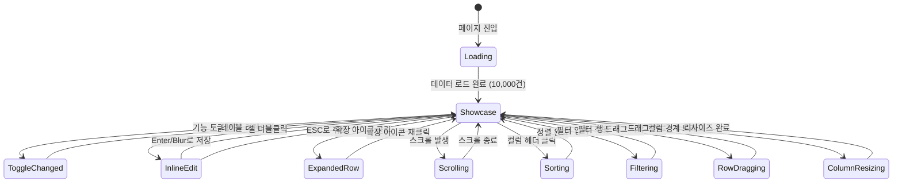

# TSK-06-20 - 데이터 테이블 종합 UI 설계

## 문서 정보

| 항목 | 내용 |
|------|------|
| Task ID | TSK-06-20 |
| 문서 버전 | 1.0 |
| 작성일 | 2026-01-23 |
| 상태 | 작성완료 |
| 참조 설계 문서 | PRD 4.1.1 테이블 기능 샘플 |

---

## 1. 화면 목록

| 화면 ID | 화면명 | 목적 | SVG 참조 |
|---------|--------|------|----------|
| SCR-01 | 데이터 테이블 쇼케이스 | 기본 화면 (전체 기능 활성화) | `screen-01-showcase.svg` |
| SCR-02 | 인라인 편집 중 | 셀 편집 상태 | `screen-02-inline-edit.svg` |
| SCR-03 | 확장 행 열림 | 행 확장 상태 | `screen-03-expanded-row.svg` |
| SCR-04 | 가상 스크롤 | 1만건 데이터 스크롤 | `screen-04-virtual-scroll.svg` |

---

## 2. 화면 전환 흐름



### 액션-화면 매트릭스

| 현재 상태 | 액션 | 다음 상태 | 비고 |
|----------|------|----------|------|
| Loading | 10,000건 데이터 로드 | Showcase | 가상 스크롤 활성화 |
| Showcase | 기능 토글 ON/OFF | Showcase | 해당 기능 즉시 반영 |
| Showcase | 셀 더블클릭 | InlineEdit | 인라인 편집 모드 진입 |
| InlineEdit | Enter 키 / Blur | Showcase | 변경사항 저장 |
| InlineEdit | ESC 키 | Showcase | 변경사항 취소 |
| Showcase | 확장 아이콘 클릭 | ExpandedRow | 상세 정보 표시 |
| ExpandedRow | 확장 아이콘 재클릭 | Showcase | 상세 정보 숨김 |
| Showcase | 마우스 휠 스크롤 | Scrolling | 가상 스크롤 렌더링 |
| Showcase | 컬럼 헤더 클릭 | Sorting | 정렬 적용 |
| Showcase | 필터 드롭다운 선택 | Filtering | 필터 적용 |
| Showcase | 행 드래그 | RowDragging | 순서 변경 |
| Showcase | 컬럼 경계 드래그 | ColumnResizing | 너비 조절 |
| Showcase | 설정 초기화 클릭 | Showcase | 모든 토글 기본값 |

---

## 3. 화면별 상세

### 3.1 SCR-01: 데이터 테이블 쇼케이스

**화면 목적:**
DataTable의 12가지 고급 기능을 실시간으로 토글하며 테스트할 수 있는 쇼케이스 화면. 1만건의 Mock 데이터로 대용량 처리 성능도 검증한다.

**레이아웃:**

```
┌─────────────────────────────────────────────────────────────────────────────────────┐
│ 데이터 테이블 종합 (DataTable Showcase)                             [설정 초기화]  │
├─────────────────────────────────────────────────────────────────────────────────────┤
│ 기능 토글 패널                                                                      │
│ ┌─────────────────────────────────────────────────────────────────────────────────┐ │
│ │ [o] 정렬      [o] 필터링    [o] 페이징    [o] 행 선택   [o] 컬럼 리사이즈       │ │
│ │ [o] 고정 컬럼  [o] 확장 행   [o] 인라인 편집 [o] 행 드래그 [o] 가상 스크롤      │ │
│ │ [o] 그룹 헤더  [o] 셀 병합                                                      │ │
│ └─────────────────────────────────────────────────────────────────────────────────┘ │
├─────────────────────────────────────────────────────────────────────────────────────┤
│                                                                                     │
│ ┌───┬─────────────────────────────────┬───────────────────────────────────────────┐ │
│ │   │           기본정보               │              실적정보                    │ │
│ ├───┼───────┬──────────┬──────────────┼────────┬────────┬────────┬───────┬───────┤ │
│ │ = │ ☐ │ > │ ID      │ 품목코드     │ 품목명 │ 목표   │ 실적   │ 달성률│생산일 │담당자│
│ ├───┼───┼───┼─────────┼──────────────┼────────┼────────┼────────┼───────┼───────┤ │
│ │ ≡ │ ☐ │ > │ 1       │ PRD-001      │ 제품A  │ 100    │ 95     │ 95%   │01-20  │김생산│
│ │ ≡ │ ☐ │ > │ 2       │ PRD-002      │ 제품B  │ 200    │ 210    │ 105%  │01-20  │이품질│
│ │ ≡ │ ☐ │ > │ 3       │ PRD-003      │ 제품C  │ 150    │ 148    │ 99%   │01-20  │박설비│
│ │ ≡ │ ☐ │ > │ 4       │ PRD-004      │ 제품A  │ 100    │ 102    │ 102%  │01-21  │김생산│
│ │ ≡ │ ☐ │ > │ 5       │ PRD-005      │ 제품D  │ 80     │ 75     │ 94%   │01-21  │정공정│
│ │   │   │   │ ...     │ ...          │ ...    │ ...    │ ...    │ ...   │...    │...   │
│ └───┴───┴───┴─────────┴──────────────┴────────┴────────┴────────┴───────┴───────┘ │
│                                                                                     │
│  ┌─────────────────────────────────────────────────────────────────────────────────┐ │
│  │ 총 10,000건          [20 ▼] 건/페이지    [<] [1] [2] [3] ... [500] [>]         │ │
│  └─────────────────────────────────────────────────────────────────────────────────┘ │
└─────────────────────────────────────────────────────────────────────────────────────┘
```

**컴포넌트 구성:**

| 영역 | 컴포넌트 | Ant Design | Props/설정 |
|------|----------|------------|-----------|
| 페이지 헤더 | 제목 + 버튼 | `Typography.Title` + `Button` | level={4}, type="default" |
| 기능 토글 패널 | 카드 + 스위치 그리드 | `Card` + `Switch` | Grid 배치, 12개 토글 |
| 테이블 | 데이터 테이블 | `Table` | 모든 기능 props 동적 적용 |
| 그룹 헤더 | 2단 컬럼 헤더 | `Table.Column` | children 사용 |
| 드래그 핸들 | 순서 변경 | `@dnd-kit/sortable` | 행 드래그 앤 드롭 |
| 리사이즈 핸들 | 컬럼 너비 조절 | `react-resizable` | 컬럼 경계 드래그 |
| 페이지네이션 | 페이징 컨트롤 | `Table` 내장 | pagination prop |

**12가지 기능 토글:**

| 기능 | 토글 키 | 기본값 | 설명 |
|------|---------|--------|------|
| 정렬 | `sortable` | ON | 컬럼 헤더 클릭으로 정렬 |
| 필터링 | `filterable` | ON | 컬럼별 필터 드롭다운 |
| 페이징 | `pagination` | ON | 페이지네이션 표시 |
| 행 선택 | `rowSelection` | ON | 체크박스 다중 선택 |
| 컬럼 리사이즈 | `resizable` | ON | 컬럼 너비 드래그 조절 |
| 고정 컬럼 | `fixedColumn` | ON | ID 컬럼 좌측 고정 |
| 확장 행 | `expandable` | ON | 행 클릭 시 상세 표시 |
| 인라인 편집 | `editable` | ON | 셀 더블클릭 편집 |
| 행 드래그 | `draggable` | ON | 행 순서 드래그 변경 |
| 가상 스크롤 | `virtualScroll` | ON | 1만건 가상 렌더링 |
| 그룹 헤더 | `groupHeader` | ON | 기본정보/실적정보 그룹 |
| 셀 병합 | `cellMerge` | ON | 동일 값 자동 병합 |

**상태 정의:**

| 상태 | 설명 | 시각적 표현 |
|------|------|------------|
| 기본 | 모든 기능 활성화 | 12개 토글 ON (파란색) |
| 토글 변경 | 일부 기능 비활성화 | 해당 토글 OFF (회색) |
| 로딩 | 초기 데이터 로드 중 | 테이블 스피너 표시 |
| 스크롤 중 | 가상 스크롤 렌더링 | 스크롤 위치 반영 |

**액션 정의:**

| 액션 | 트리거 | 결과 |
|------|--------|------|
| 기능 토글 | Switch 클릭 | 해당 기능 ON/OFF |
| 설정 초기화 | 버튼 클릭 | 모든 토글 기본값 복원 |
| 정렬 | 컬럼 헤더 클릭 | 오름차순/내림차순 전환 |
| 필터 | 필터 드롭다운 선택 | 데이터 필터링 |
| 행 선택 | 체크박스 클릭 | 선택/해제 |
| 페이지 이동 | 페이지 번호 클릭 | 해당 페이지 데이터 표시 |

---

### 3.2 SCR-02: 인라인 편집 중

**화면 목적:**
테이블 셀을 더블클릭하여 인라인 편집 모드로 진입한 상태. 텍스트 입력, 숫자 입력, 선택 등 다양한 편집 UI를 보여준다.

**레이아웃:**

```
┌─────────────────────────────────────────────────────────────────────────────────────┐
│                              ... (기능 토글 패널) ...                               │
├─────────────────────────────────────────────────────────────────────────────────────┤
│ ┌───┬───┬───┬─────────┬──────────────┬─────────────────┬────────┬───────┬─────────┐ │
│ │ = │ ☐ │ > │ ID      │ 품목코드     │ 품목명          │ 목표   │ 실적  │ ...     │ │
│ ├───┼───┼───┼─────────┼──────────────┼─────────────────┼────────┼───────┼─────────┤ │
│ │ ≡ │ ☐ │ > │ 1       │ PRD-001      │ 제품A           │ 100    │ 95    │ ...     │ │
│ │ ≡ │ ☑ │ > │ 2       │ PRD-002      │ ┌─────────────┐ │ 200    │ 210   │ ...     │ │
│ │   │   │   │         │              │ │ 제품B-신규  │ │        │       │ ...     │ │
│ │   │   │   │         │              │ └─────────────┘ │        │       │ ...     │ │
│ │ ≡ │ ☐ │ > │ 3       │ PRD-003      │ 제품C           │ 150    │ 148   │ ...     │ │
│ └───┴───┴───┴─────────┴──────────────┴─────────────────┴────────┴───────┴─────────┘ │
│                                                                                     │
│  ⓘ 편집 중: Enter로 저장, ESC로 취소                                               │
└─────────────────────────────────────────────────────────────────────────────────────┘
```

**편집 모드 UI:**

| 컬럼 타입 | 편집 컴포넌트 | Ant Design |
|----------|-------------|------------|
| 텍스트 | 텍스트 입력 | `Input` |
| 숫자 | 숫자 입력 | `InputNumber` |
| 선택 | 드롭다운 | `Select` |
| 날짜 | 날짜 선택 | `DatePicker` |

**상태 정의:**

| 상태 | 설명 | 시각적 표현 |
|------|------|------------|
| 편집 중 | 셀 편집 모드 | 파란색 테두리 Input |
| 유효성 오류 | 잘못된 입력 | 빨간색 테두리 + 에러 메시지 |
| 저장 완료 | 편집 완료 | 셀 하이라이트 (fade out) |

---

### 3.3 SCR-03: 확장 행 열림

**화면 목적:**
행의 확장 아이콘을 클릭하여 상세 정보가 펼쳐진 상태. 중첩 테이블이나 상세 카드를 표시한다.

**레이아웃:**

```
┌─────────────────────────────────────────────────────────────────────────────────────┐
│                              ... (기능 토글 패널) ...                               │
├─────────────────────────────────────────────────────────────────────────────────────┤
│ ┌───┬───┬───┬─────────┬──────────────┬────────┬────────┬────────┬───────┬─────────┐ │
│ │ = │ ☐ │ > │ ID      │ 품목코드     │ 품목명 │ 목표   │ 실적   │ 달성률│ ...     │ │
│ ├───┼───┼───┼─────────┼──────────────┼────────┼────────┼────────┼───────┼─────────┤ │
│ │ ≡ │ ☐ │ v │ 1       │ PRD-001      │ 제품A  │ 100    │ 95     │ 95%   │ ...     │ │
│ ├───┴───┴───┴─────────┴──────────────┴────────┴────────┴────────┴───────┴─────────┤ │
│ │ ┌─────────────────────────────────────────────────────────────────────────────┐ │ │
│ │ │ 상세 정보                                                                   │ │ │
│ │ │ ┌──────────────┬──────────────┬──────────────┬──────────────────────────┐   │ │ │
│ │ │ │ 공정번호     │ 작업시간     │ 불량수       │ 비고                     │   │ │ │
│ │ │ ├──────────────┼──────────────┼──────────────┼──────────────────────────┤   │ │ │
│ │ │ │ OP-01        │ 2.5시간      │ 3개          │ 원자재 품질 이슈         │   │ │ │
│ │ │ │ OP-02        │ 1.8시간      │ 2개          │ -                        │   │ │ │
│ │ │ └──────────────┴──────────────┴──────────────┴──────────────────────────┘   │ │ │
│ │ └─────────────────────────────────────────────────────────────────────────────┘ │ │
│ ├───┬───┬───┬─────────┬──────────────┬────────┬────────┬────────┬───────┬─────────┤ │
│ │ ≡ │ ☐ │ > │ 2       │ PRD-002      │ 제품B  │ 200    │ 210    │ 105%  │ ...     │ │
│ └───┴───┴───┴─────────┴──────────────┴────────┴────────┴────────┴───────┴─────────┘ │
└─────────────────────────────────────────────────────────────────────────────────────┘
```

**확장 행 컴포넌트:**

| 요소 | 컴포넌트 | 설명 |
|------|----------|------|
| 확장 아이콘 | `>` / `v` | 닫힘/열림 상태 표시 |
| 확장 영역 | 중첩 테이블 | 공정별 상세 정보 |
| 배경색 | 연한 회색 | 확장 영역 구분 |

---

### 3.4 SCR-04: 가상 스크롤

**화면 목적:**
1만건 데이터를 가상 스크롤로 렌더링하는 상태. 스크롤바 위치와 현재 렌더링 범위를 표시한다.

**레이아웃:**

```
┌─────────────────────────────────────────────────────────────────────────────────────┐
│                              ... (기능 토글 패널) ...                               │
├─────────────────────────────────────────────────────────────────────────────────────┤
│ ┌───┬───┬───┬─────────┬──────────────┬────────┬────────┬────────┬───────┬───────┐▲│ │
│ │ = │ ☐ │ > │ ID      │ 품목코드     │ 품목명 │ 목표   │ 실적   │ 달성률│담당자 │█│ │
│ ├───┼───┼───┼─────────┼──────────────┼────────┼────────┼────────┼───────┼───────┤█│ │
│ │ ≡ │ ☐ │ > │ 5,001   │ PRD-5001     │ 제품E  │ 120    │ 118    │ 98%   │김생산 │█│ │
│ │ ≡ │ ☐ │ > │ 5,002   │ PRD-5002     │ 제품F  │ 90     │ 92     │ 102%  │이품질 │█│ │
│ │ ≡ │ ☐ │ > │ 5,003   │ PRD-5003     │ 제품G  │ 180    │ 175    │ 97%   │박설비 │█│ │
│ │ ≡ │ ☐ │ > │ 5,004   │ PRD-5004     │ 제품H  │ 110    │ 115    │ 105%  │정공정 │ │ │
│ │ ≡ │ ☐ │ > │ 5,005   │ PRD-5005     │ 제품I  │ 140    │ 138    │ 99%   │최품질 │ │ │
│ │ ≡ │ ☐ │ > │ 5,006   │ PRD-5006     │ 제품J  │ 160    │ 162    │ 101%  │강생산 │ │ │
│ │ ...                                                                          │ │ │
│ └───┴───┴───┴─────────┴──────────────┴────────┴────────┴────────┴───────┴───────┘▼│ │
│                                                                                     │
│  ⓘ 현재 표시: 5,001 ~ 5,020 / 총 10,000건   스크롤 위치: 50%                       │
└─────────────────────────────────────────────────────────────────────────────────────┘
```

**가상 스크롤 정보:**

| 요소 | 설명 | 표시 |
|------|------|------|
| 렌더링 범위 | 현재 화면에 표시된 행 범위 | "5,001 ~ 5,020" |
| 전체 건수 | 총 데이터 건수 | "총 10,000건" |
| 스크롤 위치 | 현재 스크롤 위치 백분율 | "50%" |
| 스크롤바 | 전체 높이 대비 위치 | 세로 스크롤바 |

---

## 4. 공통 컴포넌트

### 4.1 기능 토글 패널

| 요소 | 설명 | 스타일 |
|------|------|--------|
| 카드 컨테이너 | 토글 그룹 래퍼 | Card, 패딩 16px |
| 토글 아이템 | Switch + Label | 가로 배치, gap 24px |
| Switch | ON/OFF 토글 | Ant Design Switch |
| Label | 기능명 텍스트 | 14px, 회색 (비활성 시) |

### 4.2 그룹 헤더 (2단 컬럼 헤더)

| 요소 | 설명 | 스타일 |
|------|------|--------|
| 상단 그룹 | 기본정보 / 실적정보 | 배경색 구분, border-bottom |
| 하단 컬럼 | 개별 컬럼명 | 일반 헤더 스타일 |
| 구분선 | 그룹 간 경계 | 1px solid #d9d9d9 |

### 4.3 드래그 핸들

| 요소 | 설명 | 스타일 |
|------|------|--------|
| 핸들 아이콘 | 6점 그리퍼 | ≡ 또는 ::: |
| 호버 상태 | 커서 변경 | cursor: grab |
| 드래그 중 | 행 하이라이트 | 배경색 primary-1 |

### 4.4 셀 병합

| 요소 | 설명 | 스타일 |
|------|------|--------|
| 병합된 셀 | 동일 값 자동 병합 | rowSpan 적용 |
| 첫 번째 셀 | 병합 시작점 | 수직 중앙 정렬 |
| 이후 셀 | 렌더링 생략 | colSpan=0 |

### 4.5 로딩 상태

| 요소 | 설명 | 스타일 |
|------|------|--------|
| 테이블 로딩 | 데이터 로드 중 | Spin 오버레이 |
| 스켈레톤 | 초기 로딩 | Skeleton.Table |

### 4.6 토스트 알림

| 유형 | 메시지 | 아이콘 |
|------|--------|--------|
| 성공 | "저장되었습니다" | 녹색 체크 |
| 경고 | "변경사항이 있습니다" | 노란색 경고 |
| 정보 | "기능이 활성화되었습니다" | 파란색 정보 |

---

## 5. 반응형 설계

### 5.1 Breakpoint 정의

| Breakpoint | 크기 | 설명 |
|------------|------|------|
| Desktop XL | 1440px+ | 모든 컬럼, 토글 3행 표시 |
| Desktop | 1024-1439px | 모든 컬럼, 토글 2행 표시 |
| Tablet | 768-1023px | 가로 스크롤, 토글 4행 표시 |
| Mobile | 767px- | 주요 컬럼만, 토글 6행 표시 |

### 5.2 반응형 동작

| 화면 크기 | 토글 패널 | 테이블 | 그룹 헤더 |
|----------|----------|--------|----------|
| Desktop XL | 1행 6열 x 2 | 전체 컬럼 | 표시 |
| Desktop | 1행 5열 x 3 | 전체 컬럼 | 표시 |
| Tablet | 1행 3열 x 4 | 가로 스크롤 | 숨김 (단일 헤더) |
| Mobile | 1행 2열 x 6 | 가로 스크롤 + 주요 컬럼만 | 숨김 |

### 5.3 컬럼 우선순위

| 우선순위 | 컬럼 | 최소 화면 |
|----------|------|----------|
| 1 | ID, 품목명 | Mobile (320px) |
| 2 | 목표, 실적 | Tablet (768px) |
| 3 | 달성률, 생산일 | Desktop (1024px) |
| 4 | 품목코드, 담당자 | Desktop XL (1440px) |

---

## 6. 접근성

### 6.1 키보드 네비게이션

| 키 | 동작 |
|-----|------|
| Tab | 토글 간 이동 → 테이블 → 페이지네이션 |
| Space | 토글 ON/OFF, 체크박스 선택 |
| Enter | 정렬 실행, 페이지 이동 |
| Arrow Up/Down | 테이블 행 간 이동 |
| Arrow Left/Right | 셀 간 이동 |
| F2 | 현재 셀 편집 모드 |
| ESC | 편집 취소, 확장 닫기 |

### 6.2 ARIA 속성

| 요소 | ARIA 속성 | 값 |
|------|----------|-----|
| 기능 토글 | role | switch |
| 토글 | aria-checked | true/false |
| 테이블 | role | grid |
| 정렬 헤더 | aria-sort | ascending/descending/none |
| 확장 버튼 | aria-expanded | true/false |
| 편집 셀 | aria-label | "셀 편집: [컬럼명]" |
| 드래그 핸들 | aria-label | "행 순서 변경 드래그" |

### 6.3 스크린 리더 지원

| 상황 | 읽어주는 내용 |
|------|-------------|
| 토글 변경 | "정렬 기능 활성화됨" / "정렬 기능 비활성화됨" |
| 정렬 적용 | "품목명 컬럼 오름차순 정렬됨" |
| 행 확장 | "상세 정보 펼쳐짐, 2개 하위 행 있음" |
| 편집 모드 | "품목명 편집 중, 현재 값: 제품A" |
| 가상 스크롤 | "5001번째에서 5020번째 행 표시 중, 총 10000건" |

### 6.4 색상 대비

| 요소 | 전경색 | 배경색 | 대비율 |
|------|--------|--------|--------|
| 테이블 텍스트 | #333333 | #FFFFFF | 12.6:1 |
| 헤더 텍스트 | #333333 | #FAFAFA | 11.5:1 |
| 토글 ON 텍스트 | #FFFFFF | #1677FF | 4.6:1 |
| 선택된 행 | #333333 | #E6F4FF | 10.8:1 |
| 비활성 토글 | #8C8C8C | #FFFFFF | 4.7:1 |

---

## 7. Mock 데이터 구조

### 7.1 테이블 데이터 (10,000건)

```typescript
interface ProductionRecord {
  id: number;                    // 1 ~ 10000
  productCode: string;           // PRD-XXXX
  productName: string;           // 제품A ~ 제품Z 순환
  target: number;                // 80 ~ 200 랜덤
  actual: number;                // target * (0.9 ~ 1.1)
  achievementRate: string;       // (actual/target * 100).toFixed(0) + '%'
  productionDate: string;        // 01-01 ~ 01-31 순환
  manager: string;               // 김생산, 이품질, 박설비, 정공정, 최품질 순환
}
```

### 7.2 확장 행 상세 데이터

```typescript
interface ProcessDetail {
  processNumber: string;         // OP-01, OP-02
  workingTime: string;           // X.X시간
  defectCount: number;           // 0 ~ 5
  remarks: string;               // 비고 텍스트
}
```

---

## 8. SVG 파일 목록

| 파일명 | 화면 | 상태 |
|--------|------|------|
| `screen-01-showcase.svg` | 데이터 테이블 쇼케이스 | 기본 (전체 기능 활성화) |
| `screen-02-inline-edit.svg` | 인라인 편집 중 | 셀 편집 모드 |
| `screen-03-expanded-row.svg` | 확장 행 열림 | 상세 정보 표시 |
| `screen-04-virtual-scroll.svg` | 가상 스크롤 | 중간 스크롤 상태 (5000번대) |

---

## 변경 이력

| 버전 | 일자 | 작성자 | 변경 내용 |
|------|------|--------|----------|
| 1.0 | 2026-01-23 | Claude | 최초 작성 |
