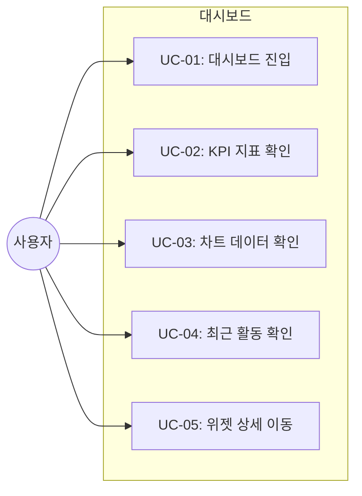
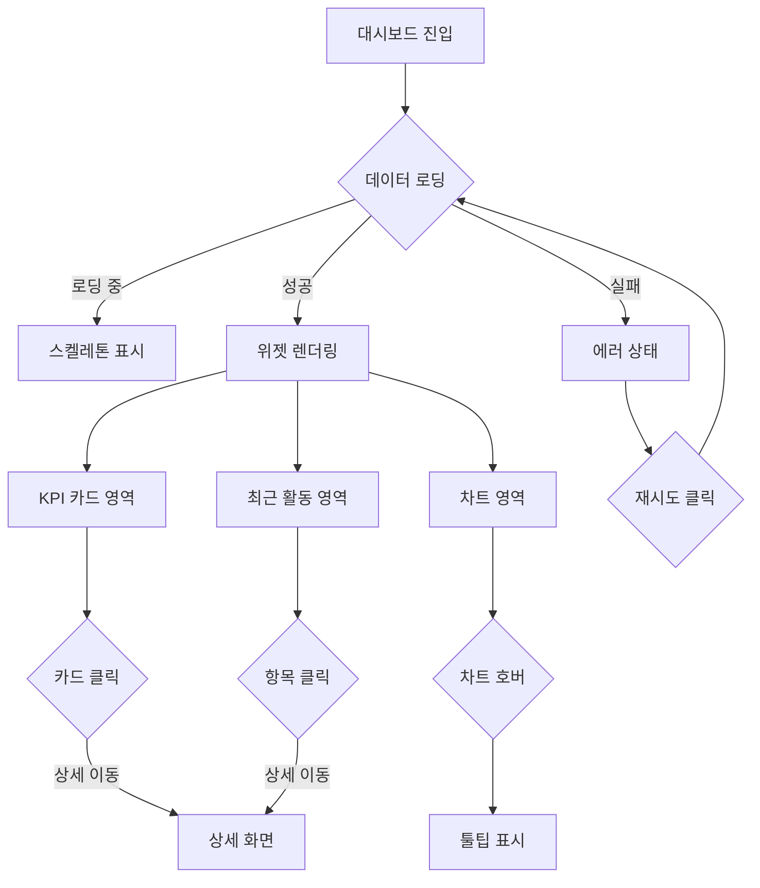
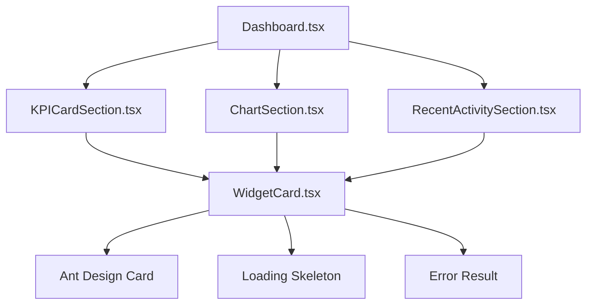

# TSK-07-01 - 대시보드 레이아웃 설계 문서

## 문서 정보

| 항목 | 내용 |
|------|------|
| Task ID | TSK-07-01 |
| 문서 버전 | 1.0 |
| 작성일 | 2026-01-21 |
| 상태 | 작성중 |
| 카테고리 | development |

---

## 1. 개요

### 1.1 배경 및 문제 정의

**현재 상황:**
- MES Portal의 핵심 화면인 대시보드 화면이 아직 구현되지 않음
- PRD에서 요구하는 실시간 생산 현황 요약, KPI 지표, 라인별 상태 표시 기능 필요
- 대시보드 화면 템플릿(위젯 기반 레이아웃)의 기본 구조 구현 필요

**해결하려는 문제:**
- 대시보드 위젯 배치를 위한 반응형 그리드 레이아웃 시스템 구축
- KPI 카드, 차트, 최근 활동 등 위젯 영역의 명확한 구분
- 다양한 화면 크기(데스크톱, 태블릿, 모바일)에서 최적화된 레이아웃 제공
- 확장 가능한 위젯 기반 아키텍처 설계

### 1.2 목적 및 기대 효과

**목적:**
- 대시보드 화면의 기본 레이아웃 구조 구현 (screens/dashboard/Dashboard.tsx)
- 위젯 기반 반응형 그리드 레이아웃 시스템 구축
- KPI 카드 영역, 차트 영역, 최근 활동 영역의 배치 구조 정의
- 후속 Task(TSK-07-02, TSK-07-03)의 기반 레이아웃 제공

**기대 효과:**
- 사용자 관점: 한 눈에 생산 현황을 파악할 수 있는 직관적인 대시보드 화면
- 개발자 관점: 확장 가능한 위젯 기반 레이아웃 템플릿 제공
- 비즈니스 관점: 실시간 생산 현황 가시화를 통한 의사결정 지원 기반 마련

### 1.3 범위

**포함:**
- 대시보드 레이아웃 컴포넌트 (Dashboard.tsx)
- 반응형 그리드 시스템 (Ant Design Row, Col 활용)
- KPI 카드 영역 (상단 4개 카드 영역)
- 차트 영역 (중앙 2개 차트 영역)
- 최근 활동 영역 (하단 1개 리스트 영역)
- 위젯 컨테이너 (WidgetCard) 공통 컴포넌트
- 반응형 breakpoint 설정 (xs, sm, md, lg, xl)

**제외:**
- 실제 KPI 데이터 및 로직 (TSK-07-02에서 구현)
- 실제 차트 컴포넌트 (TSK-07-03에서 구현)
- 실시간 데이터 연동 (Phase 2)
- 위젯 드래그 앤 드롭 재배치 (향후 확장)
- 위젯 사용자 설정 저장 (향후 확장)

### 1.4 참조 문서

| 문서 | 경로 | 관련 섹션 |
|------|------|----------|
| PRD | `.orchay/projects/mes-portal/prd.md` | 4.1.2 대시보드, 4.1.1 대시보드 화면 템플릿 |
| TRD | `.orchay/projects/mes-portal/trd.md` | 1.2 UI/스타일링 스택, 7. PRD 요구사항 - 대시보드/차트 |
| TSK-00-02 | `.orchay/projects/mes-portal/tasks/TSK-00-02/` | UI 라이브러리 및 테마 설정 |

---

## 2. 사용자 분석

### 2.1 대상 사용자

| 사용자 유형 | 특성 | 주요 니즈 |
|------------|------|----------|
| 공장장/관리자 | 전체 생산 현황 관리, 의사결정 역할 | 핵심 KPI 한눈에 파악, 이상 징후 빠른 감지 |
| 생산 담당자 | 라인별 생산 관리 | 담당 라인 생산량 확인, 목표 대비 진척 확인 |
| 품질 담당자 | 품질 지표 모니터링 | 불량률 추이 확인, 품질 이슈 감지 |
| 설비 담당자 | 설비 가동 상태 모니터링 | 설비 가동률 확인, 정지 설비 파악 |

### 2.2 사용자 페르소나

**페르소나 1: 공장장 김공장**
- 역할: 전체 생산 현황 총괄 관리
- 목표: 매일 아침 주요 KPI 확인, 이상 시 빠른 조치 지시
- 불만: 여러 화면을 돌아다니며 정보 수집 번거로움
- 시나리오: 로그인 후 대시보드에서 가동률, 불량률, 생산량 확인 후 문제 라인 파악

**페르소나 2: 생산 담당자 박생산**
- 역할: 특정 생산 라인 관리
- 목표: 담당 라인의 시간별 생산량 추이 확인
- 불만: 수치만으로는 추세 파악 어려움
- 시나리오: 대시보드 차트에서 시간별 생산량 그래프 확인, 감소 추세 발견 시 현장 점검

---

## 3. 유즈케이스

### 3.1 유즈케이스 다이어그램



### 3.2 유즈케이스 상세

#### UC-01: 대시보드 진입

| 항목 | 내용 |
|------|------|
| 액터 | 모든 사용자 |
| 목적 | 생산 현황 요약 정보 확인 |
| 사전 조건 | 로그인 완료, 대시보드 메뉴 접근 권한 |
| 사후 조건 | 대시보드 화면에 위젯들이 표시됨 |
| 트리거 | 로그인 후 자동 이동 또는 메뉴 클릭 |

**기본 흐름:**
1. 사용자가 로그인하거나 대시보드 메뉴를 클릭한다
2. 시스템이 대시보드 화면을 로드한다
3. 시스템이 각 위젯 영역에 로딩 상태를 표시한다
4. 데이터 로드 완료 후 각 위젯에 정보가 표시된다
5. 반응형 레이아웃이 현재 화면 크기에 맞게 적용된다

#### UC-02: KPI 지표 확인

| 항목 | 내용 |
|------|------|
| 액터 | 관리자, 담당자 |
| 목적 | 주요 KPI 수치 한눈에 확인 |
| 사전 조건 | 대시보드 화면 표시 |
| 사후 조건 | KPI 카드에 최신 수치 표시 |
| 트리거 | 대시보드 진입 시 자동 |

**기본 흐름:**
1. 대시보드 상단에 4개의 KPI 카드가 배치된다
2. 각 카드에 KPI 수치와 증감률이 표시된다 (가동률, 불량률, 생산량, 달성률)
3. 증감률에 따라 색상이 다르게 표시된다 (증가: 녹색, 감소: 빨간색)
4. 사용자가 특정 KPI 카드 클릭 시 상세 화면으로 이동 (향후 확장)

#### UC-03: 차트 데이터 확인

| 항목 | 내용 |
|------|------|
| 액터 | 관리자, 담당자 |
| 목적 | 생산 추이 및 분포 시각적 확인 |
| 사전 조건 | 대시보드 화면 표시 |
| 사후 조건 | 차트에 데이터 시각화 |
| 트리거 | 대시보드 진입 시 자동 |

**기본 흐름:**
1. 대시보드 중앙에 2개의 차트 위젯이 배치된다
2. 좌측 차트: 시간별 생산량 추이 (라인 차트)
3. 우측 차트: 라인별 생산 실적 (바 차트)
4. 차트 위에 마우스 호버 시 툴팁으로 상세 수치 표시

#### UC-04: 최근 활동 확인

| 항목 | 내용 |
|------|------|
| 액터 | 관리자, 담당자 |
| 목적 | 최근 시스템 활동/이벤트 확인 |
| 사전 조건 | 대시보드 화면 표시 |
| 사후 조건 | 최근 활동 목록 표시 |
| 트리거 | 대시보드 진입 시 자동 |

**기본 흐름:**
1. 대시보드 하단에 최근 활동 위젯이 배치된다
2. 시간순으로 최근 이벤트/활동 목록이 표시된다
3. 각 항목에 시간, 유형, 내용이 표시된다
4. 스크롤로 추가 항목 확인 가능

#### UC-05: 위젯 상세 이동

| 항목 | 내용 |
|------|------|
| 액터 | 관리자, 담당자 |
| 목적 | 특정 위젯의 상세 정보 확인 |
| 사전 조건 | 대시보드 화면 표시 |
| 사후 조건 | 관련 상세 화면으로 이동 |
| 트리거 | 위젯 헤더의 "더보기" 클릭 |

**기본 흐름:**
1. 사용자가 위젯 헤더의 "더보기" 링크를 클릭한다
2. 해당 위젯의 상세 화면이 MDI 탭으로 열린다
3. 상세 화면에서 추가 필터링 및 분석 가능

---

## 4. 사용자 시나리오

### 4.1 시나리오 1: 아침 생산 현황 점검

**상황 설명:**
공장장 김공장이 출근 후 당일 생산 현황을 점검하기 위해 대시보드를 확인한다.

**단계별 진행:**

| 단계 | 사용자 행동 | 시스템 반응 | 사용자 기대 |
|------|-----------|------------|------------|
| 1 | 로그인 완료 | 대시보드 화면 자동 표시 | 홈 화면으로 대시보드 |
| 2 | KPI 카드 확인 | 가동률 92%, 불량률 1.2% 표시 | 주요 지표 한눈에 파악 |
| 3 | 생산량 차트 확인 | 시간별 생산량 그래프 표시 | 생산 추이 확인 |
| 4 | 최근 활동 확인 | 설비 점검, 품질 이슈 등 이벤트 | 주의 필요 사항 파악 |
| 5 | 불량률 KPI 클릭 | 품질 상세 화면 이동 (향후) | 상세 분석 진입 |

**성공 조건:**
- 모든 위젯이 정상적으로 로드됨
- KPI 수치가 명확하게 표시됨
- 차트가 올바르게 렌더링됨

### 4.2 시나리오 2: 모바일 대시보드 확인

**상황 설명:**
생산 담당자 박생산이 현장에서 태블릿으로 대시보드를 확인한다.

**단계별 진행:**

| 단계 | 사용자 행동 | 시스템 반응 | 사용자 기대 |
|------|-----------|------------|------------|
| 1 | 태블릿으로 접속 | 반응형 레이아웃 적용 | 화면에 맞는 배치 |
| 2 | 세로 모드 확인 | KPI 카드 2열 배치 | 터치 친화적 크기 |
| 3 | 아래로 스크롤 | 차트 → 최근 활동 순 | 순차적 정보 확인 |
| 4 | 차트 터치 | 툴팁 표시 | 상세 수치 확인 |

**성공 조건:**
- 반응형 레이아웃이 정상 동작
- 터치 인터랙션이 원활함
- 콘텐츠가 잘리지 않음

### 4.3 시나리오 3: 대시보드 데이터 로딩 실패

**상황 설명:**
네트워크 문제로 대시보드 데이터 로딩이 실패하는 경우

**단계별 진행:**

| 단계 | 사용자 행동 | 시스템 반응 | 복구 방법 |
|------|-----------|------------|----------|
| 1 | 대시보드 진입 | 로딩 스켈레톤 표시 | - |
| 2 | - | 데이터 로드 실패 | 에러 표시 |
| 3 | - | 위젯별 에러 상태 표시 | "재시도" 버튼 |
| 4 | 재시도 버튼 클릭 | 데이터 다시 로드 | 새로고침 |

---

## 5. 화면 설계

### 5.1 화면 흐름도



### 5.2 화면별 상세

#### 화면 1: 대시보드 메인 화면

**화면 목적:**
생산 현황을 한눈에 파악할 수 있는 위젯 기반 대시보드. KPI 카드, 차트, 최근 활동을 영역별로 배치.

**진입 경로:**
- 로그인 후 기본 화면 (홈)
- 사이드바 메뉴: 대시보드
- MDI 탭으로 열림
- 경로: /dashboard

**와이어프레임:**
```
+-----------------------------------------------------------------------------------+
|                                                                                   |
|  +-----------------------------------------------------------------------------+  |
|  |                        대시보드 (페이지 타이틀)                              |  |
|  +-----------------------------------------------------------------------------+  |
|                                                                                   |
|  +-- KPI 카드 영역 (Row) -----------------------------------------------------+  |
|  |                                                                             |  |
|  |  +-------------+  +-------------+  +-------------+  +-------------+        |  |
|  |  |   가동률    |  |   불량률    |  |   생산량    |  |   달성률    |        |  |
|  |  |             |  |             |  |             |  |             |        |  |
|  |  |   92.5%     |  |   1.2%      |  |  12,500     |  |   85.3%     |        |  |
|  |  |   +2.3%     |  |   -0.3%     |  |   +500      |  |   +5.2%     |        |  |
|  |  |             |  |             |  |             |  |             |        |  |
|  |  +-------------+  +-------------+  +-------------+  +-------------+        |  |
|  |   (Col: 6/24)     (Col: 6/24)     (Col: 6/24)     (Col: 6/24)            |  |
|  |                                                                             |  |
|  +-----------------------------------------------------------------------------+  |
|                                                                                   |
|  +-- 차트 영역 (Row) ---------------------------------------------------------+  |
|  |                                                                             |  |
|  |  +--------------------------------+  +--------------------------------+     |  |
|  |  |        시간별 생산량           |  |       라인별 생산 실적          |     |  |
|  |  |  (WidgetCard)                  |  |  (WidgetCard)                  |     |  |
|  |  |  +----------------------------+|  |  +----------------------------+|     |  |
|  |  |  |                            ||  |  |                            ||     |  |
|  |  |  |     [라인 차트 영역]       ||  |  |      [바 차트 영역]        ||     |  |
|  |  |  |         ___/\___           ||  |  |       ||| ||| |||          ||     |  |
|  |  |  |      __/       \__         ||  |  |       ||| ||| |||          ||     |  |
|  |  |  |                            ||  |  |       ||| ||| |||          ||     |  |
|  |  |  +----------------------------+|  |  +----------------------------+|     |  |
|  |  |                                |  |                                |     |  |
|  |  +--------------------------------+  +--------------------------------+     |  |
|  |         (Col: 12/24)                       (Col: 12/24)                    |  |
|  |                                                                             |  |
|  +-----------------------------------------------------------------------------+  |
|                                                                                   |
|  +-- 최근 활동 영역 (Row) ----------------------------------------------------+  |
|  |                                                                             |  |
|  |  +-----------------------------------------------------------------------+  |  |
|  |  |                         최근 활동                                      |  |  |
|  |  |  (WidgetCard)                                                         |  |  |
|  |  |  +-------------------------------------------------------------------+|  |  |
|  |  |  |  10:30  [설비]  1라인 설비 점검 완료                               ||  |  |
|  |  |  |  10:15  [품질]  2라인 불량률 상승 알림                             ||  |  |
|  |  |  |  09:45  [생산]  3라인 작업 지시 등록                               ||  |  |
|  |  |  |  09:30  [설비]  4라인 정기 점검 시작                               ||  |  |
|  |  |  |  09:00  [시스템] 일일 리포트 생성                                  ||  |  |
|  |  |  +-------------------------------------------------------------------+|  |  |
|  |  +-----------------------------------------------------------------------+  |  |
|  |                          (Col: 24/24)                                       |  |
|  |                                                                             |  |
|  +-----------------------------------------------------------------------------+  |
|                                                                                   |
+-----------------------------------------------------------------------------------+

범례:
Col: X/24 = Ant Design 24 그리드 시스템 기준 컬럼 span
WidgetCard = 위젯 컨테이너 공통 컴포넌트 (Card 기반)
```

**화면 요소 설명:**

| 영역 | 설명 | Ant Design 컴포넌트 | 사용자 인터랙션 |
|------|------|-------------------|----------------|
| 페이지 타이틀 | 대시보드 제목 | Typography.Title | - |
| KPI 카드 영역 | 4개의 KPI 지표 카드 | Row + Col(span=6) | 카드 클릭 시 상세 이동 |
| 가동률 카드 | 설비 가동률 표시 | Card + Statistic | 클릭 시 설비 상세 |
| 불량률 카드 | 품질 불량률 표시 | Card + Statistic | 클릭 시 품질 상세 |
| 생산량 카드 | 일일 생산량 표시 | Card + Statistic | 클릭 시 생산 상세 |
| 달성률 카드 | 목표 달성률 표시 | Card + Statistic | 클릭 시 생산 상세 |
| 차트 영역 | 2개의 차트 위젯 | Row + Col(span=12) | 호버 시 툴팁 |
| 시간별 생산량 | 라인 차트 | Card + Line (@ant-design/charts) | 데이터 포인트 호버 |
| 라인별 실적 | 바 차트 | Card + Column (@ant-design/charts) | 바 호버 |
| 최근 활동 영역 | 활동 목록 | Card + List | 항목 클릭 시 상세 |

#### 화면 2: WidgetCard 공통 컴포넌트

**화면 목적:**
대시보드 위젯의 일관된 컨테이너 제공. 헤더, 본문, 로딩/에러 상태 처리.

**와이어프레임:**
```
+-----------------------------------------------+
|  제목                              [더보기 >] |  <- 헤더 (선택적)
+-----------------------------------------------+
|                                               |
|               [콘텐츠 영역]                   |  <- children
|                                               |
+-----------------------------------------------+

로딩 상태:
+-----------------------------------------------+
|  제목                                         |
+-----------------------------------------------+
|                                               |
|            [스켈레톤 / 스피너]                |
|                                               |
+-----------------------------------------------+

에러 상태:
+-----------------------------------------------+
|  제목                                         |
+-----------------------------------------------+
|                                               |
|    데이터를 불러오지 못했습니다               |
|              [재시도]                         |
|                                               |
+-----------------------------------------------+
```

**WidgetCard Props:**

| Prop | 타입 | 필수 | 설명 |
|------|------|------|------|
| title | string | 예 | 위젯 제목 |
| extra | ReactNode | 아니오 | 헤더 우측 추가 요소 (더보기 링크 등) |
| loading | boolean | 아니오 | 로딩 상태 |
| error | Error | 아니오 | 에러 상태 |
| onRetry | () => void | 아니오 | 에러 시 재시도 콜백 |
| children | ReactNode | 예 | 위젯 콘텐츠 |

### 5.3 반응형 동작

| 화면 크기 | Breakpoint | KPI 카드 | 차트 | 최근 활동 |
|----------|------------|----------|------|----------|
| 데스크톱 XL (1600px+) | xl | 4열 (span=6) | 2열 (span=12) | 1열 (span=24) |
| 데스크톱 LG (1200-1599px) | lg | 4열 (span=6) | 2열 (span=12) | 1열 (span=24) |
| 태블릿 MD (992-1199px) | md | 2열 (span=12) | 2열 (span=12) | 1열 (span=24) |
| 태블릿 SM (768-991px) | sm | 2열 (span=12) | 1열 (span=24) | 1열 (span=24) |
| 모바일 XS (767px-) | xs | 1열 (span=24) | 1열 (span=24) | 1열 (span=24) |

**반응형 Col span 설정:**
```typescript
// KPI 카드 영역
<Col xs={24} sm={12} md={12} lg={6} xl={6}>

// 차트 영역
<Col xs={24} sm={24} md={12} lg={12} xl={12}>

// 최근 활동 영역
<Col xs={24} sm={24} md={24} lg={24} xl={24}>
```

---

## 6. 인터랙션 설계

### 6.1 사용자 액션과 피드백

| 사용자 액션 | 즉각 피드백 | 결과 피드백 | 에러 피드백 |
|------------|-----------|------------|------------|
| 대시보드 진입 | 스켈레톤 로딩 | 위젯 데이터 표시 | 위젯별 에러 상태 |
| KPI 카드 호버 | 카드 그림자 강조 | - | - |
| KPI 카드 클릭 | 카드 눌림 효과 | 상세 화면 이동 | - |
| 차트 데이터 포인트 호버 | 툴팁 표시 | - | - |
| 최근 활동 항목 호버 | 행 하이라이트 | - | - |
| 최근 활동 항목 클릭 | 행 눌림 효과 | 관련 화면 이동 | - |
| 재시도 버튼 클릭 | 버튼 로딩 | 데이터 재로드 | 에러 메시지 |

### 6.2 상태별 화면 변화

| 상태 | 화면 표시 | 사용자 안내 |
|------|----------|------------|
| 초기 로딩 | 각 위젯별 스켈레톤 | - |
| 데이터 로드 성공 | 실제 데이터 표시 | - |
| 부분 로드 실패 | 성공 위젯 표시 + 실패 위젯 에러 | "일부 데이터를 불러오지 못했습니다" |
| 전체 로드 실패 | 전체 에러 표시 | "대시보드를 불러오지 못했습니다. 재시도해주세요." |
| 데이터 없음 | Empty 컴포넌트 | "표시할 데이터가 없습니다" |
| 자동 새로고침 | 배경 로딩 (UI 유지) | - |

### 6.3 키보드/접근성

| 기능 | 키보드 단축키 | 스크린 리더 안내 |
|------|-------------|-----------------|
| 위젯 간 이동 | Tab | "가동률 위젯", "차트 위젯" 등 |
| 위젯 상세 진입 | Enter | "상세 화면으로 이동" |
| 새로고침 | F5 / Ctrl+R | "대시보드 새로고침" |

---

## 7. 데이터 요구사항

### 7.1 필요한 데이터

| 데이터 | 설명 | 출처 | 용도 |
|--------|------|------|------|
| kpiData | KPI 지표 (가동률, 불량률, 생산량, 달성률) | mock-data/dashboard.json | KPI 카드 표시 |
| productionTrend | 시간별 생산량 추이 | mock-data/dashboard.json | 라인 차트 |
| linePerformance | 라인별 생산 실적 | mock-data/dashboard.json | 바 차트 |
| recentActivities | 최근 활동 목록 | mock-data/dashboard.json | 활동 리스트 |

### 7.2 mock-data/dashboard.json 구조

```json
{
  "kpi": {
    "operationRate": {
      "value": 92.5,
      "unit": "%",
      "change": 2.3,
      "changeType": "increase"
    },
    "defectRate": {
      "value": 1.2,
      "unit": "%",
      "change": -0.3,
      "changeType": "decrease"
    },
    "productionVolume": {
      "value": 12500,
      "unit": "EA",
      "change": 500,
      "changeType": "increase"
    },
    "achievementRate": {
      "value": 85.3,
      "unit": "%",
      "change": 5.2,
      "changeType": "increase"
    }
  },
  "productionTrend": [
    { "time": "08:00", "value": 1200 },
    { "time": "09:00", "value": 1350 },
    { "time": "10:00", "value": 1280 }
  ],
  "linePerformance": [
    { "line": "1라인", "actual": 3200, "target": 3500 },
    { "line": "2라인", "actual": 2800, "target": 3000 },
    { "line": "3라인", "actual": 3100, "target": 3200 }
  ],
  "recentActivities": [
    {
      "id": "act-001",
      "time": "2026-01-21T10:30:00Z",
      "type": "equipment",
      "typeLabel": "설비",
      "message": "1라인 설비 점검 완료"
    }
  ]
}
```

### 7.3 타입 정의

```typescript
// KPI 데이터 타입
interface KPIData {
  value: number;
  unit: string;
  change: number;
  changeType: 'increase' | 'decrease' | 'unchanged';
}

interface DashboardKPI {
  operationRate: KPIData;    // 가동률
  defectRate: KPIData;       // 불량률
  productionVolume: KPIData; // 생산량
  achievementRate: KPIData;  // 달성률
}

// 생산량 추이 데이터
interface ProductionTrendItem {
  time: string;
  value: number;
}

// 라인별 실적 데이터
interface LinePerformanceItem {
  line: string;
  actual: number;
  target: number;
}

// 최근 활동 데이터
interface ActivityItem {
  id: string;
  time: string;
  type: 'equipment' | 'quality' | 'production' | 'system';
  typeLabel: string;
  message: string;
}

// 대시보드 전체 데이터
interface DashboardData {
  kpi: DashboardKPI;
  productionTrend: ProductionTrendItem[];
  linePerformance: LinePerformanceItem[];
  recentActivities: ActivityItem[];
}
```

### 7.4 데이터 유효성 규칙

| 데이터 필드 | 규칙 | 표시 처리 |
|------------|------|----------|
| KPI value | 숫자, 소수점 1자리 | 포맷팅하여 표시 |
| KPI change | 양수/음수 | 양수: +, 녹색 / 음수: -, 빨간색 |
| time | ISO 8601 형식 | 시:분 또는 월-일 시:분 표시 |
| productionTrend | 최소 1개 이상 | 없으면 Empty 표시 |

### 7.5 데이터 서비스 추상화 (TRD 2.3 준수)

> **목적**: Mock 데이터에서 실제 API로 전환 시 변경 최소화

**데이터 페칭 레이어 설계:**

```typescript
// lib/services/dashboard-data-service.ts
interface DashboardDataService {
  getKPIData(): Promise<DashboardKPI>;
  getProductionTrend(): Promise<ProductionTrendItem[]>;
  getLinePerformance(): Promise<LinePerformanceItem[]>;
  getRecentActivities(): Promise<ActivityItem[]>;
}

// Mock 구현 (Phase 1)
class MockDashboardDataService implements DashboardDataService {
  async getKPIData() {
    const data = await import('@/mock-data/dashboard.json');
    return data.kpi;
  }
  // ... 기타 메서드
}

// API 구현 (Phase 2 - 향후)
class ApiDashboardDataService implements DashboardDataService {
  constructor(private apiClient: ApiClient) {}
  async getKPIData() {
    return this.apiClient.get('/api/dashboard/kpi');
  }
  // ... 기타 메서드
}
```

**데이터 로딩 책임 위치:**

| 컴포넌트 | 책임 | 변경 영향 |
|----------|------|----------|
| `page.tsx` | 데이터 서비스 주입 | API 전환 시 서비스 인스턴스만 변경 |
| `Dashboard.tsx` | 서비스 사용, 데이터 분배 | 변경 없음 |
| `*Section.tsx` | 받은 데이터 렌더링 | 변경 없음 |

**Mock/API 전환 전략 (TRD 2.3):**
- 환경변수 `NEXT_PUBLIC_USE_MOCK_DATA`로 분기
- 서비스 팩토리 패턴으로 구현체 선택
- 실제 API 개발 전까지 MockDashboardDataService 사용

---

## 8. 비즈니스 규칙

### 8.1 핵심 규칙

| 규칙 ID | 규칙 설명 | 적용 상황 | 예외 |
|---------|----------|----------|------|
| BR-01 | KPI 위젯은 항상 상단 고정 | 레이아웃 배치 | 없음 |
| BR-02 | 증감률 색상: 증가=녹색, 감소=빨간색 | KPI 표시 | 불량률은 반대 (감소가 긍정) |
| BR-03 | 차트는 최근 8시간 데이터만 표시 | 차트 렌더링 | 데이터 부족 시 있는 만큼만 |
| BR-04 | 최근 활동은 최대 10개 표시 | 활동 목록 | 스크롤로 추가 확인 |
| BR-05 | 위젯별 독립 로딩/에러 처리 | 데이터 로딩 | 한 위젯 실패가 다른 위젯 영향 없음 |

### 8.2 규칙 상세 설명

**BR-02: 증감률 색상 규칙**

설명: 일반적으로 증가는 긍정(녹색), 감소는 부정(빨간색)이지만, 불량률은 반대로 적용된다.

예시:
- 가동률 +2.3% → 녹색 (긍정)
- 불량률 -0.3% → 녹색 (긍정, 불량률 감소는 좋은 것)
- 불량률 +0.5% → 빨간색 (부정, 불량률 증가는 나쁜 것)

**BR-05: 위젯별 독립 처리**

설명: 대시보드는 여러 데이터 소스에서 데이터를 가져오므로, 한 위젯의 로딩 실패가 전체 대시보드를 사용 불가하게 만들면 안 된다.

예시:
- KPI 로드 성공 + 차트 로드 실패 → KPI는 정상 표시, 차트만 에러 상태
- 각 위젯에 개별 재시도 버튼 제공

---

## 9. 에러 처리

### 9.1 예상 에러 상황

| 상황 | 원인 | 사용자 메시지 | 복구 방법 |
|------|------|--------------|----------|
| 대시보드 전체 로드 실패 | JSON 파일 로드 실패 | "대시보드를 불러오지 못했습니다" | 재시도 버튼 |
| KPI 데이터 없음 | 데이터 미존재 | "-" 표시 | 데이터 갱신 대기 |
| 차트 렌더링 실패 | 잘못된 데이터 형식 | "차트를 표시할 수 없습니다" | 재시도 버튼 |
| 최근 활동 없음 | 활동 데이터 없음 | "최근 활동이 없습니다" | Empty 컴포넌트 |

### 9.2 에러 표시 방식

| 에러 유형 | 표시 위치 | 표시 방법 | Ant Design 컴포넌트 |
|----------|----------|----------|-------------------|
| 위젯 데이터 로드 실패 | 해당 위젯 내 | 에러 메시지 + 재시도 버튼 | Result (status="error") |
| 전체 로드 실패 | 페이지 전체 | 에러 페이지 | Result (status="error") |
| 데이터 없음 | 해당 영역 | Empty 컴포넌트 | Empty |

### 9.3 에러 경계(Error Boundary) 전략

> **목적**: BR-05(위젯별 독립 에러 처리) 구현

**Error Boundary 적용 범위:**

```typescript
// WidgetCard에 Error Boundary 내장
<WidgetCard title="가동률" errorFallback={<WidgetError onRetry={...} />}>
  <KPIContent data={operationRate} />
</WidgetCard>
```

**구현 방안:**
- WidgetCard 내부에 React Error Boundary 래핑
- 각 Section 컴포넌트 렌더링 시 개별 에러 격리
- 에러 발생 시 해당 위젯만 에러 상태로 전환, 다른 위젯은 정상 동작

**에러 경계 컴포넌트:**

```typescript
// components/dashboard/WidgetErrorBoundary.tsx
interface WidgetErrorBoundaryProps {
  children: ReactNode;
  fallback?: ReactNode;
  onError?: (error: Error) => void;
}

class WidgetErrorBoundary extends React.Component<WidgetErrorBoundaryProps, { hasError: boolean }> {
  state = { hasError: false };

  static getDerivedStateFromError() {
    return { hasError: true };
  }

  render() {
    if (this.state.hasError) {
      return this.props.fallback ?? <WidgetError />;
    }
    return this.props.children;
  }
}
```

---

## 10. 연관 문서

| 문서 | 경로 | 용도 |
|------|------|------|
| 요구사항 추적 매트릭스 | `025-traceability-matrix.md` | PRD → 설계 → 테스트 추적 |
| 테스트 명세서 | `026-test-specification.md` | 단위/E2E/매뉴얼 테스트 정의 |

---

## 11. 구현 범위

### 11.1 파일 구조

```
mes-portal/
├── app/(portal)/dashboard/
│   └── page.tsx                    # 라우트 페이지
├── components/
│   ├── dashboard/
│   │   ├── Dashboard.tsx           # 메인 대시보드 레이아웃
│   │   ├── WidgetCard.tsx          # 위젯 컨테이너 공통 컴포넌트
│   │   ├── KPICardSection.tsx      # KPI 카드 영역 (4개 카드 배치)
│   │   ├── ChartSection.tsx        # 차트 영역 (2개 차트 배치)
│   │   ├── RecentActivitySection.tsx # 최근 활동 영역
│   │   └── types.ts                # 타입 정의
├── mock-data/
│   └── dashboard.json              # Mock 데이터
```

### 11.2 컴포넌트 구조



### 11.3 영향받는 영역

| 영역 | 변경 내용 | 영향도 |
|------|----------|--------|
| app/(portal)/dashboard/ | 신규 생성 | 높음 |
| components/dashboard/ | 신규 생성 | 높음 |
| mock-data/dashboard.json | 신규 생성 | 중간 |
| 사이드바 메뉴 | 메뉴 항목 추가 | 낮음 |

### 11.4 의존성

| 의존 항목 | 이유 | 상태 |
|----------|------|------|
| TSK-00-02 (UI 라이브러리 설정) | Ant Design Row, Col, Card 사용 | 완료 |
| Ant Design Row, Col | 그리드 레이아웃 | TRD 확인됨 |
| Ant Design Card | 위젯 컨테이너 | TRD 확인됨 |
| Ant Design Skeleton | 로딩 상태 | TRD 확인됨 |
| Ant Design Result | 에러 상태 | TRD 확인됨 |
| Ant Design Empty | 빈 상태 | TRD 확인됨 |

### 11.5 사용할 Ant Design 컴포넌트

| 컴포넌트 | 용도 |
|----------|------|
| Row | 그리드 행 컨테이너 |
| Col | 그리드 열 (반응형 span 설정) |
| Card | 위젯 컨테이너 |
| Skeleton | 로딩 스켈레톤 |
| Spin | 로딩 스피너 |
| Result | 에러/성공 상태 |
| Empty | 데이터 없음 상태 |
| Typography | 타이틀, 텍스트 |
| List | 최근 활동 목록 |
| Tag | 활동 유형 태그 |

### 11.6 제약 사항

| 제약 | 설명 | 대응 방안 |
|------|------|----------|
| Mock 데이터 전용 | 실제 API 연동 없음 | JSON import로 데이터 로드 |
| 레이아웃만 구현 | 실제 KPI/차트는 후속 Task | 플레이스홀더 또는 샘플 데이터 표시 |
| 위젯 재배치 미지원 | 드래그 앤 드롭 없음 | 고정 레이아웃 |

### 11.7 Server/Client Component 구분

| 컴포넌트 | 타입 | 사유 |
|----------|------|------|
| page.tsx | Server Component | 초기 Mock 데이터 로드 |
| Dashboard.tsx | Client Component | Ant Design 컴포넌트 사용 |
| WidgetCard.tsx | Client Component | 인터랙티브 상태 관리 |
| KPICardSection.tsx | Client Component | Ant Design 컴포넌트 |
| ChartSection.tsx | Client Component | 차트 컴포넌트 |
| RecentActivitySection.tsx | Client Component | List 컴포넌트 |

### 11.8 주요 data-testid 정의

| data-testid | 요소 | 용도 |
|-------------|------|------|
| `dashboard-page` | 페이지 컨테이너 | 페이지 로드 확인 |
| `kpi-section` | KPI 카드 영역 | KPI 영역 확인 |
| `kpi-card-operation-rate` | 가동률 카드 | 가동률 표시 확인 |
| `kpi-card-defect-rate` | 불량률 카드 | 불량률 표시 확인 |
| `kpi-card-production-volume` | 생산량 카드 | 생산량 표시 확인 |
| `kpi-card-achievement-rate` | 달성률 카드 | 달성률 표시 확인 |
| `chart-section` | 차트 영역 | 차트 영역 확인 |
| `chart-production-trend` | 시간별 생산량 차트 | 라인 차트 확인 |
| `chart-line-performance` | 라인별 실적 차트 | 바 차트 확인 |
| `recent-activity-section` | 최근 활동 영역 | 활동 영역 확인 |
| `activity-item-{id}` | 활동 항목 | 개별 항목 확인 |
| `widget-card-{name}` | 위젯 카드 | 위젯 컨테이너 확인 |
| `widget-loading` | 위젯 로딩 상태 | 로딩 확인 |
| `widget-error` | 위젯 에러 상태 | 에러 확인 |
| `widget-retry-btn` | 재시도 버튼 | 에러 복구 |

---

## 12. 체크리스트

### 12.1 설계 완료 확인

- [x] 문제 정의 및 목적 명확화
- [x] 사용자 분석 완료
- [x] 유즈케이스 정의 완료
- [x] 사용자 시나리오 작성 완료
- [x] 화면 설계 완료 (와이어프레임)
- [x] 인터랙션 설계 완료
- [x] 데이터 요구사항 정의 완료
- [x] 비즈니스 규칙 정의 완료
- [x] 에러 처리 정의 완료

### 12.2 연관 문서 작성

- [ ] 요구사항 추적 매트릭스 작성 (→ `025-traceability-matrix.md`)
- [ ] 테스트 명세서 작성 (→ `026-test-specification.md`)

### 12.3 구현 준비

- [x] 구현 우선순위 결정
- [x] 의존성 확인 완료 (TSK-00-02)
- [x] 제약 사항 검토 완료

---

## 변경 이력

| 버전 | 일자 | 작성자 | 변경 내용 |
|------|------|--------|----------|
| 1.0 | 2026-01-21 | Claude | 최초 작성 |
