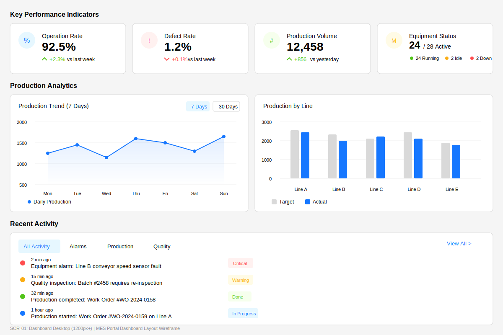
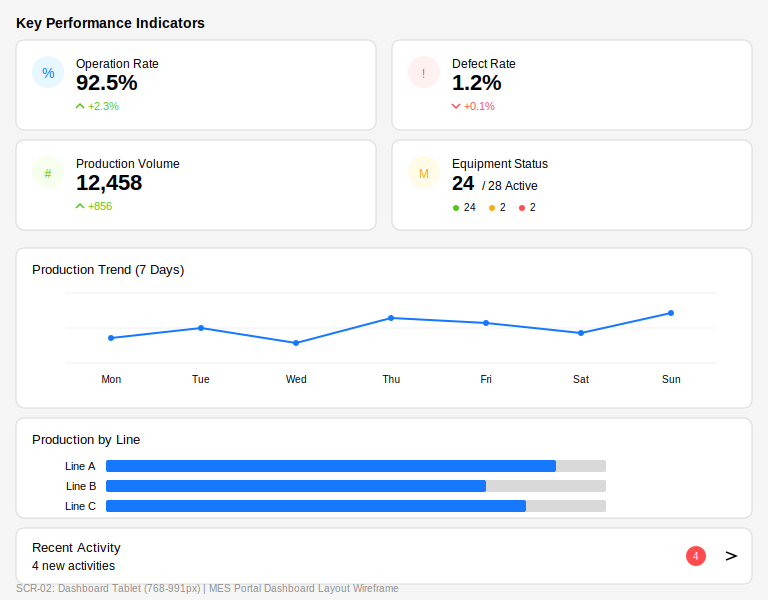
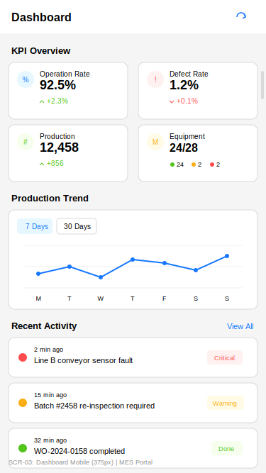

# TSK-07-01 - Dashboard Layout UI Design

## Document Information

| Item | Content |
|------|---------|
| Task ID | TSK-07-01 |
| Task Name | Dashboard Layout |
| Document Version | 1.0 |
| Created | 2026-01-21 |
| Status | Draft |
| Category | development |
| Domain | frontend |

---

## 1. Screen List

| Screen ID | Screen Name | Purpose | SVG Reference |
|-----------|-------------|---------|---------------|
| SCR-01 | Dashboard Desktop | Full dashboard layout for desktop (1200px+) | `screen-01-dashboard-desktop.svg` |
| SCR-02 | Dashboard Tablet | Responsive layout for tablet (768-991px) | `screen-02-dashboard-tablet.svg` |
| SCR-03 | Dashboard Mobile | Compact layout for mobile (375px) | `screen-03-dashboard-mobile.svg` |

---

## 2. Screen Flow

```mermaid
stateDiagram-v2
    [*] --> Loading: Screen Entry
    Loading --> Default: Data Loaded
    Loading --> Error: Load Failed

    Default --> Loading: Refresh (Manual/Auto)
    Default --> Default: Period Filter Change
    Default --> DetailView: KPI Card Click
    Default --> DetailView: Chart Point Click
    Default --> DetailView: Activity Item Click

    DetailView --> Default: Back/Close

    Error --> Loading: Retry
```

### Action-Screen Matrix

| Current State | Action | Next State | Description |
|---------------|--------|------------|-------------|
| Loading | Data load complete | Default | Display all widgets with data |
| Loading | Data load failed | Error | Show error message with retry |
| Default | Manual refresh | Loading | Reload all dashboard data |
| Default | Auto refresh (5s) | Loading | Background data refresh |
| Default | KPI card click | DetailView | Navigate to detailed view |
| Default | Chart period change | Default | Update chart with new period |
| Default | Activity item click | DetailView | Navigate to related screen |
| Error | Retry button click | Loading | Attempt to reload data |

---

## 3. Screen Details

### 3.1 SCR-01: Dashboard Desktop (1200px+)

**Screen Purpose:**
Main dashboard view optimized for desktop displays. Shows comprehensive KPI metrics, production analytics charts, and recent activity feed in a widget-based grid layout.

**Layout:**

```
+--------------------------------------------------------------------------------+
| KEY PERFORMANCE INDICATORS                                                       |
| +------------------+ +------------------+ +------------------+ +------------------+
| |  Operation Rate  | |   Defect Rate    | | Production Vol   | | Equipment Status |
| |      92.5%       | |       1.2%       | |     12,458       | |    24/28 Active  |
| |     +2.3%        | |      +0.1%       | |      +856        | | [O]24 [O]2 [O]2  |
| +------------------+ +------------------+ +------------------+ +------------------+
|                                                                                  |
| PRODUCTION ANALYTICS                                                             |
| +--------------------------------------+ +--------------------------------------+
| | Production Trend (7 Days)            | | Production by Line                   |
| |         [7 Days] [30 Days]           | |                                      |
| |    ^                                 | |  Line A ========== 2800              |
| |    |    *      *                     | |  Line B ======= 2400                 |
| |    |  *   *  *   *  *                | |  Line C ======== 2600                |
| |    +-------------------------->      | |  Line D ========= 2700               |
| |    Mon Tue Wed Thu Fri Sat Sun       | |  Line E ====== 2200                  |
| +--------------------------------------+ +--------------------------------------+
|                                                                                  |
| RECENT ACTIVITY                                                                  |
| +------------------------------------------------------------------------------+
| | [All Activity] [Alarms] [Production] [Quality]                 View All >    |
| |------------------------------------------------------------------------------|
| | [!] 2 min ago  - Line B conveyor speed sensor fault              [Critical]  |
| | [!] 15 min ago - Batch #2458 requires re-inspection              [Warning]   |
| | [v] 32 min ago - Work Order #WO-2024-0158 completed              [Done]      |
| | [i] 1 hour ago - Work Order #WO-2024-0159 started on Line A      [In Progress]|
| +------------------------------------------------------------------------------+
+--------------------------------------------------------------------------------+
```

**Component Composition:**

| Area | Ant Design Component | Props/Configuration |
|------|---------------------|---------------------|
| Container | `Row`, `Col` | gutter={[24, 24]} |
| KPI Cards | `Card`, `Statistic` | bordered, hoverable |
| Trend Indicator | `Tag` | color="success" or "error" |
| Line Chart | `@ant-design/charts Line` | smooth, point.size=4 |
| Bar Chart | `@ant-design/charts Column` | grouped, legend |
| Activity List | `List`, `List.Item` | pagination=false |
| Activity Badge | `Badge`, `Tag` | status colors |
| Tabs | `Tabs` | type="card", size="small" |

**State Definitions:**

| State | Description | Visual Representation |
|-------|-------------|----------------------|
| Loading | Initial data loading | Skeleton placeholders for all widgets |
| Default | Data loaded, normal display | All widgets with actual data |
| Error | Data load failed | Error alert with retry button |
| Refreshing | Background refresh in progress | Subtle loading indicator on title |

**Actions:**

| Action | Trigger | Result |
|--------|---------|--------|
| Refresh | Refresh button / Auto (5s) | Reload all dashboard data |
| Period Change | Chart period selector | Update chart with selected period |
| KPI Click | Click on KPI card | Navigate to detailed metrics view |
| Activity Click | Click on activity item | Navigate to related detail screen |
| Tab Switch | Click activity tab | Filter activity list by category |
| View All | Click "View All" link | Navigate to full activity list |

### 3.2 SCR-02: Dashboard Tablet (768-991px)

**Screen Purpose:**
Responsive dashboard layout optimized for tablet displays. KPI cards are arranged in 2x2 grid, charts are stacked vertically, and activity section is collapsed by default.

**Layout:**

```
+----------------------------------------+
| KEY PERFORMANCE INDICATORS             |
| +----------------+ +----------------+  |
| | Operation Rate | |  Defect Rate   |  |
| |     92.5%      | |     1.2%       |  |
| +----------------+ +----------------+  |
| +----------------+ +----------------+  |
| | Production Vol | | Equipment Stat |  |
| |    12,458      | |   24/28        |  |
| +----------------+ +----------------+  |
|                                        |
| +------------------------------------+ |
| | Production Trend (7 Days)          | |
| | [Chart - Full Width]               | |
| +------------------------------------+ |
|                                        |
| +------------------------------------+ |
| | Production by Line                 | |
| | [Horizontal Bar Chart]             | |
| +------------------------------------+ |
|                                        |
| +------------------------------------+ |
| | Recent Activity        [4] [>]     | |
| | 4 new activities - Tap to expand   | |
| +------------------------------------+ |
+----------------------------------------+
```

**Responsive Adjustments:**

| Element | Desktop | Tablet |
|---------|---------|--------|
| KPI Cards | 4 columns (1 row) | 2 columns (2 rows) |
| Charts | 2 columns side-by-side | 1 column stacked |
| Activity | Full list visible | Collapsed with badge count |
| Card Height | 120px | 90px |
| Font Size | 28px (value) | 22px (value) |

### 3.3 SCR-03: Dashboard Mobile (375px)

**Screen Purpose:**
Compact dashboard layout for mobile devices. All widgets are stacked vertically with reduced visual complexity. Optimized for touch interaction and quick scanning.

**Layout:**

```
+-----------------------------+
| Dashboard            [Refresh]|
|-----------------------------|
| KPI OVERVIEW                 |
| +----------+ +----------+   |
| |Op: 92.5% | |Def: 1.2% |   |
| |  +2.3%   | |  +0.1%   |   |
| +----------+ +----------+   |
| +----------+ +----------+   |
| |Prd:12,458| |Eq: 24/28 |   |
| |  +856    | |          |   |
| +----------+ +----------+   |
|                             |
| PRODUCTION TREND            |
| +-------------------------+ |
| | [7D] [30D]              | |
| | [Simplified Line Chart] | |
| +-------------------------+ |
|                             |
| RECENT ACTIVITY    View All |
| +-------------------------+ |
| |[!] Line B sensor fault  | |
| |    Critical      2m ago | |
| +-------------------------+ |
| +-------------------------+ |
| |[!] Batch re-inspection  | |
| |    Warning      15m ago | |
| +-------------------------+ |
| +-------------------------+ |
| |[v] WO-0158 completed    | |
| |    Done         32m ago | |
| +-------------------------+ |
+-----------------------------+
```

**Mobile-Specific Adaptations:**

| Element | Adaptation |
|---------|------------|
| KPI Cards | 2x2 grid, compact size (80px height) |
| Chart | Simplified single line, reduced data points |
| Activity | Compact cards, stacked vertically |
| Typography | Reduced font sizes (18px value, 10px label) |
| Touch Targets | Minimum 44px tap areas |
| Scroll | Vertical scroll for all content |

---

## 4. Common Components

### 4.1 KPI Card Widget

| Element | Description | Style/Props |
|---------|-------------|-------------|
| Container | Card wrapper | `Card` hoverable, bordered |
| Icon | Indicator icon | Colored circle with icon |
| Title | Metric name | `Typography.Text` type="secondary" |
| Value | Primary metric | `Statistic` fontSize: 28px (desktop) |
| Trend | Change indicator | Arrow + percentage, color by direction |
| Sub-info | Additional context | Small text, secondary color |

**KPI Types:**

| KPI | Icon Color | Value Format | Trend Logic |
|-----|------------|--------------|-------------|
| Operation Rate | Blue (#e6f7ff) | XX.X% | Up = Good (green) |
| Defect Rate | Red (#fff1f0) | X.X% | Up = Bad (red) |
| Production Volume | Green (#f6ffed) | N,NNN | Up = Good (green) |
| Equipment Status | Yellow (#fffbe6) | N/N Active | Status breakdown |

### 4.2 Chart Widgets

**Line Chart (Production Trend):**

| Element | Description | Configuration |
|---------|-------------|---------------|
| Period Selector | Time range toggle | `Segmented` component |
| Y-Axis | Production quantity | Auto-scaled |
| X-Axis | Time periods | Day labels |
| Data Points | Values | Hoverable with tooltip |
| Area Fill | Under line | Gradient fill, 30% opacity |
| Legend | Data series label | Bottom position |

**Bar Chart (Production by Line):**

| Element | Description | Configuration |
|---------|-------------|---------------|
| Y-Axis | Production lines | Line A-E labels |
| X-Axis | Quantity | 0 to max value |
| Bars | Grouped | Target (gray) + Actual (blue) |
| Legend | Series labels | Bottom position |
| Hover | Tooltip | Show exact values |

### 4.3 Activity Widget

| Element | Description | Style/Props |
|---------|-------------|-------------|
| Container | Card with tabs | `Card` with `Tabs` |
| Tabs | Category filter | All, Alarms, Production, Quality |
| List | Activity items | `List` with `List.Item` |
| Item Icon | Status indicator | Colored circle |
| Item Time | Timestamp | Secondary text |
| Item Message | Description | Primary text |
| Item Badge | Status tag | Colored `Tag` |
| View All | Navigation link | Text link, right-aligned |

**Activity Status Colors:**

| Status | Badge Color | Background | Text |
|--------|-------------|------------|------|
| Critical | #ff4d4f | #fff1f0 | #ff4d4f |
| Warning | #faad14 | #fffbe6 | #faad14 |
| Done | #52c41a | #f6ffed | #52c41a |
| In Progress | #1677ff | #e6f7ff | #1677ff |
| Info | #8c8c8c | #fafafa | #8c8c8c |

### 4.4 Loading States

| Widget | Loading Component | Configuration |
|--------|------------------|---------------|
| KPI Card | `Skeleton` | paragraph={{ rows: 2 }} |
| Chart | `Skeleton` | paragraph={{ rows: 6 }} |
| Activity | `Skeleton.Input` | block, active |
| Full Page | `Spin` | size="large", tip="Loading..." |

---

## 5. Responsive Design

### 5.1 Breakpoint Definitions

| Breakpoint | Size | Grid Columns | Description |
|------------|------|--------------|-------------|
| Desktop (lg+) | 1200px+ | 24 (4 KPI cards in row) | Full layout |
| Desktop (md) | 992-1199px | 24 (4 KPI cards in row) | Reduced padding |
| Tablet | 768-991px | 24 (2 KPI cards per row) | Stacked charts |
| Mobile | <768px | 24 (2 KPI cards per row) | All stacked |

### 5.2 Grid Configuration

```typescript
// KPI Cards Grid
<Row gutter={[24, 24]}>
  <Col xs={12} sm={12} md={12} lg={6}>
    {/* KPI Card 1 */}
  </Col>
  <Col xs={12} sm={12} md={12} lg={6}>
    {/* KPI Card 2 */}
  </Col>
  <Col xs={12} sm={12} md={12} lg={6}>
    {/* KPI Card 3 */}
  </Col>
  <Col xs={12} sm={12} md={12} lg={6}>
    {/* KPI Card 4 */}
  </Col>
</Row>

// Charts Grid
<Row gutter={[24, 24]}>
  <Col xs={24} sm={24} md={24} lg={12}>
    {/* Line Chart */}
  </Col>
  <Col xs={24} sm={24} md={24} lg={12}>
    {/* Bar Chart */}
  </Col>
</Row>
```

### 5.3 Responsive Behavior Matrix

| Element | Desktop (1200+) | Tablet (768-991) | Mobile (<768) |
|---------|-----------------|------------------|---------------|
| KPI Cards | 4 per row | 2 per row | 2 per row |
| KPI Card Height | 120px | 90px | 80px |
| Charts | 2 columns | 1 column | 1 column |
| Chart Height | 280px | 160px | 140px |
| Activity | Full list | Collapsed | 3 items |
| Section Titles | 16px | 14px | 13px |
| Value Text | 28px | 22px | 18px |

---

## 6. Accessibility

### 6.1 Keyboard Navigation

| Key | Action | Area |
|-----|--------|------|
| Tab | Move focus to next widget | Entire dashboard |
| Shift+Tab | Move focus to previous widget | Entire dashboard |
| Enter | Activate focused element | KPI cards, Activity items |
| Arrow Up/Down | Navigate activity list | Activity section |
| R | Refresh dashboard | Global shortcut |

### 6.2 ARIA Attributes

| Element | ARIA Attribute | Value/Description |
|---------|---------------|-------------------|
| Dashboard | role="main" | Main content area |
| KPI Section | role="region", aria-label | "Key Performance Indicators" |
| KPI Card | role="button" | Interactive metric card |
| Chart | role="img", aria-label | Chart description |
| Activity List | role="feed" | Live updating list |
| Activity Item | role="article" | Individual activity |
| Status Badge | aria-label | Status description |
| Loading | aria-busy, aria-live | "true", "polite" |

### 6.3 Screen Reader Announcements

| Event | Announcement |
|-------|--------------|
| Page Load | "Dashboard loaded. Showing 4 KPI metrics, 2 charts, and recent activities." |
| Data Refresh | "Dashboard data refreshed." |
| New Activity | "New activity: [description]" |
| Error | "Failed to load dashboard data. Retry button available." |
| KPI Focus | "[Metric name]: [value], [trend direction] [percentage] from last period" |

### 6.4 Color Contrast

| Element | Foreground | Background | Ratio |
|---------|------------|------------|-------|
| Primary Text | #000000d9 | #ffffff | 13.7:1 |
| Secondary Text | #00000073 | #ffffff | 5.4:1 |
| Success (Trend) | #52c41a | #ffffff | 4.5:1 |
| Error (Trend) | #ff4d4f | #ffffff | 4.6:1 |
| Critical Badge | #ff4d4f | #fff1f0 | 4.5:1 |
| Warning Badge | #faad14 | #fffbe6 | 3.0:1* |

*Note: Warning badge uses larger text (11px+) to meet WCAG AA for large text.

---

## 7. SVG File List

| File Name | Screen | Viewport | Size |
|-----------|--------|----------|------|
| `screen-01-dashboard-desktop.svg` | Dashboard Desktop | 1200px+ | 1200x800 |
| `screen-02-dashboard-tablet.svg` | Dashboard Tablet | 768-991px | 768x600 |
| `screen-03-dashboard-mobile.svg` | Dashboard Mobile | 375px | 375x667 |

### SVG Preview

**Desktop (SCR-01):**


**Tablet (SCR-02):**


**Mobile (SCR-03):**


---

## 8. Data Requirements

### 8.1 KPI Data Structure

```typescript
interface KPIData {
  operationRate: {
    value: number;           // e.g., 92.5
    trend: number;           // e.g., 2.3 (positive = up)
    comparisonPeriod: string; // e.g., "vs last week"
  };
  defectRate: {
    value: number;           // e.g., 1.2
    trend: number;           // e.g., 0.1
    comparisonPeriod: string;
  };
  productionVolume: {
    value: number;           // e.g., 12458
    trend: number;           // e.g., 856
    comparisonPeriod: string;
  };
  equipmentStatus: {
    active: number;          // e.g., 24
    total: number;           // e.g., 28
    running: number;         // e.g., 24
    idle: number;            // e.g., 2
    down: number;            // e.g., 2
  };
}
```

### 8.2 Chart Data Structure

```typescript
interface ProductionTrendData {
  period: 'day' | 'week' | 'month';
  data: Array<{
    date: string;
    value: number;
  }>;
}

interface ProductionByLineData {
  data: Array<{
    line: string;       // e.g., "Line A"
    target: number;     // e.g., 3000
    actual: number;     // e.g., 2800
  }>;
}
```

### 8.3 Activity Data Structure

```typescript
interface ActivityItem {
  id: string;
  type: 'alarm' | 'production' | 'quality';
  severity: 'critical' | 'warning' | 'info' | 'success';
  message: string;
  timestamp: Date;
  relatedId?: string;  // For navigation
}

interface ActivityData {
  items: ActivityItem[];
  unreadCount: number;
}
```

---

## 9. Auto-Refresh Configuration

| Configuration | Value | Description |
|---------------|-------|-------------|
| Refresh Interval | 5000ms | Auto-refresh every 5 seconds |
| Enabled Areas | KPI, Charts, Activity | All widgets refresh |
| Manual Refresh | Available | User-triggered full refresh |
| Error Retry | 3 attempts | Retry on failure |
| Retry Delay | 2000ms | Wait between retries |

---

## Change History

| Version | Date | Author | Changes |
|---------|------|--------|---------|
| 1.0 | 2026-01-21 | Claude | Initial creation |
