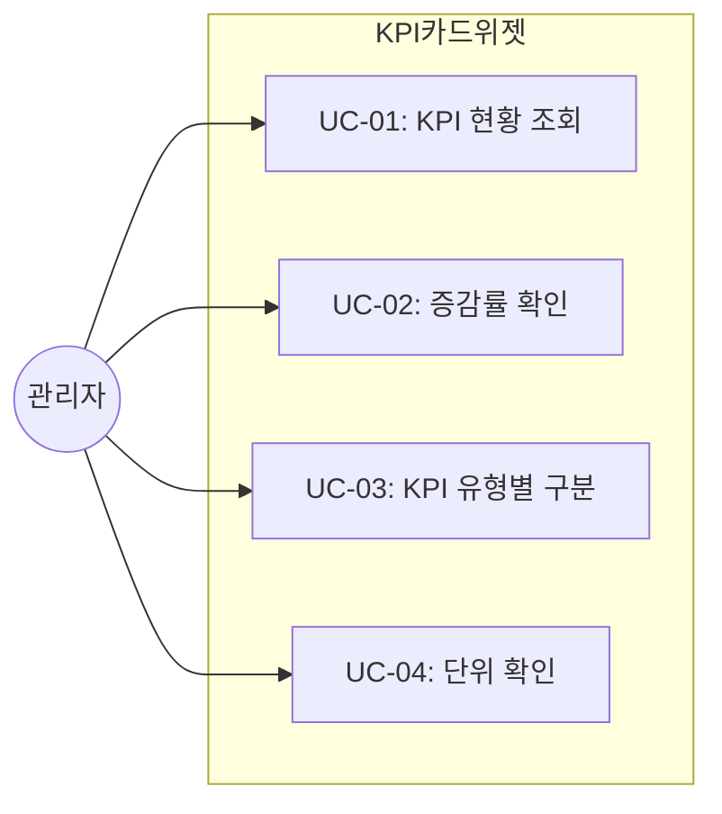
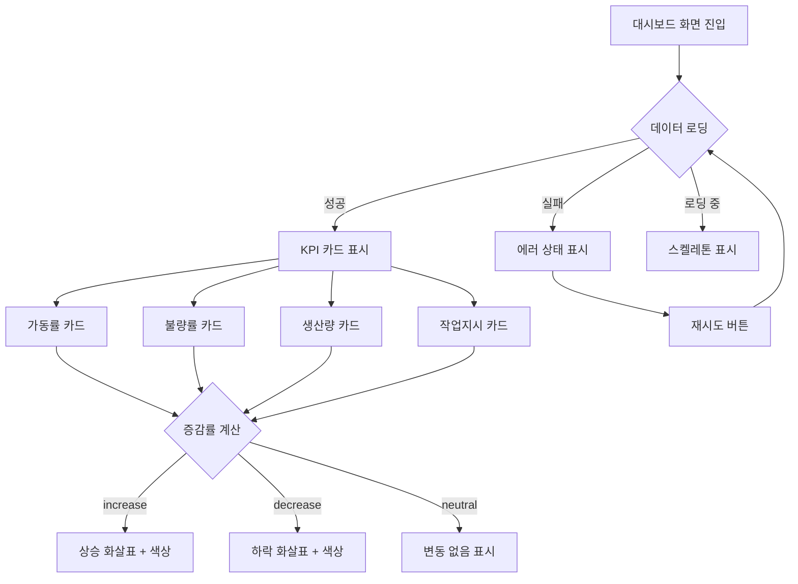

# TSK-07-02 - KPI 카드 위젯 설계 문서

## 문서 정보

| 항목 | 내용 |
|------|------|
| Task ID | TSK-07-02 |
| 문서 버전 | 1.0 |
| 작성일 | 2026-01-21 |
| 상태 | 작성중 |
| 카테고리 | development |

---

## 1. 개요

### 1.1 배경 및 문제 정의

**현재 상황:**
- MES Portal 대시보드에서 생산 현황의 핵심 지표(KPI)를 한눈에 파악할 수 있는 시각적 요소가 필요함
- 가동률, 불량률, 생산량 등의 KPI는 제조 현장 관리자가 가장 먼저 확인하는 핵심 정보임
- 단순한 숫자 표시만으로는 전일/전주 대비 변화 추이를 파악하기 어려움

**해결하려는 문제:**
- KPI 지표를 시각적으로 명확하게 표시하는 표준 컴포넌트 부재
- 증감률 변화에 대한 직관적인 표현 필요 (상승/하락 화살표, 색상 구분)
- 다양한 KPI 유형(수량, 비율, 건수)에 대한 일관된 표시 형식 필요

### 1.2 목적 및 기대 효과

**목적:**
- 재사용 가능한 KPI 카드 위젯 컴포넌트 (KPICard) 구현
- Ant Design Statistic 및 Card 컴포넌트 기반 표준화된 KPI 표시
- 증감률 표시 (화살표 아이콘 + 색상 코드)
- mock-data/dashboard.json 데이터 연동

**기대 효과:**
- 사용자 관점: 핵심 KPI 지표를 한눈에 파악, 변화 추이 즉시 인지
- 개발자 관점: KPI 표시가 필요한 화면에서 컴포넌트 재사용
- 비즈니스 관점: 데이터 기반 의사결정 지원, 생산성 향상

### 1.3 범위

**포함:**
- KPICard 컴포넌트 구현 (components/dashboard/KPICard.tsx)
- 가동률 카드 (efficiency)
- 불량률 카드 (defect)
- 생산량 카드 (production)
- 작업지시 카드 (orders)
- 증감률 표시 (화살표 + 색상)
- mock-data/dashboard.json kpiCards 데이터 로드
- 타입 정의 (KPICardData 인터페이스)

**제외:**
- 대시보드 레이아웃 (TSK-07-01에서 담당)
- 차트 위젯 (TSK-07-03에서 담당)
- 최근 활동 위젯 (별도 Task)
- 실시간 데이터 갱신 (Phase 2)
- 카드 클릭 시 상세 화면 이동 (향후 확장)

### 1.4 참조 문서

| 문서 | 경로 | 관련 섹션 |
|------|------|----------|
| PRD | `.orchay/projects/mes-portal/prd.md` | 4.1.2 대시보드, 4.1.1 KPI 카드 위젯 |
| TRD | `.orchay/projects/mes-portal/trd.md` | 7. 대시보드/차트 - KPI 카드 |
| WBS | `.orchay/projects/mes-portal/wbs.yaml` | TSK-07-02 |
| Mock Data | `.orchay/projects/mes-portal/mock-data/dashboard.json` | kpiCards |

---

## 2. 사용자 분석

### 2.1 대상 사용자

| 사용자 유형 | 특성 | 주요 니즈 |
|------------|------|----------|
| 공장장/관리자 | 전체 생산 현황 총괄, 의사결정자 | 핵심 KPI 빠른 파악, 이상 징후 즉시 인지 |
| 생산 담당자 | 라인별 생산 관리, 일일 목표 달성 책임 | 금일 생산량, 목표 대비 달성률 확인 |
| 품질 담당자 | 품질 검사 및 불량 관리 | 불량률 추이, 전일 대비 변화 확인 |
| 설비 담당자 | 설비 상태 모니터링 | 가동률 확인, 설비 이상 감지 |

### 2.2 사용자 페르소나

**페르소나 1: 박공장장 (공장장)**
- 역할: 공장 전체 생산 현황 총괄
- 목표: 출근 후 5분 내에 전체 현황 파악
- 불만: 여러 화면을 돌아다니며 숫자를 확인해야 함
- 시나리오: 대시보드 접속 시 KPI 카드들을 통해 가동률, 생산량, 불량률을 한눈에 확인

**페르소나 2: 김품질 (품질 담당자)**
- 역할: 품질 검사 및 불량 관리
- 목표: 불량률 추이 모니터링, 이상 발생 시 즉시 대응
- 불만: 불량률이 증가/감소했는지 한눈에 파악하기 어려움
- 시나리오: 불량률 카드에서 전일 대비 감소(녹색 화살표) 확인하고 안심, 증가(빨간색 화살표) 시 상세 조회

**페르소나 3: 이생산 (생산 담당자)**
- 역할: 라인별 생산 목표 달성
- 목표: 금일 생산량과 목표 대비 진척률 확인
- 불만: 숫자만 보면 좋은 건지 나쁜 건지 판단하기 어려움
- 시나리오: 생산량 카드에서 증감률 확인하여 전일 대비 성과 파악

---

## 3. 유즈케이스

### 3.1 유즈케이스 다이어그램



### 3.2 유즈케이스 상세

#### UC-01: KPI 현황 조회

| 항목 | 내용 |
|------|------|
| 액터 | 공장장, 생산/품질/설비 담당자 |
| 목적 | 핵심 KPI 지표 현재 값 확인 |
| 사전 조건 | 대시보드 화면 접근 |
| 사후 조건 | 각 KPI 카드에 현재 값 표시 |
| 트리거 | 화면 진입 시 자동 로드 |

**기본 흐름:**
1. 사용자가 대시보드 화면에 진입한다
2. 시스템이 mock-data/dashboard.json에서 kpiCards 데이터를 로드한다
3. 각 KPI 카드에 제목, 값, 단위가 표시된다
4. 카드에 해당 KPI 유형에 맞는 아이콘이 표시된다

**표시되는 KPI 목록:**

| KPI ID | 제목 | 예시 값 | 단위 | 아이콘 |
|--------|------|--------|------|--------|
| production | 금일 생산량 | 1,247 | 개 | Package (박스) |
| efficiency | 가동률 | 87.3 | % | Activity (활동) |
| defect | 불량률 | 1.2 | % | AlertTriangle (경고) |
| orders | 작업지시 | 15 | 건 | Clipboard (클립보드) |

#### UC-02: 증감률 확인

| 항목 | 내용 |
|------|------|
| 액터 | 공장장, 생산/품질/설비 담당자 |
| 목적 | 전일/전주 대비 KPI 변화 추이 파악 |
| 사전 조건 | KPI 카드 표시됨 |
| 사후 조건 | 증감률이 화살표 + 색상으로 표시됨 |
| 트리거 | 화면 로드 시 자동 표시 |

**기본 흐름:**
1. KPI 카드가 로드된다
2. 시스템이 change, changeType 값을 확인한다
3. changeType에 따라 화살표 방향과 색상이 결정된다:
   - increase: 상승 화살표 (위쪽)
   - decrease: 하락 화살표 (아래쪽)
   - neutral: 변동 없음 (대시 또는 화살표 없음)
4. 증감률 값이 표시된다 (예: +12.5%, -0.3%)

**증감률 표시 규칙 (비즈니스 규칙 BR-01~BR-04):**

| changeType | 화살표 | 색상 | 예시 표시 |
|------------|--------|------|----------|
| increase (긍정 KPI) | ArrowUpOutlined | 녹색 (success) | +12.5% |
| increase (부정 KPI) | ArrowUpOutlined | 빨간색 (error) | +0.5% |
| decrease (긍정 KPI) | ArrowDownOutlined | 빨간색 (error) | -5.0% |
| decrease (부정 KPI) | ArrowDownOutlined | 녹색 (success) | -0.3% |
| neutral | MinusOutlined 또는 없음 | 회색 (default) | 0% |

**긍정/부정 KPI 구분:**
- 긍정 KPI (값 증가가 좋음): 생산량, 가동률
- 부정 KPI (값 감소가 좋음): 불량률

#### UC-03: KPI 유형별 구분

| 항목 | 내용 |
|------|------|
| 액터 | 모든 사용자 |
| 목적 | 각 KPI의 유형을 아이콘으로 빠르게 구분 |
| 사전 조건 | KPI 카드 표시됨 |
| 사후 조건 | 각 카드에 유형별 아이콘 표시 |
| 트리거 | 화면 로드 시 자동 표시 |

**기본 흐름:**
1. KPI 카드가 로드된다
2. 각 카드에 해당 KPI 유형의 아이콘이 표시된다
3. 아이콘은 Ant Design Icons 또는 Lucide 아이콘 사용

**아이콘 매핑:**

| KPI ID | 아이콘명 | Ant Design Icon |
|--------|---------|-----------------|
| production | package | InboxOutlined |
| efficiency | activity | ThunderboltOutlined |
| defect | alert-triangle | WarningOutlined |
| orders | clipboard | FileTextOutlined |

#### UC-04: 단위 확인

| 항목 | 내용 |
|------|------|
| 액터 | 모든 사용자 |
| 목적 | KPI 값의 단위 확인 |
| 사전 조건 | KPI 카드 표시됨 |
| 사후 조건 | 값 옆에 단위 표시 |
| 트리거 | 화면 로드 시 자동 표시 |

**기본 흐름:**
1. KPI 카드가 로드된다
2. 값 뒤에 단위가 suffix로 표시된다
3. 숫자는 천 단위 콤마 포맷팅 적용

**단위 표시 규칙:**
- 수량: "개", "건" 등
- 비율: "%"
- 숫자 포맷: 소수점 1자리까지 (비율), 정수 (수량/건수)

---

## 4. 사용자 시나리오

### 4.1 시나리오 1: 출근 후 현황 파악

**상황 설명:**
박공장장이 오전 출근 후 대시보드에 접속하여 전체 생산 현황을 파악하려 한다.

**단계별 진행:**

| 단계 | 사용자 행동 | 시스템 반응 | 사용자 기대 |
|------|-----------|------------|------------|
| 1 | 대시보드 메뉴 클릭 | 대시보드 화면 로드, KPI 카드 4개 표시 | 화면 정상 로드 |
| 2 | 생산량 카드 확인 | 금일 생산량: 1,247개, +12.5% (녹색 상승) | 전일 대비 증가 확인 |
| 3 | 가동률 카드 확인 | 가동률: 87.3%, +2.1% (녹색 상승) | 양호한 가동률 확인 |
| 4 | 불량률 카드 확인 | 불량률: 1.2%, -0.3% (녹색 하락) | 불량률 감소 긍정적 평가 |
| 5 | 작업지시 카드 확인 | 작업지시: 15건, 0% (회색) | 변동 없음 확인 |

**성공 조건:**
- 4개의 KPI 카드가 모두 정상 표시됨
- 증감률이 색상으로 직관적으로 구분됨
- 5초 이내에 전체 현황 파악 가능

### 4.2 시나리오 2: 불량률 이상 감지

**상황 설명:**
김품질 담당자가 불량률 카드에서 증가 추이를 발견하고 상세 내용을 파악하려 한다.

**단계별 진행:**

| 단계 | 사용자 행동 | 시스템 반응 | 사용자 기대 |
|------|-----------|------------|------------|
| 1 | 대시보드 접속 | KPI 카드 표시 | 화면 정상 로드 |
| 2 | 불량률 카드 확인 | 불량률: 2.5%, +1.3% (빨간색 상승) | 이상 징후 인지 |
| 3 | 색상 확인 | 빨간색 화살표로 경고 표시 | 주의 필요 인식 |
| 4 | (향후) 카드 클릭 | 불량 상세 화면 이동 (Phase 2) | 원인 분석 진행 |

**성공 조건:**
- 불량률 증가 시 빨간색으로 명확히 경고
- 사용자가 즉시 이상 상황 인지 가능

### 4.3 시나리오 3: 데이터 로딩 실패

**상황 설명:**
네트워크 오류로 KPI 데이터 로딩에 실패한 경우

**단계별 진행:**

| 단계 | 사용자 행동 | 시스템 반응 | 복구 방법 |
|------|-----------|------------|----------|
| 1 | 대시보드 접속 | 로딩 스피너 표시 | - |
| 2 | 대기 | 에러 상태 표시 | - |
| 3 | 에러 메시지 확인 | "데이터를 불러오지 못했습니다" | 재시도 버튼 |
| 4 | 재시도 버튼 클릭 | 데이터 다시 로드 시도 | 성공 시 정상 표시 |

---

## 5. 화면 설계

### 5.1 화면 흐름도



### 5.2 화면별 상세

#### 화면 1: KPI 카드 위젯 (KPICard)

**화면 목적:**
대시보드에서 핵심 KPI 지표를 시각적으로 표시하는 카드 컴포넌트. 값, 단위, 증감률을 한눈에 파악 가능.

**진입 경로:**
- 대시보드 화면 (TSK-07-01)에서 KPICard 컴포넌트 렌더링
- 사이드바 메뉴: 대시보드 클릭
- MDI 탭으로 열림

**와이어프레임 (단일 KPI 카드):**
```
┌─────────────────────────────────────────────────────────────┐
│                        KPI Card                             │
│  ┌───────────────────────────────────────────────────────┐  │
│  │                                                       │  │
│  │   [📦]  금일 생산량                                   │  │
│  │                                                       │  │
│  │          1,247 개                                     │  │
│  │                                                       │  │
│  │          ▲ +12.5%                                    │  │
│  │         (녹색)                                        │  │
│  │                                                       │  │
│  └───────────────────────────────────────────────────────┘  │
│                                                             │
└─────────────────────────────────────────────────────────────┘

범례:
[📦] : KPI 유형 아이콘 (Ant Design Icon)
▲    : 상승 화살표 (ArrowUpOutlined)
▼    : 하락 화살표 (ArrowDownOutlined)
─    : 변동 없음 (MinusOutlined)
```

**와이어프레임 (대시보드 내 KPI 카드 배치):**
```
┌─────────────────────────────────────────────────────────────────────────────────┐
│  대시보드                                                                       │
│                                                                                 │
│  ┌───────────────────┐ ┌───────────────────┐ ┌───────────────────┐ ┌──────────────────┐
│  │ [⚡] 가동률       │ │ [⚠️] 불량률       │ │ [📦] 금일 생산량  │ │ [📋] 작업지시   │
│  │                   │ │                   │ │                   │ │                  │
│  │     87.3 %        │ │     1.2 %         │ │    1,247 개       │ │     15 건        │
│  │                   │ │                   │ │                   │ │                  │
│  │    ▲ +2.1%       │ │    ▼ -0.3%       │ │    ▲ +12.5%      │ │    ─ 0%         │
│  │    (녹색)         │ │    (녹색)         │ │    (녹색)         │ │    (회색)        │
│  └───────────────────┘ └───────────────────┘ └───────────────────┘ └──────────────────┘
│                                                                                 │
│  ┌─────────────────────────────────────────────────────────────────────────────┐
│  │                           차트 영역 (TSK-07-03)                             │
│  └─────────────────────────────────────────────────────────────────────────────┘
│                                                                                 │
└─────────────────────────────────────────────────────────────────────────────────┘

레이아웃: Row + Col (xs={24} sm={12} md={6}) - 반응형 4열/2열/1열
```

**화면 요소 설명:**

| 영역 | 설명 | Ant Design 컴포넌트 |
|------|------|-------------------|
| 카드 컨테이너 | KPI 정보를 담는 카드 | Card |
| 아이콘 영역 | KPI 유형 구분 아이콘 | @ant-design/icons |
| 제목 영역 | KPI 제목 (예: 가동률) | Typography.Text 또는 Card title |
| 값 영역 | KPI 수치 (큰 글씨) | Statistic (value) |
| 단위 영역 | 값의 단위 | Statistic (suffix) |
| 증감률 영역 | 변화율 + 화살표 | Statistic (prefix) + 색상 |

### 5.3 KPICard 컴포넌트 상세 레이아웃

```
┌─────────────────────────────────────────────────────────────┐
│  Card (hoverable, bordered)                                 │
│  ┌───────────────────────────────────────────────────────┐  │
│  │  Card.Meta                                            │  │
│  │  ┌─────────────────────────────────────────────────┐  │  │
│  │  │  Avatar (icon)  +  Title                        │  │  │
│  │  │  [📦]              금일 생산량                   │  │  │
│  │  └─────────────────────────────────────────────────┘  │  │
│  └───────────────────────────────────────────────────────┘  │
│                                                             │
│  ┌───────────────────────────────────────────────────────┐  │
│  │  Statistic                                            │  │
│  │  ┌─────────────────────────────────────────────────┐  │  │
│  │  │                                                 │  │  │
│  │  │  value=1247  suffix="개"                        │  │  │
│  │  │                                                 │  │  │
│  │  │       1,247 개                                  │  │  │
│  │  │                                                 │  │  │
│  │  └─────────────────────────────────────────────────┘  │  │
│  └───────────────────────────────────────────────────────┘  │
│                                                             │
│  ┌───────────────────────────────────────────────────────┐  │
│  │  Change Indicator (커스텀)                            │  │
│  │  ┌─────────────────────────────────────────────────┐  │  │
│  │  │  <ArrowUpOutlined /> +12.5%                     │  │  │
│  │  │  (color: green / red / gray)                    │  │  │
│  │  └─────────────────────────────────────────────────┘  │  │
│  └───────────────────────────────────────────────────────┘  │
│                                                             │
└─────────────────────────────────────────────────────────────┘
```

### 5.4 상태별 화면 변화

| 상태 | 화면 표시 | 사용자 안내 |
|------|----------|------------|
| 로딩 중 | Card + Skeleton (Statistic 형태) | "데이터를 불러오는 중..." |
| 데이터 로드 성공 | 정상 KPI 카드 표시 | - |
| 데이터 없음 | Empty State 또는 "-" 표시 | "데이터가 없습니다" |
| 에러 발생 | Result(error) 또는 Skeleton 유지 | "데이터를 불러오지 못했습니다" |

### 5.5 반응형 동작

| 화면 크기 | 카드 배치 | 설명 |
|----------|----------|------|
| XL (1600px+) | 4열 (span=6) | 한 줄에 4개 카드 |
| LG (1200-1599px) | 4열 (span=6) | 한 줄에 4개 카드 |
| MD (992-1199px) | 4열 (span=6) | 한 줄에 4개 카드 |
| SM (768-991px) | 2열 (span=12) | 한 줄에 2개 카드 |
| XS (767px-) | 1열 (span=24) | 한 줄에 1개 카드 |

---

## 6. 인터랙션 설계

### 6.1 사용자 액션과 피드백

| 사용자 액션 | 즉각 피드백 | 결과 피드백 | 에러 피드백 |
|------------|-----------|------------|------------|
| 화면 진입 | 스켈레톤 표시 | KPI 카드 데이터 표시 | 에러 메시지 + 재시도 |
| 카드 호버 | 그림자 효과 증가 (hoverable) | - | - |
| (향후) 카드 클릭 | 클릭 효과 | 상세 화면 이동 | - |

### 6.2 상태별 피드백

| 상태 | 시각적 피드백 | 설명 |
|------|-------------|------|
| 증가 (긍정) | 녹색 + 상승 화살표 | 생산량/가동률 증가 |
| 증가 (부정) | 빨간색 + 상승 화살표 | 불량률 증가 (경고) |
| 감소 (긍정) | 빨간색 + 하락 화살표 | 생산량/가동률 감소 (경고) |
| 감소 (부정) | 녹색 + 하락 화살표 | 불량률 감소 (좋음) |
| 변동 없음 | 회색 + 대시 | 변화 없음 |

### 6.3 키보드/접근성

| 기능 | 키보드 | 스크린 리더 안내 |
|------|--------|-----------------|
| 카드 포커스 | Tab | "가동률 카드, 87.3%, 2.1% 증가" |
| (향후) 카드 선택 | Enter/Space | "상세 화면으로 이동" |

---

## 7. 데이터 요구사항

### 7.1 필요한 데이터

| 데이터 | 설명 | 출처 | 용도 |
|--------|------|------|------|
| kpiCards | KPI 카드 데이터 배열 | mock-data/dashboard.json | KPI 카드 렌더링 |

### 7.2 mock-data/dashboard.json 구조 (kpiCards)

```json
{
  "kpiCards": [
    {
      "id": "production",
      "title": "금일 생산량",
      "value": 1247,
      "unit": "개",
      "change": 12.5,
      "changeType": "increase",
      "icon": "package"
    },
    {
      "id": "efficiency",
      "title": "가동률",
      "value": 87.3,
      "unit": "%",
      "change": 2.1,
      "changeType": "increase",
      "icon": "activity"
    },
    {
      "id": "defect",
      "title": "불량률",
      "value": 1.2,
      "unit": "%",
      "change": -0.3,
      "changeType": "decrease",
      "icon": "alert-triangle"
    },
    {
      "id": "orders",
      "title": "작업지시",
      "value": 15,
      "unit": "건",
      "change": 0,
      "changeType": "neutral",
      "icon": "clipboard"
    }
  ]
}
```

### 7.3 타입 정의

```typescript
// types/dashboard.ts

/**
 * KPI 변화 유형
 */
type KPIChangeType = 'increase' | 'decrease' | 'neutral';

/**
 * KPI 유형 (긍정/부정 판단용)
 * - positive: 값 증가가 좋은 KPI (생산량, 가동률)
 * - negative: 값 감소가 좋은 KPI (불량률)
 */
type KPIValueType = 'positive' | 'negative';

/**
 * KPI 카드 데이터 인터페이스
 */
interface KPICardData {
  id: string;              // 고유 ID (production, efficiency, defect, orders)
  title: string;           // 제목 (금일 생산량, 가동률 등)
  value: number;           // 현재 값
  unit: string;            // 단위 (개, %, 건)
  change: number;          // 변화율 (양수: 증가, 음수: 감소)
  changeType: KPIChangeType; // 변화 유형
  icon: string;            // 아이콘 이름
}

/**
 * KPICard 컴포넌트 Props
 */
interface KPICardProps {
  data: KPICardData;
  loading?: boolean;
  valueType?: KPIValueType; // 기본값: 'positive'
  onClick?: () => void;
  className?: string;
}

/**
 * 대시보드 KPI 응답 타입
 */
interface DashboardKPIResponse {
  kpiCards: KPICardData[];
}

/**
 * KPI 아이콘 매핑 타입
 */
interface KPIIconMap {
  [key: string]: React.ComponentType;
}
```

### 7.4 KPI 유형별 설정

```typescript
// lib/dashboard/kpiConfig.ts

/**
 * KPI별 설정 정보
 * - valueType: 값 증가가 좋은지(positive) 나쁜지(negative) 정의
 */
const KPI_CONFIG: Record<string, { valueType: KPIValueType }> = {
  production: { valueType: 'positive' },   // 생산량: 증가가 좋음
  efficiency: { valueType: 'positive' },   // 가동률: 증가가 좋음
  defect: { valueType: 'negative' },       // 불량률: 감소가 좋음
  orders: { valueType: 'positive' },       // 작업지시: 증가가 좋음 (일반적으로)
};

/**
 * 아이콘 매핑
 */
const KPI_ICON_MAP: KPIIconMap = {
  package: InboxOutlined,
  activity: ThunderboltOutlined,
  'alert-triangle': WarningOutlined,
  clipboard: FileTextOutlined,
};

export { KPI_CONFIG, KPI_ICON_MAP };
```

### 7.5 데이터 유효성 규칙

| 데이터 필드 | 규칙 | 위반 시 처리 |
|------------|------|-------------|
| id | 필수, 문자열 | 렌더링 스킵 |
| title | 필수, 문자열 | "알 수 없음" 표시 |
| value | 필수, 숫자 | "-" 표시 |
| unit | 필수, 문자열 | 빈 문자열 허용 |
| change | 필수, 숫자 | 0으로 처리 |
| changeType | 필수, 열거형 | 'neutral' 처리 |
| icon | 선택, 문자열 | 기본 아이콘 표시 |

---

## 8. 비즈니스 규칙

### 8.1 핵심 규칙

| 규칙 ID | 규칙 설명 | 적용 상황 | 예외 |
|---------|----------|----------|------|
| BR-01 | 긍정 KPI 증가 시 녹색 표시 | 생산량/가동률 increase | 없음 |
| BR-02 | 긍정 KPI 감소 시 빨간색 표시 | 생산량/가동률 decrease | 없음 |
| BR-03 | 부정 KPI 증가 시 빨간색 표시 | 불량률 increase | 없음 |
| BR-04 | 부정 KPI 감소 시 녹색 표시 | 불량률 decrease | 없음 |
| BR-05 | 변화 없음(neutral) 시 회색 표시 | change === 0 | 없음 |
| BR-06 | 숫자는 천 단위 콤마 적용 | 모든 정수 값 | 소수점 값은 콤마 미적용 |
| BR-07 | 비율은 소수점 1자리까지 표시 | unit === '%' | 없음 |
| BR-08 | 수량/건수는 정수로 표시 | unit === '개' 또는 '건' | 없음 |

### 8.2 규칙 상세 설명

**BR-01 ~ BR-04: 증감률 색상 규칙**

설명: KPI 유형(긍정/부정)과 변화 방향(증가/감소)에 따라 색상을 결정한다.

```typescript
/**
 * 증감률 색상 결정 로직
 */
function getChangeColor(
  changeType: KPIChangeType,
  valueType: KPIValueType
): 'success' | 'error' | 'default' {
  if (changeType === 'neutral') {
    return 'default'; // 회색
  }

  // 긍정 KPI: 증가=녹색, 감소=빨간색
  // 부정 KPI: 증가=빨간색, 감소=녹색
  const isPositiveChange = changeType === 'increase';
  const isPositiveKPI = valueType === 'positive';

  if (isPositiveChange === isPositiveKPI) {
    return 'success'; // 녹색
  } else {
    return 'error'; // 빨간색
  }
}
```

예시:
- 생산량(positive) + increase → 녹색
- 생산량(positive) + decrease → 빨간색
- 불량률(negative) + increase → 빨간색
- 불량률(negative) + decrease → 녹색

**BR-06 ~ BR-08: 숫자 포맷팅 규칙**

설명: 값의 단위에 따라 적절한 형식으로 포맷팅한다.

```typescript
/**
 * KPI 값 포맷팅
 */
function formatKPIValue(value: number, unit: string): string {
  if (unit === '%') {
    // 비율: 소수점 1자리
    return value.toFixed(1);
  } else {
    // 정수: 천 단위 콤마
    return value.toLocaleString('ko-KR');
  }
}
```

예시:
- 1247개 → "1,247"
- 87.3% → "87.3"
- 15건 → "15"

---

## 9. 에러 처리

### 9.1 예상 에러 상황

| 상황 | 원인 | 사용자 메시지 | 복구 방법 |
|------|------|--------------|----------|
| 데이터 로드 실패 | JSON 파일 로드 실패, 네트워크 오류 | "데이터를 불러오지 못했습니다" | 재시도 버튼 |
| 개별 카드 데이터 누락 | 특정 KPI 데이터 없음 | 해당 카드 스켈레톤 유지 또는 "-" 표시 | 자동 복구 |
| 잘못된 데이터 형식 | value가 숫자가 아님 | "-" 표시 | 콘솔 경고 |

### 9.2 에러 표시 방식

| 에러 유형 | 표시 위치 | 표시 방법 |
|----------|----------|----------|
| 전체 데이터 로드 실패 | KPI 카드 영역 | Result 컴포넌트 (status="error") + 재시도 버튼 |
| 개별 카드 데이터 오류 | 해당 카드 | Statistic value="-" 또는 Skeleton 유지 |
| 네트워크 오류 | 상단 알림 | message.error() 토스트 |

### 9.3 에러 처리 코드 예시

```typescript
// 데이터 로딩 훅
function useKPICards() {
  const [data, setData] = useState<KPICardData[]>([]);
  const [loading, setLoading] = useState(true);
  const [error, setError] = useState<Error | null>(null);

  const loadData = async () => {
    try {
      setLoading(true);
      setError(null);
      const response = await import('@/mock-data/dashboard.json');
      setData(response.kpiCards || []);
    } catch (err) {
      setError(err as Error);
      console.error('KPI 데이터 로드 실패:', err);
    } finally {
      setLoading(false);
    }
  };

  useEffect(() => {
    loadData();
  }, []);

  return { data, loading, error, refetch: loadData };
}
```

---

## 10. 연관 문서

| 문서 | 경로 | 용도 |
|------|------|------|
| 요구사항 추적 매트릭스 | `025-traceability-matrix.md` | PRD -> 설계 -> 테스트 추적 |
| 테스트 명세서 | `026-test-specification.md` | 테스트 케이스 정의 |
| 대시보드 레이아웃 | `../TSK-07-01/010-design.md` | KPI 카드 배치 레이아웃 |

---

## 11. 구현 범위

### 11.1 파일 구조

```
src/
├── components/
│   └── dashboard/
│       ├── KPICard/
│       │   ├── index.tsx           # KPICard 컴포넌트
│       │   ├── ChangeIndicator.tsx # 증감률 표시 컴포넌트
│       │   └── types.ts            # 타입 정의
│       └── KPICardGroup.tsx        # KPI 카드 그룹 (Row + Col)
├── lib/
│   ├── dashboard/
│   │   └── kpiConfig.ts            # KPI 설정 (아이콘, valueType 등)
│   └── hooks/
│       └── useKPICards.ts          # KPI 데이터 로딩 훅
├── types/
│   └── dashboard.ts                # 대시보드 관련 타입 정의
```

### 11.2 영향받는 영역

| 영역 | 변경 내용 | 영향도 |
|------|----------|--------|
| components/dashboard/KPICard/ | 신규 생성 | 높음 |
| components/dashboard/KPICardGroup.tsx | 신규 생성 | 중간 |
| lib/dashboard/kpiConfig.ts | 신규 생성 | 중간 |
| lib/hooks/useKPICards.ts | 신규 생성 | 중간 |
| types/dashboard.ts | 신규 생성 | 중간 |
| screens/dashboard/Dashboard.tsx | KPICardGroup 사용 | 중간 |

### 11.3 의존성

| 의존 항목 | 이유 | 상태 |
|----------|------|------|
| TSK-07-01 (대시보드 레이아웃) | KPI 카드 배치 영역 | 의존 |
| TSK-00-02 (UI 라이브러리 설정) | Ant Design 컴포넌트 사용 | 완료 |
| Ant Design Card | 카드 컨테이너 | TRD 확인됨 |
| Ant Design Statistic | 숫자 표시 | TRD 확인됨 |
| @ant-design/icons | 아이콘 | TRD 확인됨 |

### 11.4 사용할 Ant Design 컴포넌트

| 컴포넌트 | 용도 |
|----------|------|
| Card | KPI 카드 컨테이너 |
| Statistic | 숫자 값 표시 (value, suffix) |
| Row, Col | 반응형 그리드 레이아웃 |
| Skeleton | 로딩 상태 표시 |
| Result | 에러 상태 표시 |
| Typography.Text | 증감률 텍스트 |

### 11.5 사용할 Ant Design Icons

| 아이콘 | 용도 |
|--------|------|
| ArrowUpOutlined | 상승 표시 |
| ArrowDownOutlined | 하락 표시 |
| MinusOutlined | 변동 없음 표시 |
| InboxOutlined | 생산량 아이콘 |
| ThunderboltOutlined | 가동률 아이콘 |
| WarningOutlined | 불량률 아이콘 |
| FileTextOutlined | 작업지시 아이콘 |

### 11.6 제약 사항

| 제약 | 설명 | 대응 방안 |
|------|------|----------|
| Mock 데이터 | 실제 API 없음 | JSON import로 데이터 로드 |
| 실시간 갱신 없음 | Phase 1 범위 | 새로고침 시 데이터 갱신 |
| TSK-07-01 의존 | 대시보드 레이아웃 필요 | 순차 구현 또는 병렬 개발 |

### 11.7 Server/Client Component 구분

| 컴포넌트 | 타입 | 사유 |
|----------|------|------|
| KPICard | Client Component | Ant Design 컴포넌트 사용, 호버 효과 |
| KPICardGroup | Client Component | Row/Col 반응형 레이아웃 |
| ChangeIndicator | Client Component | 아이콘, 색상 동적 변경 |

### 11.8 주요 data-testid 정의

| data-testid | 요소 | 용도 |
|-------------|------|------|
| `kpi-card-{id}` | 개별 KPI 카드 | 카드 렌더링 확인 |
| `kpi-value-{id}` | KPI 값 영역 | 값 표시 확인 |
| `kpi-change-{id}` | 증감률 영역 | 증감률 표시 확인 |
| `kpi-card-group` | KPI 카드 그룹 컨테이너 | 그룹 렌더링 확인 |
| `kpi-loading-skeleton` | 로딩 스켈레톤 | 로딩 상태 확인 |
| `kpi-error-result` | 에러 상태 | 에러 표시 확인 |

---

## 12. 체크리스트

### 12.1 설계 완료 확인

- [x] 문제 정의 및 목적 명확화
- [x] 사용자 분석 완료
- [x] 유즈케이스 정의 완료
- [x] 사용자 시나리오 작성 완료
- [x] 화면 설계 완료 (와이어프레임)
- [x] 인터랙션 설계 완료
- [x] 데이터 요구사항 정의 완료
- [x] 비즈니스 규칙 정의 완료
- [x] 에러 처리 정의 완료

### 12.2 연관 문서 작성

- [ ] 요구사항 추적 매트릭스 작성 (-> `025-traceability-matrix.md`)
- [ ] 테스트 명세서 작성 (-> `026-test-specification.md`)

### 12.3 구현 준비

- [x] 구현 우선순위 결정
- [x] 의존성 확인 완료
- [x] 제약 사항 검토 완료

---

## 변경 이력

| 버전 | 일자 | 작성자 | 변경 내용 |
|------|------|--------|----------|
| 1.0 | 2026-01-21 | Claude | 최초 작성 |
