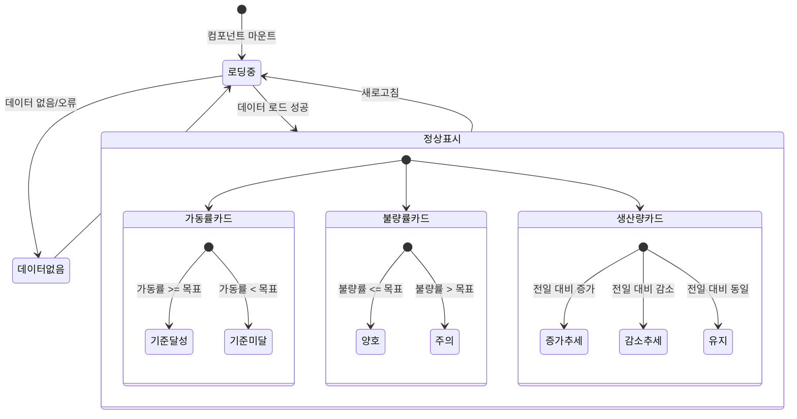

# TSK-07-02 - KPI 카드 위젯 UI 설계

**Version:** 1.0 --- **Last Updated:** 2026-01-21

> **목적**: 대시보드에서 주요 KPI 지표(가동률, 불량률, 생산량)를 시각적으로 표시하는 카드 위젯 설계

---

## 1. 화면 목록

| 화면 ID | 화면명 | 목적 | SVG 참조 |
|---------|--------|------|----------|
| SCR-01 | KPI 카드 - 가동률 | 설비 운영 효율 지표 표시 | `screen-01-kpi-card-operation-rate.svg` |
| SCR-02 | KPI 카드 - 불량률 | 품질 지표 표시 | `screen-02-kpi-card-defect-rate.svg` |
| SCR-03 | KPI 카드 - 생산량 | 생산 실적 지표 표시 | `screen-03-kpi-card-production.svg` |
| SCR-04 | KPI 카드 - 증감률 상승 | 전일/전월 대비 상승 상태 표시 | `screen-04-kpi-card-trend-up.svg` |
| SCR-05 | KPI 카드 - 증감률 하락 | 전일/전월 대비 하락 상태 표시 | `screen-05-kpi-card-trend-down.svg` |
| SCR-06 | KPI 카드 - 데이터 없음 | 데이터 로딩 실패 또는 없음 상태 | `screen-06-kpi-card-empty.svg` |

---

## 2. 화면 전환 흐름

### 2.1 상태 다이어그램



### 2.2 액션-화면 매트릭스

| 액션 | 현재 상태 | 결과 상태 | 트리거 |
|------|----------|----------|--------|
| 컴포넌트 마운트 | - | 로딩중 | 시스템 |
| 데이터 로드 완료 | 로딩중 | 정상표시 | 시스템 |
| 데이터 없음 | 로딩중 | 데이터없음 | 시스템 |
| 새로고침 클릭 | 정상표시 | 로딩중 | 사용자 |
| 카드 클릭 | 정상표시 | 상세 모달 | 사용자 |
| 자동 갱신 | 정상표시 | 로딩중 | 시스템 (5초 주기) |

---

## 3. 화면별 상세

### 3.1 SCR-01: KPI 카드 - 가동률

**화면 목적**: 설비 운영 효율(OEE)을 백분율로 표시

**레이아웃 구조**:
```
+----------------------------------------------------------+
|  [icon]  가동률                              [info icon]  |
+----------------------------------------------------------+
|                                                          |
|                      87.5%                               |
|                  (32px, bold)                            |
|                                                          |
|            [arrow-up] +2.3% 전일 대비                      |
|            (14px, success color)                         |
|                                                          |
+----------------------------------------------------------+
```

**컴포넌트 구성**:

| 영역 | 컴포넌트 | Props | 비고 |
|------|----------|-------|------|
| Container | `Card` | `size="small", hoverable` | Ant Design Card |
| Header | `Card.Meta` | - | 타이틀 + 아이콘 |
| Icon | `DashboardOutlined` | `style={{ color: 'var(--color-primary)' }}` | 카드 아이콘 |
| Value | `Statistic` | `value={87.5}, suffix="%", precision={1}` | Ant Design Statistic |
| Trend | `Statistic` | `prefix={<ArrowUpOutlined />}, valueStyle={{ color: 'var(--color-success)' }}` | 증감률 |

**상태 관리**:
```typescript
interface KPICardState {
  value: number;           // 현재 값
  previousValue: number;   // 이전 값 (증감률 계산용)
  target: number;          // 목표 값
  unit: string;            // 단위 (%, 개, EA 등)
  loading: boolean;        // 로딩 상태
  error: boolean;          // 에러 상태
}
```

**사용자 액션**:
| 액션 | 이벤트 | 결과 |
|------|--------|------|
| 카드 클릭 | `onClick` | 상세 모달 열기 |
| 정보 아이콘 클릭 | `onClick` | 툴팁 표시 (지표 설명) |
| 호버 | `onMouseEnter` | 카드 그림자 강조 |

**스타일 토큰**:
```css
.kpi-card {
  min-width: 240px;
  max-width: 320px;
  border-radius: var(--border-radius-lg);
  transition: box-shadow 0.3s ease;
}

.kpi-card:hover {
  box-shadow: var(--box-shadow-lg);
}

.kpi-card-value {
  font-size: 32px;
  font-weight: 700;
  color: var(--color-text-primary);
}

.kpi-card-trend {
  font-size: 14px;
  margin-top: 8px;
}

.kpi-card-trend--up {
  color: var(--color-success);
}

.kpi-card-trend--down {
  color: var(--color-error);
}
```

---

### 3.2 SCR-02: KPI 카드 - 불량률

**화면 목적**: 생산 품질 지표를 백분율로 표시

**레이아웃 구조**:
```
+----------------------------------------------------------+
|  [icon]  불량률                              [info icon]  |
+----------------------------------------------------------+
|                                                          |
|                      2.1%                                |
|                  (32px, bold)                            |
|                                                          |
|            [arrow-down] -0.5% 전일 대비                    |
|            (14px, success color - 불량률 감소는 긍정)       |
|                                                          |
+----------------------------------------------------------+
```

**컴포넌트 구성**:

| 영역 | 컴포넌트 | Props | 비고 |
|------|----------|-------|------|
| Container | `Card` | `size="small", hoverable` | Ant Design Card |
| Header | `Card.Meta` | - | 타이틀 + 아이콘 |
| Icon | `ExclamationCircleOutlined` | `style={{ color: 'var(--color-warning)' }}` | 품질 아이콘 |
| Value | `Statistic` | `value={2.1}, suffix="%", precision={1}` | Ant Design Statistic |
| Trend | `Statistic` | `prefix={<ArrowDownOutlined />}, valueStyle={{ color: 'var(--color-success)' }}` | 감소는 긍정 |

**특이사항**:
- 불량률은 낮을수록 좋으므로, 증감 색상 로직이 반전됨
  - 감소(하락): Success (초록색)
  - 증가(상승): Error (빨간색)

---

### 3.3 SCR-03: KPI 카드 - 생산량

**화면 목적**: 일일/월간 생산 수량을 표시

**레이아웃 구조**:
```
+----------------------------------------------------------+
|  [icon]  금일 생산량                         [info icon]  |
+----------------------------------------------------------+
|                                                          |
|                    12,450                                |
|                  (32px, bold)                            |
|                      EA                                  |
|                                                          |
|            [arrow-up] +523 전일 대비                       |
|            (14px, success color)                         |
|                                                          |
+----------------------------------------------------------+
```

**컴포넌트 구성**:

| 영역 | 컴포넌트 | Props | 비고 |
|------|----------|-------|------|
| Container | `Card` | `size="small", hoverable` | Ant Design Card |
| Header | `Card.Meta` | - | 타이틀 + 아이콘 |
| Icon | `AppstoreOutlined` | `style={{ color: 'var(--color-primary)' }}` | 생산 아이콘 |
| Value | `Statistic` | `value={12450}, suffix="EA", formatter={...}` | 천 단위 콤마 |
| Trend | `Statistic` | `prefix={<ArrowUpOutlined />}, value={523}` | 수량 증감 |

**포맷팅**:
```typescript
// 천 단위 콤마 포맷터
const formatter = (value: number) => {
  return value.toLocaleString('ko-KR');
};
```

---

### 3.4 SCR-04: KPI 카드 - 증감률 상승 상태

**화면 목적**: 전일/전월 대비 지표가 상승했을 때 표시

**레이아웃 구조**:
```
+----------------------------------------------------------+
|  [icon]  가동률                              [info icon]  |
+----------------------------------------------------------+
|                                                          |
|                      92.3%                               |
|                                                          |
|            [arrow-up] +4.8%                               |
|            전일 대비 상승                                  |
|            (success color: #52c41a)                      |
|                                                          |
+----------------------------------------------------------+
```

**시각적 강조**:
- 상승 화살표 아이콘 (`ArrowUpOutlined`)
- 초록색 텍스트 (`var(--color-success)`)
- 양수 표시 (`+` prefix)

---

### 3.5 SCR-05: KPI 카드 - 증감률 하락 상태

**화면 목적**: 전일/전월 대비 지표가 하락했을 때 표시

**레이아웃 구조**:
```
+----------------------------------------------------------+
|  [icon]  가동률                              [info icon]  |
+----------------------------------------------------------+
|                                                          |
|                      78.2%                               |
|                                                          |
|            [arrow-down] -3.1%                             |
|            전일 대비 하락                                  |
|            (error color: #ff4d4f)                        |
|                                                          |
+----------------------------------------------------------+
```

**시각적 강조**:
- 하락 화살표 아이콘 (`ArrowDownOutlined`)
- 빨간색 텍스트 (`var(--color-error)`)
- 음수 표시 (`-` prefix)

---

### 3.6 SCR-06: KPI 카드 - 데이터 없음 상태

**화면 목적**: 데이터 로딩 실패 또는 데이터가 없을 때 표시

**레이아웃 구조**:
```
+----------------------------------------------------------+
|  [icon]  가동률                              [info icon]  |
+----------------------------------------------------------+
|                                                          |
|                      ---%                                |
|                  (32px, gray)                            |
|                                                          |
|              데이터가 없습니다                             |
|            (14px, secondary color)                       |
|                                                          |
+----------------------------------------------------------+
```

**컴포넌트 구성**:

| 영역 | 컴포넌트 | Props | 비고 |
|------|----------|-------|------|
| Container | `Card` | `size="small"` | 호버 효과 비활성화 |
| Value | `Statistic` | `value="---", valueStyle={{ color: 'var(--color-text-disabled)' }}` | 대시 표시 |
| Message | `Typography.Text` | `type="secondary"` | 안내 메시지 |

**상태 분기**:
```typescript
// 데이터 없음 상태 표시 조건
const showEmpty = loading === false && (error === true || value === null || value === undefined);
```

---

## 4. 공통 컴포넌트

### 4.1 KPICard

```typescript
interface KPICardProps {
  // 기본 정보
  title: string;              // 카드 제목 (가동률, 불량률, 생산량)
  value: number | null;       // 현재 값
  previousValue?: number;     // 이전 값 (증감률 계산용)
  target?: number;            // 목표 값

  // 표시 옵션
  unit?: string;              // 단위 (%, EA, 개)
  precision?: number;         // 소수점 자릿수 (기본: 1)
  icon?: React.ReactNode;     // 카드 아이콘
  invertTrend?: boolean;      // 증감 색상 반전 (불량률용)

  // 상태
  loading?: boolean;          // 로딩 상태
  error?: boolean;            // 에러 상태

  // 이벤트
  onClick?: () => void;       // 카드 클릭 핸들러
  onRefresh?: () => void;     // 새로고침 핸들러

  // 스타일
  className?: string;         // 추가 클래스
  style?: React.CSSProperties; // 인라인 스타일 (지양)
}
```

### 4.2 KPICardValue

```typescript
interface KPICardValueProps {
  value: number | null;
  unit?: string;
  precision?: number;
  loading?: boolean;
}
```

### 4.3 KPICardTrend

```typescript
interface KPICardTrendProps {
  current: number;
  previous: number;
  unit?: string;
  invertColor?: boolean;      // 불량률처럼 감소가 긍정인 경우
  periodLabel?: string;       // "전일 대비", "전월 대비"
}
```

### 4.4 증감률 계산 유틸리티

```typescript
interface TrendResult {
  value: number;              // 증감률 (%)
  direction: 'up' | 'down' | 'neutral';
  isPositive: boolean;        // 긍정적 변화 여부
}

function calculateTrend(
  current: number,
  previous: number,
  invertPositive: boolean = false
): TrendResult {
  if (previous === 0) {
    return { value: 0, direction: 'neutral', isPositive: true };
  }

  const diff = current - previous;
  const percentage = (diff / previous) * 100;
  const direction = diff > 0 ? 'up' : diff < 0 ? 'down' : 'neutral';

  // 불량률의 경우 invertPositive = true
  // 감소(down)가 긍정적, 증가(up)가 부정적
  const isPositive = invertPositive
    ? direction === 'down'
    : direction === 'up';

  return { value: percentage, direction, isPositive };
}
```

---

## 5. 반응형 설계

### 5.1 Breakpoint별 레이아웃

| Breakpoint | 너비 범위 | 카드 배치 | 카드 너비 |
|------------|----------|----------|----------|
| Desktop | 1200px+ | 4열 그리드 | 280px |
| Laptop | 992-1199px | 3열 그리드 | 280px |
| Tablet | 768-991px | 2열 그리드 | 100% (그리드 셀) |
| Mobile | 0-767px | 1열 (수직 스택) | 100% |

### 5.2 반응형 그리드

```css
.kpi-card-grid {
  display: grid;
  gap: 16px;
}

/* Desktop: 4열 */
@media (min-width: 1200px) {
  .kpi-card-grid {
    grid-template-columns: repeat(4, 1fr);
  }
}

/* Laptop: 3열 */
@media (min-width: 992px) and (max-width: 1199px) {
  .kpi-card-grid {
    grid-template-columns: repeat(3, 1fr);
  }
}

/* Tablet: 2열 */
@media (min-width: 768px) and (max-width: 991px) {
  .kpi-card-grid {
    grid-template-columns: repeat(2, 1fr);
  }
}

/* Mobile: 1열 */
@media (max-width: 767px) {
  .kpi-card-grid {
    grid-template-columns: 1fr;
  }

  .kpi-card-value {
    font-size: 28px;
  }
}
```

### 5.3 Ant Design Grid 활용

```tsx
<Row gutter={[16, 16]}>
  <Col xs={24} sm={12} md={12} lg={8} xl={6}>
    <KPICard title="가동률" value={87.5} unit="%" />
  </Col>
  <Col xs={24} sm={12} md={12} lg={8} xl={6}>
    <KPICard title="불량률" value={2.1} unit="%" invertTrend />
  </Col>
  <Col xs={24} sm={12} md={12} lg={8} xl={6}>
    <KPICard title="금일 생산량" value={12450} unit="EA" />
  </Col>
  <Col xs={24} sm={12} md={12} lg={8} xl={6}>
    <KPICard title="목표 달성률" value={95.2} unit="%" />
  </Col>
</Row>
```

---

## 6. 접근성

### 6.1 키보드 네비게이션

| 키 | 동작 |
|----|------|
| Tab | 카드 간 포커스 이동 |
| Enter | 카드 클릭 (상세 모달 열기) |
| Space | 카드 클릭 (상세 모달 열기) |

### 6.2 ARIA 속성

| 요소 | ARIA 속성 | 값 | 설명 |
|------|----------|-----|------|
| KPI 카드 | `role` | `region` | 독립적 영역 |
| KPI 카드 | `aria-label` | `{title} KPI 카드` | 카드 설명 |
| 값 표시 | `aria-live` | `polite` | 값 변경 알림 |
| 증감률 | `aria-label` | `전일 대비 {value}% {상승/하락}` | 추세 설명 |
| 로딩 상태 | `aria-busy` | `true` | 로딩 중 표시 |
| 데이터 없음 | `aria-label` | `데이터가 없습니다` | 빈 상태 안내 |

### 6.3 스크린 리더 안내

```tsx
<Card
  role="region"
  aria-label="가동률 KPI 카드"
  aria-busy={loading}
>
  <Statistic
    value={87.5}
    suffix="%"
    aria-live="polite"
  />
  <div aria-label="전일 대비 2.3% 상승">
    <ArrowUpOutlined aria-hidden="true" />
    <span>+2.3% 전일 대비</span>
  </div>
</Card>
```

### 6.4 색상 대비

| 요소 | 전경색 | 배경색 | 대비율 | WCAG 기준 |
|------|--------|--------|--------|----------|
| 카드 제목 | #000000de | #ffffff | 16.1:1 | AAA |
| 값 텍스트 | #000000de | #ffffff | 16.1:1 | AAA |
| 상승 텍스트 | #52c41a | #ffffff | 4.6:1 | AA |
| 하락 텍스트 | #ff4d4f | #ffffff | 4.5:1 | AA |
| 비활성 텍스트 | #00000040 | #ffffff | 5.7:1 | AA |

### 6.5 포커스 표시

```css
.kpi-card:focus-visible {
  outline: 2px solid var(--color-primary);
  outline-offset: 2px;
}

.kpi-card:focus:not(:focus-visible) {
  outline: none;
}
```

---

## 7. 디자인 토큰

### 7.1 색상

| 토큰 | 값 | 용도 |
|------|-----|------|
| `--color-primary` | #1677ff | 메인 아이콘, 포커스 |
| `--color-success` | #52c41a | 상승/긍정 추세 |
| `--color-error` | #ff4d4f | 하락/부정 추세 |
| `--color-warning` | #faad14 | 경고/주의 |
| `--color-text-primary` | #000000de | 값 텍스트 |
| `--color-text-secondary` | #00000073 | 보조 텍스트 |
| `--color-text-disabled` | #00000040 | 비활성 텍스트 |
| `--color-bg-container` | #ffffff | 카드 배경 |

### 7.2 타이포그래피

| 요소 | 크기 | 두께 | 행간 |
|------|------|------|------|
| 카드 제목 | 14px | 400 | 1.5 |
| 값 (대형) | 32px | 700 | 1.2 |
| 값 (중형) | 24px | 600 | 1.3 |
| 단위 | 14px | 400 | 1.5 |
| 증감률 | 14px | 400 | 1.5 |

### 7.3 간격

| 요소 | 값 |
|------|-----|
| 카드 패딩 | 16px |
| 카드 간격 | 16px |
| 제목-값 간격 | 8px |
| 값-추세 간격 | 8px |

### 7.4 그림자

```css
/* 기본 상태 */
.kpi-card {
  box-shadow: 0 1px 2px 0 rgba(0, 0, 0, 0.03),
              0 1px 6px -1px rgba(0, 0, 0, 0.02),
              0 2px 4px 0 rgba(0, 0, 0, 0.02);
}

/* 호버 상태 */
.kpi-card:hover {
  box-shadow: 0 6px 16px 0 rgba(0, 0, 0, 0.08),
              0 3px 6px -4px rgba(0, 0, 0, 0.12),
              0 9px 28px 8px rgba(0, 0, 0, 0.05);
}
```

---

## 8. SVG 파일 목록

| 파일명 | 설명 | 뷰박스 |
|--------|------|--------|
| `screen-01-kpi-card-operation-rate.svg` | KPI 카드 - 가동률 | 280x160 |
| `screen-02-kpi-card-defect-rate.svg` | KPI 카드 - 불량률 | 280x160 |
| `screen-03-kpi-card-production.svg` | KPI 카드 - 생산량 | 280x160 |
| `screen-04-kpi-card-trend-up.svg` | KPI 카드 - 증감률 상승 | 280x160 |
| `screen-05-kpi-card-trend-down.svg` | KPI 카드 - 증감률 하락 | 280x160 |
| `screen-06-kpi-card-empty.svg` | KPI 카드 - 데이터 없음 | 280x160 |

---

## 관련 문서

- PRD: `../../../prd.md` (4.1.2 대시보드, 4.1.1 KPI 카드 위젯)
- TRD: `../../../trd.md`
- 설계: `./010-design.md`
- 추적성 매트릭스: `./025-traceability-matrix.md`
- 테스트 명세: `./026-test-specification.md`
