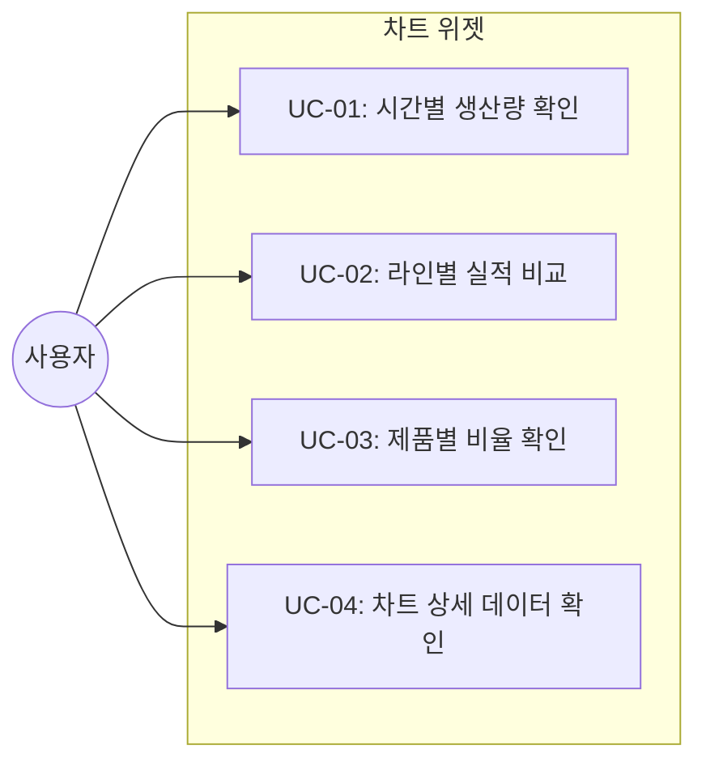
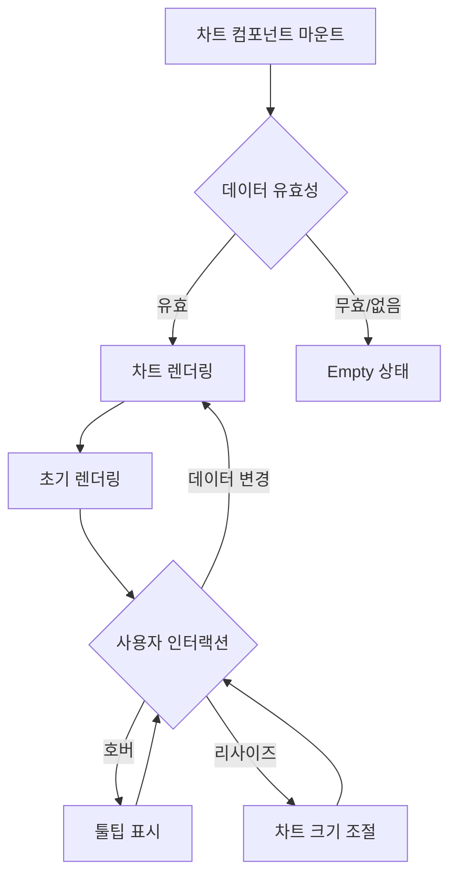

# TSK-07-03 - 차트 위젯 설계 문서

## 문서 정보

| 항목 | 내용 |
|------|------|
| Task ID | TSK-07-03 |
| 문서 버전 | 1.0 |
| 작성일 | 2026-01-21 |
| 상태 | 작성중 |
| 카테고리 | development |

---

## 1. 개요

### 1.1 배경 및 문제 정의

**현재 상황:**
- TSK-07-01에서 대시보드 레이아웃 구조가 설계되어 차트 영역(ChartSection)이 정의됨
- 차트 영역에 실제 차트 컴포넌트가 구현되지 않아 데이터 시각화 기능 부재
- PRD 4.1.1에서 요구하는 라인 차트, 바 차트, 파이 차트 구현 필요

**해결하려는 문제:**
- 시간별 생산량 추이를 시각화하는 라인 차트 구현
- 라인별 생산 실적을 비교하는 바 차트 구현
- 제품별 비율을 표시하는 파이 차트 구현
- 차트 데이터 호버 시 툴팁으로 상세 정보 표시
- 반응형 차트 크기 조절

### 1.2 목적 및 기대 효과

**목적:**
- @ant-design/charts 라이브러리를 활용한 3종 차트 컴포넌트 구현
- TSK-07-01의 ChartSection에 통합 가능한 차트 컴포넌트 제공
- mock-data/dashboard.json의 차트 데이터 시각화

**기대 효과:**
- 사용자 관점: 생산 데이터를 직관적인 시각화로 빠르게 파악
- 개발자 관점: 재사용 가능한 차트 컴포넌트 라이브러리 확보
- 비즈니스 관점: 데이터 기반 의사결정 지원

### 1.3 범위

**포함:**
- LineChart 컴포넌트 (시간별 생산량 추이)
- BarChart 컴포넌트 (라인별 생산 실적)
- PieChart 컴포넌트 (제품별 비율)
- 차트 공통 설정 (테마, 색상, 폰트)
- 툴팁, 범례, 축 라벨 설정
- 반응형 크기 조절
- mock 데이터 타입 정의

**제외:**
- 실시간 데이터 스트리밍 (Phase 2)
- 차트 내보내기 (이미지/PDF)
- 드릴다운 기능 (향후 확장)
- 게이지 차트 (별도 Task)

### 1.4 참조 문서

| 문서 | 경로 | 관련 섹션 |
|------|------|----------|
| PRD | `.orchay/projects/mes-portal/prd.md` | 4.1.1 차트 위젯, 공통 컴포넌트 |
| TRD | `.orchay/projects/mes-portal/trd.md` | 1.2 UI/스타일링 스택 (@ant-design/charts), 7. PRD 요구사항 - 대시보드/차트 |
| TSK-07-01 | `.orchay/projects/mes-portal/tasks/TSK-07-01/010-design.md` | 대시보드 레이아웃, ChartSection 정의 |

---

## 2. 사용자 분석

### 2.1 대상 사용자

| 사용자 유형 | 특성 | 주요 니즈 |
|------------|------|----------|
| 공장장/관리자 | 전체 생산 현황 파악 | 추세 분석, 비교 분석을 통한 의사결정 |
| 생산 담당자 | 라인별 실적 모니터링 | 담당 라인의 목표 대비 실적 파악 |
| 품질 담당자 | 품질 지표 추이 확인 | 불량률 변화 추이 시각적 확인 |

### 2.2 사용자 페르소나

**페르소나 1: 공장장 김공장**
- 역할: 생산 현황 총괄
- 목표: 시간대별 생산 패턴 파악, 라인 간 실적 비교
- 불만: 숫자만으로는 전체적인 추세 파악 어려움
- 시나리오: 라인 차트에서 생산량 감소 추세 발견 → 해당 시간대 원인 분석

**페르소나 2: 생산 담당자 박생산**
- 역할: 특정 라인 관리
- 목표: 담당 라인의 목표 대비 달성률 확인
- 불만: 다른 라인과의 비교가 어려움
- 시나리오: 바 차트에서 담당 라인과 타 라인 실적 비교 → 개선점 도출

---

## 3. 유즈케이스

### 3.1 유즈케이스 다이어그램



### 3.2 유즈케이스 상세

#### UC-01: 시간별 생산량 확인

| 항목 | 내용 |
|------|------|
| 액터 | 관리자, 생산 담당자 |
| 목적 | 시간대별 생산량 추이 파악 |
| 사전 조건 | 대시보드 화면 표시, 생산량 데이터 로드 |
| 사후 조건 | 라인 차트에 시간별 생산량 표시 |
| 트리거 | 대시보드 진입 시 자동 |

**기본 흐름:**
1. 대시보드가 로드되면 productionTrend 데이터를 차트에 전달
2. 라인 차트가 X축(시간), Y축(생산량)으로 렌더링
3. 데이터 포인트가 선으로 연결되어 추이 표시
4. 사용자가 특정 포인트 호버 시 툴팁으로 정확한 수치 표시

**대안 흐름:**
- 데이터가 1개뿐인 경우: 점으로만 표시
- 데이터가 없는 경우: Empty 상태 표시

#### UC-02: 라인별 실적 비교

| 항목 | 내용 |
|------|------|
| 액터 | 관리자, 생산 담당자 |
| 목적 | 생산 라인 간 실적 비교 |
| 사전 조건 | 대시보드 화면 표시, 라인별 실적 데이터 로드 |
| 사후 조건 | 바 차트에 라인별 실적/목표 표시 |
| 트리거 | 대시보드 진입 시 자동 |

**기본 흐름:**
1. 대시보드가 로드되면 linePerformance 데이터를 차트에 전달
2. 바 차트가 각 라인별로 실적(actual)과 목표(target) 바 표시
3. 바 색상으로 실적과 목표 구분
4. 사용자가 특정 바 호버 시 툴팁으로 상세 수치 표시

**대안 흐름:**
- 목표 데이터 없는 경우: 실적 바만 표시

#### UC-03: 제품별 비율 확인

| 항목 | 내용 |
|------|------|
| 액터 | 관리자 |
| 목적 | 제품별 생산 비율 파악 |
| 사전 조건 | 대시보드 화면 표시, 제품별 데이터 로드 |
| 사후 조건 | 파이 차트에 제품별 비율 표시 |
| 트리거 | 대시보드 진입 시 자동 |

**기본 흐름:**
1. 대시보드가 로드되면 productRatio 데이터를 차트에 전달
2. 파이 차트가 각 제품별 비율을 섹터로 표시
3. 각 섹터에 제품명과 비율(%) 라벨 표시
4. 사용자가 특정 섹터 호버 시 툴팁으로 상세 정보 표시

**대안 흐름:**
- 제품이 너무 많은 경우 (5개 초과): 상위 5개 + "기타" 그룹화

#### UC-04: 차트 상세 데이터 확인

| 항목 | 내용 |
|------|------|
| 액터 | 모든 사용자 |
| 목적 | 차트의 특정 데이터 포인트 상세 확인 |
| 사전 조건 | 차트 렌더링 완료 |
| 사후 조건 | 툴팁으로 상세 정보 표시 |
| 트리거 | 데이터 포인트/바/섹터 마우스 호버 |

**기본 흐름:**
1. 사용자가 차트의 특정 요소에 마우스를 올림
2. 해당 위치 근처에 툴팁 박스 표시
3. 툴팁에 해당 데이터의 상세 정보 표시 (라벨, 값, 단위)
4. 마우스 이동 시 툴팁 사라짐

---

## 4. 사용자 시나리오

### 4.1 시나리오 1: 생산량 추이 분석

**상황 설명:**
공장장이 오전 생산량 감소 원인을 파악하기 위해 시간별 생산량 차트를 확인한다.

**단계별 진행:**

| 단계 | 사용자 행동 | 시스템 반응 | 사용자 기대 |
|------|-----------|------------|------------|
| 1 | 대시보드 접속 | 차트 영역 로딩 | 차트 표시 대기 |
| 2 | 라인 차트 확인 | 시간별 생산량 그래프 표시 | 전체 추이 파악 |
| 3 | 09:00 포인트 호버 | "09:00: 1,350 EA" 툴팁 표시 | 정확한 수치 확인 |
| 4 | 10:00 포인트 호버 | "10:00: 1,280 EA" 툴팁 표시 | 감소폭 계산 |

**성공 조건:**
- 차트가 정상 렌더링됨
- 호버 시 툴팁이 빠르게 표시됨
- 데이터가 정확하게 표시됨

### 4.2 시나리오 2: 라인 간 실적 비교

**상황 설명:**
생산 담당자가 담당 라인(2라인)의 실적을 다른 라인과 비교한다.

**단계별 진행:**

| 단계 | 사용자 행동 | 시스템 반응 | 사용자 기대 |
|------|-----------|------------|------------|
| 1 | 바 차트 확인 | 라인별 실적/목표 바 표시 | 전체 실적 비교 |
| 2 | 2라인 바 확인 | 실적 2,800 / 목표 3,000 표시 | 목표 대비 부족 확인 |
| 3 | 2라인 바 호버 | "2라인: 실적 2,800 / 목표 3,000 (93.3%)" 툴팁 | 달성률 확인 |
| 4 | 1라인 바 확인 | 실적 3,200 / 목표 3,500 표시 | 타 라인과 비교 |

**성공 조건:**
- 실적과 목표가 명확히 구분됨
- 바 색상으로 직관적 비교 가능
- 호버 시 달성률까지 표시

### 4.3 시나리오 3: 차트 로딩 실패

**상황 설명:**
데이터 로드 실패로 차트가 표시되지 않는 경우

**단계별 진행:**

| 단계 | 사용자 행동 | 시스템 반응 | 복구 방법 |
|------|-----------|------------|----------|
| 1 | 대시보드 접속 | 차트 영역 로딩 시작 | - |
| 2 | - | 데이터 로드 실패 | 에러 상태 표시 |
| 3 | - | "차트를 불러올 수 없습니다" | 재시도 버튼 |
| 4 | 재시도 클릭 | 데이터 재로드 | 차트 표시 |

---

## 5. 화면 설계

### 5.1 화면 흐름도



### 5.2 화면별 상세

#### 화면 1: 시간별 생산량 라인 차트 (LineChart)

**화면 목적:**
시간 경과에 따른 생산량 변화 추이를 선 그래프로 시각화

**진입 경로:**
- 대시보드 차트 섹션 좌측
- TSK-07-01의 ChartSection 내 배치

**와이어프레임:**
```
+--------------------------------------------------+
|  시간별 생산량                         [더보기 >] |  <- WidgetCard 헤더
+--------------------------------------------------+
|                                                  |
|  1500 |                    _____                 |
|       |                 __/     \____            |
|  1200 |              __/              \____      |
|       |           __/                      \__   |
|   900 |        __/                            \  |
|       |     __/                                  |
|   600 |  __/                                     |
|       | /                                        |
|   300 |/                                         |
|       +--+--+--+--+--+--+--+--+--+--+--+--+--+   |
|         08 09 10 11 12 13 14 15 16 17 18 (시)   |
|                                                  |
|              ● 생산량 (EA)                       |  <- 범례
|                                                  |
+--------------------------------------------------+

툴팁 (호버 시):
+-------------------+
| 10:00             |
| 생산량: 1,280 EA  |
+-------------------+
```

**차트 설정:**

| 설정 항목 | 값 | 설명 |
|----------|-----|------|
| xField | time | X축 필드 (시간) |
| yField | value | Y축 필드 (생산량) |
| smooth | true | 부드러운 곡선 |
| point.size | 4 | 데이터 포인트 크기 |
| color | colorPrimary | Ant Design 테마 색상 |
| animation | true | 로딩 애니메이션 |

#### 화면 2: 라인별 생산 실적 바 차트 (BarChart)

**화면 목적:**
각 생산 라인의 실적과 목표를 비교하는 막대 그래프

**진입 경로:**
- 대시보드 차트 섹션 우측
- TSK-07-01의 ChartSection 내 배치

**와이어프레임:**
```
+--------------------------------------------------+
|  라인별 생산 실적                      [더보기 >] |  <- WidgetCard 헤더
+--------------------------------------------------+
|                                                  |
|  4000 |                                          |
|       |    ■■■■■                                  |
|  3500 |    ■■■■■ □□□□□                            |
|       |    ■■■■■ □□□□□         ■■■■■             |
|  3000 |    ■■■■■ □□□□□  ■■■■■  ■■■■■ □□□□□       |
|       |    ■■■■■ □□□□□  ■■■■■  ■■■■■ □□□□□       |
|  2500 |    ■■■■■ □□□□□  ■■■■■  ■■■■■ □□□□□       |
|       |    ■■■■■ □□□□□  ■■■■■  ■■■■■ □□□□□       |
|  2000 |    ■■■■■ □□□□□  ■■■■■  ■■■■■ □□□□□       |
|       +--+-------+------+-------+------+--+      |
|           1라인    2라인    3라인                 |
|                                                  |
|        ■ 실적  □ 목표                            |  <- 범례
|                                                  |
+--------------------------------------------------+

툴팁 (호버 시):
+------------------------+
| 2라인                  |
| 실적: 2,800 EA        |
| 목표: 3,000 EA        |
| 달성률: 93.3%         |
+------------------------+
```

**차트 설정:**

| 설정 항목 | 값 | 설명 |
|----------|-----|------|
| xField | line | X축 필드 (라인명) |
| yField | value | Y축 필드 (수량) |
| seriesField | type | 시리즈 필드 (실적/목표) |
| isGroup | true | 그룹 바 차트 |
| color | [colorPrimary, colorBorder] | 실적/목표 색상 |

#### 화면 3: 제품별 비율 파이 차트 (PieChart)

**화면 목적:**
전체 생산량 중 각 제품이 차지하는 비율 시각화

**진입 경로:**
- 대시보드 확장 영역 또는 별도 위젯
- 필요 시 바 차트 대체 가능

**와이어프레임:**
```
+--------------------------------------------------+
|  제품별 생산 비율                      [더보기 >] |  <- WidgetCard 헤더
+--------------------------------------------------+
|                                                  |
|                   _____                          |
|               __--     --__                      |
|            __-   A제품    -__                    |
|          _-      35%        -_                   |
|         /                     \                  |
|        |     +----------+      |                 |
|        |     |          |      |                 |
|        |  C제품    파이  B제품 |                 |
|        |   20%    중심   30%   |                 |
|         \    |          |     /                  |
|          \_  +----------+  _/                    |
|            --_   기타   _--                      |
|               --__15%__--                        |
|                                                  |
|   ● A제품  ● B제품  ● C제품  ● 기타             |  <- 범례
|                                                  |
+--------------------------------------------------+

툴팁 (호버 시):
+-------------------+
| A제품             |
| 수량: 4,375 EA   |
| 비율: 35%        |
+-------------------+
```

**차트 설정:**

| 설정 항목 | 값 | 설명 |
|----------|-----|------|
| angleField | value | 각도 필드 (수량) |
| colorField | product | 색상 필드 (제품명) |
| radius | 0.8 | 반지름 비율 |
| label.type | inner | 라벨 위치 (내부) |
| label.content | {percentage} | 라벨 내용 (비율%) |
| innerRadius | 0.5 | 도넛 형태 (선택) |

### 5.3 반응형 동작

| 화면 크기 | Breakpoint | 차트 동작 |
|----------|------------|----------|
| 데스크톱 (1200px+) | lg/xl | 2열 배치, 전체 범례 표시 |
| 태블릿 (768-1199px) | md | 1열 또는 2열, 범례 하단 |
| 모바일 (767px-) | xs/sm | 1열, 범례 숨김 또는 최소화 |

**반응형 설정:**
```typescript
// 차트 autoFit으로 컨테이너에 맞춤
autoFit: true

// 범례 반응형
legend: {
  position: isMobile ? 'bottom' : 'top-right',
  flipPage: isMobile,  // 모바일에서 페이지 넘김
}
```

---

## 6. 인터랙션 설계

### 6.1 사용자 액션과 피드백

| 사용자 액션 | 즉각 피드백 | 결과 피드백 | 에러 피드백 |
|------------|-----------|------------|------------|
| 차트 로딩 | 스켈레톤/스피너 | 차트 애니메이션 렌더링 | 에러 메시지 |
| 데이터 포인트 호버 | 포인트 하이라이트 | 툴팁 표시 | - |
| 범례 항목 클릭 | 클릭 피드백 | 해당 시리즈 토글 | - |
| 창 크기 변경 | - | 차트 리사이즈 | - |

### 6.2 상태별 화면 변화

| 상태 | 화면 표시 | Ant Design 컴포넌트 |
|------|----------|-------------------|
| 로딩 중 | 차트 영역 스켈레톤 | Skeleton |
| 데이터 표시 | 차트 렌더링 | @ant-design/charts |
| 데이터 없음 | Empty 컴포넌트 | Empty |
| 에러 발생 | 에러 메시지 + 재시도 | Result |

### 6.3 툴팁 상세 설계

**라인 차트 툴팁:**
```typescript
tooltip: {
  title: (datum) => datum.time,
  formatter: (datum) => ({
    name: '생산량',
    value: `${datum.value.toLocaleString()} EA`
  })
}
```

**바 차트 툴팁:**
```typescript
tooltip: {
  title: (datum) => datum.line,
  formatter: (datum) => ({
    name: datum.type === 'actual' ? '실적' : '목표',
    value: `${datum.value.toLocaleString()} EA`
  }),
  customContent: (title, items) => {
    // 달성률 계산하여 추가 표시
    const actual = items.find(i => i.name === '실적')?.value;
    const target = items.find(i => i.name === '목표')?.value;
    const rate = (actual / target * 100).toFixed(1);
    return `...달성률: ${rate}%`;
  }
}
```

**파이 차트 툴팁:**
```typescript
tooltip: {
  title: (datum) => datum.product,
  formatter: (datum) => ({
    name: '수량',
    value: `${datum.value.toLocaleString()} EA (${datum.percentage}%)`
  })
}
```

### 6.4 키보드/접근성

| 기능 | 키보드 | 스크린 리더 |
|------|--------|------------|
| 차트 포커스 | Tab | "시간별 생산량 차트" |
| 데이터 탐색 | 화살표 키 | 각 데이터 값 읽기 |
| 범례 토글 | Enter | "A제품 표시 해제" |

---

## 7. 데이터 요구사항

### 7.1 필요한 데이터

| 데이터 | 설명 | 출처 | 용도 |
|--------|------|------|------|
| productionTrend | 시간별 생산량 추이 | mock-data/dashboard.json | 라인 차트 |
| linePerformance | 라인별 실적/목표 | mock-data/dashboard.json | 바 차트 |
| productRatio | 제품별 생산 비율 | mock-data/dashboard.json | 파이 차트 |

### 7.2 데이터 구조 (mock-data/dashboard.json 확장)

TSK-07-01에서 정의된 구조에 productRatio 추가:

```json
{
  "productionTrend": [
    { "time": "08:00", "value": 1200 },
    { "time": "09:00", "value": 1350 },
    { "time": "10:00", "value": 1280 },
    { "time": "11:00", "value": 1420 },
    { "time": "12:00", "value": 1100 },
    { "time": "13:00", "value": 1380 },
    { "time": "14:00", "value": 1450 },
    { "time": "15:00", "value": 1320 }
  ],
  "linePerformance": [
    { "line": "1라인", "actual": 3200, "target": 3500 },
    { "line": "2라인", "actual": 2800, "target": 3000 },
    { "line": "3라인", "actual": 3100, "target": 3200 },
    { "line": "4라인", "actual": 2600, "target": 2800 }
  ],
  "productRatio": [
    { "product": "A제품", "value": 4375, "percentage": 35 },
    { "product": "B제품", "value": 3750, "percentage": 30 },
    { "product": "C제품", "value": 2500, "percentage": 20 },
    { "product": "D제품", "value": 1250, "percentage": 10 },
    { "product": "기타", "value": 625, "percentage": 5 }
  ]
}
```

### 7.3 타입 정의

```typescript
// 시간별 생산량 추이
interface ProductionTrendItem {
  time: string;    // "HH:mm" 형식
  value: number;   // 생산량
}

// 라인별 실적
interface LinePerformanceItem {
  line: string;    // 라인명
  actual: number;  // 실적
  target: number;  // 목표
}

// 바 차트용 변환 데이터
interface LinePerformanceChartItem {
  line: string;
  type: 'actual' | 'target';  // 실적/목표 구분
  value: number;
}

// 제품별 비율
interface ProductRatioItem {
  product: string;     // 제품명
  value: number;       // 수량
  percentage: number;  // 비율(%)
}

// 차트 Props 공통 타입
interface ChartProps<T> {
  data: T[];
  loading?: boolean;
  error?: Error | null;
  onRetry?: () => void;
  height?: number;
}
```

### 7.4 데이터 변환 함수

```typescript
// 라인별 실적 데이터를 그룹 바 차트용으로 변환
function transformLinePerformance(
  data: LinePerformanceItem[]
): LinePerformanceChartItem[] {
  return data.flatMap(item => [
    { line: item.line, type: 'actual', value: item.actual },
    { line: item.line, type: 'target', value: item.target }
  ]);
}
```

### 7.5 데이터 유효성 규칙

| 데이터 필드 | 규칙 | 처리 |
|------------|------|------|
| time | "HH:mm" 형식 | 잘못된 형식 필터링 |
| value | 0 이상 정수 | 음수는 0 처리 |
| percentage | 0-100 범위 | 범위 초과 시 클램핑 |
| line | 비어있지 않음 | 빈 값 필터링 |

### 7.6 데이터 검증 유틸리티

> SEC-002 대응: 차트 데이터 검증 및 정제 함수 설계

```typescript
// lib/utils/chart-validation.ts

/**
 * 생산량 추이 데이터 검증
 * @param data 원본 데이터
 * @returns 검증된 데이터 (유효하지 않은 항목 제외)
 */
function validateProductionTrend(data: unknown[]): ProductionTrendItem[] {
  if (!Array.isArray(data)) return [];

  return data.filter((item): item is ProductionTrendItem => {
    if (!item || typeof item !== 'object') return false;
    const { time, value } = item as Record<string, unknown>;
    return (
      typeof time === 'string' &&
      /^\d{2}:\d{2}$/.test(time) &&
      typeof value === 'number' &&
      value >= 0 &&
      Number.isFinite(value)
    );
  });
}

/**
 * 라인별 실적 데이터 검증
 */
function validateLinePerformance(data: unknown[]): LinePerformanceItem[] {
  if (!Array.isArray(data)) return [];

  return data.filter((item): item is LinePerformanceItem => {
    if (!item || typeof item !== 'object') return false;
    const { line, actual, target } = item as Record<string, unknown>;
    return (
      typeof line === 'string' &&
      line.trim().length > 0 &&
      typeof actual === 'number' &&
      actual >= 0 &&
      typeof target === 'number' &&
      target >= 0
    );
  });
}

/**
 * 제품별 비율 데이터 검증
 */
function validateProductRatio(data: unknown[]): ProductRatioItem[] {
  if (!Array.isArray(data)) return [];

  return data.filter((item): item is ProductRatioItem => {
    if (!item || typeof item !== 'object') return false;
    const { product, value, percentage } = item as Record<string, unknown>;
    return (
      typeof product === 'string' &&
      product.trim().length > 0 &&
      typeof value === 'number' &&
      value >= 0 &&
      typeof percentage === 'number' &&
      percentage >= 0 &&
      percentage <= 100
    );
  });
}

/**
 * 차트 데이터 정제 (XSS 방지)
 * @description @ant-design/charts는 내부적으로 텍스트를 Canvas에 렌더링하므로
 *              DOM XSS 위험은 낮으나, 툴팁의 customContent 사용 시 주의 필요
 */
function sanitizeChartData<T extends Record<string, unknown>>(data: T[]): T[] {
  return data.map(item => {
    const sanitized = { ...item };
    Object.keys(sanitized).forEach(key => {
      if (typeof sanitized[key] === 'string') {
        // HTML 특수문자 이스케이핑
        sanitized[key] = (sanitized[key] as string)
          .replace(/&/g, '&amp;')
          .replace(/</g, '&lt;')
          .replace(/>/g, '&gt;')
          .replace(/"/g, '&quot;')
          .replace(/'/g, '&#x27;');
      }
    });
    return sanitized as T;
  });
}
```

### 7.7 XSS 방지 대책

> SEC-001 대응: @ant-design/charts의 XSS 방지 동작 확인

| 렌더링 영역 | XSS 위험 | 대응 |
|------------|---------|------|
| 차트 본체 (Canvas) | 낮음 | Canvas API는 HTML 파싱하지 않음 |
| 축 라벨 | 낮음 | Canvas 텍스트 렌더링 |
| 범례 | 낮음 | Canvas 텍스트 렌더링 |
| **툴팁 (기본)** | 낮음 | G2 라이브러리 내부 이스케이핑 |
| **툴팁 (customContent)** | 중간 | innerHTML 사용 시 이스케이핑 필요 |

**적용 방안:**
- 기본 `tooltip.formatter` 사용 시 별도 이스케이핑 불필요
- `customContent` 사용 시 `sanitizeChartData()` 적용 또는 DOM 조작 대신 문자열 조합
- 모든 차트 데이터는 `validateXxx()` 함수로 사전 검증

### 7.8 데이터 크기 제한

> SEC-005 대응: 대량 데이터 렌더링 성능 보호

```typescript
// 차트 데이터 최대 포인트 수 (권장값)
const MAX_DATA_POINTS = {
  LINE_CHART: 100,   // 라인 차트 (시간별 추이)
  BAR_CHART: 20,     // 바 차트 (라인별 비교)
  PIE_CHART: 10,     // 파이 차트 (제품별 비율) - 그룹화로 자동 제한
};

/**
 * 데이터 크기 제한 적용
 */
function limitDataPoints<T>(data: T[], maxPoints: number): T[] {
  if (data.length <= maxPoints) return data;

  // 최신 데이터 우선 (또는 샘플링 전략 적용)
  return data.slice(-maxPoints);
}
```

---

## 8. 비즈니스 규칙

### 8.1 핵심 규칙

| 규칙 ID | 규칙 설명 | 적용 상황 | 예외 |
|---------|----------|----------|------|
| BR-01 | 차트 색상은 Ant Design 테마 토큰 사용 | 모든 차트 | 없음 |
| BR-02 | 바 차트에서 실적이 목표 미달 시 구분 표시 | 라인별 실적 | 없음 |
| BR-03 | 파이 차트 항목 5개 초과 시 "기타" 그룹화 | 제품별 비율 | 사용자 설정 가능 |
| BR-04 | 숫자 표시 시 천 단위 콤마 적용 | 툴팁, 라벨 | 없음 |
| BR-05 | 차트 데이터 없을 시 Empty 상태 표시 | 모든 차트 | 없음 |

### 8.2 규칙 상세 설명

**BR-01: 테마 토큰 색상 사용**

설명: @ant-design/charts의 색상을 Ant Design ConfigProvider 테마와 일치시킴

```typescript
// lib/theme/chart-theme.ts
export const chartTheme = {
  colors10: [
    themeTokens.colorPrimary,
    themeTokens.colorSuccess,
    themeTokens.colorWarning,
    themeTokens.colorError,
    // ... 추가 색상
  ],
  backgroundColor: 'transparent',
};
```

**BR-02: 목표 미달 표시**

설명: 바 차트에서 실적이 목표 대비 미달인 경우 시각적 강조

> QA-007 대응: 경계값 조건 명확화

| 달성률 조건 | 색상 | 의미 |
|------------|------|------|
| `actual >= target * 0.9` (90% 이상) | 기본 색상 (colorPrimary) | 정상 |
| `0.7 <= actual/target < 0.9` (70% 이상 90% 미만) | 경고 색상 (colorWarning) | 주의 |
| `actual/target < 0.7` (70% 미만) | 위험 색상 (colorError) | 위험 |

**경계값 처리:**
- 정확히 90%일 때 (0.9): **정상** (>=0.9 조건에 포함)
- 정확히 70%일 때 (0.7): **주의** (>=0.7 조건에 포함)
- target이 0인 경우: **위험** (division by zero 방지, 무조건 위험 처리)

```typescript
function getPerformanceColor(actual: number, target: number): string {
  if (target === 0) return themeTokens.colorError;

  const rate = actual / target;
  if (rate >= 0.9) return themeTokens.colorPrimary;
  if (rate >= 0.7) return themeTokens.colorWarning;
  return themeTokens.colorError;
}
```

**BR-03: 파이 차트 그룹화**

설명: 항목이 너무 많으면 시각적으로 복잡해지므로 상위 5개 외 "기타"로 그룹화

```typescript
function groupSmallItems(data: ProductRatioItem[], limit = 5) {
  if (data.length <= limit) return data;

  const sorted = [...data].sort((a, b) => b.value - a.value);
  const top = sorted.slice(0, limit - 1);
  const others = sorted.slice(limit - 1);
  const othersSum = others.reduce((sum, item) => sum + item.value, 0);
  const totalSum = data.reduce((sum, item) => sum + item.value, 0);

  return [
    ...top,
    {
      product: '기타',
      value: othersSum,
      percentage: Math.round(othersSum / totalSum * 100)
    }
  ];
}
```

---

## 9. 에러 처리

### 9.1 예상 에러 상황

| 상황 | 원인 | 사용자 메시지 | 복구 방법 |
|------|------|--------------|----------|
| 데이터 로드 실패 | JSON 파일 오류 | "차트 데이터를 불러올 수 없습니다" | 재시도 버튼 |
| 빈 데이터 | 데이터 없음 | "표시할 데이터가 없습니다" | Empty 컴포넌트 |
| 잘못된 데이터 형식 | 타입 불일치 | "데이터 형식 오류" | 에러 바운더리 |
| 차트 라이브러리 오류 | 렌더링 실패 | "차트를 표시할 수 없습니다" | 재시도 버튼 |

### 9.2 에러 표시 방식

| 에러 유형 | 표시 위치 | 표시 방법 |
|----------|----------|----------|
| 데이터 로드 실패 | 차트 영역 | WidgetCard error 상태 |
| 빈 데이터 | 차트 영역 | Ant Design Empty |
| 차트 렌더링 실패 | 차트 영역 | Ant Design Result (error) |

### 9.3 에러 처리 구현

> SEC-003 대응: 사용자 친화적 에러 메시지 (내부 정보 노출 방지)

```typescript
// 에러 메시지 매핑 (내부 에러 → 사용자 친화적 메시지)
const ERROR_MESSAGES: Record<string, string> = {
  NETWORK_ERROR: '네트워크 연결을 확인해주세요.',
  DATA_LOAD_ERROR: '차트 데이터를 불러올 수 없습니다.',
  RENDER_ERROR: '차트를 표시할 수 없습니다.',
  INVALID_DATA: '데이터 형식이 올바르지 않습니다.',
  DEFAULT: '일시적인 오류가 발생했습니다.',
};

function getErrorMessage(error: Error): string {
  // 에러 유형 판별 (실제 구현 시 에러 코드 또는 name 활용)
  if (error.message.includes('network') || error.message.includes('fetch')) {
    return ERROR_MESSAGES.NETWORK_ERROR;
  }
  if (error.message.includes('JSON') || error.message.includes('parse')) {
    return ERROR_MESSAGES.INVALID_DATA;
  }
  // 개발 환경에서만 상세 에러 로깅
  if (process.env.NODE_ENV === 'development') {
    console.error('[Chart Error]', error);
  }
  return ERROR_MESSAGES.DEFAULT;
}

// 차트 컴포넌트 에러 바운더리
function ChartErrorBoundary({ children, onRetry }) {
  return (
    <ErrorBoundary
      fallback={({ error }) => (
        <Result
          status="error"
          title="차트를 표시할 수 없습니다"
          subTitle={getErrorMessage(error)}
          extra={
            <Button onClick={onRetry}>재시도</Button>
          }
        />
      )}
    >
      {children}
    </ErrorBoundary>
  );
}
```

---

## 10. 연관 문서

| 문서 | 경로 | 용도 |
|------|------|------|
| 요구사항 추적 매트릭스 | `025-traceability-matrix.md` | PRD → 설계 → 테스트 추적 |
| 테스트 명세서 | `026-test-specification.md` | 단위/E2E/매뉴얼 테스트 정의 |

---

## 11. 구현 범위

### 11.1 파일 구조

```
mes-portal/
├── components/
│   └── dashboard/
│       ├── charts/
│       │   ├── index.ts              # 차트 컴포넌트 export
│       │   ├── LineChart.tsx         # 라인 차트 컴포넌트
│       │   ├── BarChart.tsx          # 바 차트 컴포넌트
│       │   ├── PieChart.tsx          # 파이 차트 컴포넌트
│       │   ├── ChartWrapper.tsx      # 차트 공통 래퍼 (로딩/에러)
│       │   └── chart-config.ts       # 차트 공통 설정
│       └── types.ts                  # 타입 정의 (TSK-07-01에서 확장)
├── lib/
│   └── theme/
│       └── chart-theme.ts            # 차트 테마 설정
├── mock-data/
│   └── dashboard.json                # 차트 데이터 추가
```

### 11.2 컴포넌트 구조

```mermaid
graph TD
    A[ChartSection.tsx] --> B[ChartWrapper.tsx]
    B --> C[LineChart.tsx]
    B --> D[BarChart.tsx]
    B --> E[PieChart.tsx]

    C --> F[@ant-design/charts Line]
    D --> G[@ant-design/charts Column]
    E --> H[@ant-design/charts Pie]

    B --> I[Loading Skeleton]
    B --> J[Error Result]
    B --> K[Empty State]
```

### 11.3 영향받는 영역

| 영역 | 변경 내용 | 영향도 |
|------|----------|--------|
| components/dashboard/charts/ | 신규 생성 | 높음 |
| components/dashboard/types.ts | 차트 타입 추가 | 중간 |
| lib/theme/chart-theme.ts | 신규 생성 | 중간 |
| mock-data/dashboard.json | productRatio 데이터 추가 | 낮음 |

### 11.4 의존성

| 의존 항목 | 이유 | 상태 |
|----------|------|------|
| TSK-07-01 (대시보드 레이아웃) | ChartSection, WidgetCard 사용 | 진행중 |
| @ant-design/charts | 차트 라이브러리 | TRD 확인됨 |
| Ant Design ConfigProvider | 테마 토큰 연동 | TSK-00-02 완료 |

### 11.5 사용할 @ant-design/charts 컴포넌트

> ARCH-004 대응: 번들 최적화를 위한 named import 사용

| 컴포넌트 | import | 용도 |
|----------|--------|------|
| Line | `import { Line } from '@ant-design/charts'` | 시간별 생산량 추이 |
| Column | `import { Column } from '@ant-design/charts'` | 라인별 실적 (수직 바) |
| Pie | `import { Pie } from '@ant-design/charts'` | 제품별 비율 |

```typescript
// 권장: 필요한 차트만 named import
import { Line, Column, Pie } from '@ant-design/charts';

// 비권장: 전체 import (번들 크기 증가)
// import * as Charts from '@ant-design/charts';
```

### 11.6 제약 사항

| 제약 | 설명 | 대응 방안 |
|------|------|----------|
| @ant-design/charts 번들 크기 | 차트 라이브러리가 무거움 | 필요한 차트만 import |
| SSR 미지원 | 차트는 Client Component | 'use client' 사용 |
| Mock 데이터 전용 | 실제 API 없음 | JSON import |

### 11.7 Server/Client Component 구분

| 컴포넌트 | 타입 | 사유 |
|----------|------|------|
| LineChart.tsx | Client Component | @ant-design/charts는 클라이언트 전용 |
| BarChart.tsx | Client Component | 위와 동일 |
| PieChart.tsx | Client Component | 위와 동일 |
| ChartWrapper.tsx | Client Component | 상태 관리 |
| chart-config.ts | 일반 모듈 | 설정 객체 |

### 11.8 주요 data-testid 정의

> QA-004 대응: 구체적인 name 값 명시

| data-testid | 요소 | 용도 |
|-------------|------|------|
| `chart-line-production` | 라인 차트 컨테이너 | 라인 차트 로드 확인 |
| `chart-bar-performance` | 바 차트 컨테이너 | 바 차트 로드 확인 |
| `chart-pie-ratio` | 파이 차트 컨테이너 | 파이 차트 로드 확인 |
| `chart-loading` | 차트 로딩 상태 | 로딩 확인 |
| `chart-error` | 차트 에러 상태 | 에러 확인 |
| `chart-empty` | 차트 빈 상태 | Empty 확인 |
| `chart-retry-btn` | 재시도 버튼 | 에러 복구 |
| `chart-wrapper-line` | 라인 차트 래퍼 | ChartWrapper 확인 |
| `chart-wrapper-bar` | 바 차트 래퍼 | ChartWrapper 확인 |
| `chart-wrapper-pie` | 파이 차트 래퍼 | ChartWrapper 확인 |

---

## 12. 체크리스트

### 12.1 설계 완료 확인

- [x] 문제 정의 및 목적 명확화
- [x] 사용자 분석 완료
- [x] 유즈케이스 정의 완료
- [x] 사용자 시나리오 작성 완료
- [x] 화면 설계 완료 (와이어프레임)
- [x] 인터랙션 설계 완료
- [x] 데이터 요구사항 정의 완료
- [x] 비즈니스 규칙 정의 완료
- [x] 에러 처리 정의 완료

### 12.2 연관 문서 작성

- [x] 요구사항 추적 매트릭스 작성 (→ `025-traceability-matrix.md`)
- [x] 테스트 명세서 작성 (→ `026-test-specification.md`)

### 12.3 구현 준비

- [x] 구현 우선순위 결정
- [x] 의존성 확인 완료 (TSK-07-01)
- [x] 제약 사항 검토 완료

---

## 변경 이력

| 버전 | 일자 | 작성자 | 변경 내용 |
|------|------|--------|----------|
| 1.0 | 2026-01-21 | Claude | 최초 작성 |
