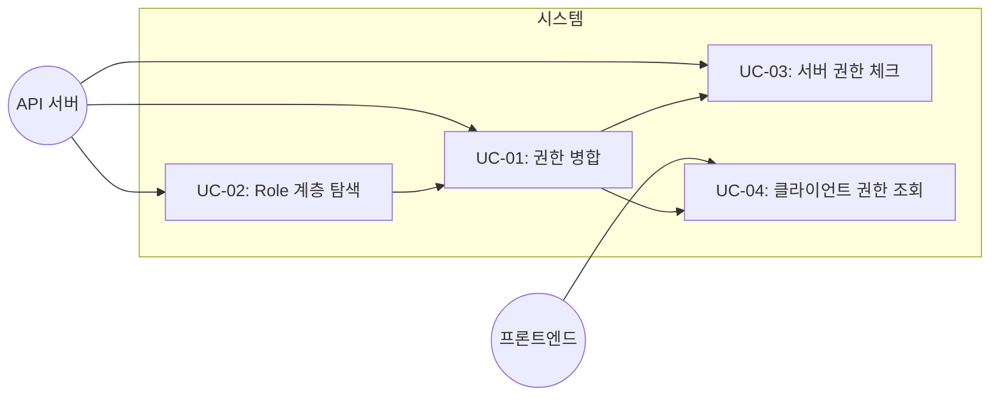
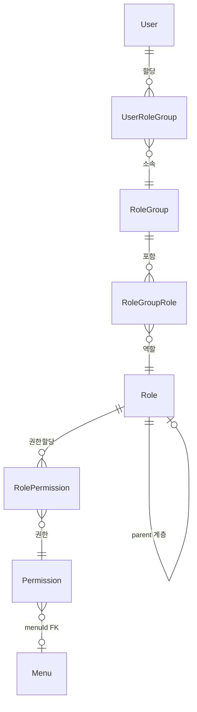
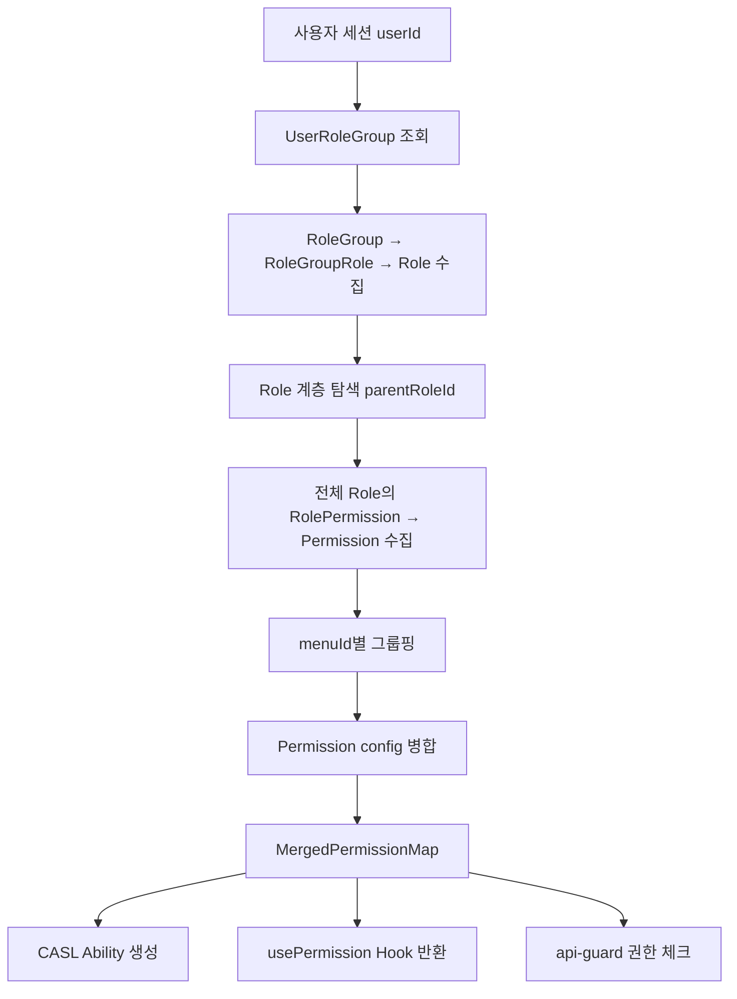

# TSK-03-01 - 권한 병합 및 체크 로직 구현 설계 문서

## 문서 정보

| 항목 | 내용 |
|------|------|
| Task ID | TSK-03-01 |
| 문서 버전 | 1.0 |
| 작성일 | 2026-01-27 |
| 상태 | 작성중 |
| 카테고리 | development |

---

## 1. 개요

### 1.1 배경 및 문제 정의

**현재 상황:**
- `lib/auth/ability.ts`는 단순 권한 코드 문자열(`menuId:action`) 기반으로 CASL Ability를 생성
- Permission.config JSON의 `fieldConstraints` 정보가 권한 체크에 반영되지 않음
- 같은 menuId에 대해 복수 Permission을 보유할 경우 병합 로직이 없음
- Role 계층(parentRoleId)에 의한 하위 권한 자동 상속이 구현되지 않음
- 클라이언트 측에서 권한 상태를 쉽게 조회할 수 있는 Hook이 없음

**해결하려는 문제:**
- 사용자에게 할당된 복수 Permission의 actions, fieldConstraints를 올바르게 병합
- Role 계층 탐색으로 상위 역할이 하위 역할의 권한을 자동 포함
- 병합된 Permission config 기반으로 CASL Ability 생성
- 서버/클라이언트 양측에서 일관된 권한 체크

### 1.2 목적 및 기대 효과

**목적:**
- Permission config(actions + fieldConstraints) 기반 권한 병합 로직 구현
- Role 계층 탐색을 통한 자동 권한 상속
- 서버 미들웨어 및 클라이언트 Hook에서 병합된 권한 활용

**기대 효과:**
- 세밀한 필드 수준 접근 제어 (공정/라인별 콤보박스 필터링)
- 복수 역할 보유 시 최대 권한 자동 적용 (합집합 원칙)
- 200ms 이내 권한 병합 계산 성능

### 1.3 범위

**포함:**
- `lib/auth/permission-merge.ts` (신규) - 권한 병합 로직
- `lib/auth/ability.ts` (수정) - config 기반 CASL Ability 생성
- `lib/auth/api-guard.ts` (수정) - 병합 로직 적용
- `lib/auth/hooks/usePermission.ts` (신규) - 클라이언트 Hook
- 전체 단위 테스트

**제외:**
- 화면 컴포넌트에 Hook 실제 적용 (별도 Task)
- 선분 이력 기반 시점 권한 조회
- Permission CRUD API

### 1.4 참조 문서

| 문서 | 경로 | 관련 섹션 |
|------|------|----------|
| PRD | `.orchay/projects/rbac-redesign/prd.md` | 4.5 권한 병합 규칙, 4.6 권한 체크 흐름 |
| TRD | `.orchay/projects/rbac-redesign/trd.md` | 2.2 Permission config, 6 권한 체크 흐름 |

---

## 2. 사용자 분석

### 2.1 대상 사용자

| 사용자 유형 | 특성 | 주요 니즈 |
|------------|------|----------|
| 백엔드 개발자 | API 라우트에서 권한 체크를 수행 | 간단한 함수 호출로 menuId + action + fieldConstraints 체크 |
| 프론트엔드 개발자 | 화면에서 버튼/콤보박스 권한 제어 | usePermission Hook으로 actions, fieldConstraints 조회 |
| 복수 역할 보유 사용자 | 여러 RoleGroup을 통해 복수 Permission 보유 | 보유한 모든 권한이 합집합으로 적용됨 |

### 2.2 사용자 페르소나

**페르소나 1: 2CGL+3CGL 겸임 담당자**
- 역할: 생산관리 담당 (2CGL 전담 + 3CGL 전담 역할 동시 보유)
- 목표: 생산현황 화면에서 2CGL, 3CGL 모두 조회
- 불만: 각각의 역할이 단일 라인만 허용하므로, 병합 없이는 하나만 보임
- 시나리오: 로그인 후 생산현황 화면 접속 시 PROC_CD 콤보박스에 ["2CGL", "3CGL"] 모두 표시

---

## 3. 유즈케이스

### 3.1 유즈케이스 다이어그램

### 3.2 유즈케이스 상세

#### UC-01: 권한 병합

| 항목 | 내용 |
|------|------|
| 액터 | 시스템 (내부 로직) |
| 목적 | 같은 menuId의 복수 Permission config를 합집합으로 병합 |
| 사전 조건 | 사용자의 Permission 목록이 수집된 상태 |
| 사후 조건 | menuId별 병합된 PermissionConfig (actions 합집합, fieldConstraints 병합) |
| 트리거 | 권한 체크 요청 시 |

**기본 흐름:**
1. 사용자의 모든 Permission을 menuId 기준으로 그룹핑
2. 같은 menuId 그룹 내 config.actions를 합집합
3. 같은 menuId 그룹 내 config.fieldConstraints를 병합 규칙에 따라 처리
4. 병합된 MergedPermission 맵 반환

**대안 흐름:**
- 1a. Permission이 하나뿐인 menuId: 병합 없이 그대로 반환
- 3a. fieldConstraints가 양쪽 모두 없는 경우: 제약 없음 유지

#### UC-02: Role 계층 탐색

| 항목 | 내용 |
|------|------|
| 액터 | 시스템 (내부 로직) |
| 목적 | parentRoleId 기반으로 하위 Role의 Permission을 자동 포함 |
| 사전 조건 | 사용자에게 할당된 Role 목록 존재 |
| 사후 조건 | 해당 Role + 모든 하위 Role의 Permission이 수집됨 |
| 트리거 | 권한 수집 시 |

**기본 흐름:**
1. 사용자의 직접 할당된 Role 목록 조회
2. 각 Role의 children(하위 Role)을 재귀 탐색
3. 탐색된 모든 Role의 RolePermission → Permission 수집
4. 수집된 전체 Permission 반환

**예외 흐름:**
- 2a. 순환 참조 방지를 위해 방문한 roleId Set 관리

#### UC-03: 서버 권한 체크

| 항목 | 내용 |
|------|------|
| 액터 | API 서버 |
| 목적 | API 요청에 대해 menuId + action + fieldConstraints 기반 권한 검증 |
| 사전 조건 | 인증된 사용자 세션 존재 |
| 사후 조건 | 권한 있으면 통과, 없으면 403 반환 |
| 트리거 | API 라우트 핸들러 호출 시 |

**기본 흐름:**
1. 세션에서 userId 추출
2. userId로 전체 Permission 수집 (Role 계층 포함)
3. menuId별 Permission 병합
4. 요청된 action이 병합된 actions에 포함되는지 확인
5. fieldConstraints 조건이 있으면 요청 데이터와 대조
6. 통과 또는 403 반환

#### UC-04: 클라이언트 권한 조회

| 항목 | 내용 |
|------|------|
| 액터 | 프론트엔드 컴포넌트 |
| 목적 | 현재 사용자의 특정 menuId에 대한 권한 정보 조회 |
| 사전 조건 | 사용자 세션 존재 |
| 사후 조건 | actions 배열, fieldConstraints, can() 함수 반환 |
| 트리거 | 화면 컴포넌트 렌더링 시 |

**기본 흐름:**
1. usePermission(menuId) Hook 호출
2. 서버에서 사용자의 병합된 Permission 조회 (API 또는 세션 데이터)
3. 해당 menuId의 actions, fieldConstraints 반환
4. can(action) 헬퍼 함수 제공

---

## 4. 사용자 시나리오

### 4.1 시나리오 1: 복수 Permission 병합

**상황 설명:**
사용자 A는 "2CGL 담당" 역할과 "3CGL 담당" 역할을 모두 보유한다. 두 역할 모두 menuId=20(생산현황)에 대한 Permission이 있으나, 각각 다른 fieldConstraints를 가진다.

**단계별 진행:**

| 단계 | 사용자 행동 | 시스템 반응 | 사용자 기대 |
|------|-----------|------------|------------|
| 1 | 생산현황 화면 접속 | Permission 수집 및 병합 실행 | - |
| 2 | PROC_CD 콤보박스 확인 | ["2CGL", "3CGL"] 표시 | 두 라인 모두 조회 가능 |
| 3 | 조회 버튼 클릭 | actions에 READ 포함 확인 → 허용 | 데이터 조회 성공 |

**성공 조건:**
- PROC_CD 값이 합집합으로 병합됨
- actions도 합집합으로 병합됨

### 4.2 시나리오 2: fieldConstraints 한쪽 없음 = 제약 해제

**상황 설명:**
사용자 B는 "관리자" 역할(fieldConstraints 없음)과 "2CGL 전담" 역할(PROC_CD: "2CGL")을 동시 보유한다.

**단계별 진행:**

| 단계 | 사용자 행동 | 시스템 반응 | 복구 방법 |
|------|-----------|------------|----------|
| 1 | 생산현황 화면 접속 | 병합 시 한쪽 fieldConstraints 없음 감지 → PROC_CD 제약 해제 | - |
| 2 | PROC_CD 콤보박스 확인 | 전체 값 표시 (제약 없음) | - |

---

## 5. 화면 설계

> 이 Task는 백엔드 로직 + Hook 구현이므로 화면 설계는 해당 없음.

---

## 6. 인터랙션 설계

> 해당 없음 (백엔드 + Hook만 구현)

---

## 7. 데이터 요구사항

### 7.1 필요한 데이터

| 데이터 | 설명 | 출처 | 용도 |
|--------|------|------|------|
| Permission.config | actions + fieldConstraints JSON | DB Permission 테이블 | 병합 대상 |
| Permission.menuId | 화면 연결 FK | DB Permission 테이블 | 그룹핑 키 |
| Role.parentRoleId | 상위 역할 참조 | DB Role 테이블 | 계층 탐색 |
| UserRoleGroup | 사용자-역할그룹 매핑 | DB UserRoleGroup 테이블 | 권한 수집 시작점 |

### 7.2 데이터 관계

**관계 설명:**
- User는 UserRoleGroup을 통해 RoleGroup에 소속
- RoleGroup은 RoleGroupRole을 통해 여러 Role을 포함
- Role은 parentRoleId로 계층 구조 형성 (상위 Role이 하위 Permission 자동 포함)
- Role은 RolePermission을 통해 여러 Permission 보유
- Permission은 menuId FK로 Menu에 연결, config JSON에 actions + fieldConstraints 저장

### 7.3 데이터 흐름

---

## 8. 비즈니스 규칙

### 8.1 핵심 규칙

| 규칙 ID | 규칙 설명 | 적용 상황 | 예외 |
|---------|----------|----------|------|
| BR-01 | actions 합집합 병합 | 같은 menuId의 복수 Permission | SYSTEM_ADMIN은 모든 actions 허용 |
| BR-02 | fieldConstraints 같은 필드: 값 합집합 | 같은 필드에 다른 값 | 없음 |
| BR-03 | fieldConstraints 한쪽 없음 = 제약 해제 | 한 Permission에 해당 필드 제약 없음 | 없음 |
| BR-04 | Role 계층 자동 상속 | parentRoleId 존재 시 | 순환 참조 방지 |

### 8.2 규칙 상세 설명

**BR-01: actions 합집합 병합**

설명: 같은 menuId에 대해 Permission A의 actions가 ["READ"]이고 Permission B의 actions가 ["READ", "UPDATE"]이면, 병합 결과는 ["READ", "UPDATE"]이다.

예시:
- Permission A: `{ actions: ["READ"] }`, Permission B: `{ actions: ["READ", "UPDATE", "DELETE"] }` → 병합: `{ actions: ["READ", "UPDATE", "DELETE"] }`

**BR-02: fieldConstraints 같은 필드 값 합집합**

설명: 같은 menuId에 대해 Permission A의 PROC_CD가 ["2CGL"]이고 Permission B의 PROC_CD가 ["3CGL"]이면, 병합 결과는 PROC_CD: ["2CGL", "3CGL"]이다.

예시:
- A: `{ fieldConstraints: { PROC_CD: "2CGL" } }`, B: `{ fieldConstraints: { PROC_CD: ["3CGL", "4CGL"] } }` → 병합: `{ fieldConstraints: { PROC_CD: ["2CGL", "3CGL", "4CGL"] } }`

**BR-03: fieldConstraints 한쪽 없음 = 제약 해제**

설명: 한쪽 Permission에 특정 필드의 fieldConstraint가 없으면, 해당 필드에 대한 제약이 해제된다 (전체 허용).

예시:
- A: `{ fieldConstraints: { PROC_CD: "2CGL" } }`, B: `{ fieldConstraints: {} }` 또는 `{ }` (fieldConstraints 없음) → 병합: `{}` (PROC_CD 제약 해제)
- A: `{ fieldConstraints: { PROC_CD: "2CGL", LINE_CD: "L1" } }`, B: `{ fieldConstraints: { PROC_CD: ["3CGL"] } }` → 병합: `{ fieldConstraints: { PROC_CD: ["2CGL", "3CGL"] } }` (LINE_CD는 B에 없으므로 해제)

**BR-04: Role 계층 자동 상속**

설명: Role에 parentRoleId가 설정된 경우, 상위 Role은 자신의 Permission과 함께 모든 하위(children) Role의 Permission도 자동으로 포함한다.

예시:
- "공장장" Role (level 0) → children: ["과장" Role (level 1)] → children: ["반장" Role (level 2)]
- "공장장"에게 할당 시: 공장장 + 과장 + 반장의 모든 Permission이 수집됨

---

## 9. 에러 처리

### 9.1 예상 에러 상황

| 상황 | 원인 | 사용자 메시지 | 복구 방법 |
|------|------|--------------|----------|
| config JSON 파싱 실패 | 잘못된 JSON 형식 | (내부 로그만) | 해당 Permission 건너뛰기 |
| 사용자 없음 | userId 불일치 | "사용자를 찾을 수 없습니다" | 404 반환 |
| 권한 없음 | 해당 menuId에 대한 action 미보유 | "권한이 없습니다" | 403 반환 |
| Role 순환 참조 | parentRoleId 순환 | (내부 로그) | 방문 Set으로 무한루프 방지 |

---

## 10. 연관 문서

| 문서 | 경로 | 용도 |
|------|------|------|
| 요구사항 추적 매트릭스 | `025-traceability-matrix.md` | PRD → 설계 → 테스트 양방향 추적 |
| 테스트 명세서 | `026-test-specification.md` | 단위/통합 테스트 상세 정의 |

---

## 11. 구현 범위

### 11.1 영향받는 영역

| 영역 | 변경 내용 | 영향도 |
|------|----------|--------|
| `lib/auth/permission-merge.ts` | 신규 생성 - 병합 로직 | 높음 |
| `lib/auth/ability.ts` | config 기반 Ability 생성으로 변경 | 높음 |
| `lib/auth/api-guard.ts` | 병합된 권한 기반 체크로 개선 | 높음 |
| `lib/auth/hooks/usePermission.ts` | 신규 생성 - 클라이언트 Hook | 중간 |
| `lib/auth/menu-filter.ts` | Role 계층 탐색 패턴 참조 | 낮음 |

### 11.2 의존성

| 의존 항목 | 이유 | 상태 |
|----------|------|------|
| Prisma 스키마 (Role.parentRoleId, Permission.config) | 데이터 모델 필요 | 완료 |
| CASL 라이브러리 | Ability 생성 | 완료 |
| next-auth 세션 | userId 조회 | 완료 |

### 11.3 제약 사항

| 제약 | 설명 | 대응 방안 |
|------|------|----------|
| 병합 성능 200ms 이내 | PRD 6.1 비기능 요구사항 | 메모리 내 병합, 불필요한 DB 조회 최소화 |
| config JSON 파싱 안정성 | 잘못된 JSON 존재 가능 | try-catch로 개별 Permission 실패 허용 |

---

## 12. 체크리스트

### 12.1 설계 완료 확인

- [x] 문제 정의 및 목적 명확화
- [x] 사용자 분석 완료
- [x] 유즈케이스 정의 완료
- [x] 사용자 시나리오 작성 완료
- [ ] 화면 설계 완료 (해당 없음 - 백엔드 로직)
- [ ] 인터랙션 설계 완료 (해당 없음)
- [x] 데이터 요구사항 정의 완료
- [x] 비즈니스 규칙 정의 완료
- [x] 에러 처리 정의 완료

### 12.2 연관 문서 작성

- [x] 요구사항 추적 매트릭스 작성 (-> `025-traceability-matrix.md`)
- [x] 테스트 명세서 작성 (-> `026-test-specification.md`)

### 12.3 구현 준비

- [x] 구현 우선순위 결정: permission-merge.ts → ability.ts → api-guard.ts → usePermission.ts
- [x] 의존성 확인 완료
- [x] 제약 사항 검토 완료

---

## 변경 이력

| 버전 | 일자 | 작성자 | 변경 내용 |
|------|------|--------|----------|
| 1.0 | 2026-01-27 | Claude | 최초 작성 |
