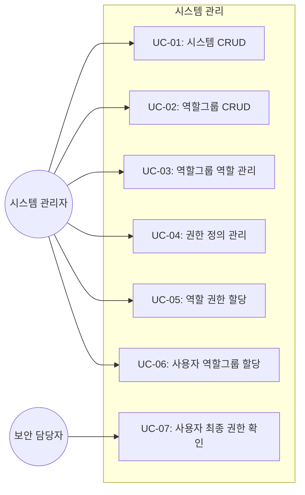
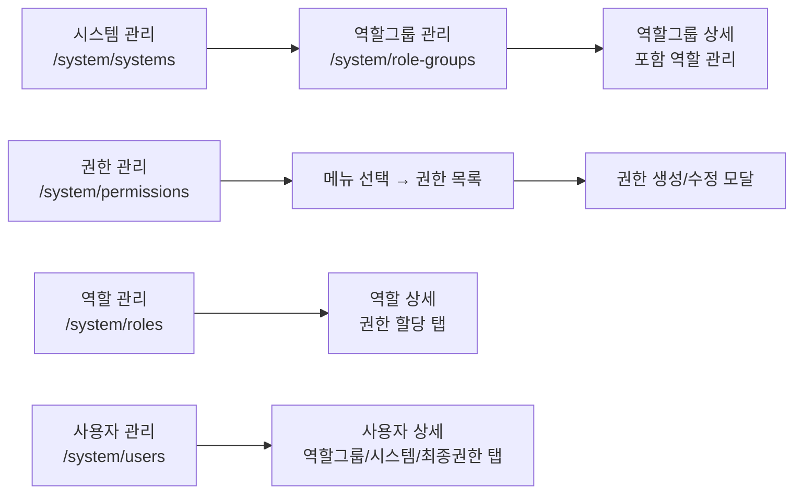
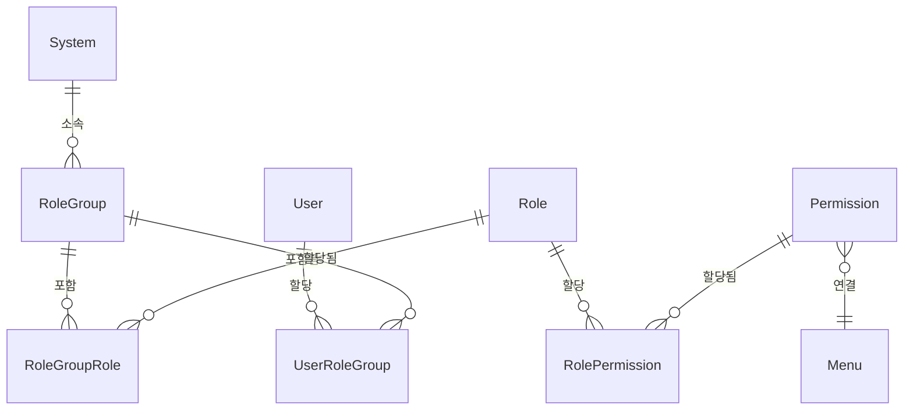

# TSK-03-02 - 시스템/역할그룹/권한 정의 관리 화면 설계 문서

## 문서 정보

| 항목 | 내용 |
|------|------|
| Task ID | TSK-03-02 |
| 문서 버전 | 1.0 |
| 작성일 | 2026-01-27 |
| 상태 | 작성중 |
| 카테고리 | development |

---

## 1. 개요

### 1.1 배경 및 문제 정의

**현재 상황:**
- RBAC 재설계에 따라 멀티 테넌트(System), RoleGroup, Permission config 등 새로운 백엔드 API가 구현 완료됨 (TSK-02-01, TSK-02-02)
- 관리자가 이러한 데이터를 관리할 수 있는 프론트엔드 화면이 존재하지 않음
- 기존 역할/사용자 관리 화면에 새로운 권한 체계(RoleGroup, Permission config)에 대한 기능이 부재

**해결하려는 문제:**
- 시스템(테넌트) 관리를 위한 CRUD 화면 부재
- 역할그룹 관리 및 역할 할당 화면 부재
- 메뉴-권한 연결 관리 화면 부재 (actions + fieldConstraints)
- 기존 역할 화면에 권한 할당 기능 미반영
- 기존 사용자 화면에 역할그룹/시스템 접근/최종 권한 표시 미반영

### 1.2 목적 및 기대 효과

**목적:**
- RBAC 재설계의 핵심 엔티티(System, RoleGroup, Permission)를 관리하는 5개 화면 구현
- 기존 역할/사용자 화면을 새 권한 체계에 맞게 확장

**기대 효과:**
- 관리자가 웹 UI를 통해 멀티 테넌트 환경의 권한 구조를 직관적으로 관리
- 메뉴 트리 기반 권한 할당으로 시각적 이해도 향상
- 사용자의 최종 권한을 한눈에 파악 가능

### 1.3 범위

**포함:**
- `/system/systems` - 시스템 CRUD 테이블
- `/system/role-groups` - 역할그룹 CRUD + 포함 역할 관리
- `/system/permissions` - 메뉴 트리 + 권한 상세 패널 + 생성/수정 모달
- `/system/roles` 개선 - 권한 할당 탭 추가
- `/system/users` 개선 - 역할그룹/시스템 접근/최종 권한 탭 추가

**제외:**
- 백엔드 API 수정 (이미 완료)
- 인증/로그인 관련 화면 변경
- 선분 이력 조회 화면 (별도 Task)

### 1.4 참조 문서

| 문서 | 경로 | 관련 섹션 |
|------|------|----------|
| PRD | `.orchay/projects/rbac-redesign/prd.md` | 4.1, 4.3, 4.4 |
| TRD | `.orchay/projects/rbac-redesign/trd.md` | API 설계 |
| 기본설계 | `.orchay/projects/rbac-redesign/000.basic-design.md` | 전체 |

---

## 2. 사용자 분석

### 2.1 대상 사용자

| 사용자 유형 | 특성 | 주요 니즈 |
|------------|------|----------|
| 시스템 관리자 | IT 부서, 높은 기술 이해도 | 시스템/역할그룹/권한 구조 설정 및 변경 |
| 공장 관리자 | 현장 관리, 중간 기술 이해도 | 자기 공장의 사용자 역할 할당 확인 |
| 보안 담당자 | 보안 정책 수립, 높은 보안 이해도 | 권한 현황 감사, 최종 권한 확인 |

### 2.2 사용자 페르소나

**페르소나 1: 김시스템 (IT 관리자)**
- 역할: IT 인프라팀 시스템 관리자
- 목표: 새 공장 추가 시 시스템/역할그룹/권한 구조를 신속히 구성
- 불만: 현재 DB 직접 수정으로 권한 설정을 해야 함
- 시나리오: 신규 공장 오픈 시 시스템 등록 → 역할그룹 생성 → 권한 할당 → 사용자 배정

**페르소나 2: 박보안 (보안 담당자)**
- 역할: 정보보안팀 감사 담당
- 목표: 특정 사용자의 최종 권한을 빠르게 확인
- 불만: 역할그룹 → 역할 → 권한 경로를 수동으로 추적해야 함
- 시나리오: 감사 요청 시 사용자 상세 → 최종 권한 탭에서 즉시 확인

---

## 3. 유즈케이스

### 3.1 유즈케이스 다이어그램



### 3.2 유즈케이스 상세

#### UC-01: 시스템 CRUD

| 항목 | 내용 |
|------|------|
| 액터 | 시스템 관리자 |
| 목적 | 멀티 테넌트 시스템을 등록/수정/삭제 |
| 사전 조건 | 관리자 권한으로 로그인 |
| 사후 조건 | 시스템 목록에 변경사항 반영 |
| 트리거 | 사이드바에서 시스템 관리 메뉴 클릭 |

**기본 흐름:**
1. 관리자가 `/system/systems` 페이지에 접근한다
2. 시스템 목록이 테이블로 표시된다
3. 관리자가 [시스템 등록] 버튼을 클릭한다
4. 생성 모달에서 시스템ID, 이름, 도메인, 설명을 입력한다
5. [저장] 클릭 시 API 호출 후 목록에 추가된다

**대안 흐름:**
- 3a. 기존 시스템 행의 [편집] 클릭 시 수정 모달 표시
- 3b. 기존 시스템 행의 [삭제] 클릭 시 확인 다이얼로그 후 삭제

**예외 흐름:**
- 4a. 도메인 중복 시 "이미 사용 중인 도메인입니다" 에러 표시
- 4b. 필수 필드 누락 시 폼 유효성 검사 에러 표시

#### UC-02: 역할그룹 CRUD

| 항목 | 내용 |
|------|------|
| 액터 | 시스템 관리자 |
| 목적 | 역할그룹을 생성/수정/삭제하고 소속 시스템을 지정 |
| 사전 조건 | 최소 1개 시스템 등록 완료 |
| 사후 조건 | 역할그룹 목록에 변경사항 반영 |
| 트리거 | 사이드바에서 역할그룹 관리 메뉴 클릭 |

**기본 흐름:**
1. 관리자가 `/system/role-groups` 페이지에 접근한다
2. 역할그룹 목록이 테이블로 표시된다 (소속 시스템, 포함 역할 수, 할당 사용자 수 포함)
3. 관리자가 [역할그룹 등록] 버튼을 클릭한다
4. 생성 모달에서 코드, 이름, 소속 시스템을 선택/입력한다
5. [저장] 클릭 시 API 호출 후 목록에 추가된다

**대안 흐름:**
- 2a. 시스템 필터 드롭다운으로 특정 시스템의 역할그룹만 필터링

#### UC-03: 역할그룹 역할 관리

| 항목 | 내용 |
|------|------|
| 액터 | 시스템 관리자 |
| 목적 | 역할그룹에 포함할 역할을 추가/제거 |
| 사전 조건 | 역할그룹 및 역할이 등록되어 있음 |
| 사후 조건 | 역할그룹의 포함 역할 변경됨 |
| 트리거 | 역할그룹 목록에서 특정 행 클릭 |

**기본 흐름:**
1. 관리자가 역할그룹 목록에서 특정 역할그룹을 클릭한다
2. 상세 패널이 오른쪽에 표시되며 현재 포함 역할 목록이 보인다
3. [역할 추가] 버튼 클릭 시 역할 선택 모달 표시
4. 추가할 역할을 체크하고 [확인]을 클릭한다
5. API 호출 후 포함 역할 목록에 추가된다

**대안 흐름:**
- 2a. 기존 역할의 [제거] 버튼 클릭 시 확인 후 해당 역할 제거

#### UC-04: 권한 정의 관리

| 항목 | 내용 |
|------|------|
| 액터 | 시스템 관리자 |
| 목적 | 메뉴별 권한을 정의 (actions, fieldConstraints) |
| 사전 조건 | 메뉴가 등록되어 있음 |
| 사후 조건 | 해당 메뉴에 권한 정의가 추가/수정됨 |
| 트리거 | 사이드바에서 권한 관리 메뉴 클릭 |

**기본 흐름:**
1. 관리자가 `/system/permissions` 페이지에 접근한다
2. 왼쪽에 메뉴 트리가, 오른쪽에 빈 상태 안내가 표시된다
3. 메뉴 트리에서 특정 메뉴 노드를 클릭한다
4. 오른쪽에 해당 메뉴의 권한 목록이 표시된다
5. [권한 추가] 버튼 클릭 시 생성 모달 표시
6. 권한 코드, 이름, actions 체크박스, fieldConstraints를 입력한다
7. [저장] 클릭 시 권한이 생성된다

**예외 흐름:**
- 6a. fieldConstraints JSON 형식 오류 시 유효성 검사 에러 표시

#### UC-05: 역할 권한 할당

| 항목 | 내용 |
|------|------|
| 액터 | 시스템 관리자 |
| 목적 | 역할에 권한을 할당 (메뉴 트리 기반 체크박스 매트릭스) |
| 사전 조건 | 역할과 권한이 등록되어 있음 |
| 사후 조건 | 역할의 권한 할당 변경됨 |
| 트리거 | 역할 상세 화면에서 [권한 할당] 탭 클릭 |

**기본 흐름:**
1. 관리자가 `/system/roles` 에서 특정 역할 상세 진입
2. [권한 할당] 탭을 클릭한다
3. 메뉴 트리와 권한 체크박스 매트릭스가 표시된다
4. 체크박스를 토글하여 권한을 할당/해제한다
5. [저장] 클릭 시 변경사항이 반영된다

#### UC-06: 사용자 역할그룹 할당

| 항목 | 내용 |
|------|------|
| 액터 | 시스템 관리자 |
| 목적 | 사용자에게 역할그룹을 할당/해제 |
| 사전 조건 | 사용자와 역할그룹이 등록되어 있음 |
| 사후 조건 | 사용자의 역할그룹 변경됨 |
| 트리거 | 사용자 상세 화면에서 [역할그룹] 탭 클릭 |

**기본 흐름:**
1. 관리자가 `/system/users` 에서 특정 사용자 상세 진입
2. [역할그룹] 탭을 클릭한다
3. 현재 할당된 역할그룹 목록이 표시된다
4. [역할그룹 추가] 클릭 시 선택 모달 표시
5. 역할그룹을 선택하고 [확인] 클릭

#### UC-07: 사용자 최종 권한 확인

| 항목 | 내용 |
|------|------|
| 액터 | 보안 담당자, 시스템 관리자 |
| 목적 | 사용자의 최종 계산된 권한을 메뉴 트리 형태로 확인 |
| 사전 조건 | 사용자에게 역할그룹이 할당되어 있음 |
| 사후 조건 | 없음 (읽기 전용) |
| 트리거 | 사용자 상세 화면에서 [최종 권한] 탭 클릭 |

**기본 흐름:**
1. 관리자가 `/system/users` 에서 특정 사용자 상세 진입
2. [최종 권한] 탭을 클릭한다
3. 메뉴 트리에 각 메뉴별 최종 권한(actions)이 태그로 표시된다
4. 권한 출처(어떤 역할그룹 → 역할 경로)가 함께 표시된다

---

## 4. 사용자 시나리오

### 4.1 시나리오 1: 신규 공장 시스템 설정

**상황 설명:**
김시스템 관리자가 새로운 공장(factory2)을 MES 시스템에 추가하고, 기본 역할그룹과 권한을 설정해야 한다.

**단계별 진행:**

| 단계 | 사용자 행동 | 시스템 반응 | 사용자 기대 |
|------|-----------|------------|------------|
| 1 | 시스템 관리 페이지 접근 | 시스템 목록 표시 | 기존 시스템 목록 확인 |
| 2 | [시스템 등록] 클릭 | 생성 모달 표시 | 입력 폼이 빈 상태로 열림 |
| 3 | ID: factory2, 이름: 제2공장 입력 | 실시간 유효성 검사 | 입력값이 정상임을 확인 |
| 4 | [저장] 클릭 | 성공 메시지, 목록 갱신 | 새 시스템이 목록에 보임 |
| 5 | 역할그룹 관리 이동 | 역할그룹 목록 표시 | factory2용 역할그룹 생성 가능 |
| 6 | [역할그룹 등록], 시스템: 제2공장 선택 | 생성 모달 표시 | 시스템 선택 드롭다운에 제2공장 있음 |
| 7 | 역할그룹 생성 후 역할 추가 | 역할 선택 모달 표시 | 가용 역할 목록에서 선택 가능 |

**성공 조건:**
- 제2공장 시스템이 등록되고 역할그룹에 역할이 할당됨

### 4.2 시나리오 2: 권한 정의 및 역할 할당

**상황 설명:**
관리자가 "생산실적" 메뉴에 대한 권한을 정의하고, "생산관리자" 역할에 해당 권한을 할당한다.

**단계별 진행:**

| 단계 | 사용자 행동 | 시스템 반응 | 사용자 기대 |
|------|-----------|------------|------------|
| 1 | 권한 관리 페이지 접근 | 메뉴 트리 + 빈 상세 패널 | 트리에 메뉴 구조 표시 |
| 2 | "조업관리 > 생산실적" 노드 클릭 | 오른쪽에 해당 메뉴 권한 목록 표시 | 기존 권한 있으면 목록, 없으면 빈 상태 |
| 3 | [권한 추가] 클릭 | 생성 모달 표시 | actions 체크박스와 fieldConstraints 에디터 |
| 4 | READ, UPDATE 체크, fieldConstraints 입력 | 실시간 JSON 유효성 검사 | 입력 형식이 올바른지 피드백 |
| 5 | [저장] 클릭 | 권한 생성, 목록 갱신 | 새 권한이 목록에 표시 |
| 6 | 역할 관리 → 생산관리자 상세 → 권한 할당 탭 | 메뉴 트리 + 체크박스 매트릭스 | 방금 만든 권한이 체크 가능 |
| 7 | 생산실적 메뉴의 권한 체크 | 체크 상태 변경 | 체크 표시 반영 |
| 8 | [저장] 클릭 | 권한 할당 완료 메시지 | 역할에 권한 할당 완료 |

**성공 조건:**
- 생산실적 메뉴에 권한이 정의되고, 생산관리자 역할에 할당됨

### 4.3 시나리오 3: 사용자 권한 감사 (에러 상황)

**상황 설명:**
보안 담당자가 특정 사용자의 최종 권한을 확인하려 하지만, 해당 사용자에게 역할그룹이 할당되지 않은 상태.

**단계별 진행:**

| 단계 | 사용자 행동 | 시스템 반응 | 복구 방법 |
|------|-----------|------------|----------|
| 1 | 사용자 관리 → 특정 사용자 상세 | 사용자 정보 표시 | - |
| 2 | [최종 권한] 탭 클릭 | "할당된 역할그룹이 없습니다" 빈 상태 | [역할그룹] 탭에서 역할그룹 할당 안내 |
| 3 | [역할그룹] 탭 이동 | 빈 역할그룹 목록 | [역할그룹 추가] 버튼으로 할당 |

---

## 5. 화면 설계

### 5.1 화면 흐름도



### 5.2 화면별 상세

#### 화면 1: 시스템 관리 (`/system/systems`)

**화면 목적:**
멀티 테넌트 시스템(공장/도메인)을 등록, 수정, 삭제하는 CRUD 테이블 화면

**진입 경로:**
- 사이드바 > 시스템 관리 > 시스템 목록

**와이어프레임:**
```
┌─────────────────────────────────────────────────────────────┐
│  시스템 관리                                    [+ 시스템 등록] │
├─────────────────────────────────────────────────────────────┤
│  🔍 검색: [________________]    상태: [전체 ▼]              │
├─────────────────────────────────────────────────────────────┤
│  시스템ID  │ 이름     │ 도메인              │ 활성 │ 작업    │
│  ──────────┼──────────┼─────────────────────┼──────┼─────── │
│  factory1  │ 제1공장  │ f1.mes.com          │ ● ON │ ✏️ 🗑️  │
│  factory2  │ 제2공장  │ f2.mes.com          │ ● ON │ ✏️ 🗑️  │
│  hq        │ 본사     │ hq.mes.com          │ ○ OFF│ ✏️ 🗑️  │
├─────────────────────────────────────────────────────────────┤
│                    < 1 2 3 >                                │
└─────────────────────────────────────────────────────────────┘
```

**화면 요소 설명:**

| 영역 | 설명 | 사용자 인터랙션 |
|------|------|----------------|
| 제목 영역 | 페이지 제목 + 등록 버튼 | [시스템 등록] 클릭 시 생성 모달 |
| 검색/필터 | 텍스트 검색 + 상태 필터 | 입력 시 실시간 필터링 |
| 테이블 | 시스템 목록 | 정렬, 페이지네이션 |
| 작업 컬럼 | 편집/삭제 아이콘 | 편집 모달, 삭제 확인 다이얼로그 |

**생성/수정 모달:**
```
┌──────────────────────────────────┐
│  시스템 등록                   ✕ │
├──────────────────────────────────┤
│  시스템 ID *  [________________] │
│  시스템명 *   [________________] │
│  도메인 *     [________________] │
│  설명         [________________] │
│               [________________] │
│  활성 상태    [● 활성화     ▼]   │
├──────────────────────────────────┤
│              [취소]    [저장]     │
└──────────────────────────────────┘
```

#### 화면 2: 역할그룹 관리 (`/system/role-groups`)

**화면 목적:**
역할그룹의 CRUD 및 포함 역할을 관리하는 마스터-디테일 화면

**진입 경로:**
- 사이드바 > 시스템 관리 > 역할그룹

**와이어프레임:**
```
┌──────────────────────────────────────────────────────────────────────┐
│  역할그룹 관리                                  [+ 역할그룹 등록]     │
├──────────────────────────────────────────────────────────────────────┤
│  시스템: [전체 ▼]   🔍 [________________]                           │
├─────────────────────────────────┬────────────────────────────────────┤
│  코드   │이름  │시스템│역할수│상태│  ▶ 역할그룹 상세: 생산관리그룹     │
│  ───────┼──────┼──────┼──────┼───│                                   │
│  RG-001 │생산관│제1공│  3   │ ON│  코드: RG-001                      │
│  RG-002 │품질관│제1공│  2   │ ON│  이름: 생산관리그룹                 │
│  RG-003 │설비관│제2공│  4   │ ON│  시스템: 제1공장                    │
│         │      │      │      │   │                                   │
│         │      │      │      │   │  ── 포함 역할 ──────── [+ 추가]   │
│         │      │      │      │   │  • 생산관리자        [제거]       │
│         │      │      │      │   │  • 조업담당자        [제거]       │
│         │      │      │      │   │  • 실적입력자        [제거]       │
│         │      │      │      │   │                                   │
│         │      │      │      │   │  ── 할당 사용자 (5명) ──          │
│         │      │      │      │   │  김생산, 이조업, 박실적...        │
├─────────────────────────────────┴────────────────────────────────────┤
│                    < 1 2 3 >                                         │
└──────────────────────────────────────────────────────────────────────┘
```

**화면 요소 설명:**

| 영역 | 설명 | 사용자 인터랙션 |
|------|------|----------------|
| 마스터 테이블 | 역할그룹 목록 | 행 클릭 시 오른쪽 상세 패널 표시 |
| 시스템 필터 | 소속 시스템 기준 필터링 | 드롭다운 선택 |
| 상세 패널 | 선택된 역할그룹 정보 | 역할 추가/제거 |
| 포함 역할 섹션 | 현재 포함된 역할 목록 | [추가] 모달, [제거] 버튼 |

#### 화면 3: 권한 관리 (`/system/permissions`)

**화면 목적:**
메뉴 트리 기반으로 각 메뉴의 권한을 정의하고 actions + fieldConstraints를 설정하는 화면

**진입 경로:**
- 사이드바 > 시스템 관리 > 권한 관리

**와이어프레임:**
```
┌──────────────────────────────────────────────────────────────────────┐
│  권한 관리                                                           │
├──────────────────────┬───────────────────────────────────────────────┤
│  메뉴 트리           │  생산실적 메뉴 권한                [+ 권한 추가]│
│                      │                                              │
│  📂 조업관리         │  권한코드    │ 이름       │ Actions  │ 작업   │
│    📄 생산계획   ◀   │  ────────────┼────────────┼──────────┼─────── │
│    📄 생산실적   ◀── │  PROD-R     │ 생산조회   │ R        │ ✏️ 🗑️  │
│    📄 작업지시       │  PROD-RU    │ 생산편집   │ R,U      │ ✏️ 🗑️  │
│  📂 품질관리         │  PROD-CRUD  │ 생산전체   │ C,R,U,D  │ ✏️ 🗑️  │
│    📄 검사실적       │                                              │
│    📄 불량관리       │                                              │
│  📂 설비관리         │                                              │
│    📄 설비현황       │                                              │
│    📄 보전이력       │                                              │
├──────────────────────┴───────────────────────────────────────────────┤
└──────────────────────────────────────────────────────────────────────┘
```

**권한 생성/수정 모달:**
```
┌──────────────────────────────────────────┐
│  권한 추가 - 생산실적                  ✕ │
├──────────────────────────────────────────┤
│  권한 코드 *  [________________]         │
│  권한명 *     [________________]         │
│                                          │
│  ── Actions ───────────────────────      │
│  ☑ CREATE  ☑ READ  ☑ UPDATE             │
│  ☐ DELETE  ☐ EXPORT  ☐ IMPORT           │
│                                          │
│  ── Field Constraints ─────────────      │
│  필드명        │ 허용 값       │ [+]     │
│  ──────────────┼───────────────┼───      │
│  lineId        │ LINE-01,LINE-02│ [-]    │
│  processType   │ ASSEMBLY      │ [-]     │
│  [+ 필드 추가]                           │
│                                          │
├──────────────────────────────────────────┤
│                [취소]    [저장]           │
└──────────────────────────────────────────┘
```

**화면 요소 설명:**

| 영역 | 설명 | 사용자 인터랙션 |
|------|------|----------------|
| 메뉴 트리 (좌측) | category 기반 폴더 구조 | 노드 클릭 시 오른쪽 패널 갱신 |
| 권한 목록 (우측) | 선택된 메뉴의 권한 | 편집/삭제 |
| 생성 모달 | 권한 정의 폼 | Actions 체크박스 + fieldConstraints 동적 에디터 |
| fieldConstraints 에디터 | 필드-값 쌍 동적 추가/삭제 | [+] 행 추가, [-] 행 삭제 |

#### 화면 4: 역할 관리 개선 (`/system/roles`)

**화면 목적:**
기존 역할 관리 화면에 [권한 할당] 탭을 추가하여 메뉴 트리 기반 권한 체크박스 매트릭스 제공

**진입 경로:**
- 사이드바 > 시스템 관리 > 역할 > 역할 상세 > 권한 할당 탭

**와이어프레임:**
```
┌──────────────────────────────────────────────────────────────────────┐
│  역할 상세: 생산관리자                                               │
├──────────────────────────────────────────────────────────────────────┤
│  [기본 정보]  [권한 할당]                                            │
├──────────────────────────────────────────────────────────────────────┤
│                                                        [저장] [취소] │
│  메뉴              │ 권한명     │ C │ R │ U │ D │ EX │ IM │         │
│  ──────────────────┼────────────┼───┼───┼───┼───┼────┼────│         │
│  📂 조업관리       │            │   │   │   │   │    │    │         │
│    📄 생산계획     │ 계획조회   │   │ ☑ │   │   │    │    │         │
│                    │ 계획편집   │ ☑ │ ☑ │ ☑ │   │    │    │         │
│    📄 생산실적     │ 실적조회   │   │ ☑ │   │   │ ☑  │    │         │
│                    │ 실적편집   │ ☑ │ ☑ │ ☑ │ ☑ │ ☑  │ ☑  │         │
│  📂 품질관리       │            │   │   │   │   │    │    │         │
│    📄 검사실적     │ 검사조회   │   │ ☑ │   │   │    │    │         │
├──────────────────────────────────────────────────────────────────────┤
└──────────────────────────────────────────────────────────────────────┘
```

**화면 요소 설명:**

| 영역 | 설명 | 사용자 인터랙션 |
|------|------|----------------|
| 탭 바 | 기본 정보 / 권한 할당 전환 | 탭 클릭 |
| 메뉴 트리 컬럼 | 메뉴 계층 구조 표시 | 폴더 펼침/접기 |
| 권한 매트릭스 | 각 권한의 action별 체크박스 | 체크/해제로 권한 할당 |
| 저장 버튼 | 변경사항 일괄 저장 | 변경 감지 시 활성화 |

#### 화면 5: 사용자 관리 개선 (`/system/users`)

**화면 목적:**
기존 사용자 상세 화면에 [역할그룹], [시스템 접근], [최종 권한] 3개 탭 추가

**진입 경로:**
- 사이드바 > 시스템 관리 > 사용자 > 사용자 상세

**와이어프레임 - 역할그룹 탭:**
```
┌──────────────────────────────────────────────────────────────────────┐
│  사용자 상세: 김생산 (kim@factory.com)                                │
├──────────────────────────────────────────────────────────────────────┤
│  [기본정보] [역할그룹] [시스템 접근] [최종 권한]                       │
├──────────────────────────────────────────────────────────────────────┤
│                                                   [+ 역할그룹 추가]  │
│  역할그룹       │ 시스템    │ 포함 역할              │ 작업          │
│  ───────────────┼──────────┼────────────────────────┼─────────      │
│  생산관리그룹   │ 제1공장   │ 생산관리자, 조업담당자  │ [제거]        │
│  품질조회그룹   │ 제1공장   │ 품질조회자             │ [제거]        │
├──────────────────────────────────────────────────────────────────────┤
└──────────────────────────────────────────────────────────────────────┘
```

**와이어프레임 - 시스템 접근 탭:**
```
┌──────────────────────────────────────────────────────────────────────┐
│  [기본정보] [역할그룹] [시스템 접근] [최종 권한]                       │
├──────────────────────────────────────────────────────────────────────┤
│  시스템        │ 도메인           │ 역할그룹 수  │ 접근 상태         │
│  ──────────────┼─────────────────┼─────────────┼─────────          │
│  제1공장       │ f1.mes.com      │ 2           │ ● 활성             │
│  제2공장       │ f2.mes.com      │ 0           │ ○ 미할당           │
├──────────────────────────────────────────────────────────────────────┤
└──────────────────────────────────────────────────────────────────────┘
```

**와이어프레임 - 최종 권한 탭:**
```
┌──────────────────────────────────────────────────────────────────────┐
│  [기본정보] [역할그룹] [시스템 접근] [최종 권한]                       │
├──────────────────────────────────────────────────────────────────────┤
│  시스템: [제1공장 ▼]                                                 │
│                                                                      │
│  메뉴              │ Actions           │ 권한 출처                    │
│  ──────────────────┼───────────────────┼──────────────────────────── │
│  📂 조업관리       │                   │                              │
│    📄 생산계획     │ READ              │ 생산관리그룹 > 생산관리자     │
│    📄 생산실적     │ CREATE,READ,      │ 생산관리그룹 > 생산관리자     │
│                    │ UPDATE,DELETE     │                              │
│  📂 품질관리       │                   │                              │
│    📄 검사실적     │ READ              │ 품질조회그룹 > 품질조회자     │
├──────────────────────────────────────────────────────────────────────┤
└──────────────────────────────────────────────────────────────────────┘
```

### 5.3 반응형 동작

| 화면 크기 | 레이아웃 변화 | 사용자 경험 |
|----------|--------------|------------|
| 데스크톱 (1024px+) | 마스터-디테일 좌우 분할 레이아웃 | 목록과 상세를 동시에 확인 |
| 태블릿 (768-1023px) | 상세 패널이 드로어로 전환 | 목록 전체 너비, 상세는 오버레이 |
| 모바일 (767px-) | 지원 제외 (관리자 전용 화면) | - |

---

## 6. 인터랙션 설계

### 6.1 사용자 액션과 피드백

| 사용자 액션 | 즉각 피드백 | 결과 피드백 | 에러 피드백 |
|------------|-----------|------------|------------|
| CRUD 저장 버튼 클릭 | 버튼 로딩 스피너 | message.success("저장되었습니다") | message.error("저장에 실패했습니다") |
| 삭제 버튼 클릭 | Modal.confirm 확인 다이얼로그 | message.success("삭제되었습니다") | message.error("삭제할 수 없습니다") |
| 테이블 행 클릭 | 행 하이라이트 + 상세 패널 슬라이드 | 상세 데이터 로드 | 로드 실패 시 에러 메시지 |
| 메뉴 트리 노드 클릭 | 노드 선택 하이라이트 | 우측 권한 목록 갱신 | 권한 목록 로드 실패 시 에러 |
| 권한 체크박스 토글 | 즉시 체크 상태 변경 | 변경 표시 (dirty state) | - |
| 검색 입력 | 300ms 디바운스 후 필터링 | 테이블 데이터 갱신 | 결과 없음 시 빈 상태 |

### 6.2 상태별 화면 변화

| 상태 | 화면 표시 | 사용자 안내 |
|------|----------|------------|
| 초기 로딩 | Ant Design Spin + Skeleton | "데이터를 불러오는 중..." |
| 데이터 없음 | Ant Design Empty 컴포넌트 | "등록된 항목이 없습니다. [등록] 버튼으로 추가하세요." |
| 메뉴 미선택 (권한 관리) | 오른쪽 패널 빈 상태 | "왼쪽 메뉴 트리에서 메뉴를 선택하세요." |
| 에러 발생 | Ant Design Alert | "문제가 발생했습니다. 다시 시도해주세요." |
| 저장 성공 | Ant Design message.success | "저장되었습니다." |
| 변경사항 있음 (미저장) | 저장 버튼 활성화 + Badge | 페이지 이탈 시 "저장하지 않은 변경사항이 있습니다" |

### 6.3 키보드/접근성

| 기능 | 키보드 단축키 | 스크린 리더 안내 |
|------|-------------|-----------------|
| 모달 닫기 | Esc | "모달 닫기" |
| 폼 제출 | Enter (모달 내) | "저장 버튼" |
| 트리 탐색 | 방향키 상/하/좌/우 | "메뉴 트리 탐색" |
| 테이블 탐색 | Tab | "다음 행으로 이동" |

---

## 7. 데이터 요구사항

### 7.1 필요한 데이터

| 데이터 | 설명 | 출처 | 용도 |
|--------|------|------|------|
| System | 시스템(테넌트) 정보 | GET /api/systems | 시스템 목록, 필터 드롭다운 |
| RoleGroup | 역할그룹 정보 + 포함 역할/사용자 수 | GET /api/role-groups | 역할그룹 목록, 상세 |
| Permission | 권한 정의 (actions, fieldConstraints) | GET /api/permissions | 권한 목록, 역할 할당 매트릭스 |
| Role | 역할 정보 | GET /api/roles | 역할 목록, 역할그룹에 역할 추가 |
| User | 사용자 정보 | GET /api/users | 사용자 목록, 상세 탭 |
| Menu | 메뉴 트리 | GET /api/menus | 메뉴 트리 렌더링 |
| UserPermissions | 사용자 최종 권한 (계산됨) | GET /api/users/:id/permissions | 최종 권한 탭 |
| UserSystems | 사용자 접근 가능 시스템 | GET /api/users/:id/systems | 시스템 접근 탭 |

### 7.2 데이터 관계



**관계 설명:**
- System은 여러 RoleGroup을 포함한다
- RoleGroup은 여러 Role을 포함한다 (N:M)
- Role은 여러 Permission을 할당받는다 (N:M)
- Permission은 하나의 Menu에 연결된다
- User는 여러 RoleGroup에 할당된다 (N:M)

### 7.3 데이터 유효성 규칙

| 데이터 필드 | 규칙 | 위반 시 메시지 |
|------------|------|---------------|
| 시스템 ID | 필수, 영문/숫자/하이픈, 3-50자 | "시스템 ID는 영문, 숫자, 하이픈만 사용 가능합니다 (3-50자)" |
| 시스템명 | 필수, 2-100자 | "시스템명은 2-100자 사이로 입력해주세요" |
| 도메인 | 필수, 도메인 형식, 고유 | "올바른 도메인 형식이 아닙니다" / "이미 사용 중인 도메인입니다" |
| 역할그룹 코드 | 필수, 영문/숫자/하이픈, 고유 | "이미 사용 중인 코드입니다" |
| 역할그룹명 | 필수, 2-100자 | "역할그룹명은 2-100자 사이로 입력해주세요" |
| 권한 코드 | 필수, 영문/숫자/하이픈, 고유 | "이미 사용 중인 권한 코드입니다" |
| 권한명 | 필수, 2-100자 | "권한명은 2-100자 사이로 입력해주세요" |
| Actions | 최소 1개 선택 | "최소 1개의 Action을 선택해주세요" |
| fieldConstraints 필드명 | 영문, 비어있지 않음 | "필드명을 입력해주세요" |

---

## 8. 비즈니스 규칙

### 8.1 핵심 규칙

| 규칙 ID | 규칙 설명 | 적용 상황 | 예외 |
|---------|----------|----------|------|
| BR-01 | 시스템 삭제 시 하위 역할그룹이 없어야 함 | 시스템 삭제 | 없음 |
| BR-02 | 역할그룹 삭제 시 할당된 사용자가 없어야 함 | 역할그룹 삭제 | 없음 |
| BR-03 | 권한의 menuId는 필수 (메뉴에 연결되지 않은 권한 불가) | 권한 생성/수정 | 없음 |
| BR-04 | 사용자 최종 권한은 모든 역할그룹 > 역할 > 권한 합집합 | 최종 권한 계산 | 없음 |
| BR-05 | 도메인은 시스템 간 고유해야 함 | 시스템 생성/수정 | 없음 |

### 8.2 규칙 상세 설명

**BR-01: 시스템 삭제 제약**

설명: 하위 역할그룹이 존재하는 시스템은 삭제할 수 없다. 데이터 무결성을 보장하기 위해 먼저 역할그룹을 모두 삭제/이동해야 한다.

예시:
- 역할그룹 0개인 시스템: 삭제 가능
- 역할그룹 1개 이상인 시스템: "하위 역할그룹이 존재하여 삭제할 수 없습니다" 에러

**BR-04: 최종 권한 합집합 계산**

설명: 사용자의 최종 권한은 User → UserRoleGroup → RoleGroup → RoleGroupRole → Role → RolePermission → Permission 경로를 따라 모든 Permission의 합집합으로 계산된다. 동일 메뉴에 여러 권한이 있으면 actions의 합집합이 적용된다.

예시:
- 역할A: 생산실적 READ → 역할B: 생산실적 READ,UPDATE → 최종: READ,UPDATE

---

## 9. 에러 처리

### 9.1 예상 에러 상황

| 상황 | 원인 | 사용자 메시지 | 복구 방법 |
|------|------|--------------|----------|
| 중복 도메인 | 이미 존재하는 도메인 입력 | "이미 사용 중인 도메인입니다" | 다른 도메인 입력 |
| 중복 코드 | 이미 존재하는 코드 입력 | "이미 사용 중인 코드입니다" | 다른 코드 입력 |
| 삭제 제약 | 하위 데이터 존재 | "하위 데이터가 존재하여 삭제할 수 없습니다" | 하위 데이터 먼저 정리 |
| 권한 없음 | 접근 권한 부재 | "이 작업을 수행할 권한이 없습니다" | 관리자에게 권한 요청 |
| 네트워크 오류 | 서버 연결 실패 | "서버와의 연결에 실패했습니다. 다시 시도해주세요." | 재시도 버튼 |
| 유효성 오류 | 필수 필드 누락/형식 오류 | 필드별 에러 메시지 | 해당 필드 수정 |

### 9.2 에러 표시 방식

| 에러 유형 | 표시 위치 | 표시 방법 |
|----------|----------|----------|
| 필드 유효성 오류 | 해당 필드 하단 | Ant Design Form.Item의 빨간색 에러 텍스트 |
| 서버 응답 오류 (409 등) | 모달/폼 상단 | Ant Design Alert (error) |
| 시스템 오류 (500, 네트워크) | 화면 우상단 | Ant Design message.error 토스트 |
| 삭제 제약 오류 | 확인 다이얼로그 | Modal.error로 상세 사유 표시 |

---

## 10. 연관 문서

> 상세 테스트 명세 및 요구사항 추적은 별도 문서에서 관리합니다.

| 문서 | 경로 | 용도 |
|------|------|------|
| 요구사항 추적 매트릭스 | `025-traceability-matrix.md` | PRD → 설계 → 테스트 양방향 추적 |
| 테스트 명세서 | `026-test-specification.md` | 단위/E2E/매뉴얼 테스트 상세 정의 |

---

## 11. 구현 범위

### 11.1 영향받는 영역

| 영역 | 변경 내용 | 영향도 |
|------|----------|--------|
| `/system/systems` | 신규 페이지 생성 | 높음 |
| `/system/role-groups` | 신규 페이지 생성 | 높음 |
| `/system/permissions` | 신규 페이지 생성 | 높음 |
| `/system/roles` | 기존 페이지에 권한 할당 탭 추가 | 중간 |
| `/system/users` | 기존 페이지에 3개 탭 추가 | 중간 |
| 사이드바 메뉴 | 시스템/역할그룹/권한 메뉴 항목 추가 | 낮음 |

### 11.2 의존성

| 의존 항목 | 이유 | 상태 |
|----------|------|------|
| TSK-02-01 (DB 스키마) | 데이터 모델 기반 | 완료 |
| TSK-02-02 (API 구현) | 프론트엔드가 호출할 API | 완료 |
| 기존 역할/사용자 관리 화면 | 탭 추가 대상 | 완료 |

### 11.3 제약 사항

| 제약 | 설명 | 대응 방안 |
|------|------|----------|
| 모바일 미지원 | 관리자 전용 화면으로 데스크톱/태블릿만 지원 | 최소 768px 이상 레이아웃 설계 |
| 대량 데이터 | 권한 매트릭스에 메뉴/권한이 많을 경우 성능 | 가상 스크롤 또는 트리 lazy loading |
| Ant Design 6.x | Tree + Table 조합의 커스텀 매트릭스 UI | Ant Design Tree, Table, Checkbox 조합 |

---

## 12. 체크리스트

### 12.1 설계 완료 확인

- [x] 문제 정의 및 목적 명확화
- [x] 사용자 분석 완료
- [x] 유즈케이스 정의 완료
- [x] 사용자 시나리오 작성 완료
- [x] 화면 설계 완료 (와이어프레임)
- [x] 인터랙션 설계 완료
- [x] 데이터 요구사항 정의 완료
- [x] 비즈니스 규칙 정의 완료
- [x] 에러 처리 정의 완료

### 12.2 연관 문서 작성

- [x] 요구사항 추적 매트릭스 작성 (→ `025-traceability-matrix.md`)
- [x] 테스트 명세서 작성 (→ `026-test-specification.md`)

### 12.3 구현 준비

- [x] 구현 우선순위 결정
- [x] 의존성 확인 완료
- [x] 제약 사항 검토 완료

---

## 변경 이력

| 버전 | 일자 | 작성자 | 변경 내용 |
|------|------|--------|----------|
| 1.0 | 2026-01-27 | Claude | 최초 작성 |
