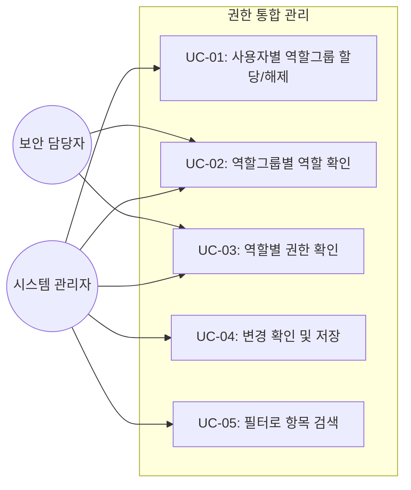
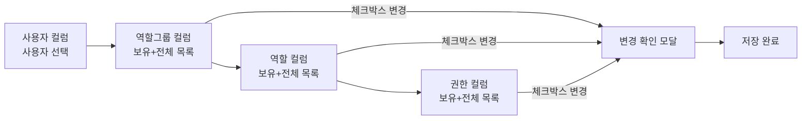
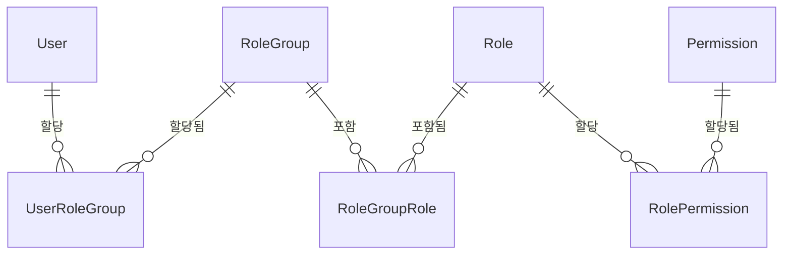

# TSK-03-03 - 권한 통합 관리 화면 설계 문서

## 문서 정보

| 항목 | 내용 |
|------|------|
| Task ID | TSK-03-03 |
| 문서 버전 | 1.0 |
| 작성일 | 2026-01-27 |
| 상태 | 작성중 |
| 카테고리 | development |

---

## 1. 개요

### 1.1 배경 및 문제 정의

**현재 상황:**
- TSK-03-02에서 시스템/역할그룹/권한 정의를 개별 화면으로 관리하는 구조가 구현됨
- 관리자가 특정 사용자의 권한을 변경하려면 여러 화면을 오가며 역할그룹 → 역할 → 권한 경로를 수동으로 추적해야 함
- 사용자 중심으로 "이 사용자가 어떤 역할그룹/역할/권한을 보유하는지" 한 화면에서 확인하고 관리하는 기능이 없음

**해결하려는 문제:**
- 사용자 선택 후 역할그룹 → 역할 → 권한을 3단 마스터-디테일로 탐색/할당하는 통합 화면 부재
- 할당 변경 시 변경 내역을 확인하는 프로세스 부재

### 1.2 목적 및 기대 효과

**목적:**
- `/system/authority` 경로에 3단 마스터-디테일 권한 통합 관리 화면 구현
- 사용자 선택 → 역할그룹 → 역할 → 권한 계층을 한 화면에서 탐색 및 할당/해제

**기대 효과:**
- 관리자가 사용자의 전체 권한 구조를 한눈에 파악
- 할당/해제 작업을 단일 화면에서 수행하여 작업 효율 향상
- 변경 확인 모달로 실수 방지

### 1.3 범위

**포함:**
- `/system/authority` - 3단 마스터-디테일 권한 통합 관리 화면
- 사용자 컬럼: 사용자 목록 + 검색/필터
- 역할그룹 컬럼: 보유 역할그룹(상단, 읽기전용) + 전체 역할그룹(하단, 체크박스 할당/해제)
- 역할 컬럼: 보유 역할(상단, 읽기전용) + 전체 역할(하단, 체크박스 할당/해제)
- 권한 컬럼: 보유 권한(상단, 읽기전용) + 전체 권한(하단, 체크박스 할당/해제)
- 변경 확인 모달: 추가/제거 항목 표시 후 저장
- 각 컬럼 필터: 검색, 상태, 소유여부, 레벨, 메뉴, 액션

**제외:**
- 백엔드 API 수정 (기존 API 활용)
- 사용자/역할그룹/역할/권한 CRUD (TSK-03-02에서 처리)

### 1.4 참조 문서

| 문서 | 경로 | 관련 섹션 |
|------|------|----------|
| PRD | `.orchay/projects/rbac-redesign/prd.md` | 4.1, 4.3 |
| TRD | `.orchay/projects/rbac-redesign/trd.md` | API 설계 |
| TSK-03-02 설계 | `.orchay/projects/rbac-redesign/tasks/TSK-03-02/010-design.md` | 전체 |

---

## 2. 사용자 분석

### 2.1 대상 사용자

| 사용자 유형 | 특성 | 주요 니즈 |
|------------|------|----------|
| 시스템 관리자 | IT 부서, 높은 기술 이해도 | 사용자별 권한 구조를 한 화면에서 관리 |
| 보안 담당자 | 보안 정책 수립, 높은 보안 이해도 | 사용자별 권한 현황 감사, 변경 이력 확인 |

### 2.2 사용자 페르소나

**페르소나 1: 김시스템 (IT 관리자)**
- 역할: IT 인프라팀 시스템 관리자
- 목표: 신규 입사자의 역할그룹/역할/권한을 빠르게 할당
- 불만: 여러 화면을 오가며 할당 작업을 수행해야 함
- 시나리오: 사용자 선택 → 역할그룹 할당 → 역할 확인 → 권한 최종 확인을 한 화면에서 처리

**페르소나 2: 박보안 (보안 담당자)**
- 역할: 정보보안팀 감사 담당
- 목표: 특정 사용자의 전체 권한 경로를 빠르게 확인
- 불만: 역할그룹 → 역할 → 권한 관계를 수동 추적
- 시나리오: 사용자 선택 후 3단 구조에서 보유 항목만 확인

---

## 3. 유즈케이스

### 3.1 유즈케이스 다이어그램



### 3.2 유즈케이스 상세

#### UC-01: 사용자별 역할그룹 할당/해제

| 항목 | 내용 |
|------|------|
| 액터 | 시스템 관리자 |
| 목적 | 선택한 사용자에게 역할그룹을 할당하거나 해제 |
| 사전 조건 | 관리자 권한으로 로그인, 사용자와 역할그룹이 존재 |
| 사후 조건 | 사용자의 역할그룹 할당이 변경됨 |
| 트리거 | 사이드바에서 권한 통합 관리 메뉴 클릭 |

**기본 흐름:**
1. 관리자가 `/system/authority` 페이지에 접근한다
2. 1단 컬럼에 사용자 목록이 표시된다
3. 사용자를 클릭하면 2단 컬럼에 역할그룹 정보가 표시된다
4. 상단에 현재 보유 역할그룹(읽기전용), 하단에 전체 역할그룹(체크박스)이 표시된다
5. 체크박스를 토글하여 역할그룹을 할당/해제한다
6. [저장] 클릭 시 변경 확인 모달이 표시된다
7. 모달에서 추가/제거 항목을 확인하고 [확인] 클릭 시 저장된다

**대안 흐름:**
- 6a. 변경사항이 없으면 저장 버튼 비활성화

**예외 흐름:**
- 7a. 저장 실패 시 에러 메시지 표시, 변경 상태 유지

#### UC-02: 역할그룹별 역할 확인

| 항목 | 내용 |
|------|------|
| 액터 | 시스템 관리자, 보안 담당자 |
| 목적 | 선택한 역할그룹에 포함된 역할 확인 |
| 사전 조건 | 사용자가 선택되어 있고 역할그룹이 표시됨 |
| 사후 조건 | 3단 컬럼에 역할 정보 표시 |
| 트리거 | 2단 컬럼에서 역할그룹 클릭 |

**기본 흐름:**
1. 관리자가 2단 컬럼의 역할그룹(상단 보유 목록 또는 하단 전체 목록)을 클릭한다
2. 3단 컬럼 상단에 해당 역할그룹의 보유 역할(읽기전용)이 표시된다
3. 3단 컬럼 하단에 전체 역할 목록(체크박스)이 표시된다

#### UC-03: 역할별 권한 확인

| 항목 | 내용 |
|------|------|
| 액터 | 시스템 관리자, 보안 담당자 |
| 목적 | 선택한 역할에 할당된 권한 확인 |
| 사전 조건 | 역할그룹이 선택되어 있고 역할이 표시됨 |
| 사후 조건 | 4단 컬럼에 권한 정보 표시 |
| 트리거 | 3단 컬럼에서 역할 클릭 |

**기본 흐름:**
1. 관리자가 3단 컬럼의 역할을 클릭한다
2. 4단 컬럼 상단에 해당 역할의 보유 권한(읽기전용)이 표시된다
3. 4단 컬럼 하단에 전체 권한 목록(체크박스)이 표시된다

#### UC-04: 변경 확인 및 저장

| 항목 | 내용 |
|------|------|
| 액터 | 시스템 관리자 |
| 목적 | 할당 변경 내역을 확인하고 저장 |
| 사전 조건 | 체크박스로 할당 변경이 발생함 |
| 사후 조건 | 변경사항이 서버에 저장됨 |
| 트리거 | [저장] 버튼 클릭 |

**기본 흐름:**
1. 관리자가 [저장] 버튼을 클릭한다
2. 변경 확인 모달이 표시된다
3. 모달에 추가 항목(녹색)과 제거 항목(적색)이 구분 표시된다
4. [확인] 클릭 시 API 호출 후 저장된다
5. 성공 메시지 표시, 화면 갱신

**예외 흐름:**
- 2a. 변경사항이 없으면 모달 대신 "변경사항이 없습니다" 메시지 표시

#### UC-05: 필터로 항목 검색

| 항목 | 내용 |
|------|------|
| 액터 | 시스템 관리자, 보안 담당자 |
| 목적 | 각 컬럼의 항목을 필터링하여 빠르게 찾기 |
| 사전 조건 | 해당 컬럼에 데이터가 표시됨 |
| 사후 조건 | 필터 조건에 맞는 항목만 표시 |
| 트리거 | 필터 입력 변경 |

**기본 흐름:**
1. 관리자가 컬럼 상단의 검색 입력란에 텍스트를 입력한다
2. 300ms 디바운스 후 해당 컬럼의 목록이 필터링된다
3. 상태(활성/비활성), 소유여부, 레벨, 메뉴, 액션 필터를 조합하여 사용 가능

---

## 4. 사용자 시나리오

### 4.1 시나리오 1: 신규 입사자 권한 할당

**상황 설명:**
김시스템 관리자가 신규 입사자 "이신입"에게 생산관리그룹 역할그룹을 할당하고, 해당 역할그룹에 포함된 역할과 권한을 확인한다.

**단계별 진행:**

| 단계 | 사용자 행동 | 시스템 반응 | 사용자 기대 |
|------|-----------|------------|------------|
| 1 | `/system/authority` 접근 | 사용자 목록 표시 | 전체 사용자 목록이 보임 |
| 2 | 검색란에 "이신입" 입력 | 사용자 목록 필터링 | 이신입 사용자가 표시됨 |
| 3 | "이신입" 클릭 | 2단 역할그룹 컬럼 표시 (보유: 없음, 전체: 모든 역할그룹) | 아직 역할그룹 없음 확인 |
| 4 | 하단 전체 목록에서 "생산관리그룹" 체크 | 체크 상태 변경, 저장 버튼 활성화 | 할당 예정 표시 |
| 5 | [저장] 클릭 | 변경 확인 모달: "추가: 생산관리그룹" 표시 | 변경 내역 확인 |
| 6 | [확인] 클릭 | 저장 완료 메시지, 상단 보유 목록에 생산관리그룹 추가 | 할당 완료 |
| 7 | "생산관리그룹" 클릭 | 3단 역할 컬럼에 포함 역할 표시 | 생산관리자, 조업담당자 등 확인 |

**성공 조건:**
- 이신입에게 생산관리그룹이 할당되고, 포함 역할/권한을 확인 가능

### 4.2 시나리오 2: 역할그룹 해제 시 변경 확인

**상황 설명:**
관리자가 퇴직 예정자의 역할그룹을 해제하려 하는데, 변경 확인 모달에서 제거 항목을 확인 후 저장한다.

**단계별 진행:**

| 단계 | 사용자 행동 | 시스템 반응 | 복구 방법 |
|------|-----------|------------|----------|
| 1 | 사용자 선택 후 보유 역할그룹 확인 | 상단에 보유 역할그룹 표시 | - |
| 2 | 하단 전체 목록에서 해당 역할그룹 체크 해제 | 체크 해제, 저장 버튼 활성화 | 다시 체크하여 복원 |
| 3 | [저장] 클릭 | 변경 확인 모달: "제거: 생산관리그룹" 적색 표시 | [취소]로 모달 닫기 |
| 4 | [확인] 클릭 | 저장 완료, 상단 보유 목록에서 제거됨 | 다시 할당 |

---

## 5. 화면 설계

### 5.1 화면 흐름도



### 5.2 화면별 상세

#### 화면 1: 권한 통합 관리 (`/system/authority`)

**화면 목적:**
사용자 중심으로 역할그룹 → 역할 → 권한의 3단 마스터-디테일 구조를 통해 권한을 탐색하고 할당/해제하는 통합 화면

**진입 경로:**
- 사이드바 > 시스템 관리 > 권한 통합 관리

**와이어프레임:**
```
┌──────────────────────────────────────────────────────────────────────────────────────────────┐
│  권한 통합 관리                                                              [저장] [초기화]  │
├───────────────────┬───────────────────────┬───────────────────────┬───────────────────────────┤
│  사용자            │  역할그룹              │  역할                  │  권한                      │
│                   │                       │                       │                           │
│  🔍 [__________]  │  🔍 [__________]      │  🔍 [__________]      │  🔍 [__________]          │
│  상태:[전체▼]      │  상태:[전체▼]          │  상태:[전체▼]          │  메뉴:[전체▼]              │
│                   │  소유:[전체▼]          │  소유:[전체▼]          │  액션:[전체▼]              │
│                   │                       │                       │  소유:[전체▼]              │
├───────────────────┼───────────────────────┼───────────────────────┼───────────────────────────┤
│                   │  ── 보유 역할그룹 ──    │  ── 보유 역할 ──       │  ── 보유 권한 ──           │
│  ▶ 김생산         │  생산관리그룹          │  생산관리자            │  PROD-READ               │
│    이품질         │  품질조회그룹          │  조업담당자            │  PROD-UPDATE             │
│    박설비         │                       │                       │  QC-READ                 │
│    정관리         │                       │                       │                           │
│    최사용         │                       │                       │                           │
│                   ├───────────────────────┼───────────────────────┼───────────────────────────┤
│                   │  ── 전체 역할그룹 ──    │  ── 전체 역할 ──       │  ── 전체 권한 ──           │
│                   │  ☑ 생산관리그룹        │  ☑ 생산관리자          │  ☑ PROD-READ             │
│                   │  ☑ 품질조회그룹        │  ☑ 조업담당자          │  ☑ PROD-UPDATE           │
│                   │  ☐ 설비관리그룹        │  ☐ 실적입력자          │  ☑ QC-READ               │
│                   │  ☐ 경영관리그룹        │  ☐ 품질검사자          │  ☐ PROD-DELETE           │
│                   │                       │  ☐ 설비관리자          │  ☐ QC-UPDATE             │
│                   │                       │                       │  ☐ EQUIP-READ            │
├───────────────────┴───────────────────────┴───────────────────────┴───────────────────────────┤
└──────────────────────────────────────────────────────────────────────────────────────────────┘
```

**화면 요소 설명:**

| 영역 | 설명 | 사용자 인터랙션 |
|------|------|----------------|
| 제목 영역 | 페이지 제목 + 저장/초기화 버튼 | [저장] 시 변경 확인 모달, [초기화] 시 변경사항 되돌리기 |
| 사용자 컬럼 | 사용자 목록 + 검색/상태 필터 | 사용자 클릭 시 2단 역할그룹 컬럼 갱신 |
| 역할그룹 컬럼 (상단) | 선택 사용자의 보유 역할그룹 (읽기전용) | 클릭 시 3단 역할 컬럼 갱신 |
| 역할그룹 컬럼 (하단) | 전체 역할그룹 체크박스 | 체크/해제로 할당 변경 |
| 역할 컬럼 (상단) | 선택 역할그룹의 보유 역할 (읽기전용) | 클릭 시 4단 권한 컬럼 갱신 |
| 역할 컬럼 (하단) | 전체 역할 체크박스 | 체크/해제로 할당 변경 |
| 권한 컬럼 (상단) | 선택 역할의 보유 권한 (읽기전용) | 읽기전용 확인 |
| 권한 컬럼 (하단) | 전체 권한 체크박스 | 체크/해제로 할당 변경 |
| 필터 영역 | 검색, 상태, 소유여부, 레벨, 메뉴, 액션 | 필터 변경 시 해당 컬럼 목록 갱신 |

**변경 확인 모달:**
```
┌──────────────────────────────────────────┐
│  변경 확인                             ✕ │
├──────────────────────────────────────────┤
│                                          │
│  ── 역할그룹 변경 ──                      │
│  + 설비관리그룹 (추가)        [녹색]      │
│  - 품질조회그룹 (제거)        [적색]      │
│                                          │
│  ── 역할 변경 ──                          │
│  + 실적입력자 (추가)          [녹색]      │
│                                          │
│  ── 권한 변경 ──                          │
│  + EQUIP-READ (추가)         [녹색]      │
│  - QC-READ (제거)            [적색]      │
│                                          │
├──────────────────────────────────────────┤
│              [취소]    [확인]             │
└──────────────────────────────────────────┘
```

**사용자 행동 시나리오:**
1. 사용자가 화면에 진입하면 1단 사용자 목록을 본다
2. 사용자를 클릭하면 2단 역할그룹 컬럼이 갱신된다
3. 역할그룹을 클릭하면 3단 역할 컬럼이 갱신된다
4. 역할을 클릭하면 4단 권한 컬럼이 갱신된다
5. 하단 체크박스로 할당을 변경하고 [저장]을 누르면 변경 확인 모달이 표시된다

### 5.3 반응형 동작

| 화면 크기 | 레이아웃 변화 | 사용자 경험 |
|----------|--------------|------------|
| 데스크톱 (1280px+) | 4단 컬럼 좌우 균등 분할 | 전체 구조를 한눈에 파악 |
| 데스크톱 (1024-1279px) | 4단 컬럼, 각 컬럼 너비 축소 | 스크롤 발생 가능 |
| 태블릿 (768-1023px) | 지원 제외 (관리자 전용 화면) | - |
| 모바일 (767px-) | 지원 제외 | - |

---

## 6. 인터랙션 설계

### 6.1 사용자 액션과 피드백

| 사용자 액션 | 즉각 피드백 | 결과 피드백 | 에러 피드백 |
|------------|-----------|------------|------------|
| 사용자 클릭 | 행 하이라이트 | 2단 역할그룹 컬럼 갱신 (로딩 스피너) | 데이터 로드 실패 시 에러 메시지 |
| 역할그룹 클릭 | 행 하이라이트 | 3단 역할 컬럼 갱신 | 데이터 로드 실패 시 에러 메시지 |
| 역할 클릭 | 행 하이라이트 | 4단 권한 컬럼 갱신 | 데이터 로드 실패 시 에러 메시지 |
| 체크박스 토글 | 즉시 체크 상태 변경 | 저장 버튼 활성화 (dirty state) | - |
| [저장] 클릭 | 변경 확인 모달 표시 | - | 변경사항 없으면 "변경사항이 없습니다" |
| 모달 [확인] 클릭 | 버튼 로딩 스피너 | message.success("저장되었습니다") | message.error("저장에 실패했습니다") |
| 검색 입력 | 300ms 디바운스 후 필터링 | 목록 갱신 | 결과 없음 시 빈 상태 |
| 필터 변경 | 즉시 목록 갱신 | 필터 조건 반영 | - |

### 6.2 상태별 화면 변화

| 상태 | 화면 표시 | 사용자 안내 |
|------|----------|------------|
| 초기 로딩 | 사용자 컬럼 Skeleton | "데이터를 불러오는 중..." |
| 사용자 미선택 | 2~4단 컬럼 빈 상태 | "왼쪽에서 사용자를 선택하세요." |
| 역할그룹 미선택 | 3~4단 컬럼 빈 상태 | "역할그룹을 선택하세요." |
| 역할 미선택 | 4단 컬럼 빈 상태 | "역할을 선택하세요." |
| 데이터 없음 | 해당 컬럼 Empty 컴포넌트 | "등록된 항목이 없습니다." |
| 변경사항 있음 | 저장 버튼 활성화 + Badge | 페이지 이탈 시 "저장하지 않은 변경사항이 있습니다" |
| 저장 성공 | message.success | "저장되었습니다." |
| 에러 발생 | message.error | "저장에 실패했습니다. 다시 시도해주세요." |

### 6.3 키보드/접근성

| 기능 | 키보드 단축키 | 스크린 리더 안내 |
|------|-------------|-----------------|
| 저장 | Ctrl+S | "저장 버튼" |
| 모달 닫기 | Esc | "모달 닫기" |
| 목록 탐색 | 방향키 상/하 | "목록 항목 탐색" |
| 컬럼 간 이동 | Tab | "다음 컬럼으로 이동" |

---

## 7. 데이터 요구사항

### 7.1 필요한 데이터

| 데이터 | 설명 | 출처 | 용도 |
|--------|------|------|------|
| 사용자 목록 | 전체 사용자 | GET /api/users | 1단 사용자 컬럼 |
| 사용자별 역할그룹 | 선택 사용자의 보유 역할그룹 | GET /api/users/:id/role-groups | 2단 상단 보유 목록 |
| 전체 역할그룹 | 모든 역할그룹 | GET /api/role-groups | 2단 하단 전체 목록 |
| 역할그룹별 역할 | 선택 역할그룹의 보유 역할 | GET /api/role-groups/:id/roles | 3단 상단 보유 목록 |
| 전체 역할 | 모든 역할 | GET /api/roles | 3단 하단 전체 목록 |
| 역할별 권한 | 선택 역할의 보유 권한 | GET /api/roles/:id/permissions | 4단 상단 보유 목록 |
| 전체 권한 | 모든 권한 | GET /api/permissions | 4단 하단 전체 목록 |

### 7.2 데이터 관계



**관계 설명:**
- User는 여러 RoleGroup에 할당된다 (N:M)
- RoleGroup은 여러 Role을 포함한다 (N:M)
- Role은 여러 Permission을 할당받는다 (N:M)
- 상위 선택 시 하위 데이터가 자동으로 갱신된다

### 7.3 데이터 유효성 규칙

| 데이터 필드 | 규칙 | 위반 시 메시지 |
|------------|------|---------------|
| 사용자 선택 | 저장 전 사용자가 선택되어야 함 | "사용자를 선택해주세요" |
| 체크박스 변경 | 최소 1개 이상의 변경사항 필요 | "변경사항이 없습니다" |

---

## 8. 비즈니스 규칙

### 8.1 핵심 규칙

| 규칙 ID | 규칙 설명 | 적용 상황 | 예외 |
|---------|----------|----------|------|
| BR-01 | 상위 선택 시 하위 컬럼 자동 갱신 | 사용자/역할그룹/역할 선택 | 없음 |
| BR-02 | 변경 저장 전 확인 모달 필수 | 모든 할당 변경 저장 시 | 없음 |
| BR-03 | 보유 목록은 읽기전용 | 각 컬럼 상단 보유 목록 | 없음 |
| BR-04 | 할당 변경은 하단 전체 목록 체크박스로만 | 할당/해제 작업 | 없음 |
| BR-05 | 소유여부 필터는 보유/미보유/전체 구분 | 각 컬럼 필터 | 없음 |

### 8.2 규칙 상세 설명

**BR-01: 상위 선택 시 하위 자동 갱신**

설명: 1단에서 사용자를 선택하면 2단(역할그룹)이 갱신되고, 2단에서 역할그룹을 선택하면 3단(역할)이 갱신되며, 3단에서 역할을 선택하면 4단(권한)이 갱신된다. 상위가 변경되면 하위 컬럼은 초기 상태로 리셋된다.

예시:
- 사용자 A 선택 → 사용자 A의 역할그룹 표시, 3~4단 리셋
- 역할그룹 B 선택 → 역할그룹 B의 역할 표시, 4단 리셋

**BR-02: 변경 확인 모달**

설명: [저장] 클릭 시 변경 확인 모달이 표시되며, 추가 항목(녹색)과 제거 항목(적색)이 구분되어 표시된다. [확인] 클릭 시에만 실제 API 호출이 발생한다.

예시:
- 역할그룹 A 추가 + 역할그룹 B 제거 → 모달에 "+A (추가)" 녹색, "-B (제거)" 적색 표시

---

## 9. 에러 처리

### 9.1 예상 에러 상황

| 상황 | 원인 | 사용자 메시지 | 복구 방법 |
|------|------|--------------|----------|
| 사용자 목록 로드 실패 | 네트워크/서버 오류 | "사용자 목록을 불러올 수 없습니다" | 재시도 버튼 |
| 역할그룹 로드 실패 | API 오류 | "역할그룹 정보를 불러올 수 없습니다" | 사용자 재선택 |
| 저장 실패 | 서버 오류/충돌 | "저장에 실패했습니다. 다시 시도해주세요." | 재시도 |
| 권한 없음 | 접근 권한 부재 | "이 작업을 수행할 권한이 없습니다" | 관리자 문의 |
| 동시 수정 충돌 | 다른 관리자가 동시 수정 | "다른 관리자가 수정 중입니다. 새로고침 후 다시 시도해주세요." | 새로고침 |

### 9.2 에러 표시 방식

| 에러 유형 | 표시 위치 | 표시 방법 |
|----------|----------|----------|
| 데이터 로드 실패 | 해당 컬럼 | Ant Design Alert (error) |
| 저장 실패 | 화면 우상단 | Ant Design message.error 토스트 |
| 권한 없음 | 화면 중앙 | Ant Design Result (403) |

---

## 10. 연관 문서

> 상세 테스트 명세 및 요구사항 추적은 별도 문서에서 관리합니다.

| 문서 | 경로 | 용도 |
|------|------|------|
| 요구사항 추적 매트릭스 | `025-traceability-matrix.md` | PRD → 설계 → 테스트 양방향 추적 |
| 테스트 명세서 | `026-test-specification.md` | 단위/E2E/매뉴얼 테스트 상세 정의 |

---

## 11. 구현 범위

### 11.1 영향받는 영역

| 영역 | 변경 내용 | 영향도 |
|------|----------|--------|
| `/system/authority` | 신규 페이지 생성 (3단 마스터-디테일) | 높음 |
| 사이드바 메뉴 | 권한 통합 관리 메뉴 항목 추가 | 낮음 |

### 11.2 의존성

| 의존 항목 | 이유 | 상태 |
|----------|------|------|
| TSK-02-01 (DB 스키마) | 데이터 모델 기반 | 완료 |
| TSK-02-02 (API 구현) | 프론트엔드가 호출할 API | 완료 |
| TSK-03-02 (기본 관리 화면) | 공유 컴포넌트 및 패턴 참고 | 완료 |

### 11.3 제약 사항

| 제약 | 설명 | 대응 방안 |
|------|------|----------|
| 4단 컬럼 레이아웃 | 최소 1280px 이상에서 최적 | 1024px 이하 미지원 |
| 대량 데이터 | 각 컬럼의 목록이 많을 경우 성능 | 가상 스크롤 또는 페이지네이션 |
| API 호출 빈도 | 상위 선택 시 하위 API 연쇄 호출 | React Query 캐싱 활용 |

---

## 12. 체크리스트

### 12.1 설계 완료 확인

- [x] 문제 정의 및 목적 명확화
- [x] 사용자 분석 완료
- [x] 유즈케이스 정의 완료
- [x] 사용자 시나리오 작성 완료
- [x] 화면 설계 완료 (와이어프레임)
- [x] 인터랙션 설계 완료
- [x] 데이터 요구사항 정의 완료
- [x] 비즈니스 규칙 정의 완료
- [x] 에러 처리 정의 완료

### 12.2 연관 문서 작성

- [x] 요구사항 추적 매트릭스 작성 (→ `025-traceability-matrix.md`)
- [x] 테스트 명세서 작성 (→ `026-test-specification.md`)

### 12.3 구현 준비

- [x] 구현 우선순위 결정
- [x] 의존성 확인 완료
- [x] 제약 사항 검토 완료

---

## 변경 이력

| 버전 | 일자 | 작성자 | 변경 내용 |
|------|------|--------|----------|
| 1.0 | 2026-01-27 | Claude | 최초 작성 |
