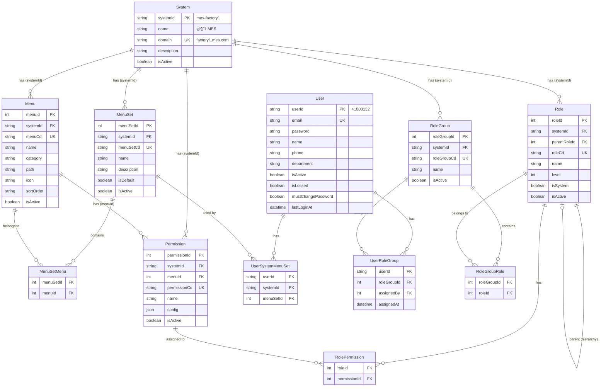

# RBAC 재설계 TRD (Technical Requirements Document)

## 프로젝트 개요

| 항목 | 내용 |
|-----|------|
| 프로젝트명 | RBAC Redesign - 멀티 테넌트 + RoleGroup 기반 권한 관리 시스템 재설계 |
| 상위 프로젝트 | Auth System (auth-system TRD 참조) |
| 복잡도 등급 | **Standard (Tier 2)** |
| PRD 참조 | `.orchay/projects/rbac-redesign/prd.md` |

---

## 1. 아키텍처 변경점

### 1.1 기존 auth-system 대비 변경

| 항목 | 기존 (auth-system TRD) | 변경 후 |
|------|----------------------|--------|
| 테넌트 | 없음 | System 모델 추가 |
| 메뉴 계층 | parentId self-reference | category path + varchar sortOrder |
| 역할 할당 | UserRole (N:M) | UserRoleGroup → RoleGroupRole |
| 메뉴 접근 | RoleMenu 테이블 | Permission.menuId FK |
| 권한 구조 | type/action/resource 개별 필드 | config JSON (actions + fieldConstraints) |
| 감사 이력 | AuditLog 단일 테이블 | 선분 이력 (SCD Type 2) 18개 테이블 |

### 1.2 기술 스택 (추가/변경 없음)
기존 auth-system TRD의 기술 스택 유지:
- Auth.js 5.x, JWT RS256, bcrypt, CASL 6.x, Prisma 7.x, Pino 9.x, zod 3.x

---

## 2. 데이터 모델

### 2.1 ER 다이어그램

> SVG 파일: [RBAC-ERD.svg](./RBAC-ERD.svg)



### 2.2 섹션 구조

| 섹션 | 엔티티 | 설명 |
|------|--------|------|
| MENU SECTION | MenuSet, MenuSetMenu, Menu | 메뉴 구성 관리 |
| USER SECTION | System, User, UserSystemMenuSet, UserRoleGroup | 사용자 및 테넌트 |
| PERMISSION/ROLE | RoleGroup, RoleGroupRole, Role, RolePermission, Permission | 권한 및 역할 (모두 systemId 기반) |

### 2.3 제거된 테이블

| 테이블 | 제거 이유 | 대체 방안 |
|--------|----------|----------|
| UserRole | RoleGroup으로 역할 관리 통합 | User → UserRoleGroup → RoleGroup → Role |
| RoleMenu | Permission.menuId로 대체 | Permission.menuId FK로 메뉴-권한 연결 |

---

## 3. 데이터베이스 스키마 (Prisma)

> **ID 명명 규칙**: 모든 PK는 `엔티티명Id` 형식 (예: systemId(String), menuSetId(Int), roleId(Int))

### 3.1 USER SECTION

```prisma
model System {
  systemId    String    @id @map("id")           // "mes-factory1"
  name        String
  domain      String    @unique
  description String?
  isActive    Boolean   @default(true)

  menuSets    MenuSet[]
  roleGroups  RoleGroup[]
  menus       Menu[]
  roles       Role[]
  permissions Permission[]

  @@map("systems")
}

model User {
  userId              String    @id @map("id")               // 사번: "41000132"
  email               String    @unique
  password            String
  name                String
  phone               String?
  department          String?
  isActive            Boolean   @default(true)
  isLocked            Boolean   @default(false)
  mustChangePassword  Boolean   @default(true)
  lastLoginAt         DateTime?

  userRoleGroups      UserRoleGroup[]
  userSystemMenuSets  UserSystemMenuSet[]

  @@map("users")
}

model UserSystemMenuSet {
  userId    String
  systemId  String
  menuSetId Int

  user      User     @relation(fields: [userId], references: [userId], onDelete: Cascade)
  menuSet   MenuSet  @relation(fields: [menuSetId], references: [menuSetId], onDelete: Cascade)

  @@id([userId, systemId])
  @@map("user_system_menu_sets")
}

model UserRoleGroup {
  userId      String
  roleGroupId Int

  user        User      @relation(fields: [userId], references: [userId], onDelete: Cascade)
  roleGroup   RoleGroup @relation(fields: [roleGroupId], references: [roleGroupId], onDelete: Cascade)

  @@id([userId, roleGroupId])
  @@map("user_role_groups")
}
```

### 3.2 MENU SECTION

```prisma
model MenuSet {
  menuSetId   Int       @id @default(autoincrement()) @map("id")
  systemId    String
  menuSetCd   String    @unique @map("menu_set_cd")
  name        String
  description String?
  isDefault   Boolean   @default(false)
  isActive    Boolean   @default(true)

  system             System              @relation(fields: [systemId], references: [systemId])
  menuSetMenus       MenuSetMenu[]
  userSystemMenuSets UserSystemMenuSet[]

  @@index([systemId])
  @@map("menu_sets")
}

model MenuSetMenu {
  menuSetId Int
  menuId    Int

  menuSet   MenuSet  @relation(fields: [menuSetId], references: [menuSetId], onDelete: Cascade)
  menu      Menu     @relation(fields: [menuId], references: [menuId], onDelete: Cascade)

  @@id([menuSetId, menuId])
  @@map("menu_set_menus")
}

model Menu {
  menuId        Int      @id @default(autoincrement()) @map("id")
  systemId      String
  menuCd        String   @unique @map("menu_cd")
  name          String
  category      String
  path          String?
  icon          String?
  sortOrder     String   @default("100")
  isActive      Boolean  @default(true)

  system        System       @relation(fields: [systemId], references: [systemId])
  permissions   Permission[]
  menuSetMenus  MenuSetMenu[]

  @@index([systemId])
  @@index([category])
  @@index([sortOrder])
  @@map("menus")
}
```

### 3.3 PERMISSION/ROLE SECTION

```prisma
model RoleGroup {
  roleGroupId Int       @id @default(autoincrement()) @map("id")
  systemId    String
  roleGroupCd String    @unique @map("role_group_cd")
  name        String
  description String?
  isActive    Boolean   @default(true)

  system         System          @relation(fields: [systemId], references: [systemId])
  roleGroupRoles RoleGroupRole[]
  userRoleGroups UserRoleGroup[]

  @@index([systemId])
  @@map("role_groups")
}

model RoleGroupRole {
  roleGroupId Int
  roleId      Int

  roleGroup   RoleGroup @relation(fields: [roleGroupId], references: [roleGroupId], onDelete: Cascade)
  role        Role      @relation(fields: [roleId], references: [roleId], onDelete: Cascade)

  @@id([roleGroupId, roleId])
  @@map("role_group_roles")
}

model Role {
  roleId        Int      @id @default(autoincrement()) @map("id")
  systemId      String
  parentRoleId  Int?     @map("parent_id")
  roleCd        String   @unique @map("role_cd")
  name          String
  description   String?
  level         Int      @default(0)
  isSystem      Boolean  @default(false)
  isActive      Boolean  @default(true)

  system          System           @relation(fields: [systemId], references: [systemId])
  parent          Role?            @relation("RoleHierarchy", fields: [parentRoleId], references: [roleId])
  children        Role[]           @relation("RoleHierarchy")
  roleGroupRoles  RoleGroupRole[]
  rolePermissions RolePermission[]

  @@index([systemId])
  @@index([parentRoleId])
  @@map("roles")
}

model RolePermission {
  roleId       Int
  permissionId Int

  role       Role       @relation(fields: [roleId], references: [roleId], onDelete: Cascade)
  permission Permission @relation(fields: [permissionId], references: [permissionId], onDelete: Cascade)

  @@id([roleId, permissionId])
  @@map("role_permissions")
}

model Permission {
  permissionId Int      @id @default(autoincrement()) @map("id")
  systemId     String
  menuId       Int?
  permissionCd String   @unique @map("permission_cd")
  name         String
  config       String   // JSON: { actions, fieldConstraints }
  description  String?
  isActive     Boolean  @default(true)

  system          System           @relation(fields: [systemId], references: [systemId])
  menu            Menu?            @relation(fields: [menuId], references: [menuId])
  rolePermissions RolePermission[]

  @@index([systemId])
  @@index([menuId])
  @@map("permissions")
}
```

### 3.4 이력 테이블 (선분 이력 - SCD Type 2)

#### 마스터 이력

```prisma
model SystemHistory {
  historyId   Int       @id @default(autoincrement()) @map("id")
  systemId    String
  name        String
  domain      String
  description String?
  isActive    Boolean
  validFrom   DateTime  @default(now())
  validTo     DateTime?
  changeType  String    // CREATE, UPDATE, DELETE
  changedBy   Int?

  @@index([systemId, validFrom])
  @@index([validTo])
  @@map("system_history")
}

model UserHistory {
  historyId          Int       @id @default(autoincrement()) @map("id")
  userId             String
  email              String
  name               String
  phone              String?
  department         String?
  isActive           Boolean
  isLocked           Boolean
  mustChangePassword Boolean
  validFrom          DateTime  @default(now())
  validTo            DateTime?
  changeType         String
  changedBy          Int?

  @@index([userId, validFrom])
  @@index([validTo])
  @@map("user_history")
}

model MenuSetHistory {
  historyId   Int       @id @default(autoincrement()) @map("id")
  menuSetId   Int
  systemId    String
  menuSetCd   String
  name        String
  description String?
  isDefault   Boolean
  isActive    Boolean
  validFrom   DateTime  @default(now())
  validTo     DateTime?
  changeType  String
  changedBy   Int?

  @@index([menuSetId, validFrom])
  @@index([validTo])
  @@map("menu_set_history")
}

model MenuHistory {
  historyId  Int       @id @default(autoincrement()) @map("id")
  menuId     Int
  systemId   String
  menuCd     String
  name       String
  category   String
  path       String?
  icon       String?
  sortOrder  String
  isActive   Boolean
  validFrom  DateTime  @default(now())
  validTo    DateTime?
  changeType String
  changedBy  Int?

  @@index([menuId, validFrom])
  @@index([validTo])
  @@map("menu_history")
}

model RoleGroupHistory {
  historyId   Int       @id @default(autoincrement()) @map("id")
  roleGroupId Int
  systemId    String
  roleGroupCd String
  name        String
  description String?
  isActive    Boolean
  validFrom   DateTime  @default(now())
  validTo     DateTime?
  changeType  String
  changedBy   Int?

  @@index([roleGroupId, validFrom])
  @@index([validTo])
  @@map("role_group_history")
}

model RoleHistory {
  historyId    Int       @id @default(autoincrement()) @map("id")
  roleId       Int
  systemId     String
  parentRoleId Int?
  roleCd       String
  name         String
  description  String?
  level        Int
  isSystem     Boolean
  isActive     Boolean
  validFrom    DateTime  @default(now())
  validTo      DateTime?
  changeType   String
  changedBy    Int?

  @@index([roleId, validFrom])
  @@index([validTo])
  @@map("role_history")
}

model PermissionHistory {
  historyId    Int       @id @default(autoincrement()) @map("id")
  permissionId Int
  systemId     String
  menuId       Int?
  permissionCd String
  name         String
  config       String
  description  String?
  isActive     Boolean
  validFrom    DateTime  @default(now())
  validTo      DateTime?
  changeType   String
  changedBy    Int?

  @@index([permissionId, validFrom])
  @@index([validTo])
  @@map("permission_history")
}

model SecuritySettingHistory {
  historyId   Int       @id @default(autoincrement()) @map("id")
  settingId   Int
  key         String
  value       String
  type        String
  description String?
  validFrom   DateTime  @default(now())
  validTo     DateTime?
  changeType  String
  changedBy   Int?

  @@index([settingId, validFrom])
  @@index([validTo])
  @@map("security_setting_history")
}
```

#### 매핑 이력

```prisma
model MenuSetMenuHistory {
  historyId  Int       @id @default(autoincrement()) @map("id")
  menuSetId  Int
  menuId     Int
  validFrom  DateTime  @default(now())
  validTo    DateTime?
  changeType String    // ASSIGN, REVOKE
  changedBy  Int?

  @@index([menuSetId, validFrom])
  @@index([menuId, validFrom])
  @@index([validTo])
  @@map("menu_set_menu_history")
}

model UserSystemMenuSetHistory {
  historyId  Int       @id @default(autoincrement()) @map("id")
  userId     String
  systemId   String
  menuSetId  Int
  validFrom  DateTime  @default(now())
  validTo    DateTime?
  changeType String    // ASSIGN, UPDATE, REVOKE
  changedBy  Int?

  @@index([userId, validFrom])
  @@index([validTo])
  @@map("user_system_menu_set_history")
}

model UserRoleGroupHistory {
  historyId   Int       @id @default(autoincrement()) @map("id")
  userId      String
  roleGroupId Int
  validFrom   DateTime  @default(now())
  validTo     DateTime?
  changeType  String    // ASSIGN, REVOKE
  changedBy   Int?

  @@index([userId, validFrom])
  @@index([roleGroupId, validFrom])
  @@index([validTo])
  @@map("user_role_group_history")
}

model RoleGroupRoleHistory {
  historyId   Int       @id @default(autoincrement()) @map("id")
  roleGroupId Int
  roleId      Int
  validFrom   DateTime  @default(now())
  validTo     DateTime?
  changeType  String    // ASSIGN, REVOKE
  changedBy   Int?

  @@index([roleGroupId, validFrom])
  @@index([roleId, validFrom])
  @@index([validTo])
  @@map("role_group_role_history")
}

model RolePermissionHistory {
  historyId    Int       @id @default(autoincrement()) @map("id")
  roleId       Int
  permissionId Int
  validFrom    DateTime  @default(now())
  validTo      DateTime?
  changeType   String    // ASSIGN, REVOKE
  changedBy    Int?

  @@index([roleId, validFrom])
  @@index([permissionId, validFrom])
  @@index([validTo])
  @@map("role_permission_history")
}
```

### 3.5 이력 제외 테이블

| 테이블 | 제외 사유 |
|--------|----------|
| Session | 일시적 세션 데이터 (만료 시 삭제) |
| RefreshToken | 일시적 토큰 데이터 |
| PasswordHistory | 자체가 이력 테이블 |
| PasswordResetToken | 일시적 토큰 데이터 |
| AuditLog | 자체가 로그 테이블 |

---

## 4. Permission Config 기술 명세

### 4.1 TypeScript 인터페이스

```typescript
interface PermissionConfig {
  // 허용된 액션 목록
  actions: ("CREATE" | "READ" | "UPDATE" | "DELETE" | "EXPORT" | "IMPORT")[];

  // 필드별 조회 조건 제약 (콤보박스 값 필터링)
  fieldConstraints?: {
    [fieldName: string]: string | string[];
    // "2CGL"              → 단일 값만 선택 가능
    // ["2CGL", "3CGL"]    → 명시된 값들만 선택 가능
    // 필드 미지정         → 전체 (제한 없음)
  };
}
```

### 4.2 등록 예시

#### 관리자 (전체 접근)
```json
{
  "permissionCd": "production-status-admin",
  "menuId": 20,
  "name": "생산현황 관리자",
  "config": {
    "actions": ["CREATE", "READ", "UPDATE", "DELETE", "EXPORT"]
  }
}
```

#### 2CGL 라인 전담자
```json
{
  "permissionCd": "production-status-2cgl",
  "menuId": 20,
  "name": "생산현황 2CGL",
  "config": {
    "actions": ["READ"],
    "fieldConstraints": {
      "PROC_CD": "2CGL"
    }
  }
}
```

#### 2CGL + 3CGL 담당자
```json
{
  "permissionCd": "production-status-2-3cgl",
  "menuId": 20,
  "name": "생산현황 2,3CGL",
  "config": {
    "actions": ["READ", "EXPORT"],
    "fieldConstraints": {
      "PROC_CD": ["2CGL", "3CGL"]
    }
  }
}
```

---

## 5. API 설계

### 5.1 Permission API

| 메서드 | 엔드포인트 | 설명 |
|-------|-----------|------|
| GET | `/api/permissions` | 목록 조회 (`?menuId=10&isActive=true&page=1&limit=20`) |
| GET | `/api/permissions/:id` | 단건 조회 (rolePermissions 포함) |
| POST | `/api/permissions` | 생성 |
| PUT | `/api/permissions/:id` | 수정 |
| DELETE | `/api/permissions/:id` | 삭제 |
| GET | `/api/menus/:menuId/permissions` | 화면별 권한 목록 |
| POST | `/api/roles/:roleId/permissions` | 역할에 권한 할당 (`{ permissionIds }`) |
| GET | `/api/roles/:roleId/permissions` | 역할의 권한 조회 (groupedByMenu 포함) |

### 5.2 System API

| 메서드 | 엔드포인트 | 설명 |
|-------|-----------|------|
| GET | `/api/systems` | 시스템 목록 |
| POST | `/api/systems` | 시스템 생성 |
| GET | `/api/systems/:id` | 시스템 상세 |
| PUT | `/api/systems/:id` | 시스템 수정 |
| DELETE | `/api/systems/:id` | 시스템 삭제 |

### 5.3 MenuSet API

| 메서드 | 엔드포인트 | 설명 |
|-------|-----------|------|
| GET | `/api/menu-sets` | 메뉴세트 목록 |
| POST | `/api/menu-sets` | 메뉴세트 생성 |
| GET | `/api/menu-sets/:id` | 메뉴세트 상세 |
| PUT | `/api/menu-sets/:id` | 메뉴세트 수정 |
| DELETE | `/api/menu-sets/:id` | 메뉴세트 삭제 |
| POST | `/api/menu-sets/:id/menus` | 메뉴 할당 (`{ menuIds }`) |
| GET | `/api/menu-sets/:id/menus` | 할당된 메뉴 조회 |

### 5.4 RoleGroup API

| 메서드 | 엔드포인트 | 설명 |
|-------|-----------|------|
| GET | `/api/role-groups` | 역할그룹 목록 |
| POST | `/api/role-groups` | 역할그룹 생성 |
| GET | `/api/role-groups/:id` | 역할그룹 상세 |
| PUT | `/api/role-groups/:id` | 역할그룹 수정 |
| DELETE | `/api/role-groups/:id` | 역할그룹 삭제 |
| POST | `/api/role-groups/:id/roles` | 역할 할당 (`{ roleIds }`) |
| GET | `/api/role-groups/:id/roles` | 할당된 역할 조회 |

### 5.5 User 확장 API

| 메서드 | 엔드포인트 | 설명 |
|-------|-----------|------|
| GET | `/api/users/:id/role-groups` | 사용자의 역할그룹 조회 |
| POST | `/api/users/:id/role-groups` | 역할그룹 할당 (`{ roleGroupIds }`) |
| DELETE | `/api/users/:id/role-groups/:rgId` | 역할그룹 해제 |
| GET | `/api/users/:id/systems` | 사용자의 시스템-메뉴세트 조회 |
| POST | `/api/users/:id/systems` | 시스템 접근 설정 (`{ systemId, menuSetId }`) |
| PUT | `/api/users/:id/systems/:sysId` | 메뉴세트 변경 |
| DELETE | `/api/users/:id/systems/:sysId` | 시스템 접근 해제 |
| GET | `/api/users/:id/permissions` | 사용자의 최종 권한 목록 (계산된 결과) |

### 5.6 이력 조회 API

| 메서드 | 엔드포인트 | 설명 |
|-------|-----------|------|
| GET | `/api/users/:id/permissions/history` | 특정 시점의 사용자 권한 (`?asOf=2026-01-15T00:00:00Z`) |
| GET | `/api/permissions/:id/history` | 특정 권한의 변경 이력 (`?from=&to=`) |
| GET | `/api/users/:id/role-groups/history` | 사용자의 역할그룹 할당 이력 (`?from=&to=`) |

---

## 6. 권한 체크 흐름

```
User
  │
  ├── UserRoleGroup ──→ RoleGroup ──→ RoleGroupRole ──→ Role
  │                                                       │
  │                                                       └── RolePermission → Permission ──→ Menu (via menuId)
  │
  └── UserSystemMenuSet ──→ MenuSet ──→ MenuSetMenu ──→ Menu (메뉴 구성)
```

### 상세 흐름

1. 사용자 로그인
2. 도메인으로 System 식별 (`factory1.mes.com` → System#1)
3. UserSystemMenuSet에서 해당 시스템의 MenuSet 조회
4. UserRoleGroup → RoleGroup(s) 조회
5. RoleGroupRole → Role(s) 조회 (User→Role 직접 경로 없음)
6. Role 계층 탐색 (parentId) → 하위 Role 권한 자동 포함
7. RolePermission → Permission(s) 수집
8. Permission.menuId로 접근 가능한 Menu 식별
9. MenuSet의 메뉴 ∩ Permission이 연결된 메뉴 = 최종 접근 가능 메뉴/기능
10. CASL Ability 생성 → 화면/버튼별 권한 체크

---

## 7. 구현 로드맵

### Phase 1: 스키마 확장
- [ ] 신규 모델 추가 (System, MenuSet, RoleGroup 등)
- [ ] Permission 모델에 menuId, systemId, config 필드 추가
- [ ] 이력 테이블 생성 (13개 마스터 + 5개 매핑)
- [ ] 마이그레이션 실행

### Phase 2: API 개발
- [ ] System / MenuSet / RoleGroup CRUD API
- [ ] Permission CRUD API (config JSON 지원)
- [ ] 화면별 권한 조회 API (`/api/menus/:id/permissions`)
- [ ] 역할-권한 할당 API
- [ ] 사용자 최종 권한 조회 API (병합 결과)
- [ ] 이력 기록/조회 API

### Phase 3: 권한 관리 화면
- [ ] `/system/authority` 권한 통합 관리 화면
- [ ] `/system/permissions` 권한 정의 관리 화면
- [ ] `/system/systems` 시스템 관리 화면
- [ ] `/system/role-groups` 역할그룹 관리 화면
- [ ] 기존 역할/사용자 관리 화면 개선

### Phase 4: 권한 체크 로직 개선
- [ ] `lib/auth/ability.ts` 수정 (menuId + config 기반)
- [ ] 권한 병합 로직 구현
- [ ] 화면 컴포넌트에 권한 체크 Hook 적용

---

## 8. 변경 이력

| 버전 | 날짜 | 작성자 | 변경 내용 |
|------|------|--------|----------|
| 1.0 | 2026-01-27 | Claude | RBAC-REDESIGN-PLAN.md에서 TRD 분리 |
